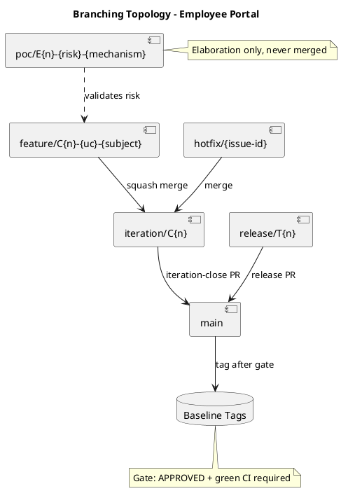
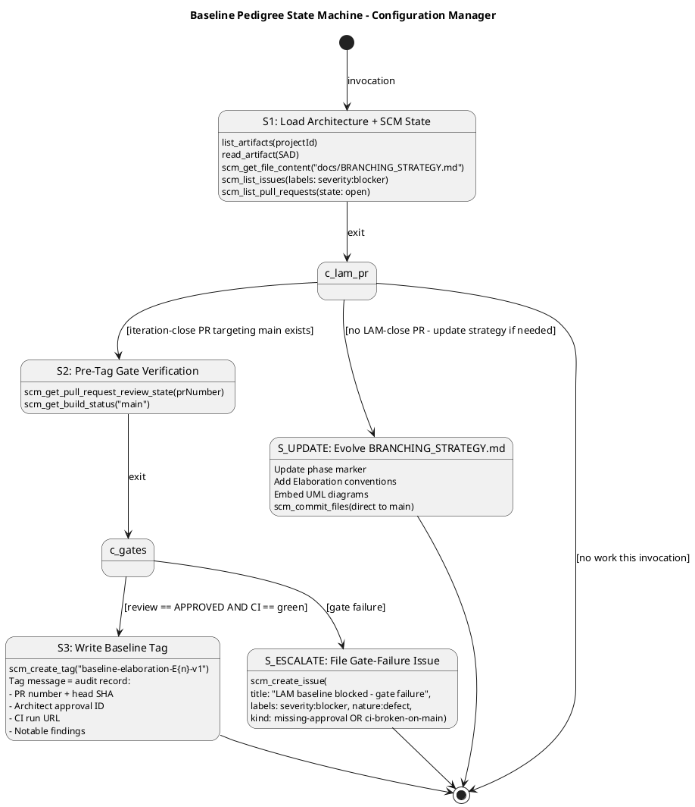

# Branching Strategy — Employee Portal (Cuba Corp)

**Project:** Demo Janke Lab — Employee Portal  
**Phase:** Elaboration | **Iteration:** 1 | **Cycle:** 1  
**Owner:** Configuration Manager  
**Last Updated:** 2026-07-07  

---

## 1. Purpose

This document defines the canonical branching model, naming conventions, baseline
procedure, and change-control integration for the Employee Portal project. It is
**config-as-code** — committed directly to `main` via `scm_commit_files`, never opened
as a PR. All roles (Implementer, Integrator, Reviewer, Architect) consume this file as
the authoritative source for branch and tag conventions.

**RUP Anchor:** RUP Ch.13 — *Manage Baselines and Releases*: baselines are created at
ends of iterations and at project and delivery milestones. Naming conventions
facilitate communication in larger projects.

---

## 2. Configuration Item Identification Scheme

| CI Category | Identification Scheme | Example |
|---|---|---|
| Source code | File path in Git repository | `src/Portal/Services/ClockService.cs` |
| RUP artifacts | Artifact name (canonical, validated by upsert) | `Vision Document`, `Use Case Model` |
| Branches | `{prefix}/{identifier}` (see §3) | `feature/C1-UC01-clock-in-out` |
| Baseline tags | `baseline-{phase}{n}-v{x}` (see §5) | `baseline-elaboration-E1-v1` |
| Change Requests | GitHub Issues with `change-request` label | Issue #42 |
| CI pipeline | `.github/workflows/{name}.yml` | `ci-build.yml` |
| Documentation | `docs/{FILENAME}.md` | `docs/BRANCHING_STRATEGY.md` |
| Architecture decisions | ADR records in SAD | `ADR-001`, `ADR-002`, `ADR-003` |
| Design mechanisms | Mechanism entries in SAD §Design Mechanisms | `DM-AUTH-01`, `DM-OFFLINE-01` |
| Components | Component IDs in SAD | `COMP-A1`, `COMP-D4`, `COMP-I5` |

---

## 3. Branch Naming Conventions

| Prefix | Pattern | Phase | Lifecycle | Merged To |
|---|---|---|---|---|
| `poc/` | `poc/E{n}-{risk-id}-{mechanism}` | Elaboration | Ephemeral, never merged | (discarded) |
| `feature/` | `feature/C{n}-{uc-id}-{subject}` | Construction | Per-UC, short-lived | `iteration/C{n}` |
| `iteration/` | `iteration/C{n}` | Construction | Integration workspace | `main` (via PR) |
| `release/` | `release/T{n}` | Transition | Release stabilization | `main` (via PR) |
| `hotfix/` | `hotfix/{issue-id}` | Transition | Critical fix, short-lived | `release/T{n}` or `main` |
| `chore/` | `chore/{subject}` | Any | Non-functional maintenance | `main` (direct commit) |

**Non-conforming branches** are surfaced as SCM issues with `severity:minor` +
`nature:defect` + `naming-violation` labels. The Configuration Manager does NOT
auto-rename; the branch owner must correct.

---

## 4. Branching Topology Diagram

The following component diagram shows the workspace hierarchy from developer branches
through integration to production baselines:

**Key relationships:**
- PoC branches validate architectural risks in Elaboration; they are never merged.
- Feature branches squash-merge into the iteration integration branch.
- Iteration and release branches merge to `main` via PRs requiring Architect approval.
- Baseline tags are written on `main` only after the pre-tag gate passes.

---

## 5. Baseline Tag Naming Convention

**Canonical pattern:** `baseline-{phase}{n}-v{x}`

| Phase | Tag Pattern | Example | Written At |
|---|---|---|---|
| Elaboration | `baseline-elaboration-E{n}-v{x}` | `baseline-elaboration-E1-v1` | End of Elaboration iteration (LAM) |
| Construction | `baseline-construction-C{n}-v{x}` | `baseline-construction-C1-v1` | End of Construction iteration |
| Transition | `baseline-transition-T{n}-v{x}` | `baseline-transition-T1-v1` | End of Transition release |

- `{n}` = iteration number (integer, starting at 1)
- `{x}` = patch version (integer, starting at 1)
- Re-tag (`v2`, `v3`, …) only after explicit rollback or post-baseline critical fix

---

## 6. Pre-Tag Audit Gate

A baseline tag is written **ONLY** when both gates pass:

1. **Review Gate:** `scm_get_pull_request_review_state(prNumber) == "APPROVED"`
   — The iteration-close PR must have consolidated Architect approval.
2. **CI Gate:** `scm_get_build_status("main") == "green"`
   — Post-merge CI on `main` must be green.

**Gate failure protocol:**
- File an SCM issue: `severity:blocker` + `nature:defect` + `missing-approval` or `ci-broken-on-main`
- DO NOT tag — wait for the blocker to clear
- Next invocation re-checks the gate

---

## 7. Baseline Pedigree State Machine

The following state machine defines the Configuration Manager's workflow for baseline
tagging:

---

## 8. Tag Message Audit Record

Every baseline tag message MUST contain:

| Field | Source | Example |
|---|---|---|
| Iteration-close PR number | `scm_list_pull_requests` | PR #15 |
| Head commit SHA | PR metadata | `a1b2c3d4…` |
| Architect approval review ID | `scm_get_pull_request_review_state` | Review #42 (APPROVED) |
| `main` CI run URL | `scm_get_build_status` | `https://ci.example.com/run/123` |
| Notable findings | CM audit | Naming violations, deferred items |
| Re-tag justification (if v2+) | CM audit | "Post-baseline critical fix for …" |

---

## 9. Phase-Specific Conventions

### 9.1 Elaboration (Current Phase)

- **PoC branches:** `poc/E{n}-{risk-id}-{mechanism}` — ephemeral, never merged to `main`.
  - Example: `poc/E1-RISK-T01-offline-sync` (validates offline fault tolerance mechanism)
  - Example: `poc/E1-RISK-T02-ad-ldap-bind` (validates AD authentication mechanism)
- **Baseline tags:** `baseline-elaboration-E{n}-v1` — written at iteration close when LAM gate passes.
- **Architecture baseline:** The Elaboration baseline freezes the approved SAD (all 4+1 views),
  Design Model, and Supplementary Specification as the architectural foundation for Construction.
- **LAM gate:** The iteration-close PR must be APPROVED by the Architect, confirming the
  architecture is stable and all architecturally significant risks are resolved.

### 9.2 Construction

- Feature branches: `feature/C{n}-{uc-id}-{subject}`.
- Integration branches: `iteration/C{n}`.
- Baseline tags: `baseline-construction-C{n}-v1`.
- Feature PRs reviewed by Reviewer; iteration-close PR reviewed by Architect.

### 9.3 Transition

- Release branches: `release/T{n}`.
- Hotfix branches: `hotfix/{issue-id}`.
- Baseline tags: `baseline-transition-T{n}-v{x}`.

---

## 10. Change Control Integration

Change Requests flow as GitHub Issues with the `change-request` label. The Change
Control Manager (CCM) owns the CR state machine (`cr:new` → `cr:approved` →
`cr:complete`). The Configuration Manager consumes CCM-triaged outcomes indirectly
via the branches and PRs they authorize.

| CR State | Label | CM Action |
|---|---|---|
| New | `cr:new` | None — CCM triages |
| Approved | `cr:approved` | Authorizes branch creation |
| Complete | `cr:complete` | Included in next baseline tag audit |
| Rejected | `cr:rejected` | No branch authorized |

---

## 11. Naming Violation Escalation

When a non-conforming branch is detected (e.g., `fix-stuff-john` instead of
`feature/C1-UC01-clock-in-out`), the Configuration Manager files an SCM issue:

- **Title:** `Naming convention violation: {branch_name}`
- **Labels:** `severity:minor`, `nature:defect`, `naming-violation`
- **Body:** Expected pattern, actual name, remediation instruction

The branch owner must correct the name. The CM does NOT auto-rename.

---

## 12. Traceability

| Element | Traces From | Link Type | Traces To |
|---|---|---|---|
| BRANCHING_STRATEGY.md | Development Case (CM discipline active) | Refines | All branch/tag operations |
| Branch naming conventions | RUP Ch.13 (Manage Baselines and Releases) | Derives | Implementer, Integrator, Reviewer workflows |
| Baseline tag convention | RUP Ch.13 (baseline at iteration close) | Derives | scm_create_tag operations |
| Pre-tag audit gate | RUP Ch.13 (baseline integrity) | Derives | scm_get_pull_request_review_state, scm_get_build_status |
| Change control integration | RUP Ch.13 (Change Control Board) | Derives | GitHub Issues (cr:* labels) |
| CI item identification | Development Case (Tool Assessment) | Refines | .github/workflows/ |
| Branching topology diagram | RUP Ch.13 (workspace hierarchy) | Derives | Integrator, Implementer branch creation |
| Baseline pedigree state machine | RUP Ch.13 (baseline procedure) | Derives | Configuration Manager workflow |
| Elaboration baseline convention | SAD (LAM milestone target) | Refines | baseline-elaboration-E1-v1 tag |
