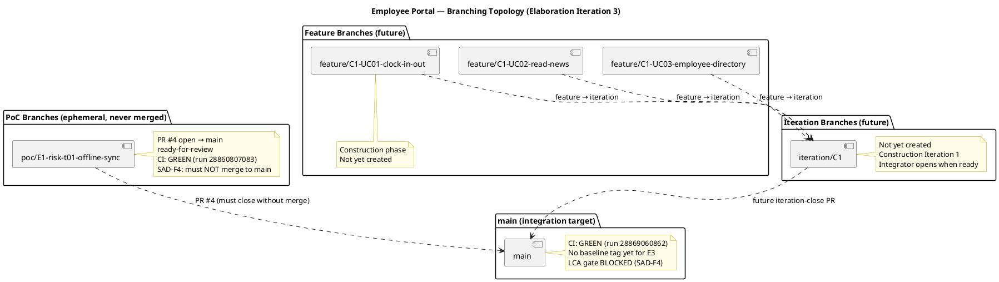
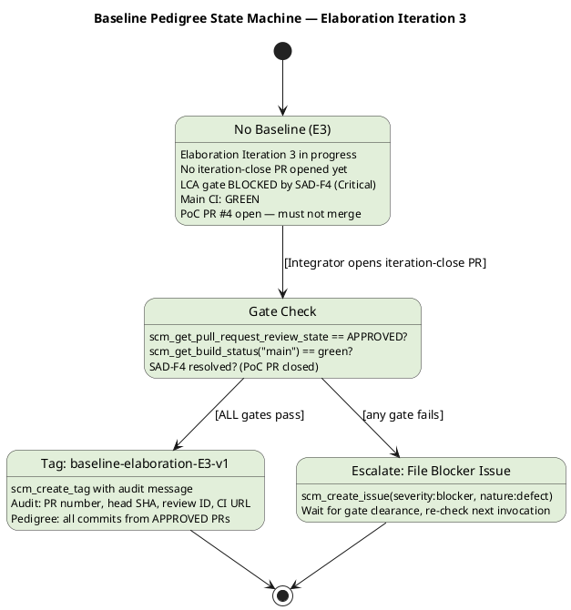
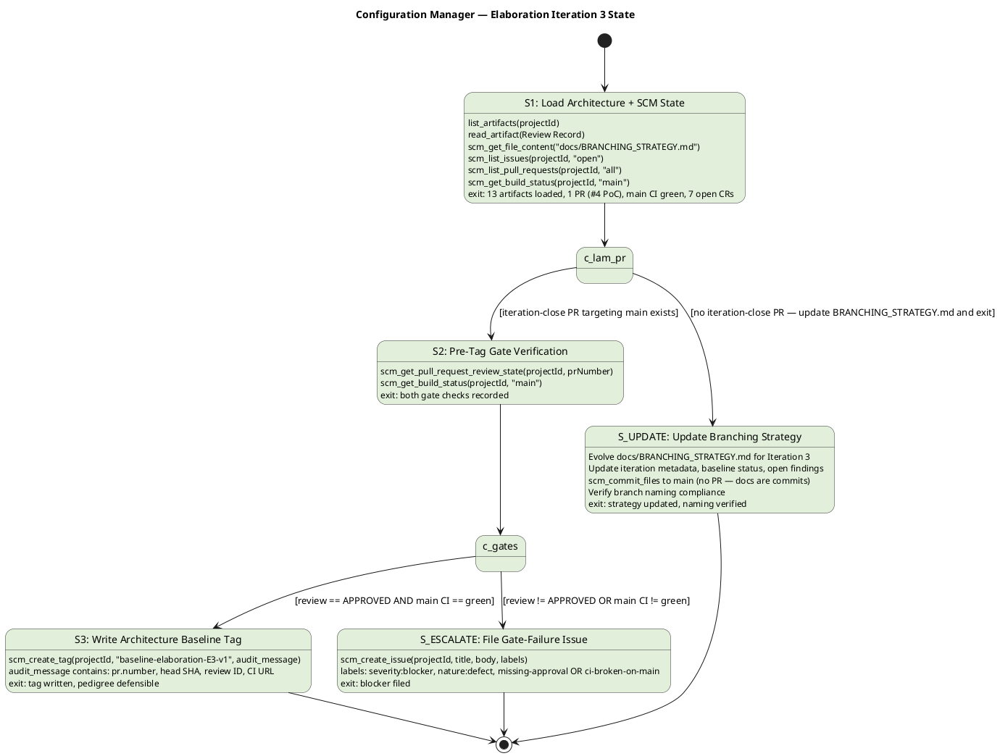

# Branching Strategy — Employee Portal (Cuba Corp)

**Project:** Demo Janke Lab — Employee Portal  
**Phase:** Elaboration | **Iteration:** 3 | **Cycle:** 1  
**Owner:** Configuration Manager  
**Last Updated:** 2026-07-08  

---

## 1. Purpose

This document defines the canonical branching model, naming conventions, baseline
procedure, and change-control integration for the Employee Portal project. It is
**config-as-code** — committed directly to `main` via `scm_commit_files`, never opened
as a PR. All roles (Implementer, Integrator, Reviewer, Architect) consume this file as
the authoritative source for branch and tag conventions.

**RUP Anchor:** RUP Ch.13 — *Manage Baselines and Releases*: baselines are created at
ends of iterations and at project and delivery milestones. Naming conventions
facilitate communication in larger projects.

---

## 2. Configuration Item Identification Scheme

| CI Category | Identification Scheme | Example |
|---|---|---|
| Source code | File path in Git repository | `src/Portal/Services/ClockService.cs` |
| RUP artifacts | Artifact name (canonical, validated by upsert) | `Vision Document`, `Use Case Model` |
| Branches | `{prefix}/{identifier}` (see §3) | `feature/C1-UC01-clock-in-out` |
| Baseline tags | `baseline-{phase}{n}-v{x}` (see §5) | `baseline-elaboration-E3-v1` |
| Change Requests | GitHub Issues with `change-request` label | Issue #42 |
| CI pipeline | `.github/workflows/{name}.yml` | `ci-build.yml` |
| Documentation | `docs/{FILENAME}.md` | `docs/BRANCHING_STRATEGY.md` |
| Architecture decisions | ADR records in SAD | `ADR-001`, `ADR-002`, `ADR-003` |
| Design mechanisms | Mechanism entries in SAD | `MECH-001` (persistence), `MECH-002` (auth) |
| Test artifacts | Test Case IDs | `TC-001`, `TC-002` |

---

## 3. Branch Naming Conventions

| Prefix | Pattern | Purpose | Lifecycle |
|---|---|---|---|
| `poc/` | `poc/E{n}-{risk-id}-{mechanism}` | Elaboration proof-of-concept spikes | Ephemeral — **never merged to main** |
| `feature/` | `feature/C{n}-{uc-id}-{subject}` | Construction feature implementation | Merged into `iteration/C{n}` via PR |
| `iteration/` | `iteration/C{n}` | Integration workspace per iteration | Merged into `main` via iteration-close PR |
| `hotfix/` | `hotfix/{issue-id}` | Transition hotfixes | Merged directly into `main` via PR |
| `chore/` | `chore/{subject}` | Non-functional repo maintenance | Merged directly into `main` via PR |

**Non-conforming branches** are surfaced as SCM issues with `severity:minor` +
`nature:defect` + `naming-violation` labels.

### 3.1 Current Branch Inventory (Iteration 3)

| Branch | Type | Status | CI | Notes |
|---|---|---|---|---|
| `main` | Integration target | Active | GREEN (run 28869060862) | No E3 baseline tag yet |
| `poc/E1-risk-t01-offline-sync` | PoC | PR #4 open → main | GREEN (run 28860807083) | **SAD-F4: must NOT merge to main** — PoC branches are ephemeral |

---

## 4. Branching Topology

---

## 5. Baseline Tagging Procedure

### 5.1 Tag Naming Convention

| Phase | Tag Pattern | Example |
|---|---|---|
| Elaboration | `baseline-elaboration-E{n}-v{x}` | `baseline-elaboration-E3-v1` |
| Construction | `baseline-construction-C{n}-v{x}` | `baseline-construction-C1-v1` |
| Transition | `baseline-transition-T{n}-v{x}` | `baseline-transition-T1-v1` |

- `{n}` = iteration number (integer, starting at 1)
- `{x}` = patch version (integer, starting at 1)
- Re-tag (`v2`, `v3`, …) only after explicit rollback or post-baseline critical fix

### 5.2 Pre-Tag Audit Gate (MANDATORY)

Before any `scm_create_tag`, the Configuration Manager MUST verify:

1. **Review Gate:** `scm_get_pull_request_review_state(projectId, prNumber) == "APPROVED"`
   on the iteration-close PR
2. **CI Gate:** `scm_get_build_status(projectId, "main") == green` after the merge

Either fails → file an Issue (`severity:blocker` + `nature:defect` + kind label) and
DO NOT tag.

### 5.3 Tag Message (Audit Record)

The tag message MUST contain:
- Iteration-close PR number and head commit SHA
- Architect approval review ID
- `main` CI run URL at tag time
- Any notable findings (naming violations, deferred items, re-tag justifications)

### 5.4 Current Baseline Status (Iteration 3)

| Baseline | Tag | Status | Gate |
|---|---|---|---|
| Elaboration E1 | `baseline-elaboration-E1-v1` | Written (Iteration 1) | Passed |
| Elaboration E2 | `baseline-elaboration-E2-v1` | Written (Iteration 2) | Passed |
| Elaboration E3 | `baseline-elaboration-E3-v1` | **NOT YET WRITTEN** | **BLOCKED** — no iteration-close PR; SAD-F4 (Critical) open |

**Blocking conditions for E3 baseline:**
1. No iteration-close PR (`iteration/Cn → main`) has been opened by the Integrator
2. SAD-F4 (Critical): PR #4 (PoC code) is open against main — must be closed without merging
3. IA-F2 (Major): Iteration Assessment not updated for Iteration 2

The LCA milestone gate remains CLOSED per the Review Coordinator's verdict.

---

## 6. Baseline Pedigree State Machine

---

## 7. Configuration Manager State Machine (Iteration 3)

---

## 8. Change Control Integration

### 8.1 CR Label Convention

| Label | Meaning |
|---|---|
| `change-request` | Issue is a formal Change Request |
| `cr:new` | Newly logged, awaiting triage |
| `cr:logged` | Triaged and logged in Risk List / artifacts |
| `cr:approved` | Approved by CCB (Change Control Manager) |
| `cr:complete` | Implemented and verified |
| `severity:blocker` | Blocks baseline / milestone gate |
| `severity:major` | Major impact, must resolve before gate |
| `severity:minor` | Minor impact, can defer |
| `nature:defect` | Defect in existing work product |
| `nature:enhancement` | Enhancement to existing work product |
| `impact:architectural` | Affects architecture decisions |
| `impact:cross-cutting` | Affects multiple components |
| `impact:local` | Localized to single component |
| `naming-violation` | Branch/PR naming convention violation |
| `needs-architect-review` | Requires Architect evaluation |

### 8.2 Open Change Requests (Iteration 3)

| Issue # | Title | Severity | Status | Assigned |
|---|---|---|---|---|
| #1 | CR-001: Update Vision Document Control iteration marker | Minor | cr:approved | (deferred F6) |
| #2 | CR-002: Update Iteration Assessment objective statuses | Minor | cr:approved | (deferred F7) |
| #3 | CR-003: Formalize design file impact assessment | Major | cr:logged | needs-architect-review |
| #5 | CR: PoC architecture validation tests excluded from CI | Major | cr:approved | assigned:implementer |
| #6 | CR: Main branch SmokeTest.cs is placeholder | Minor | cr:approved | assigned:implementer |
| #7 | CR: TcpHealthMonitor sync-over-async pattern | Major | cr:logged | needs-architect-review |
| #8 | CR: SqliteLocalStore reflection on init-only properties | Minor | cr:logged | needs-architect-review |

**No `severity:blocker` issues are open.** The LCA gate is blocked by Review Record
findings (SAD-F4, IA-F2), not by SCM issues.

---

## 9. Open Review Findings Impacting Baseline

| Finding ID | Artifact | Severity | Impact on Baseline |
|---|---|---|---|
| SAD-F4 | Software Architecture Document | **Critical** | PR #4 (PoC) must not merge to main — blocks LCA gate; baseline cannot be written until resolved |
| IA-F2 | Iteration Assessment | **Major** | Iteration Assessment not updated — blocks LCA gate independently |
| DM-MR-F1 | Design Model | Minor | Deferred to Construction Iter 1 — no baseline impact |
| IP-F1 | Iteration Plan | Minor | Metadata typo — no baseline impact |
| IA-F1 | Iteration Assessment | Minor | Stale objectives — no baseline impact |
| PoC-F1 | Architectural Proof-of-Concept | Minor | LAM typo — no baseline impact |

**Baseline gate assessment:** The E3 baseline tag CANNOT be written until:
1. SAD-F4 is resolved (PR #4 closed without merging)
2. IA-F2 is resolved (Iteration Assessment updated)
3. An iteration-close PR is opened, reviewed, and APPROVED
4. Post-merge `main` CI is GREEN

---

## 10. Naming Compliance Audit

| Branch | Conforms? | Pattern Matched |
|---|---|---|
| `main` | ✅ | Default branch |
| `poc/E1-risk-t01-offline-sync` | ✅ | `poc/E{n}-{risk-id}-{mechanism}` |

No naming violations detected in Iteration 3.

---

## 11. Traceability

| Element | Traces From | Link Type | Traces To |
|---|---|---|---|
| Branch naming conventions | RUP Ch.13 (Manage Baselines and Releases) | Derives | Implementer, Integrator, Reviewer workflows |
| Baseline tag convention | RUP Ch.13 (baseline at iteration close) | Derives | scm_create_tag operations |
| Pre-tag audit gate | RUP Ch.13 (baseline integrity) | Derives | scm_get_pull_request_review_state, scm_get_build_status |
| Change control integration | RUP Ch.13 (Change Control Board) | Derives | GitHub Issues (cr:* labels) |
| CI item identification | Development Case (Tool Assessment) | Refines | .github/workflows/ |
| Branching topology diagram | RUP Ch.13 (workspace hierarchy) | Derives | Integrator, Implementer branch creation |
| Baseline pedigree state machine | RUP Ch.13 (baseline procedure) | Derives | Configuration Manager workflow |
| Elaboration baseline convention | SAD (LCA milestone target) | Refines | baseline-elaboration-E3-v1 tag (pending) |
| PoC branch evidence | Architectural Proof-of-Concept (PoC-1) | Derives | CI run 28860807083 |
| SAD-F4 finding | Review Record (Elaboration Iter 2) | Reviews | PR #4, LCA gate, E3 baseline |
| IA-F2 finding | Review Record (Elaboration Iter 2) | Reviews | Iteration Assessment, LCA gate |
| Open CRs (#1-#8) | Change Control Manager triage | Derives | Branch creation, PR authorization |
