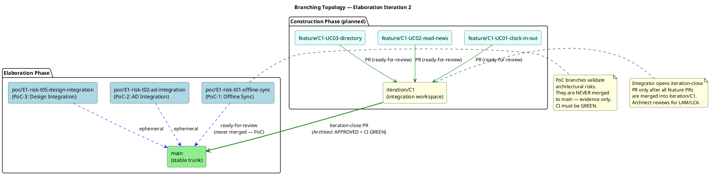
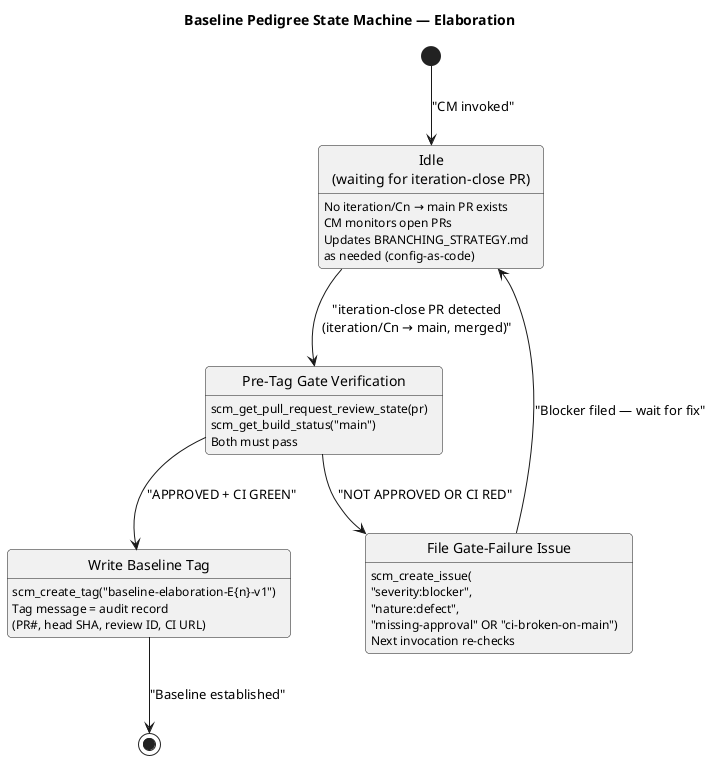

# Branching Strategy — Employee Portal (Cuba Corp)

**Project:** Demo Janke Lab — Employee Portal  
**Phase:** Elaboration | **Iteration:** 2 | **Cycle:** 1  
**Owner:** Configuration Manager  
**Last Updated:** 2026-07-07  

---

## 1. Purpose

This document defines the canonical branching model, naming conventions, baseline
procedure, and change-control integration for the Employee Portal project. It is
**config-as-code** — committed directly to `main` via `scm_commit_files`, never opened
as a PR. All roles (Implementer, Integrator, Reviewer, Architect) consume this file as
the authoritative source for branch and tag conventions.

**RUP Anchor:** RUP Ch.13 — *Manage Baselines and Releases*: baselines are created at
ends of iterations and at project and delivery milestones. Naming conventions
facilitate communication in larger projects.

---

## 2. Configuration Item Identification Scheme

| CI Category | Identification Scheme | Example |
|---|---|---|
| Source code | File path in Git repository | `src/Portal/Services/ClockService.cs` |
| RUP artifacts | Artifact name (canonical, validated by upsert) | `Vision Document`, `Use Case Model` |
| Branches | `{prefix}/{identifier}` (see §3) | `feature/C1-UC01-clock-in-out` |
| Baseline tags | `baseline-{phase}{n}-v{x}` (see §5) | `baseline-elaboration-E2-v1` |
| Change Requests | GitHub Issues with `change-request` label | Issue #42 |
| CI pipeline | `.github/workflows/{name}.yml` | `ci-build.yml` |
| Documentation | `docs/{FILENAME}.md` | `docs/BRANCHING_STRATEGY.md` |
| Architecture decisions | ADR records in SAD | `ADR-001`, `ADR-002`, `ADR-003` |
| Design mechanisms | Mechanism entries in SAD | `DM-001` (Offline Sync Queue) |
| PoC branches | `poc/E{n}-{risk-id}-{mechanism}` | `poc/E1-risk-t01-offline-sync` |
| PoC evidence | CI run URL + branch name in PoC artifact | `actions/runs/28860807083` |

---

## 3. Branch Naming Conventions

| Prefix | Pattern | Phase | Lifecycle | Merge Target |
|---|---|---|---|---|
| `poc/` | `poc/E{n}-{risk-id}-{mechanism}` | Elaboration | Ephemeral — never merged to main | None (evidence only) |
| `feature/` | `feature/C{n}-{uc-id}-{subject}` | Construction | Short-lived, one UC | `iteration/C{n}` |
| `iteration/` | `iteration/C{n}` | Construction | Integration workspace | `main` (iteration-close PR) |
| `hotfix/` | `hotfix/{issue-id}` | Transition | Emergency fix | `main` (fast-track PR) |
| `chore/` | `chore/{subject}` | Any | Non-functional maintenance | `main` (direct commit for docs) |

### Non-Conformance Handling

Non-conforming branches are surfaced as SCM issues with labels:
- `severity:minor`
- `nature:defect`
- `naming-violation`

The Configuration Manager does NOT auto-rename branches. The issue notifies the
responsible role to correct the naming.

---

## 4. Branching Topology



### Current Elaboration Branch Inventory

| Branch | Type | Status | CI | Notes |
|---|---|---|---|---|
| `main` | Trunk | Stable | GREEN (run 28860381346) | All artifacts + BRANCHING_STRATEGY.md |
| `poc/E1-risk-t01-offline-sync` | PoC | Open PR #4 (ready-for-review) | GREEN (run 28860807083) | PoC-1: Offline Sync mechanism validation |

### Planned Construction Branches (per Iteration Plan)

| Branch | Type | UC | Priority |
|---|---|---|---|
| `feature/C1-UC01-clock-in-out` | Feature | UC-001 | Highest (RISK-T01) |
| `feature/C1-UC02-read-news` | Feature | UC-002 | Medium |
| `feature/C1-UC03-directory` | Feature | UC-003 | Medium |
| `iteration/C1` | Integration | — | Bottom-up integration order |

---

## 5. Baseline Identification Scheme

### Tag Naming Convention

```
baseline-{phase}{n}-v{x}
```

Where:
- `{phase}` ∈ {`elaboration`, `construction`, `transition`}
- `{n}` = iteration number (integer)
- `{x}` = patch version (integer, starts at 1; re-tag v2+ only after rollback)

### Elaboration Baselines

| Tag | Iteration | Status | Gate Evidence |
|---|---|---|---|
| `baseline-elaboration-E1-v1` | E1 | **DEFERRED** | No iteration-close PR existed for E1 (PoC-only iteration) |
| `baseline-elaboration-E2-v1` | E2 | **PENDING** | Awaiting iteration-close PR (`iteration/Cn → main`) with Architect APPROVED + CI GREEN |

### Construction Baselines (Planned)

| Tag | Iteration | Status |
|---|---|---|
| `baseline-construction-C1-v1` | C1 | Planned |
| `baseline-construction-C2-v1` | C2 | Planned |

### Transition Baselines (Planned)

| Tag | Release | Status |
|---|---|---|
| `baseline-transition-T1-v1` | T1 | Planned |

---

## 6. Pre-Tag Audit Gate

Before any `scm_create_tag`, the Configuration Manager MUST verify:

1. **Review Gate:** `scm_get_pull_request_review_state(projectId, prNumber) == "APPROVED"`
2. **CI Gate:** `scm_get_build_status(projectId, "main") == green` (post-merge)

Either fails → file an Issue with labels:
- `severity:blocker`
- `nature:defect`
- `missing-approval` (review gate) OR `ci-broken-on-main` (CI gate)

### Baseline Pedigree State Machine



---

## 7. Change Control Integration

Change Requests are managed as GitHub Issues with the following label state machine:

| State Label | Meaning | Owner |
|---|---|---|
| `cr:new` | CR submitted, awaiting triage | Change Control Manager |
| `cr:approved` | CCB approved, ready for implementation | Change Control Manager |
| `cr:complete` | Implementation done, verified | Change Control Manager |
| `cr:rejected` | CCB rejected | Change Control Manager |
| `cr:deferred` | Deferred to later iteration | Change Control Manager |

The Configuration Manager consumes CCM-triaged outcomes indirectly via the branches
and PRs they authorize. The CM does NOT triage CRs or make CCB decisions.

---

## 8. CI Pipeline Configuration

| Workflow | Path | Triggers | Purpose |
|---|---|---|---|
| `ci-build.yml` | `.github/workflows/ci-build.yml` | Push to any branch, PR | Build + test + lint |

### CI Status at Elaboration Iteration 2

| Branch | Status | Run ID | Timestamp |
|---|---|---|---|
| `main` | GREEN | 28860381346 | 2026-07-07 10:46:13Z |
| `poc/E1-risk-t01-offline-sync` | GREEN | 28860807083 | 2026-07-07 10:54:17Z |

---

## 9. Iteration History

| Iteration | Phase | Baseline Tag | PR | CI | Notes |
|---|---|---|---|---|---|
| E1 | Elaboration | DEFERRED | N/A | GREEN | PoC-only iteration; no iteration-close PR |
| E2 | Elaboration | PENDING | Awaiting | GREEN | Awaiting iteration-close PR from Integrator |

---

## 10. Elaboration Iteration 2 Update Notes

- **BRANCHING_STRATEGY.md** updated from Iteration 1 to Iteration 2 metadata.
- **PoC branch evidence recorded:** `poc/E1-risk-t01-offline-sync` (PR #4, CI GREEN).
- **Baseline tag `baseline-elaboration-E2-v1` status: PENDING** — no iteration-close PR
  (`iteration/Cn → main`) exists yet. The Integrator must open and merge this PR with
  Architect APPROVED review state before the CM can write the tag.
- **No blocker issues open** — all gates are in a waiting state, not a failure state.
- **No naming violations detected** — all branches conform to §3 conventions.
- **Review Record findings (SAD-F2, SAD-F3, DC-F2, RL-F1, MR-RL-F1, DM-F1, TC-F1)**
  do not target CM artifacts. BRANCHING_STRATEGY.md is PRESERVED from findings.

---

## Traceability

| Element | Traces From | Link Type | Traces To |
|---|---|---|---|
| BRANCHING_STRATEGY.md | Development Case (CM discipline active) | Refines | All branch/tag operations |
| Branch naming conventions | RUP Ch.13 (Manage Baselines and Releases) | Derives | Implementer, Integrator, Reviewer workflows |
| Baseline tag convention | RUP Ch.13 (baseline at iteration close) | Derives | scm_create_tag operations |
| Pre-tag audit gate | RUP Ch.13 (baseline integrity) | Derives | scm_get_pull_request_review_state, scm_get_build_status |
| Change control integration | RUP Ch.13 (Change Control Board) | Derives | GitHub Issues (cr:* labels) |
| CI item identification | Development Case (Tool Assessment) | Refines | .github/workflows/ |
| Branching topology diagram | RUP Ch.13 (workspace hierarchy) | Derives | Integrator, Implementer branch creation |
| Baseline pedigree state machine | RUP Ch.13 (baseline procedure) | Derives | Configuration Manager workflow |
| Elaboration baseline convention | SAD (LCA milestone target) | Refines | baseline-elaboration-E2-v1 tag |
| PoC branch evidence | Architectural Proof-of-Concept (PoC-1) | Derives | CI run 28860807083 |
