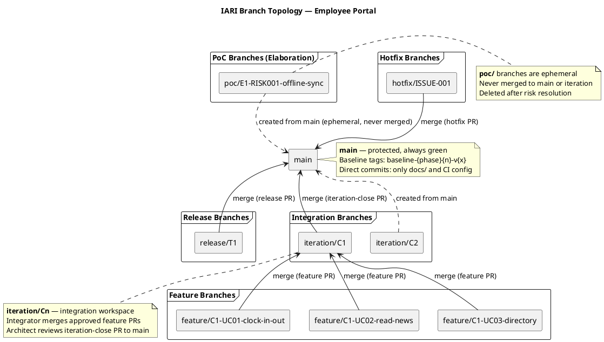
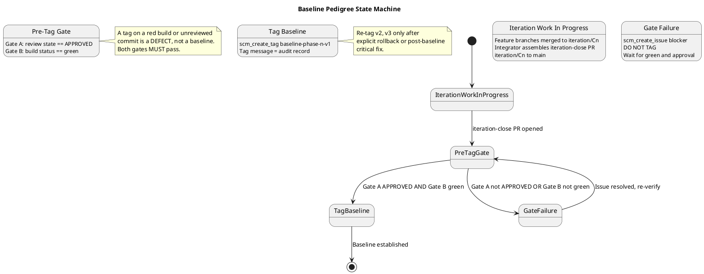

# Branching Strategy — Employee Portal (Cuba Corp)

**Project:** Demo Janke Lab — Employee Portal  
**Phase:** Inception | **Iteration:** 1 | **Cycle:** 1  
**Owner:** Configuration Manager  
**Last Updated:** 2026-07-06  

---

## 1. Purpose

This document defines the canonical branching model, naming conventions, baseline
procedure, and change-control integration for the Employee Portal project. It is
**config-as-code** — committed directly to `main` via `scm_commit_files`, never opened
as a PR. All roles (Implementer, Integrator, Reviewer, Architect) consume this file as
the authoritative source for branch and tag conventions.

**RUP Anchor:** RUP Ch.13 — *Manage Baselines and Releases*: baselines are created at
ends of iterations and at project and delivery milestones. Naming conventions
facilitate communication in larger projects.

---

## 2. Configuration Item Identification Scheme

| CI Category | Identification Scheme | Example |
|---|---|---|
| Source code | File path in Git repository | `src/Portal/Services/ClockService.cs` |
| RUP artifacts | Artifact name (canonical, validated by upsert) | `Vision Document`, `Use Case Model` |
| Branches | `{prefix}/{identifier}` (see §3) | `feature/C1-UC01-clock-in-out` |
| Baseline tags | `baseline-{phase}{n}-v{x}` (see §5) | `baseline-construction-C1-v1` |
| Change Requests | GitHub Issues with `change-request` label | Issue #42 |
| CI pipeline | `.github/workflows/{name}.yml` | `ci-build.yml` |
| Documentation | `docs/{FILENAME}.md` | `docs/BRANCHING_STRATEGY.md` |

---

## 3. Branch Naming Conventions

| Prefix | Pattern | Phase | Lifecycle | Merged To |
|---|---|---|---|---|
| `poc/` | `poc/E{n}-{risk-id}-{mechanism}` | Elaboration | Ephemeral, deleted after risk resolution | **Never merged** |
| `feature/` | `feature/C{n}-{uc-id}-{subject}` | Construction | Short-lived, one UC per branch | `iteration/C{n}` |
| `iteration/` | `iteration/C{n}` | Construction | Integration workspace per iteration | `main` (iteration-close PR) |
| `hotfix/` | `hotfix/{issue-id}` | Transition | Emergency fix from `main` | `main` (hotfix PR) |
| `chore/` | `chore/{subject}` | Any | Non-functional maintenance (docs, CI config) | `main` (direct commit for docs) |
| `release/` | `release/T{n}` | Transition | Release stabilization | `main` (release PR) |

### Rules

1. **No bare branches.** Every branch MUST carry a recognized prefix.
2. **One UC per feature branch.** `feature/C1-UC01-clock-in-out` implements only UC-001.
3. **PoC branches are ephemeral.** They exist to resolve an Elaboration risk; they are
   never merged and are deleted after the risk is retired.
4. **Non-conforming branches** are surfaced as SCM issues with labels
   `severity:minor`, `nature:defect`, `naming-violation`. The Configuration Manager
   does NOT auto-rename.

---

## 4. Branch Topology Diagram

### Topology Summary

- **`main`** — protected trunk. Always green. Receives merges only from APPROVED PRs.
  Direct commits allowed ONLY for `docs/` and CI configuration files.
- **`iteration/C{n}`** — integration workspace. The Integrator merges approved feature
  PRs here. At iteration close, an iteration-close PR (`iteration/C{n}` → `main`) is
  opened for Architect review.
- **`feature/C{n}-{uc-id}-{subject}`** — developer workspace. One use case per branch.
  Merged to `iteration/C{n}` after Reviewer approval.
- **`poc/E{n}-{risk-id}-{mechanism}`** — Elaboration proof-of-concept. Ephemeral.
  Never merged. Deleted after risk resolution.
- **`hotfix/{issue-id}`** — Transition emergency fix. Created from `main`, merged back
  to `main` via hotfix PR.
- **`release/T{n}`** — Transition release stabilization. Created from `main`, merged
  back via release PR.

---

## 5. Baseline Tagging Convention

### 5.1 Naming

| Phase | Tag Pattern | Example |
|---|---|---|
| Elaboration | `baseline-elaboration-E{n}-v{x}` | `baseline-elaboration-E1-v1` |
| Construction | `baseline-construction-C{n}-v{x}` | `baseline-construction-C1-v1` |
| Transition | `baseline-transition-T{n}-v{x}` | `baseline-transition-T1-v1` |

- `{n}` = iteration number (integer, starting at 1)
- `{x}` = patch version (integer, starting at 1)
- Re-tag (`v2`, `v3`, …) ONLY after an explicit rollback or post-baseline critical fix

### 5.2 Pre-Tag Audit Gate (MANDATORY)

Before ANY `scm_create_tag`, the Configuration Manager MUST verify two gates:

1. **Gate A — Architectural Approval:** `scm_get_pull_request_review_state` on the
   iteration-close PR returns `APPROVED`.
2. **Gate B — CI Green:** `scm_get_build_status("main")` returns `green` AFTER the
   merge to `main`.

**Either gate fails → file an SCM issue** (`severity:blocker`, `nature:defect`) and
**DO NOT TAG.** Wait for resolution, then re-verify both gates.

### 5.3 Tag Message (Audit Record)

Every baseline tag message MUST contain:

- Iteration-close PR number and head commit SHA
- Architect approval review ID
- `main` CI run URL at tag time
- Notable findings (naming violations, deferred items, re-tag justifications)

### 5.4 Baseline Pedigree State Machine

---

## 6. Change Control Integration

### 6.1 Change Request Workflow

Change Requests are managed as GitHub Issues by the **Change Control Manager (CCM)**.
The Configuration Manager does NOT triage CRs or make CCB decisions. The CM consumes
CCM-triaged outcomes indirectly via the branches and PRs they authorize.

| CR State | Label | Owner | CM Action |
|---|---|---|---|
| New | `cr:new` | CCM | None — monitor |
| Approved | `cr:approved` | CCM → Implementer | Authorize branch creation per §3 |
| Complete | `cr:complete` | CCM | Verify branch/PR exists for the CR |
| Rejected | `cr:rejected` | CCM | No branch expected |

### 6.2 Change Control Board (CCB)

For this lightweight internal-portal project, the CCB is informal:

- **Members:** Laura Gómez (HR Director / Sponsor), Miguel Torres (Technical Advisor)
- **Quorum:** Sponsor or Technical Advisor
- **Decision scope:** Scope changes, priority re-ordering, new requirements
- **Meeting cadence:** As-needed, triggered by `cr:new` issues with `priority-high` label

### 6.3 Escalation Paths

| Condition | Escalation | Issue Labels |
|---|---|---|
| Gate failure (red CI or unreviewed PR) | SCM Issue | `severity:blocker`, `nature:defect` |
| Branch naming violation | SCM Issue | `severity:minor`, `nature:defect`, `naming-violation` |
| Missing upstream artifact | SCM Issue | `severity:blocker`, `nature:defect`, `missing-upstream` |

---

## 7. Configuration Audit Procedures

### 7.1 Functional Configuration Audit (FCA)

Performed at each baseline tag. The tag message records:
- Which use cases the iteration delivered (referencing UC IDs from the Use Case Model)
- Whether the iteration-close PR was APPROVED by the Architect
- CI status at tag time

### 7.2 Physical Configuration Audit (PCA)

Performed at each baseline tag. Verified by:
- `main` branch HEAD matches the merged iteration-close PR commit
- No uncommitted changes on `main` at tag time
- `docs/BRANCHING_STRATEGY.md` is current on `main`

### 7.3 Status Accounting

Status and measurement data (progress, aging, distribution, trends) flows to
dashboards that query the branch/PR/tag/Issue graph directly. The Configuration
Manager ensures the graph is queryable by keeping labels, branch naming, and tag
conventions consistent. No status report artifact is produced.

---

## 8. Tooling

| Tool | Purpose | Status |
|---|---|---|
| Git/SCM | Version control, branching, tagging | Active |
| GitHub Issues | Change Requests, gate-failure escalations | Active |
| GitHub Actions | CI pipeline (build + test on .NET 10) | To configure (Elaboration) |
| PlantUML | UML diagrams embedded in artifacts and this file | Active |
| Dashboards (Grafana/Metabase) | Status accounting via branch/PR/tag graph queries | Future |

---

## 9. Phase-Specific Notes

### 9.1 Inception (Current)

- **No baseline tags yet** — architecture is not stable. Baseline tagging begins in
  Elaboration when the architecture baseline is established.
- This file is published for the first time. Subsystem-aware refinement (e.g.,
  per-subsystem integration branches) is deferred to Elaboration when the Software
  Architecture Document enters.
- CI pipeline is not yet bootstrapped. Gate B (CI green) will become enforceable once
  GitHub Actions workflows are configured in Elaboration.

### 9.2 Elaboration (Upcoming)

- PoC branches (`poc/E{n}-{risk-id}-{mechanism}`) will be created for the primary
  technical risk: **offline fault tolerance** (5-min network drop, zero data loss for
  clock in/out).
- First baseline tag: `baseline-elaboration-E1-v1` (after iteration-close PR APPROVED
  + CI green).
- SAD-driven evolution of this file: subsystem-aware branch topology refinement.

### 9.3 Construction

- Feature branches per use case: `feature/C{n}-UC01-clock-in-out`,
  `feature/C{n}-UC02-read-news`, `feature/C{n}-UC03-directory`.
- Integration via `iteration/C{n}` branches.
- Baseline tags: `baseline-construction-C{n}-v1`.

### 9.4 Transition

- Release branches: `release/T{n}`.
- Hotfix branches: `hotfix/{issue-id}`.
- Baseline tags: `baseline-transition-T{n}-v{x}`.

---

## 10. Traceability

| Element | Traces From | Link Type | Traces To |
|---|---|---|---|
| BRANCHING_STRATEGY.md | Development Case (CM discipline active) | Refines | All branch/tag operations |
| Branch naming conventions | RUP Ch.13 (Manage Baselines and Releases) | Derives | Implementer, Integrator, Reviewer workflows |
| Baseline tag convention | RUP Ch.13 (baseline at iteration close) | Derives | scm_create_tag operations |
| Pre-tag audit gate | RUP Ch.13 (baseline integrity) | Derives | scm_get_pull_request_review_state, scm_get_build_status |
| Change control integration | RUP Ch.13 (Change Control Board) | Derives | GitHub Issues (cr:* labels) |
| CI item identification | Development Case (Tool Assessment) | Refines | .github/workflows/ |
