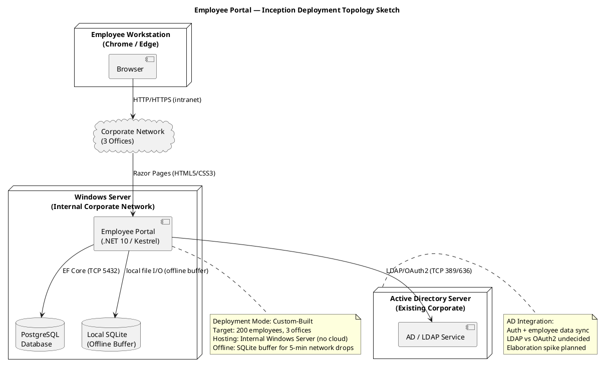

# Employee Portal — Deployment Strategy (Inception Baseline)

## Document Control

| Field | Value |
|---|---|
| Phase | Inception |
| Status | Draft |
| Iteration | 2 (Cycle 1) |
| Author | Deployment Manager |
| Milestone Target | End of Inception (LCO) |

## Deployment Mode

**Custom-Built** — The Employee Portal is developed specifically for Cuba Corp's intranet and deployed on internal infrastructure. No cloud hosting, no external access, no shrink-wrap packaging.

## Target User Community

- **200 employees** across **3 offices** (Havana, Santiago, Camagüey)
- HR staff (news publishing, directory management, clocking reports)
- General employees (clock in/out, read news, directory lookup)
- IT/Maintenance (Miguel Torres — server administration, AD integration)

## Target Environment

| Element | Detail |
|---|---|
| Hosting | Internal Windows Server (no cloud) |
| Web Server | Kestrel (bundled with .NET 10) |
| Database | PostgreSQL 16.x (same server) |
| Offline Buffer | SQLite (co-deployed, file-based) |
| Authentication | Active Directory via LDAP/OAuth2 (existing corporate AD server) |
| Client Browsers | Chrome and Edge (current versions only) |
| Network | Corporate intranet only — no external access |
| Availability | Mon–Fri 7:00–19:00 with fault tolerance |

## Deployment Topology Sketch

## Deployment Constraints

| ID | Constraint | Source | Impact |
|---|---|---|---|
| DC-001 | Backend: .NET 10, Frontend: Razor Pages | Declared (Technical) | Kestrel web server; no SPA build pipeline |
| DC-002 | Database: PostgreSQL | Declared (Technical) | PostgreSQL on same Windows Server |
| DC-003 | Auth via Active Directory (LDAP/OAuth2) | Declared (Architectural) | Portal connects to AD server (TCP 389/636) |
| DC-004 | Internal Windows Server hosting (no cloud) | Declared (Operational) | On-premises installation only |
| DC-005 | Chrome and Edge only | Declared (Technical) | Simplified browser support |
| DC-006 | Mon–Fri 7:00–19:00 availability with fault tolerance | Declared NFR | Graceful restart; offline buffer |
| DC-007 | 5-min offline fault tolerance, zero data loss | Declared NFR | SQLite offline buffer co-deployed |

## Deployment Risks

| Risk | RPN | Mitigation | Phase |
|---|---|---|---|
| AD integration method undecided (LDAP vs OAuth2) | 35 | Elaboration spike with Miguel Torres; fallback to local auth | Elaboration |
| AD data sync failure during deployment | 30 | Manual data import fallback; test sync before go-live | Elaboration |
| Single-server SPOF for 200 users | 20 | Acceptable for intranet scale; [RECOMMENDATION — requires CR: reverse proxy if >500 users] | Transition |

## Bill of Materials (Inception Baseline)

| Item | Version | Purpose | Status |
|---|---|---|---|
| .NET 10 SDK | 10.0.x | Application runtime and build | To be installed on Windows Server |
| PostgreSQL | 16.x | Primary database | To be installed on Windows Server |
| SQLite | (bundled with .NET) | Offline buffer for clock in/out | Co-deployed with application |
| Kestrel | (bundled with .NET 10) | Web server | No separate install needed |
| Chrome / Edge | Current versions | Client browsers | Already on workstations |
| Active Directory | Existing corporate AD | Authentication + employee data sync | Already deployed |

## Deployment Activities Roadmap

| Activity | Phase | Detail |
|---|---|---|
| Deployment strategy + topology sketch | Inception | This document |
| AD integration spike + deployment config | Elaboration | LDAP vs OAuth2 decision; test deployment on dev server |
| CI/CD pipeline definition | Elaboration | Build → test → deploy stages for dev environment |
| Staging deployment + integration test | Construction | Deploy to staging; AD + PostgreSQL + offline sync test |
| Beta deployment + feedback program | Construction/Transition | Limited beta with HR staff; structured feedback |
| Production deployment + acceptance | Transition | Two-gate acceptance: dev-site then install-site |
| Release Notes + training material | Transition | Per DC §5.1; user documentation and installation guide |

## Two-Gate Acceptance Plan (Preview)

| Gate | Location | Criteria |
|---|---|---|
| Gate 1: Development Site | IT test environment | All UCs pass; AD integration verified; offline sync tested |
| Gate 2: Install Site | Production Windows Server | Acceptance criteria met; HR sign-off; 80% adoption plan active |

## Traceability

| Element | Traces From | Link Type | Traces To |
|---|---|---|---|
| DC-001 | Declared constraint (Technical) | Derives | SAD Deployment View |
| DC-002 | Declared constraint (Technical) | Derives | SAD Deployment View |
| DC-003 | Declared constraint (Architectural) | Derives | SAD Deployment View, Supplementary Spec (Auth) |
| DC-004 | Declared constraint (Operational) | Derives | SAD Deployment View |
| DC-005 | Declared constraint (Technical) | Derives | SAD Deployment View |
| DC-006 | Declared NFR (Availability) | Derives | Supplementary Spec (Reliability) |
| DC-007 | Declared NFR (Offline Fault Tolerance) | Derives | SAD Deployment View, Supplementary Spec (Reliability) |
| UC-001 | Vision FEAT-001, FEAT-010 | Refines | Offline buffer deployment (SQLite) |
| UC-002 | Vision FEAT-002 | Refines | Standard web deployment |
| UC-003 | Vision FEAT-003 | Refines | Standard web deployment |
| AD Auth | Vision FEAT-009, Supplementary Spec | Derives | AD server connectivity (TCP 389/636) |