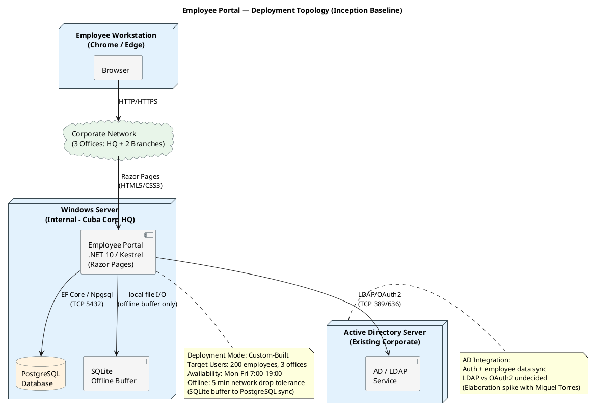
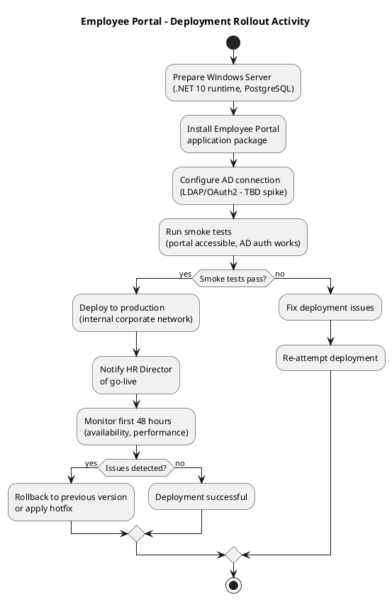

# Employee Portal — Deployment Strategy (Inception Baseline)

## Document Control

| Field | Value |
|---|---|
| Phase | Inception |
| Status | Draft |
| Iteration | 2 (Cycle 1) |
| Milestone Target | End of Inception (LCO) |
| Author | Deployment Manager |
| Deployment Mode | Custom-Built (internal intranet application) |

## Deployment Mode Selection

**Mode: Custom-Built**

The Employee Portal is a custom-built internal web application for Cuba Corp (200 employees, 3 offices). It is hosted on an internal Windows Server within the corporate network, with no external access.

Rationale:
- Single organization with known, fixed user base (200 employees)
- Internal infrastructure (Windows Server) — no cloud, no app store, no download
- Tailored to Cuba Corp's AD infrastructure and corporate network topology
- Installation performed by IT staff, not by end users

## Target User Community

| Audience | Size | Access Method | Location |
|---|---|---|---|
| Cuba Corp Employees | 200 | Browser (Chrome/Edge) via corporate network | 3 offices (HQ + 2 branches) |
| HR Administrator (Laura Gómez) | 1 | Browser via corporate network | HQ |
| IT/Maintenance (Miguel Torres) | 1 | Browser + server access | HQ |

## Target Environments

| Environment | Purpose | Hosting | Status |
|---|---|---|---|
| Development | Coding, unit testing | Developer workstation | Active (Elaboration) |
| Production | Live portal for 200 employees | Internal Windows Server | Planned (Transition) |

Note: For a 200-user intranet application on a single server, a separate staging environment is not initially warranted. Smoke tests will run on the production server during a maintenance window before go-live. [RECOMMENDATION — requires CR: If the stakeholder desires a separate staging environment, it can be added in Elaboration.]

## Deployment Topology

The following deployment diagram shows the target physical topology for the Employee Portal. This is consistent with the SAD Deployment View (COMP-001 through COMP-004).

## Rollout Approach

The rollout follows a single-server deployment with a smoke-test gate before go-live.

## Rollback Criteria

| Criterion | Trigger | Action |
|---|---|---|
| Portal inaccessible after deployment | Smoke test failure or user reports within first 48h | Revert to previous application version; investigate |
| AD authentication failure | Users cannot log in after deployment | Verify AD connection config; revert if unresolved within 30 min |
| Data loss detected | Clock-in/out records missing or corrupted | Stop portal, restore PostgreSQL from backup, investigate SQLite sync |
| Performance degradation | Page load > 5s or clock-in > 2s (2x threshold) | Investigate; consider rollback if unresolved within 1 hour |

## Deployment Constraints

| Constraint | Source | Impact on Deployment |
|---|---|---|
| Internal Windows Server hosting only | CON-005 | No cloud deployment; all components on single server |
| Chrome/Edge only | CON-007 | No cross-browser testing needed; simplifies deployment validation |
| AD authentication via LDAP/OAuth2 | CON-004 | AD server must be reachable; auth method TBD (Elaboration spike) |
| Offline fault tolerance (5 min) | NFR: Offline Fault Tolerance | SQLite buffer must be configured on same server; sync logic tested before go-live |
| Availability: Mon–Fri 7:00–19:00 | NFR: Availability window | Deployment windows: weekends or after 19:00 weekdays |

## Deployment Risks (from Risk List)

| Risk ID | Description | RPN | Deployment Impact |
|---|---|---|---|
| RISK-T01 | Offline fault tolerance failure | 30 | SQLite sync must be validated before go-live; rollback if data loss detected |
| RISK-T02 | AD integration (LDAP vs OAuth2 undecided) | 35 | Auth method must be resolved in Elaboration spike before deployment can proceed |
| RISK-E01 | Windows Server capacity/availability | 12 | Single server is SPOF; no failover for 200 users (acceptable per SAD) |

## Planned Use Cases for Future Releases

| Use Case | ID | Priority | Target Phase |
|---|---|---|---|
| Clock In/Out | UC-001 | Must | Elaboration (architecturally significant — offline sync) |
| View Clocking History | UC-002 | Should | Construction |
| Review and Export Clockings | UC-003 | Should | Construction |
| Publish News | UC-004 | Should | Construction |
| Read News | UC-005 | Should | Construction |
| Search Directory | UC-006 | Should | Construction |
| Manage Directory | UC-007 | Should | Construction |

## Known Issues and Limitations

| Issue | Status | Mitigation |
|---|---|---|
| AD auth method (LDAP vs OAuth2) undecided | Open — Elaboration spike with Miguel Torres | Deployment cannot proceed until resolved; fallback to local auth documented in Risk List |
| Single server is SPOF | Accepted — 200 users, intranet only | No failover planned; [RECOMMENDATION — requires CR: Add secondary server if availability requirements increase] |
| No separate staging environment | Accepted — single-server intranet app | Smoke tests on production server during maintenance window |
| Offline sync mechanism not yet validated | Open — Elaboration PoC | RISK-T01 drives Elaboration proof-of-concept |

## Traceability

| Element | Traces From | Link Type | Traces To |
|---|---|---|---|
| Deployment Mode (Custom-Built) | Vision (Product Position), CON-005 | Derives | SAD Deployment View |
| Deployment Topology | SAD (Deployment View), COMP-001–COMP-004 | Refines | Deployment Model (if triggered) |
| Rollout Approach | SAD (Deployment Notes) | Derives | Release Notes (Transition — full version) |
| Rollback Criteria | RISK-T01, RISK-T02, RISK-E01 | Derives | Iteration Plan (Transition) |
| UC-001–UC-007 | Use-Case Model | Refers | Release Notes (Transition — feature list) |
| Deployment Constraints | CON-004, CON-005, CON-007, NFRs | Derives | SAD, Supplementary Specification |