## Document Control

| Field | Value |
|---|---|
| Phase | Elaboration |
| Status | Draft |
| Iteration | 1 (Cycle 1) |
| Milestone Target | End of Elaboration |
| Author | User-Interface Designer |

### Elaboration Iteration 1 — UI Designer Contribution

- Design Model created with UI view/controller classes, UI Patterns, and Use-Case Realizations (interaction flows) for all 7 UCs of UI significance.
- UI class diagram defines 9 view classes (stereotyped `<<view>>`) and 3 controller classes (stereotyped `<<controller>>`) aligned with SAD component decomposition (COMP-P1 through COMP-P4).
- UI Patterns section published as coordination artifact for Designer, Implementer, and Technical Writer.
- Salt wireframes produced for 3 primary screens: Home/Clock, Directory Search, Admin News Publishing.
- Interaction flow activity diagrams for all 7 UCs trace to use-case flow steps and apply measurable usability requirements (REQ-008 through REQ-045).

## Design Overview

This Design Model captures the user-interface design of the Employee Portal. The UI Designer contributes the view/controller class structure, UI interaction patterns, and use-case realizations in the form of interaction flow activity diagrams. The Designer (Analysis & Design) will contribute domain model classes, business logic design classes, and sequence diagrams in subsequent iterations.

**Architecture alignment:** UI classes align with the SAD's component decomposition:
- COMP-P1 (Home/Clock) → HomePage, HistoryPage + ClockingController
- COMP-P2 (News) → NewsListPage, NewsDetailPage, AdminNewsPage + NewsController
- COMP-P3 (Directory) → DirectoryPage, AdminDirectoryPage + DirectoryController
- COMP-P4 (HR Admin) → AdminClockingsPage (shares ClockingController)

**Technology constraint:** Razor Pages (CON-001) — no SPA. View classes extend a BasePage abstraction; controllers handle business logic delegation.

## Domain Model
### Analysis Classes

The analysis class model identifies boundary, control, and entity classes for all 7 use cases. Boundary classes are referenced from the UI Designer's contribution (view/controller classes in the Design Overview section); control and entity classes are the Designer's contribution.

**Three-Level Mechanism Resolution:**

| Analysis Mechanism | Design Mechanism | Implementation Mechanism | Risk |
|---|---|---|---|
| Persistence | Repository pattern with `IRepository<T>` | EF Core 10.0 + Npgsql (PostgreSQL) | — |
| Offline persistence | Local store with `ILocalStore` | EF Core 10.0 + SQLite | RISK-T01 |
| Authentication | `IAuthProvider` interface | LDAP/OAuth2 adapter (spike deferred to Construction) | RISK-T02 |
| Audit trail | `IAuditLogger` interface | Append-only AuditEntry table via EF Core | — |
| Network detection | `INetworkHealth` interface | TcpHealthMonitor (TCP probe to pg:5432 every 5s) | RISK-T01 |
| Export | `IExportService` interface | CsvExporter (RFC 4180 compliant) | — |

```plantuml
@startuml
skinparam classAttributeIconSize 0
skinparam shadowing false
skinparam defaultFontName "Segoe UI"
skinparam class {
  BackgroundColor<<boundary>> #e8f5e9
  BackgroundColor<<control>> #e3f2fd
  BackgroundColor<<entity>> #fff3e0
  BackgroundColor<<infrastructure>> #fce4ec
  BorderColor #37474f
}

title Analysis Classes — Employee Portal (All UCs)

' === Boundary Classes (from UI Designer, referenced not redefined) ===
package "Boundary (Presentation)" {
  class "HomePage\n(ACL-001)" as ACL_001 <<boundary>> {
    + OnGet() : Task<PageResult>
    + OnPostClockIn() : Task<PageResult>
    + OnPostClockOut() : Task<PageResult>
  }
  class "HistoryPage\n(ACL-002)" as ACL_002 <<boundary>> {
    + OnGet(month: int) : Task<PageResult>
  }
  class "AdminClockingsPage\n(ACL-003)" as ACL_003 <<boundary>> {
    + OnGet(month: int) : Task<PageResult>
    + OnPostExport(month: int) : Task<FileResult>
  }
  class "AdminNewsPage\n(ACL-004)" as ACL_004 <<boundary>> {
    + OnGet() : Task<PageResult>
    + OnPostPublish(newsItem: NewsItem) : Task<PageResult>
  }
  class "NewsListPage\n(ACL-005)" as ACL_005 <<boundary>> {
    + OnGet(category: string?) : Task<PageResult>
  }
  class "NewsDetailPage\n(ACL-006)" as ACL_006 <<boundary>> {
    + OnGet(id: Guid) : Task<PageResult>
  }
  class "DirectoryPage\n(ACL-007)" as ACL_007 <<boundary>> {
    + OnGet(query: string, dept: string?, office: string?) : Task<PageResult>
  }
  class "AdminDirectoryPage\n(ACL-008)" as ACL_008 <<boundary>> {
    + OnGet() : Task<PageResult>
    + OnPostUpdate(emp: Employee) : Task<PageResult>
    + OnPostSyncAD() : Task<PageResult>
  }
}

' === Control Classes (Application Layer) ===
package "Control (Application)" {
  class "TimeTrackingService\n(ACL-009)" as ACL_009 <<control>> {
    + ClockIn(employeeId: Guid) : Result<Clocking>
    + ClockOut(employeeId: Guid) : Result<Clocking>
    + GetClockings(employeeId: Guid, month: DateTime) : List<Clocking>
    + GetAllClockings(month: DateTime) : List<Clocking>
    + ExportClockings(month: DateTime) : byte[]
  }
  class "NewsService\n(ACL-010)" as ACL_010 <<control>> {
    + PublishNews(item: NewsItem) : Result<NewsItem>
    + GetNewsList(category: string?) : List<NewsItem>
    + GetNewsDetail(id: Guid) : NewsItem
  }
  class "DirectoryService\n(ACL-011)" as ACL_011 <<control>> {
    + Search(query: string, dept: string?, office: string?) : List<Employee>
    + UpdateEmployee(emp: Employee) : Result<Employee>
    + SyncFromAD() : SyncResult
  }
  class "AuditInterceptor\n(ACL-012)" as ACL_012 <<control>> {
    + Log(entityType: string, entityId: string, action: string, user: string) : void
  }
  class "SyncQueue\n(ACL-013)" as ACL_013 <<control>> {
    + Enqueue(clocking: Clocking) : Result<int>
    + Flush() : SyncResult
    + GetPendingCount() : int
  }
}

' === Entity Classes (Domain Layer) ===
package "Entity (Domain)" {
  class "Clocking\n(ACL-014)" as ACL_014 <<entity>> {
    + id: Guid
    + employeeId: Guid
    + type: ClockingType
    + timestamp: DateTime
    + syncStatus: SyncStatus
  }
  class "NewsItem\n(ACL-015)" as ACL_015 <<entity>> {
    + id: Guid
    + title: string
    + body: string
    + publishedDate: DateTime
    + category: Category
    + isFeatured: bool
  }
  class "Employee\n(ACL-016)" as ACL_016 <<entity>> {
    + id: Guid
    + adId: string
    + fullName: string
    + jobTitle: string
    + department: string
    + office: string
    + email: string
    + extension: string
    + isActive: bool
    + overrideFlag: bool
  }
  class "AuditEntry\n(ACL-017)" as ACL_017 <<entity>> {
    + id: Guid
    + entityType: string
    + entityId: string
    + action: string
    + user: string
    + timestamp: DateTime
  }
  class "SyncRecord\n(ACL-018)" as ACL_018 <<entity>> {
    + localId: int
    + clockingId: Guid
    + status: SyncStatus
    + queuedAt: DateTime
    + syncedAt: DateTime?
  }
}

' === Enumerations ===
enum "ClockingType" as CT {
  IN
  OUT
}
enum "SyncStatus" as SS {
  PENDING
  SYNCED
  SKIPPED
}
enum "Category" as CAT {
  General
  HR
  IT
  Events
}

' === Relationships ===
' Boundary -> Control
ACL_001 --> ACL_009 : delegates
ACL_002 --> ACL_009 : delegates
ACL_003 --> ACL_009 : delegates
ACL_004 --> ACL_010 : delegates
ACL_005 --> ACL_010 : delegates
ACL_006 --> ACL_010 : delegates
ACL_007 --> ACL_011 : delegates
ACL_008 --> ACL_011 : delegates

' Control -> Entity
ACL_009 ..> ACL_014 : creates/reads
ACL_009 --> ACL_013 : delegates offline
ACL_013 ..> ACL_014 : syncs
ACL_013 ..> ACL_018 : manages
ACL_010 ..> ACL_015 : creates/reads
ACL_010 --> ACL_012 : logs
ACL_011 ..> ACL_016 : reads/updates
ACL_011 --> ACL_012 : logs
ACL_012 ..> ACL_017 : creates

' Entity -> Enum
ACL_014 --> CT
ACL_014 --> SS
ACL_018 --> SS
ACL_015 --> CAT

note bottom of ACL_013
  **Offline Sync Mechanism (Design)**
  Analysis: "persist clockings offline"
  Design: SyncQueue + ILocalStore (SQLite)
  Implementation: SemaphoreSlim(1,1) single-writer lock
  Resolves RISK-T01 (RPN 63)
end note

note bottom of ACL_012
  **Audit Mechanism (Design)**
  Analysis: "log directory/news changes"
  Design: IAuditLogger interface + AuditInterceptor
  Implementation: Append-only AuditEntry table via EF Core
  Resolves REQ-004, REQ-005, REQ-006
end note

@enduml
```

### Analysis Class to Use-Case Traceability

| Analysis Class | ID | Participates In UCs | Stereotype |
|---|---|---|---|
| HomePage | ACL-001 | UC-001 | <<boundary>> |
| HistoryPage | ACL-002 | UC-002 | <<boundary>> |
| AdminClockingsPage | ACL-003 | UC-003 | <<boundary>> |
| AdminNewsPage | ACL-004 | UC-004 | <<boundary>> |
| NewsListPage | ACL-005 | UC-005 | <<boundary>> |
| NewsDetailPage | ACL-006 | UC-005 | <<boundary>> |
| DirectoryPage | ACL-007 | UC-006 | <<boundary>> |
| AdminDirectoryPage | ACL-008 | UC-007 | <<boundary>> |
| TimeTrackingService | ACL-009 | UC-001, UC-002, UC-003 | <<control>> |
| NewsService | ACL-010 | UC-004, UC-005 | <<control>> |
| DirectoryService | ACL-011 | UC-006, UC-007 | <<control>> |
| AuditInterceptor | ACL-012 | UC-004, UC-007 | <<control>> |
| SyncQueue | ACL-013 | UC-001 | <<control>> |
| Clocking | ACL-014 | UC-001, UC-002, UC-003 | <<entity>> |
| NewsItem | ACL-015 | UC-004, UC-005 | <<entity>> |
| Employee | ACL-016 | UC-006, UC-007 | <<entity>> |
| AuditEntry | ACL-017 | UC-004, UC-007 | <<entity>> |
| SyncRecord | ACL-018 | UC-001 | <<entity>> |
## Use-Case Realizations
### Use-Case Realizations — Sequence Diagrams

The following sequence diagrams realize each use case as a collaboration of design objects. Each realization shows the main flow and key alternative/exception flows. The SAD's Use-Case View contains architecturally-focused sequences for UC-001, UC-003, and UC-007; the realizations below provide full design-level detail for all 7 UCs with explicit object responsibilities, interface calls, and error handling.

#### SEQ-001: UC-001 Clock In/Out — Offline Fault Tolerance

**Participating objects:** HomePage (CLS-001), ClockingController (CLS-002), TimeTrackingService (CLS-009), INetworkHealth (INT-005), SyncQueue (CLS-013), Clocking (CLS-014), IRepository<Clocking> (INT-002), ILocalStore (INT-003)

**Design decisions validated:**
- INetworkHealth decouples health detection — TcpHealthMonitor probes pg:5432 every 5s
- SyncQueue manages offline-to-online transition with conflict detection by (employeeId, timestamp) uniqueness
- Transient PostgreSQL failure falls back to offline path — zero data loss (REQ-014)
- User receives immediate confirmation in both modes (<1s, REQ-017)

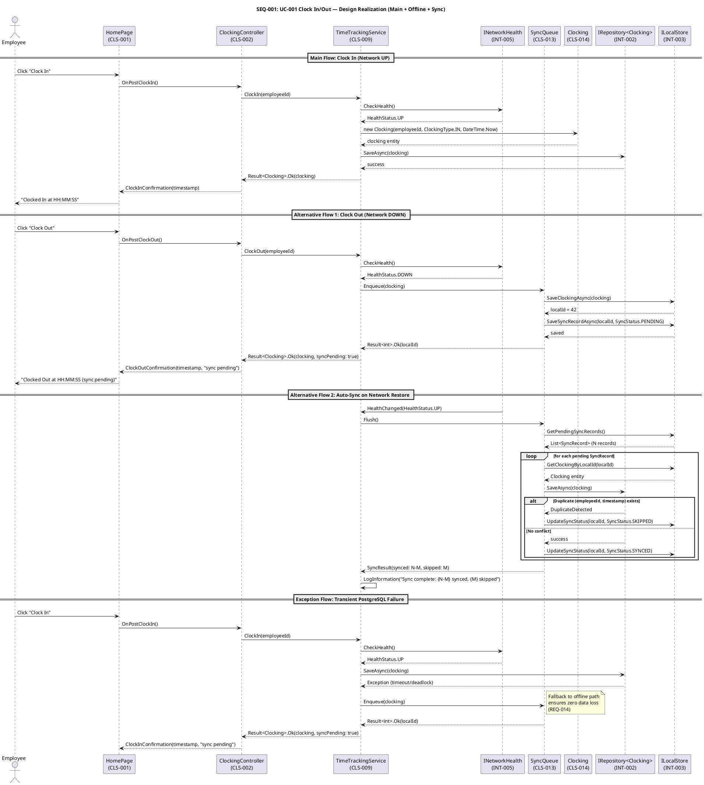

#### SEQ-002: UC-004 Publish News — Audit Trail

**Participating objects:** AdminNewsPage (CLS-004), NewsController (CLS-006), NewsService (CLS-010), NewsItem (CLS-015), IAuditLogger (INT-006), IRepository<NewsItem> (INT-002)

**Design decisions validated:**
- IAuditLogger formalizes audit as cross-cutting concern — every news publish produces an immutable AuditEntry (REQ-004, REQ-006)
- Validation occurs in domain entity before persistence
- Error handling distinguishes validation errors (user retry) from infrastructure failures (generic error + retry)

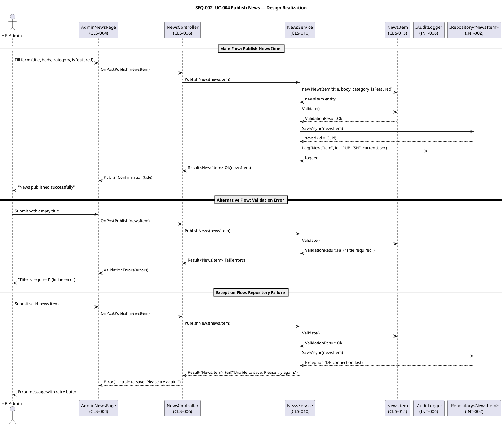

#### SEQ-003: UC-006 Search Directory — Performance-Critical Read

**Participating objects:** DirectoryPage (CLS-007), DirectoryController (CLS-008), DirectoryService (CLS-011), IRepository<Employee> (INT-002)

**Design decisions validated:**
- Search delegates through DirectoryService to IRepository — no direct DB access from presentation layer
- Performance constraint ≤2s (REQ-018) ensured by PostgreSQL indexes on fullName, department, office
- isActive filter excludes departed employees from directory (UC-007 deactivation scenario)

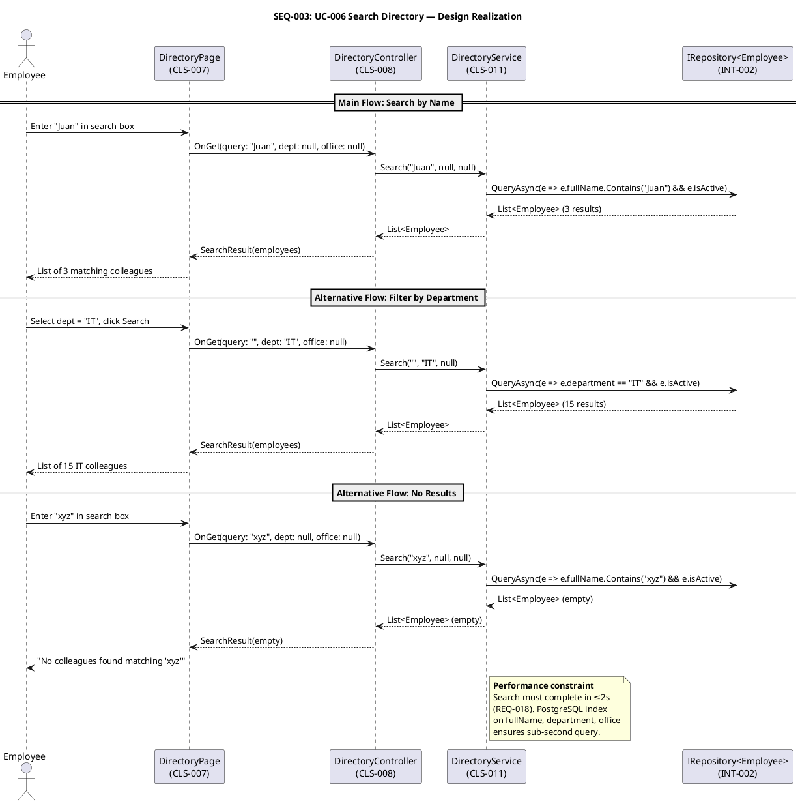

#### SEQ-004: UC-002 View Clocking History

**Participating objects:** HistoryPage (CLS-003), ClockingController (CLS-002), TimeTrackingService (CLS-009), IRepository<Clocking> (INT-002)

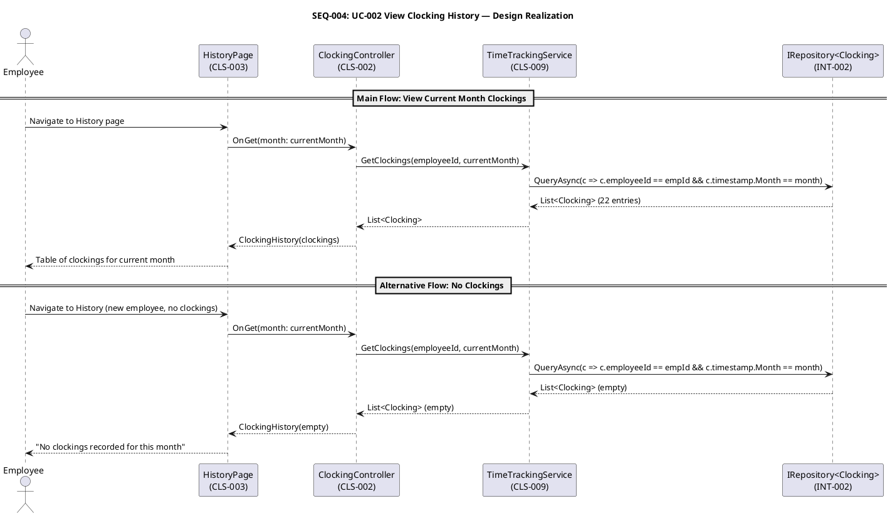

#### SEQ-005: UC-003 Review and Export Clockings

**Participating objects:** AdminClockingsPage (CLS-005), ClockingController (CLS-002), TimeTrackingService (CLS-009), IRepository<Clocking> (INT-002), IExportService (INT-004)

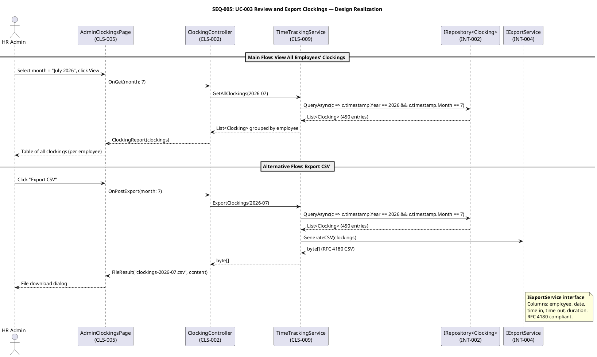

#### SEQ-006: UC-005 Read News

**Participating objects:** NewsListPage (CLS-016), NewsDetailPage (CLS-017), NewsController (CLS-006), NewsService (CLS-010), IRepository<NewsItem> (INT-002)

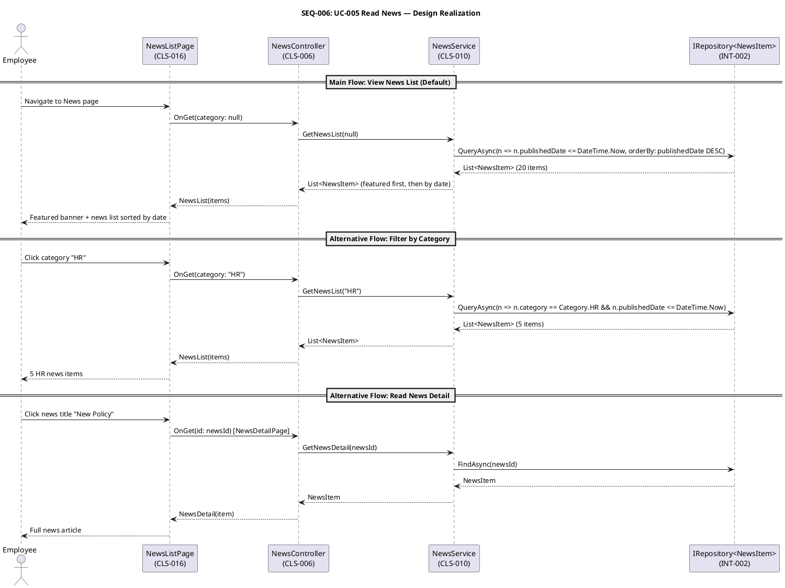

#### SEQ-007: UC-007 Manage Directory — AD Sync + Audit

**Participating objects:** AdminDirectoryPage (CLS-008), DirectoryController (CLS-008), DirectoryService (CLS-011), Employee (CLS-016), IAuditLogger (INT-006), IAuthProvider (INT-001), IRepository<Employee> (INT-002)

**Design decisions validated:**
- IAuthProvider isolates AD protocol — LDAP/OAuth2 swap is a DI registration change (RISK-T02)
- Override flag mechanism: HR local changes win when overrideFlag = true (RISK-R01)
- Three-way merge: skip (override), merge (no override), import (new entry)
- IAuditLogger logs every directory change with user, action, timestamp (REQ-005, REQ-006)

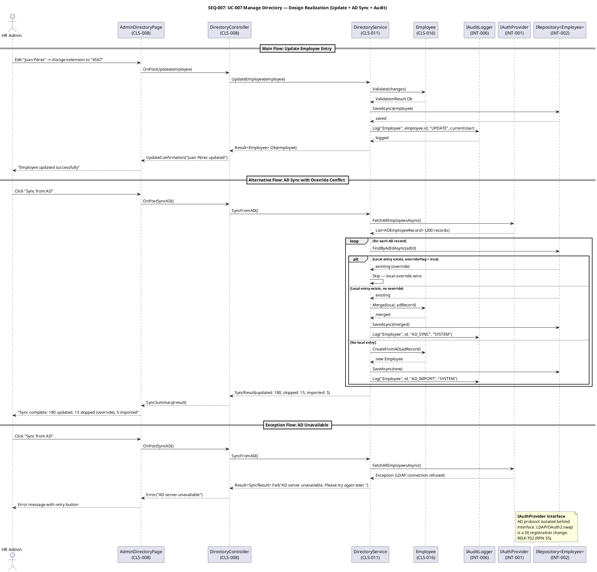

### Use-Case Realization Coverage

| UC ID | Use Case | Seq ID | Flows Covered | Architectural Significance |
|---|---|---|---|---|
| UC-001 | Clock In/Out | SEQ-001 | Main, Offline, Auto-Sync, Transient Failure | Critical — offline fault tolerance |
| UC-002 | View Clocking History | SEQ-004 | Main, No Clockings | Low — simple read |
| UC-003 | Review and Export Clockings | SEQ-005 | Main (View), Export CSV | High — CSV export mechanism |
| UC-004 | Publish News | SEQ-002 | Main, Validation Error, Repo Failure | Medium — audit trail |
| UC-005 | Read News | SEQ-006 | Main, Category Filter, Detail View | Low — read-only |
| UC-006 | Search Directory | SEQ-003 | Main, Dept Filter, No Results | Medium — performance constraint |
| UC-007 | Manage Directory | SEQ-007 | Update, AD Sync, AD Unavailable | High — AD sync + audit |
## Design Packages and Classes

### UI View/Controller Classes

The following class diagram defines the UI view and controller classes for the Employee Portal. View classes (stereotyped `<<view>>`) extend a BasePage abstraction and are organized by SAD component (COMP-P1 through COMP-P4). Controller classes (stereotyped `<<controller>>`) encapsulate business logic delegation and are shared across view classes within the same functional area.

```plantuml
@startuml
title UI View/Controller Classes — Employee Portal

skinparam classAttributeIconSize 0
skinparam stereotypeBackgroundColor #ecf0f1

package "Presentation Layer" {
    
    abstract class "BasePage" as BasePage <<view>> {
        +Render()
        +OnGet()
        +OnPost()
    }
    
    class "HomePage" as HomePage <<view>> {
        -clockingStatus : string
        -clockButtonLabel : string
        -offlineIndicator : bool
        +OnGet() : void
        +OnPostClock() : IActionResult
    }
    
    class "HistoryPage" as HistoryPage <<view>> {
        -clockings : List<ClockingEntry>
        -currentMonth : DateOnly
        +OnGet() : void
    }
    
    class "NewsListPage" as NewsListPage <<view>> {
        -newsItems : List<NewsItem>
        -featuredItem : NewsItem
        -selectedCategory : string
        +OnGet(category?) : void
    }
    
    class "NewsDetailPage" as NewsDetailPage <<view>> {
        -newsItem : NewsItem
        +OnGet(id) : void
    }
    
    class "DirectoryPage" as DirectoryPage <<view>> {
        -searchQuery : string
        -results : List<DirectoryEntry>
        -departmentFilter : string
        -officeFilter : string
        +OnGet(query?, dept?, office?) : void
    }
    
    class "AdminClockingsPage" as AdminClock <<view>> {
        -allClockings : List<ClockingEntry>
        -employeeFilter : string
        -dateRangeFilter : DateRange
        +OnGet() : void
        +OnPostExportCSV() : FileResult
    }
    
    class "AdminNewsPage" as AdminNews <<view>> {
        -newsForm : NewsFormModel
        -validationErrors : List<string>
        +OnGet() : void
        +OnPostPublish() : IActionResult
    }
    
    class "AdminDirectoryPage" as AdminDir <<view>> {
        -entries : List<DirectoryEntry>
        -editForm : DirectoryEntryForm
        -adConflictWarning : bool
        +OnGet() : void
        +OnPostCreate() : IActionResult
        +OnPostEdit() : IActionResult
        +OnPostDeactivate() : IActionResult
    }
}

package "Controllers" {
    
    class "ClockingController" as ClockCtrl <<controller>> {
        +GetStatus(employeeId) : ClockingStatus
        +RecordClocking(employeeId, type) : ClockingResult
        +GetHistory(employeeId, month) : List<ClockingEntry>
        +ExportCSV(filters) : FileResult
    }
    
    class "NewsController" as NewsCtrl <<controller>> {
        +GetNewsList(category?) : List<NewsItem>
        +GetNewsDetail(id) : NewsItem
        +PublishNews(form) : PublishResult
    }
    
    class "DirectoryController" as DirCtrl <<controller>> {
        +SearchDirectory(query, dept?, office?) : List<DirectoryEntry>
        +CreateEntry(form) : CreateResult
        +UpdateEntry(id, form) : UpdateResult
        +DeactivateEntry(id) : Result
    }
}

BasePage <|-- HomePage
BasePage <|-- HistoryPage
BasePage <|-- NewsListPage
BasePage <|-- NewsDetailPage
BasePage <|-- DirectoryPage
BasePage <|-- AdminClock
BasePage <|-- AdminNews
BasePage <|-- AdminDir

HomePage --> ClockCtrl : uses
HistoryPage --> ClockCtrl : uses
AdminClock --> ClockCtrl : uses

NewsListPage --> NewsCtrl : uses
NewsDetailPage --> NewsCtrl : uses
AdminNews --> NewsCtrl : uses

DirectoryPage --> DirCtrl : uses
AdminDir --> DirCtrl : uses

note right of HomePage
  REQ-030: Clock button is primary
  visual element, top-center, ≥200px
  REQ-035: Offline indicator banner
end note

note right of AdminDir
  REQ-041: AD sync conflict
  warning with override choice
end note

@enduml
```

### UI Patterns

The following UI patterns are coordination artifacts for the Designer (class-level realization), Implementer (screen construction), and Technical Writer (documentation). All screens MUST follow these conventions to ensure consistency (Nielsen Heuristic #4).

#### P-001: Navigation Bar Pattern

- **Applies to:** All pages
- **Structure:** Horizontal navigation bar at top of every page with links: Home, News, Directory, [Admin]
- **Admin link:** Visible only when HR Administrator role is verified (REQ-037); hidden for regular employees
- **Active page:** Highlighted with distinct background color or underline
- **REQ traceability:** REQ-042

#### P-002: Primary Action Button Pattern

- **Applies to:** UC-001 (Clock In/Out), UC-004 (Publish), UC-003 (Export CSV)
- **Structure:** Primary action button is visually dominant — high-contrast color, minimum 200px width, top-center or right-aligned position
- **Clock In/Out:** Top-center of home page, ≥200px width, status label above button (REQ-030)
- **Publish:** Right-aligned at bottom of form, labeled "Publish" (REQ-039)
- **Export CSV:** Right-aligned above clockings table, labeled "Export CSV" (REQ-038)
- **REQ traceability:** REQ-030, REQ-038, REQ-039

#### P-003: Confirmation Feedback Pattern

- **Applies to:** All write operations (clock, publish, create, edit, deactivate)
- **Structure:** Success confirmation displayed inline (not modal) with recorded timestamp or action summary
- **Timing:** Within 1 second of action for clock operations (REQ-031); within 3 seconds for CSV export (REQ-038)
- **Offline variant:** Confirmation includes "Offline — will sync when connection is restored" suffix (REQ-035)
- **REQ traceability:** REQ-031, REQ-035

#### P-004: Error Recovery Pattern

- **Applies to:** All error states
- **Structure:** Plain-language error message with suggested action; no raw exception codes
- **Session expired:** "Session expired — network connection required" (REQ-036)
- **Validation errors:** Displayed inline next to the relevant field, not in a modal
- **AD sync conflict:** Warning dialog with override choice and clear consequence statement (REQ-041)
- **REQ traceability:** REQ-036, REQ-041, REQ-043

#### P-005: Real-Time Search Pattern

- **Applies to:** UC-006 (Directory Search)
- **Structure:** Search input with real-time filtering; results update without page reload
- **Performance:** Results within 2 seconds of query input (REQ-033)
- **Filters:** Department and office dropdowns alongside text search
- **Results table:** Columns: name, title, department, office, email, extension
- **REQ traceability:** REQ-008, REQ-033

#### P-006: Single-Screen Form Pattern

- **Applies to:** UC-004 (Publish News), UC-007 (Create/Edit Directory Entry)
- **Structure:** All form fields visible on one screen; no multi-step wizards
- **News form:** Title, body, date (auto-filled), category dropdown, featured checkbox (REQ-039)
- **Directory form:** Name, title, department, office, email, extension
- **Submit:** Single "Save" or "Publish" button at bottom
- **REQ traceability:** REQ-039, REQ-040

#### P-007: Table List Pattern

- **Applies to:** UC-002 (History), UC-003 (Clockings), UC-007 (Directory Management)
- **Structure:** Sortable table with relevant columns; action buttons per row where applicable
- **History:** Date, time, type (In/Out) — sorted by date descending, no pagination (≤62 rows max) (REQ-032)
- **Admin Clockings:** Employee, date, time, type — with filter controls
- **Directory Management:** Name, department, office — with Edit and Deactivate buttons per row, Create New at top (REQ-040)
- **REQ traceability:** REQ-032, REQ-038, REQ-040

#### P-008: Loading Indicator Pattern

- **Applies to:** All page navigations and async operations
- **Structure:** Spinner or progress bar visible within 500ms of navigation; no blank screen for >1 second
- **CSV export:** Progress indicator if operation exceeds 1 second
- **REQ traceability:** REQ-045

#### P-009: Keyboard Accessibility Pattern

- **Applies to:** All interactive elements
- **Structure:** Visible focus outline on all buttons, links, inputs, and form controls; tab order follows visual order
- **REQ traceability:** REQ-044

### UI Wireframes

The following Salt wireframes define the visual structure of primary screens. The Implementer builds from these wireframes.

#### Home Page (UC-001 Clock In/Out + UC-005 News List)

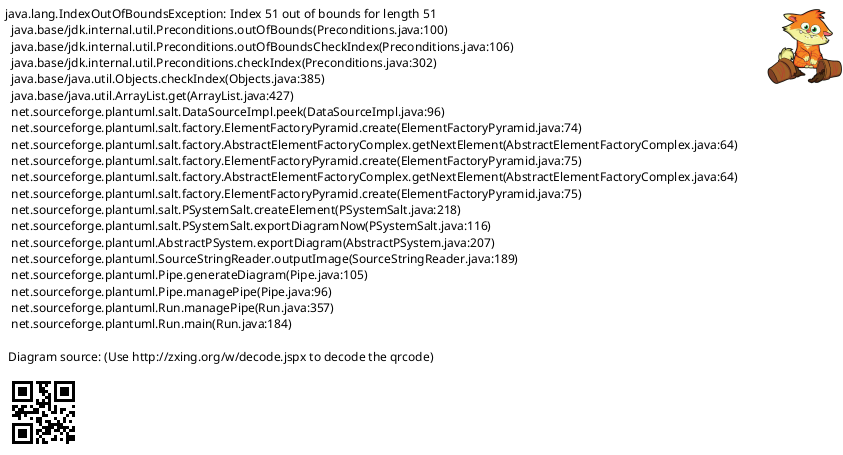

#### Directory Search Page (UC-006)

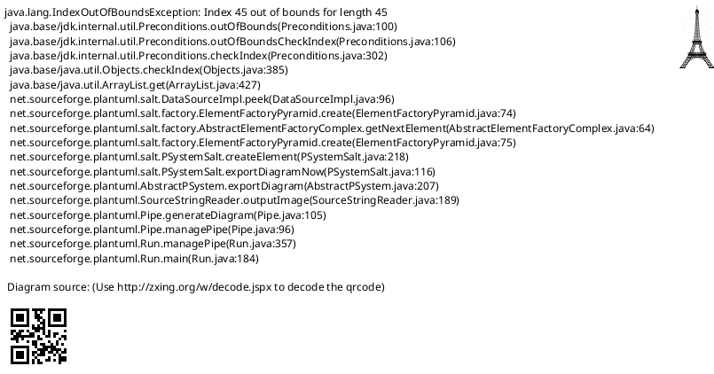

#### Admin News Publishing (UC-004)

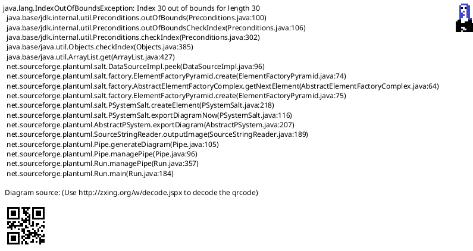

## Interface Contracts

*Section reserved for Designer contribution — service interfaces, API contracts, and data transfer objects will be populated by the Designer role.*

## Traceability

| Element | Traces From | Link Type | Traces To |
|---|---|---|---|
| HomePage (<<view>>) | UC-001, UC-005, COMP-P1 | Derives | ClockingController, NewsController |
| HistoryPage (<<view>>) | UC-002, COMP-P1 | Derives | ClockingController |
| NewsListPage (<<view>>) | UC-005, COMP-P2 | Derives | NewsController |
| NewsDetailPage (<<view>>) | UC-005, COMP-P2 | Derives | NewsController |
| DirectoryPage (<<view>>) | UC-006, COMP-P3 | Derives | DirectoryController |
| AdminClockingsPage (<<view>>) | UC-003, COMP-P4 | Derives | ClockingController |
| AdminNewsPage (<<view>>) | UC-004, COMP-P2 | Derives | NewsController |
| AdminDirectoryPage (<<view>>) | UC-007, COMP-P3 | Derives | DirectoryController |
| ClockingController (<<controller>>) | UC-001, UC-002, UC-003 | Derives | (Designer: domain classes) |
| NewsController (<<controller>>) | UC-004, UC-005 | Derives | (Designer: domain classes) |
| DirectoryController (<<controller>>) | UC-006, UC-007 | Derives | (Designer: domain classes) |
| P-001 (Nav Bar) | REQ-042 | Derives | All view classes |
| P-002 (Primary Button) | REQ-030, REQ-038, REQ-039 | Derives | HomePage, AdminNewsPage, AdminClockingsPage |
| P-003 (Confirmation) | REQ-031, REQ-035 | Derives | HomePage, AdminNewsPage, AdminDirectoryPage |
| P-004 (Error Recovery) | REQ-036, REQ-041, REQ-043 | Derives | All view classes |
| P-005 (Real-Time Search) | REQ-008, REQ-033 | Derives | DirectoryPage |
| P-006 (Single-Screen Form) | REQ-039, REQ-040 | Derives | AdminNewsPage, AdminDirectoryPage |
| P-007 (Table List) | REQ-032, REQ-038, REQ-040 | Derives | HistoryPage, AdminClockingsPage, AdminDirectoryPage |
| P-008 (Loading Indicator) | REQ-045 | Derives | BasePage (all) |
| P-009 (Keyboard Accessibility) | REQ-044 | Derives | BasePage (all) |
| UC-001 Interaction Flow | UC-001 Main Flow, AF-1, EF-1 | Realizes | HomePage, ClockingController |
| UC-002 Interaction Flow | UC-002 Main Flow | Realizes | HistoryPage, ClockingController |
| UC-003 Interaction Flow | UC-003 Main Flow | Realizes | AdminClockingsPage, ClockingController |
| UC-004 Interaction Flow | UC-004 Main Flow | Realizes | AdminNewsPage, NewsController |
| UC-005 Interaction Flow | UC-005 Main Flow | Realizes | NewsListPage, NewsDetailPage, NewsController |
| UC-006 Interaction Flow | UC-006 Main Flow | Realizes | DirectoryPage, DirectoryController |
| UC-007 Interaction Flow | UC-007 Main Flow, S3 | Realizes | AdminDirectoryPage, DirectoryController |