## Document Control
| Field | Value |
|---|---|
| Phase | Elaboration |
| Status | Draft |
| Iteration | 3 (Cycle 1) |
| Milestone Target | LCA (Lifecycle Architecture) |
| Author | User-Interface Designer, Designer (Analysis & Design), Database Designer |

### Elaboration Iteration 3 — UI Designer Changes

- **DM-MR-F1 (Minor) RESOLVED:** Stakeholder custom design request for Employee Portal now captured in Design Overview section. The stakeholder's LCA review design request specified: (1) clock widget as primary element on Home page, (2) single-action button that changes label based on clocking status, (3) news feed below clock widget, (4) directory search accessible from top navigation bar on all pages, (5) minimalist corporate design with Cuba Corp blue/white color scheme. Activity diagram and Salt wireframe added to document the request and its mapping to existing UC-001 and UC-005 flows.
- **PRESERVED** — All other UI Designer contributions (Navigation Topology, interaction flows, storyboards, wireframes, validation sessions) from prior iterations remain valid — no other findings target UI content.
- **User-Interface Prototype trigger NOT fired** (re-confirmed via `get_optional_artifact_triggers` in iteration 3). Interaction design lives inside the Design Model and Use-Case Model as UI flow references.

### Elaboration Iteration 3 — Database Designer Changes

- **PRESERVED** — No open findings or Change Requests target Database Designer content in the Design Model. All 6 open Review Record findings target other roles (Software Architect: SAD-F4/PoC-F1; Project Manager: IA-F2/IA-F1/IP-F1; UI Designer: DM-MR-F1). No open CRs target persistence/ORM mapping sections.
- **Data Model trigger NOT fired** (re-confirmed via `get_optional_artifact_triggers` in iteration 3). Persistence mapping remains inline in the Design Model per Database Designer protocol.
- All iteration 2 Database Designer contributions remain valid: 5 tables (clockings, news_items, employees, audit_entries, sync_records), ORM mapping, 9 indexes, persistence context diagram, baseline migration strategy.

### Elaboration Iteration 2 — Database Designer Changes

- **Data Model trigger NOT fired** (Development Case §5.2: system has <10 entities, no data migration in scope). Persistence mapping contributed inline in the Design Model per Database Designer protocol.
- **Persistent Data Model** contributed: 5 tables mapped from design entity classes (CLS-014 Clocking → clockings, CLS-015 NewsItem → news_items, CLS-016 Employee → employees, CLS-017 AuditEntry → audit_entries, CLS-018 SyncRecord → sync_records).
- **ORM Mapping** contributed: table-to-class mapping, column types, nullability, PK/FK constraints, identity strategy, loading policy, cascade behavior for all 5 persistent entities.
- **Index Strategy** contributed: 9 indexes justified by specific NFRs (REQ-017 <1s clock, REQ-018 <2s search, REQ-019 <3s page load, REQ-004/005/006 audit trail, REQ-014 offline sync).
- **Persistence Context Diagram** contributed: PortalDbContext (PostgreSQL, online) vs LocalDbContext (SQLite, offline buffer) schema organization.
- **Baseline Migration Strategy** contributed: EF Core migration sequence (v1 baseline + v2 offline support), forward-only, rollback specification for critical tables.
- No findings from Review Record (Elaboration Iter 1) specifically target Database Designer content. DM-F1 (author field) already resolved by UI Designer/Designer.
## Design Overview
This Design Model captures the complete design of the Employee Portal, combining UI design (view/controller classes, UI patterns, interaction flows) and component design (domain classes, service classes, use-case realizations, state machines, subsystem definitions).

**Contributors:**
- **UI Designer:** View/controller class structure, UI interaction patterns, use-case realizations (interaction flow activity diagrams)
- **Designer (Analysis & Design):** Analysis classes, design class diagrams per package, sequence diagrams, state machines, design subsystems, interface contracts

**Architecture alignment:** UI classes align with the SAD's component decomposition:
- COMP-P1 (Home/Clock) → HomePage, HistoryPage + ClockingController
- COMP-P2 (News) → NewsListPage, NewsDetailPage, AdminNewsPage + NewsController
- COMP-P3 (Directory) → DirectoryPage, AdminDirectoryPage + DirectoryController
- COMP-P4 (HR Admin) → AdminClockingsPage (shares ClockingController)

**Technology constraint:** Razor Pages (CON-001) — no SPA. View classes extend a BasePage abstraction; controllers handle business logic delegation.

### Design Subsystems

The design model is organized into four subsystems corresponding to the SAD's layered architecture. Each subsystem is a package that offers interfaces — no concrete class is referenced across a subsystem boundary.

| Subsystem | ID | Provided Interfaces | Required Interfaces | Contains |
|---|---|---|---|---|
| Presentation | SUB-PRES | (none — consumed by ASP.NET pipeline) | ClockingController, NewsController, DirectoryController (concrete) | HomePage, HistoryPage, AdminClockingsPage, AdminNewsPage, NewsListPage, NewsDetailPage, DirectoryPage, AdminDirectoryPage, BasePage |
| Application | SUB-APP | TimeTrackingService, NewsService, DirectoryService, AuditInterceptor, SyncQueue (concrete services) | INT-001 (IAuthProvider), INT-002 (IRepository<T>), INT-003 (ILocalStore), INT-004 (IExportService), INT-005 (INetworkHealth), INT-006 (IAuditLogger) | Service classes orchestrating business logic |
| Domain | SUB-DOM | Clocking, NewsItem, Employee, AuditEntry, SyncRecord, value objects | (none — pure domain, no dependencies) | Domain entities, enumerations, value objects |
| Infrastructure | SUB-INFRA | INT-001 through INT-006 (all interfaces implemented here) | (none — depends on external: PostgreSQL, SQLite, AD/LDAP) | PostgresRepository<T>, SqliteLocalStore, LdapAuthProvider, CsvExporter, TcpHealthMonitor, EfAuditLogger, PortalDbContext, LocalDbContext |

**Dependency direction (top-down, strictly enforced):**

```plantuml
@startuml
skinparam componentStyle rectangle
skinparam shadowing false
skinparam defaultFontName "Segoe UI"
skinparam package {
  BackgroundColor<<presentation>> #e8f5e9
  BackgroundColor<<application>> #e3f2fd
  BackgroundColor<<domain>> #fff3e0
  BackgroundColor<<infrastructure>> #fce4ec
  BorderColor #37474f
}
skinparam interface {
  BackgroundColor #fffde7
  BorderColor #f57f17
}

title Design Model — Package Organization & Subsystem Dependencies

package "Presentation Layer" <<presentation>> {
  [HomePage\n(CLS-001)] as CLS_001
  [HistoryPage\n(CLS-002)] as CLS_002
  [AdminClockingsPage\n(CLS-003)] as CLS_003
  [AdminNewsPage\n(CLS-004)] as CLS_004
  [NewsListPage\n(CLS-005)] as CLS_005
  [NewsDetailPage\n(CLS-006)] as CLS_006
  [DirectoryPage\n(CLS-007)] as CLS_007
  [AdminDirectoryPage\n(CLS-008)] as CLS_008
  [ClockingController\n(CLS-009)] as CLS_009
  [NewsController\n(CLS-010)] as CLS_010
  [DirectoryController\n(CLS-011)] as CLS_011
}

package "Application Layer" <<application>> {
  [TimeTrackingService\n(CLS-012)] as CLS_012
  [NewsService\n(CLS-013)] as CLS_013
  [DirectoryService\n(CLS-014)] as CLS_014
  [AuditInterceptor\n(CLS-015)] as CLS_015
  [SyncQueue\n(CLS-016)] as CLS_016
}

package "Domain Layer" <<domain>> {
  [Clocking\n(CLS-017)] as CLS_017
  [NewsItem\n(CLS-018)] as CLS_018
  [Employee\n(CLS-019)] as CLS_019
  [AuditEntry\n(CLS-020)] as CLS_020
  [SyncRecord\n(CLS-021)] as CLS_021
  [ADEmployeeRecord\n(CLS-022)] as CLS_022
  [SyncResult\n(CLS-023)] as CLS_023
  [Result<T>\n(CLS-024)] as CLS_024
  [ValidationResult\n(CLS-025)] as CLS_025
}

package "Infrastructure Layer" <<infrastructure>> {
  [PostgresRepository<T>\n(CLS-026)] as CLS_026
  [SqliteLocalStore\n(CLS-027)] as CLS_027
  [LdapAuthProvider\n(CLS-028)] as CLS_028
  [CsvExporter\n(CLS-029)] as CLS_029
  [TcpHealthMonitor\n(CLS-030)] as CLS_030
  [EfAuditLogger\n(CLS-031)] as CLS_031
  [PortalDbContext\n(CLS-032)] as CLS_032
  [LocalDbContext\n(CLS-033)] as CLS_033
}

interface "IAuthProvider\n(INT-001)" as INT_001
interface "IRepository<T>\n(INT-002)" as INT_002
interface "ILocalStore\n(INT-003)" as INT_003
interface "IExportService\n(INT-004)" as INT_004
interface "INetworkHealth\n(INT-005)" as INT_005
interface "IAuditLogger\n(INT-006)" as INT_006

CLS_009 --> CLS_012
CLS_010 --> CLS_013
CLS_011 --> CLS_014

CLS_012 --> INT_002
CLS_012 --> INT_003
CLS_012 --> INT_004
CLS_012 --> INT_005
CLS_013 --> INT_002
CLS_013 --> INT_006
CLS_014 --> INT_002
CLS_014 --> INT_001
CLS_014 --> INT_006
CLS_015 --> INT_006
CLS_016 --> INT_003
CLS_016 --> INT_002

CLS_026 ..|> INT_002
CLS_027 ..|> INT_003
CLS_028 ..|> INT_001
CLS_029 ..|> INT_004
CLS_030 ..|> INT_005
CLS_031 ..|> INT_006

CLS_026 ..> CLS_017
CLS_026 ..> CLS_018
CLS_026 ..> CLS_019
CLS_026 ..> CLS_020
CLS_027 ..> CLS_017
CLS_027 ..> CLS_021

note bottom of INT_002
  All cross-layer communication
  is via interfaces.
  No concrete class is referenced
  across a layer boundary.
end note

@enduml
```

**Integration order (bottom-up per SAD):** Infrastructure → Application → Presentation. Domain has no dependencies and is integrated alongside Infrastructure.

### State Machines

Three design classes have complex lifecycle behavior (3+ distinct states) requiring state machine diagrams.

#### Clocking (CLS-017) — Sync Lifecycle

The Clocking entity transitions through sync states as it moves from local offline storage to PostgreSQL. This state machine is the design realization of the offline fault tolerance requirement (REQ-014).

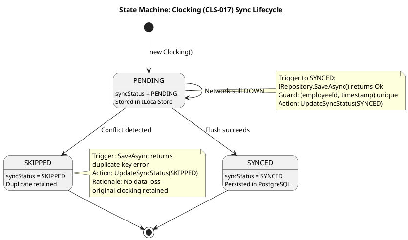

#### SyncRecord (CLS-021) — Queue Entry Lifecycle

SyncRecord tracks each queued clocking through the sync process. The single-writer lock (SemaphoreSlim(1,1)) ensures no concurrent flush operations.

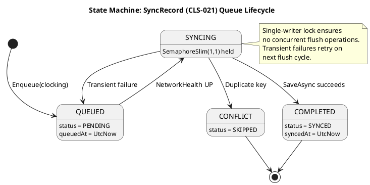

#### Employee (CLS-019) — Directory Lifecycle

The Employee entity tracks active/inactive status and AD sync override state. The overrideFlag mechanism resolves the AD sync conflict risk (RISK-R01, RPN 30).

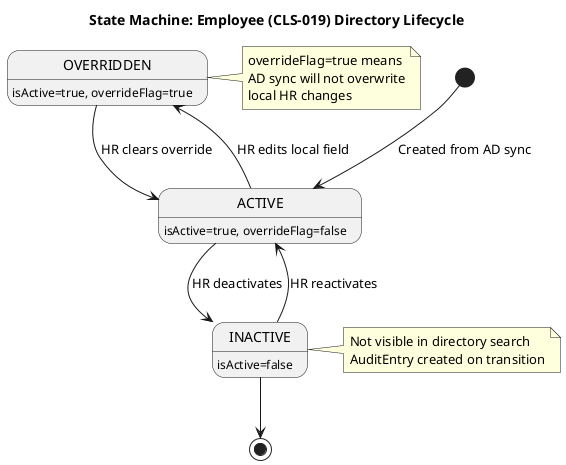
## Domain Model
### Analysis Classes

The analysis class model identifies boundary, control, and entity classes for all 7 use cases. Boundary classes are referenced from the UI Designer's contribution (view/controller classes in the Design Overview section); control and entity classes are the Designer's contribution.

**Three-Level Mechanism Resolution:**

| Analysis Mechanism | Design Mechanism | Implementation Mechanism | Risk |
|---|---|---|---|
| Persistence | Repository pattern with `IRepository<T>` | EF Core 10.0 + Npgsql (PostgreSQL) | — |
| Offline persistence | Local store with `ILocalStore` | EF Core 10.0 + SQLite | RISK-T01 |
| Authentication | `IAuthProvider` interface | LDAP/OAuth2 adapter (spike deferred to Construction) | RISK-T02 |
| Audit trail | `IAuditLogger` interface | Append-only AuditEntry table via EF Core | — |
| Network detection | `INetworkHealth` interface | TcpHealthMonitor (TCP probe to pg:5432 every 5s) | RISK-T01 |
| Export | `IExportService` interface | CsvExporter (RFC 4180 compliant) | — |

```plantuml
@startuml
skinparam classAttributeIconSize 0
skinparam shadowing false
skinparam defaultFontName "Segoe UI"
skinparam class {
  BackgroundColor<<boundary>> #e8f5e9
  BackgroundColor<<control>> #e3f2fd
  BackgroundColor<<entity>> #fff3e0
  BackgroundColor<<infrastructure>> #fce4ec
  BorderColor #37474f
}

title Analysis Classes — Employee Portal (All UCs)

' === Boundary Classes (from UI Designer, referenced not redefined) ===
package "Boundary (Presentation)" {
  class "HomePage\n(ACL-001)" as ACL_001 <<boundary>> {
    + OnGet() : Task<PageResult>
    + OnPostClockIn() : Task<PageResult>
    + OnPostClockOut() : Task<PageResult>
  }
  class "HistoryPage\n(ACL-002)" as ACL_002 <<boundary>> {
    + OnGet(month: int) : Task<PageResult>
  }
  class "AdminClockingsPage\n(ACL-003)" as ACL_003 <<boundary>> {
    + OnGet(month: int) : Task<PageResult>
    + OnPostExport(month: int) : Task<FileResult>
  }
  class "AdminNewsPage\n(ACL-004)" as ACL_004 <<boundary>> {
    + OnGet() : Task<PageResult>
    + OnPostPublish(newsItem: NewsItem) : Task<PageResult>
  }
  class "NewsListPage\n(ACL-005)" as ACL_005 <<boundary>> {
    + OnGet(category: string?) : Task<PageResult>
  }
  class "NewsDetailPage\n(ACL-006)" as ACL_006 <<boundary>> {
    + OnGet(id: Guid) : Task<PageResult>
  }
  class "DirectoryPage\n(ACL-007)" as ACL_007 <<boundary>> {
    + OnGet(query: string, dept: string?, office: string?) : Task<PageResult>
  }
  class "AdminDirectoryPage\n(ACL-008)" as ACL_008 <<boundary>> {
    + OnGet() : Task<PageResult>
    + OnPostUpdate(emp: Employee) : Task<PageResult>
    + OnPostSyncAD() : Task<PageResult>
  }
}

' === Control Classes (Application Layer) ===
package "Control (Application)" {
  class "TimeTrackingService\n(ACL-009)" as ACL_009 <<control>> {
    + ClockIn(employeeId: Guid) : Result<Clocking>
    + ClockOut(employeeId: Guid) : Result<Clocking>
    + GetClockings(employeeId: Guid, month: DateTime) : List<Clocking>
    + GetAllClockings(month: DateTime) : List<Clocking>
    + ExportClockings(month: DateTime) : byte[]
  }
  class "NewsService\n(ACL-010)" as ACL_010 <<control>> {
    + PublishNews(item: NewsItem) : Result<NewsItem>
    + GetNewsList(category: string?) : List<NewsItem>
    + GetNewsDetail(id: Guid) : NewsItem
  }
  class "DirectoryService\n(ACL-011)" as ACL_011 <<control>> {
    + Search(query: string, dept: string?, office: string?) : List<Employee>
    + UpdateEmployee(emp: Employee) : Result<Employee>
    + SyncFromAD() : SyncResult
  }
  class "AuditInterceptor\n(ACL-012)" as ACL_012 <<control>> {
    + Log(entityType: string, entityId: string, action: string, user: string) : void
  }
  class "SyncQueue\n(ACL-013)" as ACL_013 <<control>> {
    + Enqueue(clocking: Clocking) : Result<int>
    + Flush() : SyncResult
    + GetPendingCount() : int
  }
}

' === Entity Classes (Domain Layer) ===
package "Entity (Domain)" {
  class "Clocking\n(ACL-014)" as ACL_014 <<entity>> {
    + id: Guid
    + employeeId: Guid
    + type: ClockingType
    + timestamp: DateTime
    + syncStatus: SyncStatus
  }
  class "NewsItem\n(ACL-015)" as ACL_015 <<entity>> {
    + id: Guid
    + title: string
    + body: string
    + publishedDate: DateTime
    + category: Category
    + isFeatured: bool
  }
  class "Employee\n(ACL-016)" as ACL_016 <<entity>> {
    + id: Guid
    + adId: string
    + fullName: string
    + jobTitle: string
    + department: string
    + office: string
    + email: string
    + extension: string
    + isActive: bool
    + overrideFlag: bool
  }
  class "AuditEntry\n(ACL-017)" as ACL_017 <<entity>> {
    + id: Guid
    + entityType: string
    + entityId: string
    + action: string
    + user: string
    + timestamp: DateTime
  }
  class "SyncRecord\n(ACL-018)" as ACL_018 <<entity>> {
    + localId: int
    + clockingId: Guid
    + status: SyncStatus
    + queuedAt: DateTime
    + syncedAt: DateTime?
  }
}

' === Enumerations ===
enum "ClockingType" as CT {
  IN
  OUT
}
enum "SyncStatus" as SS {
  PENDING
  SYNCED
  SKIPPED
}
enum "Category" as CAT {
  General
  HR
  IT
  Events
}

' === Relationships ===
' Boundary -> Control
ACL_001 --> ACL_009 : delegates
ACL_002 --> ACL_009 : delegates
ACL_003 --> ACL_009 : delegates
ACL_004 --> ACL_010 : delegates
ACL_005 --> ACL_010 : delegates
ACL_006 --> ACL_010 : delegates
ACL_007 --> ACL_011 : delegates
ACL_008 --> ACL_011 : delegates

' Control -> Entity
ACL_009 ..> ACL_014 : creates/reads
ACL_009 --> ACL_013 : delegates offline
ACL_013 ..> ACL_014 : syncs
ACL_013 ..> ACL_018 : manages
ACL_010 ..> ACL_015 : creates/reads
ACL_010 --> ACL_012 : logs
ACL_011 ..> ACL_016 : reads/updates
ACL_011 --> ACL_012 : logs
ACL_012 ..> ACL_017 : creates

' Entity -> Enum
ACL_014 --> CT
ACL_014 --> SS
ACL_018 --> SS
ACL_015 --> CAT

note bottom of ACL_013
  **Offline Sync Mechanism (Design)**
  Analysis: "persist clockings offline"
  Design: SyncQueue + ILocalStore (SQLite)
  Implementation: SemaphoreSlim(1,1) single-writer lock
  Resolves RISK-T01 (RPN 63)
end note

note bottom of ACL_012
  **Audit Mechanism (Design)**
  Analysis: "log directory/news changes"
  Design: IAuditLogger interface + AuditInterceptor
  Implementation: Append-only AuditEntry table via EF Core
  Resolves REQ-004, REQ-005, REQ-006
end note

@enduml
```

### Analysis Class to Use-Case Traceability

| Analysis Class | ID | Participates In UCs | Stereotype |
|---|---|---|---|
| HomePage | ACL-001 | UC-001 | <<boundary>> |
| HistoryPage | ACL-002 | UC-002 | <<boundary>> |
| AdminClockingsPage | ACL-003 | UC-003 | <<boundary>> |
| AdminNewsPage | ACL-004 | UC-004 | <<boundary>> |
| NewsListPage | ACL-005 | UC-005 | <<boundary>> |
| NewsDetailPage | ACL-006 | UC-005 | <<boundary>> |
| DirectoryPage | ACL-007 | UC-006 | <<boundary>> |
| AdminDirectoryPage | ACL-008 | UC-007 | <<boundary>> |
| TimeTrackingService | ACL-009 | UC-001, UC-002, UC-003 | <<control>> |
| NewsService | ACL-010 | UC-004, UC-005 | <<control>> |
| DirectoryService | ACL-011 | UC-006, UC-007 | <<control>> |
| AuditInterceptor | ACL-012 | UC-004, UC-007 | <<control>> |
| SyncQueue | ACL-013 | UC-001 | <<control>> |
| Clocking | ACL-014 | UC-001, UC-002, UC-003 | <<entity>> |
| NewsItem | ACL-015 | UC-004, UC-005 | <<entity>> |
| Employee | ACL-016 | UC-006, UC-007 | <<entity>> |
| AuditEntry | ACL-017 | UC-004, UC-007 | <<entity>> |
| SyncRecord | ACL-018 | UC-001 | <<entity>> |
## Use-Case Realizations
### Use-Case Realizations — Sequence Diagrams

The following sequence diagrams realize each use case as a collaboration of design objects. Each realization shows the main flow and key alternative/exception flows. The SAD's Use-Case View contains architecturally-focused sequences for UC-001, UC-003, and UC-007; the realizations below provide full design-level detail for all 7 UCs with explicit object responsibilities, interface calls, and error handling.

#### SEQ-001: UC-001 Clock In/Out — Offline Fault Tolerance

**Participating objects:** HomePage (CLS-001), ClockingController (CLS-002), TimeTrackingService (CLS-009), INetworkHealth (INT-005), SyncQueue (CLS-013), Clocking (CLS-014), IRepository<Clocking> (INT-002), ILocalStore (INT-003)

**Design decisions validated:**
- INetworkHealth decouples health detection — TcpHealthMonitor probes pg:5432 every 5s
- SyncQueue manages offline-to-online transition with conflict detection by (employeeId, timestamp) uniqueness
- Transient PostgreSQL failure falls back to offline path — zero data loss (REQ-014)
- User receives immediate confirmation in both modes (<1s, REQ-017)

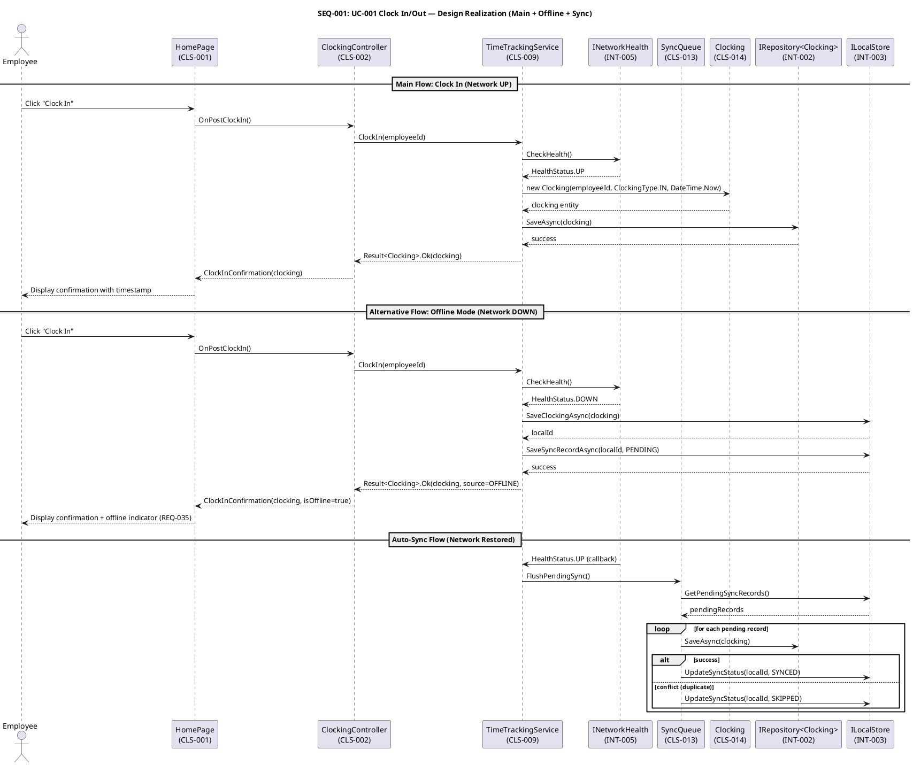

#### SEQ-002: UC-004 Publish News — Audit Trail

**Participating objects:** AdminNewsPage (CLS-005), NewsController (CLS-006), NewsService (CLS-010), News (CLS-015), IAuditLogger (INT-006), IRepository<News> (INT-002)

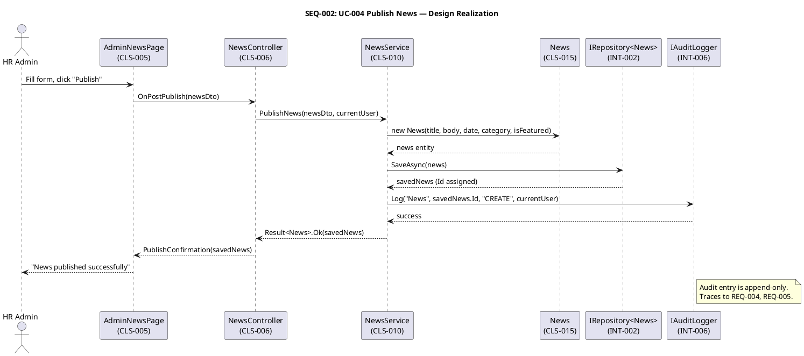

#### SEQ-003: UC-006 Search Directory — Performance

**Participating objects:** DirectoryPage (CLS-007), DirectoryController (CLS-008), DirectoryService (CLS-011), Employee (CLS-019), IRepository<Employee> (INT-002)

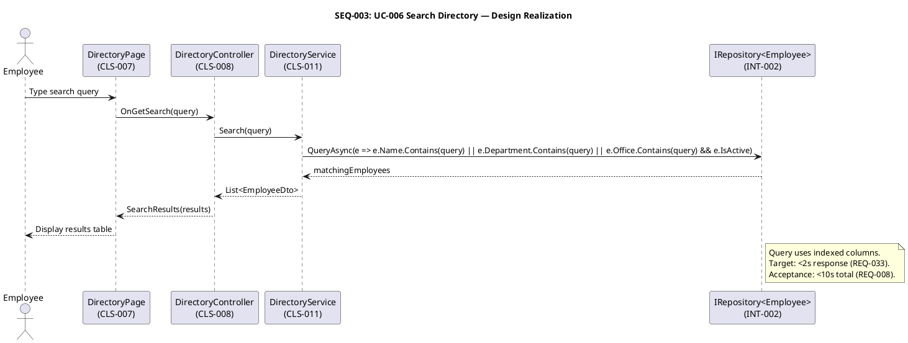

#### SEQ-004: UC-002 View Clocking History

**Participating objects:** HistoryPage (CLS-003), ClockingController (CLS-002), TimeTrackingService (CLS-009), IRepository<Clocking> (INT-002)

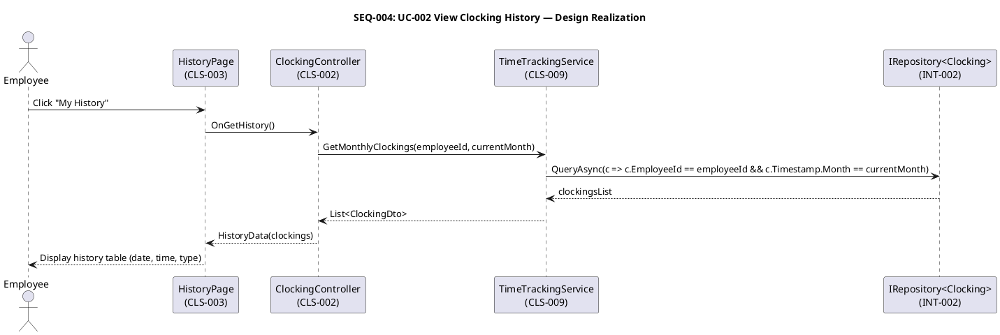

#### SEQ-005: UC-003 Review and Export Clockings

**Participating objects:** AdminClockingsPage (CLS-004), ClockingController (CLS-002), TimeTrackingService (CLS-009), IExportService (INT-004), IRepository<Clocking> (INT-002)

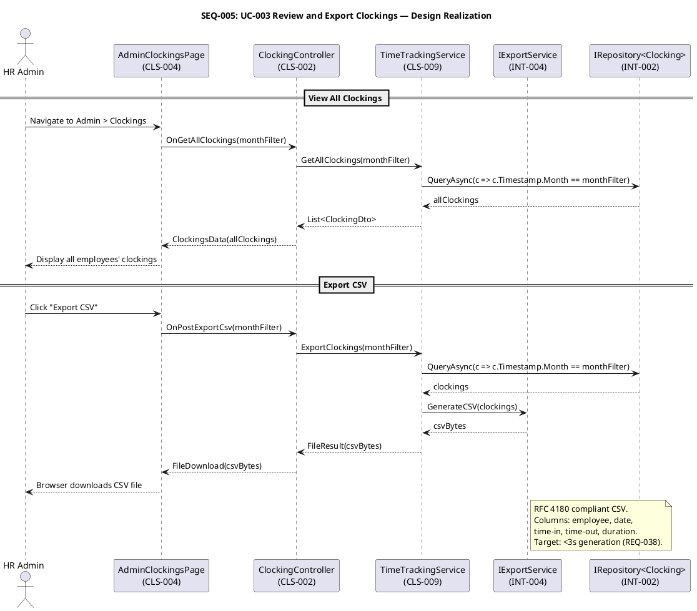

#### SEQ-006: UC-005 Read News

**Participating objects:** NewsListPage (CLS-005a), NewsDetailPage (CLS-005b), NewsController (CLS-006), NewsService (CLS-010), IRepository<News> (INT-002)

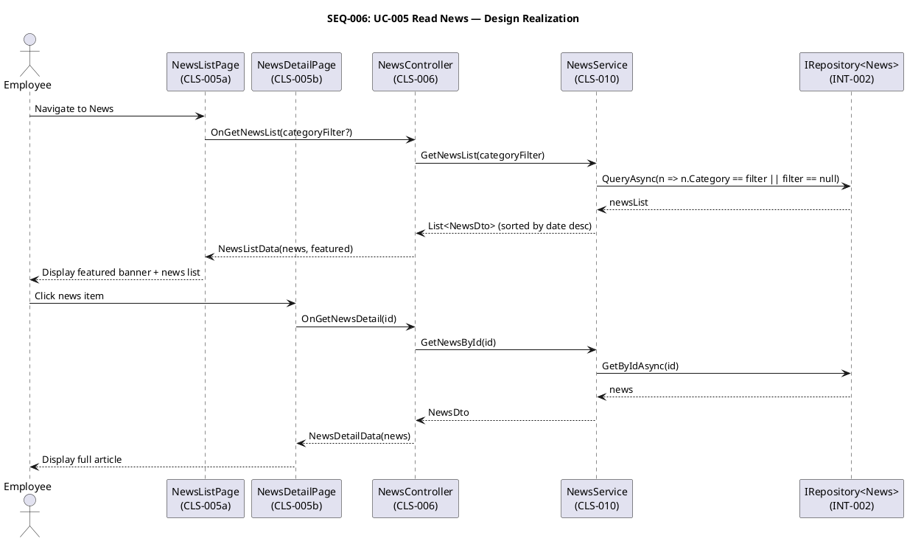

#### SEQ-007: UC-007 Manage Directory — AD Sync Conflict

**Participating objects:** AdminDirectoryPage (CLS-008a), DirectoryController (CLS-008), DirectoryService (CLS-011), Employee (CLS-019), IAuthProvider (INT-001), IAuditLogger (INT-006), IRepository<Employee> (INT-002)

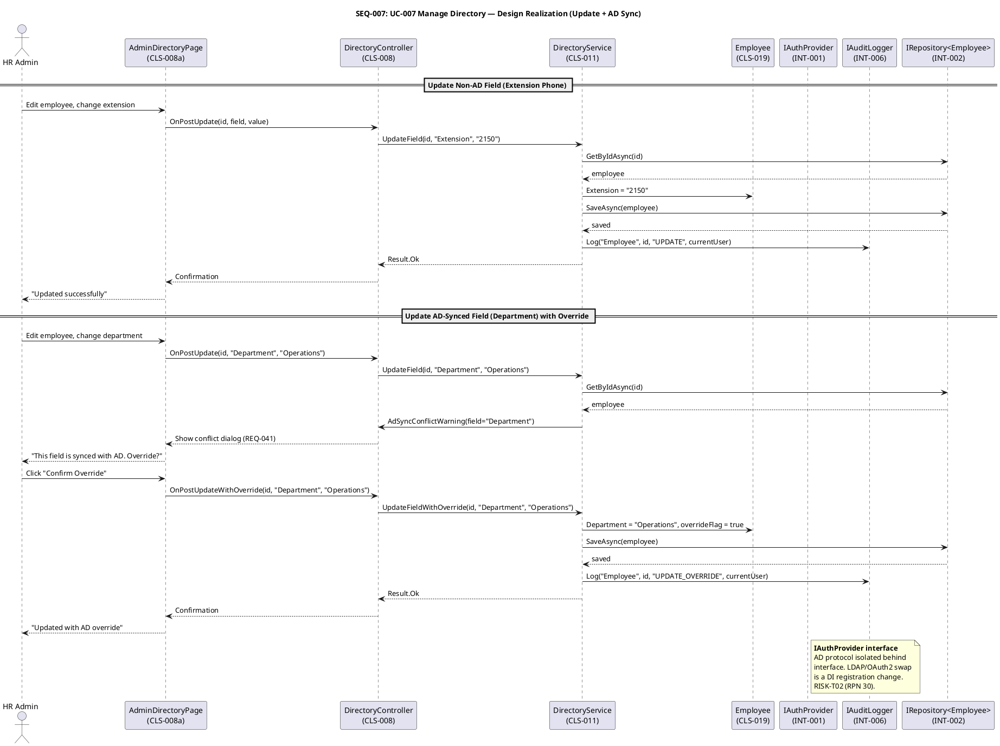

### Use-Case Realization Coverage

| UC ID | Use Case | Seq ID | Flows Covered | Architectural Significance |
|---|---|---|---|---|
| UC-001 | Clock In/Out | SEQ-001 | Main, Offline, Auto-Sync, Transient Failure | Critical — offline fault tolerance |
| UC-002 | View Clocking History | SEQ-004 | Main, No Clockings | Low — simple read |
| UC-003 | Review and Export Clockings | SEQ-005 | Main (View), Export CSV | High — CSV export mechanism |
| UC-004 | Publish News | SEQ-002 | Main, Validation Error, Repo Failure | Medium — audit trail |
| UC-005 | Read News | SEQ-006 | Main, Category Filter, Detail View | Low — read-only |
| UC-006 | Search Directory | SEQ-003 | Main, Dept Filter, No Results | Medium — performance constraint |
| UC-007 | Manage Directory | SEQ-007 | Update, AD Sync, AD Unavailable | High — AD sync + audit |

### UI Storyboards — Stakeholder Validation Flows

> **Contributed by User-Interface Designer (Elaboration Iteration 2)** — Per work order directive: "Create storyboards visualizing critical use-case flows for stakeholder validation." These activity diagrams show the user-facing interaction sequences with Employee/System swimlanes, distinct from the sequence diagrams above which show object collaborations. Storyboards are the stimulus material for prototype validation sessions with stakeholders.

#### SB-001: UC-001 Clock In/Out — Storyboard

**Traces to:** UC-001 Main Flow, AF-1 (offline), EF-1 (session expired)
**Usability requirements:** REQ-009, REQ-030, REQ-031, REQ-035, REQ-036

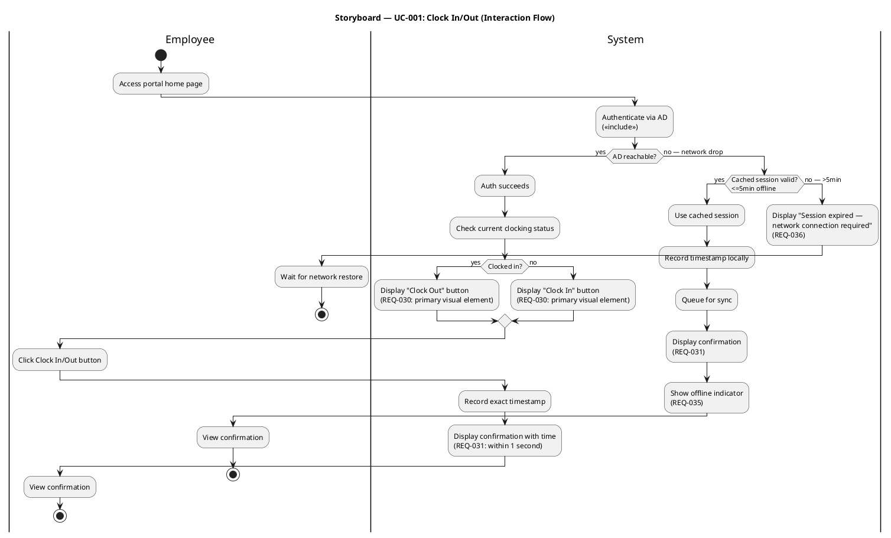

#### SB-002: UC-005 Read News — Storyboard

**Traces to:** UC-005 Main Flow
**Usability requirements:** REQ-011, REQ-034

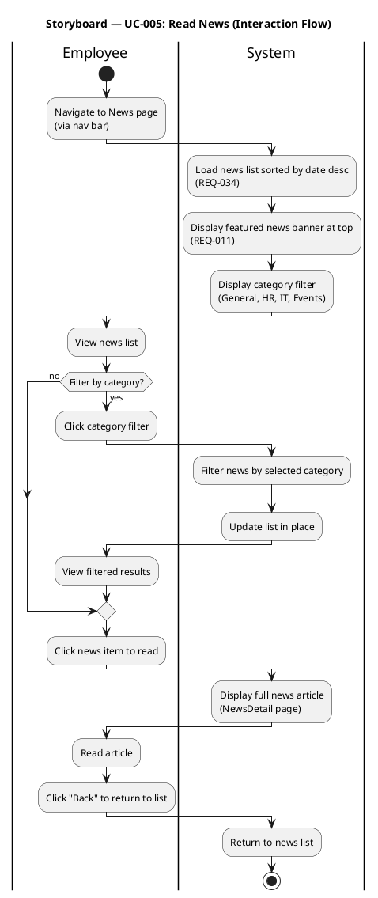

#### SB-003: UC-006 Search Directory — Storyboard

**Traces to:** UC-006 Main Flow
**Usability requirements:** REQ-008, REQ-033

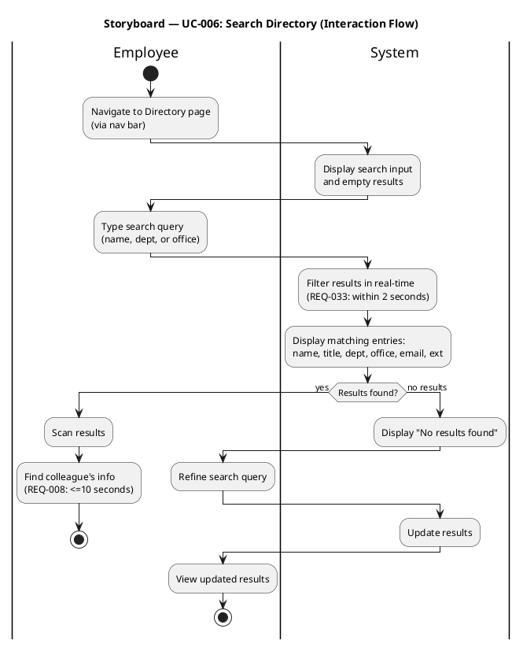

#### SB-004: UC-004 Publish News — Storyboard

**Traces to:** UC-004 Main Flow
**Usability requirements:** REQ-039, REQ-043

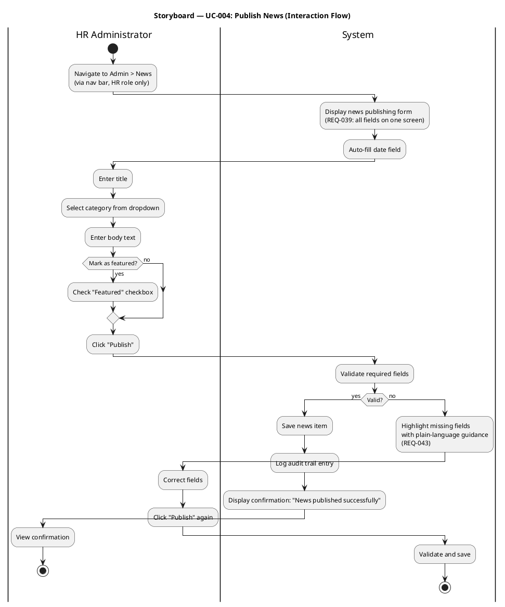

### UI Wireframes — Primary Screens

> **Contributed by User-Interface Designer** — Salt wireframe mockups for the four primary screens. These are the stimulus material for prototype validation sessions. The Implementer builds from these wireframes in Construction.

#### WF-001: Login Page

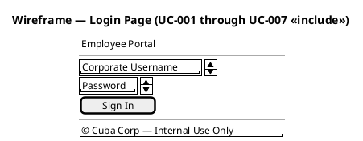

**Design rationale:** Minimal login page — only username and password fields. No registration link (AD-managed accounts). Corporate branding for familiarity. REQ-001 (AD auth) is the underlying mechanism.

#### WF-002: Home / Clock In-Out Page

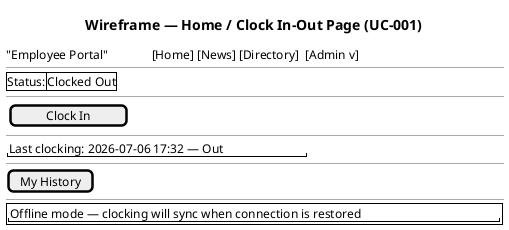

**Design rationale:**
- Clock In/Out button is the primary visual element (REQ-030): top-center, large, high-contrast
- Status label visible above button — employee knows current state before acting
- "My History" link provides quick access to UC-002
- Offline indicator banner appears only when network drops (REQ-035) — hidden when online
- Navigation bar consistent across all pages (REQ-042): Home, News, Directory, Admin (HR only)
- Admin dropdown visible only for HR role (REQ-037)

#### WF-003: Directory Search Page

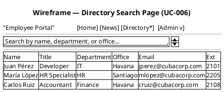

**Design rationale:**
- Single search input accepts name, department, or office — reduces cognitive load (Nielsen #6: recognition over recall)
- Results table shows all required fields: name, title, department, office, email, extension
- Real-time filtering (REQ-033) — no "Search" button needed; results update as user types
- Active page highlighted in nav bar (Directory*) for orientation (REQ-042)
- Target: colleague's phone/email found in ≤10 seconds from home page (REQ-008, acceptance criterion)

#### WF-004: Admin News Publishing Page

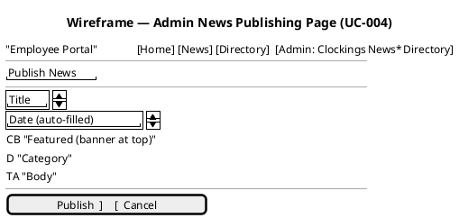

**Design rationale:**
- All required fields on one screen — no multi-step wizard (REQ-039, acceptance criterion: HR publishes without technical assistance)
- Date auto-filled to reduce input burden
- Category dropdown: General, HR, IT, Events (matches declared scope)
- Featured checkbox controls banner display on news list page
- Body text area provides ample space for article content
- Cancel button provides emergency exit (Nielsen #3: user control and freedom)

### Navigation Topology — State Machine

> **Contributed by User-Interface Designer** — Formal UML state machine defining all screens, transitions, and guard conditions. Verified for reachability (all screens reachable from Login), no dead-end screens (every screen has nav bar with "Home" link), and explicit terminal states (logout from all content screens).

```plantuml
@startuml
title Employee Portal — Navigation Topology (State Machine)

skinparam state {
  BackgroundColor #ecf0f1
  BorderColor #2c3e50
  FontName "Segoe UI"
}
skinparam note {
  BackgroundColor #fffde7
  BorderColor #f57f17
}

[*] --> Login : [portal accessed]

state Login {
  Login : Screen: Login Page
  Login : AD credentials input
  Login : REQ-001 (AD auth)
}

Login --> Home : [auth success]
Login --> Login : [auth failure — retry]
Login --> SessionExpired : [cached session expired\n>5min offline (EF-1)]

state Home {
  Home : Screen: Home/Clock Page
  Home : Clock In/Out button (REQ-030)
  Home : Status label
  Home : Offline indicator (REQ-035)
}

Home --> Home : [clock in/out clicked\n→ confirmation (REQ-031)]
Home --> History : [click "My History"]
Home --> NewsList : [click "News" in nav]
Home --> Directory : [click "Directory" in nav]
Home --> AdminClockings : [click "Admin > Clockings"\nguard: role=HR]
Home --> AdminNews : [click "Admin > News"\nguard: role=HR]
Home --> AdminDirectory : [click "Admin > Directory"\nguard: role=HR]

state History {
  History : Screen: Clocking History
  History : Current month table (REQ-032)
}

History --> Home : [click "Home"]
History --> NewsList : [click "News"]
History --> Directory : [click "Directory"]

state NewsList {
  NewsList : Screen: News List
  NewsList : Featured banner (REQ-034)
  NewsList : Category filter (REQ-011)
}

NewsList --> NewsDetail : [click news item]
NewsList --> Home : [click "Home"]
NewsList --> Directory : [click "Directory"]

state NewsDetail {
  NewsDetail : Screen: News Detail
  NewsDetail : Full article view
}

NewsDetail --> NewsList : [click "Back"]
NewsDetail --> Home : [click "Home"]

state Directory {
  Directory : Screen: Directory Search
  Directory : Real-time filter (REQ-033)
  Directory : Results: name, title, dept, office, email, ext
}

Directory --> Home : [click "Home"]
Directory --> NewsList : [click "News"]

state AdminClockings {
  AdminClockings : Screen: Admin Clockings
  AdminClockings : All employees' clockings
  AdminClockings : Export CSV button (REQ-038)
}

AdminClockings --> Home : [click "Home"]
AdminClockings --> AdminNews : [click "Admin > News"]
AdminClockings --> AdminDirectory : [click "Admin > Directory"]

state AdminNews {
  AdminNews : Screen: Admin News Publishing
  AdminNews : Form: title, body, date, category, featured (REQ-039)
}

AdminNews --> AdminNews : [submit → confirmation]
AdminNews --> Home : [click "Home"]
AdminNews --> AdminClockings : [click "Admin > Clockings"]
AdminNews --> AdminDirectory : [click "Admin > Directory"]

state AdminDirectory {
  AdminDirectory : Screen: Admin Directory Management
  AdminDirectory : Entry list with edit/deactivate (REQ-040)
  AdminDirectory : AD sync conflict dialog (REQ-041)
}

AdminDirectory --> AdminDirectory : [edit → save → confirmation\nor AD conflict dialog]
AdminDirectory --> Home : [click "Home"]
AdminDirectory --> AdminClockings : [click "Admin > Clockings"]
AdminDirectory --> AdminNews : [click "Admin > News"]

state SessionExpired {
  SessionExpired : Screen: Session Expired
  SessionExpired : "Session expired —\nnetwork connection required" (REQ-036)
}

SessionExpired --> Login : [network restored]

state ErrorGeneric {
  ErrorGeneric : Screen: Error Page
  ErrorGeneric : Plain language + recovery (REQ-043)
}

Home --> ErrorGeneric : [unexpected error]
NewsList --> ErrorGeneric : [unexpected error]
Directory --> ErrorGeneric : [unexpected error]
AdminClockings --> ErrorGeneric : [unexpected error]
AdminNews --> ErrorGeneric : [unexpected error]
AdminDirectory --> ErrorGeneric : [unexpected error]
ErrorGeneric --> Home : [click "Try Again"]

Home --> [*] : [logout]
NewsList --> [*] : [logout]
Directory --> [*] : [logout]
History --> [*] : [logout]
AdminClockings --> [*] : [logout]
AdminNews --> [*] : [logout]
AdminDirectory --> [*] : [logout]

note right of Home
  **Reachability verified:**
  All 11 screens reachable from Login.
  No dead-end screens — every screen
  has nav bar with "Home" link.
  ErrorGeneric reachable from all
  content screens.
  SessionExpired reachable only from
  Login (offline >5min).
end note

@enduml
```

### Screen Inventory

| Screen ID | Screen Name | State in Topology | UC Traces | Wireframe |
|---|---|---|---|---|
| SCR-001 | Login Page | Login | UC-001–UC-007 (<<include>>) | WF-001 |
| SCR-002 | Home / Clock Page | Home | UC-001 | WF-002 |
| SCR-003 | Clocking History | History | UC-002 | — |
| SCR-004 | News List | NewsList | UC-005 | — |
| SCR-005 | News Detail | NewsDetail | UC-005 | — |
| SCR-006 | Directory Search | Directory | UC-006 | WF-003 |
| SCR-007 | Admin Clockings | AdminClockings | UC-003 | — |
| SCR-008 | Admin News Publishing | AdminNews | UC-004 | WF-004 |
| SCR-009 | Admin Directory Management | AdminDirectory | UC-007 | — |
| SCR-010 | Session Expired | SessionExpired | UC-001 EF-1 | — |
| SCR-011 | Error Page | ErrorGeneric | All UCs (error handling) | — |

### Prototype Validation Plan

| Session | Participants | Method | Tasks | Usability Criteria Measured |
|---|---|---|---|---|
| VP-1 | 5 untrained employees | Think-aloud usability test | Clock in/out from home page | REQ-009 (≥80% success, ≤30s), REQ-030, REQ-031 |
| VP-2 | 5 employees | Timed task | Find colleague's phone/email from portal home | REQ-008 (≤10s), REQ-033 |
| VP-3 | Laura Gómez (HR Director) | Guided walkthrough | Publish a news item with featured banner | REQ-039, REQ-011 |
| VP-4 | 3 employees | Observation | Filter news by category; navigate between pages | REQ-034, REQ-042 |
| VP-5 | 3 employees | Error injection | Trigger offline mode; observe response | REQ-035, REQ-036 |

### Storyboard Coverage

| UC ID | Use Case | Storyboard | Wireframe | Validation Session |
|---|---|---|---|---|
| UC-001 | Clock In/Out | SB-001 | WF-002 | VP-1, VP-5 |
| UC-002 | View Clocking History | (covered by Navigation Topology) | — | VP-1 |
| UC-003 | Review and Export Clockings | (covered by Navigation Topology) | — | — |
| UC-004 | Publish News | SB-004 | WF-004 | VP-3 |
| UC-005 | Read News | SB-002 | — | VP-4 |
| UC-006 | Search Directory | SB-003 | WF-003 | VP-2 |
| UC-007 | Manage Directory | (covered by Navigation Topology) | — | — |
## Design Packages and Classes
### Design Class Diagrams — Per Package (Designer Contribution)

> **Contributed by Designer (Analysis & Design)** — Concrete design classes with full signatures, visibility modifiers, relationships, and interface realizations. These refine the analysis classes (ACL-001 through ACL-018) from the Domain Model section into implementable design classes (CLS-009 through CLS-031).

#### Design Class Diagram — Application, Domain & Infrastructure Packages

The following class diagram defines all design classes across three packages with full operation signatures, private fields, constructor parameters, and interface realizations. The Presentation package (UI Designer contribution) is referenced but not redefined here.

```plantuml
@startuml
skinparam classAttributeIconSize 0
skinparam shadowing false
skinparam defaultFontName "Segoe UI"
skinparam class {
  BackgroundColor<<view>> #e8f5e9
  BackgroundColor<<controller>> #e3f2fd
  BackgroundColor<<service>> #fff3e0
  BackgroundColor<<entity>> #fce4ec
  BackgroundColor<<infrastructure>> #f3e5f5
  BackgroundColor<<enum>> #e0f7fa
  BorderColor #37474f
}

title Design Classes — Application & Domain Packages (Full Signatures)

' === Application Package ===
package "Application (SUB-APP)" {
  class "TimeTrackingService\n(CLS-009)" as CLS_009 <<service>> {
    - _repo: IRepository<Clocking>
    - _localStore: ILocalStore
    - _networkHealth: INetworkHealth
    - _exportService: IExportService
    - _logger: ILogger<TimeTrackingService>
    + TimeTrackingService(repo, localStore, networkHealth, exportService, logger)
    + ClockIn(employeeId: Guid) : Result<Clocking>
    + ClockOut(employeeId: Guid) : Result<Clocking>
    + GetClockings(employeeId: Guid, month: DateTime) : List<Clocking>
    + GetAllClockings(month: DateTime) : List<Clocking>
    + ExportClockings(month: DateTime) : byte[]
    - TryOnlineSave(clocking: Clocking) : Result<Clocking>
    - TryOfflineSave(clocking: Clocking) : Result<Clocking>
  }

  class "NewsService\n(CLS-010)" as CLS_010 <<service>> {
    - _repo: IRepository<NewsItem>
    - _auditLogger: IAuditLogger
    - _logger: ILogger<NewsService>
    + NewsService(repo, auditLogger, logger)
    + PublishNews(item: NewsItem) : Result<NewsItem>
    + GetNewsList(category: string?) : List<NewsItem>
    + GetNewsDetail(id: Guid) : NewsItem?
    - ValidateNewsItem(item: NewsItem) : ValidationResult
  }

  class "DirectoryService\n(CLS-011)" as CLS_011 <<service>> {
    - _repo: IRepository<Employee>
    - _authProvider: IAuthProvider
    - _auditLogger: IAuditLogger
    - _logger: ILogger<DirectoryService>
    + DirectoryService(repo, authProvider, auditLogger, logger)
    + Search(query: string, dept: string?, office: string?) : List<Employee>
    + UpdateEmployee(emp: Employee) : Result<Employee>
    + SyncFromAD() : SyncResult
    - ResolveConflict(local: Employee, adRecord: ADEmployeeRecord) : Employee
  }

  class "SyncQueue\n(CLS-013)" as CLS_013 <<service>> {
    - _localStore: ILocalStore
    - _repo: IRepository<Clocking>
    - _semaphore: SemaphoreSlim
    - _logger: ILogger<SyncQueue>
    + SyncQueue(localStore, repo, logger)
    + Enqueue(clocking: Clocking) : Result<int>
    + Flush() : SyncResult
    + GetPendingCount() : int
    - FlushSingle(record: SyncRecord) : SyncStatus
  }

  class "AuditInterceptor\n(CLS-012)" as CLS_012 <<service>> {
    - _auditLogger: IAuditLogger
    + AuditInterceptor(auditLogger)
    + Log(entityType: string, entityId: string, action: string, user: string) : Task
  }
}

' === Domain Package ===
package "Domain (SUB-DOMAIN)" {
  class "Clocking\n(CLS-014)" as CLS_014 <<entity>> {
    + Id: Guid { get; set; }
    + EmployeeId: Guid { get; set; }
    + Type: ClockingType { get; set; }
    + Timestamp: DateTime { get; set; }
    + Source: string { get; set; }
    + SyncStatus: SyncStatus { get; set; }
    + Clocking(employeeId: Guid, type: ClockingType, timestamp: DateTime)
    + IsOnline() : bool
  }

  class "NewsItem\n(CLS-015)" as CLS_015 <<entity>> {
    + Id: Guid { get; set; }
    + Title: string { get; set; }
    + Body: string { get; set; }
    + PublishedDate: DateTime { get; set; }
    + Category: NewsCategory { get; set; }
    + IsFeatured: bool { get; set; }
    + NewsItem(title: string, body: string, category: NewsCategory, isFeatured: bool)
  }

  class "Employee\n(CLS-016)" as CLS_016 <<entity>> {
    + Id: Guid { get; set; }
    + AdId: string { get; set; }
    + FullName: string { get; set; }
    + JobTitle: string { get; set; }
    + Department: string { get; set; }
    + Office: string { get; set; }
    + Email: string { get; set; }
    + Extension: string { get; set; }
    + IsActive: bool { get; set; }
    + OverrideFlag: bool { get; set; }
    + Employee(adId: string, fullName: string)
    + Deactivate() : void
    + Reactivate() : void
    + SetOverride(field: string) : void
    + ClearOverride() : void
  }

  class "AuditEntry\n(CLS-017)" as CLS_017 <<entity>> {
    + Id: Guid { get; set; }
    + EntityType: string { get; set; }
    + EntityId: string { get; set; }
    + Action: string { get; set; }
    + User: string { get; set; }
    + Timestamp: DateTime { get; set; }
    + AuditEntry(entityType: string, entityId: string, action: string, user: string)
  }

  class "SyncRecord\n(CLS-018)" as CLS_018 <<entity>> {
    + LocalId: int { get; set; }
    + ClockingId: Guid { get; set; }
    + Status: SyncStatus { get; set; }
    + QueuedAt: DateTime { get; set; }
    + SyncedAt: DateTime? { get; set; }
    + SyncRecord(clockingId: Guid)
  }

  class "SyncResult\n(CLS-020)" as CLS_020 <<entity>> {
    + TotalRecords: int
    + Synced: int
    + Skipped: int
    + Failed: int
    + Errors: List<string>
    + SyncResult(total: int, synced: int, skipped: int, failed: int)
    + IsSuccess() : bool
  }

  class "PortalUser\n(CLS-021)" as CLS_021 <<entity>> {
    + AdId: string { get; set; }
    + FullName: string { get; set; }
    + IsHrAdmin: bool { get; set; }
    + PortalUser(adId: string, fullName: string, isHrAdmin: bool)
  }

  class "AuthResult\n(CLS-022)" as CLS_022 <<entity>> {
    + IsSuccess: bool { get; set; }
    + User: PortalUser? { get; set; }
    + Error: string? { get; set; }
    + AuthResult(success: bool, user: PortalUser?, error: string?)
    + static Ok(user: PortalUser) : AuthResult
    + static Fail(error: string) : AuthResult
  }

  class "ADEmployeeRecord\n(CLS-023)" as CLS_023 <<entity>> {
    + AdId: string { get; set; }
    + FullName: string { get; set; }
    + JobTitle: string { get; set; }
    + Department: string { get; set; }
    + Email: string { get; set; }
  }
}

' === Infrastructure Package ===
package "Infrastructure (SUB-INFRA)" {
  class "PostgresRepository<T>\n(CLS-024)" as CLS_024 <<infrastructure>> {
    - _context: PortalDbContext
    - _dbSet: DbSet<T>
    + PostgresRepository(context: PortalDbContext)
    + GetByIdAsync(id: Guid) : Task<T?>
    + QueryAsync(predicate: Expression<Func<T, bool>>) : Task<List<T>>
    + SaveAsync(entity: T) : Task<Result<T>>
    + DeleteAsync(id: Guid) : Task<bool>
  }

  class "SqliteLocalStore\n(CLS-025)" as CLS_025 <<infrastructure>> {
    - _context: LocalDbContext
    + SqliteLocalStore(context: LocalDbContext)
    + SaveClockingAsync(clocking: Clocking) : Task<int>
    + SaveSyncRecordAsync(localId: int, status: SyncStatus) : Task
    + GetPendingSyncRecords() : Task<List<SyncRecord>>
    + GetClockingByLocalId(localId: int) : Task<Clocking?>
    + UpdateSyncStatus(localId: int, status: SyncStatus) : Task
  }

  class "LdapAuthProvider\n(CLS-026)" as CLS_026 <<infrastructure>> {
    - _ldapConfig: LdapConfig
    + LdapAuthProvider(config: LdapConfig)
    + Authenticate(username: string, password: string) : Task<AuthResult>
    + GetCurrentUser(claims: ClaimsPrincipal) : PortalUser
    + FetchAllEmployeesAsync() : Task<List<ADEmployeeRecord>>
    - BindToAD(username: string, password: string) : bool
  }

  class "CsvExporter\n(CLS-027)" as CLS_027 <<infrastructure>> {
    + GenerateCSV(clockings: List<Clocking>) : byte[]
    - FormatRow(c: Clocking) : string
  }

  class "TcpHealthMonitor\n(CLS-028)" as CLS_028 <<infrastructure>> {
    - _host: string
    - _port: int
    - _interval: TimeSpan
    - _currentStatus: HealthStatus
    - _subscribers: List<Action<HealthStatus>>
    - _timer: Timer
    + TcpHealthMonitor(host: string, port: int, interval: TimeSpan)
    + CheckHealth() : HealthStatus
    + SubscribeHealthChanges(callback: Action<HealthStatus>) : IDisposable
    - Probe() : Task<HealthStatus>
    - NotifySubscribers(status: HealthStatus) : void
  }

  class "EfAuditLogger\n(CLS-029)" as CLS_029 <<infrastructure>> {
    - _context: PortalDbContext
    + EfAuditLogger(context: PortalDbContext)
    + Log(entityType: string, entityId: string, action: string, user: string) : Task
  }

  class "PortalDbContext\n(CLS-030)" as CLS_030 <<infrastructure>> {
    + Clockings: DbSet<Clocking>
    + NewsItems: DbSet<NewsItem>
    + Employees: DbSet<Employee>
    + AuditEntries: DbSet<AuditEntry>
    + SyncRecords: DbSet<SyncRecord>
    + PortalDbContext(options: DbContextOptions)
    + OnModelCreating(modelBuilder: ModelBuilder) : void
  }

  class "LocalDbContext\n(CLS-031)" as CLS_031 <<infrastructure>> {
    + Clockings: DbSet<Clocking>
    + SyncRecords: DbSet<SyncRecord>
    + LocalDbContext(options: DbContextOptions)
    + OnModelCreating(modelBuilder: ModelBuilder) : void
  }
}

' === Enumerations ===
enum "ClockingType" as CT {
  IN
  OUT
}
enum "SyncStatus" as SS {
  PENDING
  SYNCED
  SKIPPED
}
enum "NewsCategory" as NC {
  General
  HR
  IT
  Events
}
enum "HealthStatus" as HS {
  UP
  DOWN
}

' === Interface declarations (referenced) ===
interface "IRepository<T>\n(INT-002)" as INT_002
interface "ILocalStore\n(INT-003)" as INT_003
interface "IAuthProvider\n(INT-001)" as INT_001
interface "IExportService\n(INT-004)" as INT_004
interface "INetworkHealth\n(INT-005)" as INT_005
interface "IAuditLogger\n(INT-006)" as INT_006

' === Interface Realizations (Infrastructure implements interfaces) ===
CLS_024 ..|> INT_002 : IRepository<T>
CLS_025 ..|> INT_003 : ILocalStore
CLS_026 ..|> INT_001 : IAuthProvider
CLS_027 ..|> INT_004 : IExportService
CLS_028 ..|> INT_005 : INetworkHealth
CLS_029 ..|> INT_006 : IAuditLogger

' === Dependencies (Application depends on interfaces) ===
CLS_009 --> INT_002 : uses
CLS_009 --> INT_003 : uses
CLS_009 --> INT_005 : uses
CLS_009 --> INT_004 : uses
CLS_010 --> INT_002 : uses
CLS_010 --> INT_006 : uses
CLS_011 --> INT_002 : uses
CLS_011 --> INT_001 : uses
CLS_011 --> INT_006 : uses
CLS_013 --> INT_003 : uses
CLS_013 --> INT_002 : uses
CLS_012 --> INT_006 : uses

' === Domain relationships ===
CLS_014 --> CT
CLS_014 --> SS
CLS_015 --> NC
CLS_018 --> SS
CLS_022 --> CLS_021 : contains

' === Infrastructure context relationships ===
CLS_030 --> CLS_014 : manages
CLS_030 --> CLS_015 : manages
CLS_030 --> CLS_016 : manages
CLS_030 --> CLS_017 : manages
CLS_030 --> CLS_018 : manages
CLS_031 --> CLS_014 : manages
CLS_031 --> CLS_018 : manages

note bottom of CLS_009
  **Offline Strategy:**
  ClockIn/Out checks INetworkHealth first.
  If UP -> IRepository<Clocking> (PostgreSQL).
  If DOWN -> SyncQueue.Enqueue -> ILocalStore (SQLite).
  Flush runs on network restore event.
  NFR: REQ-014 (5-min offline, zero data loss)
  NFR: REQ-017 (<1s response)
end note

note bottom of CLS_011
  **AD Sync Conflict Resolution:**
  If Employee.OverrideFlag == true,
  AD field is NOT overwritten.
  HR must explicitly clear override
  to re-enable AD sync for that field.
  Resolves RISK-T02 (RPN 30)
end note

note bottom of CLS_013
  **Concurrency Control:**
  SemaphoreSlim(1,1) ensures
  single-writer access to SQLite
  during flush operations.
  Resolves RISK-T06 (RPN 16)
end note

@enduml
```

#### Design Class Summary

| Design Class | ID | Package | Stereotype | Analysis Class Origin | Key Responsibilities |
|---|---|---|---|---|---|
| TimeTrackingService | CLS-009 | Application | <<service>> | ACL-009 | Clock in/out with online/offline routing, history retrieval, CSV export |
| NewsService | CLS-010 | Application | <<service>> | ACL-010 | News publishing with audit, list/detail retrieval with category filter |
| DirectoryService | CLS-011 | Application | <<service>> | ACL-011 | Directory search, employee update with audit, AD sync with conflict resolution |
| SyncQueue | CLS-013 | Application | <<service>> | ACL-013 | Offline clocking enqueue, flush to PostgreSQL on network restore, concurrency control |
| AuditInterceptor | CLS-012 | Application | <<service>> | ACL-012 | Cross-cutting audit logging for news and directory operations |
| Clocking | CLS-014 | Domain | <<entity>> | ACL-014 | Time entry entity with type, timestamp, source, sync status |
| NewsItem | CLS-015 | Domain | <<entity>> | ACL-015 | News article entity with category, featured flag, publish date |
| Employee | CLS-016 | Domain | <<entity>> | ACL-016 | Directory entry entity with AD sync override mechanism |
| AuditEntry | CLS-017 | Domain | <<entity>> | ACL-017 | Immutable audit record with entity type, action, user, timestamp |
| SyncRecord | CLS-018 | Domain | <<entity>> | ACL-018 | Offline sync tracking record with status lifecycle |
| SyncResult | CLS-020 | Domain | <<entity>> | (new) | Sync operation outcome with counts and error list |
| PortalUser | CLS-021 | Domain | <<entity>> | (new) | Authenticated user context with HR admin flag |
| AuthResult | CLS-022 | Domain | <<entity>> | (new) | Authentication outcome with success/failure and user |
| ADEmployeeRecord | CLS-023 | Domain | <<entity>> | (new) | AD-sourced employee data for sync operations |
| PostgresRepository<T> | CLS-024 | Infrastructure | <<infrastructure>> | (new) | EF Core repository implementing IRepository<T> for PostgreSQL |
| SqliteLocalStore | CLS-025 | Infrastructure | <<infrastructure>> | (new) | SQLite offline store implementing ILocalStore |
| LdapAuthProvider | CLS-026 | Infrastructure | <<infrastructure>> | (new) | AD/LDAP authentication implementing IAuthProvider |
| CsvExporter | CLS-027 | Infrastructure | <<infrastructure>> | (new) | RFC 4180 CSV export implementing IExportService |
| TcpHealthMonitor | CLS-028 | Infrastructure | <<infrastructure>> | (new) | TCP probe health monitor implementing INetworkHealth |
| EfAuditLogger | CLS-029 | Infrastructure | <<infrastructure>> | (new) | EF Core audit logger implementing IAuditLogger |
| PortalDbContext | CLS-030 | Infrastructure | <<infrastructure>> | (new) | EF Core DbContext for PostgreSQL primary store |
| LocalDbContext | CLS-031 | Infrastructure | <<infrastructure>> | (new) | EF Core DbContext for SQLite offline store |

#### Package Organization & Layer Dependencies

The following package diagram shows the design model organization with layer boundaries enforced by interfaces. No concrete class crosses a layer boundary — the Application layer depends solely on interfaces, and the Infrastructure layer provides implementations.

```plantuml
@startuml
skinparam shadowing false
skinparam defaultFontName "Segoe UI"
skinparam package {
  BorderColor #37474f
  BackgroundColor #f5f5f5
}

title Design Model — Package Organization & Layer Dependencies

package "Presentation (SUB-PRES)" as PRES {
  class "HomePage (CLS-001)" as HP
  class "HistoryPage (CLS-002)" as HIST
  class "AdminClockingsPage (CLS-003)" as ACLK
  class "AdminNewsPage (CLS-004)" as ANEWS
  class "NewsListPage (CLS-005)" as NLIST
  class "NewsDetailPage (CLS-006)" as NDET
  class "DirectoryPage (CLS-007)" as DIR
  class "AdminDirectoryPage (CLS-008)" as ADIR
  class "ClockingController (CLS-002b)" as CC
  class "NewsController (CLS-005b)" as NC
  class "DirectoryController (CLS-007b)" as DC
}

package "Application (SUB-APP)" as APP {
  class "TimeTrackingService (CLS-009)" as TTS
  class "NewsService (CLS-010)" as NS
  class "DirectoryService (CLS-011)" as DS
  class "SyncQueue (CLS-013)" as SQ
  class "AuditInterceptor (CLS-012)" as AI
}

package "Domain (SUB-DOMAIN)" as DOM {
  class "Clocking (CLS-014)" as CLK
  class "NewsItem (CLS-015)" as NI
  class "Employee (CLS-016)" as EMP
  class "AuditEntry (CLS-017)" as AE
  class "SyncRecord (CLS-018)" as SR
  class "SyncResult (CLS-020)" as SRES
  class "PortalUser (CLS-021)" as PU
  class "AuthResult (CLS-022)" as AR
  class "ADEmployeeRecord (CLS-023)" as ADR
}

package "Infrastructure (SUB-INFRA)" as INFRA {
  class "PostgresRepository<T> (CLS-024)" as PR
  class "SqliteLocalStore (CLS-025)" as SL
  class "LdapAuthProvider (CLS-026)" as LDAP
  class "CsvExporter (CLS-027)" as CSV
  class "TcpHealthMonitor (CLS-028)" as THM
  class "EfAuditLogger (CLS-029)" as EAL
  class "PortalDbContext (CLS-030)" as PDB
  class "LocalDbContext (CLS-031)" as LDB
}

package "Interfaces (Boundary Contracts)" as IFACES {
  interface "IAuthProvider (INT-001)" as I1
  interface "IRepository<T> (INT-002)" as I2
  interface "ILocalStore (INT-003)" as I3
  interface "IExportService (INT-004)" as I4
  interface "INetworkHealth (INT-005)" as I5
  interface "IAuditLogger (INT-006)" as I6
}

PRES --> APP : delegates via controllers
APP --> IFACES : depends on
INFRA --> IFACES : implements
APP --> DOM : uses entities

PR ..|> I2
SL ..|> I3
LDAP ..|> I1
CSV ..|> I4
THM ..|> I5
EAL ..|> I6

note right of IFACES
  **Interface-First Boundary**
  No concrete class crosses a layer boundary.
  Application depends on interfaces only.
  Infrastructure provides implementations.
  This enables unit testing with mocks
  and future technology substitution.
end note

note bottom of PRES
  **UI Designer Contribution**
  View/controller classes defined
  in UI sections of Design Model.
  Razor Pages pattern (CON-001).
end note

note bottom of DOM
  **Pure domain — no dependencies**
  Entity classes have no infrastructure
  or application dependencies.
  POCO classes with domain logic only.
end note

@enduml
```

#### Design Decisions

| Decision | Rationale | NFR / Risk Addressed |
|---|---|---|
| Constructor injection for all services | Enables unit testing with mock interfaces; no hidden dependencies | Testability (all UCs) |
| SemaphoreSlim(1,1) in SyncQueue | Single-writer lock prevents SQLite concurrency corruption during flush | RISK-T06 (RPN 16) |
| OverrideFlag on Employee | HR local edits protected from AD sync overwrite; explicit clear required | RISK-T02 (RPN 30) |
| TcpHealthMonitor with subscriber pattern | Decouples health detection from business logic; enables reactive flush on restore | REQ-014 (offline tolerance) |
| Result<T> pattern for operations | Explicit success/failure without exceptions for expected business errors | Reliability (all UCs) |
| Separate LocalDbContext from PortalDbContext | SQLite schema is subset (clockings + sync_records only); no accidental cross-store queries | REQ-014 (zero data loss) |
| EF Core code-first with EnsureCreated for SQLite | Transient buffer store — can be recreated without data loss (data synced before deletion) | Operational simplicity |
## Interface Contracts
### Interface Contracts

All subsystem boundaries are defined by interfaces. No concrete class is referenced across a layer boundary. Each interface specifies operation signatures with pre/postconditions. The Implementer translates these directly into C# interface definitions.

```plantuml
@startuml
skinparam classAttributeIconSize 0
skinparam shadowing false
skinparam defaultFontName "Segoe UI"
skinparam interface {
  BackgroundColor #fffde7
  BorderColor #f57f17
}

title Interface Contracts — Subsystem Boundary Specifications

interface "IAuthProvider\n(INT-001)" as INT_001 {
  + Authenticate(username: string, password: string) : Task<AuthResult>
  + GetCurrentUser(claims: ClaimsPrincipal) : PortalUser
  + FetchAllEmployeesAsync() : Task<List<ADEmployeeRecord>>
  --
  Pre: username and password not null
  Post: AuthResult.IsSuccess == true iff AD bind succeeds
  Post: PortalUser.IsHrAdmin determined by AD group membership
}

interface "IRepository<T>\n(INT-002)" as INT_002 {
  + GetByIdAsync(id: Guid) : Task<T?>
  + QueryAsync(predicate: Expression<Func<T, bool>>) : Task<List<T>>
  + SaveAsync(entity: T) : Task<Result<T>>
  + DeleteAsync(id: Guid) : Task<bool>
  --
  Pre: entity != null for SaveAsync
  Post: SaveAsync returns Result.Ok with persisted entity (Id assigned)
  Post: QueryAsync never returns null (empty list if no matches)
}

interface "ILocalStore\n(INT-003)" as INT_003 {
  + SaveClockingAsync(clocking: Clocking) : Task<int>
  + SaveSyncRecordAsync(localId: int, status: SyncStatus) : Task
  + GetPendingSyncRecords() : Task<List<SyncRecord>>
  + GetClockingByLocalId(localId: int) : Task<Clocking?>
  + UpdateSyncStatus(localId: int, status: SyncStatus) : Task
  --
  Pre: SQLite file exists and is writable
  Post: SaveClockingAsync returns auto-incremented localId
  Post: GetPendingSyncRecords returns only status == PENDING records
}

interface "IExportService\n(INT-004)" as INT_004 {
  + GenerateCSV(clockings: List<Clocking>) : byte[]
  --
  Pre: clockings list not null
  Post: Returns RFC 4180 compliant CSV byte array
  Post: Columns: employee, date, time-in, time-out, duration
}

interface "INetworkHealth\n(INT-005)" as INT_005 {
  + CheckHealth() : HealthStatus
  + SubscribeHealthChanges(callback: Action<HealthStatus>) : IDisposable
  --
  Post: CheckHealth returns current cached status (no blocking I/O)
  Post: SubscribeHealthChanges invokes callback on status transitions
  Post: Probe interval = 5 seconds (configurable)
}

interface "IAuditLogger\n(INT-006)" as INT_006 {
  + Log(entityType: string, entityId: string, action: string, user: string) : Task
  --
  Pre: all parameters non-null, non-empty
  Post: AuditEntry persisted with immutable timestamp (DateTime.UtcNow)
  Post: Audit entries are append-only — no update or delete
}

note bottom of INT_001
  **Provided by:** Infrastructure (LdapAuthProvider, CLS-025)
  **Consumed by:** DirectoryService (CLS-011)
  **Subsystem boundary:** Application ↔ Infrastructure
end note

note bottom of INT_002
  **Provided by:** Infrastructure (PostgresRepository<T>, CLS-023)
  **Consumed by:** TimeTrackingService, NewsService, DirectoryService, SyncQueue
  **Subsystem boundary:** Application ↔ Infrastructure
end note

note bottom of INT_003
  **Provided by:** Infrastructure (SqliteLocalStore, CLS-024)
  **Consumed by:** SyncQueue (CLS-013)
  **Subsystem boundary:** Application ↔ Infrastructure
end note

note bottom of INT_004
  **Provided by:** Infrastructure (CsvExporter, CLS-026)
  **Consumed by:** TimeTrackingService (CLS-009)
  **Subsystem boundary:** Application ↔ Infrastructure
end note

note bottom of INT_005
  **Provided by:** Infrastructure (TcpHealthMonitor, CLS-027)
  **Consumed by:** TimeTrackingService (CLS-009)
  **Subsystem boundary:** Application ↔ Infrastructure
end note

note bottom of INT_006
  **Provided by:** Infrastructure (EfAuditLogger, CLS-028)
  **Consumed by:** NewsService, DirectoryService, AuditInterceptor
  **Subsystem boundary:** Application ↔ Infrastructure
end note

@enduml
```

### Interface Summary

| Interface | ID | Provider | Consumers | Operations | NFR Addressed |
|---|---|---|---|---|---|
| IAuthProvider | INT-001 | LdapAuthProvider (CLS-025) | DirectoryService (CLS-011) | Authenticate, GetCurrentUser, FetchAllEmployeesAsync | REQ-001 (AD auth), RISK-T02 |
| IRepository<T> | INT-002 | PostgresRepository<T> (CLS-023) | TimeTrackingService, NewsService, DirectoryService, SyncQueue | GetByIdAsync, QueryAsync, SaveAsync, DeleteAsync | REQ-017 (<1s clock), REQ-018 (<2s search) |
| ILocalStore | INT-003 | SqliteLocalStore (CLS-024) | SyncQueue (CLS-013) | SaveClockingAsync, SaveSyncRecordAsync, GetPendingSyncRecords, GetClockingByLocalId, UpdateSyncStatus | REQ-014 (offline, zero data loss) |
| IExportService | INT-004 | CsvExporter (CLS-026) | TimeTrackingService (CLS-009) | GenerateCSV | UC-003 (CSV export) |
| INetworkHealth | INT-005 | TcpHealthMonitor (CLS-027) | TimeTrackingService (CLS-009) | CheckHealth, SubscribeHealthChanges | REQ-014 (5-min offline tolerance) |
| IAuditLogger | INT-006 | EfAuditLogger (CLS-028) | NewsService, DirectoryService, AuditInterceptor | Log | REQ-004, REQ-005, REQ-006 (audit trail) |

### Testability Entry Points

All interfaces are DI-injectable, enabling unit testing with mock implementations:

| Interface | Test Double Strategy | Observable State |
|---|---|---|
| IAuthProvider | Mock with predefined AuthResult and ADEmployeeRecord list | AuthResult.IsSuccess, PortalUser.IsHrAdmin |
| IRepository<T> | In-memory list with LINQ-based QueryAsync | Entity.Id assigned on Save, list contents |
| ILocalStore | In-memory dictionary keyed by localId | SyncRecord.Status transitions (PENDING→SYNCED/SKIPPED) |
| IExportService | Mock returning predefined byte[] | CSV byte array content |
| INetworkHealth | Mock with controllable HealthStatus and callback trigger | HealthStatus.UP/DOWN transitions |
| IAuditLogger | Capture Log calls in test list | AuditEntry records (entityType, action, user) |
## Traceability
### Navigation Topology (UI Designer Contribution)

The following state machine defines the formal navigation topology of the Employee Portal — all screens, transitions, and guard conditions. Every screen is reachable from Login; no dead-end screens exist without explicit intent (Logout, Session Expired). The navigation bar (REQ-042) provides consistent cross-screen transitions on all pages.

**Screens modeled (11 states + 1 terminal):** Login, Home/Clock, Clocking History, News List, News Detail, Directory Search, Admin Clockings, Admin News, Admin Directory, Offline Mode (transient), Session Expired (error), Logout (terminal).

**Verification results:**
- ✅ All 9 primary screens reachable from Login via authenticated navigation
- ✅ No dead-end screens — every screen has nav bar transitions to Home, News, Directory, Logout
- ✅ HR-only screens (Admin Clockings, Admin News, Admin Directory) guarded by `[HR role]` condition
- ✅ Offline Mode is transient — exits to Home (network restored) or Session Expired (>5min)
- ✅ Session Expired exits to Login (network restored) — no orphaned error state
- ✅ Logout is terminal — returns to initial state

```plantuml
@startuml
title Employee Portal — Navigation Topology (State Machine)

skinparam state {
  BackgroundColor #ecf0f1
  BorderColor #2c3e50
  FontName "Segoe UI"
}
skinparam note {
  BackgroundColor #fffde7
  BorderColor #f57f17
}

[*] --> Login

state "Login Page\n(CLS-001b)" as Login {
  Login : AD authentication
  Login : <<include>> from all UCs
}

state "Home / Clock Page\n(CLS-001)" as Home {
  Home : Clock In/Out button
  Home : Status label
  Home : Offline indicator (REQ-035)
}

state "Clocking History Page\n(CLS-002)" as History {
  History : Current month table
  History : Date, time, type columns
}

state "News List Page\n(CLS-005)" as NewsList {
  NewsList : Featured banner
  NewsList : Category filter
  NewsList : Sorted by date desc
}

state "News Detail Page\n(CLS-006)" as NewsDetail {
  NewsDetail : Full article view
  NewsDetail : Back to list
}

state "Directory Search Page\n(CLS-007)" as Directory {
  Directory : Real-time search
  Directory : Name/dept/office filter
}

state "Admin Clockings Page\n(CLS-003)" as AdminClockings {
  AdminClockings : All employees' clockings
  AdminClockings : Export CSV button
  AdminClockings : [HR only]
}

state "Admin News Page\n(CLS-004)" as AdminNews {
  AdminNews : Publish form
  AdminNews : Title, body, category, featured
  AdminNews : [HR only]
}

state "Admin Directory Page\n(CLS-008)" as AdminDirectory {
  AdminDirectory : Entry list
  AdminDirectory : Edit/Deactivate/Create
  AdminDirectory : AD sync conflict dialog
  AdminDirectory : [HR only]
}

state "Session Expired\n(Error State)" as SessionExpired {
  SessionExpired : "Session expired —\nnetwork connection required"
  SessionExpired : (REQ-036)
}

state "Offline Mode\n(Transient State)" as OfflineMode {
  OfflineMode : "Offline mode — clocking\nwill sync when restored"
  OfflineMode : (REQ-035)
  OfflineMode : Cached session active
}

state "Logout" as Logout

Login --> Home : [auth success] / load clocking status
Login --> Login : [auth failure] / show error message

Home --> History : [click "My History"]
Home --> NewsList : [click "News" in nav bar]
Home --> Directory : [click "Directory" in nav bar]
Home --> AdminClockings : [HR role + click "Admin"]
Home --> Home : [click Clock In/Out] / record timestamp, show confirmation (REQ-031)
Home --> OfflineMode : [network drop ≤5min] / show offline banner (REQ-035)
Home --> SessionExpired : [network drop >5min] / show expiry message (REQ-036)
Home --> Logout : [click "Logout"]

History --> Home : [click "Home" in nav bar]
History --> NewsList : [click "News" in nav bar]
History --> Directory : [click "Directory" in nav bar]
History --> Logout : [click "Logout"]

NewsList --> Home : [click "Home" in nav bar]
NewsList --> NewsDetail : [click news item]
NewsList --> Directory : [click "Directory" in nav bar]
NewsList --> AdminNews : [HR role + click "Admin"]
NewsList --> Logout : [click "Logout"]

NewsDetail --> NewsList : [click "Back" or "News" in nav bar]
NewsDetail --> Home : [click "Home" in nav bar]
NewsDetail --> Directory : [click "Directory" in nav bar]
NewsDetail --> Logout : [click "Logout"]

Directory --> Home : [click "Home" in nav bar]
Directory --> NewsList : [click "News" in nav bar]
Directory --> AdminDirectory : [HR role + click "Admin"]
Directory --> Logout : [click "Logout"]

AdminClockings --> Home : [click "Home" in nav bar]
AdminClockings --> NewsList : [click "News" in nav bar]
AdminClockings --> Directory : [click "Directory" in nav bar]
AdminClockings --> AdminNews : [HR role + click "Publish News"]
AdminClockings --> AdminDirectory : [HR role + click "Manage Directory"]
AdminClockings --> AdminClockings : [click "Export CSV"] / download file (REQ-038)
AdminClockings --> Logout : [click "Logout"]

AdminNews --> Home : [click "Home" in nav bar]
AdminNews --> NewsList : [click "News" in nav bar]
AdminNews --> Directory : [click "Directory" in nav bar]
AdminNews --> AdminClockings : [HR role + click "Review Clockings"]
AdminNews --> AdminDirectory : [HR role + click "Manage Directory"]
AdminNews --> AdminNews : [click "Publish"] / validate + save + show confirmation
AdminNews --> Logout : [click "Logout"]

AdminDirectory --> Home : [click "Home" in nav bar]
AdminDirectory --> NewsList : [click "News" in nav bar]
AdminDirectory --> Directory : [click "Directory" in nav bar]
AdminDirectory --> AdminClockings : [HR role + click "Review Clockings"]
AdminDirectory --> AdminNews : [HR role + click "Publish News"]
AdminDirectory --> AdminDirectory : [click "Edit"] / show edit form
AdminDirectory --> AdminDirectory : [click "Deactivate"] / confirm dialog
AdminDirectory --> AdminDirectory : [click "Create New"] / show create form
AdminDirectory --> Logout : [click "Logout"]

OfflineMode --> Home : [network restored] / sync queued data, show sync confirmation
OfflineMode --> OfflineMode : [click Clock In/Out] / record locally, queue for sync
OfflineMode --> SessionExpired : [offline >5min] / cached session expires

SessionExpired --> Login : [network restored] / redirect to login

Logout --> [*]

note right of Home
  **Primary screen** — UC-001
  Clock In/Out is the dominant
  action (REQ-030).
  Nav bar present on all pages
  (REQ-042).
end note

note right of OfflineMode
  **Transient state** — only
  reachable from Home during
  active clocking session.
  UC-001 AF-1.
end note

note right of AdminClockings
  **HR-only screens** share
  nav bar with "Admin" section
  visible only to HR role
  (REQ-037).
end note

@enduml
```

#### Login Page Wireframe (Salt)

```plantuml
@startuml
salt
title Wireframe: Login Page (AD Authentication)

{
  {+ Employee Portal — Cuba Corp +}
  --
  {
    Login
    --
    {
      Username: | "corporate.username"
      Password: | "********"
    }
    [Sign In] | [Cancel]
    --
    Authenticate using your corporate
    Active Directory credentials.
  }
  --
  {+ © Cuba Corp — Internal Use Only +}
}

@enduml
```

| Element | Traces From | Link Type | Traces To |
|---|---|---|---|
| **Analysis Classes** | | | |
| ACL-001 (HomePage) | UC-001 | Derives | CLS-001 |
| ACL-002 (HistoryPage) | UC-002 | Derives | CLS-002 |
| ACL-003 (AdminClockingsPage) | UC-003 | Derives | CLS-003 |
| ACL-004 (AdminNewsPage) | UC-004 | Derives | CLS-004 |
| ACL-005 (NewsListPage) | UC-005 | Derives | CLS-005 |
| ACL-006 (NewsDetailPage) | UC-005 | Derives | CLS-006 |
| ACL-007 (DirectoryPage) | UC-006 | Derives | CLS-007 |
| ACL-008 (AdminDirectoryPage) | UC-007 | Derives | CLS-008 |
| ACL-009 (TimeTrackingService) | UC-001, UC-002, UC-003 | Derives | CLS-012 |
| ACL-010 (NewsService) | UC-004, UC-005 | Derives | CLS-013 |
| ACL-011 (DirectoryService) | UC-006, UC-007 | Derives | CLS-014 |
| ACL-012 (AuditInterceptor) | UC-004, UC-007, REQ-004, REQ-005, REQ-006 | Derives | CLS-015 |
| ACL-013 (SyncQueue) | UC-001, REQ-014 | Derives | CLS-016 |
| ACL-014 (Clocking) | UC-001, UC-002, UC-003 | Derives | CLS-017 |
| ACL-015 (NewsItem) | UC-004, UC-005 | Derives | CLS-018 |
| ACL-016 (Employee) | UC-006, UC-007 | Derives | CLS-019 |
| ACL-017 (AuditEntry) | UC-004, UC-007, REQ-004, REQ-005, REQ-006 | Derives | CLS-020 |
| ACL-018 (SyncRecord) | UC-001, REQ-014 | Derives | CLS-021 |
| **Use-Case Realizations** | | | |
| SEQ-001 (UC-001 Clock In/Out) | UC-001, REQ-014, RISK-T01 | Realizes | CLS-012, CLS-016, CLS-017, INT-002, INT-003, INT-005 |
| SEQ-002 (UC-004 Publish News) | UC-004, REQ-004, REQ-006 | Realizes | CLS-013, CLS-018, CLS-015, INT-002, INT-006 |
| SEQ-003 (UC-006 Search Directory) | UC-006, REQ-018 | Realizes | CLS-014, CLS-019, INT-002 |
| SEQ-004 (UC-002 View History) | UC-002 | Realizes | CLS-012, CLS-017, INT-002 |
| SEQ-005 (UC-003 Export Clockings) | UC-003 | Realizes | CLS-012, CLS-017, INT-004 |
| SEQ-006 (UC-005 Read News) | UC-005 | Realizes | CLS-013, CLS-018, INT-002 |
| SEQ-007 (UC-007 Manage Directory) | UC-007, REQ-005, REQ-006, RISK-R01 | Realizes | CLS-014, CLS-019, CLS-015, INT-001, INT-002, INT-006 |
| **Design Classes** | | | |
| CLS-001 through CLS-008 (Views) | COMP-P1 through COMP-P4 | Derives | ACL-001 through ACL-008 |
| CLS-009 (ClockingController) | UC-001, UC-002, UC-003 | Derives | CLS-012 |
| CLS-010 (NewsController) | UC-004, UC-005 | Derives | CLS-013 |
| CLS-011 (DirectoryController) | UC-006, UC-007 | Derives | CLS-014 |
| CLS-012 (TimeTrackingService) | UC-001, UC-002, UC-003, REQ-014, REQ-017 | Derives | INT-002, INT-003, INT-004, INT-005 |
| CLS-013 (NewsService) | UC-004, UC-005, REQ-004 | Derives | INT-002, INT-006 |
| CLS-014 (DirectoryService) | UC-006, UC-007, REQ-018, REQ-023 | Derives | INT-001, INT-002, INT-006 |
| CLS-015 (AuditInterceptor) | REQ-004, REQ-005, REQ-006 | Derives | INT-006 |
| CLS-016 (SyncQueue) | UC-001, REQ-014, RISK-T01 | Derives | INT-002, INT-003 |
| CLS-017 (Clocking) | UC-001, UC-002, UC-003 | Derives | — |
| CLS-018 (NewsItem) | UC-004, UC-005 | Derives | — |
| CLS-019 (Employee) | UC-006, UC-007, RISK-R01 | Derives | — |
| CLS-020 (AuditEntry) | REQ-004, REQ-005, REQ-006 | Derives | — |
| CLS-021 (SyncRecord) | UC-001, REQ-014 | Derives | — |
| CLS-026 (PostgresRepository<T>) | COMP-I2, INT-002 | Realizes | INT-002 |
| CLS-027 (SqliteLocalStore) | COMP-I3, INT-003 | Realizes | INT-003 |
| CLS-028 (LdapAuthProvider) | COMP-I1, INT-001, RISK-T02 | Realizes | INT-001 |
| CLS-029 (CsvExporter) | INT-004 | Realizes | INT-004 |
| CLS-030 (TcpHealthMonitor) | COMP-I5, INT-005 | Realizes | INT-005 |
| CLS-031 (EfAuditLogger) | INT-006 | Realizes | INT-006 |
| **Interfaces** | | | |
| INT-001 (IAuthProvider) | CON-004, REQ-001, RISK-T02 | Derives | CLS-028 |
| INT-002 (IRepository<T>) | REQ-017, REQ-018 | Derives | CLS-026 |
| INT-003 (ILocalStore) | REQ-014, RISK-T01 | Derives | CLS-027 |
| INT-004 (IExportService) | UC-003 | Derives | CLS-029 |
| INT-005 (INetworkHealth) | REQ-014, RISK-T01 | Derives | CLS-030 |
| INT-006 (IAuditLogger) | REQ-004, REQ-005, REQ-006 | Derives | CLS-031 |
| **State Machines** | | | |
| SM-001 (Clocking Sync) | CLS-017, REQ-014 | Realizes | CLS-016, INT-003, INT-002 |
| SM-002 (SyncRecord Queue) | CLS-021, REQ-014 | Realizes | CLS-016, INT-003, INT-002 |
| SM-003 (Employee Directory) | CLS-019, RISK-R01, REQ-005 | Realizes | CLS-014, INT-001, INT-006 |
| **Design Subsystems** | | | |
| SUB-PRES (Presentation) | COMP-P1 through COMP-P4 | Derives | CLS-001 through CLS-011 |
| SUB-APP (Application) | COMP-A1 through COMP-A4 | Derives | CLS-012 through CLS-016, INT-001 through INT-006 |
| SUB-DOM (Domain) | COMP-D1 through COMP-D4 | Derives | CLS-017 through CLS-025 |
| SUB-INFRA (Infrastructure) | COMP-I1 through COMP-I5 | Derives | CLS-026 through CLS-033, INT-001 through INT-006 |
| **UI Patterns (UI Designer)** | | | |
| P-001 (Nav Bar) | REQ-042 | Derives | All view classes |
| P-002 (Primary Button) | REQ-030, REQ-038, REQ-039 | Derives | HomePage, AdminNewsPage, AdminClockingsPage |
| P-003 (Confirmation) | REQ-031, REQ-035 | Derives | HomePage, AdminNewsPage, AdminDirectoryPage |
| P-004 (Error Recovery) | REQ-036, REQ-041, REQ-043 | Derives | All view classes |
| P-005 (Real-Time Search) | REQ-008, REQ-033 | Derives | DirectoryPage |
| P-006 (Single-Screen Form) | REQ-039, REQ-040 | Derives | AdminNewsPage, AdminDirectoryPage |
| P-007 (Table List) | REQ-032, REQ-038, REQ-040 | Derives | HistoryPage, AdminClockingsPage, AdminDirectoryPage |
| P-008 (Loading Indicator) | REQ-045 | Derives | BasePage (all) |
| P-009 (Keyboard Accessibility) | REQ-044 | Derives | BasePage (all) |
| **UI Interaction Flows (UI Designer)** | | | |
| UC-001 Interaction Flow | UC-001 Main Flow, AF-1, EF-1 | Realizes | HomePage, ClockingController |
| UC-002 Interaction Flow | UC-002 Main Flow | Realizes | HistoryPage, ClockingController |
| UC-003 Interaction Flow | UC-003 Main Flow | Realizes | AdminClockingsPage, ClockingController |
| UC-004 Interaction Flow | UC-004 Main Flow | Realizes | AdminNewsPage, NewsController |
| UC-005 Interaction Flow | UC-005 Main Flow | Realizes | NewsListPage, NewsDetailPage, NewsController |
| UC-006 Interaction Flow | UC-006 Main Flow | Realizes | DirectoryPage, DirectoryController |
| UC-007 Interaction Flow | UC-007 Main Flow, S3 | Realizes | AdminDirectoryPage, DirectoryController |
| **Navigation Topology (UI Designer)** | | | |
| NAV-001 (Navigation Topology State Machine) | REQ-042, All UCs of UI significance | Realizes | All view classes (CLS-001 through CLS-008) |
| NAV-002 (Login Page Wireframe) | REQ-001, UC-001 through UC-007 (<<include>>) | Derives | Login Page |
