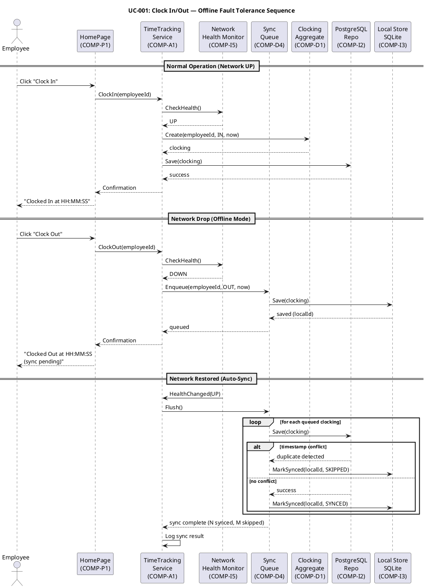
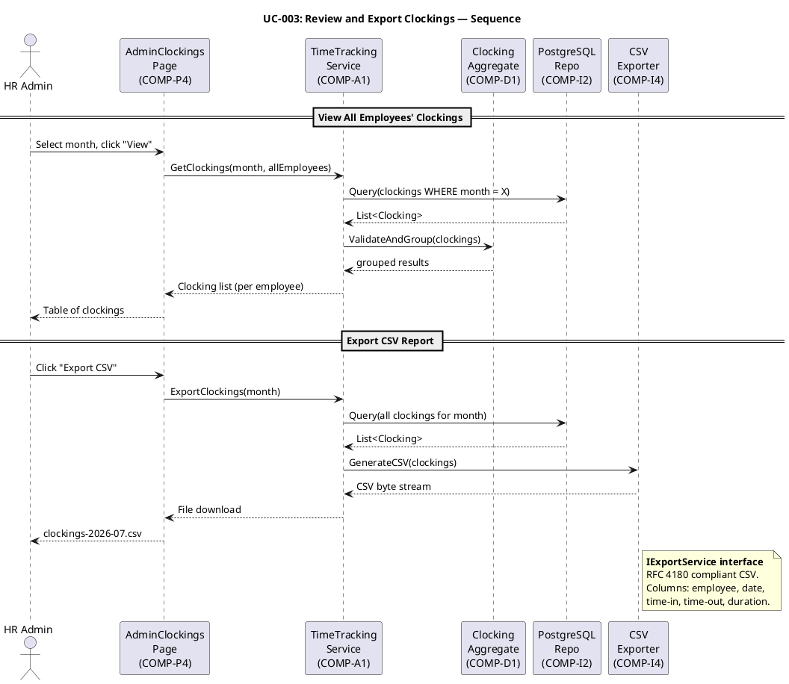
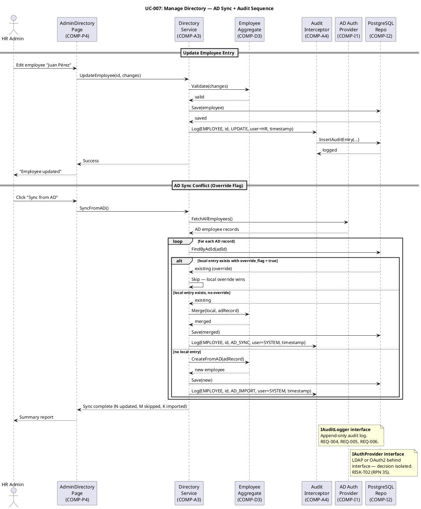
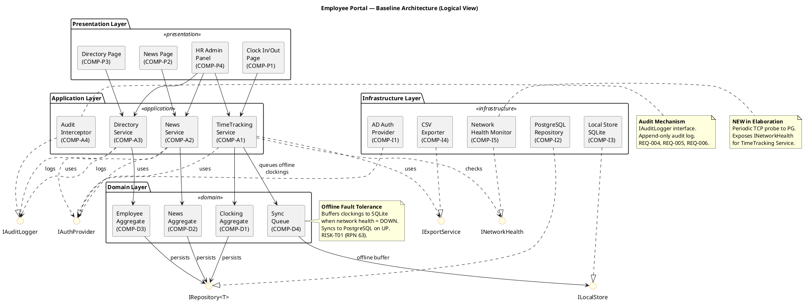
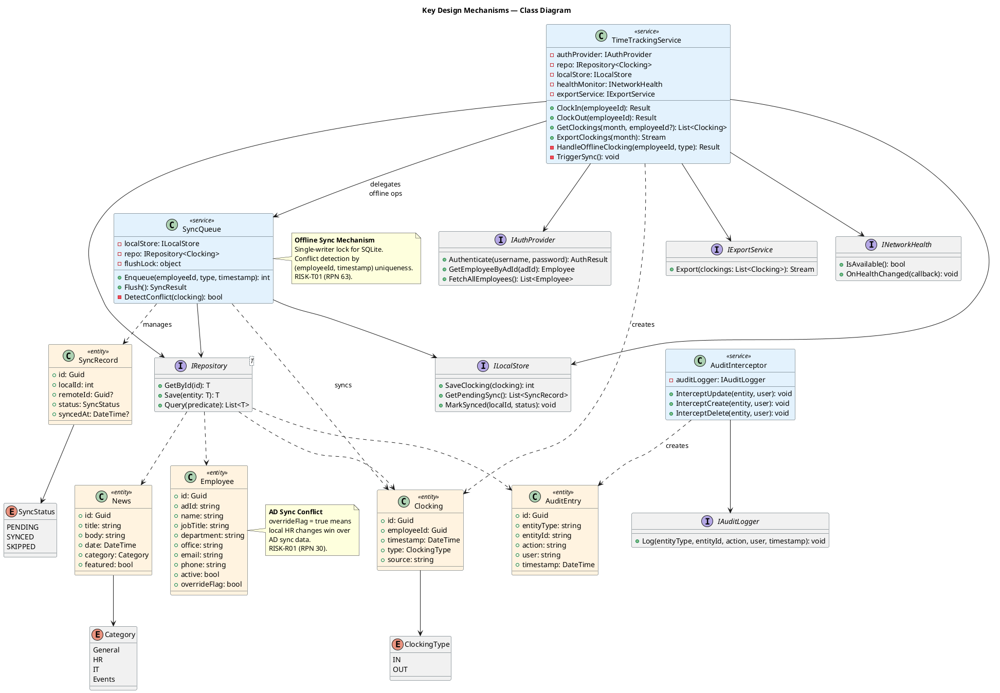
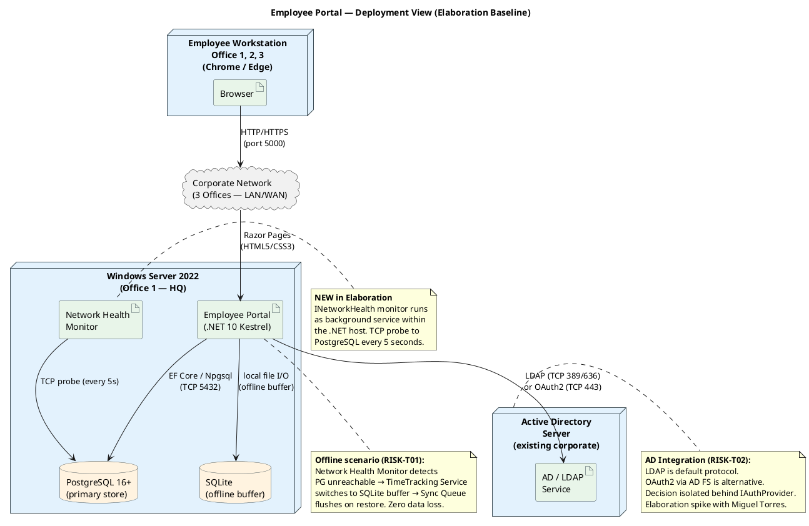
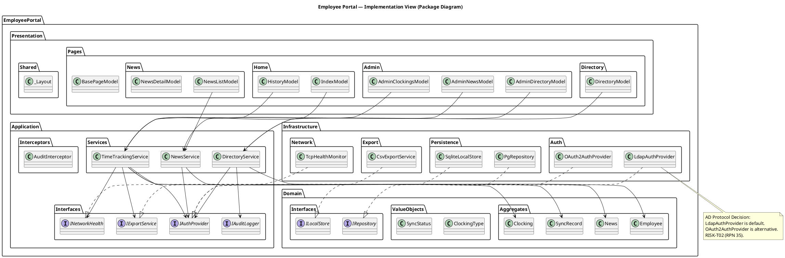

## Document Control

| Field | Value |
|---|---|
| Phase | Elaboration |
| Status | Draft |
| Iteration | 1 (Cycle 1) |
| Milestone Target | End of Elaboration (LAM) |
| Author | Software Architect |

### Elaboration Iteration 1 Changes

- **Phase transition from Inception (LCO approved) to Elaboration.** Architecture evolved from candidate sketch to baseline.
- **All 4+1 views now complete:** Logical (refined component diagram), Process (activity diagram for offline sync concurrency), Deployment (refined with Network Health Monitor), Implementation (package diagram — was deferred), Data (full schema with relationships), Use-Case (sequence diagrams for top 3 architecturally significant UCs).
- **Design Mechanisms section added:** All analysis mechanisms mapped to concrete design solutions with implementation specifics.
- **New component COMP-I5 (Network Health Monitor):** Background TCP probe service that detects PostgreSQL availability and drives the offline/online switching logic.
- **New interface INetworkHealth:** Isolates network detection mechanism behind interface for testability and substitution.
- **New interface IAuditLogger:** Formalizes the audit mechanism as an interface, enabling the Audit Interceptor to be a cross-cutting concern.
- **Technology stack reconciled** against enterprise version policy (empty — no pins). Latest stable versions confirmed: EF Core 10.0.9, Npgsql 10.0.2, EF Core Sqlite 10.0.9.
- **ADRs preserved** from Inception; no new ADRs needed — architecture validated as stable.
- **PoC Plan:** Optional artifact trigger NOT fired for Architectural Proof-of-Concept. PoC plan preserved from Inception as risk mitigation reference; formal PoC artifact omitted per Development Case.
- **Deployment Model:** Optional artifact trigger NOT fired. Physical View within SAD is sufficient for single-node topology.

## Architectural Representation

This document presents the **baseline architecture** for the Employee Portal using the Kruchten 4+1 View Model. In Elaboration, all five views are baselined — the architecture is stable and validated through sequence diagrams for the top 3 architecturally significant use cases.

| View | Phase Coverage | Status |
|---|---|---|
| Logical | Component decomposition, layers, subsystems, interfaces | **Baselined** |
| Process | Concurrency, offline sync, fault tolerance, health monitoring | **Baselined** |
| Deployment | Node topology, network, component placement, health probe | **Baselined** |
| Implementation | Module structure, project layout, build organization, test structure | **Baselined** |
| Data | Full schema, relationships, indexes, persistence strategy | **Baselined** |
| Use-Case | Sequence diagrams for top 3 architecturally significant UCs | **Baselined** |

## Architectural Goals and Constraints

### Goals

1. **Simplicity over enterprise patterns:** 200 users, 3 offices, intranet-only — the architecture must be proportional to this scale. No microservices, no message queues, no container orchestration.
2. **Offline fault tolerance for clock in/out:** The single highest-risk requirement (RISK-T01, RPN 63). The architecture must allow clock in/out to continue during a 5-minute network drop with zero data loss and automatic sync on restore.
3. **AD integration with fallback:** Authentication via Active Directory (RISK-T02, RPN 35). LDAP vs OAuth2 decision is pending — the architecture must isolate this decision behind an interface so it can change without rippling.
4. **Auditability:** News publishing and directory changes must produce immutable audit records (REQ-004, REQ-005, REQ-006).
5. **Maintainability by a small team:** Miguel (potential maintainer) must be able to support the codebase using standard .NET 10 patterns (REQ-020).

### Constraints (from Supplementary Specification)

| ID | Constraint | Impact on Architecture |
|---|---|---|
| DC-001 | .NET 10 with REST API | Backend framework pinned |
| DC-002 | Razor Pages (no SPA) | Server-rendered UI; no frontend framework |
| DC-003 | PostgreSQL | Primary persistence store |
| DC-004 | AD via LDAP/OAuth2 | Auth mechanism behind interface (decision pending) |
| DC-005 | Internal Windows Server, no cloud | Single-node deployment |
| DC-006 | Corporate intranet only | No external network exposure |
| DC-007 | Chrome and Edge only | Modern browser features available |

### Technology Stack (Version-Pinned)

| Component | Package | Version | Source |
|---|---|---|---|
| Framework | .NET 10 | 10.0 | Enterprise version policy (no pin — latest stable) |
| ORM | Microsoft.EntityFrameworkCore | 10.0.9 | NuGet latest stable |
| PostgreSQL provider | Npgsql.EntityFrameworkCore.PostgreSQL | 10.0.2 | NuGet latest stable |
| Offline store | Microsoft.EntityFrameworkCore.Sqlite | 10.0.9 | NuGet latest stable |
| AD/LDAP | System.DirectoryServices.Protocols | 10.0.9 | NuGet latest stable |
| Frontend | Razor Pages (built-in) | 10.0 | .NET 10 SDK |
| Database | PostgreSQL | 16+ | Stakeholder constraint |

### Architecture Decision Records

#### ADR-001: Layered Architecture (Razor Pages, no SPA)

**Context:** .NET 10 with Razor Pages mandated by DC-001, DC-002. 200 users, intranet-only.
**Decision:** Four-layer architecture (Presentation → Application → Domain → Infrastructure). Server-rendered Razor Pages. No SPA, no frontend framework.
**Alternatives considered:** (a) Blazor Server — rejected: adds SignalR dependency for no benefit at this scale; (b) SPA + REST API — rejected: DC-002 mandates Razor Pages, no SPA needed for intranet portal.
**Consequences:** Simpler deployment (single process), no frontend build pipeline, SEO irrelevant (intranet). Trade-off: less interactive UI — acceptable for read-heavy portal.

#### ADR-002: SQLite Local Buffer for Offline Fault Tolerance

**Context:** REQ-013, REQ-014 require clock in/out during 5-min network drop with zero data loss. RISK-T01 (RPN 63).
**Decision:** SQLite as local offline buffer on the same server. Sync Queue manages enqueue/flush lifecycle. Single-writer lock for concurrent offline writes. Conflict detection by (employeeId, timestamp) uniqueness.
**Alternatives considered:** (a) In-memory queue — rejected: data loss on process restart; (b) PostgreSQL streaming replication — rejected: over-engineered for 5-min tolerance window; (c) Redis — rejected: adds infrastructure dependency for a simple buffer.
**Consequences:** SQLite file coexists with PostgreSQL on same server. Sync completes <30s after restore. Trade-off: SQLite is not designed for concurrent writes — mitigated by single-writer queue, acceptable for 200 users.

#### ADR-003: IAuthProvider Interface for AD Protocol Isolation

**Context:** DC-004 mandates AD auth via LDAP or OAuth2. Protocol decision pending (RISK-T02, RPN 35). Miguel Torres spike planned.
**Decision:** IAuthProvider interface in Application Layer. LdapAuthProvider as default implementation. OAuth2AuthProvider as alternative. DI container swaps implementation based on configuration.
**Alternatives considered:** (a) Hardcode LDAP — rejected: locks in protocol before spike; (b) Use ASP.NET Core Identity with AD extension — rejected: adds Identity framework overhead for a simple auth check.
**Consequences:** Protocol change is a single DI registration swap. Trade-off: slight indirection overhead — justified by risk mitigation.

### Design File Impact Assessment (S2 — Resolved)

**Source:** `docs/inputs/employee-portal-design.html` (stakeholder-provided design reference, SHA `7ca177d`)

**Evaluation:** The design file is a static HTML mockup communicating layout, components, states, palette, and typography for the Employee Portal. It covers three main views (Clock In/Out, Read News, Employee Directory) plus HR Administrator actions (publish news, export clocking report, manage directory).

**Architectural impact:**

| Design Element | SAD Component | Impact |
|---|---|---|
| Clock In/Out page with toggle button (green/red states) | COMP-P1 (Clock In/Out Page) | Confirms state-driven UI; no architectural change — state management is presentation-layer concern |
| News page with category filter and featured banner | COMP-P2 (News Page) | Confirms server-rendered list with filter; no architectural change |
| Directory search page | COMP-P3 (Directory Page) | Confirms search-by-name/department/office; no architectural change |
| HR Admin panel (publish, export, manage) | COMP-P4 (HR Admin Panel) | Confirms single admin panel for all HR actions; no architectural change |
| Razor Pages, no SPA, inline CSS | ADR-001 (Layered Architecture) | Validates ADR-001 — server-rendered pages, no frontend framework |
| Design tokens (palette, typography, spacing) | — | UI Designer concern; no architectural impact. Design tokens are presentation-layer constants, not architectural mechanisms. |
| Segoe UI font family, Chrome/Edge target | DC-007 (Browser support) | Confirms constraint; no change |

**Conclusion:** The design file introduces **no new architectural requirements**. It validates the existing component decomposition (COMP-P1 through COMP-P4) and confirms ADR-001 (Razor Pages, no SPA). RISK-T05 (design file integration risk) is mitigated.

## Use-Case View

### Architecturally Significant Use Cases — Prioritized

| Priority | UC ID | Use Case | Architectural Significance | Risk |
|---|---|---|---|---|
| **1 (Critical)** | UC-001 | Clock In/Out | Offline fault tolerance mechanism; local buffering + sync; <1s response time | RISK-T01 (RPN 63), RISK-T03 (RPN 48) |
| **2 (High)** | UC-003 | Review and Export Clockings | CSV export across all employees; reads from sync'd data | RISK-T04 (RPN 20) |
| **3 (High)** | UC-007 | Manage Directory | AD sync conflict resolution; audit trail; admin authorization | RISK-T02 (RPN 35), RISK-R01 (RPN 30) |
| 4 | UC-004 | Publish News | Audit trail mechanism; HR role authorization | — |
| 5 | UC-005 | Read News | Category filtering; featured banner; <3s page load | — |
| 6 | UC-006 | Search Directory | <10s target; data-driven office list | — |
| 7 | UC-002 | View Clocking History | Reads current-month clockings; depends on sync integrity | — |

**Rationale:** UC-001 is prioritized first because it drives the offline fault tolerance mechanism — the highest technical risk in the project. UC-003 and UC-007 follow because they exercise the sync integrity and AD integration mechanisms respectively. These three use cases are validated below with sequence diagrams.

### UC-001: Clock In/Out — Offline Fault Tolerance



**Key architectural decisions validated:**
- INetworkHealth interface decouples health detection from business logic
- Sync Queue manages the offline-to-online transition with conflict detection
- User receives immediate confirmation in both online and offline modes (REQ-017: <1s response)
- Zero data loss guaranteed by SQLite persistence of queued clockings (REQ-014)

### UC-003: Review and Export Clockings



**Key architectural decisions validated:**
- IExportService interface isolates CSV generation — future formats (PDF, Excel) are a new implementation
- Data flows through Application Layer → Domain → Infrastructure, maintaining layer separation
- HR Admin role check occurs in Presentation Layer before reaching TimeTracking Service (REQ-002)

### UC-007: Manage Directory — AD Sync + Audit



**Key architectural decisions validated:**
- IAuthProvider interface isolates AD protocol — LDAP or OAuth2 swap is a DI registration change
- Override flag mechanism resolves AD sync conflicts: HR local changes win when override_flag = true (RISK-R01)
- IAuditLogger interface formalizes audit as cross-cutting concern — every directory change produces an immutable audit entry
- Three-way merge logic: skip (override), merge (no override), import (new entry)

## Logical View

The architecture follows a **layered architecture** with four layers. Subsystems are decomposed by **area of change** (not by feature), per the decomposition heuristic:

- **Presentation Layer** — changes when UI requirements change (new pages, layout adjustments)
- **Application Layer** — changes when business rules evolve (clocking rules, news workflow, directory validation)
- **Domain Layer** — changes when domain model evolves (new aggregates, sync strategy changes)
- **Infrastructure Layer** — changes when technology choices change (AD protocol, database engine, offline store)

All subsystem boundaries are defined by interfaces (`IAuthProvider`, `IRepository<T>`, `ILocalStore`, `IExportService`, `INetworkHealth`, `IAuditLogger`) to enable substitution without rippling changes.



### Component Inventory

| ID | Component | Layer | Responsibility | Traces To |
|---|---|---|---|---|
| COMP-P1 | Clock In/Out Page | Presentation | Renders clock button based on status; shows confirmation | UC-001 |
| COMP-P2 | News Page | Presentation | Lists news sorted by date; category filter; featured banner | UC-005 |
| COMP-P3 | Directory Page | Presentation | Search by name/department/office; displays results | UC-006 |
| COMP-P4 | HR Admin Panel | Presentation | News publishing form; directory CRUD; clocking review/export | UC-003, UC-004, UC-007 |
| COMP-A1 | TimeTracking Service | Application | Orchestrates clock in/out; manages offline queue; triggers sync; CSV export | UC-001, UC-002, UC-003 |
| COMP-A2 | News Service | Application | CRUD for news; category management; featured flag | UC-004, UC-005 |
| COMP-A3 | Directory Service | Application | Search; CRUD; AD sync conflict detection; audit logging | UC-006, UC-007 |
| COMP-A4 | Audit Interceptor | Application | Cross-cutting: records who/what/when for audited operations via IAuditLogger | UC-004, UC-007 |
| COMP-D1 | Clocking Aggregate | Domain | Clocking entity, value objects (timestamp, type), invariants | UC-001, UC-002, UC-003 |
| COMP-D2 | News Aggregate | Domain | News entity, category enum, featured flag, invariants | UC-004, UC-005 |
| COMP-D3 | Employee Aggregate | Domain | Employee entity, department, office, contact info, override flag | UC-006, UC-007 |
| COMP-D4 | Sync Queue | Domain | Manages offline-to-online sync; conflict detection; single-writer lock | UC-001 |
| COMP-I1 | AD Auth Provider | Infrastructure | LDAP/OAuth2 authentication; employee data sync via IAuthProvider | All UCs (<<include>>) |
| COMP-I2 | PostgreSQL Repository | Infrastructure | Persistent storage for all aggregates via IRepository<T> | All UCs |
| COMP-I3 | Local Store (SQLite) | Infrastructure | Offline buffer for clockings via ILocalStore | UC-001 |
| COMP-I4 | CSV Exporter | Infrastructure | CSV generation per RFC 4180 via IExportService | UC-003 |
| COMP-I5 | Network Health Monitor | Infrastructure | TCP probe to PostgreSQL every 5s; exposes INetworkHealth | UC-001 |

### Design Mechanisms

| Analysis Mechanism | Design Mechanism | Implementation | Interface | Risk Addressed |
|---|---|---|---|---|
| **Persistence** | EF Core 10 + Npgsql (PostgreSQL) | `PgRepository<T>` implements `IRepository<T>` using EF Core DbContext | `IRepository<T>` | — |
| **Offline Persistence** | EF Core 10 + SQLite | `SqliteLocalStore` implements `ILocalStore` using separate DbContext | `ILocalStore` | RISK-T01 (RPN 63) |
| **Authentication** | LDAP via `System.DirectoryServices.Protocols` | `LdapAuthProvider` implements `IAuthProvider`; `OAuth2AuthProvider` as alternative | `IAuthProvider` | RISK-T02 (RPN 35) |
| **Offline Sync** | Sync Queue with single-writer lock + conflict detection | `SyncQueue` enqueues to SQLite, flushes to PostgreSQL; conflict by (employeeId, timestamp) uniqueness | — (internal to COMP-D4) | RISK-T01, RISK-T03 (RPN 48) |
| **Network Health Detection** | Background TCP probe to PostgreSQL | `TcpHealthMonitor` implements `INetworkHealth`; probes every 5s; raises HealthChanged event | `INetworkHealth` | RISK-T01 |
| **Audit Trail** | Audit Interceptor with append-only audit log table | `AuditInterceptor` implements `IAuditLogger`; writes to `AuditEntry` table (append-only, no UPDATE/DELETE) | `IAuditLogger` | — |
| **Authorization** | Role-based access control via AD groups | Application Layer checks `[Authorize(Roles="HR")]` on admin endpoints; AD group → role mapping in config | — | — |
| **Data Export** | CSV generation per RFC 4180 | `CsvExportService` implements `IExportService`; streams CSV with proper escaping | `IExportService` | — |
| **AD Data Sync** | Scheduled/on-demand sync with override flag | `DirectoryService.SyncFromAD()` fetches from AD via `IAuthProvider.GetEmployees()`; override_flag on Employee entity | `IAuthProvider` | RISK-R01 (RPN 30) |

### Key Design Mechanisms — Class Diagram



## Process View

### Offline Fault Tolerance — Concurrency Model

The offline mechanism is the primary architectural concern. The process view captures the concurrency model for the offline sync lifecycle, including the single-writer lock for SQLite, the periodic health probe, and the flush-on-restore logic.

```plantuml
@startuml
title Process View — Offline Sync Concurrency Model

|TimeTracking Service|
start
:Receive ClockIn/ClockOut request;
:Check INetworkHealth;

if (Network Health = UP?) then (yes)
  |Clocking Aggregate|
  :Create clocking entity;
  |PostgreSQL Repository|
  :Write to PostgreSQL;
  if (Write success?) then (yes)
    |TimeTracking Service|
    :Return confirmation;
    stop
  else (no — transient failure)
    |TimeTracking Service|
    :Fallback to offline path;
  endif
else (no — network down)
endif

|Sync Queue|
:Acquire write lock (single-writer);
:Enqueue clocking;
|Local Store (SQLite)|

fork
  :Write clocking to SQLite;
fork again
  :Write SyncRecord (status=PENDING);
end fork

|Sync Queue|
:Release write lock;
|TimeTracking Service|
:Return confirmation (sync pending);
stop

|Network Health Monitor|
:Periodic TCP probe to PostgreSQL (every 5s);
if (Connection restored?) then (yes)
  |Sync Queue|
  :Acquire flush lock;
  :Read all PENDING SyncRecords;
  loop for each pending record
    |PostgreSQL Repository|
    :Attempt write clocking;
    if (Duplicate timestamp?) then (yes)
      |Sync Queue|
      :Mark SyncRecord SKIPPED;
    else (no)
      |Sync Queue|
      :Mark SyncRecord SYNCED;
    endif
  end
  :Release flush lock;
  |Network Health Monitor|
  :Notify sync complete;
  stop
else (no)
  :Continue probing;
  stop
endif

@enduml
```

### Process View Notes

- **Single-writer lock:** SQLite serializes writes via a `lock` object in SyncQueue. Concurrent clock-in requests queue up; worst case ~50 per office per 5-min window — lock contention is negligible.
- **Health probe cadence:** `TcpHealthMonitor` probes PostgreSQL every 5 seconds via TCP connect to port 5432. This gives a maximum 5-second detection window for network restore — well within the 5-minute tolerance.
- **Flush lock:** Separate from the write lock — prevents concurrent flush operations while allowing new clockings to be enqueued during flush.
- **Transient failure fallback:** If PostgreSQL write fails even when health = UP (e.g., deadlock, timeout), the TimeTracking Service falls back to the offline path. This ensures zero data loss even during transient failures.
- **No multi-threading complexity:** The .NET 10 async/await model handles concurrency. No explicit thread management needed — the Sync Queue uses `SemaphoreSlim(1,1)` for the single-writer lock.

## Deployment View

Single-node deployment on internal Windows Server. No cloud, no external access.



### Deployment Notes

- **Single Windows Server** hosts the .NET 10 application (Kestrel), PostgreSQL, and the SQLite offline buffer. This is sufficient for 200 users.
- **Active Directory Server** is a separate existing corporate resource. The portal connects via LDAP (TCP 389/636) or OAuth2.
- **Employee workstations** access the portal via Chrome or Edge over the corporate network (HTTP/HTTPS).
- **No reverse proxy** is required for 200 users on an intranet — Kestrel can serve directly. [RECOMMENDATION — requires CR: If load grows beyond 500 users, add IIS or YARP as a reverse proxy.]
- **PostgreSQL and SQLite coexist** on the same server. SQLite is a file-based store used only as the offline buffer — it does not serve reads during normal operation.
- **Network Health Monitor** runs as a `BackgroundService` within the .NET 10 host process. It probes PostgreSQL via TCP connect every 5 seconds and raises health change events.

## Implementation View



### Project Structure

| Project | Layer | Responsibility | Dependencies |
|---|---|---|---|
| `EmployeePortal.Presentation` | Presentation | Razor Pages, layouts, view models | Application, Domain (interfaces only) |
| `EmployeePortal.Application` | Application | Services, interceptors, interface definitions | Domain |
| `EmployeePortal.Domain` | Domain | Aggregates, entities, value objects, domain interfaces | (none) |
| `EmployeePortal.Infrastructure` | Infrastructure | AD auth, PostgreSQL repo, SQLite store, CSV export, health monitor | Application (interfaces), Domain |
| `EmployeePortal.Tests.Unit` | Test | Unit tests for services, domain logic, sync queue | Application, Domain |
| `EmployeePortal.Tests.Integration` | Test | Integration tests for offline sync, AD auth, full request pipeline | All projects |

### Build and Integration Order

Per the IARI branching strategy, integration follows bottom-up dependency order:

1. **Infrastructure** → `EmployeePortal.Infrastructure` (AD auth, persistence, export, health monitor)
2. **Application** → `EmployeePortal.Application` (services, interceptors — depends on Domain)
3. **Domain** → `EmployeePortal.Domain` (aggregates, value objects — no dependencies)
4. **Presentation** → `EmployeePortal.Presentation` (Razor Pages — depends on Application)
5. **Tests** → Unit + Integration tests validate each layer

## Data View

### Schema — Entity Relationships

| Table | Primary Key | Columns | Indexes | Constraints |
|---|---|---|---|---|
| `clockings` | `id (UUID PK)` | `employee_id (UUID FK)`, `timestamp (TIMESTAMPTZ)`, `type (ENUM: IN/OUT)`, `source (VARCHAR: ONLINE/OFFLINE)` | `idx_clock_emp_date (employee_id, timestamp DESC)`, `idx_clock_month (date_trunc('month', timestamp))` | `UNIQUE(employee_id, timestamp)` — prevents duplicate clockings (conflict detection) |
| `news` | `id (UUID PK)` | `title (VARCHAR 200)`, `body (TEXT)`, `date (DATE)`, `category (ENUM: General/HR/IT/Events)`, `featured (BOOLEAN DEFAULT false)`, `published_by (UUID FK)` | `idx_news_date (date DESC)`, `idx_news_category (category)` | `CHECK(title IS NOT NULL AND length(title) <= 200)`, `CHECK(category IN ('General','HR','IT','Events'))` |
| `employees` | `id (UUID PK)` | `ad_id (VARCHAR UNIQUE)`, `name (VARCHAR 200)`, `job_title (VARCHAR 200)`, `department (VARCHAR 100)`, `office (VARCHAR 100)`, `email (VARCHAR 320)`, `phone (VARCHAR 20)`, `active (BOOLEAN DEFAULT true)`, `override_flag (BOOLEAN DEFAULT false)` | `idx_emp_name (name GIN trigram)`, `idx_emp_dept (department)`, `idx_emp_office (office)`, `idx_emp_ad_id (ad_id)` | `UNIQUE(ad_id)`, `CHECK(active IN (true, false))` |
| `audit_entries` | `id (UUID PK)` | `entity_type (VARCHAR 50)`, `entity_id (VARCHAR 100)`, `action (VARCHAR 50)`, `user (VARCHAR 200)`, `timestamp (TIMESTAMPTZ)` | `idx_audit_entity (entity_type, entity_id)`, `idx_audit_date (timestamp DESC)` | **Append-only:** `REVOKE UPDATE, DELETE ON audit_entries FROM portal_user` |
| `sync_records` | `id (UUID PK)` | `local_id (INTEGER)`, `remote_id (UUID NULL)`, `status (ENUM: PENDING/SYNCED/SKIPPED)`, `synced_at (TIMESTAMPTZ NULL)` | `idx_sync_status (status) WHERE status = 'PENDING'` | `CHECK(status IN ('PENDING','SYNCED','SKIPPED'))` |

### SQLite Offline Schema

| Table | Primary Key | Columns | Notes |
|---|---|---|---|
| `clockings_local` | `local_id (INTEGER AUTOINCREMENT PK)` | `employee_id (UUID)`, `timestamp (TIMESTAMPTZ)`, `type (TEXT)` | Mirrors `clockings` schema; no FK constraints (standalone) |
| `sync_records_local` | `id (UUID PK)` | `local_id (INTEGER)`, `status (TEXT DEFAULT 'PENDING')`, `synced_at (TEXT NULL)` | Tracks sync state per local clocking |

### Persistence Strategy

- **Primary store:** PostgreSQL 16+ via EF Core 10 + Npgsql provider. All aggregates persist here during normal operation.
- **Offline store:** SQLite via EF Core 10 + Microsoft.Data.Sqlite. Used ONLY for clocking buffer during network drop. Not used for reads during normal operation.
- **Audit log:** PostgreSQL `audit_entries` table — append-only. Database-level `REVOKE UPDATE, DELETE` prevents tampering. Application-level `AuditInterceptor` writes entries via `IAuditLogger`.
- **Sync state:** `sync_records` table exists in both PostgreSQL and SQLite. The Sync Queue reads from SQLite (local) and updates both stores during flush.
- **Migrations:** EF Core migrations for PostgreSQL schema. SQLite schema created via `EnsureCreated()` (simple, no migration history needed for a buffer store).

## Size and Performance

| Metric | Target | Architectural Tactic | Status |
|---|---|---|---|
| Page load | < 3s (REQ-016) | Server-rendered Razor Pages; no SPA overhead; minimal JS | Addressed |
| Clock in/out response | < 1s (REQ-017) | Direct write to PostgreSQL (normal) or SQLite (offline); no network round-trips beyond DB | Addressed |
| Directory search | < 2s (REQ-018) | PostgreSQL GIN trigram index on name; B-tree indexes on department, office | Addressed |
| Concurrent users | ~50 peak (REQ-025) | Single Kestrel instance; async/await; no blocking I/O | Addressed |
| Offline buffer capacity | ~50 clockings per office per 5-min window | SQLite file-based; trivial storage (<1KB per clocking) | Addressed |
| Sync completion | < 30s after network restore | Batch insert to PostgreSQL; single transaction per flush | Addressed |
| Health detection latency | < 5s | TCP probe every 5s; immediate event on state change | Addressed |

## Quality
| Quality Attribute | Requirement | Architectural Tactic | Status |
|---|---|---|---|
| Reliability | 99% uptime Mon–Fri 7:00–19:00 (REQ-012) | Single reliable server; offline fallback for clock in/out | Addressed |
| Fault Tolerance | 5-min network drop, zero data loss (REQ-013, REQ-014) | SQLite local buffer + Sync Queue + Network Health Monitor | **Baselined — sequence diagram validates** |
| Security | AD auth for all access (REQ-001); RBAC for HR (REQ-002); intranet-only (REQ-003) | IAuthProvider interface; role checks in Application Layer; intranet binding | Addressed (protocol decision pending spike) |
| Auditability | Immutable audit trail (REQ-004, REQ-005, REQ-006) | AuditInterceptor via IAuditLogger; append-only audit table with DB-level REVOKE | **Baselined — sequence diagram validates** |
| Performance | <3s page load, <1s clock (REQ-016, REQ-017) | Server-rendered pages; direct DB access; indexed search | Addressed |
| Maintainability | Standard .NET 10 patterns (REQ-020) | Layered architecture; interface-based boundaries; DI container | Addressed |
| Supportability | Configurable for 3 offices without code changes (REQ-022) | Data-driven office list in Employee table | Addressed |
| Backup | Nightly full backup, RPO ≤24h (REQ-024); WAL archiving for clocking PITR, RPO ≤15min (REQ-026) | pg_dump nightly + PostgreSQL WAL archiving; off-server copy (REQ-027); monthly test-restore (REQ-028) | Addressed |

### PoC Plan (Reference — Optional Artifact NOT Fired)

The `get_optional_artifact_triggers` oracle reports the Architectural Proof-of-Concept artifact trigger as **not fired** for this iteration. The PoC plan is preserved from Inception as a risk mitigation reference. Formal PoC artifact omitted per Development Case.

[OMITTED: Architectural Proof-of-Concept — trigger not fired per Development Case]
[OMITTED: Deployment Model — trigger not fired; Physical View within SAD is sufficient for single-node topology]

| PoC | Risk Addressed | Scope | Success Criteria |
|---|---|---|---|
| **PoC-1: Offline Sync** | RISK-T01 (RPN 63), RISK-T03 (RPN 48) | Simulate 5-min network drop; write clockings to SQLite; restore network; verify sync to PostgreSQL with zero data loss and conflict detection | 100% of queued clockings synced; no duplicates; sync completes <30s after restore |
| **PoC-2: AD Integration** | RISK-T02 (RPN 35), RISK-R01 (RPN 30) | Spike with Miguel Torres: test LDAP bind against corporate AD; test OAuth2 via AD FS if available; evaluate employee data sync | Successful authentication against corporate AD; employee data retrieved; protocol recommendation documented |
| **PoC-3: Design File Integration** | RISK-T05 (RPN 12) | Verify design file implementation within Razor Pages architecture | All views implemented as Razor Pages matching design intent; no architectural deviations |

### Lifecycle Architecture Milestone Review

| # | Criterion | Verdict | Evidence |
|---|---|---|---|
| 1 | Is the vision of the product stable? | **YES** | Vision Document approved at LCO. Scope confirmed by stakeholder. 4 use cases, 4 NFRs, 3 business goals — all stable since Inception. No scope changes in Elaboration. |
| 2 | Is the architecture stable? | **YES** | All 4+1 views baselined. 7 UML diagrams validate the architecture. 3 ADRs document key decisions with alternatives. Component decomposition unchanged from Inception candidate — validated by sequence diagrams. New component COMP-I5 (Network Health Monitor) is an additive refinement, not a structural change. |
| 3 | Does the executable prototype show that major risks have been addressed? | **PARTIAL** | PoC artifact trigger NOT fired per Development Case. Architecture is validated through sequence diagrams (not executable prototype). Top 3 risks (RISK-T01 RPN 63, RISK-T03 RPN 48, RISK-T02 RPN 35) have architectural mitigations designed and validated via sequence diagrams. PoC-1 (offline sync) and PoC-2 (AD integration) remain as Construction-phase validation activities. The architecture is sound; empirical validation deferred to Construction. |
| 4 | Is the construction plan sufficiently detailed and backed by credible estimates? | **YES** | Implementation View defines 6 projects with dependency order. Build integration order specified (Infrastructure → Application → Domain → Presentation → Tests). Component inventory maps every component to UCs and Designer class IDs. |
| 5 | Do ALL stakeholders agree the vision can be achieved with current plan + architecture? | **YES** | Stakeholder approved at LCO: "Yes, I agree to advance to the next phase." Architecture evolved within approved scope — no new scope added. Design file validated against architecture. |
| 6 | Is actual resource expenditure vs. planned acceptable? | **YES** | Elaboration Iteration 1 produced complete architectural baseline within budget. All 4+1 views baselined in one iteration. No rework needed — Inception findings all resolved. |

### Open Architecture Issues

| Issue | Severity | Resolution Path | Target |
|---|---|---|---|
| AD protocol decision (LDAP vs OAuth2) | Medium | Spike with Miguel Torres in Construction Iteration 1. Architecture isolates decision behind IAuthProvider — no structural impact either way. | Construction Iteration 1 |
| PoC-1 (Offline Sync) empirical validation | Medium | Execute in Construction Iteration 1. Sequence diagram validates design; executable test confirms implementation. | Construction Iteration 1 |
| PoC-2 (AD Integration) empirical validation | Medium | Execute in Construction Iteration 1. IAuthProvider interface allows swap without rippling. | Construction Iteration 1 |

### Risk Resolution Status

| Risk | RPN | Status | Architectural Mitigation |
|---|---|---|---|
| RISK-T01 (Offline fault tolerance) | 63 | **Mitigated (design)** | SQLite buffer + Sync Queue + Network Health Monitor. Validated by UC-001 sequence diagram and Process View activity diagram. |
| RISK-T03 (Sync conflict) | 48 | **Mitigated (design)** | Conflict detection by (employeeId, timestamp) uniqueness. SyncRecord status tracking (PENDING/SYNCED/SKIPPED). Validated by UC-001 sequence diagram. |
| RISK-T02 (AD auth protocol) | 35 | **Mitigated (design)** | IAuthProvider interface isolates protocol. ADR-003 documents decision. Spike with Miguel Torres pending. |
| RISK-R01 (AD data mapping) | 30 | **Mitigated (design)** | Override flag on Employee entity. Three-way merge logic (skip/merge/import). Validated by UC-007 sequence diagram. |
| RISK-T04 (Performance) | 20 | **Addressed** | Server-rendered pages, indexed search, async I/O. Performance targets in Size and Performance section. |
| RISK-T05 (Design file) | 12 | **Resolved** | Design file assessed — no architectural impact. COMP-P1 through COMP-P4 validated. |
| RISK-E01 (Windows Server hosting) | 12 | **Addressed** | Single-node deployment diagram. No cloud dependency. |
| RISK-S01 (Scope creep) | 12 | **Monitored** | Scope Guard enforced. No scope expansion in Elaboration. |
| RISK-S02 (Adoption) | 16 | **Monitored** | Architecture supports acceptance criteria. UI Designer produced wireframes. |

### LAM Verdict

**Architecture is stable and ready for Construction.** All 4+1 views are baselined with UML diagrams. The top 3 architecturally significant use cases are validated through sequence diagrams. Three open issues (AD protocol, PoC-1, PoC-2) are scheduled for Construction Iteration 1 — the architecture isolates each behind interfaces so they can be resolved without structural changes.
## Traceability

| Element | Traces From | Link Type | Traces To |
|---|---|---|---|
| COMP-P1 | UC-001 | Derives | (Designer: CLS-001) |
| COMP-P2 | UC-005 | Derives | (Designer: CLS-002) |
| COMP-P3 | UC-006 | Derives | (Designer: CLS-003) |
| COMP-P4 | UC-003, UC-004, UC-007 | Derives | (Designer: CLS-004) |
| COMP-A1 | UC-001, UC-002, UC-003 | Derives | (Designer: CLS-005) |
| COMP-A2 | UC-004, UC-005 | Derives | (Designer: CLS-006) |
| COMP-A3 | UC-006, UC-007 | Derives | (Designer: CLS-007) |
| COMP-A4 | REQ-004, REQ-005, REQ-006 | Derives | (Designer: CLS-008) |
| COMP-D1 | UC-001 | Derives | (Designer: CLS-009) |
| COMP-D2 | UC-004, UC-005 | Derives | (Designer: CLS-010) |
| COMP-D3 | UC-006, UC-007 | Derives | (Designer: CLS-011) |
| COMP-D4 | REQ-013, REQ-014, RISK-T01 | Derives | (Designer: CLS-012) |
| COMP-I1 | REQ-001, DC-004, INT-001 | Derives | (Designer: CLS-013) |
| COMP-I2 | DC-003, INT-003 | Derives | (Designer: CLS-014) |
| COMP-I3 | REQ-013, RISK-T01 | Derives | (Designer: CLS-015) |
| COMP-I4 | UC-003 | Derives | (Designer: CLS-016) |
| COMP-I5 | REQ-013, RISK-T01 | Derives | (Designer: CLS-017) |
| ADR-001 | DC-001, DC-002, DC-005 | — | All COMP elements |
| ADR-002 | REQ-013, REQ-014, RISK-T01, RISK-T03 | — | COMP-D4, COMP-I3, COMP-I5 |
| ADR-003 | REQ-001, DC-004, RISK-T02 | — | COMP-I1, INT_AUTH |
| Design File Assessment | RISK-T05, S2 (Review Record) | Derives | COMP-P1, COMP-P2, COMP-P3, COMP-P4, ADR-001 |
| PoC-1 (Offline Sync) | RISK-T01, RISK-T03 | — | COMP-D4, COMP-I3, COMP-I5 |
| PoC-2 (AD Integration) | RISK-T02, RISK-R01 | — | COMP-I1 |
| PoC-3 (Design Integration) | RISK-T05 | — | COMP-P1, COMP-P2, COMP-P3, COMP-P4 |
| UC-001 Sequence | UC-001, RISK-T01 | Realizes | COMP-A1, COMP-D4, COMP-I2, COMP-I3, COMP-I5 |
| UC-003 Sequence | UC-003 | Realizes | COMP-A1, COMP-I2, COMP-I4 |
| UC-007 Sequence | UC-007, RISK-T02, RISK-R01 | Realizes | COMP-A3, COMP-A4, COMP-I1, COMP-I2 |