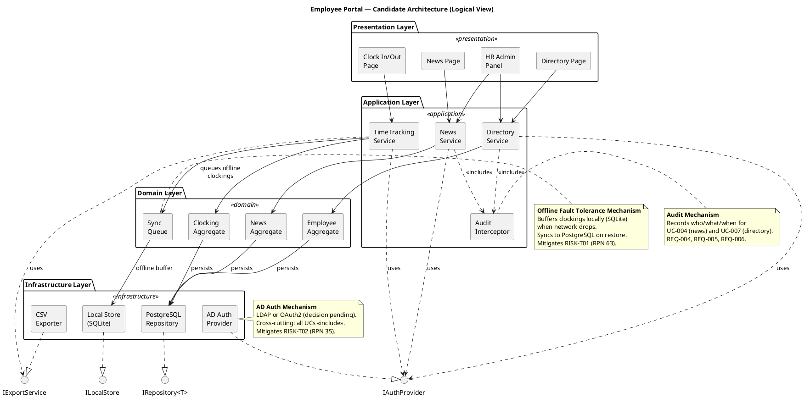
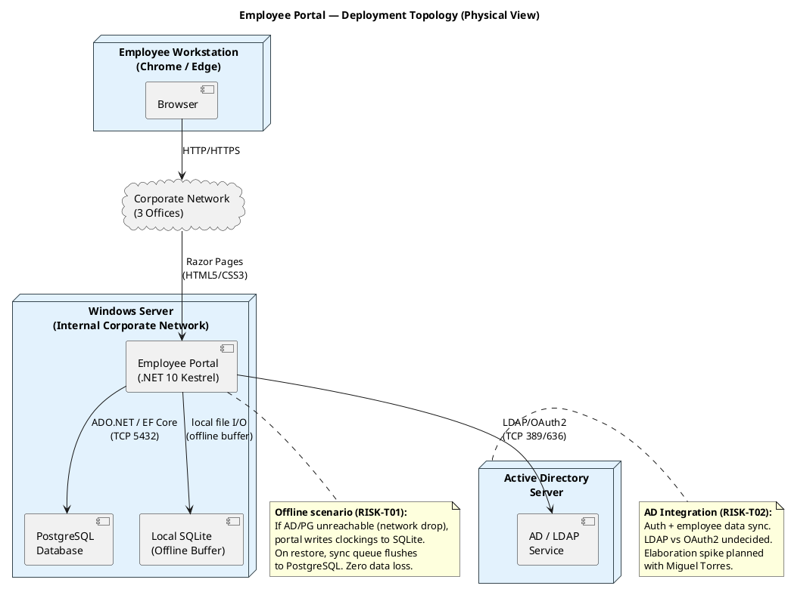

## Document Control
| Field | Value |
|---|---|
| Phase | Inception |
| Status | Draft |
| Iteration | 2 (Cycle 1) |
| Milestone Target | End of Inception (LCO) |
| Author | Software Architect |

### Iteration 2 Changes

- **S2 (Major) — Resolved:** Evaluated stakeholder design file (`docs/inputs/employee-portal-design.html`) for architectural impact. The design confirms the existing component decomposition (3 main pages + HR admin panel = COMP-P1 through COMP-P4), validates Razor Pages with no SPA (ADR-001), and introduces no new architectural requirements. Design tokens (palette, typography) are UI Designer concerns, not architectural. See "Design File Impact Assessment" under Architectural Goals and Constraints.
- **F5 (Info) — Acknowledged:** Artifact type registration note. The artifact is accessible by its canonical name "Software Architecture Document." No content change required.
- **RISK-T05:** New risk added to Risk List tracing from S2. Added to SAD traceability and PoC plan.
- **PoC Plan section added** (was missing from iteration 1).
- UC numbering verified against iteration 2 Use-Case Model — all references already aligned. No renumbering needed.
## Architectural Representation

This document presents the **candidate architecture** for the Employee Portal using the 4+1 View Model. In Inception, the Logical and Deployment views are sketched at candidate level — sufficient to surface architectural risks and guide Elaboration planning. The Process, Implementation, and Data views will be refined in Elaboration when the architecture is baselined through an executable prototype.

| View | Phase Coverage | Status |
|---|---|---|
| Logical | Component decomposition, layers, subsystems | Candidate sketch |
| Deployment | Node topology, network, component placement | Candidate sketch |
| Process | Concurrency, offline sync, fault tolerance | Outlined (risk-driven) |
| Implementation | Module structure, build organization | Deferred to Elaboration |
| Data | Schema sketch, persistence strategy | Outlined (risk-driven) |
| Use-Case | Architecturally significant UCs prioritized | Prioritized list |

## Architectural Goals and Constraints
### Goals

1. **Simplicity over enterprise patterns:** 200 users, 3 offices, intranet-only — the architecture must be proportional to this scale. No microservices, no message queues, no container orchestration.
2. **Offline fault tolerance for clock in/out:** The single highest-risk requirement (RISK-T01, RPN 63). The architecture must allow clock in/out to continue during a 5-minute network drop with zero data loss and automatic sync on restore.
3. **AD integration with fallback:** Authentication via Active Directory (RISK-T02, RPN 35). LDAP vs OAuth2 decision is pending — the architecture must isolate this decision behind an interface so it can change without rippling.
4. **Auditability:** News publishing and directory changes must produce immutable audit records (REQ-004, REQ-005, REQ-006).
5. **Maintainability by a small team:** Miguel (potential maintainer) must be able to support the codebase using standard .NET 10 patterns (REQ-020).

### Constraints (from Supplementary Specification)

| ID | Constraint | Impact on Architecture |
|---|---|---|
| DC-001 | .NET 10 with REST API | Backend framework pinned |
| DC-002 | Razor Pages (no SPA) | Server-rendered UI; no frontend framework |
| DC-003 | PostgreSQL | Primary persistence store |
| DC-004 | AD via LDAP/OAuth2 | Auth mechanism behind interface (decision pending) |
| DC-005 | Internal Windows Server, no cloud | Single-node deployment |
| DC-006 | Corporate intranet only | No external network exposure |
| DC-007 | Chrome and Edge only | Modern browser features available |

### Technology Stack (Version-Pinned)

| Component | Package | Version | Source |
|---|---|---|---|
| Framework | .NET 10 | 10.0 | Enterprise version policy (pin) |
| ORM | Microsoft.EntityFrameworkCore | 10.0.9 | NuGet latest stable within policy |
| PostgreSQL provider | Npgsql.EntityFrameworkCore.PostgreSQL | 10.0.2 | NuGet latest stable within policy |
| Offline store | Microsoft.EntityFrameworkCore.Sqlite | 10.0.9 | NuGet latest stable within policy |
| AD/LDAP | System.DirectoryServices.Protocols | 10.0.9 | NuGet latest stable within policy |
| Frontend | Razor Pages (built-in) | 10.0 | .NET 10 SDK |
| Database | PostgreSQL | 16+ | Stakeholder constraint |

### Design File Impact Assessment (S2 — Resolved)

**Source:** `docs/inputs/employee-portal-design.html` (stakeholder-provided design reference, SHA `7ca177d`)

**Evaluation:** The design file is a static HTML mockup communicating layout, components, states, palette, and typography for the Employee Portal. It covers three main views (Clock In/Out, Read News, Employee Directory) plus HR Administrator actions (publish news, export clocking report, manage directory).

**Architectural impact:**

| Design Element | SAD Component | Impact |
|---|---|---|
| Clock In/Out page with toggle button (green/red states) | COMP-P1 (Clock In/Out Page) | Confirms state-driven UI; no architectural change — state management is presentation-layer concern |
| News page with category filter and featured banner | COMP-P2 (News Page) | Confirms server-rendered list with filter; no architectural change |
| Directory search page | COMP-P3 (Directory Page) | Confirms search-by-name/department/office; no architectural change |
| HR Admin panel (publish, export, manage) | COMP-P4 (HR Admin Panel) | Confirms single admin panel for all HR actions; no architectural change |
| Razor Pages, no SPA, inline CSS | ADR-001 (Layered Architecture) | Validates ADR-001 — server-rendered pages, no frontend framework |
| Design tokens (palette, typography, spacing) | — | UI Designer concern; no architectural impact. Design tokens are presentation-layer constants, not architectural mechanisms. |
| Segoe UI font family, Chrome/Edge target | DC-007 (Browser support) | Confirms constraint; no change |

**Conclusion:** The design file introduces **no new architectural requirements**. It validates the existing component decomposition (COMP-P1 through COMP-P4) and confirms ADR-001 (Razor Pages, no SPA). The design tokens and visual specifications are delegated to the UI Designer and do not affect the architectural views. RISK-T05 (design file integration risk) is mitigated by this assessment — the design aligns with the architecture.
## Use-Case View

### Architecturally Significant Use Cases — Prioritized

| Priority | UC ID | Use Case | Architectural Significance | Risk |
|---|---|---|---|---|
| **1 (Critical)** | UC-001 | Clock In/Out | Offline fault tolerance mechanism; local buffering + sync; <1s response time | RISK-T01 (RPN 63), RISK-T03 (RPN 48) |
| **2 (High)** | UC-003 | Review and Export Clockings | CSV export across all employees; reads from sync'd data | RISK-T04 (RPN 20) |
| **3 (High)** | UC-007 | Manage Directory | AD sync conflict resolution; audit trail; admin authorization | RISK-T02 (RPN 35), RISK-R01 (RPN 30) |
| 4 | UC-004 | Publish News | Audit trail mechanism; HR role authorization | — |
| 5 | UC-005 | Read News | Category filtering; featured banner; <3s page load | — |
| 6 | UC-006 | Search Directory | <10s target; data-driven office list | — |
| 7 | UC-002 | View Clocking History | Reads current-month clockings; depends on sync integrity | — |

**Rationale:** UC-001 is prioritized first because it drives the offline fault tolerance mechanism — the highest technical risk in the project. UC-003 and UC-007 follow because they exercise the sync integrity and AD integration mechanisms respectively. These three use cases should be the focus of the Elaboration architectural prototype.

## Logical View

The architecture follows a **layered architecture** with four layers. Subsystems are decomposed by **area of change** (not by feature), per the decomposition heuristic:

- **Presentation Layer** — changes when UI requirements change (new pages, layout adjustments)
- **Application Layer** — changes when business rules evolve (clocking rules, news workflow, directory validation)
- **Domain Layer** — changes when domain model evolves (new aggregates, sync strategy changes)
- **Infrastructure Layer** — changes when technology choices change (AD protocol, database engine, offline store)

All subsystem boundaries are defined by interfaces (`IAuthProvider`, `IRepository<T>`, `ILocalStore`, `IExportService`) to enable substitution without rippling changes.

### Component Inventory

| ID | Component | Layer | Responsibility | Traces To |
|---|---|---|---|---|
| COMP-P1 | Clock In/Out Page | Presentation | Renders clock button based on status; shows confirmation | UC-001 |
| COMP-P2 | News Page | Presentation | Lists news sorted by date; category filter; featured banner | UC-005 |
| COMP-P3 | Directory Page | Presentation | Search by name/department/office; displays results | UC-006 |
| COMP-P4 | HR Admin Panel | Presentation | News publishing form; directory CRUD; clocking review/export | UC-003, UC-004, UC-007 |
| COMP-A1 | TimeTracking Service | Application | Orchestrates clock in/out; manages offline queue; triggers sync | UC-001, UC-002, UC-003 |
| COMP-A2 | News Service | Application | CRUD for news; category management; featured flag | UC-004, UC-005 |
| COMP-A3 | Directory Service | Application | Search; CRUD; AD sync conflict detection | UC-006, UC-007 |
| COMP-A4 | Audit Interceptor | Application | Cross-cutting: records who/what/when for audited operations | UC-004, UC-007 |
| COMP-D1 | Clocking Aggregate | Domain | Clocking entity, value objects (timestamp, type), invariants | UC-001, UC-002, UC-003 |
| COMP-D2 | News Aggregate | Domain | News entity, category enum, featured flag, invariants | UC-004, UC-005 |
| COMP-D3 | Employee Aggregate | Domain | Employee entity, department, office, contact info | UC-006, UC-007 |
| COMP-D4 | Sync Queue | Domain | Manages offline-to-online sync; conflict detection | UC-001 |
| COMP-I1 | AD Auth Provider | Infrastructure | LDAP/OAuth2 authentication; employee data sync | All UCs (<<include>>) |
| COMP-I2 | PostgreSQL Repository | Infrastructure | Persistent storage for all aggregates | All UCs |
| COMP-I3 | Local Store (SQLite) | Infrastructure | Offline buffer for clockings during network drop | UC-001 |
| COMP-I4 | CSV Exporter | Infrastructure | Generates CSV report from clocking data | UC-003 |

### Analysis Mechanisms

| Mechanism | Analysis-Level Description | Design-Level Target (Elaboration) | Risk Addressed |
|---|---|---|---|
| **Persistence** | All aggregates need persistent storage | EF Core 10 + PostgreSQL (primary), SQLite (offline) | — |
| **Authentication** | All UCs require AD auth before access | IAuthProvider interface; LDAP or OAuth2 implementation | RISK-T02 (RPN 35) |
| **Offline Sync** | Clock in/out must work during 5-min network drop | Sync Queue + SQLite local store; auto-sync on restore | RISK-T01 (RPN 63), RISK-T03 (RPN 48) |
| **Audit Trail** | News publishing and directory changes must be audited | Audit Interceptor; append-only audit log table | — |
| **Authorization** | HR Admin role vs Employee role | Role-based access control via AD groups or claims | — |
| **Data Export** | HR exports monthly clocking report as CSV | IExportService; CSV generation per RFC 4180 | — |
| **AD Data Sync** | Employee data synchronized from AD | Scheduled or on-demand sync; conflict resolution strategy | RISK-R01 (RPN 30) |

## Process View

### Offline Fault Tolerance — Process Sketch

The offline mechanism is the primary architectural concern. The process flow:

1. **Normal operation:** Clock in/out → TimeTracking Service → Clocking Aggregate → PostgreSQL Repository. Response <1s.
2. **Network drop detected:** PostgreSQL unreachable. TimeTracking Service catches connection failure → switches to Local Store (SQLite) via Sync Queue.
3. **Offline operation:** Clock in/out → TimeTracking Service → Sync Queue → SQLite Local Store. User sees normal confirmation. No data loss.
4. **Network restored:** Sync Queue detects PostgreSQL availability → flushes queued clockings to PostgreSQL → marks local entries as synced. Conflict detection: if a clocking timestamp already exists in PostgreSQL (e.g., from another office), skip with log entry.
5. **Sync complete:** System returns to normal operation.

**Concurrency consideration:** Multiple employees may clock in simultaneously during offline mode. SQLite handles concurrent reads; writes are serialized via a single-writer queue. This is acceptable for 200 users across 3 offices — worst case ~50 concurrent offline clockings per office.

**[Deferred to Elaboration]:** Detailed thread model, sync conflict resolution algorithm, and health-check mechanism for network status detection.

## Deployment View

Single-node deployment on internal Windows Server. No cloud, no external access.

### Deployment Notes

- **Single Windows Server** hosts the .NET 10 application (Kestrel), PostgreSQL, and the SQLite offline buffer. This is sufficient for 200 users.
- **Active Directory Server** is a separate existing corporate resource. The portal connects via LDAP (TCP 389/636) or OAuth2.
- **Employee workstations** access the portal via Chrome or Edge over the corporate network (HTTP/HTTPS).
- **No reverse proxy** is required for 200 users on an intranet — Kestrel can serve directly. [RECOMMENDATION — requires CR: If load grows beyond 500 users, add IIS or YARP as a reverse proxy.]
- **PostgreSQL and SQLite coexist** on the same server. SQLite is a file-based store used only as the offline buffer — it does not serve reads during normal operation.

## Implementation View

[Deferred to Elaboration — module structure, project layout, and build organization will be defined when the architecture is baselined.]

## Data View

### Candidate Schema Sketch

| Aggregate | Key Entities | Primary Store | Offline Store |
|---|---|---|---|
| Clocking | Clocking (id, employee_id, timestamp, type: IN/OUT) | PostgreSQL | SQLite (buffer) |
| News | News (id, title, body, date, category, featured), Category (enum) | PostgreSQL | — |
| Employee | Employee (id, name, job_title, department, office, email, phone, active) | PostgreSQL | — |
| Audit | AuditEntry (id, entity_type, entity_id, action, user, timestamp) | PostgreSQL (append-only) | — |
| SyncState | SyncRecord (id, local_id, remote_id, status, synced_at) | PostgreSQL + SQLite | — |

**[Deferred to Elaboration]:** Full schema with relationships, indexes, constraints, and migration strategy.

## Size and Performance

| Metric | Target | Architectural Tactic |
|---|---|---|
| Page load | < 3s (REQ-016) | Server-rendered Razor Pages; no SPA overhead; minimal JS |
| Clock in/out response | < 1s (REQ-017) | Direct write to PostgreSQL (normal) or SQLite (offline); no network round-trips beyond DB |
| Directory search | < 10s including navigation (REQ-008) | Indexed search on name/department/office; PostgreSQL full-text or LIKE with index |
| Concurrent users | ~200 peak | Single Kestrel instance sufficient; no horizontal scaling needed |
| Offline buffer capacity | ~50 clockings per office per 5-min window | SQLite file-based; trivial storage |

## Quality
| Quality Attribute | Requirement | Architectural Tactic | Status |
|---|---|---|---|
| Reliability | 99% uptime Mon–Fri 7:00–19:00 (REQ-012) | Single reliable server; offline fallback for clock in/out | Addressed |
| Fault Tolerance | 5-min network drop, zero data loss (REQ-013, REQ-014) | SQLite local buffer + Sync Queue | **Primary risk — PoC in Elaboration** |
| Security | AD auth for all access (REQ-001); RBAC for HR (REQ-002); intranet-only (REQ-003) | IAuthProvider interface; role checks in Application Layer | Addressed (protocol decision pending) |
| Auditability | Immutable audit trail (REQ-004, REQ-005, REQ-006) | Audit Interceptor; append-only audit table | Addressed |
| Performance | <3s page load, <1s clock (REQ-016, REQ-017) | Server-rendered pages; direct DB access; indexed search | Addressed |
| Maintainability | Standard .NET 10 patterns (REQ-020) | Layered architecture; interface-based boundaries; DI container | Addressed |
| Supportability | Configurable for 3 offices without code changes (REQ-022) | Data-driven office list in Employee table | Addressed |

### Proof-of-Concept Plan (Elaboration)

The following PoCs are planned for the Elaboration phase to validate the top technical risks. The `get_optional_artifact_triggers` oracle reports the Architectural Proof-of-Concept artifact trigger as **not fired** in Inception — these PoCs will be executed in Elaboration if the trigger fires then.

| PoC | Risk Addressed | Scope | Success Criteria |
|---|---|---|---|
| **PoC-1: Offline Sync** | RISK-T01 (RPN 63), RISK-T03 (RPN 48) | Simulate 5-min network drop; write clockings to SQLite; restore network; verify sync to PostgreSQL with zero data loss and conflict detection | 100% of queued clockings synced; no duplicates; sync completes <30s after restore |
| **PoC-2: AD Integration** | RISK-T02 (RPN 35), RISK-R01 (RPN 30) | Spike with Miguel Torres: test LDAP bind against corporate AD; test OAuth2 via AD FS if available; evaluate employee data sync | Successful authentication against corporate AD; employee data (name, email, department) retrieved; protocol recommendation documented |
| **PoC-3: Design File Integration** | RISK-T05 (RPN 12) | Verify that the stakeholder design file (`docs/inputs/employee-portal-design.html`) can be implemented within the Razor Pages architecture without structural changes | All 3 main views + HR admin panel implemented as Razor Pages matching design intent; no architectural deviations required |

**PoC-1 is the highest priority** — it validates the single highest-risk mechanism (offline fault tolerance). PoC-2 resolves the LDAP-vs-OAuth2 decision that blocks the AD Auth Provider implementation. PoC-3 confirms the design file alignment assessed in this iteration.
## ADRs

### ADR-001: Layered Architecture (not Microservices)

**Context:** The system serves 200 internal users across 3 offices on a corporate intranet. The stakeholder declared .NET 10 with Razor Pages and PostgreSQL on a single Windows Server.

**Decision:** Adopt a classical 4-layer architecture (Presentation → Application → Domain → Infrastructure) within a single deployable .NET 10 application.

**Alternatives considered:**
- *Microservices:* Rejected — 200 users on an intranet do not justify the operational complexity of service discovery, inter-service communication, and distributed tracing. The team is small (potential single maintainer).
- *Hexagonal (Ports & Adapters):* Considered — the interface-based isolation at the Infrastructure layer achieves the same substitutability goal without the ceremony of explicit port/adapter naming. The layered approach is more familiar to a .NET maintainer.

**Trade-offs:**
- + Simple to deploy (single process), simple to understand, standard .NET patterns
- + Interface boundaries at Infrastructure layer provide substitutability where it matters (AD, DB)
- − Less isolation between layers than microservices — a breaking change in Domain could affect Application
- − Single process = single point of failure (mitigated by offline buffer for the critical UC-001)

**Consequences:** The architecture is simple and maintainable. If scale grows beyond ~500 users, a reverse proxy and potential read replicas would be needed — but this is a [RECOMMENDATION — requires CR], not a current concern.

### ADR-002: SQLite Local Buffer for Offline Fault Tolerance

**Context:** RISK-T01 (RPN 63) — the system must accept clock in/out during a 5-minute network drop with zero data loss and auto-sync on restore. PostgreSQL and AD may become unreachable during the drop.

**Decision:** Use a SQLite file-based local store as an offline buffer for clockings. When PostgreSQL is unreachable, the TimeTracking Service writes to SQLite via the Sync Queue. On network restore, the Sync Queue flushes to PostgreSQL with conflict detection (skip duplicate timestamps).

**Alternatives considered:**
- *In-memory queue:* Rejected — a process restart during the 5-minute window would lose all queued clockings. SQLite is durable.
- *PostgreSQL replication/standby:* Rejected — the network drop affects connectivity to the DB server itself; a standby on the same network would also be unreachable. A local file is the only durable option during a network partition.
- *Browser local storage:* Rejected — clockings from different workstations would be fragmented across browsers with no central sync point. Server-side SQLite centralizes the buffer.

**Trade-offs:**
- + Durable: survives process restart; zero data loss
- + Simple: file-based, no separate service to manage
- + Centralized: all offline clockings in one buffer, simplifying sync
- − Single-writer serialization: concurrent writes are serialized (acceptable for 200 users)
- − Sync conflict: if another office's clocking with the same timestamp exists in PostgreSQL, the sync must detect and handle it (RISK-T03, RPN 48)

**Consequences:** The Sync Queue component is architecturally significant — it must be prototyped in Elaboration. The conflict resolution algorithm (skip-and-log vs. merge) needs empirical validation.

### ADR-003: Interface-Isolated AD Authentication (LDAP/OAuth2 Decision Deferred)

**Context:** RISK-T02 (RPN 35) — authentication via Active Directory is required, but the protocol (LDAP vs OAuth2) is undecided (Stability: Low). Miguel Torres is available for an Elaboration spike.

**Decision:** Define an `IAuthProvider` interface in the Application Layer. Implement the AD integration in the Infrastructure Layer behind this interface. Defer the LDAP-vs-OAuth2 choice to Elaboration after a spike with Miguel Torres.

**Alternatives considered:**
- *Decide LDAP now:* Rejected — LDAP is the more likely choice for a corporate intranet, but committing before the spike risks rework if OAuth2 is preferred (e.g., if AD FS is configured).
- *Decide OAuth2 now:* Rejected — OAuth2 adds complexity (token management, refresh flow) that may be unnecessary for a simple intranet portal.

**Trade-offs:**
- + Protocol decision is isolated — changing from LDAP to OAuth2 affects only COMP-I1 (AD Auth Provider)
- + No downstream ripple: Application and Domain layers depend on IAuthProvider, not the implementation
- − Slight overhead: interface indirection for a single implementation (justified by the genuine uncertainty)

**Consequences:** The Elaboration spike with Miguel Torres must resolve the protocol choice. The fallback (if AD integration fails entirely) is local authentication with a data sync — this would require a CR as it changes a declared constraint (DC-004).

## PoC Plan Annex

### Top Technical Risks and PoC Strategy

| Risk ID | Risk | RPN | PoC Needed? | PoC Scope | Success Criteria |
|---|---|---|---|---|---|
| RISK-T01 | Offline fault tolerance: 5-min network drop, zero data loss, auto-sync | 63 | **Yes (Elaboration)** | Simulate network drop during clock in/out; verify SQLite buffering; verify sync-on-restore with zero data loss | 100% of clockings preserved; sync completes within 30s of restore; no duplicate entries |
| RISK-T03 | Sync conflict: concurrent local and remote clock entries | 48 | **Yes (Elaboration)** | Generate clockings from two offices during offline window; verify conflict detection on sync | Conflicts detected and logged; no data corruption; HR can review conflict log |
| RISK-T02 | AD integration: LDAP vs OAuth2 undecided | 35 | **Yes (Elaboration spike)** | Connect to corporate AD via LDAP; test auth + employee data sync; evaluate OAuth2 alternative with Miguel Torres | Successful authentication against corporate AD; employee data (name, email, department) retrieved; protocol recommendation documented |
| RISK-R01 | AD data mapping: AD schema to Employee entity | 30 | **Yes (Elaboration, combined with T02 spike)** | Map AD attributes to Employee aggregate fields; identify missing or conflicting attributes | All required Employee fields populated from AD; gaps documented for HR manual override |
| RISK-T04 | Performance: <1s clock in/out, <3s page load | 20 | **No (monitor in Construction)** | N/A — standard .NET 10 + PostgreSQL performance is well-understood for 200 users | N/A |

### PoC Branch Strategy

The PoC will be developed on a dedicated `feature/poc-offline-sync` branch in Elaboration, merged to main only after success criteria are met. The AD spike will be on `feature/spike-ad-integration`.

## Traceability

| Element | Traces From | Link Type | Traces To |
|---|---|---|---|
| COMP-P1 | UC-001 | Derives | (Designer: ACL-001) |
| COMP-P2 | UC-005 | Derives | (Designer: ACL-003) |
| COMP-P3 | UC-006 | Derives | (Designer: ACL-004) |
| COMP-P4 | UC-003, UC-004, UC-007 | Derives | (Designer: ACL-002, ACL-003, ACL-004) |
| COMP-A1 | UC-001, UC-002, UC-003 | Derives | (Designer: CLS-001) |
| COMP-A2 | UC-004, UC-005 | Derives | (Designer: CLS-003) |
| COMP-A3 | UC-006, UC-007 | Derives | (Designer: CLS-004) |
| COMP-A4 | REQ-004, REQ-005, REQ-006 | Derives | (Designer: CLS-005) |
| COMP-D1 | UC-001 | Derives | (Designer: CLS-001) |
| COMP-D2 | UC-004, UC-005 | Derives | (Designer: CLS-003) |
| COMP-D3 | UC-006, UC-007 | Derives | (Designer: CLS-004) |
| COMP-D4 | REQ-013, REQ-014, RISK-T01 | Derives | (Designer: CLS-006) |
| COMP-I1 | REQ-001, DC-004, INT-001 | Derives | (Designer: CLS-007) |
| COMP-I2 | DC-003, INT-003 | Derives | (Designer: CLS-008) |
| COMP-I3 | REQ-013, RISK-T01 | Derives | (Designer: CLS-009) |
| COMP-I4 | UC-003 | Derives | (Designer: CLS-010) |
| ADR-001 | DC-001, DC-002, DC-005 | — | All COMP elements |
| ADR-002 | REQ-013, REQ-014, RISK-T01, RISK-T03 | — | COMP-D4, COMP-I3 |
| ADR-003 | REQ-001, DC-004, RISK-T02 | — | COMP-I1, INT_AUTH |
| PoC Plan | RISK-T01, RISK-T03, RISK-T02, RISK-R01 | — | Elaboration prototype |