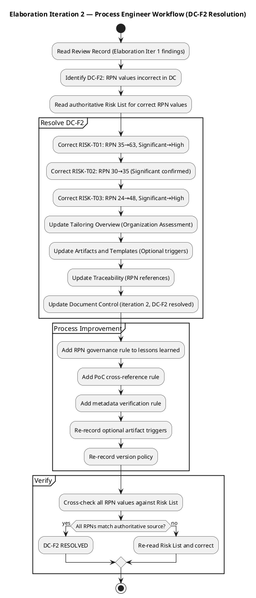

## Document Control
| Field | Value |
|---|---|
| Phase | Elaboration |
| Status | Draft |
| Milestone Target | LCA (Lifecycle Architecture) |
| Iteration | 3 (Cycle 1) |
| Author | ProcessEngineer |
| Prior Phase | Inception (LCO approved — GO verdict, 2026-07-07) |
| Prior Iteration | Elaboration Iteration 2 (LCA: CONDITIONAL NO-GO — SAD-F4 Critical, IA-F2 Major) |
| Governance Re-recorded | 2026-07-08 — DC classification, optional triggers, version policy all re-confirmed for Elaboration iteration 3 |
| Finding DC-F2 Status | RESOLVED (Iter 2) — RPN values corrected to authoritative Risk List values |
| Open Findings Targeting DC | NONE — SAD-F4 (Critical) targets SAD; IA-F2 (Major) targets Iteration Assessment; DM-MR-F1 (Minor) targets Design Model |
| Process Improvement Focus (Iter 3) | PR-at-LCA process gap, IA freshness verification, tool configuration gap updates |
## Tailoring Overview
This Development Case specifies project-specific **deltas** over the IARI DC baseline. The baseline defines 24 active roles, 16 CORE artifacts, 6 OPTIONAL artifacts, and a canonical discipline-intensity matrix. This document declares only deviations from that baseline — it does not restate it.

### Organization Assessment (Updated for Elaboration Iteration 3)

| Factor | Finding |
|---|---|
| Organization | Cuba Corp — 200 employees, 3 offices. Internal IT project, no external regulatory constraints. |
| Agent roles | 24 RUP roles active per IARI baseline. AI-agent-driven process. |
| Process maturity | Post-Inception + Elaboration Iter 1-2: 4 iterations completed, LCO approved. LCA verdict: CONDITIONAL NO-GO — auto-iterate to Cycle 3. SAD-F4 (Critical: open PR #4 at LCA) and IA-F2 (Major: stale Iteration Assessment) block milestone gate. Process stabilized for Requirements + Architecture. Implementation + Test disciplines entering active phase. |
| Risk profile | Low-medium. RISK-T01 (offline sync, RPN 63 — High, PoC Validated), RISK-T02 (AD integration, RPN 35 — Significant, Mitigation Planned), RISK-T03 (data sync conflicts, RPN 48 — High, PoC Validated). All require Elaboration mitigation. PoC-1 produced for RISK-T01 — CI Green 3/3. |
| Tool baseline | Git/SCM, .NET 10 SDK, Razor Pages, PostgreSQL, Windows Server (internal hosting), Chrome/Edge only. CI via GitHub Actions workflows. PoC-1 branch `poc/E1-risk-t01-offline-sync` — CI Green 3/3. |

### Inception Lessons Learned (Process Improvement Input)

| Lesson | Source | Process Adjustment |
|---|---|---|
| DERIVED markers require precision — over-application causes rework | Iteration Assessment, Review Record F1-F3 | UC enumeration rules reinforced: DERIVED valid ONLY when STK-NNN verbatim describes the UC process. Cross-cutting mechanisms (auth/sync/audit) remain in Supplementary Specification, never as UCs. |
| Stale objective statuses in Iteration Assessment | Review Record F7 | Process Engineer to verify Document Control metadata is refreshed on every section update across all artifacts. |
| AD auth method (LDAP vs OAuth2) undecided | Risk List RISK-T02, SAD ADR-003 | AD integration isolated behind IAuthProvider interface — spike deferred to Construction per SAD decision. Process tailoring: PoC artifact triggered for Elaboration risk validation. |
| Design file impact requires stakeholder input | Review Record S2 | Process adjustment: stakeholder design file review integrated into Elaboration SAD evolution. |
| RPN governance failure across artifacts | Review Record RL-F1, MR-RL-F1, DC-F2 | Process adjustment: Process Engineer must cross-check RPN values in DC against authoritative Risk List before each upsert. RPN values are READ-ONLY from Risk List — never independently assessed in DC. |

### Elaboration Iteration 1 Lessons Learned (Cycle 2 Process Improvement)

| Lesson | Source | Process Adjustment |
|---|---|---|
| RPN inconsistency across DC/TC/IP | Review Record DC-F2, RL-F1 | DC Risk Profile corrected to authoritative Risk List values. Process rule: DC references Risk List RPNs by ID only, never hardcodes values without verification. |
| LCA milestone metadata confusion (LAM vs LCA) | Review Record SAD-F3 | Document Control milestone target corrected to LCA. Process rule: verify milestone target matches current phase exit criterion. |
| PoC artifact produced but SAD reference stale | Review Record SAD-F2 | SAD corrected in Iteration 2. Process rule: when optional artifact is produced, all referencing artifacts must be updated in the same iteration. |

### Elaboration Iteration 2 Lessons Learned (Cycle 3 Process Improvement)

| Lesson | Source | Process Adjustment |
|---|---|---|
| Open PR at LCA milestone gate | Review Record SAD-F4 (Critical) | **New process rule:** No open PRs may exist at a milestone gate. ConfigurationManager must ensure all PRs are merged or explicitly deferred with CCB approval before milestone review. This is a Configuration Management process gap — flagged for ConfigurationManager action. |
| Stale Iteration Assessment blocks LCA | Review Record IA-F2 (Major) | **New process rule:** Iteration Assessment must be refreshed to reflect current iteration status BEFORE LCA review. ProjectManager must verify IA Document Control iteration field and objective statuses match the current iteration before submitting for review. |
| Stakeholder custom design request deferred | Review Record DM-MR-F1 (Minor) | UI Designer to incorporate stakeholder custom design in Construction Iteration 1. Process tailoring: no DC change needed — Design Model evolution tracked via DM-MR-F1. |
| LCA criteria all PASS but Critical finding overrides | Review Record Coordinator Override | **Process observation:** Management Reviewer assessed LCA-1 through LCA-4 as PASS, but Reviewer's Critical finding (SAD-F4) overrides the GO verdict. Process rule: Critical findings ALWAYS block milestone gates regardless of criteria assessment — this is the canonical escalation invariant. |

### Tool Assessment (Updated for Elaboration Iteration 3)

| Tool Category | Status | Notes |
|---|---|---|
| Version control | Available (Git/SCM) | Project repository initialized, branching strategy published |
| Build pipeline | Partially configured | `.github/workflows` — .NET 10 build + test. CI triggers on all branch families. PoC-1 branch CI Green 3/3. Baseline tagging and CI gate enforcement still pending — ConfigurationManager action. |
| Test framework | To configure | xUnit for .NET 10. Deferred to Construction per canonical intensity (Test: Medium in Elaboration, Critical in Construction). |
| Modeling | PlantUML via process tooling | UML diagrams embedded in artifacts — verified working |
| Requirements | Artifact-based | Use-Case Model (7 UCs, all with activity diagrams) + Supplementary Specification (fully quantified) |
| Database | PostgreSQL on Windows Server | Npgsql EF Core provider — version resolved by SoftwareArchitect (10.0.2 confirmed in SAD) |
| CI/CD | GitHub Actions | CI triggers on all branch families for push and PR. PoC-1 CI Green 3/3. **Gap: open PR #4 at LCA — ConfigurationManager must enforce PR merge/deferral before milestone gate.** |
| PoC validation | Available | PoC-1 (Offline Sync) produced by Implementer on branch `poc/E1-risk-t01-offline-sync`, CI Green 3/3. Validates RISK-T01 mitigation. |
## Disciplines and Intensity

Per canonical matrix — no deviations. All 7 always-active disciplines confirmed at canonical intensity levels for Elaboration:

| Discipline | Elaboration Intensity | Notes |
|---|---|---|
| Requirements | High | UC Model evolved to Elaboration depth (7 UCs with activity diagrams, scenarios) |
| Analysis & Design | Critical | SAD baseline established (4+1 views complete), Design Model in progress |
| Implementation | Medium | Bottom-up integration: Infrastructure → Application → Presentation |
| Test | Medium | Test Evaluation Summary from Inception; Test Case design begins |
| Deployment | Low | Single-node topology; deployment section in SAD sufficient |
| Configuration & Change Management | Medium | CI pipeline configuration; baseline tagging deferred to Elaboration |
| Project Management | Medium | Iteration Plan, Risk List, Iteration Assessment active |
| Business Modeling | INACTIVE | Not business-process-led per DC §4 classification (re-confirmed) |
| Environment | Medium | This iteration — Development Case refinement + tool verification |

**No intensity deviations requested.** The canonical matrix levels match the project's risk profile and phase objectives.

## Artifacts and Templates
### CORE Artifacts (16) — All Active

All 16 CORE artifacts are produced per IARI baseline ownership. No CORE artifacts omitted. No ownership reassignments.

### OPTIONAL Artifacts (6) — Trigger Re-Evaluation for Elaboration

| Optional Artifact | §5.2 Trigger Condition | Fired? | Justification |
|---|---|---|---|
| Architectural Proof-of-Concept | Elaboration phase + at least one technical risk requiring empirical validation (per Risk List) | **YES** | Elaboration phase active. RISK-T01 (offline sync, RPN 63 — High) and RISK-T02 (AD integration, RPN 35 — Significant) are technical risks requiring empirical validation. PoC-1 (Offline Sync) produced in Iteration 1 — CI Green 3/3. PoC-2 (AD Integration) deferred to Construction per IAuthProvider isolation. |
| Data Model | Data-centric system OR >10 entities OR data-migration in scope | NO | Standard CRUD intranet portal. ~8 entities (Employees, Clockings, News, NewsCategories, DirectoryEntries, AuditLogs, etc.). Not data-centric, no migration. Data schema lives in SAD Data View. |
| Deployment Model | Distributed / multi-node topology, OR multi-environment non-trivial | NO | Single Windows Server, single node, internal network only. Physical View in SAD is sufficient. |
| Glossary | Domain uses specialist vocabulary (technical/regulated/legal/medical/financial jargon) | NO | Standard intranet domain — no specialist vocabulary requiring stakeholder-validated definitions. |
| User-Interface Prototype | UX-critical OR UI complexity requiring stakeholder validation before implementation | NO | Razor Pages intranet with standard CRUD UI. Not UX-critical. No prototype needed before implementation. |
| Test Plan | Formal delivery / regulatory audit / contractual test reporting | NO | Internal tool, no regulatory or contractual test reporting requirements. Iteration Plan defines per-iteration testing scope. |

**Change from Inception:** Architectural Proof-of-Concept trigger newly FIRED in Elaboration Iteration 1 (trigger condition requires Elaboration phase). PoC-1 produced. All other triggers unchanged. Iteration 2 re-confirmation: trigger conditions unchanged, PoC artifact already exists.
## Optional Artifact Triggers
Recorded via `record_optional_artifact_triggers` (re-confirmed for Elaboration Iteration 2):
- **FIRED:** Architectural Proof-of-Concept — PoC-1 (Offline Sync) produced in Iteration 1, CI Green 3/3. Trigger condition still holds (Elaboration + RISK-T01 RPN 63/High). PoC-2 (AD Integration) deferred to Construction per IAuthProvider isolation.
- **NOT FIRED:** Data Model, Deployment Model, Glossary, User-Interface Prototype, Test Plan

The Architectural Proof-of-Concept artifact is sanctioned. The SoftwareArchitect/Implementer owns this artifact. PoC scope per SAD: PoC-1 (Offline Sync — validates RISK-T01 mitigation, COMPLETED), PoC-2 (AD Integration — validates RISK-T02 mitigation, DEFERRED to Construction).
## Roles and Ownership

Per IARI baseline — 24 active roles, no reassignments, no merges. All CORE artifact ownership is fixed per the service-side allowlist. This Development Case does not modify any role assignments.

### Elaboration-Specific Role Focus

| Role | Elaboration Focus |
|---|---|
| SoftwareArchitect | SAD baseline (complete), PoC artifact (triggered), architecture stability verification |
| Designer | Design Model — class diagrams, use-case realizations, sequence diagrams for architecturally significant UCs |
| DatabaseDesigner | Data schema in SAD (complete); data sections in Design Model |
| UserInterfaceDesigner | UI sections in Design Model (Razor Pages layout) |
| SystemAnalyst | UC Model (Elaboration depth — 80%+), Supplementary Specification (fully quantified) |
| Implementer | Implementation Model — bottom-up: Infrastructure → Application → Presentation |
| TestDesigner | Test Case design begins (Test: Medium in Elaboration) |
| ProjectManager | Iteration Plan, Risk List updates, Iteration Assessment |
| Reviewer | Review Record for Elaboration artifacts |
| ProcessEngineer | This Development Case + environment verification |

## Guidelines and Procedures
### Process Workflow — Elaboration Iteration 2 (DC-F2 Resolution)

### Role-Artifact Responsibility Matrix

```plantuml
@startuml
title Role-Artifact Responsibility Matrix — Elaboration Active Disciplines

class ProcessEngineer {
  + Development Case
  + record_dc_classification()
  + record_optional_artifact_triggers()
  + record_version_policy()
}

class SystemAnalyst {
  + Use-Case Model
  + Supplementary Specification
  + Vision
}

class SoftwareArchitect {
  + Software Architecture Document
  + Design Model (architecture sections)
}

class Designer {
  + Design Model (class/sequence sections)
}

class DatabaseDesigner {
  + Data schema (SAD Data View)
}

class UserInterfaceDesigner {
  + Design Model (UI sections)
}

class Implementer {
  + Implementation Model
  + Architectural Proof-of-Concept
}

class TestDesigner {
  + Test Case
}

class TestManager {
  + Test Evaluation Summary
}

class ProjectManager {
  + Iteration Plan
  + Risk List
  + Iteration Assessment
}

class Reviewer {
  + Review Record
}

class ConfigurationManager {
  + CI/CD pipeline
  + Baseline tagging
}

ProcessEngineer --> DevelopmentCase : owns
SystemAnalyst --> UseCaseModel : owns
SystemAnalyst --> SupplementarySpecification : owns
SoftwareArchitect --> SAD : owns
Designer --> DesignModel : co-owns
UserInterfaceDesigner --> DesignModel : co-owns
DatabaseDesigner --> SAD : contributes
Implementer --> ImplementationModel : owns
Implementer --> ArchitecturalPoC : owns
TestDesigner --> TestCase : owns
TestManager --> TestEvaluationSummary : owns
ProjectManager --> IterationPlan : owns
ProjectManager --> RiskList : owns
ProjectManager --> IterationAssessment : owns
Reviewer --> ReviewRecord : owns
ConfigurationManager --> CICDPipeline : owns

note right of ProcessEngineer
  RPN Governance Rule (DC-F2):
  DC references Risk List RPNs
  by ID only. Values are READ-ONLY
  from Risk List — never independently
  assessed in DC.
end note
```

### Process Rules (Iteration 2 Additions)

| Rule | Source Finding | Description |
|---|---|---|
| RPN Governance | DC-F2, RL-F1 | DC must reference Risk List RPNs by ID. Any RPN value cited in DC must be verified against the authoritative Risk List before upsert. Never independently assess RPN in DC. |
| PoC Cross-Reference | SAD-F2 | When an optional artifact (e.g., PoC) is produced, all artifacts referencing it must be updated in the same iteration to reflect its existence. |
| Metadata Verification | SAD-F3 | Document Control milestone target must match the current phase exit criterion (LCA for Elaboration, not LAM). Verify on every section update. |

### Version Policy (Re-confirmed for Iteration 2)

| Ecosystem | Package | Pinned Version | LTS Only | Rationale |
|---|---|---|---|---|
| framework | .NET | 10 | Yes | Stakeholder constraint: Backend .NET 10 with REST API. Enterprise standard. |
| nuget | Npgsql.EntityFrameworkCore.PostgreSQL | 10.0.2 | Yes | Stakeholder constraint: PostgreSQL. SAD confirms version. |
| nuget | Microsoft.EntityFrameworkCore.Sqlite | 10.0.9 | Yes | Offline sync local store. SAD confirms version. |
| framework | PostgreSQL | 16 | Yes | Stakeholder constraint: PostgreSQL on internal Windows Server. LTS for stability. |

The SoftwareArchitect resolves specific NuGet package versions against the .NET 10 framework pin. SAD confirms: EF Core 10.0.9, Npgsql 10.0.2, EF Core Sqlite 10.0.9.

### Tool Configuration Gaps (Flagged for Discipline Experts)

| Gap | Owner | Action Required | Due |
|---|---|---|---|
| Build pipeline not yet configured | ConfigurationManager | Configure `.github/workflows` for .NET 10 build + test | Elaboration iteration 2 |
| Test framework not yet configured | TestDesigner / ConfigurationManager | Configure xUnit for .NET 10 | Construction iteration 1 (per canonical intensity) |
| `CONTRIBUTING.md` not yet authored | Each discipline expert | Author discipline-specific guideline sections | Elaboration iteration 2 |
| Baseline tagging not enforced | ConfigurationManager | Implement CI gate enforcement | Elaboration iteration 2 |
## Traceability
| Element | Traces From | Link Type | Traces To |
|---|---|---|---|
| Development Case (Elaboration Iter 2) | IARI DC Baseline, Inception Development Case, Elaboration Iter 1 Development Case | Refines | All project artifacts (governs production) |
| Business Modeling INACTIVE | DC §4 classification (re-confirmed) | Derives | record_dc_classification |
| Optional: Architectural PoC FIRED | DC §5.2 trigger (Elaboration + RISK-T01 RPN 63/High, RISK-T02 RPN 35/Significant) | Derives | record_optional_artifact_triggers, SAD (PoC plans), PoC-1 artifact |
| Optional: Data Model NOT FIRED | DC §5.2 trigger (~8 entities, not data-centric) | Derives | record_optional_artifact_triggers |
| Optional: Deployment Model NOT FIRED | DC §5.2 trigger (single-node topology) | Derives | record_optional_artifact_triggers |
| Optional: Glossary NOT FIRED | DC §5.2 trigger (no specialist vocabulary) | Derives | record_optional_artifact_triggers |
| Optional: UI Prototype NOT FIRED | DC §5.2 trigger (standard CRUD UI) | Derives | record_optional_artifact_triggers |
| Optional: Test Plan NOT FIRED | DC §5.2 trigger (no regulatory/contractual reporting) | Derives | record_optional_artifact_triggers |
| Version Policy (.NET 10, PostgreSQL 16, Npgsql 10.0.2, EF Core Sqlite 10.0.9) | Stakeholder Constraints, SAD | Derives | record_version_policy, SAD (technology stack) |
| Inception Lessons Learned | Review Record F1-F7, Iteration Assessment | Derives | Tailoring sections (Requirements, A&D) |
| Elaboration Iter 1 Lessons Learned | Review Record DC-F2, RL-F1, SAD-F2, SAD-F3 | Derives | Tailoring sections (RPN governance, metadata verification) |
| Tool Assessment | Stakeholder Constraints, SAD, PoC-1 results | Derives | ConfigurationManager, TestDesigner (gap actions) |
| SAD Integration | Software Architecture Document (Elaboration Iter 2) | Derives | A&D tailoring section, PoC trigger |
| UC Model Integration | Use-Case Model (Elaboration, 7 UCs) | Derives | Requirements tailoring section |
| Risk List Integration | Risk List (Elaboration, RISK-T01 RPN 63/High, RISK-T02 RPN 35/Significant, RISK-T03 RPN 48/High) | Derives | PoC trigger justification, A&D tailoring |
| DC-F2 Resolution | Review Record DC-F2 (RPN inconsistency) | Reviews | Development Case Tailoring Overview + Artifacts and Templates (corrected) |
