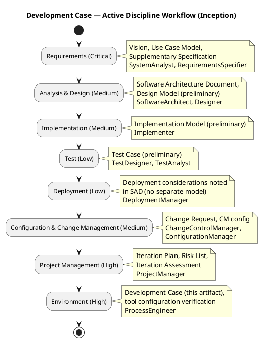
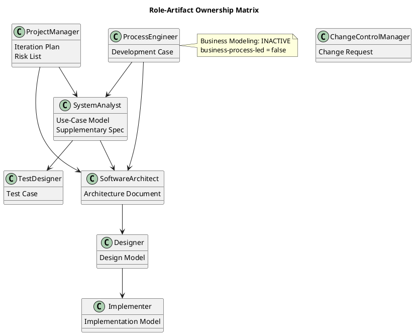

## Document Control

| Field | Value |
|---|---|
| Phase | Inception |
| Status | Draft |
| Milestone Target | End of Inception |
| Iteration | 1 (Cycle 1) |
| Author | ProcessEngineer |

## Tailoring Overview

This Development Case specifies project-specific **deltas** over the IARI DC baseline. The baseline defines 24 active roles, 16 CORE artifacts, 6 OPTIONAL artifacts, and a canonical discipline-intensity matrix. This document declares only deviations from that baseline — it does not restate it.

### Organization Assessment

| Factor | Finding |
|---|---|
| Organization | Cuba Corp — 200 employees, 3 offices. Internal IT project, no external regulatory constraints. |
| Agent roles | 24 RUP roles active per IARI baseline. AI-agent-driven process. |
| Process maturity | Greenfield — no prior RUP artifacts. Incremental rollout: Requirements + Architecture first, then Implementation + Test. |
| Risk profile | Low-medium. Primary technical risk: offline fault tolerance (5-min network drop with zero data loss for clock in/out). Secondary: AD/LDAP integration. |
| Tool baseline | Git/SCM, .NET 10 SDK, Razor Pages, PostgreSQL, Windows Server (internal hosting), Chrome/Edge only. CI via GitHub Actions workflows. |

### Tool Assessment

| Tool Category | Status | Notes |
|---|---|---|
| Version control | Available (Git/SCM) | Project repository initialized |
| Build pipeline | To configure | `.github/workflows` — .NET 10 build + test |
| Test framework | To configure | xUnit for .NET 10 (deferred to Elaboration) |
| Modeling | PlantUML via process tooling | UML diagrams embedded in artifacts |
| Requirements | Artifact-based | Use-Case Model + Supplementary Specification |
| Database | PostgreSQL on Windows Server | Npgsql EF Core provider (version to be resolved by SoftwareArchitect) |

## Disciplines and Intensity

Per canonical matrix — no deviations. All 7 always-active disciplines confirmed at canonical intensity levels for Inception.

| Discipline | Inception Intensity | Status |
|---|---|---|
| Business Modeling | High | **INACTIVE** — see below |
| Requirements | Critical | Active |
| Analysis & Design | Medium | Active |
| Implementation | Medium | Active |
| Test | Low | Active |
| Deployment | Low | Active |
| Configuration & Change Management | Medium | Active |
| Project Management | High | Active |
| Environment | High | Active (this artifact) |

### Business Modeling — INACTIVE

**Verdict:** `business-process-led = false`

**Rationale:** The project replaces fragmented tools (Excel sheets, mass emails, PDF directory) with a centralized web portal. The stakeholder declared concrete IT system requirements (3 functional use cases + AD authentication) and business goals (50% HR time reduction, 100% Excel elimination, 80% adoption). The approach is building a software system to automate existing processes — not redesigning how the business operates. No business process reengineering, no business object model, no business use-case modeling is warranted. The System Analyst captures requirements directly from stakeholder declarations.

**Impact:** BusinessProcessAnalyst and BusinessReviewer roles are idle for this project. No Business Use-Case Model or Business Rules artifact is produced. Requirements discipline consumes stakeholder declarations directly.

## Artifacts and Templates

### CORE Artifacts (16) — All Active

All 16 CORE artifacts from the IARI baseline are in scope. No CORE artifact is omitted. Primary ownership per baseline allowlist — no reassignments.

| Artifact | Primary Owner | Inception Status |
|---|---|---|
| Vision | RequirementsSpecifier | Draft |
| Use-Case Model | SystemAnalyst | Draft |
| Supplementary Specification | SystemAnalyst | Draft |
| Software Architecture Document | SoftwareArchitect | Preliminary |
| Design Model | Designer | Preliminary |
| Implementation Model | Implementer | Preliminary |
| Test Case | TestDesigner | Preliminary |
| Test Evaluation Summary | TestManager | Deferred (Construction) |
| User Documentation | TechnicalWriter | Deferred (Transition) |
| Release Notes | TechnicalWriter | Deferred (Transition) |
| Iteration Plan | ProjectManager | Draft |
| Iteration Assessment | ProjectManager | End of iteration |
| Risk List | ProjectManager | Draft |
| Review Record | ReviewCoordinator | End of iteration |
| Development Case | ProcessEngineer | This artifact |
| Change Request | ChangeControlManager | As needed (Construction+) |

### OPTIONAL Artifacts (6) — Trigger Evaluation

| Optional Artifact | Trigger Condition | Fired? | Justification |
|---|---|---|---|
| Glossary | Domain uses specialist vocabulary | **No** | HR/time-tracking domain uses common business terms. No regulated/legal/medical/financial jargon. |
| Architectural Proof-of-Concept | Elaboration + technical risk requiring empirical validation | **No** | Currently Inception. May fire in Elaboration if offline fault tolerance risk warrants empirical validation per Risk List. |
| Data Model | Data-centric OR >10 entities OR data-migration in scope | **No** | ~5-6 entities (Employee, Clocking, News, Category, DirectoryEntry, AuditLog). Not data-centric CRUD portal. No data migration. Data lives inline in Design Model. |
| Deployment Model | Distributed/multi-node OR multi-environment non-trivial | **No** | Single Windows Server, single environment, internal network only. Deployment is a section in SAD. |
| User-Interface Prototype | UX-critical OR UI complexity requiring validation | **No** | Simple CRUD portal with 3 features. Razor Pages, no SPA. Standard intranet UI patterns. |
| Test Plan | Formal delivery / regulatory audit / contractual test reporting | **No** | Internal portal, no regulatory or contractual test reporting requirements. Iteration Plan defines per-iteration testing scope. |

**Result:** Zero OPTIONAL artifacts triggered. All 6 remain NOT-FIRED.

## Optional Artifact Triggers

See table above. No optional artifacts are triggered for this project in Inception. The Process Engineer will re-evaluate each iteration — triggers may fire via Change Request or phase transition (e.g., Architectural PoC in Elaboration).

## Roles and Ownership

All 24 IARI baseline roles are active per the fixed roster. No merges, no reassignments, no omissions.

**Idle roles** (due to Business Modeling being INACTIVE):
- BusinessProcessAnalyst — no business use-case modeling work
- BusinessReviewer — no business artifacts to review

**Contributor notes** (not ownership changes):
- RequirementsSpecifier contributes to Vision; SystemAnalyst owns Use-Case Model and Supplementary Specification
- Miguel Torres (Technical Advisor) is a stakeholder resource for AD/infrastructure clarification — not a project role

## Guidelines and Procedures

Project-specific guidelines are authored by discipline experts and referenced here. The Process Engineer integrates references — does not author guideline content.

| Guideline | Owner | Location | Status |
|---|---|---|---|
| Coding standards | SoftwareArchitect | `CONTRIBUTING.md` | To be created in Elaboration |
| CI/CD pipeline | ConfigurationManager | `.github/workflows/` | To be configured in Elaboration |
| Lint configuration | SoftwareArchitect | `editorconfig` / analyzer rules | To be created in Elaboration |
| Test conventions | TestDesigner | `CONTRIBUTING.md` (test section) | To be created in Elaboration |
| UI patterns | UserInterfaceDesigner | `CONTRIBUTING.md` (UI section) | To be created in Elaboration |

### Process Workflow — Active Disciplines (Inception)

### Role-Artifact Ownership Matrix

### Version Policy

The stakeholder declared the following technology constraints:
- **Framework:** .NET 10 (backend + Razor Pages frontend)
- **Database:** PostgreSQL
- **Browsers:** Chrome and Edge (current versions) only
- **Hosting:** Internal Windows Server, no cloud
- **Authentication:** Active Directory via LDAP/OAuth2

The framework pin (.NET 10) is recorded via `record_version_policy`. No specific NuGet package versions were pinned by the stakeholder — the SoftwareArchitect resolves package versions (e.g., Npgsql EF Core provider) during Elaboration, governed by the framework pin.

## Traceability

| Element | Traces From | Link Type | Traces To |
|---|---|---|---|
| Development Case | IARI DC Baseline | Refines | All project artifacts (governs production) |
| Business Modeling INACTIVE | DC §4 classification | Derives | record_dc_classification |
| Optional triggers (none fired) | DC §5.2 trigger conditions | Derives | record_optional_artifact_triggers |
| Version Policy (.NET 10) | Stakeholder Constraints | Derives | record_version_policy |
| Tool references | Stakeholder Constraints | Derives | CONTRIBUTING.md, .github/workflows (Elaboration) |