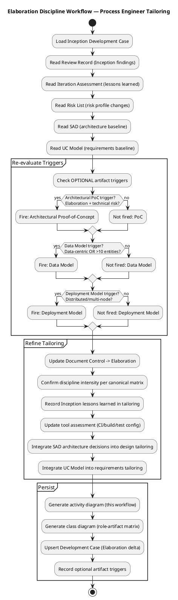
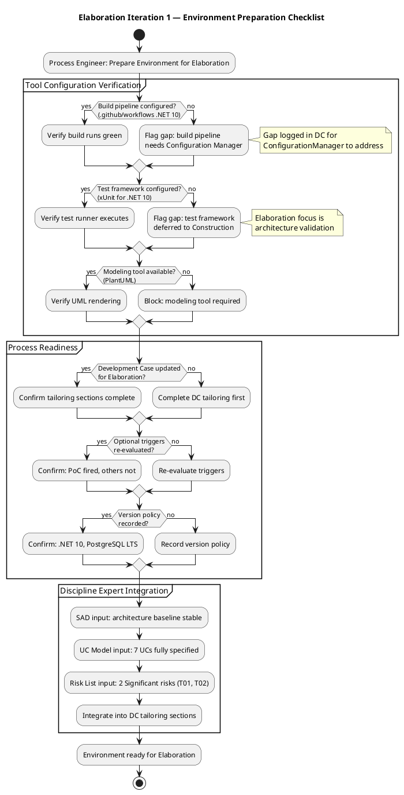

## Document Control
| Field | Value |
|---|---|
| Phase | Elaboration |
| Status | Draft |
| Milestone Target | LCA (Lifecycle Architecture) |
| Iteration | 2 (Cycle 1) |
| Author | ProcessEngineer |
| Prior Phase | Inception (LCO approved — GO verdict, 2026-07-07) |
| Prior Iteration | Elaboration Iteration 1 (LCA: CONDITIONAL NO-GO — auto-iterate to Cycle 2) |
| Governance Re-recorded | 2026-07-07 — DC classification, optional triggers, version policy all re-confirmed for Elaboration iteration 2 |
| Finding DC-F2 Status | RESOLVED — RPN values corrected to authoritative Risk List values (RISK-T01: 63/High, RISK-T02: 35/Significant, RISK-T03: 48/High) |
## Tailoring Overview
This Development Case specifies project-specific **deltas** over the IARI DC baseline. The baseline defines 24 active roles, 16 CORE artifacts, 6 OPTIONAL artifacts, and a canonical discipline-intensity matrix. This document declares only deviations from that baseline — it does not restate it.

### Organization Assessment (Updated for Elaboration Iteration 2)

| Factor | Finding |
|---|---|
| Organization | Cuba Corp — 200 employees, 3 offices. Internal IT project, no external regulatory constraints. |
| Agent roles | 24 RUP roles active per IARI baseline. AI-agent-driven process. |
| Process maturity | Post-Inception + Elaboration Iter 1: 3 iterations completed, LCO approved. LCA verdict: CONDITIONAL NO-GO — auto-iterate to Cycle 2. Process stabilized for Requirements + Architecture. Implementation + Test disciplines entering active phase. |
| Risk profile | Low-medium. RISK-T01 (offline sync, RPN 63 — High), RISK-T02 (AD integration, RPN 35 — Significant), RISK-T03 (data sync conflicts, RPN 48 — High). All require Elaboration mitigation. PoC-1 produced for RISK-T01. |
| Tool baseline | Git/SCM, .NET 10 SDK, Razor Pages, PostgreSQL, Windows Server (internal hosting), Chrome/Edge only. CI via GitHub Actions workflows. |

### Inception Lessons Learned (Process Improvement Input)

| Lesson | Source | Process Adjustment |
|---|---|---|
| DERIVED markers require precision — over-application causes rework | Iteration Assessment, Review Record F1-F3 | UC enumeration rules reinforced: DERIVED valid ONLY when STK-NNN verbatim describes the UC process. Cross-cutting mechanisms (auth/sync/audit) remain in Supplementary Specification, never as UCs. |
| Stale objective statuses in Iteration Assessment | Review Record F7 | Process Engineer to verify Document Control metadata is refreshed on every section update across all artifacts. |
| AD auth method (LDAP vs OAuth2) undecided | Risk List RISK-T02, SAD ADR-003 | AD integration isolated behind IAuthProvider interface — spike deferred to Construction per SAD decision. Process tailoring: PoC artifact triggered for Elaboration risk validation. |
| Design file impact requires stakeholder input | Review Record S2 | Process adjustment: stakeholder design file review integrated into Elaboration SAD evolution. |
| RPN governance failure across artifacts | Review Record RL-F1, MR-RL-F1, DC-F2 | Process adjustment: Process Engineer must cross-check RPN values in DC against authoritative Risk List before each upsert. RPN values are READ-ONLY from Risk List — never independently assessed in DC. |

### Elaboration Iteration 1 Lessons Learned (Cycle 2 Process Improvement)

| Lesson | Source | Process Adjustment |
|---|---|---|
| RPN inconsistency across DC/TC/IP | Review Record DC-F2, RL-F1 | DC Risk Profile corrected to authoritative Risk List values. Process rule: DC references Risk List RPNs by ID only, never hardcodes values without verification. |
| LCA milestone metadata confusion (LAM vs LCA) | Review Record SAD-F3 | Document Control milestone target corrected to LCA. Process rule: verify milestone target matches current phase exit criterion. |
| PoC artifact produced but SAD reference stale | Review Record SAD-F2 | SAD corrected in Iteration 2. Process rule: when optional artifact is produced, all referencing artifacts must be updated in the same iteration. |

### Tool Assessment (Updated for Elaboration Iteration 2)

| Tool Category | Status | Notes |
|---|---|---|
| Version control | Available (Git/SCM) | Project repository initialized, branching strategy published |
| Build pipeline | To configure | `.github/workflows` — .NET 10 build + test. ConfigurationManager to configure during Elaboration. |
| Test framework | To configure | xUnit for .NET 10. Deferred to Construction per canonical intensity (Test: Medium in Elaboration, Critical in Construction). |
| Modeling | PlantUML via process tooling | UML diagrams embedded in artifacts — verified working |
| Requirements | Artifact-based | Use-Case Model (7 UCs, all with activity diagrams) + Supplementary Specification (fully quantified) |
| Database | PostgreSQL on Windows Server | Npgsql EF Core provider — version resolved by SoftwareArchitect (10.0.2 confirmed in SAD) |
| CI/CD | GitHub Actions | CI triggers on all branch families for push and PR. Baseline tagging and CI gate enforcement deferred to Elaboration. |
| PoC validation | Available | PoC-1 (Offline Sync) produced by Implementer on branch `poc/E1-risk-t01-offline-sync`, CI Green 3/3. Validates RISK-T01 mitigation. |
## Disciplines and Intensity

Per canonical matrix — no deviations. All 7 always-active disciplines confirmed at canonical intensity levels for Elaboration:

| Discipline | Elaboration Intensity | Notes |
|---|---|---|
| Requirements | High | UC Model evolved to Elaboration depth (7 UCs with activity diagrams, scenarios) |
| Analysis & Design | Critical | SAD baseline established (4+1 views complete), Design Model in progress |
| Implementation | Medium | Bottom-up integration: Infrastructure → Application → Presentation |
| Test | Medium | Test Evaluation Summary from Inception; Test Case design begins |
| Deployment | Low | Single-node topology; deployment section in SAD sufficient |
| Configuration & Change Management | Medium | CI pipeline configuration; baseline tagging deferred to Elaboration |
| Project Management | Medium | Iteration Plan, Risk List, Iteration Assessment active |
| Business Modeling | INACTIVE | Not business-process-led per DC §4 classification (re-confirmed) |
| Environment | Medium | This iteration — Development Case refinement + tool verification |

**No intensity deviations requested.** The canonical matrix levels match the project's risk profile and phase objectives.

## Artifacts and Templates
### CORE Artifacts (16) — All Active

All 16 CORE artifacts are produced per IARI baseline ownership. No CORE artifacts omitted. No ownership reassignments.

### OPTIONAL Artifacts (6) — Trigger Re-Evaluation for Elaboration

| Optional Artifact | §5.2 Trigger Condition | Fired? | Justification |
|---|---|---|---|
| Architectural Proof-of-Concept | Elaboration phase + at least one technical risk requiring empirical validation (per Risk List) | **YES** | Elaboration phase active. RISK-T01 (offline sync, RPN 63 — High) and RISK-T02 (AD integration, RPN 35 — Significant) are technical risks requiring empirical validation. PoC-1 (Offline Sync) produced in Iteration 1 — CI Green 3/3. PoC-2 (AD Integration) deferred to Construction per IAuthProvider isolation. |
| Data Model | Data-centric system OR >10 entities OR data-migration in scope | NO | Standard CRUD intranet portal. ~8 entities (Employees, Clockings, News, NewsCategories, DirectoryEntries, AuditLogs, etc.). Not data-centric, no migration. Data schema lives in SAD Data View. |
| Deployment Model | Distributed / multi-node topology, OR multi-environment non-trivial | NO | Single Windows Server, single node, internal network only. Physical View in SAD is sufficient. |
| Glossary | Domain uses specialist vocabulary (technical/regulated/legal/medical/financial jargon) | NO | Standard intranet domain — no specialist vocabulary requiring stakeholder-validated definitions. |
| User-Interface Prototype | UX-critical OR UI complexity requiring stakeholder validation before implementation | NO | Razor Pages intranet with standard CRUD UI. Not UX-critical. No prototype needed before implementation. |
| Test Plan | Formal delivery / regulatory audit / contractual test reporting | NO | Internal tool, no regulatory or contractual test reporting requirements. Iteration Plan defines per-iteration testing scope. |

**Change from Inception:** Architectural Proof-of-Concept trigger newly FIRED in Elaboration Iteration 1 (trigger condition requires Elaboration phase). PoC-1 produced. All other triggers unchanged. Iteration 2 re-confirmation: trigger conditions unchanged, PoC artifact already exists.
## Optional Artifact Triggers

Recorded via `record_optional_artifact_triggers`:
- **FIRED:** Architectural Proof-of-Concept
- **NOT FIRED:** Data Model, Deployment Model, Glossary, User-Interface Prototype, Test Plan

The Architectural Proof-of-Concept artifact is now sanctioned for production. The SoftwareArchitect owns this artifact. PoC scope per SAD: PoC-1 (Offline Sync — validates RISK-T01 mitigation), PoC-2 (AD Integration — validates RISK-T02 mitigation). PoC-3 (Design Integration — validates RISK-T05) is referenced but may be deferred based on risk evolution.

## Roles and Ownership

Per IARI baseline — 24 active roles, no reassignments, no merges. All CORE artifact ownership is fixed per the service-side allowlist. This Development Case does not modify any role assignments.

### Elaboration-Specific Role Focus

| Role | Elaboration Focus |
|---|---|
| SoftwareArchitect | SAD baseline (complete), PoC artifact (triggered), architecture stability verification |
| Designer | Design Model — class diagrams, use-case realizations, sequence diagrams for architecturally significant UCs |
| DatabaseDesigner | Data schema in SAD (complete); data sections in Design Model |
| UserInterfaceDesigner | UI sections in Design Model (Razor Pages layout) |
| SystemAnalyst | UC Model (Elaboration depth — 80%+), Supplementary Specification (fully quantified) |
| Implementer | Implementation Model — bottom-up: Infrastructure → Application → Presentation |
| TestDesigner | Test Case design begins (Test: Medium in Elaboration) |
| ProjectManager | Iteration Plan, Risk List updates, Iteration Assessment |
| Reviewer | Review Record for Elaboration artifacts |
| ProcessEngineer | This Development Case + environment verification |

## Guidelines and Procedures

### Process Workflow — Elaboration Discipline Tailoring

### Role-Artifact Responsibility Matrix

```plantuml
@startuml
title Role-Artifact Responsibility Matrix — Elaboration Active Disciplines

class ProcessEngineer {
  + Development Case
  + record_dc_classification()
  + record_optional_artifact_triggers()
  + record_version_policy()
}

class SystemAnalyst {
  + Use-Case Model
  + Supplementary Specification
  + Vision
}

class SoftwareArchitect {
  + Software Architecture Document
  + Design Model (architecture sections)
}

class Designer {
  + Design Model (class/sequence sections)
}

class DatabaseDesigner {
  + Design Model (data sections)
}

class UserInterfaceDesigner {
  + Design Model (UI sections)
}

class Implementer {
  + Implementation Model
}

class TestDesigner {
  + Test Case
}

class TestManager {
  + Test Evaluation Summary
}

class ProjectManager {
  + Iteration Plan
  + Iteration Assessment
  + Risk List
}

class Reviewer {
  + Review Record
}

class ChangeControlManager {
  + Change Request
}

class ConfigurationManager {
  + CI/CD Configuration
}

class TechnicalWriter {
  + User Documentation
}

class DeploymentManager {
  + Deployment Model (if triggered)
}

ProcessEngineer --> DevelopmentCase : owns
SystemAnalyst --> UseCaseModel : owns
SystemAnalyst --> SupplementarySpec : owns
SystemAnalyst --> Vision : owns
SoftwareArchitect --> SAD : owns
Designer --> DesignModel : contributes
DatabaseDesigner --> DesignModel : contributes
UserInterfaceDesigner --> DesignModel : contributes
Implementer --> ImplementationModel : owns
TestDesigner --> TestCase : owns
TestManager --> TestEvalSummary : owns
ProjectManager --> IterationPlan : owns
ProjectManager --> RiskList : owns
ProjectManager --> IterationAssessment : owns
Reviewer --> ReviewRecord : owns
ChangeControlManager --> ChangeRequest : owns
TechnicalWriter --> UserDocumentation : owns

DevelopmentCase ..> UseCaseModel : governs
DevelopmentCase ..> SAD : governs
DevelopmentCase ..> DesignModel : governs
DevelopmentCase ..> ImplementationModel : governs
DevelopmentCase ..> TestCase : governs

note right of ProcessEngineer
  Elaboration focus:
  - Re-evaluate OPTIONAL triggers
  - Integrate discipline-expert input
  - Verify tool environment
  - Record version policy
end note

note right of DevelopmentCase
  Override delta over IARI baseline.
  Does NOT redefine roster or
  CORE artifact ownership.
end note

@enduml
```

### Environment Preparation Checklist

### Discipline-Specific Tailoring (Integrated from Discipline Experts)

#### Requirements Discipline

- **Active roles:** SystemAnalyst, RequirementsSpecifier
- **Artifacts:** Use-Case Model (7 UCs — UC-001 through UC-007), Supplementary Specification, Vision
- **Elaboration focus:** UC specifications at 80%+ detail with activity diagrams and scenario walkthroughs. UC-001 (Clock In/Out) is architecturally significant — drives offline sync design. AD authentication is a Supplementary Specification constraint with `<<include>>` from all UCs, NOT a standalone UC (per Scope Guard Rule 7).
- **Guideline reference:** `CONTRIBUTING.md` (to be authored by SystemAnalyst for UC specification conventions)
- **Inception lesson applied:** DERIVED markers used with precision — only when STK-NNN verbatim describes the UC process. F1-F3 findings resolved by removing incorrect DERIVED markers and refactoring cross-cutting mechanisms.

#### Analysis & Design Discipline

- **Active roles:** SoftwareArchitect, Designer, DatabaseDesigner, UserInterfaceDesigner, CapsuleDesigner
- **Artifacts:** Software Architecture Document (baseline — 4+1 views complete), Design Model (in progress), Architectural Proof-of-Concept (OPTIONAL — triggered)
- **Elaboration focus:** Architecture baseline stabilization. SAD has all 4+1 views: Logical (component diagram), Process (offline sync concurrency), Deployment (single-node Windows Server), Implementation (package diagram), Data (full schema), Use-Case (sequence diagrams for top 3 UCs). Design Mechanisms section maps all analysis mechanisms to concrete solutions.
- **PoC scope:** PoC-1 (Offline Sync — RISK-T01), PoC-2 (AD Integration — RISK-T02). PoC-3 (Design Integration — RISK-T05) referenced.
- **Key architectural decisions:** ADR-001 (layered architecture), ADR-002 (offline sync via SQLite local store + Network Health Monitor), ADR-003 (AD auth isolated behind IAuthProvider — spike deferred to Construction).
- **Integration order:** Infrastructure → Application → Presentation (bottom-up per SAD).
- **Guideline reference:** `CONTRIBUTING.md` (to be authored by SoftwareArchitect for coding standards, design conventions)

#### Implementation Discipline

- **Active roles:** Implementer, Integrator
- **Artifacts:** Implementation Model
- **Elaboration focus:** Medium intensity. Implementation Model planning. Bottom-up integration order per SAD. AD integration isolated behind IAuthProvider interface — spike deferred to Construction.
- **Guideline reference:** `CONTRIBUTING.md` (to be authored by Implementer for build conventions, code style)

#### Test Discipline

- **Active roles:** TestManager, TestAnalyst, TestDesigner, Tester
- **Artifacts:** Test Evaluation Summary (from Inception), Test Case (design begins in Elaboration)
- **Elaboration focus:** Medium intensity. Test Case design for architecturally significant UCs (UC-001 offline sync, UC-007 AD integration). Test framework (xUnit) configuration deferred to Construction per canonical intensity.
- **Guideline reference:** `CONTRIBUTING.md` (to be authored by TestDesigner for test conventions)

#### Configuration & Change Management Discipline

- **Active roles:** ChangeControlManager, ConfigurationManager
- **Artifacts:** Change Request (narrative ledger from Construction onwards), CI/CD configuration
- **Elaboration focus:** Medium intensity. CI pipeline configuration (`.github/workflows`). Baseline tagging and CI gate enforcement deferred to Elaboration. CI triggers on all branch families for push and PR.
- **Guideline reference:** `.github/workflows` (owned by ConfigurationManager), `CONTRIBUTING.md` (collaborative)

#### Project Management Discipline

- **Active roles:** ProjectManager, ManagementReviewer
- **Artifacts:** Iteration Plan, Iteration Assessment, Risk List
- **Elaboration focus:** Medium intensity. Risk List updates for RISK-T01, RISK-T02, RISK-T03 mitigation tracking. Iteration Plan for Elaboration scope. Iteration Assessment at end of iteration.

#### Deployment Discipline

- **Active roles:** DeploymentManager
- **Artifacts:** Deployment section in SAD (Physical View)
- **Elaboration focus:** Low intensity. Single-node topology. Deployment Model OPTIONAL artifact NOT triggered — Physical View in SAD is sufficient.

### Version Policy

Recorded via `record_version_policy`:

| Ecosystem | Package | Pinned Version | LTS Only | Rationale |
|---|---|---|---|---|
| framework | .NET 10 | 10.0 | No | Stakeholder constraint: Backend .NET 10 with REST API. Framework pin governs all NuGet package resolution. |
| framework | PostgreSQL | 16 | Yes | Stakeholder constraint: PostgreSQL on internal Windows Server. LTS version for enterprise stability. |

The SoftwareArchitect resolves specific NuGet package versions (e.g., Npgsql EF Core provider) against the .NET 10 framework pin. SAD confirms: EF Core 10.0.9, Npgsql 10.0.2, EF Core Sqlite 10.0.9.

### Tool Configuration Gaps (Flagged for Discipline Experts)

| Gap | Owner | Action Required | Due |
|---|---|---|---|
| Build pipeline not yet configured | ConfigurationManager | Configure `.github/workflows` for .NET 10 build + test | Elaboration iteration 1 |
| Test framework not yet configured | TestDesigner / ConfigurationManager | Configure xUnit for .NET 10 | Construction iteration 1 (per canonical intensity) |
| `CONTRIBUTING.md` not yet authored | Each discipline expert | Author discipline-specific guideline sections | Elaboration iteration 1 |
| Baseline tagging not enforced | ConfigurationManager | Implement CI gate enforcement | Elaboration (deferred from Inception) |

## Traceability
| Element | Traces From | Link Type | Traces To |
|---|---|---|---|
| Development Case (Elaboration Iter 2) | IARI DC Baseline, Inception Development Case, Elaboration Iter 1 Development Case | Refines | All project artifacts (governs production) |
| Business Modeling INACTIVE | DC §4 classification (re-confirmed) | Derives | record_dc_classification |
| Optional: Architectural PoC FIRED | DC §5.2 trigger (Elaboration + RISK-T01 RPN 63/High, RISK-T02 RPN 35/Significant) | Derives | record_optional_artifact_triggers, SAD (PoC plans), PoC-1 artifact |
| Optional: Data Model NOT FIRED | DC §5.2 trigger (~8 entities, not data-centric) | Derives | record_optional_artifact_triggers |
| Optional: Deployment Model NOT FIRED | DC §5.2 trigger (single-node topology) | Derives | record_optional_artifact_triggers |
| Optional: Glossary NOT FIRED | DC §5.2 trigger (no specialist vocabulary) | Derives | record_optional_artifact_triggers |
| Optional: UI Prototype NOT FIRED | DC §5.2 trigger (standard CRUD UI) | Derives | record_optional_artifact_triggers |
| Optional: Test Plan NOT FIRED | DC §5.2 trigger (no regulatory/contractual reporting) | Derives | record_optional_artifact_triggers |
| Version Policy (.NET 10, PostgreSQL 16, Npgsql 10.0.2, EF Core Sqlite 10.0.9) | Stakeholder Constraints, SAD | Derives | record_version_policy, SAD (technology stack) |
| Inception Lessons Learned | Review Record F1-F7, Iteration Assessment | Derives | Tailoring sections (Requirements, A&D) |
| Elaboration Iter 1 Lessons Learned | Review Record DC-F2, RL-F1, SAD-F2, SAD-F3 | Derives | Tailoring sections (RPN governance, metadata verification) |
| Tool Assessment | Stakeholder Constraints, SAD, PoC-1 results | Derives | ConfigurationManager, TestDesigner (gap actions) |
| SAD Integration | Software Architecture Document (Elaboration Iter 2) | Derives | A&D tailoring section, PoC trigger |
| UC Model Integration | Use-Case Model (Elaboration, 7 UCs) | Derives | Requirements tailoring section |
| Risk List Integration | Risk List (Elaboration, RISK-T01 RPN 63/High, RISK-T02 RPN 35/Significant, RISK-T03 RPN 48/High) | Derives | PoC trigger justification, A&D tailoring |
| DC-F2 Resolution | Review Record DC-F2 (RPN inconsistency) | Reviews | Development Case Tailoring Overview + Artifacts and Templates (corrected) |
