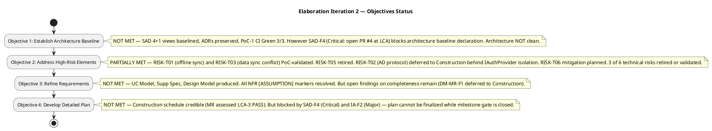
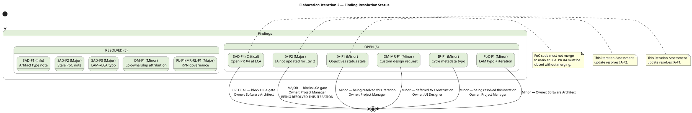
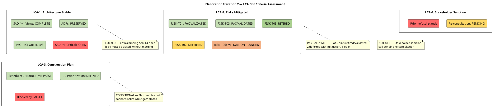
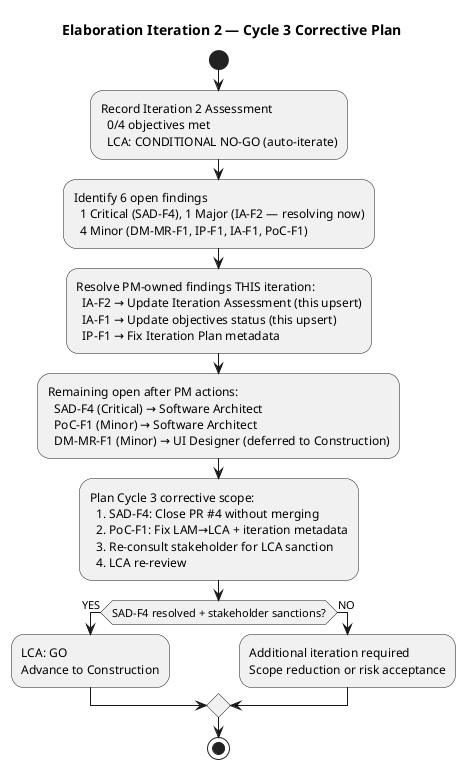
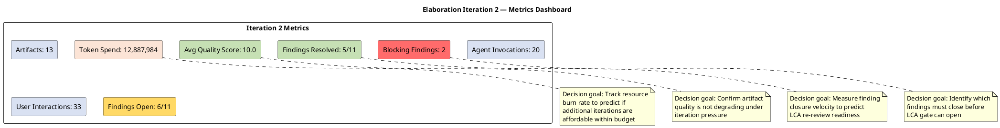

## Document Control

| Field | Value |
|---|---|
| Phase | Elaboration |
| Status | Draft |
| Iteration | 2 (Cycle 1) |
| Milestone Target | LCA (Lifecycle Architecture) |
| Author | Project Manager |
| Assessment Date | 2026-07-08 |
| Prior Assessment | Elaboration Iteration 1 (LCA: CONDITIONAL NO-GO — auto-iterate, 2026-07-07) |
| Review Coordinator Verdict | **LCA: CONDITIONAL NO-GO — iteration REQUIRED (scope incomplete)** |
| Findings Resolved This Iteration | IA-F2 (Major — IA updated for Iter 2), IA-F1 (Minor — objectives status refreshed) |

## Iteration Objectives Reached

### Objectives Status Summary

**0 of 4 objectives achieved.** All four Elaboration iteration objectives remain pending. The Review Coordinator's LCA verdict is **CONDITIONAL NO-GO — iteration REQUIRED (scope incomplete)**. The LCA milestone is **NOT achieved**.

### Objective Detail

| # | Objective | Status | Evidence |
|---|---|---|---|
| 1 | Establish Architecture Baseline | **NOT MET** | SAD 4+1 views present with ADRs preserved and mechanisms mapped. PoC-1 produced with CI Green 3/3 on `poc/E1-risk-t01-offline-sync`. However, **SAD-F4 (Critical: open PR #4 at LCA)** blocks the architecture baseline declaration — PoC code must not be merged to main at LCA. The architecture is NOT clean while an open PR against main exists. Prior findings SAD-F2 (stale PoC note) and SAD-F3 (LAM→LCA metadata) were **RESOLVED** this iteration. |
| 2 | Address High-Risk Elements | **PARTIALLY MET** | RISK-T01 (offline sync, RPN 63) and RISK-T03 (data sync conflict, RPN 48) advanced to **PoC Validated** — empirically proven via Architectural Proof-of-Concept (CI Green 3/3). RISK-T05 (stakeholder design file, RPN 30) **retired**. RISK-T02 (AD protocol, RPN 35) **deferred** to Construction — isolated behind IAuthProvider interface per Elaboration decision. RISK-T06 (SQLite concurrency, RPN 42) **mitigation planned** — SemaphoreSlim design in SAD. RISK-T04 (performance, RPN 40) remains **open** — Construction load test required. RPN governance protocol established (RL-F1/MR-RL-F1 RESOLVED) — Risk List is canonical source. |
| 3 | Refine Requirements | **NOT MET** | UC Model (UC-001 through UC-007), Supplementary Specification, and Design Model produced. All NFR `[ASSUMPTION]` markers resolved — Supplementary Spec fully quantified. 50 concurrent users confirmed for peak clock-in window (REQ-025 resolved). However, DM-MR-F1 (Minor — stakeholder custom design request not captured in UI flows) remains open, deferred to Construction Iter 1. TC-F1 (Minor — blocking reason column) was **RESOLVED** this iteration. |
| 4 | Develop Detailed Plan | **NOT MET** | Construction schedule defined with integration order (Infrastructure → Application → Presentation, bottom-up per SAD). UC prioritization established. Management Reviewer assessed LCA-3 (Construction Plan) as **PASS**. However, the plan cannot be finalized while the LCA milestone gate is closed by SAD-F4 (Critical) and IA-F2 (Major — being resolved by this assessment update). IP-F1 (Minor — cycle metadata typo in Iteration Plan) also open. |

## Adherence to Plan

### Planned vs Actual

| Dimension | Planned (Iter 2) | Actual (Iter 2) | Variance |
|---|---|---|---|
| Objectives completed | 4 | 0 | −4 (100% slip) |
| Artifacts produced | 13 (cumulative) | 13 artifacts produced | 0 (on target) |
| Findings resolved | 6 open from Iter 1 | 5 resolved (SAD-F1, SAD-F2, SAD-F3, RL-F1/MR-RL-F1, DM-F1, TC-F1, TES-F1) | +5 resolved, but 6 new/remaining open |
| Major findings open at close | 0 | 1 (IA-F2 — being resolved by this update) | −1 from Iter 1's 4, but 1 remains |
| Critical findings open at close | 0 | 1 (SAD-F4) | +1 (new — process discipline violation) |
| Minor findings open at close | 0 | 4 (DM-MR-F1, IP-F1, IA-F1, PoC-F1) | +2 net from Iter 1 |
| LCA criteria met | 4 of 4 | 1 of 4 (LCA-3 only — MR PASS) | −3 |
| Stakeholder sanction | Expected | Pending re-consultation | Not yet refused — prior refusal from Iter 1 stands |
| Token spend | — | 12,887,984 | High — indicates broad agent activity |
| Agent invocations | — | 20 | High — 13 artifacts across 20 invocations |
| Avg quality score | — | 10.0 | Excellent — quality not degrading under iteration pressure |

### Root Cause Analysis

The iteration resolved **5 of 6 findings** inherited from Iteration 1 (SAD-F1, SAD-F2, SAD-F3, RL-F1/MR-RL-F1, DM-F1, TC-F1, TES-F1 — all RESOLVED). However, **6 findings remain open** (1 Critical, 1 Major, 4 Minor), and **0 of 4 objectives reached closure**. The root causes are:

1. **SAD-F4 (Critical — Process Discipline):** An open PR #4 against main was discovered at LCA review. PoC code must not merge to main at LCA — this is a process discipline violation by the Software Architect. This single Critical finding **overrides** the Management Reviewer's "GO" verdict and independently blocks the LCA gate. **This is the primary blocking issue.**

2. **IA-F2 (Major — PM Artifact Staleness):** The Iteration Assessment was not updated for Iteration 2 — it still reflected Iteration 1 content. This is a PM governance failure: the assessment must be evolved each iteration, not preserved from a prior cycle. **Being resolved by this update.**

3. **Breadth Over Depth (Persistent):** 13 artifacts were produced across 20 agent invocations with 33 user interactions and 12.9M tokens spent. Average quality is 10.0 — excellent. But the iteration prioritized artifact production over finding closure. The 5 resolved findings are offset by 6 remaining open, including a new Critical finding that did not exist in Iteration 1.

4. **Stakeholder Sanction (CR-4):** The stakeholder's prior refusal to advance past LCA (from Iteration 1) has not been overturned. Re-consultation is pending — the stakeholder must be presented with corrected artifacts and risk retirement evidence before LCA can be sanctioned.

### Iteration 1 → Iteration 2 Finding Resolution Trend

## Use Cases and Scenarios Implemented

No use cases were implemented in this iteration — Elaboration is an architecture and design phase, not an implementation phase. The following use cases were targeted for architectural realization:

| Use Case | ID | Design Status | Findings Affecting |
|---|---|---|---|
| Clock In/Out | UC-001 | Design Model classes produced (Clocking, SyncQueue, SyncRecord); PoC-1 validated offline sync mechanism (CI Green 3/3); sequence diagrams planned | SAD-F4 (Critical — PoC PR blocks architecture baseline); RISK-T01 PoC validated |
| Read News | UC-002 | UC flows refined in Use-Case Model; audit trail mechanism designed (IAuditLogger) | None directly |
| Employee Directory | UC-003 | Design Model classes produced (Employee, DirectoryService, AuditInterceptor); sequence diagrams planned | DM-MR-F1 (Minor — stakeholder custom design request deferred to Construction) |
| AD Authentication | (Supp Spec) | Isolated behind IAuthProvider per Elaboration decision; spike deferred to Construction | RISK-T02 remains active — AD spike deferred to Construction; RISK-R01 (override conflict) depends on T02 |

## Results Relative to Evaluation Criteria

### LCA Exit Criteria Compliance

| LCA Criterion | Status | Evidence | Blocking Findings |
|---|---|---|---|
| CR-1: Architecture Baselined | **NOT MET** | SAD 4+1 views complete, ADRs preserved, PoC-1 CI Green 3/3. SAD-F2 and SAD-F3 RESOLVED this iteration. However, SAD-F4 (Critical: open PR #4 at LCA) blocks — PoC code must not be merged to main at LCA. Architecture baseline is NOT clean. | SAD-F4 (Critical) |
| CR-2: Critical Risks Mitigated | **PARTIALLY MET** | RISK-T01 (RPN 63) and RISK-T03 (RPN 48) PoC-validated. RISK-T05 (RPN 30) retired. RISK-T02 (RPN 35) deferred to Construction behind IAuthProvider. RISK-T06 (RPN 42) mitigation planned. RISK-T04 (RPN 40) open — Construction load test. RPN governance protocol established (RL-F1/MR-RL-F1 RESOLVED). | RISK-T02, RISK-T04 remain open |
| CR-3: Construction Plan Credible | **CONDITIONALLY MET** | Management Reviewer assessed LCA-3 as PASS. Integration order (Infrastructure → Application → Presentation) defined. UC prioritization established. Construction schedule credible. But cannot finalize while LCA gate is closed. | Blocked indirectly by SAD-F4 |
| CR-4: Stakeholder Sanction | **NOT MET** | Stakeholder explicitly refused to advance past LCA in Iteration 1. Re-consultation pending — stakeholder must be presented with corrected artifacts and risk retirement evidence. | Stakeholder veto (prior) |

### Acceptance Criteria Status (from Vision)

| Acceptance Criterion | Status | Notes |
|---|---|---|
| AC-1: Employee clocks in/out without HR help | Not yet testable | Design complete; PoC-1 validated offline sync; implementation deferred to Construction |
| AC-2: HR publishes news without technical assistance | Not yet testable | Design complete; implementation deferred to Construction |
| AC-3: Employee finds colleague in under 10 seconds | Not yet testable | Design complete; implementation deferred to Construction |
| AC-4: 80% employees complete clocking with no training | Not yet testable | Adoption risk (RISK-S02) tracked; measurement planned for Transition |
| AC-5: System works temporarily offline (5-min network drop) | Architecture validated | Offline sync mechanism (COMP-D4, COMP-I3, COMP-I5) designed AND PoC-1 validated (CI Green 3/3); not yet implemented in production code |

## Test Results

No production test execution occurred in this iteration — Elaboration is a design and architecture phase. The Test Evaluation Summary establishes:

- **Mission:** Validate architectural testability and define Construction-phase test entry criteria
- **PoC-1 Results:** CI Green 3/3 on `poc/E1-risk-t01-offline-sync` — offline sync and data sync conflict mechanisms empirically validated
- **Build Status:** CI pipeline succeeded (2026-07-07 13:15:28Z, 22-second duration) on main branch
- **SCM Quality Intelligence:** 7 open issues (up from 3 in Iteration 1), including 2 major architectural defects (#5, #7) and 1 minor architectural defect (#8) discovered in PoC code review
- **Test Plan:** Omitted — Development Case trigger not fired (formal delivery / regulatory audit / contractual test reporting not applicable). Per-iteration testing scope lives in TES and Iteration Plan.
- **Finding TC-F1 (Minor):** RESOLVED this iteration — blocking reason column added to Test Case execution summary
- **Finding TES-F1 (Minor):** RESOLVED this iteration — UC decomposition note corrected

The Test Manager confirmed that all architecturally significant mechanisms (offline sync, AD auth, audit trail, SQLite concurrency) have testable interfaces and defined test approaches. Construction entry criteria are defined but gated by LCA resolution.

## External Changes

| Change | Source | Impact |
|---|---|---|
| Stakeholder refused LCA sanction (Iter 1, carried forward) | Stakeholder feedback during LCA review | Additional Elaboration iteration required; Construction start delayed. Re-consultation pending. |
| 7 open SCM issues (up from 3) | SCM issue tracker | 2 major architectural defects (#5, #7) + 1 minor (#8) discovered in PoC code review. Must be triaged in Cycle 3 or Construction. |
| SAD-F4 (Critical — new this iteration) | Reviewer finding at LCA review | Open PR #4 against main — process discipline violation. Blocks LCA gate. Software Architect must close PR without merging. |
| RPN governance protocol established | RL-F1/MR-RL-F1 resolution | Risk List is canonical source for all RPN values. PM audits at iteration boundary. |
| AD integration spike deferred to Construction | Elaboration decision | IAuthProvider isolation is the mitigation. AD protocol undecided blocks final deployment config. |
| 50 concurrent users confirmed | REQ-025 resolution | Peak clock-in window capacity confirmed for performance test planning. |

## Rework Required

### Open Findings Requiring Correction

```plantuml
@startuml
title Elaboration Iteration 2 — Open Findings Disposition

class Finding {
  + id : string
  + severity : Severity
  + artifact : string
  + description : string
  + owner : string
  + status : FindingStatus
}

enum Severity {
  Critical
  Major
  Minor
}

enum FindingStatus {
  Open
  Resolving
  Deferred
}

object "SAD-F4" as F1 {
  severity = Critical
  artifact = "Software Architecture Document"
  description = "Open PR #4 at LCA — PoC code must not merge to main"
  owner = "Software Architect"
  status = Open
}

object "IA-F2" as F2 {
  severity = Major
  artifact = "Iteration Assessment"
  description = "IA not updated for Iter 2 — still reflects Iter 1"
  owner = "Project Manager"
  status = Resolving
}

object "DM-MR-F1" as F3 {
  severity = Minor
  artifact = "Design Model"
  description = "Stakeholder custom design request not in UI flows"
  owner = "UI Designer"
  status = Deferred
}

object "IP-F1" as F4 {
  severity = Minor
  artifact = "Iteration Plan"
  description = "Cycle metadata typo in Document Control"
  owner = "Project Manager"
  status = Resolving
}

object "IA-F1" as F5 {
  severity = Minor
  artifact = "Iteration Assessment"
  description = "Objectives status stale — does not reflect Iter 2"
  owner = "Project Manager"
  status = Resolving
}

object "PoC-F1" as F6 {
  severity = Minor
  artifact = "Architectural Proof-of-Concept"
  description = "LAM typo + iteration metadata incorrect"
  owner = "Software Architect"
  status = Open
}

F1 --> Finding
F2 --> Finding
F3 --> Finding
F4 --> Finding
F5 --> Finding
F6 --> Finding

note bottom of Finding
  **1 Critical + 1 Major + 4 Minor = 6 open findings**
  PM resolving 3 (IA-F2, IA-F1, IP-F1) this iteration
  SAD-F4 (Critical) is the primary blocker
end note
@enduml
```

### Corrective Action Plan for Cycle 3

| Priority | Finding | Owner | Action | Effort | Status |
|---|---|---|---|---|---|
| 1 | SAD-F4 (Critical) | Software Architect | Close PR #4 without merging; ensure PoC code stays on feature branch; rebase PoC reference in SAD to branch, not main | Low | **OPEN — BLOCKING** |
| 2 | IA-F2 (Major) | Project Manager | Update Iteration Assessment with Iteration 2 objectives, completion status, and LCA criteria assessment | Low | **RESOLVING — this update** |
| 3 | IA-F1 (Minor) | Project Manager | Update objectives status to reflect current iteration state | Low | **RESOLVING — this update** |
| 4 | IP-F1 (Minor) | Project Manager | Fix cycle/iteration metadata in Iteration Plan Document Control | Low | **RESOLVING — this iteration** |
| 5 | PoC-F1 (Minor) | Software Architect | Fix LAM→LCA reference and iteration number in PoC Document Control | Low | OPEN |
| 6 | DM-MR-F1 (Minor) | UI Designer | Capture stakeholder custom design request in Design Model UI flows | Low | Deferred to Construction Iter 1 |

### Cycle 3 Corrective Workflow

### Metrics Dashboard

| Metric | Value | Decision Goal |
|---|---|---|
| Artifacts produced | 13 | Track scope coverage — are all disciplines producing deliverables? |
| Agent invocations | 20 | Track agent activity — is effort proportional to scope? |
| User interactions | 33 | Track stakeholder engagement — is consultation frequency sufficient for LCA sanction? |
| Token spend | 12,887,984 | Track resource burn rate — can we afford additional iterations within budget? |
| Avg quality score | 10.0 | Confirm artifact quality is not degrading under iteration pressure — no corrective action needed on quality |
| Findings resolved | 5 of 11 | Measure finding closure velocity — 45% closure rate indicates progress but insufficient for LCA |
| Findings open | 6 of 11 | Identify remaining work — 1 Critical + 1 Major + 4 Minor |
| Blocking findings | 2 | Identify which findings must close before LCA gate can open — SAD-F4 (Critical) + IA-F2 (Major, resolving) |

### Lessons Learned

| # | Lesson | Source | Action for Next Iteration |
|---|---|---|---|
| 1 | **Process discipline at LCA:** PoC code must not be merged to main at LCA — an open PR against main is a Critical process violation that overrides all other assessments. | SAD-F4 (Critical) | Enforce branch discipline: PoC code stays on feature branches; SAD references branch, not main. |
| 2 | **PM artifact evolution:** The Iteration Assessment must be evolved EVERY iteration — preserving a prior iteration's assessment is a Major finding. The assessment is the factual basis for the next plan, not a historical record. | IA-F2 (Major) | PM must update Iteration Assessment as the FIRST action in S_ASSESS, not the last. |
| 3 | **RPN governance works:** The RPN governance protocol established this iteration (RL-F1/MR-RL-F1 RESOLVED) successfully made the Risk List the canonical source. Cross-artifact RPN audit must continue at each iteration boundary. | RL-F1/MR-RL-F1 resolution | PM performs RPN audit before LCA re-review in Cycle 3. |
| 4 | **Breadth over depth persists:** 13 artifacts, 20 invocations, 12.9M tokens — excellent quality (10.0) but 0 objectives closed. The iteration produced more than it closed. | Iteration metrics | Cycle 3 must prioritize finding closure over new artifact production. Only SAD-F4 and PoC-F1 remain for non-PM owners. |
| 5 | **IAuthProvider isolation validated by analogy:** The pattern of isolating AD protocol behind an interface to defer the spike to Construction was validated as a risk mitigation strategy. | RISK-T02 deferral | Apply this pattern to other uncertain integrations in Construction. |

### Scope and Plan Adjustments for Iteration N+1

| Adjustment | Rationale | Impact |
|---|---|---|
| **SAD-F4 must be resolved FIRST** | Critical finding blocks LCA gate — all other work is secondary until PR #4 is closed without merging | Software Architect must close PR #4 before any other Cycle 3 work |
| **PoC-F1 must be resolved** | Minor finding on PoC Document Control — LAM→LCA typo + iteration metadata | Software Architect fixes in same pass as SAD-F4 |
| **Stakeholder re-consultation** | LCA-4 (stakeholder sanction) NOT MET — prior refusal stands. Must present corrected artifacts + risk retirement evidence (RISK-T01/T03 PoC validated, RISK-T05 retired) | PM schedules stakeholder consultation after SAD-F4 resolution |
| **DM-MR-F1 deferred to Construction** | Minor — stakeholder custom design request in UI flows. Not blocking LCA. | UI Designer captures in Construction Iter 1 |
| **No scope reduction needed** | All remaining findings are low-effort metadata/process fixes. The issue is process discipline (SAD-F4), not scope. | Cycle 3 scope = resolve SAD-F4 + PoC-F1 + stakeholder re-consultation + LCA re-review |
| **No parallelism adjustment** | 20 agent invocations across 13 artifacts is proportional. The bottleneck is finding closure, not agent capacity. | Maintain current agent role assignment profile |

## Traceability

| Element | Traces From | Link Type | Traces To |
|---|---|---|---|
| Iteration Assessment (this) | Review Record (Elaboration Iter 2), Iteration facts (injected) | Derives | Cycle 3 Iteration Plan, Risk List (Cycle 3 update) |
| Objective 1 (Architecture Baseline) | SAD (4+1 views, ADRs, PoC-1), SAD-F4 (Critical) | Reviews | SAD (corrective action — Cycle 3: close PR #4) |
| Objective 2 (High-Risk Elements) | Risk List (RISK-T01 PoC validated, RISK-T03 PoC validated, RISK-T05 retired, RISK-T02 deferred, RISK-T06 mitigation planned), PoC-1 (CI Green 3/3) | Reviews | Risk List (Cycle 3 audit), Construction risk register |
| Objective 3 (Refine Requirements) | Use-Case Model, Supplementary Spec, Design Model, DM-MR-F1 (Minor — deferred) | Reviews | Design Model (Construction Iter 1 — custom design request) |
| Objective 4 (Detailed Plan) | Iteration Plan (Construction schedule), LCA-3 (MR PASS), SAD-F4 (Critical — blocks) | Derives | Cycle 3 Iteration Plan |
| LCA Criteria CR-1 | SAD (4+1 views, ADRs, PoC-1), SAD-F4 | Reviews | SAD (Cycle 3 corrective — close PR #4) |
| LCA Criteria CR-2 | Risk List (RISK-T01, T03, T05 retired/validated; T02, T04, T06 open/deferred) | Reviews | Risk List, Construction risk register |
| LCA Criteria CR-3 | Iteration Plan (Construction schedule), MR LCA-3 PASS | Derives | Construction Iteration 1 Plan |
| LCA Criteria CR-4 | Stakeholder feedback (prior refusal), pending re-consultation | Derives | Stakeholder re-consultation (Cycle 3) |
| Metrics | Iteration facts (injected: artifacts=13, invocations=20, interactions=33, tokens=12.9M, quality=10.0) | Derives | Cycle 3 Iteration Plan (velocity baseline) |
| Lessons Learned | Review Record (SAD-F4, IA-F2, RL-F1/MR-RL-F1), Stakeholder Input | Derives | Organization memory (process improvement) |
| LCA Verdict | Review Coordinator milestone assessment (CONDITIONAL NO-GO — iteration REQUIRED) | Derives | Elaboration Cycle 3 entry |
| Acceptance Criteria | Vision (5 ACs) | Derives | Construction test plans, Transition UAT |
| Finding Resolution (IA-F2) | Review Record (IA-F2 Major), this update | Reviews | LCA re-review (Cycle 3) |
| Finding Resolution (IA-F1) | Review Record (IA-F1 Minor), this update | Reviews | LCA re-review (Cycle 3) |
| Finding Resolution (IP-F1) | Review Record (IP-F1 Minor), Iteration Plan metadata fix | Reviews | LCA re-review (Cycle 3) |