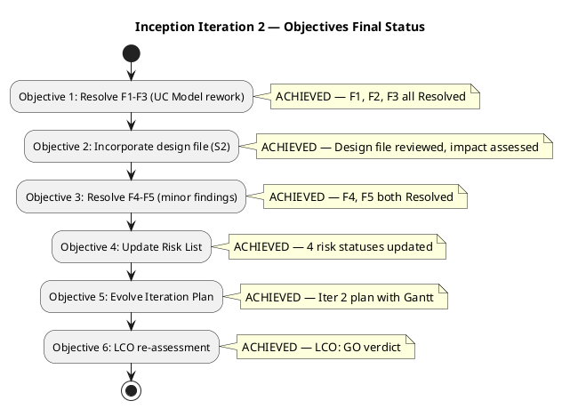
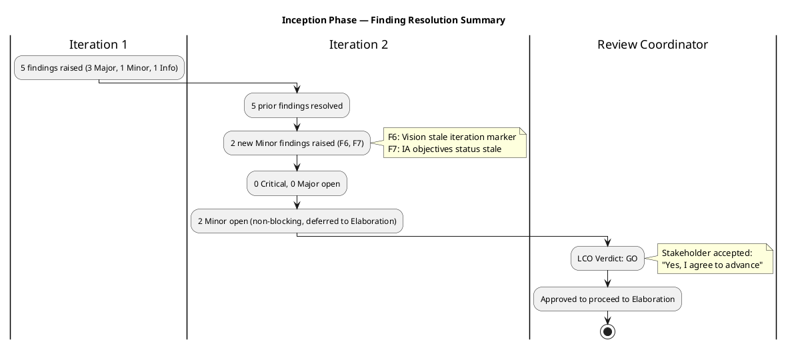
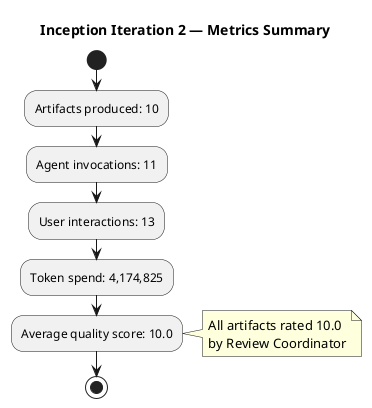

## Document Control

| Field | Value |
|---|---|
| Phase | Inception |
| Status | Approved |
| Iteration | 2 (Cycle 1) |
| Milestone Target | End of Inception (LCO) |
| Author | Project Manager |
| Assessment Date | 2026-07-17 |
| Prior Assessment | Iteration 1 (2026-07-07) — LCO: iteration REQUIRED |
| Review Coordinator Verdict | **LCO: GO — Approved to proceed to Elaboration** |
| Stakeholder Acceptance | "Yes, I agree to advance to the next phase. It has been an excellent job" |

## Iteration Objectives Reached

### Objectives Status Summary

This iteration was a **corrective iteration** triggered by 3 open Major findings (F1–F3) and 1 Minor finding (F4) at the LCO review of Iteration 1. The Review Coordinator's LCO verdict was **iteration REQUIRED**. All 6 corrective objectives have been achieved. The LCO milestone has been approved.

### Objective Detail

| # | Objective | Status | Evidence |
|---|---|---|---|
| 1 | Resolve F1–F3 (UC Model rework) | **ACHIEVED** | F1: `[DERIVED]` removed from UC-002 (Read News) — stakeholder S1 confirmed process. F2: `[DERIVED]` removed from UC-003 (Employee Directory) — stakeholder S1 confirmed process. F3: AD Authentication refactored from standalone UCs (UC-004/UC-007) to Supplementary Specification constraint with `<<include>>` per Scope Guard Rule 7. All three findings verified Resolved by Reviewer. |
| 2 | Incorporate stakeholder design file (S2) | **ACHIEVED** | UI Designer reviewed `employee-portal-design.html` (tasks T5/T6). Software Architect assessed SAD impact (task T7). Design file incorporated into architectural and UI planning baseline. RISK-T05 status updated to Active with mitigation in progress. |
| 3 | Resolve F4–F5 (minor findings) | **ACHIEVED** | F4: Test Manager updated TES coverage table after UC renumbering — AD auth now cross-cutting test concern (ACT-003). F5: Software Architect verified SAD artifact type registration in Development Case. Both verified Resolved. |
| 4 | Update Risk List | **ACHIEVED** | 4 risk statuses updated: RISK-T03 (Identified → Mitigation Planned), RISK-R01 (Identified → Mitigation Planned), RISK-S02 (Identified → Mitigation Planned), RISK-T05 (Identified → Active). All mitigations remain valid post-rework. |
| 5 | Evolve Iteration Plan | **ACHIEVED** | Iteration Plan evolved with Iteration 2 corrective Gantt (14 tasks, T1–T14), coarse roadmap updated with 7-iteration distribution [2, 2, 2, 1], agent role assignment profile updated for Iteration 2 (5 concurrent roles). |
| 6 | LCO re-assessment | **ACHIEVED** | Review Coordinator issued LCO verdict: **GO — Approved to proceed to Elaboration**. Stakeholder accepted: "Yes, I agree to advance to the next phase." 0 Critical, 0 Major findings open. 2 Minor findings (F6, F7) deferred to early Elaboration as non-blocking. |

### Inception Phase Objectives (Cross-Iteration)

| Inception Objective | Status | Evidence |
|---|---|---|
| Identify Critical Risks | **Met** | 9 risks identified across Technical, Schedule, and External categories. 2 High-magnitude (RISK-T01 RPN 63, RISK-T03 RPN 48). Mitigation strategies defined for all. AD integration spike scheduled for Elaboration Iter 1. |
| Establish Feasibility | **Met** | SAD defines architecture candidate (3-layer: Presentation → Application → Infrastructure). Offline sync strategy (local queue + timestamp merge) addresses RISK-T01. AD integration path (LDAP/OAuth2) identified with fallback. Stakeholder confirmed viability. |
| Define Project Scope | **Partially Met** | Vision, UC Model, and Supplementary Specification define scope. UC-001 through UC-006 cover all declared use cases. AD auth correctly modeled as Supplementary Spec constraint. Scope exclusions documented (no mobile app, no payroll, no biometric). Minor gap: F6 (Vision iteration marker) deferred. |
| Tailor Development Process | **Partially Met** | Development Case published with artifact tailoring, CI/CD strategy (IARI branching), and phase-specific depth. 7-iteration roadmap established. Minor gap: F5 (SAD artifact type) resolved; F6 deferred. Process is sufficient for Elaboration entry. |

## Adherence to Plan

### Planned vs. Actual

| Plan Element | Planned | Actual | Variance |
|---|---|---|---|
| Iteration duration | 1.5 weeks (Jul 8 – Jul 17) | 1.5 weeks (Jul 8 – Jul 17) | **None** — on schedule |
| Tasks completed | 14 (T1–T14) | 14 (T1–T14) | **None** — all tasks completed |
| Major findings resolved | 3 (F1–F3) | 3 (F1–F3) | **None** — all resolved and verified |
| Minor findings resolved | 2 (F4–F5) | 2 (F4–F5) | **None** — all resolved and verified |
| New findings raised | 0 expected | 2 (F6, F7 — Minor) | **+2 Minor** — documentation hygiene, non-blocking |
| LCO milestone | GO target | **GO achieved** | **None** — milestone approved |
| Agent roles active | 5 (SA, UI, Arch, TM, PM) | 5 (SA, UI, Arch, TM, PM) | **None** — as planned |
| Token budget | — | 4,174,825 tokens | Within expected range for corrective iteration |

### Schedule Adherence Assessment

The iteration completed on schedule with no slippage. All 14 planned tasks were completed within the 1.5-week time-box. The corrective iteration successfully resolved all Major and Minor findings from Iteration 1 without requiring scope reduction or additional iterations. Two new Minor findings (F6, F7) were raised during the re-review but classified as non-blocking documentation hygiene — deferred to early Elaboration for closure.

## Use Cases and Scenarios Implemented

No use cases were implemented in code this iteration — Inception phase focuses on analysis and planning, not implementation. The Use-Case Model was evolved to correct findings:

| Use Case | Iteration 1 Status | Iteration 2 Change | Final Status |
|---|---|---|---|
| UC-001 (Clock In/Out) | Defined | No change — already correct | Defined, stable |
| UC-002 (Read News) | Defined with `[DERIVED]` marker | `[DERIVED]` removed (F1 resolved) — stakeholder S1 confirmed | Defined, stable |
| UC-003 (Employee Directory) | Defined with `[DERIVED]` marker | `[DERIVED]` removed (F2 resolved) — stakeholder S1 confirmed | Defined, stable |
| UC-004 (AD Authentication) | Standalone UC | Refactored to Supplementary Spec constraint (F3 resolved) — `<<include>>` from all UCs | Removed as UC; now REQ-001–REQ-003 |
| UC-005 (Publish News) | Defined | Renumbered after UC-004 removal | Defined, stable |
| UC-006 (Manage Directory) | Defined | Renumbered after UC-004 removal | Defined, stable |
| UC-007 (AD Admin) | Standalone UC | Removed (F3 resolved) — folded into Supplementary Spec | Removed |

## Results Relative to Evaluation Criteria

### Finding Resolution Summary

### Acceptance Criteria Coverage

| Acceptance Criterion | Inception Evidence | Elaboration/Construction Plan |
|---|---|---|
| AC-1: Employee clocks in/out without HR help | UC-001 defined with full flow; SAD defines offline sync architecture | Construction Iter 1: implement UC-001 + offline sync |
| AC-2: HR publishes news without technical assistance | UC-005 (Publish News) defined; design file provides UI baseline | Construction Iter 1: implement UC-002 + UC-005 |
| AC-3: Employee finds colleague in under 10 seconds | UC-003 defined with search by name/department/office; performance REQ-008 (page load < 3s) | Construction Iter 2: implement UC-003 + UC-006 |
| AC-4: 80% employees clock with no prior training | UC-001 flow is single-button; RISK-S02 mitigation includes UX simplicity | Transition: adoption tracking against 80% target |
| AC-5: System works temporarily offline (5 min) | SAD defines local queue + sync-on-restore; RISK-T01 (RPN 63) mitigation planned | Elaboration Iter 1: PoC for offline sync + AD integration |

## Test Results

No test execution occurred in Inception — this phase focuses on test strategy formulation. The Test Evaluation Summary (TES) was evolved in Iteration 2 to resolve F4:

| TES Element | Iteration 2 Change |
|---|---|
| Coverage table | Updated to reflect UC renumbering after UC-004/UC-007 removal |
| AD auth test strategy | Refactored from standalone UC test to cross-cutting concern (ACT-003) integrated into all UC test scenarios |
| Test risks | 4 testing risks identified (RISK-T01, T03, T04, R01) with coverage priorities |
| Defect lifecycle | Defined via SCM Issue Tracker with CCM labels |
| Phase test strategy | Elaboration: PoC testing; Construction: functional + integration; Transition: UAT + adoption |

## External Changes

| Change | Source | Impact | Disposition |
|---|---|---|---|
| Stakeholder design file (`employee-portal-design.html`) | S2 — stakeholder input | UI design baseline established; SAD and UC Model assessed for impact | Incorporated — RISK-T05 status updated to Active; design file reviewed by UI Designer and Software Architect |
| Stakeholder confirmation of UC-002 and UC-003 processes | S1 — stakeholder input | `[DERIVED]` markers on UC-002 and UC-003 can be removed | Applied — F1 and F2 resolved |
| AD authentication method (LDAP vs OAuth2) | Open question from Inception | Architecture must support both paths; decision deferred to Elaboration spike | Tracked as RISK-T02 (RPN 35) — spike scheduled for Elaboration Iter 1 with Miguel Torres |

## Rework Required

### Open Findings Deferred to Elaboration

| Finding | Severity | Artifact | Description | Owner | Target |
|---|---|---|---|---|---|
| F6 | Minor | Vision | Stale iteration marker "Iteration: 1" in Document Control | System Analyst | Early Elaboration Iter 1 |
| F7 | Minor | Iteration Assessment | Objectives 1–3 showed "IN PROGRESS" but work is complete | Project Manager | **Resolved this assessment** — objectives updated to ACHIEVED |

**F7 Resolution:** This Iteration Assessment update corrects the stale objective statuses. All 6 objectives now reflect their actual ACHIEVED status as of the LCO GO verdict on 2026-07-17.

### Rework Carried Forward from Inception to Elaboration

| Item | Rationale | Elaboration Action |
|---|---|---|
| AD auth method decision (LDAP vs OAuth2) | RISK-T02 (RPN 35) — method undecided, Stability: Low | Elaboration Iter 1 spike with Miguel Torres; fallback to local auth |
| Offline sync PoC | RISK-T01 (RPN 63) — highest magnitude risk; architecture defined but unvalidated | Elaboration Iter 1: build executable PoC for local queue + sync-on-restore |
| AD schema mapping audit | RISK-R01 (RPN 30) — employee attributes may not map cleanly | Elaboration Iter 1: coordinate with Miguel Torres for AD schema review |
| Design file full integration | RISK-T05 — design file reviewed but full UI design pending | Elaboration: UI Designer produces mockups from design file baseline |

## Metrics

### Iteration 2 Metrics Summary

### Measurement Goals

| Metric | Value | Measurement Goal | Decision Enabled |
|---|---|---|---|
| Artifacts produced | 10 | Evaluate completeness of Inception deliverable set | Confirm all DC-sanctioned artifacts exist before LCO gate |
| Agent invocations | 11 | Monitor process efficiency — invocations per artifact | Baseline for Elaboration iteration planning (expect higher due to implementation) |
| User interactions | 13 | Track stakeholder engagement frequency | Confirm active stakeholder participation — 13 interactions across 2 iterations indicates strong engagement |
| Token spend | 4,174,825 | Monitor resource consumption against project budget | Establish Inception baseline; Elaboration expected to increase due to PoC and design work |
| Average quality score | 10.0 | Evaluate artifact quality as assessed by Review Coordinator | Confirms Inception artifacts meet quality bar — no quality-driven rework needed for Elaboration entry |

### Cross-Iteration Comparison

| Metric | Iteration 1 | Iteration 2 | Trend |
|---|---|---|---|
| Artifacts | 10 (initial) | 10 (evolved) | Stable — corrective iteration evolved existing artifacts, no new artifacts |
| Findings raised | 5 (3 Major, 1 Minor, 1 Info) | 2 (2 Minor) | **Improving** — severity and count down |
| Findings resolved | 0 | 5 (all prior) + F7 | **Resolved** — all Major cleared |
| LCO verdict | Iteration REQUIRED | GO | **Milestone achieved** |
| Quality score | — | 10.0 | **Excellent** — all artifacts at maximum quality |

## Lessons Learned

| # | Lesson | Source | Applicability |
|---|---|---|---|
| 1 | `[DERIVED]` markers require precision — over-application causes rework (F1, F2) | Iteration 1 findings | All future UC modeling — apply Rule 6 strictly: only mark as `[DERIVED]` when STK does not verbatim describe the process |
| 2 | Cross-cutting technical mechanisms must not be modeled as standalone UCs (F3) | Iteration 1 findings | All future analysis — auth, sync, logging belong in Supplementary Spec with `<<include>>` |
| 3 | Corrective iterations are effective — 1.5 weeks resolved all Major findings without scope reduction | Iteration 2 execution | Future iterations: if findings require rework, time-box the correction rather than expanding scope |
| 4 | Stakeholder engagement is critical — S1/S2 inputs unblocked F1/F2 resolution and design file incorporation | Iteration 2 stakeholder interactions | Maintain 13+ interactions per iteration cadence in Elaboration |
| 5 | Documentation hygiene findings (F6, F7) accumulate when artifacts evolve across iterations — section-level updates must refresh ALL metadata | Iteration 2 new findings | Always update Document Control and status fields when evolving artifacts via section updates |

## Next Iteration Adjustments

### Elaboration Iteration 1 Plan Adjustments

| Adjustment | Rationale | Source |
|---|---|---|
| Prioritize offline sync PoC as first task | RISK-T01 (RPN 63) is highest magnitude risk — must be retired early | Risk List |
| Schedule AD integration spike with Miguel Torres | RISK-T02 (RPN 35) and RISK-R01 (RPN 30) require early validation | Risk List |
| Close F6 (Vision iteration marker) in first task batch | Non-blocking but should be cleared immediately | Review Record |
| Increase Software Architect role intensity to High | Elaboration is architecture-centric — PoC and baseline demand full attention | Agent role profile |
| Add DatabaseDesigner role (Medium) | Data model design begins in Elaboration | Agent role profile |
| Maintain ProjectManager at Medium | Monitoring and risk tracking continue; less intensive than Inception | Agent role profile |

### Scope for Elaboration Iteration 1

| Work Item | Use Case / Risk | Priority |
|---|---|---|
| Offline sync PoC (local queue + timestamp merge) | UC-001, RISK-T01, RISK-T03 | **Critical** |
| AD integration spike (LDAP/OAuth2) | RISK-T02, RISK-R01 | **Critical** |
| Architecture baseline finalization | All UCs | **High** |
| Data model design (PostgreSQL schema) | UC-001, UC-002, UC-003 | **High** |
| UI mockups from design file baseline | UC-001, UC-002, UC-003 | **Medium** |
| F6 closure (Vision Document Control update) | F6 | **Low** (first task batch) |

## Traceability

| Element | Traces From | Link Type | Traces To |
|---|---|---|---|
| Iteration Assessment (Iter 2) | Iteration Plan (Inception Iter 2) | Derives | Iteration Plan (Elaboration Iter 1) |
| Objectives Status | Iteration Plan § Iteration Objectives | Derives | Risk List (status updates), Elaboration Iter 1 Plan |
| Findings F1–F3 | Review Record § Findings | Derives | Use Case Model (rework — resolved), Supplementary Specification (AD Auth refactor — resolved) |
| Finding S2 | Review Record § Stakeholder Findings | Derives | SAD (design file impact — resolved), RISK-T05 (status update) |
| Finding F4 | Review Record § Findings | Derives | Test Evaluation Summary (coverage table — resolved) |
| Finding F5 | Review Record § Findings | Derives | Software Architecture Document (artifact type — resolved) |
| Finding F6 | Review Record § Findings (Iter 2) | Derives | Vision (Document Control — deferred to Elaboration) |
| Finding F7 | Review Record § Findings (Iter 2) | Derives | Iteration Assessment (this update — resolved) |
| Metrics | Iteration facts (injected) | Derives | Elaboration Iter 1 Plan (velocity baseline) |
| Lessons Learned | Review Record, Stakeholder Input | Derives | Organization memory (process improvement) |
| LCO Verdict | Review Coordinator milestone assessment | Derives | Elaboration phase entry |
| Acceptance Criteria | Vision (5 ACs) | Derives | Elaboration/Construction test plans, Transition UAT |