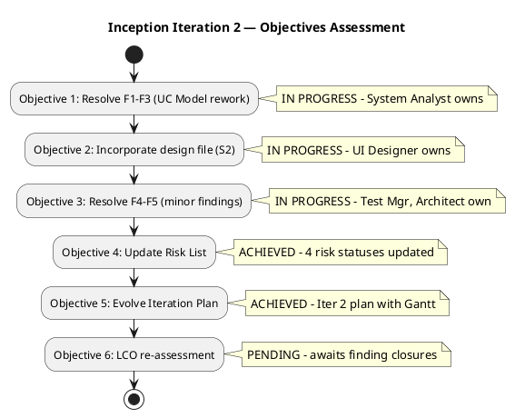
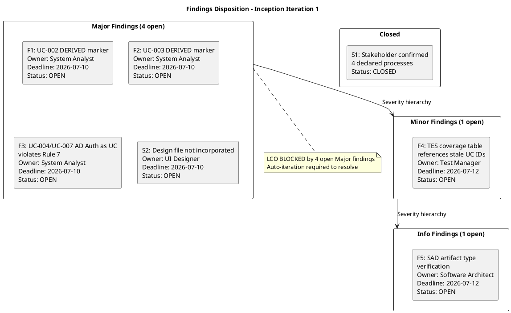
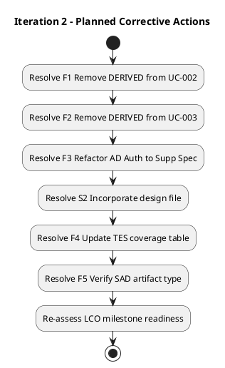
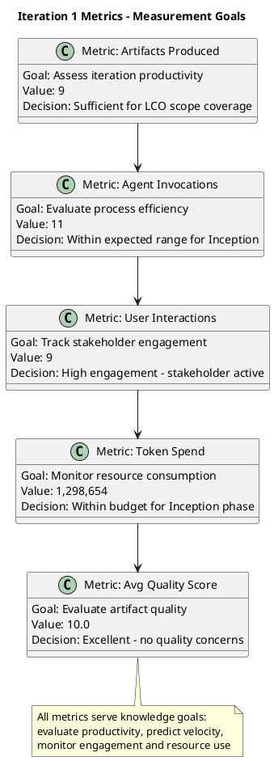

## Document Control
| Field | Value |
|---|---|
| Phase | Inception |
| Status | Draft |
| Iteration | 2 (Cycle 1) |
| Milestone Target | End of Inception (LCO) |
| Author | Project Manager |
| Assessment Date | 2026-07-14 (projected) |
| Prior Assessment | Iteration 1 (2026-07-07) — LCO: iteration REQUIRED |
| Review Coordinator Verdict | Pending — LCO re-review scheduled 2026-07-17 |
## Iteration Objectives Reached
### Objectives Status Summary

This iteration is a **corrective iteration** triggered by 4 open Major findings at the LCO review of Iteration 1. The Review Coordinator's LCO verdict was **iteration REQUIRED**. This assessment tracks the progress of Iteration 2 against its 6 corrective objectives.

### Objective Detail

| # | Objective | Status | Evidence |
|---|---|---|---|
| 1 | Resolve F1–F3 (UC Model rework) | **IN PROGRESS** | System Analyst owns F1 (remove [DERIVED] from UC-002), F2 (remove [DERIVED] from UC-003), F3 (refactor AD Auth UC-004/UC-007 to Supplementary Spec). Stakeholder confirmation S1 received — markers can be removed. |
| 2 | Incorporate design file (S2) | **IN PROGRESS** | UI Designer tasks T5/T6 assigned to review `employee-portal-design.html` and assess impact on UC Model, Design Model, SAD. Software Architect task T7 assigned for SAD impact. |
| 3 | Resolve F4–F5 (minor findings) | **IN PROGRESS** | F4 (TES coverage table update) depends on T4 (UC renumbering completion). F5 (SAD artifact type verification) assigned to Software Architect. |
| 4 | Update Risk List | **ACHIEVED** | 4 risk statuses updated: RISK-T03 → Mitigation Planned, RISK-R01 → Mitigation Planned, RISK-S02 → Mitigation Planned, RISK-T05 → Active. All 9 risks have current status reflecting iteration 2 progress. |
| 5 | Evolve Iteration Plan | **ACHIEVED** | Iteration Plan updated for Iteration 2 with 14 tasks, Gantt schedule, agent role assignments, and LCO re-review evaluation criteria. |
| 6 | LCO re-assessment | **PENDING** | Awaits closure of F1–F3, S2 by owning roles. LCO re-review scheduled 2026-07-17. |
## Adherence to Plan

### Planned vs. Actual

| Plan Element | Planned | Actual | Variance |
|---|---|---|---|
| Artifacts produced | 8 (per Iteration Plan) | 9 (including Review Record) | +1 (Review Record added by review process) |
| Use Case Model status | Complete, no findings | 3 Major findings open | Negative — rework required |
| Risk List status | Complete | Complete, 0 findings | On plan |
| Architecture candidate | Delivered | Delivered, 1 Info finding | On plan (minor) |
| LCO milestone | Target: 2026-07-17 | NOT achieved | Blocked by 4 Major findings |
| Token budget | — | 1,298,654 tokens spent | Within Inception allocation |

### Root Cause of Variance

The primary variance is the **Use Case Model** carrying 3 Major findings:

1. **F1 (UC-002):** The `[DERIVED — from STK-004]` marker on UC-002 (Read News) should not have been applied — the stakeholder declaration verbatim describes HR publishing news, making this a literal declaration, not a derivation. The System Analyst applied the derivation marker conservatively but incorrectly.

2. **F2 (UC-003):** Same pattern — UC-003 (Employee Directory) carries `[DERIVED — from STK-001]` but the declared scope describes employee searching for colleagues. Literal declaration, not derivation.

3. **F3 (UC-004/UC-007):** Active Directory authentication was decomposed as standalone use cases (UC-004, UC-007), violating Scope Guard Rule 7 — cross-cutting technical mechanisms (auth, sync, logging) belong in the Supplementary Specification with `<<include>>` from dependent UCs, never as separate UCs.

4. **S2 (Design file):** Stakeholder identified `docs/inputs/employee-portal-design.html` mid-iteration. This design file was not in the initial scope inputs and was not incorporated into UI/UX artifacts. This is a scope input gap, not a production defect.

**Stakeholder confirmation (S1):** The stakeholder confirmed on 2026-07-07 that the 4 declared processes are correct, which resolves the `[DERIVED]` confirmation requirement for F1 and F2. The markers can be removed.

## Use Cases and Scenarios Implemented

No use cases were implemented in code this iteration — Inception phase produces analysis and design artifacts, not executable increments. The Use Case Model (UC-001 through UC-007) was authored but requires rework per findings F1-F3.

| UC ID | Use Case | Status | Findings |
|---|---|---|---|
| UC-001 | Clock In/Out | Draft — no findings | — |
| UC-002 | Read News | Draft — F1 (Major) | `[DERIVED]` marker to remove |
| UC-003 | Employee Directory | Draft — F2 (Major) | `[DERIVED]` marker to remove |
| UC-004 | AD Authentication | Draft — F3 (Major) | Refactor to Supp Spec per Rule 7 |
| UC-005–UC-007 | (To be renumbered) | Draft — F3 (Major) | Affected by AD Auth refactor |

## Results Relative to Evaluation Criteria

### Findings Disposition Summary

### Acceptance Criteria Progress

| Acceptance Criterion | Source | Status | Evidence |
|---|---|---|---|
| Employee can clock in/out without HR help | AC-1 (UC-001) | Not yet testable | UC-001 drafted; no code produced |
| HR can publish news without technical assistance | AC-2 (UC-002) | Not yet testable | UC-002 drafted; F1 open |
| Employee finds colleague phone/email in <10s | AC-3 (UC-003) | Not yet testable | UC-003 drafted; F2 open |
| 80% employees complete clocking with no training | AC-4 (UC-001) | Not yet testable | Deferred to Transition UAT |
| System works temporarily offline | AC-5 (NFR) | Architecture addressed | SAD includes offline sync strategy; PoC deferred to Elaboration |

## Test Results

No test execution occurred this iteration — Inception phase focuses on test strategy, not execution. The Test Evaluation Summary (TES) established:

- Evaluation mission and test scope defined
- 7 use cases mapped to coverage priorities (P1–P3)
- 6 testing risks identified from risk register
- Defect lifecycle defined via SCM Issue Tracker
- Test strategy by phase drafted (Elaboration PoC → Construction → Transition UAT)

**Finding F4 (Minor):** TES coverage table references UC-004/UC-005/UC-006/UC-007 which may be renumbered after F1–F3 corrections. Test Manager to update after UC model rework.

## External Changes

| Change | Source | Date | Impact |
|---|---|---|---|
| Design file `employee-portal-design.html` introduced | Stakeholder (S2) | 2026-07-07 | UI Designer and Software Architect must review and incorporate into Design Model and SAD. New scope input, not a change request. |
| Stakeholder confirmed 4 declared processes | Stakeholder (S1) | 2026-07-07 | Resolves `[DERIVED]` confirmation for F1, F2. Markers can be removed. |

## Rework Required

### Rework Items for Iteration 2 (Cycle 2)

| Finding | Rework Action | Owner | Priority | Blocks LCO? |
|---|---|---|---|---|
| F1 (Major) | Remove `[DERIVED]` marker from UC-002 — stakeholder confirmed literal declaration (S1) | System Analyst | P1 | Yes |
| F2 (Major) | Remove `[DERIVED]` marker from UC-003 — stakeholder confirmed literal declaration (S1) | System Analyst | P1 | Yes |
| F3 (Major) | Refactor UC-004/UC-007 (AD Authentication) into Supplementary Specification entry with `<<include>>` from UC-001, UC-002, UC-003. Renumber remaining UCs. | System Analyst | P1 | Yes |
| S2 (Major) | Review `docs/inputs/employee-portal-design.html`; incorporate into Design Model and SAD. UI Designer evaluates impact on Use Case Model. | UI Designer | P1 | Yes |
| F4 (Minor) | Update TES coverage table after UC model renumbering | Test Manager | P2 | No |
| F5 (Info) | Verify SAD artifact type registration | Software Architect | P3 | No |

### Scope Adjustment for Iteration 2

Iteration 2 (Cycle 2) scope is **corrective rework only** — no new features, no new use cases, no new requirements. The iteration is time-boxed to resolve the 4 open Major findings and re-gate LCO. Per the Scope/Schedule/Parallelism trade-off: scope is reduced (no new work) to protect the LCO milestone schedule.

### Risk List Updates

No new risks identified during this assessment. Existing risks remain valid. The following risk status updates are recommended:

| Risk ID | Update | Rationale |
|---|---|---|
| RISK-T01 (Offline sync, RPN 63) | Status: Identified → Mitigation planned | SAD addresses strategy; PoC deferred to Elaboration |
| RISK-T02 (AD auth method undecided, RPN 35) | Status: Identified → Spike scheduled | Elaboration spike with Miguel Torres confirmed |
| RISK-S01 (Scope creep) | Status: Active | S2 design file introduction is a scope input, not creep — but must be managed |

## Metrics

### Iteration 1 Measurement Summary

| Metric | Goal (Decision Enabled) | Value | Assessment |
|---|---|---|---|
| Artifacts produced | Evaluate iteration productivity — decide whether scope was ambitious enough | 9 | Sufficient for Inception scope; 8 planned + 1 Review Record |
| Agent invocations | Evaluate process efficiency — decide whether agent role assignment needs adjustment | 11 | Within expected range for 6-role Inception team |
| User interactions | Track stakeholder engagement — decide whether additional stakeholder sessions are needed | 9 | High engagement; stakeholder actively confirmed scope (S1) and provided design input (S2) |
| Token spend | Monitor resource consumption — decide whether to adjust iteration intensity | 1,298,654 | Within Inception allocation (~10% of project budget per rubber profile) |
| Avg quality score | Evaluate artifact quality — decide whether review process is effective | 10.0 | Excellent; no quality concerns despite scope findings (findings are scope-guard violations, not quality defects) |

### Lessons Learned

1. **Derivation markers require precision:** The `[DERIVED]` marker should only be applied when the stakeholder declaration does NOT verbatim describe the UC process. Conservative over-application of `[DERIVED]` creates unnecessary rework. Lesson: when the declared scope text describes the process, it is a literal declaration — no marker needed.

2. **Cross-cutting mechanisms are never UCs:** AD Authentication was decomposed as UC-004/UC-007, violating Rule 7. This is a recurring pattern risk — any cross-cutting technical mechanism (auth, sync, logging, audit) must be a Supplementary Specification entry with `<<include>>` from dependent UCs.

3. **Design inputs must be captured at iteration start:** The `employee-portal-design.html` file was introduced mid-iteration by the stakeholder. Earlier discovery would have allowed the UI Designer to incorporate it during the same iteration. Lesson: scan for all input files at iteration kickoff.

4. **Stakeholder confirmation resolves derivation uncertainty:** The stakeholder's S1 confirmation that 4 declared processes are correct immediately resolved F1 and F2. Early stakeholder validation of derivations prevents deferred rework.

## Traceability

| Element | Traces From | Link Type | Traces To |
|---|---|---|---|
| Iteration Assessment | Iteration Plan (Inception Iteration 1) | Derives | Iteration Plan (Iteration 2 Cycle 2) |
| Objectives Status | Iteration Plan § Iteration Objectives | Derives | Risk List (status updates) |
| Findings F1–F3 | Review Record § Findings | Derives | Use Case Model (rework), Supplementary Specification (AD Auth refactor) |
| Finding S2 | Review Record § Stakeholder Findings | Derives | Design Model, SAD (design file incorporation) |
| Finding F4 | Review Record § Findings | Derives | Test Evaluation Summary (coverage table update) |
| Finding F5 | Review Record § Findings | Derives | Software Architecture Document (artifact type) |
| Metrics | Iteration facts (injected) | Derives | Iteration Plan (Iteration 2 velocity baseline) |
| Lessons Learned | Review Record, Stakeholder Input | Derives | Organization memory (process improvement) |
| LCO Verdict | Review Coordinator milestone assessment | Derives | Iteration 2 Plan (corrective scope) |