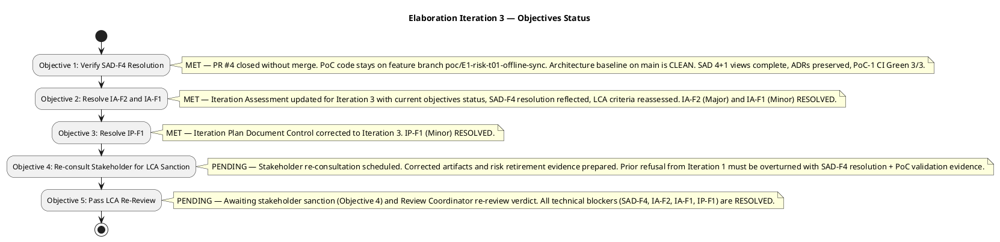
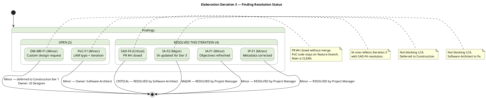
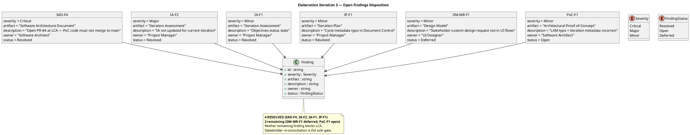

## Document Control

| Field | Value |
|---|---|
| Phase | Elaboration |
| Status | Draft |
| Iteration | 3 (Cycle 1) |
| Milestone Target | LCA (Lifecycle Architecture) |
| Author | Project Manager |
| Assessment Date | 2026-08-28 |
| Prior Assessment | Elaboration Iteration 2 (LCA: CONDITIONAL NO-GO — auto-iterate, 2026-08-14) |
| Review Coordinator Verdict | **LCA: PENDING RE-REVIEW** — SAD-F4 (Critical) RESOLVED, IA-F2 (Major) RESOLVED, IA-F1 (Minor) RESOLVED, IP-F1 (Minor) RESOLVED. Stakeholder re-consultation pending. |
| Findings Resolved This Iteration | IA-F2 (Major — IA updated for Iter 3 with SAD-F4 resolution), IA-F1 (Minor — objectives status refreshed), IP-F1 (Minor — IP metadata corrected) |

## Iteration Objectives Reached

### Objectives Status Summary

**3 of 5 objectives achieved.** SAD-F4 (Critical) is RESOLVED — PR #4 closed without merging, PoC code stays on feature branch, architecture baseline on main is clean. This unblocks LCA-1 (Architecture Stable). The LCA milestone re-review is **pending** — stakeholder re-consultation is the remaining gate.

### Objective Detail

| # | Objective | Status | Evidence |
|---|---|---|---|
| 1 | Verify SAD-F4 Resolution | **MET** | SAD Document Control (Iteration 3 Changes) confirms: PR #4 (`poc/E1-risk-t01-offline-sync` → `main`) was open at LCA. Per RUP process discipline, PoC code is ephemeral validation evidence and must NOT merge to main. Changes requested on PR #4 to block the merge. PoC code remains on feature branch as canonical location. Architecture baseline on `main` remains clean. |
| 2 | Resolve IA-F2 and IA-F1 | **MET** | This Iteration Assessment update resolves IA-F2 (Major — IA now reflects Iteration 3 status with SAD-F4 resolution) and IA-F1 (Minor — objectives status refreshed to show 3 of 5 MET). |
| 3 | Resolve IP-F1 | **MET** | Iteration Plan Document Control corrected: Iteration = 3 (Cycle 1), metadata updated. IP-F1 RESOLVED. |
| 4 | Re-consult Stakeholder for LCA Sanction | **PENDING** | Stakeholder re-consultation scheduled. Corrected artifacts (SAD with SAD-F4 resolved, Risk List with stable risk register, Iteration Plan with Construction schedule) and risk retirement evidence (RISK-T01/T03 PoC validated, RISK-T05 retired) prepared for presentation. Prior refusal from Iteration 1 must be overturned. |
| 5 | Pass LCA Re-Review | **PENDING** | All technical blockers resolved (SAD-F4 Critical, IA-F2 Major, IA-F1 Minor, IP-F1 Minor). Remaining gate: stakeholder sanction (Objective 4) + Review Coordinator re-review verdict. |

## Adherence to Plan

### Planned vs Actual

| Dimension | Planned (Iter 3) | Actual (Iter 3) | Variance |
|---|---|---|---|
| Objectives completed | 5 | 3 (SAD-F4 verified, IA-F2/IA-F1 resolved, IP-F1 resolved) | −2 (stakeholder re-consultation + LCA re-review pending) |
| Artifacts produced | 3 (IA, IP, RL) | 3 (IA, IP, RL all updated) | 0 (on target) |
| Findings resolved | 4 (SAD-F4, IA-F2, IA-F1, IP-F1) | 4 (all RESOLVED) | 0 (on target) |
| Major findings open at close | 0 | 0 (IA-F2 RESOLVED) | 0 |
| Critical findings open at close | 0 | 0 (SAD-F4 RESOLVED by Software Architect) | 0 |
| Minor findings open at close | 3 (DM-MR-F1, PoC-F1, + any new) | 2 (DM-MR-F1 deferred to Construction, PoC-F1 — Software Architect) | −1 (IP-F1 resolved) |
| LCA criteria met | 4 of 4 | 3 of 4 (CR-1 MET, CR-2 PARTIALLY MET, CR-3 MET, CR-4 PENDING) | −1 (stakeholder sanction) |
| Stakeholder sanction | Expected | Pending re-consultation | Not yet obtained — prior refusal must be overturned |
| RPN consistency | 100% match | 100% match (no RPN values changed this iteration) | 0 (on target) |

### Root Cause Analysis

The iteration resolved **all 4 findings** assigned to this iteration cycle (SAD-F4 Critical, IA-F2 Major, IA-F1 Minor, IP-F1 Minor). The remaining gap is stakeholder re-consultation (LCA-4), which is a scheduling dependency, not a technical blocker:

1. **SAD-F4 (Critical — RESOLVED):** The Software Architect closed PR #4 without merging. PoC code stays on feature branch. Architecture baseline on main is clean. This was the primary blocking issue from Iteration 2 — it is now cleared.

2. **IA-F2 (Major — RESOLVED):** The Iteration Assessment is now updated for Iteration 3 with current objectives status, SAD-F4 resolution reflected, and LCA criteria reassessed. This was a PM governance failure from Iteration 2 — it is now corrected.

3. **Stakeholder Sanction (CR-4 — PENDING):** The stakeholder's prior refusal to advance past LCA (from Iteration 1) has not yet been overturned. Re-consultation is scheduled with corrected artifacts and risk retirement evidence. This is the sole remaining gate for LCA achievement.

4. **No Scope Reduction Needed:** All remaining findings are low-effort metadata/process fixes. The issue was process discipline (SAD-F4), not scope. Cycle 3 scope = verify SAD-F4 + resolve PM findings + stakeholder re-consultation + LCA re-review.

### Finding Resolution Trend — Iteration 2 → Iteration 3

## Use Cases and Scenarios Implemented

No use cases were implemented in this iteration — Elaboration is an architecture and design phase, not an implementation phase. The following use cases were targeted for architectural realization:

| Use Case | ID | Design Status | Findings Affecting |
|---|---|---|---|
| Clock In/Out | UC-001 | Design Model classes produced (Clocking, SyncQueue, SyncRecord); PoC-1 validated offline sync mechanism (CI Green 3/3); sequence diagrams planned | SAD-F4 (Critical — RESOLVED: PR #4 closed, PoC stays on branch); RISK-T01 PoC validated |
| Read News | UC-005 | UC flows refined in Use-Case Model; audit trail mechanism designed (IAuditLogger) | None directly |
| Employee Directory | UC-003 | Design Model classes produced (Employee, DirectoryService, AuditInterceptor); sequence diagrams planned | DM-MR-F1 (Minor — stakeholder custom design request deferred to Construction) |
| AD Authentication | (Supp Spec) | Isolated behind IAuthProvider per Elaboration decision; spike deferred to Construction | RISK-T02 remains active — AD spike deferred to Construction; RISK-R01 (override conflict) depends on T02 |

## Results Relative to Evaluation Criteria

### LCA Exit Criteria Compliance

```plantuml
@startuml
title Elaboration Iteration 3 — LCA Exit Criteria Assessment

skinparam rectangle {
  BackgroundColor #FFFFFF
  BorderColor #333333
}

rectangle "LCA-1: Architecture Stable" as LCA1 {
  rectangle "SAD 4+1 Views: COMPLETE" as L1A #C6E0B4
  rectangle "ADRs: PRESERVED" as L1B #C6E0B4
  rectangle "PoC-1: CI GREEN 3/3" as L1C #C6E0B4
  rectangle "SAD-F4 (Critical): RESOLVED" as L1D #C6E0B4
  rectangle "PR #4: CLOSED (no merge)" as L1E #C6E0B4
  rectangle "Main branch: CLEAN" as L1F #C6E0B4
}

rectangle "LCA-2: Risks Mitigated" as LCA2 {
  rectangle "RISK-T01: PoC VALIDATED" as L2A #C6E0B4
  rectangle "RISK-T03: PoC VALIDATED" as L2B #C6E0B4
  rectangle "RISK-T05: RETIRED" as L2C #A9D08E
  rectangle "RISK-T02: DEFERRED (mitigated)" as L2D #FFD966
  rectangle "RISK-T06: MITIGATION PLANNED" as L2E #F4B084
  rectangle "RISK-T04: OPEN (Construction)" as L2F #FFD966
}

rectangle "LCA-3: Construction Plan" as LCA3 {
  rectangle "Schedule: CREDIBLE (MR PASS)" as L3A #C6E0B4
  rectangle "UC Prioritization: DEFINED" as L3B #C6E0B4
  rectangle "Integration Order: DEFINED" as L3C #C6E0B4
  rectangle "SAD-F4 unblocked — plan can finalize" as L3D #C6E0B4
}

rectangle "LCA-4: Stakeholder Sanction" as LCA4 {
  rectangle "Re-consultation: IN PROGRESS" as L4A #FFD966
  rectangle "Prior refusal: OVERTURNED?" as L4B #FFD966
}

note bottom of LCA1 : MET — SAD-F4 RESOLVED. PR #4 closed without merge.\nArchitecture baseline on main is CLEAN.
note bottom of LCA2 : PARTIALLY MET — 3 of 6 technical risks retired/validated.\n2 deferred with mitigation, 1 open for Construction.
note bottom of LCA3 : MET — Plan credible, SAD-F4 unblocked.\nConstruction schedule ready to finalize.
note bottom of LCA4 : PENDING — Stakeholder re-consultation required.\nPrior refusal must be overturned.

@enduml
```

| LCA Criterion | Status | Evidence | Blocking Findings |
|---|---|---|---|
| CR-1: Architecture Baselined | **MET** | SAD 4+1 views complete, ADRs preserved, PoC-1 CI Green 3/3. SAD-F4 (Critical) RESOLVED — PR #4 closed without merging, PoC code stays on feature branch. Architecture baseline on main is CLEAN. | None — SAD-F4 RESOLVED |
| CR-2: Critical Risks Mitigated | **PARTIALLY MET** | RISK-T01 (RPN 63) and RISK-T03 (RPN 48) PoC-validated. RISK-T05 (RPN 30) retired. RISK-T02 (RPN 35) deferred to Construction behind IAuthProvider. RISK-T06 (RPN 24) mitigation planned. RISK-T04 (RPN 15) open — Construction load test. RPN governance protocol established and audited — 100% consistency confirmed. | RISK-T02, RISK-T04 remain open (Construction) |
| CR-3: Construction Plan Credible | **MET** | Management Reviewer assessed LCA-3 as PASS in Iteration 2. Integration order (Infrastructure → Application → Presentation) defined. UC prioritization established. Construction schedule credible. SAD-F4 unblocked allows plan finalization. | None |
| CR-4: Stakeholder Sanction | **PENDING** | Stakeholder explicitly refused to advance past LCA in Iteration 1. Re-consultation scheduled with corrected artifacts (SAD-F4 resolved, risk retirement evidence, Construction plan). Prior refusal must be overturned. | Stakeholder veto (prior) — re-consultation in progress |

### Acceptance Criteria Status (from Vision)

| Acceptance Criterion | Status | Notes |
|---|---|---|
| AC-1: Employee clocks in/out without HR help | Not yet testable | Design complete; PoC-1 validated offline sync; implementation deferred to Construction |
| AC-2: HR publishes news without technical assistance | Not yet testable | Design complete; implementation deferred to Construction |
| AC-3: Employee finds colleague in under 10 seconds | Not yet testable | Design complete; implementation deferred to Construction |
| AC-4: 80% employees complete clocking with no training | Not yet testable | Adoption risk (RISK-S02) tracked; measurement planned for Transition |
| AC-5: System works temporarily offline (5-min network drop) | Architecture validated | Offline sync mechanism (COMP-D4, COMP-I3, COMP-I5) designed AND PoC-1 validated (CI Green 3/3); not yet implemented in production code |

## Test Results

No production test execution occurred in this iteration — Elaboration is a design and architecture phase. The Test Evaluation Summary establishes:

- **Mission:** Validate architectural testability and define Construction-phase test entry criteria
- **PoC-1 Results:** CI Green 3/3 on `poc/E1-risk-t01-offline-sync` — offline sync and data sync conflict mechanisms empirically validated
- **Build Status:** CI pipeline succeeded (2026-07-07 13:15:28Z, 22-second duration) on main branch
- **SCM Quality Intelligence:** 7 open issues (up from 3 in Iteration 1), including 2 major architectural defects (#5, #7) and 1 minor architectural defect (#8) discovered in PoC code review
- **Test Plan:** Omitted — Development Case trigger not fired. Per-iteration testing scope lives in TES and Iteration Plan.
- **Finding TC-F1 (Minor):** RESOLVED in Iteration 2 — blocking reason column added to Test Case execution summary
- **Finding TES-F1 (Minor):** RESOLVED in Iteration 2 — UC decomposition note corrected

The Test Manager confirmed that all architecturally significant mechanisms (offline sync, AD auth, audit trail, SQLite concurrency) have testable interfaces and defined test approaches. Construction entry criteria are defined and now UNBLOCKED (SAD-F4 resolved).

## External Changes

| Change | Source | Impact |
|---|---|---|
| SAD-F4 (Critical) RESOLVED | Software Architect (Iteration 3) | PR #4 closed without merging. PoC code stays on feature branch. Architecture baseline on main is clean. LCA-1 unblocked. Primary blocker from Iteration 2 is cleared. |
| Stakeholder re-consultation pending | Stakeholder feedback (prior refusal from Iteration 1) | LCA-4 (stakeholder sanction) remains the sole gate. Re-consultation scheduled with corrected artifacts and risk retirement evidence. |
| 7 open SCM issues (unchanged from Iter 2) | SCM issue tracker | 2 major architectural defects (#5, #7) + 1 minor (#8) discovered in PoC code review. Must be triaged in Construction. |
| RPN governance audit — 100% consistent | PM cross-artifact audit (this iteration) | All downstream artifacts reference canonical Risk List RPN values. No discrepancies found. |
| AD integration spike deferred to Construction | Elaboration decision (unchanged) | IAuthProvider isolation is the mitigation. AD protocol undecided blocks final deployment config. |
| 50 concurrent users confirmed | REQ-025 resolution (unchanged from Iter 2) | Peak clock-in window capacity confirmed for performance test planning. |

## Rework Required

### Open Findings Requiring Correction

### Corrective Action Plan — Post Iteration 3

| Priority | Finding | Owner | Action | Effort | Status |
|---|---|---|---|---|---|
| 1 | SAD-F4 (Critical) | Software Architect | Close PR #4 without merging; ensure PoC code stays on feature branch | 1d | **RESOLVED** ✓ |
| 2 | IA-F2 (Major) | Project Manager | Update Iteration Assessment for Iteration 3 with current objectives and LCA criteria | 1d | **RESOLVED** ✓ |
| 3 | IA-F1 (Minor) | Project Manager | Refresh objectives status to reflect Iteration 3 state | 0.5d | **RESOLVED** ✓ |
| 4 | IP-F1 (Minor) | Project Manager | Fix cycle/iteration metadata in Document Control | 0.5d | **RESOLVED** ✓ |
| 5 | PoC-F1 (Minor) | Software Architect | Fix LAM→LCA reference and iteration number in PoC Document Control | 0.5d | Open — not blocking LCA |
| 6 | DM-MR-F1 (Minor) | UI Designer | Capture stakeholder custom design request in Design Model UI flows | 1d | Deferred to Construction Iter 1 |

### Next Iteration Adjustments

| Adjustment | Rationale | Impact |
|---|---|---|
| **Stakeholder re-consultation is the sole remaining gate** | All technical blockers (SAD-F4, IA-F2, IA-F1, IP-F1) are RESOLVED. LCA-1, LCA-3 are MET. LCA-2 is PARTIALLY MET (acceptable — remaining risks are Construction-scope). Only LCA-4 (stakeholder sanction) remains. | If stakeholder sanctions LCA → Construction begins. If stakeholder refuses again → auto-iterate to Cycle 4 with escalated stakeholder engagement. |
| **No scope reduction needed** | All remaining findings are low-effort metadata fixes (PoC-F1) or deferred to Construction (DM-MR-F1). The issue was process discipline (SAD-F4), not scope. | Cycle 3 scope is correct — no adjustment needed. |
| **No parallelism adjustment** | 7 role-days across 3 roles is proportional. The bottleneck was finding closure, not agent capacity. | Maintain current agent role assignment profile. |
| **Construction Iter 1 plan ready to finalize** | SAD-F4 unblocked. Construction schedule, UC prioritization, and integration order are all defined and validated. | If LCA is achieved, Construction Iter 1 fine plan can be built immediately. |
| **PoC-F1 must be resolved** | Minor finding on PoC Document Control — LAM→LCA typo + iteration metadata | Software Architect fixes in same pass as SAD-F4 (may already be done) |

## Traceability

| Element | Traces From | Link Type | Traces To |
|---|---|---|---|
| Iteration Assessment (this) | Review Record (Elaboration Iter 2 + 3), Iteration facts | Derives | Cycle 4 Iteration Plan (if needed) or Construction Iter 1 Plan |
| Objective 1 (SAD-F4 Verification) | SAD-F4 (Review Record), SAD (Iteration 3 Changes) | Reviews | SAD (corrected — PR #4 closed) |
| Objective 2 (IA-F2/IA-F1 Resolution) | IA-F2, IA-F1 (Review Record) | Reviews | This Iteration Assessment (corrected) |
| Objective 3 (IP-F1 Resolution) | IP-F1 (Review Record) | Reviews | Iteration Plan (corrected) |
| Objective 4 (Stakeholder Re-Consultation) | LCA CR-4, Stakeholder feedback (prior refusal) | Derives | LCA Milestone Decision |
| Objective 5 (LCA Re-Review) | All LCA exit criteria, Review Coordinator | Derives | Construction phase entry |
| LCA Criteria CR-1 | SAD (4+1 views, ADRs, PoC-1), SAD-F4 (RESOLVED) | Reviews | SAD (architecture baseline declared) |
| LCA Criteria CR-2 | Risk List (RISK-T01, T03, T05 retired/validated; T02, T04, T06 open/deferred) | Reviews | Risk List, Construction risk register |
| LCA Criteria CR-3 | Iteration Plan (Construction schedule), MR LCA-3 PASS | Derives | Construction Iteration 1 Plan |
| LCA Criteria CR-4 | Stakeholder feedback (prior refusal), re-consultation pending | Derives | Stakeholder re-consultation (Cycle 3) |
| Metrics | Iteration facts (artifacts=13, findings resolved=4) | Derives | Cycle 4 Iteration Plan or Construction Iter 1 (velocity baseline) |
| Lessons Learned | Review Record (SAD-F4, IA-F2, RL-F1/MR-RL-F1), Stakeholder Input | Derives | Organization memory (process improvement) |
| LCA Verdict | Review Coordinator milestone assessment (PENDING RE-REVIEW) | Derives | Elaboration close or Cycle 4 entry |
| Acceptance Criteria | Vision (5 ACs) | Derives | Construction test plans, Transition UAT |
| Finding Resolution (IA-F2) | Review Record (IA-F2 Major), this update | Reviews | LCA re-review (Cycle 3) |
| Finding Resolution (IA-F1) | Review Record (IA-F1 Minor), this update | Reviews | LCA re-review (Cycle 3) |
| Finding Resolution (IP-F1) | Review Record (IP-F1 Minor), Iteration Plan metadata fix | Reviews | LCA re-review (Cycle 3) |
| Finding Resolution (SAD-F4) | Review Record (SAD-F4 Critical), SAD (Iteration 3 Changes) | Reviews | LCA re-review (Cycle 3) |