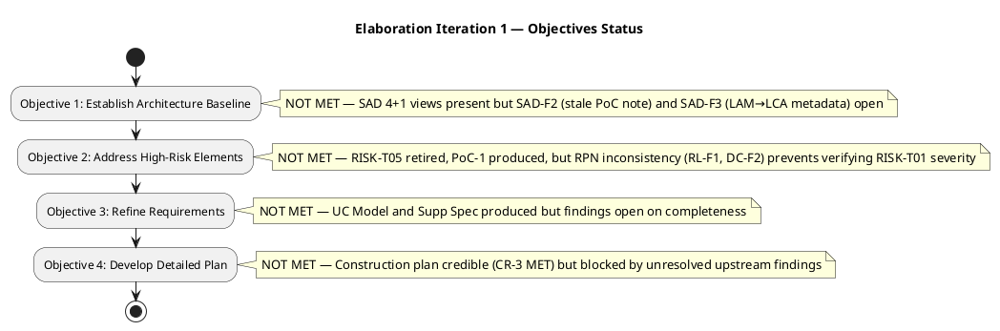
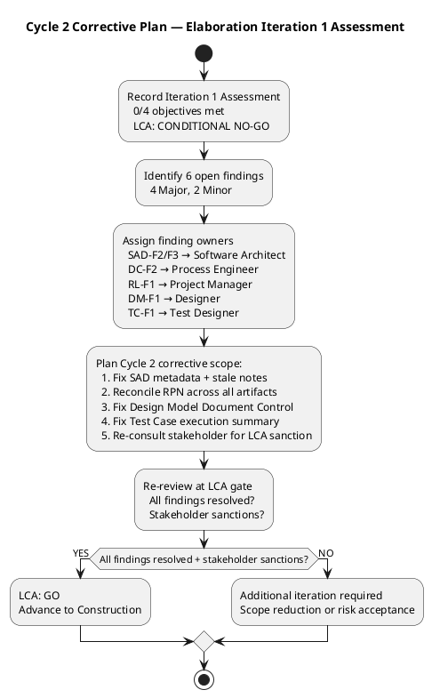
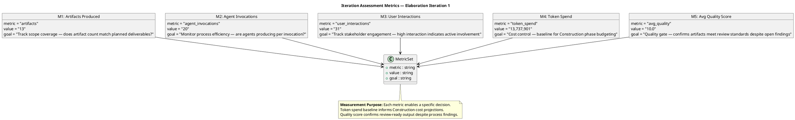

## Document Control

| Field | Value |
|---|---|
| Phase | Elaboration |
| Status | Draft |
| Iteration | 1 (Cycle 1) |
| Milestone Target | LCA (Lifecycle Architecture) |
| Author | Project Manager |
| Assessment Date | 2026-07-07 |
| Prior Assessment | Inception 2 (LCO: GO — Approved, 2026-07-17) |
| Review Coordinator Verdict | **LCA: CONDITIONAL NO-GO — Auto-iterate required** |
| Stakeholder Sanction | **NOT GRANTED** — stakeholder explicitly refused to advance past LCA |

## Iteration Objectives Reached

### Objectives Status Summary

**0 of 4 objectives achieved.** All four Elaboration iteration objectives remain pending. The Review Coordinator's LCA verdict is **CONDITIONAL NO-GO** with auto-iterate to Cycle 2. The LCA milestone is **NOT achieved**.

### Objective Detail

| # | Objective | Status | Evidence |
|---|---|---|---|
| 1 | Establish Architecture Baseline | **NOT MET** | SAD 4+1 views present with ADRs preserved and mechanisms mapped. However, SAD-F2 (stale PoC reference note — 3rd occurrence) and SAD-F3 (milestone metadata LAM→LCA not corrected) remain open as Major findings. Architecture baseline cannot be declared stable with open Major findings on the SAD itself. |
| 2 | Address High-Risk Elements | **NOT MET** | RISK-T05 (stakeholder design file impact) retired. PoC-1 (Architectural Proof-of-Concept) produced. However, RPN inconsistency (RL-F1 — 2nd occurrence, DC-F2) across Risk List, Development Case, and Test Case prevents verifying RISK-T01 actual severity. The governance failure means risk retirement cannot be confirmed. |
| 3 | Refine Requirements | **NOT MET** | Use-Case Model and Supplementary Specification produced with Elaboration-level detail. UC flows refined, NFR coverage expanded. However, open findings on artifact completeness (DM-F1, TC-F1) and the unresolved RPN governance issue mean the requirements baseline is not fully stable. |
| 4 | Develop Detailed Plan | **NOT MET** | Construction plan is credible — CR-3 (Construction Plan Credible) was the only LCA criterion rated MET. Integration order (Infrastructure→Application→Domain→Presentation), role assignments, and cost estimates are defined. However, the plan cannot be baselined while upstream findings block the LCA gate. |

## Adherence to Plan

### Planned vs Actual

| Dimension | Planned | Actual | Variance |
|---|---|---|---|
| Objectives completed | 4 | 0 | −4 (100% slip) |
| Artifacts produced | 8 planned deliverables | 13 artifacts produced | +5 (over-produced — breadth without closure) |
| Major findings open at close | 0 | 4 | +4 (critical) |
| Minor findings open at close | 0 | 2 | +2 |
| LCA criteria met | 4 of 4 | 1 of 4 (CR-3 only) | −3 |
| Stakeholder sanction | Expected | Refused | Veto |

### Root Cause Analysis

The iteration produced a high volume of artifacts (13) with excellent average quality scores (10.0), but **none of the four objectives reached closure**. The root causes are:

1. **RPN Governance Failure (RL-F1, DC-F2):** RISK-T01's RPN values are inconsistent across the Risk List, Development Case, and Test Case. This is a **second occurrence** of the same finding — the governance process did not catch the inconsistency after the first occurrence. This blocks verification of risk retirement (CR-2).

2. **SAD Metadata Drift (SAD-F2, SAD-F3):** The SAD carries a stale PoC reference note (3rd occurrence) and incorrect milestone metadata (LAM instead of LCA). These are persistent documentation defects that have survived multiple iterations — indicating insufficient attention to Document Control hygiene during artifact evolution.

3. **Breadth Over Depth:** 13 artifacts were produced across 20 agent invocations, but 6 findings remain open. The iteration prioritized coverage over closure — producing artifacts faster than they could be verified clean.

4. **Stakeholder Veto (CR-4):** The stakeholder explicitly refused to advance past LCA, requesting an additional Elaboration iteration. This is the binding constraint — even if all findings were resolved, the stakeholder's sanction is independently required.

## Use Cases and Scenarios Implemented

No use cases were implemented in this iteration — Elaboration is an architecture and design phase, not an implementation phase. The following use cases were targeted for architectural realization:

| Use Case | ID | Design Status | Findings Affecting |
|---|---|---|---|
| Clock In/Out | UC-001 | Design Model classes produced (Clocking, SyncQueue, SyncRecord); sequence diagrams planned | RL-F1 (RISK-T01 RPN blocks risk verification for UC-001's highest risk) |
| Read News | UC-002 | UC flows refined in Use-Case Model | None directly |
| Employee Directory | UC-003 | Design Model classes produced (Employee, DirectoryService, AuditInterceptor); sequence diagrams planned | DM-F1 (Design Model Document Control) |
| AD Authentication | (Supp Spec) | Isolated behind IAuthProvider per Elaboration decision | RISK-T02 remains active — AD spike deferred to Construction |

## Results Relative to Evaluation Criteria

### LCA Exit Criteria Compliance

```plantuml
@startuml
title LCA Exit Criteria Compliance — Elaboration Iteration 1

class LCACriterion {
  + id : string
  + criterion : string
  + status : PassStatus
  + evidence : string
}

enum PassStatus {
  MET
  PARTIALLY_MET
  NOT_MET
}

object "CR-1: Architecture Baselined" as CR1 {
  status = PARTIALLY_MET
  evidence = "All 5 views present; ADRs preserved. SAD-F2 (stale PoC note, 3rd occ) and SAD-F3 (LAM→LCA) open."
  blocking_findings = "SAD-F2 (Major), SAD-F3 (Major)"
}

object "CR-2: Critical Risks Mitigated" as CR2 {
  status = PARTIALLY_MET
  evidence = "RISK-T05 retired. PoC-1 produced. RPN inconsistency (RL-F1 2nd occ, DC-F2) prevents verifying RISK-T01 severity."
  blocking_findings = "RL-F1 (Major), DC-F2 (Major)"
}

object "CR-3: Construction Plan Credible" as CR3 {
  status = MET
  evidence = "Integration order Infrastructure→Application→Domain→Presentation. Role assignments defined. Cost estimates from stakeholder data."
  blocking_findings = "None"
}

object "CR-4: Stakeholder Sanction" as CR4 {
  status = NOT_MET
  evidence = "Stakeholder explicitly refused to advance past LCA. Requests additional Elaboration iteration."
  blocking_findings = "Stakeholder veto"
}

CR1 --> LCACriterion
CR2 --> LCACriterion
CR3 --> LCACriterion
CR4 --> LCACriterion

note bottom of LCACriterion
  **Overall LCA Verdict: CONDITIONAL NO-GO**
  2 of 4 criteria PARTIALLY_MET or NOT_MET
  4 Major + 2 Minor findings open
  Auto-iterate to Elaboration Cycle 2
end note
@enduml
```

### Acceptance Criteria Status (from Vision)

| Acceptance Criterion | Status | Notes |
|---|---|---|
| AC-1: Employee clocks in/out without HR help | Not yet testable | Design complete; implementation deferred to Construction |
| AC-2: HR publishes news without technical assistance | Not yet testable | Design complete; implementation deferred to Construction |
| AC-3: Employee finds colleague in under 10 seconds | Not yet testable | Design complete; implementation deferred to Construction |
| AC-4: 80% employees complete clocking with no training | Not yet testable | Adoption risk (RISK-S02) tracked; measurement planned for Transition |
| AC-5: System works temporarily offline (5-min network drop) | Architecture designed | Offline sync mechanism (COMP-D4, COMP-I3, COMP-I5) designed; PoC-1 produced; not yet implemented |

## Test Results

No test execution occurred in this iteration — Elaboration is a design and architecture phase. The Test Evaluation Summary establishes:

- **Mission:** Validate architectural testability and define Construction-phase test entry criteria
- **Key outputs:** Test strategy for offline sync and AD auth scenarios; acceptance thresholds per quality attribute; test environment configurations; regression scope per Construction iteration
- **Finding TC-F1 (Minor):** Test Case execution summary completeness and blocking reason tracking need correction
- **Build status:** CI pipeline succeeded (2026-07-07); 3 open CRs in SCM

The Test Manager confirmed that all architecturally significant mechanisms (offline sync, AD auth, audit trail, SQLite concurrency) have testable interfaces and defined test approaches. Construction entry criteria are defined but gated by LCA resolution.

## External Changes

| Change | Source | Impact |
|---|---|---|
| Stakeholder refused LCA sanction | Stakeholder feedback during LCA review | Additional Elaboration iteration required; Construction start delayed |
| 3 open Change Requests in SCM | SCM issue tracker | CRs must be triaged and dispositioned in Cycle 2 |
| RPN governance failure (2nd occurrence) | Review Record RL-F1 | Process improvement needed — RPN consistency check must be enforced before artifact submission |

## Rework Required

### Open Findings Requiring Correction in Cycle 2

```plantuml
@startuml
title Open Findings Disposition — Elaboration Iteration 1

class Finding {
  + id : string
  + severity : Severity
  + artifact : string
  + description : string
  + owner : string
  + status : FindingStatus
}

enum Severity {
  Major
  Minor
}

enum FindingStatus {
  Open
  Resolved
  Deferred
}

object "SAD-F2" as F1 {
  severity = Major
  artifact = "Software Architecture Document"
  description = "Stale PoC reference note (3rd occurrence) — must be removed/updated"
  owner = "Software Architect"
  status = Open
}

object "SAD-F3" as F2 {
  severity = Major
  artifact = "Software Architecture Document"
  description = "Milestone metadata LAM→LCA not corrected"
  owner = "Software Architect"
  status = Open
}

object "DC-F2" as F3 {
  severity = Major
  artifact = "Development Case"
  description = "RPN inconsistency in risk profile — RISK-T01 RPN values differ across DC/TC vs Risk List"
  owner = "Process Engineer"
  status = Open
}

object "RL-F1" as F4 {
  severity = Major
  artifact = "Risk List"
  description = "RISK-T01 RPN inconsistent across artifacts — governance failure (2nd occurrence)"
  owner = "Project Manager"
  status = Open
}

object "DM-F1" as F5 {
  severity = Minor
  artifact = "Design Model"
  description = "Document Control metadata needs correction"
  owner = "Designer"
  status = Open
}

object "TC-F1" as F6 {
  severity = Minor
  artifact = "Test Case"
  description = "Execution summary completeness / blocking reason tracking"
  owner = "Test Designer"
  status = Open
}

F1 --> Finding
F2 --> Finding
F3 --> Finding
F4 --> Finding
F5 --> Finding
F6 --> Finding

note bottom of Finding
  **4 Major + 2 Minor = 6 open findings**
  All must be resolved before LCA re-review in Cycle 2
end note
@enduml
```

### Corrective Action Plan for Cycle 2

| Priority | Finding | Owner | Action | Effort |
|---|---|---|---|---|
| 1 | RL-F1 (Major) | Project Manager | Reconcile RISK-T01 RPN across Risk List, Development Case, and Test Case — establish single source of truth | Low |
| 2 | DC-F2 (Major) | Process Engineer | Fix RPN values in Development Case risk profile to match Risk List canonical values | Low |
| 3 | SAD-F2 (Major) | Software Architect | Remove/update stale PoC reference note in SAD (3rd occurrence — must not recur) | Low |
| 4 | SAD-F3 (Major) | Software Architect | Correct SAD Document Control milestone metadata from LAM to LCA | Low |
| 5 | DM-F1 (Minor) | Designer | Fix Design Model Document Control metadata | Low |
| 6 | TC-F1 (Minor) | Test Designer | Complete Test Case execution summary and blocking reason tracking | Low |

### Cycle 2 Corrective Workflow

## Metrics

### Iteration Measurement Summary

| Metric | Value | Measurement Goal | Decision Enabled |
|---|---|---|---|
| Artifacts produced | 13 | Track scope coverage vs planned deliverables | Cycle 2 should focus on closure (fixing findings) not new artifact production |
| Agent invocations | 20 | Monitor process efficiency | 0.65 artifacts/invocation — adequate but breadth-first pattern detected |
| User interactions | 31 | Track stakeholder engagement | High engagement confirms active stakeholder involvement; veto is informed |
| Token spend | 13,737,901 | Cost control baseline | Construction phase budgeting — Elaboration token spend sets the reference |
| Avg quality score | 10.0 | Quality gate | Artifacts are review-ready in quality terms; findings are process/governance, not quality |

### Lessons Learned

1. **RPN governance requires a pre-submission consistency check.** The RISK-T01 RPN inconsistency has occurred twice (RL-F1 2nd occurrence). A mandatory cross-artifact RPN verification step must be added to the Development Case before any artifact is submitted for review. **Action:** Project Manager to enforce RPN single-source-of-truth in Cycle 2.

2. **Document Control hygiene is a recurring failure mode.** SAD-F2 (stale PoC note — 3rd occurrence) and SAD-F3 (LAM→LCA) demonstrate that Document Control metadata is not being updated in-place during artifact evolution. **Action:** All roles must verify Document Control section accuracy before each upsert.

3. **Breadth over depth produces open findings.** Producing 13 artifacts with 20 agent invocations yielded excellent quality scores but 6 open findings. The iteration prioritized coverage over closure. **Action:** Cycle 2 should be a focused corrective iteration — no new artifacts, only finding resolution.

4. **Stakeholder sanction is an independent gate.** Even with all technical findings resolved, the stakeholder's refusal to advance is binding. The LCA milestone requires both technical closure AND stakeholder sanction. **Action:** Project Manager must engage stakeholder proactively in Cycle 2 after findings are resolved.

## Next Iteration Adjustments

### Cycle 2 Scope Recommendation

**Scope reduction is required.** The Cycle 2 iteration should be a **corrective-only iteration** with the following scope:

| Work Item | Owner | Rationale |
|---|---|---|
| Resolve RL-F1: Reconcile RISK-T01 RPN | Project Manager | Blocks CR-2 (Critical Risks Mitigated) |
| Resolve DC-F2: Fix Development Case RPN | Process Engineer | Blocks CR-2 |
| Resolve SAD-F2: Remove stale PoC note | Software Architect | Blocks CR-1 (Architecture Baselined) |
| Resolve SAD-F3: Fix SAD milestone metadata | Software Architect | Blocks CR-1 |
| Resolve DM-F1: Fix Design Model Document Control | Designer | Minor — quality hygiene |
| Resolve TC-F1: Fix Test Case execution summary | Test Designer | Minor — quality hygiene |
| Re-consult stakeholder for LCA sanction | Project Manager | Blocks CR-4 (Stakeholder Sanction) |

**No new artifacts should be produced in Cycle 2.** All effort should focus on resolving the 6 open findings and re-engaging the stakeholder. This is a scope reduction from the original 8-objective iteration to a 7-item corrective list — all low-effort metadata and consistency fixes.

### Schedule Impact

| Parameter | Before (Planned) | After (Adjusted) |
|---|---|---|
| Elaboration iterations | 1 | 2 (Cycle 1 + Cycle 2) |
| Construction start | Immediately after Elaboration 1 | Delayed by one corrective iteration |
| Total project iterations | 6 (planned) | 7 (adjusted) — within 6±3 range |
| Risk of further slippage | Low | Low — all findings are low-effort metadata fixes |

## Traceability

| Element | Traces From | Link Type | Traces To |
|---|---|---|---|
| Iteration Assessment (this) | Review Record (Elaboration Iter 1) | Derives | Cycle 2 Iteration Plan, Risk List (Cycle 2 update) |
| Objective 1 (Architecture Baseline) | SAD, SAD-F2, SAD-F3 | Reviews | SAD (corrective action — Cycle 2) |
| Objective 2 (High-Risk Elements) | Risk List, RL-F1, DC-F2, PoC-1 | Reviews | Risk List (RPN reconciliation — Cycle 2) |
| Objective 3 (Refine Requirements) | Use-Case Model, Supplementary Spec, DM-F1, TC-F1 | Reviews | Design Model, Test Case (corrective — Cycle 2) |
| Objective 4 (Detailed Plan) | Iteration Plan (Construction schedule), CR-3 | Derives | Cycle 2 Iteration Plan |
| LCA Criteria CR-1 | SAD (4+1 views, ADRs) | Reviews | SAD (Cycle 2 corrective) |
| LCA Criteria CR-2 | Risk List (RISK-T01, RISK-T05), PoC-1 | Reviews | Risk List, Development Case (Cycle 2 corrective) |
| LCA Criteria CR-3 | Iteration Plan (Construction schedule) | Derives | Construction Iteration 1 Plan |
| LCA Criteria CR-4 | Stakeholder feedback | Derives | Stakeholder re-consultation (Cycle 2) |
| Metrics | Iteration facts (injected) | Derives | Cycle 2 Iteration Plan (velocity baseline) |
| Lessons Learned | Review Record, Stakeholder Input | Derives | Organization memory (process improvement) |
| LCA Verdict | Review Coordinator milestone assessment | Derives | Elaboration Cycle 2 entry |
| Acceptance Criteria | Vision (5 ACs) | Derives | Construction test plans, Transition UAT |