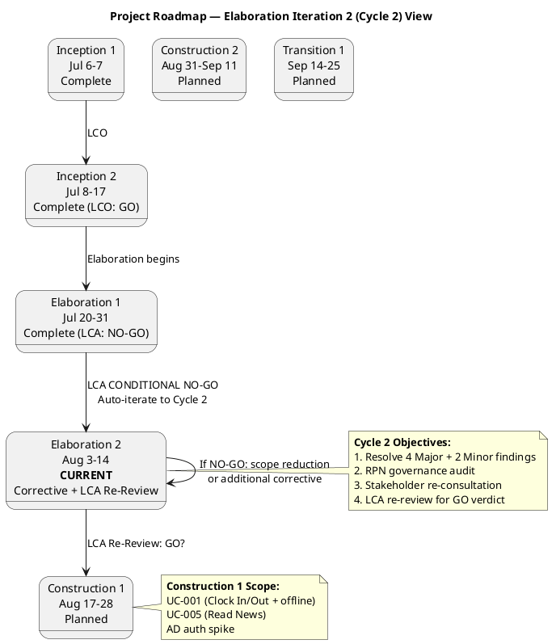
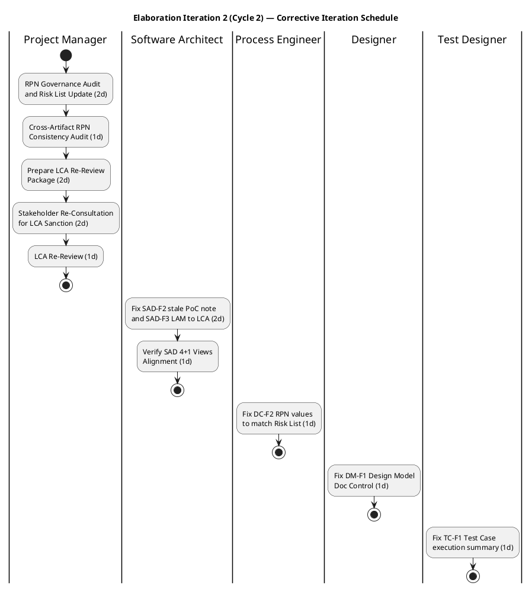

## Document Control

| Field | Value |
|---|---|
| Phase | Elaboration |
| Status | Draft |
| Milestone Target | LCA (Lifecycle Architecture) — Re-Review |
| Iteration | 2 (Cycle 2) |
| Author | Project Manager |
| Prior Iteration | Elaboration 1 (LCA: CONDITIONAL NO-GO — auto-iterate to Cycle 2) |
| Findings Addressed | RL-F1 (Major, 2nd), MR-RL-F1 (Major, 1st) — RPN governance protocol established in Risk List |
| Iteration Type | Corrective — resolve 6 open findings from LCA review, re-consult stakeholder, LCA re-review |

## Iteration Objectives

1. **Resolve all 4 Major findings from LCA review** — SAD-F2 (stale PoC note, 3rd occurrence), SAD-F3 (LAM→LCA metadata), DC-F2 (RPN inconsistency), RL-F1 (RPN governance, 2nd occurrence). Each finding owner corrects their artifact; PM verifies cross-artifact RPN consistency.
2. **Resolve all 2 Minor findings** — DM-F1 (Design Model Document Control authorship), TC-F1 (Test Case execution summary + blocking reason).
3. **Establish RPN governance protocol** — Risk List is the single authoritative source for all RPN values. PM performs cross-artifact RPN audit and records results. (MR-RL-F1 resolution — already implemented in Risk List.)
4. **Re-consult stakeholder for LCA sanction** — Stakeholder explicitly refused to advance past LCA in Iteration 1. PM presents corrected artifacts and risk retirement evidence to stakeholder for LCA sanction decision.
5. **Pass LCA re-review** — All 4 LCA exit criteria met: architecture baselined, critical risks mitigated, Construction plan credible, stakeholder sanction granted.

## Plan and Milestones

### Project Context — Coarse Cross-Iteration Roadmap

This section carries the coarse-grained project roadmap. Fine-grained Gantt details are provided ONLY for the current iteration. Subsequent iterations receive fine-grained plans when they become the current or next iteration.

#### Milestone Schedule

| Milestone | Full Name | Target Date | Phase Boundary |
|---|---|---|---|
| LCO | Lifecycle Objective | 2026-07-17 | End of Inception — **ACHIEVED** |
| LCA | Lifecycle Architecture | 2026-08-14 | End of Elaboration — **RE-REVIEW** (prior: CONDITIONAL NO-GO) |
| IOC | Initial Operational Capability | 2026-09-11 | End of Construction |
| PR | Product Release | 2026-09-25 | End of Transition |

#### Iteration Roadmap (6 ± 3 Rule Applied)

| Phase | Iteration | Duration | Calendar Window | Primary Focus | Status |
|---|---|---|---|---|---|
| Inception | 1 | 1 week | Jul 6 – Jul 7 | Scope, risks, architecture candidate, UC model (initial) | Complete |
| Inception | 2 | 1.5 weeks | Jul 8 – Jul 17 | Corrective: resolve F1–F3, S2; LCO re-assessment | Complete (LCO: GO) |
| Elaboration | 1 | 2 weeks | Jul 20 – Jul 31 | Architecture baseline validation, design model, data model, test strategy | Complete (LCA: CONDITIONAL NO-GO) |
| Elaboration | 2 | 2 weeks | Aug 3 – Aug 14 | **CURRENT**: Corrective — resolve 6 findings, RPN governance, stakeholder re-consultation, LCA re-review | In Progress |
| Construction | 1 | 2 weeks | Aug 17 – Aug 28 | Implement UC-001 (Clock In/Out + offline), UC-005 (Read News), AD auth spike | Planned |
| Construction | 2 | 2 weeks | Aug 31 – Sep 11 | Implement UC-003 (Directory), UC-004 (Publish News); integration; load testing | Planned |
| Transition | 1 | 2 weeks | Sep 14 – Sep 25 | Deploy to Windows Server; UAT; adoption tracking | Planned |

**Total: 7 iterations** — within the 6 ± 3 rule (high end justified by corrective iterations in both Inception and Elaboration). Distribution: [2, 2, 2, 1] across phases.

#### Rubber Profile Justification

| Phase | Schedule % | Iteration Count % | Justification |
|---|---|---|---|
| Inception | ~15% | ~29% (2 of 7) | Stretched from 10% — corrective iteration required for LCO findings (F1–F3, S2) |
| Elaboration | ~30% | ~29% (2 of 7) | At nominal 30% — corrective iteration required for LCA findings (4 Major + 2 Minor). Architecture baseline produced in Iter 1; Iter 2 is corrective closure. |
| Construction | ~35% | ~29% (2 of 7) | Compressed from 50% — 4 UCs with baselined architecture and design model; offline sync PoC validated reduces implementation risk |
| Transition | ~10% | ~14% (1 of 7) | At nominal 10% — internal deployment, no external user training, UAT with 200 employees |

#### Project Roadmap Diagram

### Fine-Grained Iteration Gantt — Elaboration Iteration 2 (Cycle 2)

**Schedule by time, not by volume.** This corrective iteration is time-boxed to Aug 3 – Aug 14 (10 calendar days). Scope is bounded by the 6 open findings + stakeholder re-consultation. No new feature work enters this iteration.

#### Calendar Schedule

| Week | Date Range | Focus | Key Activities |
|---|---|---|---|
| Week 1 | Aug 3 – Aug 7 | Finding Resolution | All 6 finding owners correct their artifacts in parallel; PM performs RPN governance audit |
| Week 2 | Aug 10 – Aug 14 | LCA Re-Review | PM prepares re-review package; Architect verifies SAD alignment; stakeholder re-consultation; LCA re-review |

#### Task Breakdown

| Task ID | Task | Owner Role | Duration | Start | End | Finding Addressed |
|---|---|---|---|---|---|---|
| T1 | RPN Governance Audit + Risk List Update | Project Manager | 2d | Aug 3 | Aug 4 | RL-F1, MR-RL-F1 |
| T2 | Fix SAD-F2 (stale PoC note) + SAD-F3 (LAM→LCA) | Software Architect | 2d | Aug 3 | Aug 4 | SAD-F2, SAD-F3 |
| T3 | Fix DC-F2 (RPN values to match Risk List) | Process Engineer | 1d | Aug 3 | Aug 3 | DC-F2 |
| T4 | Fix DM-F1 (Design Model Doc Control authorship) | Designer | 1d | Aug 3 | Aug 3 | DM-F1 |
| T5 | Fix TC-F1 (Test Case execution summary) | Test Designer | 1d | Aug 3 | Aug 3 | TC-F1 |
| T6 | Cross-Artifact RPN Consistency Audit | Project Manager | 1d | Aug 5 | Aug 5 | RL-F1 verification |
| T7 | Verify SAD 4+1 Views Alignment | Software Architect | 1d | Aug 10 | Aug 10 | LCA CR-1 |
| T8 | Prepare LCA Re-Review Package | Project Manager | 2d | Aug 10 | Aug 11 | LCA re-review |
| T9 | Stakeholder Re-Consultation for LCA Sanction | Project Manager | 2d | Aug 12 | Aug 13 | LCA CR-4 |
| T10 | LCA Re-Review | Review Coordinator | 1d | Aug 14 | Aug 14 | LCA milestone |

#### Iteration Schedule Diagram

#### Finding Resolution — Risk-to-Task Mapping

```plantuml
@startuml
title Cycle 2 Finding Resolution — Risk-to-Task Mapping

class FindingTask {
  + findingId : string
  + severity : string
  + ownerRole : string
  + taskDescription : string
  + durationDays : int
  + riskAddressed : string
}

object "FT-1: RL-F1" as FT1 {
  findingId = "RL-F1 (Major, 2nd)"
  ownerRole = "Project Manager"
  taskDescription = "RPN governance audit + Risk List update"
  durationDays = 2
  riskAddressed = "RISK-T01 RPN consistency"
}

object "FT-2: MR-RL-F1" as FT2 {
  findingId = "MR-RL-F1 (Major, 1st)"
  ownerRole = "Project Manager"
  taskDescription = "Establish RPN governance protocol + cross-artifact audit"
  durationDays = 1
  riskAddressed = "RPN governance process"
}

object "FT-3: SAD-F2" as FT3 {
  findingId = "SAD-F2 (Major, 3rd)"
  ownerRole = "Software Architect"
  taskDescription = "Remove stale PoC reference note in SAD"
  durationDays = 1
  riskAddressed = "Architecture baseline stability"
}

object "FT-4: SAD-F3" as FT4 {
  findingId = "SAD-F3 (Major, 1st)"
  ownerRole = "Software Architect"
  taskDescription = "Correct SAD milestone metadata LAM to LCA"
  durationDays = 1
  riskAddressed = "Architecture baseline stability"
}

object "FT-5: DC-F2" as FT5 {
  findingId = "DC-F2 (Major, 1st)"
  ownerRole = "Process Engineer"
  taskDescription = "Fix RPN values in DC risk profile to match Risk List"
  durationDays = 1
  riskAddressed = "RISK-T01 RPN consistency"
}

object "FT-6: DM-F1" as FT6 {
  findingId = "DM-F1 (Minor, 3rd)"
  ownerRole = "Designer"
  taskDescription = "Fix Design Model Document Control authorship"
  durationDays = 1
  riskAddressed = "Artifact metadata hygiene"
}

object "FT-7: TC-F1" as FT7 {
  findingId = "TC-F1 (Minor, 3rd)"
  ownerRole = "Test Designer"
  taskDescription = "Complete Test Case execution summary + blocking reason"
  durationDays = 1
  riskAddressed = "Construction test entry criteria"
}

FT1 --> FindingTask
FT2 --> FindingTask
FT3 --> FindingTask
FT4 --> FindingTask
FT5 --> FindingTask
FT6 --> FindingTask
FT7 --> FindingTask

note bottom of FindingTask
  **6 findings (4 Major + 2 Minor)**
  All resolved in Week 1 (Aug 3-7)
  LCA re-review in Week 2 (Aug 10-14)
  Total corrective effort: 10 role-days
end note

@enduml
```

## Resources

### Agent Role Effort Allocation — Elaboration Iteration 2 (Cycle 2)

| Role | Effort (days) | Concurrent Period | Key Deliverables |
|---|---|---|---|
| ProjectManager | 7d | Aug 3-5, Aug 10-14 | Risk List (RPN governance), RPN audit, LCA re-review package, stakeholder re-consultation |
| SoftwareArchitect | 3d | Aug 3-4, Aug 10 | SAD-F2 + SAD-F3 corrections, SAD 4+1 alignment verification |
| ProcessEngineer | 1d | Aug 3 | DC-F2 RPN value correction |
| Designer | 1d | Aug 3 | DM-F1 Design Model Document Control fix |
| TestDesigner | 1d | Aug 3 | TC-F1 Test Case execution summary fix |
| ReviewCoordinator | 1d | Aug 14 | LCA re-review verdict |

**Total effort: 14 role-days across 10 calendar days (Aug 3 – Aug 14).** Peak concurrency: 5 roles on Aug 3 (PM, ARCH, PE, DESIGN, TEST). Week 2 is PM-dominated (re-review preparation + stakeholder consultation).

### Infrastructure Resources

| Resource | Status | Notes |
|---|---|---|
| Git/SCM repository | Active | IARI branching strategy published to main |
| .NET 10 SDK | Available | Per stakeholder constraint |
| PostgreSQL 16 | Available | Per SAD technology stack |
| SQLite | Available | For offline local store (EF Core Sqlite 10.0.9) |
| Windows Server | Pending | Coordinate with Miguel Torres for Construction deployment |
| CI/CD (GitHub Actions) | Available | Workflows configured per IARI baseline |

## Use Cases and Scenarios Addressed

### Corrective Scope — No New UC Work

This iteration is a **corrective iteration**. No new use cases are analyzed, designed, or implemented. The scope is exclusively finding resolution and LCA re-review preparation. The UC coverage from Elaboration Iteration 1 remains valid:

| UC ID | Use Case | Elaboration Activity (from Iter 1) | Status |
|---|---|---|---|
| UC-001 | Clock In/Out | Design classes, SQLite schema, test strategy, PoC-1 validated | Complete — no corrective needed |
| UC-007 | Manage Directory | Design classes, override flag, audit log, test strategy | Complete — no corrective needed |
| UC-003 | Review and Export Clockings | Sequence validated, PostgreSQL schema | Complete — no corrective needed |
| UC-004 | Publish News | Sequence diagram, audit trail mechanism | Complete — no corrective needed |
| UC-005 | Read News | Sequence diagram, Razor Page layout mapping | Complete — no corrective needed |
| UC-006 | Search Directory | Sequence diagram, Razor Page layout mapping | Complete — no corrective needed |
| UC-002 | View Clocking History | Refined in UC model | Complete — no corrective needed |

### Construction Iteration Scope Preview (Unchanged from Iter 1)

| Construction Iteration | UCs for Implementation | Rationale |
|---|---|---|
| Construction 1 (Aug 17-28) | UC-001 (Clock In/Out + offline), UC-005 (Read News), AD auth spike | UC-001 is highest risk — implement first with offline sync PoC. UC-005 is simple and provides early visible functionality. AD auth spike validates IAuthProvider. |
| Construction 2 (Aug 31-Sep 11) | UC-003 (Review/Export), UC-004 (Publish News), UC-006 (Search Directory), UC-007 (Manage Directory) | Remaining UCs. Directory UCs exercise AD sync. Load testing validates performance and concurrency risks. |

## Evaluation Criteria

### Iteration Exit Criteria — Elaboration Iteration 2 (Cycle 2)

| # | Criterion | Measurement | Target | Decision Enabled |
|---|---|---|---|---|
| 1 | All 4 Major findings resolved | Finding tracker review | 4 of 4 CLOSED | Whether LCA re-review can proceed |
| 2 | All 2 Minor findings resolved | Finding tracker review | 2 of 2 CLOSED | Whether LCA re-review can proceed |
| 3 | RPN consistency across all artifacts | Cross-artifact RPN audit | 100% match with Risk List canonical values | Whether risk retirement can be verified (CR-2) |
| 4 | SAD Document Control corrected | SAD metadata review | Milestone = LCA, no stale PoC notes | Whether architecture baseline can be declared stable (CR-1) |
| 5 | Stakeholder sanction obtained | Stakeholder consultation record | Sanction granted | Whether LCA can be achieved (CR-4) |
| 6 | LCA re-review verdict | Review Coordinator assessment | GO | Whether Construction can begin |

### LCA Milestone Exit Criteria (Re-Review — Aug 14)

| Criterion | Source | Status (entering Cycle 2) | Target (end of Cycle 2) |
|---|---|---|---|
| CR-1: Architecture baselined | SAD | PARTIALLY_MET (SAD-F2, SAD-F3 open) | MET — SAD corrected and verified |
| CR-2: Critical risks mitigated | Risk List + PoC | PARTIALLY_MET (RPN inconsistency blocks verification) | MET — RPN reconciled, PoC-1 evidence accepted |
| CR-3: Construction plan credible | Iteration Plan | MET (no change needed) | MET — preserved from Iter 1 |
| CR-4: Stakeholder sanction | Stakeholder | NOT_MET (veto) | MET — stakeholder re-consulted with corrected evidence |

## Traceability

| Element | Traces From | Link Type | Traces To |
|---|---|---|---|
| Cycle 2 Objectives | Review Record (Findings), Iteration Assessment (Iter 1) | Derives | LCA Re-Review, Construction Iter 1 Plan |
| T1 (RPN Governance Audit) | RL-F1, MR-RL-F1 (Review Record) | Reviews | Risk List (RPN Governance Protocol), Development Case (DC-F2), Test Case (TC-F1) |
| T2 (SAD Corrections) | SAD-F2, SAD-F3 (Review Record) | Reviews | Software Architecture Document (corrected) |
| T3 (DC RPN Fix) | DC-F2 (Review Record) | Reviews | Development Case (corrected) |
| T4 (DM Doc Control Fix) | DM-F1 (Review Record) | Reviews | Design Model (corrected) |
| T5 (TC Execution Summary Fix) | TC-F1 (Review Record) | Reviews | Test Case (corrected) |
| T6 (RPN Consistency Audit) | RL-F1 (Review Record), Risk List (canonical RPN) | Reviews | All downstream RPN consumers |
| T7 (SAD Alignment Verification) | LCA CR-1 | Reviews | SAD (4+1 views) |
| T8-T9 (LCA Re-Review + Stakeholder) | LCA CR-4, Iteration Assessment (Iter 1) | Derives | LCA Milestone Verdict, Construction Entry |
| Construction Schedule | SAD Integration Order, UC Prioritization, Risk List | Derives | Construction Iter 1 Plan, Construction Iter 2 Plan |
| Evaluation Criteria | Acceptance Criteria (stakeholder), LCA exit criteria | Derives | LCA Milestone Re-Review |
| UC-001 tasks (Iter 1, preserved) | RISK-T01 (RPN 63), RISK-T03 (RPN 48) | Derives | Construction PoC, Design Model |
| UC-007 tasks (Iter 1, preserved) | RISK-T02 (RPN 35), RISK-R01 (RPN 30) | Derives | Construction AD spike, Design Model |