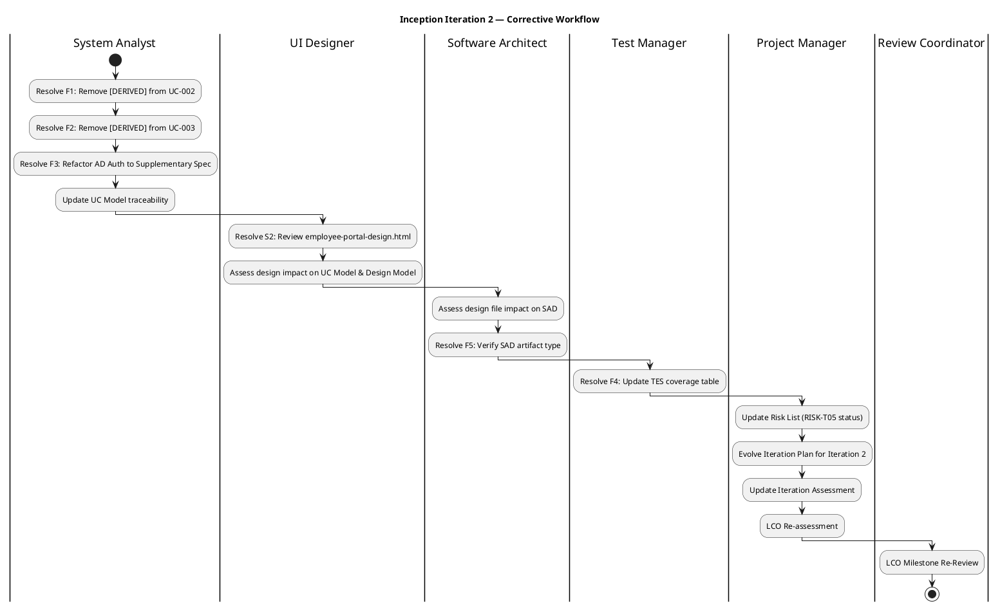
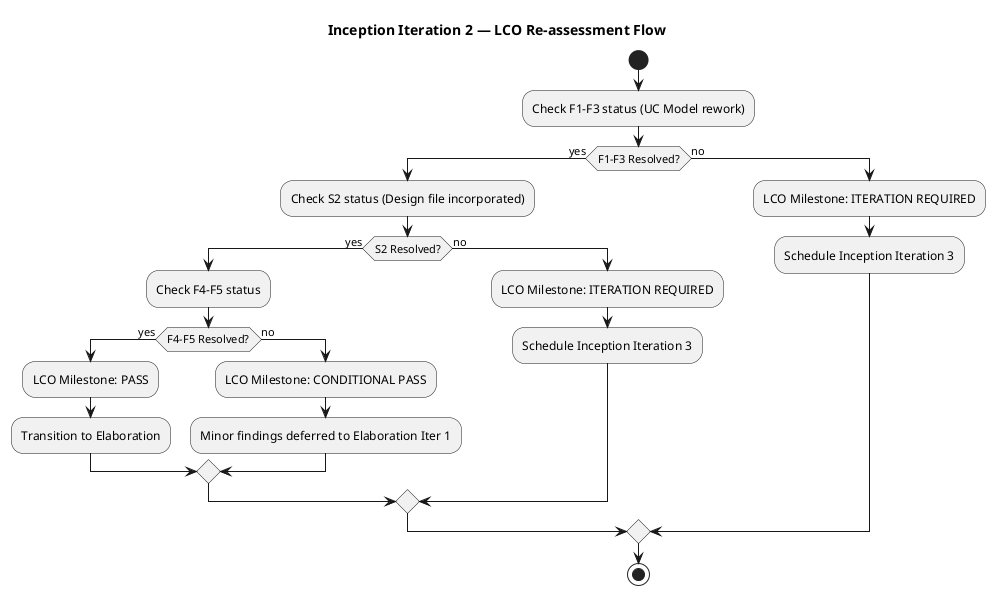

## Document Control
| Field | Value |
|---|---|
| Phase | Inception |
| Status | Draft |
| Milestone Target | End of Inception (LCO) |
| Iteration | 2 (Cycle 1) |
| Author | Project Manager |
| Prior Iteration | 1 (Cycle 1) — LCO verdict: iteration REQUIRED (4 open Major findings) |
## Iteration Objectives
1. **Resolve Use-Case Model findings F1–F3** — System Analyst removes `[DERIVED]` markers from UC-002 and UC-003 (stakeholder confirmed processes per S1), refactors AD Authentication from standalone UCs (UC-004/UC-007) to Supplementary Specification constraint with `<<include>>` per Scope Guard Rule 7
2. **Incorporate stakeholder design file (S2)** — UI Designer reviews `docs/inputs/employee-portal-design.html`, assesses impact on UC Model, Design Model, and SAD; Software Architect evaluates architectural impact
3. **Resolve minor findings F4–F5** — Test Manager updates TES coverage table after UC renumbering (F4); Software Architect verifies SAD artifact type registration (F5)
4. **Update Risk List** — Project Manager updates RISK-T05 status based on design file review outcome; verify all risk mitigations remain valid post-rework
5. **Re-assess LCO milestone readiness** — Determine whether all open Major findings are resolved and the project is viable to proceed to Elaboration
6. **Maintain coarse roadmap** — Verify milestone dates and iteration boundaries remain valid; adjust if rework reveals new schedule risk
## Plan and Milestones
### Project Context — Coarse Cross-Iteration Roadmap

This section carries the coarse-grained project roadmap. Fine-grained Gantt details are provided ONLY for the current iteration. Subsequent iterations receive fine-grained plans when they become the current or next iteration.

#### Milestone Schedule

| Milestone | Full Name | Target Date | Phase Boundary |
|---|---|---|---|
| LCO | Lifecycle Objective | 2026-07-17 | End of Inception |
| LCA | Lifecycle Architecture | 2026-08-14 | End of Elaboration |
| IOC | Initial Operational Capability | 2026-09-11 | End of Construction |
| PR | Product Release | 2026-09-25 | End of Transition |

#### Iteration Roadmap (6 ± 3 Rule Applied)

| Phase | Iteration | Duration | Calendar Window | Primary Focus |
|---|---|---|---|---|
| Inception | 1 | 1 week | Jul 6 – Jul 7 | Scope, risks, architecture candidate, UC model (initial) |
| Inception | 2 | 1.5 weeks | Jul 8 – Jul 17 | Corrective: resolve F1–F3, S2; LCO re-assessment |
| Elaboration | 1 | 2 weeks | Jul 20 – Jul 31 | PoC: offline sync + AD integration; architecture baseline |
| Elaboration | 2 | 2 weeks | Aug 3 – Aug 14 | Complete design for all UCs; data model; UI mockups; test plan |
| Construction | 1 | 2 weeks | Aug 17 – Aug 28 | Implement UC-001 (Clock In/Out + offline), UC-002 (News), AD auth |
| Construction | 2 | 2 weeks | Aug 31 – Sep 11 | Implement UC-003 (Directory); integration; load testing |
| Transition | 1 | 2 weeks | Sep 14 – Sep 25 | Deploy to Windows Server; UAT; adoption tracking |

**Total: 7 iterations** — within the 6 ± 3 rule (high end justified by corrective iteration). Distribution: [2, 2, 2, 1] across phases. The additional Inception iteration was triggered by 4 open Major findings at the LCO review. Elaboration is stretched to 2 iterations due to high architectural risk (offline fault tolerance + AD integration). Transition is compressed to 1 iteration (internal deployment, no user training program required).

#### Rubber Profile Justification

| Phase | Schedule % | Iteration Count % | Justification |
|---|---|---|---|
| Inception | ~15% | ~29% (2 of 7) | Stretched from 10% — corrective iteration required for LCO findings (F1–F3, S2) |
| Elaboration | ~30% | ~29% (2 of 7) | Stretched — offline fault tolerance and AD integration are high-magnitude risks requiring PoC validation |
| Construction | ~33% | ~29% (2 of 7) | Compressed from 50% — 3 use cases are moderate complexity; .NET 10 + Razor Pages is well-understood |
| Transition | ~17% | ~14% (1 of 7) | Compressed — internal deployment, no external users, no training program |

#### Agent Role Assignment Profile

| Role | Inception Iter 1 | Inception Iter 2 | Elaboration | Construction | Transition |
|---|---|---|---|---|---|
| SystemAnalyst | **High** | **High** | Medium | — | — |
| SoftwareArchitect | **High** | Medium | **High** | — | — |
| ProjectManager | **High** | **High** | Medium | Medium | **High** |
| Designer | Medium | Low | **High** | Low | — |
| DatabaseDesigner | — | — | Medium | Medium | — |
| UIDesigner | — | **High** | Medium | — | — |
| Implementer | — | — | — | **High** | Low |
| TestDesigner | — | Medium | Medium | **High** | **High** |
| Deployer | — | — | — | — | **High** |
| Business Modeling | INACTIVE | INACTIVE | INACTIVE | INACTIVE | INACTIVE |

**Parallelism note:** Maximum concurrent roles in Inception Iteration 2 = 5 (SystemAnalyst, UIDesigner, SoftwareArchitect, TestManager, ProjectManager). This is justified by the need to resolve findings across multiple artifacts simultaneously. No further parallelism increase is planned — coordination overhead would exceed marginal benefit.

### Coarse Roadmap — Milestones and Iteration Flow

### Fine-Grained Gantt — Inception Iteration 2

#### Task Summary

| Task ID | Task | Owner Role | Duration | Start | End | Dependencies | Finding |
|---|---|---|---|---|---|---|---|
| T1 | Remove [DERIVED] from UC-002 (Read News) | SystemAnalyst | 1d | Jul 8 | Jul 8 | — | F1 |
| T2 | Remove [DERIVED] from UC-003 (Employee Directory) | SystemAnalyst | 1d | Jul 8 | Jul 8 | — | F2 |
| T3 | Refactor AD Auth: UC-004/UC-007 → Supplementary Spec | SystemAnalyst | 2d | Jul 9 | Jul 10 | T1, T2 | F3 |
| T4 | Update UC Model traceability | SystemAnalyst | 1d | Jul 10 | Jul 10 | T3 | F1–F3 |
| T5 | Review employee-portal-design.html | UIDesigner | 2d | Jul 8 | Jul 9 | — | S2 |
| T6 | Assess design impact on UC Model & Design Model | UIDesigner | 1d | Jul 10 | Jul 10 | T5, T3 | S2 |
| T7 | Assess design file impact on SAD | SoftwareArchitect | 1d | Jul 10 | Jul 10 | T5 | S2 |
| T8 | Verify SAD artifact type registration | SoftwareArchitect | 1d | Jul 10 | Jul 10 | — | F5 |
| T9 | Update TES coverage table after UC renumbering | TestManager | 1d | Jul 11 | Jul 11 | T4 | F4 |
| T10 | Update Risk List (RISK-T05 status) | ProjectManager | 1d | Jul 8 | Jul 8 | — | — |
| T11 | Evolve Iteration Plan for Iteration 2 | ProjectManager | 2d | Jul 8 | Jul 9 | — | — |
| T12 | Update Iteration Assessment | ProjectManager | 1d | Jul 11 | Jul 11 | T4, T6, T9 | — |
| T13 | LCO Re-assessment | ProjectManager | 1d | Jul 14 | Jul 14 | T4, T6, T7, T9 | — |
| T14 | LCO Milestone Re-Review | ReviewCoordinator | 1d | Jul 17 | Jul 17 | T13 | — |
## Resources
### Agent Role Assignments — Inception Iteration 2

| Agent Role | Assigned Tasks | Effort Allocation | Finding Focus |
|---|---|---|---|
| SystemAnalyst | T1, T2, T3, T4 | 35% — UC Model rework (F1–F3) | F1, F2, F3 |
| UIDesigner | T5, T6 | 20% — Design file review & impact assessment | S2 |
| SoftwareArchitect | T7, T8 | 15% — SAD impact assessment & artifact type verification | S2, F5 |
| TestManager | T9 | 5% — TES coverage table update | F4 |
| ProjectManager | T10, T11, T12, T13 | 20% — Risk List update, plan evolution, assessment, LCO re-assessment | — |
| ReviewCoordinator | T14 | LCO milestone re-review at iteration end | — |

### Infrastructure Resources

| Resource | Status | Notes |
|---|---|---|
| Git/SCM repository | Available | Project repository initialized; IARI branching strategy on main |
| .NET 10 SDK | Available | Per stakeholder constraint |
| PostgreSQL | Available | On Windows Server (internal) |
| PlantUML tooling | Available | Via process tooling |
| CI/CD pipeline | To configure | Deferred to Elaboration per Development Case |
| Design file | Available | `docs/inputs/employee-portal-design.html` — stakeholder-provided (S2) |
## Use Cases and Scenarios Addressed
This iteration addresses the **rework** of the Use-Case Model to resolve Review Record findings F1–F3 and incorporate the stakeholder design file (S2). No new use cases are added — scope ceiling remains the 4 declared processes + 4 NFRs.

| Use Case | ID | Iteration 2 Activity | Status at LCO Re-Review |
|---|---|---|---|
| Clock In/Out | UC-001 | No rework needed — UC-001 was not flagged in findings | Analyzed (stable) |
| Read News | UC-002 | Remove `[DERIVED]` marker (F1) — stakeholder confirmed process per S1 | Reworked |
| Employee Directory | UC-003 | Remove `[DERIVED]` marker (F2) — stakeholder confirmed process per S1 | Reworked |
| Active Directory Authentication | (cross-cutting) | Refactor from UC-004/UC-007 to Supplementary Spec constraint with `<<include>>` (F3) | Refactored |

**Scope boundary:** The 4 declared use cases + 4 NFRs constitute the complete scope ceiling. Any additions require a Change Request approved by the CCM. The following are explicitly EXCLUDED: native mobile app, push notifications, payroll integration, vacation/sick-leave management, biometric clocking, external access.

**Design file impact (S2):** The stakeholder-provided `employee-portal-design.html` must be reviewed by the UI Designer for impact on the UC Model, Design Model, and SAD. If the design implies scope changes beyond the declared ceiling, a Change Request is required.
## Evaluation Criteria
### LCO Milestone Re-Review Exit Criteria

| Criterion | Measurement Method | Target |
|---|---|---|
| F1–F3 resolved | UC Model rework verified by Review Coordinator | All 3 Major findings closed |
| S2 resolved | Design file reviewed; impact assessed on UC Model, Design Model, SAD | Design file incorporated or CR raised |
| F4 resolved | TES coverage table updated post-UC renumbering | Coverage table references correct UC IDs |
| F5 resolved | SAD artifact type verified | Artifact type registration confirmed |
| Scope agreement | Vision Document + UC Model reviewed by stakeholders | Laura Gómez confirms scope (unchanged) |
| Risk identification | Risk List updated with RISK-T05 status | All risks classified with current status |
| Architecture candidate | SAD validated against design file impact | Architecture remains viable post-design review |
| Project viability | Coarse roadmap + iteration plan reviewed | 7-iteration plan within schedule |

### Measurement Goals

| Metric | Goal (Decision Enabled) | Primitive Measure | Frequency |
|---|---|---|---|
| Finding closure rate | **Decide:** Whether LCO can pass this iteration | % of open findings resolved | Per iteration |
| Risk count by magnitude | **Decide:** Which risks require active mitigation in Elaboration | Count of risks per magnitude tier | Per iteration |
| Use case coverage | **Decide:** Whether scope is fully captured before Elaboration | % of declared UCs in Use Case Model | Per iteration |
| NFR coverage | **Decide:** Whether all constraints are formalized | % of declared NFRs in Supplementary Spec | Per iteration |
| Iteration velocity | **Decide:** Whether to adjust next iteration scope | Tasks completed vs. planned | Per iteration |
## Traceability
| Element | Traces From | Link Type | Traces To |
|---|---|---|---|
| Iteration Plan (Iter 2) | Iteration Assessment (Iter 1), Review Record | Derives | Risk List, Elaboration Iteration Plan |
| LCO Milestone (Re-Review) | RUP Phase Exit Criteria, Review Record Findings | Derives | Elaboration Phase Entry |
| Coarse Roadmap | Rubber Profile Heuristic, 6±3 Rule | Derives | All subsequent Iteration Plans |
| Iteration Objectives (Iter 2) | Review Record F1–F3, S2, F4–F5 | Derives | Iteration Assessment (end of iteration 2) |
| Evaluation Criteria | Acceptance Criteria (stakeholder), Review Record | Derives | LCO Milestone Re-Review |
| UC-001 (Clock In/Out) | Declared Scope | Derives | RISK-T01, RISK-T03, RISK-T04 |
| UC-002 (Read News) | Declared Scope, Stakeholder Confirmation S1 | Derives | RISK-S01 (scope creep guard) |
| UC-003 (Employee Directory) | Declared Scope, Stakeholder Confirmation S1 | Derives | RISK-R01 (AD schema) |
| AD Authentication | Declared Constraint, Scope Guard Rule 7 | Derives | RISK-T02, RISK-R01, Supplementary Spec |
| RISK-T05 | Review Record S2 (Stakeholder design file) | Derives | Design Model, SAD, Use Case Model |
| Task T1–T4 | Review Record F1, F2, F3 | Derives | Use Case Model (rework) |
| Task T5–T6 | Review Record S2 | Derives | Design Model, SAD (design impact) |
| Task T9 | Review Record F4 | Derives | Test Evaluation Summary (coverage update) |
