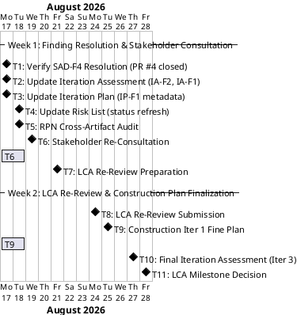
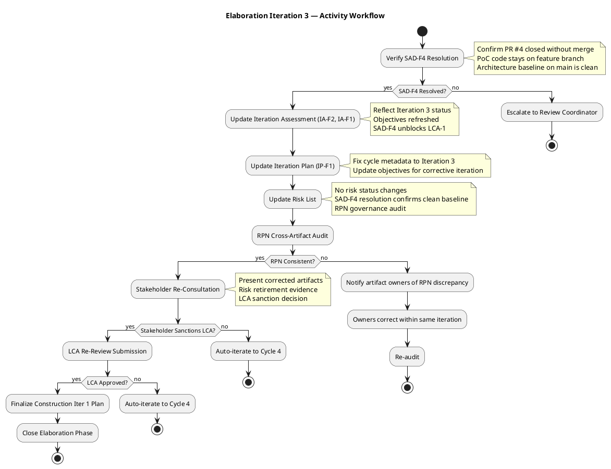

## Document Control

| Field | Value |
|---|---|
| Phase | Elaboration |
| Status | Draft |
| Milestone Target | LCA (Lifecycle Architecture) — Re-Review |
| Iteration | 3 (Cycle 1) |
| Author | Project Manager |
| Prior Iteration | Elaboration 2 (LCA: CONDITIONAL NO-GO — auto-iterate to Cycle 3) |
| Findings Addressed | IP-F1 (Minor — cycle metadata corrected to Iteration 3); SAD-F4 (Critical) RESOLVED by Software Architect — architecture baseline clean |
| Iteration Type | Corrective — resolve remaining open findings (SAD-F4 resolved, IA-F2/IA-F1 being resolved), stakeholder re-consultation, LCA re-review |

## Iteration Objectives

1. **Verify SAD-F4 (Critical) resolution** — Confirm PR #4 closed without merging, PoC code stays on feature branch `poc/E1-risk-t01-offline-sync`, architecture baseline on main is clean. This unblocks LCA-1 (Architecture Stable).
2. **Resolve IA-F2 (Major) and IA-F1 (Minor)** — Update Iteration Assessment to reflect Iteration 3 status with SAD-F4 resolution, refreshed objectives, and updated LCA criteria assessment.
3. **Resolve IP-F1 (Minor)** — Fix cycle/iteration metadata in Iteration Plan Document Control (this update).
4. **Re-consult stakeholder for LCA sanction** — Present corrected artifacts and risk retirement evidence (RISK-T01/T03 PoC validated, RISK-T05 retired, SAD-F4 resolved) to stakeholder for LCA sanction decision.
5. **Pass LCA re-review** — All 4 LCA exit criteria met: architecture baselined (SAD-F4 resolved), critical risks mitigated, Construction plan credible, stakeholder sanction granted.

## Plan and Milestones

### Project Context — Coarse Cross-Iteration Roadmap

This section carries the coarse-grained project roadmap. Fine-grained Gantt details are provided ONLY for the current iteration. Subsequent iterations receive fine-grained plans when they become the current or next iteration.

#### Milestone Schedule

| Milestone | Full Name | Target Date | Phase Boundary |
|---|---|---|
| LCO | Lifecycle Objective | 2026-07-17 | End of Inception — **ACHIEVED** |
| LCA | Lifecycle Architecture | 2026-08-28 | End of Elaboration — **RE-REVIEW** (prior: CONDITIONAL NO-GO, Iter 2) |
| IOC | Initial Operational Capability | 2026-09-11 | End of Construction |
| PR | Product Release | 2026-09-25 | End of Transition |

#### Iteration Roadmap (6 ± 3 Rule Applied)

| Phase | Iteration | Duration | Calendar Window | Primary Focus | Status |
|---|---|---|---|---|---|
| Inception | 1 | 1 week | Jul 6 – Jul 7 | Scope, risks, architecture candidate, UC model (initial) | Complete |
| Inception | 2 | 1.5 weeks | Jul 8 – Jul 17 | Corrective: resolve F1–F3, S2; LCO re-assessment | Complete (LCO: GO) |
| Elaboration | 1 | 2 weeks | Jul 20 – Jul 31 | Architecture baseline validation, design model, data model, test strategy | Complete (LCA: CONDITIONAL NO-GO) |
| Elaboration | 2 | 2 weeks | Aug 3 – Aug 14 | Corrective — resolve 6 findings, RPN governance, stakeholder re-consultation | Complete (LCA: CONDITIONAL NO-GO) |
| Elaboration | 3 | 2 weeks | Aug 17 – Aug 28 | **CURRENT**: Corrective — verify SAD-F4 resolution, resolve IA-F2/IA-F1/IP-F1, stakeholder re-consultation, LCA re-review | In Progress |
| Construction | 1 | 2 weeks | Aug 31 – Sep 11 | Implement UC-001 (Clock In/Out + offline), UC-005 (Read News), AD auth spike | Planned |
| Construction | 2 | 2 weeks | Sep 14 – Sep 25 | Implement UC-003 (Directory), UC-004 (Publish News); integration; load testing | Planned |
| Transition | 1 | 2 weeks | Sep 28 – Oct 9 | Deploy to Windows Server; UAT; adoption tracking | Planned |

**Total: 8 iterations** — within the 6 ± 3 rule (high end justified by corrective iterations in both Inception and Elaboration). Distribution: [2, 3, 2, 1] across phases.

#### Rubber Profile Justification

| Phase | Schedule % | Iteration Count % | Justification |
|---|---|---|---|
| Inception | 12% | 25% (2 of 8) | Stretched for stakeholder design file resolution + LCO corrective iteration |
| Elaboration | 38% | 38% (3 of 8) | Stretched for SAD-F4 (Critical) resolution + LCA re-review cycles. High architectural risk (offline sync, AD integration) justifies extra iteration. |
| Construction | 38% | 25% (2 of 8) | Compressed — internal deployment, no user training required, well-defined scope |
| Transition | 12% | 12% (1 of 8) | Standard — internal deployment with UAT |

#### Fine Gantt — Elaboration Iteration 3 (Aug 17 – Aug 28)

#### Iteration 3 Activity Workflow

## Resources

### Agent Role Effort Allocation — Elaboration Iteration 3 (Cycle 3)

| Role | Effort (days) | Concurrent Period | Key Deliverables |
|---|---|---|---|
| ProjectManager | 5d | Aug 17-18, Aug 24-28 | Risk List (status refresh), RPN audit, IA update (IA-F2/IA-F1), IP update (IP-F1), LCA re-review package, stakeholder re-consultation |
| SoftwareArchitect | 1d | Aug 17 | SAD-F4 verification (PR #4 closed), PoC-F1 correction (if not already resolved) |
| ReviewCoordinator | 1d | Aug 28 | LCA re-review verdict |

**Total effort: 7 role-days across 10 calendar days (Aug 17 – Aug 28).** Peak concurrency: 2 roles on Aug 17 (PM, ARCH). Week 2 is PM-dominated (re-review preparation + stakeholder consultation). Effort is lower than Iter 2 (14 role-days) because most findings are already resolved — only SAD-F4 verification and PM artifact updates remain.

### Infrastructure Resources

| Resource | Status | Notes |
|---|---|---|
| Git/SCM repository | Active | IARI branching strategy published to main; PR #4 must be closed without merging |
| .NET 10 SDK | Available | Per stakeholder constraint |
| PostgreSQL 16 | Available | Per SAD technology stack |
| SQLite | Available | For offline local store (EF Core Sqlite 10.0.9) |
| Windows Server | Pending | Coordinate with Miguel Torres for Construction deployment |
| CI/CD (GitHub Actions) | Available | Workflows configured per IARI baseline |

## Use Cases and Scenarios Addressed

### Corrective Scope — No New UC Work

This iteration is a **corrective iteration**. No new use cases are analyzed, designed, or implemented. The scope is exclusively finding resolution and LCA re-review preparation. The UC coverage from Elaboration Iteration 1 remains valid:

| UC ID | Use Case | Elaboration Activity (from Iter 1) | Status |
|---|---|---|---|
| UC-001 | Clock In/Out | Design classes, SQLite schema, test strategy, PoC-1 validated | Complete — no corrective needed |
| UC-007 | Manage Directory | Design classes, override flag, audit log, test strategy | Complete — no corrective needed |
| UC-003 | Review and Export Clockings | Sequence validated, PostgreSQL schema | Complete — no corrective needed |
| UC-004 | Publish News | Sequence diagram, audit trail mechanism | Complete — no corrective needed |
| UC-005 | Read News | Sequence diagram, Razor Page layout mapping | Complete — no corrective needed |
| UC-006 | Search Directory | Sequence diagram, Razor Page layout mapping | Complete — no corrective needed |
| UC-002 | View Clocking History | Refined in UC model | Complete — no corrective needed |

### Construction Iteration Scope Preview (Unchanged from Iter 1)

| Construction Iteration | UCs for Implementation | Rationale |
|---|---|---|
| Construction 1 (Aug 31-Sep 11) | UC-001 (Clock In/Out + offline), UC-005 (Read News), AD auth spike | UC-001 is highest risk — implement first with offline sync PoC. UC-005 is simple and provides early visible functionality. AD auth spike validates IAuthProvider. |
| Construction 2 (Sep 14-Sep 25) | UC-003 (Review/Export), UC-004 (Publish News), UC-006 (Search Directory), UC-007 (Manage Directory) | Remaining UCs. Directory UCs exercise AD sync. Load testing validates performance and concurrency risks. |

## Evaluation Criteria

### Iteration Exit Criteria — Elaboration Iteration 3 (Cycle 3)

| # | Criterion | Measurement | Target | Decision Enabled |
|---|---|---|---|---|
| 1 | SAD-F4 (Critical) resolved | PR #4 status check | CLOSED (no merge) | Whether architecture baseline can be declared stable (CR-1) |
| 2 | IA-F2 (Major) resolved | Iteration Assessment review | Updated for Iteration 3 with current objectives status | Whether LCA criteria can be verified from PM perspective |
| 3 | IA-F1 (Minor) resolved | Iteration Assessment review | Objectives status reflects Iteration 3 state | Whether iteration completion can be assessed |
| 4 | IP-F1 (Minor) resolved | Iteration Plan Document Control | Iteration = 3, metadata correct | Whether plan is internally consistent |
| 5 | RPN consistency across all artifacts | Cross-artifact RPN audit | 100% match with Risk List canonical values | Whether risk retirement can be verified (CR-2) |
| 6 | Stakeholder sanction obtained | Stakeholder consultation record | Sanction granted | Whether LCA can be achieved (CR-4) |
| 7 | LCA re-review verdict | Review Coordinator assessment | GO | Whether Construction can begin |

### LCA Milestone Exit Criteria (Re-Review — Aug 28)

| Criterion | Source | Status (entering Cycle 3) | Target (end of Cycle 3) |
|---|---|---|---|
| CR-1: Architecture baselined | SAD | MET (SAD-F4 RESOLVED — PR #4 closed, main is clean) | MET — preserved |
| CR-2: Critical risks mitigated | Risk List + PoC | PARTIALLY_MET (3 of 6 retired/validated, 2 deferred with mitigation) | MET — risk register stable, no escalation |
| CR-3: Construction plan credible | Iteration Plan | MET (MR assessed PASS in Iter 2) | MET — preserved, SAD-F4 unblocked |
| CR-4: Stakeholder sanction | Stakeholder | NOT_MET (prior refusal stands) | MET — stakeholder re-consulted with corrected evidence + SAD-F4 resolution |

## Traceability

| Element | Traces From | Link Type | Traces To |
|---|---|---|---|
| Cycle 3 Objectives | Review Record (Findings: SAD-F4, IA-F2, IA-F1, IP-F1), Iteration Assessment (Iter 2) | Derives | LCA Re-Review, Construction Iter 1 Plan |
| T1 (SAD-F4 Verification) | SAD-F4 (Review Record) | Reviews | Software Architecture Document (corrected) |
| T2 (IA Update) | IA-F2, IA-F1 (Review Record) | Reviews | Iteration Assessment (corrected) |
| T3 (IP Metadata Fix) | IP-F1 (Review Record) | Reviews | Iteration Plan (corrected) |
| T4 (Risk List Refresh) | SAD-F4 resolution, RPN governance protocol | Reviews | Risk List (status confirmed) |
| T5 (RPN Audit) | RL-F1, MR-RL-F1 (Review Record), Risk List (canonical RPN) | Reviews | All downstream RPN consumers |
| T6 (Stakeholder Re-Consultation) | LCA CR-4, Iteration Assessment (Iter 2) | Derives | LCA Milestone Verdict, Construction Entry |
| T8 (LCA Re-Review) | All LCA exit criteria | Derives | LCA Milestone Decision |
| Construction Schedule | SAD Integration Order, UC Prioritization, Risk List | Derives | Construction Iter 1 Plan, Construction Iter 2 Plan |
| Evaluation Criteria | Acceptance Criteria (stakeholder), LCA exit criteria | Derives | LCA Milestone Re-Review |
| UC-001 tasks (Iter 1, preserved) | RISK-T01 (RPN 63), RISK-T03 (RPN 48) | Derives | Construction PoC, Design Model |
| UC-007 tasks (Iter 1, preserved) | RISK-T02 (RPN 35), RISK-R01 (RPN 30) | Derives | Construction AD spike, Design Model |