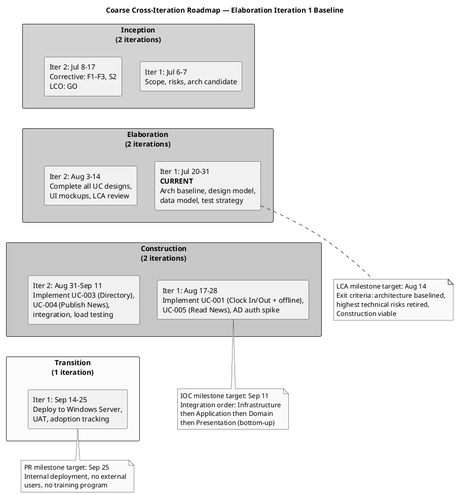
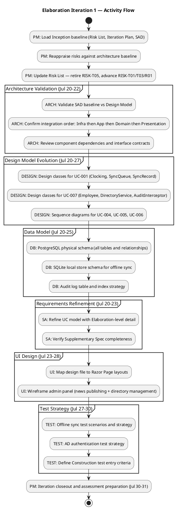

## Document Control
| Field | Value |
|---|---|
| Phase | Elaboration |
| Status | Draft |
| Milestone Target | End of Elaboration (LCA) |
| Iteration | 1 (Cycle 1) |
| Author | Project Manager |
| Prior Iteration | Inception 2 (LCO approved — GO verdict, 2026-07-07) |

## Iteration Objectives

1. **Validate architecture baseline against Design Model** — Software Architect confirms SAD 4+1 views align with Design Model classes, interfaces, and component contracts. Integration order (Infrastructure → Application → Domain → Presentation) confirmed for Construction planning.
2. **Evolve Design Model for all architecturally significant UCs** — Designer produces design classes for UC-001 (Clocking, SyncQueue, SyncRecord) and UC-007 (Employee, DirectoryService, AuditInterceptor). Sequence diagrams for UC-004, UC-005, UC-006 complete the Use-Case View coverage.
3. **Baseline physical data model** — Database Designer produces PostgreSQL physical schema (all tables, relationships, indexes), SQLite local store schema for offline sync, and audit log table design.
4. **Refine Use-Case Model and Supplementary Spec** — System Analyst adds Elaboration-level detail to UC flows; verifies Supplementary Spec completeness against SAD mechanisms.
5. **Map UI design to implementation structure** — UI Designer maps stakeholder design file to Razor Page layouts; wireframes admin panel for news publishing and directory management.
6. **Define Construction test entry criteria** — Test Designer produces test strategy for offline sync and AD auth scenarios; defines entry criteria for Construction iteration test activities.
7. **Update Risk List** — Project Manager retires resolved risks (RISK-T05), advances risk statuses based on architecture baseline, identifies new risks (RISK-T06: SQLite concurrency).
8. **Baseline coarse roadmap for Construction** — Refine Construction iteration schedule with baselined integration order, agent role assignments, and cost estimates from stakeholder data.

## Plan and Milestones

### Project Context — Coarse Cross-Iteration Roadmap

This section carries the coarse-grained project roadmap. Fine-grained Gantt details are provided ONLY for the current iteration. Subsequent iterations receive fine-grained plans when they become the current or next iteration.

#### Milestone Schedule

| Milestone | Full Name | Target Date | Phase Boundary |
|---|---|---|---|
| LCO | Lifecycle Objective | 2026-07-17 | End of Inception — **ACHIEVED** |
| LCA | Lifecycle Architecture | 2026-08-14 | End of Elaboration |
| IOC | Initial Operational Capability | 2026-09-11 | End of Construction |
| PR | Product Release | 2026-09-25 | End of Transition |

#### Iteration Roadmap (6 ± 3 Rule Applied)

| Phase | Iteration | Duration | Calendar Window | Primary Focus | Status |
|---|---|---|---|---|---|
| Inception | 1 | 1 week | Jul 6 – Jul 7 | Scope, risks, architecture candidate, UC model (initial) | Complete |
| Inception | 2 | 1.5 weeks | Jul 8 – Jul 17 | Corrective: resolve F1–F3, S2; LCO re-assessment | Complete (LCO: GO) |
| Elaboration | 1 | 2 weeks | Jul 20 – Jul 31 | **CURRENT**: Architecture baseline validation, design model, data model, test strategy | In Progress |
| Elaboration | 2 | 2 weeks | Aug 3 – Aug 14 | Complete design for all UCs; UI mockups; LCA review | Planned |
| Construction | 1 | 2 weeks | Aug 17 – Aug 28 | Implement UC-001 (Clock In/Out + offline), UC-005 (Read News), AD auth spike | Planned |
| Construction | 2 | 2 weeks | Aug 31 – Sep 11 | Implement UC-003 (Directory), UC-004 (Publish News); integration; load testing | Planned |
| Transition | 1 | 2 weeks | Sep 14 – Sep 25 | Deploy to Windows Server; UAT; adoption tracking | Planned |

**Total: 7 iterations** — within the 6 ± 3 rule (high end justified by corrective iteration). Distribution: [2, 2, 2, 1] across phases.

#### Rubber Profile Justification

| Phase | Schedule % | Iteration Count % | Justification |
|---|---|---|---|
| Inception | ~15% | ~29% (2 of 7) | Stretched from 10% — corrective iteration required for LCO findings (F1–F3, S2). **Complete.** |
| Elaboration | ~30% | ~29% (2 of 7) | Stretched — offline fault tolerance (RPN 63) and AD integration (RPN 35) are high-magnitude risks requiring architecture baseline + PoC validation. Architecture now baselined in SAD. |
| Construction | ~33% | ~29% (2 of 7) | Compressed from 50% — 3 use cases are moderate complexity; .NET 10 + Razor Pages is well-understood. Integration order baselined: Infrastructure → Application → Domain → Presentation. |
| Transition | ~17% | ~14% (1 of 7) | Compressed — internal deployment, no external users, no training program. |

#### Agent Role Assignment Profile — Elaboration

| Role | Elaboration Iter 1 | Elaboration Iter 2 | Construction Iter 1 | Construction Iter 2 | Transition |
|---|---|---|---|---|---|
| SystemAnalyst | Medium | Low | — | — | — |
| SoftwareArchitect | **High** | Medium | — | — | — |
| ProjectManager | Medium | Medium | Medium | Medium | **High** |
| Designer | **High** | **High** | Low | — | — |
| DatabaseDesigner | Medium | Low | Medium | — | — |
| UIDesigner | Medium | Medium | — | — | — |
| TestDesigner | Medium | Medium | **High** | **High** | **High** |
| Implementer | — | — | **High** | **High** | Low |
| Deployer | — | — | — | — | **High** |
| Business Modeling | INACTIVE | INACTIVE | INACTIVE | INACTIVE | INACTIVE |

**Parallelism note:** Maximum concurrent roles in Elaboration Iteration 1 = 7 (SystemAnalyst, SoftwareArchitect, Designer, DatabaseDesigner, UIDesigner, TestDesigner, ProjectManager). This is justified by the need to produce Design Model, Data Model, UI mapping, and Test Strategy in parallel against the baselined SAD. No further parallelism increase is planned — coordination overhead would exceed marginal benefit.

#### Construction Schedule — Baselined

The Construction schedule is baselined here for the first time, based on the SAD's integration order and UC prioritization. Fine-grained Gantt for Construction iterations will be produced when each becomes the current or next iteration.

| Construction Iteration | Window | UCs Implemented | Integration Phase | Key Risks Confronted |
|---|---|---|---|---|
| Construction 1 | Aug 17 – Aug 28 | UC-001 (Clock In/Out + offline sync), UC-005 (Read News), AD auth spike | Infrastructure → Application → Domain → Presentation (UC-001 + UC-005 vertical slice) | RISK-T01 (PoC), RISK-T03 (sync conflict), RISK-T02 (AD spike) |
| Construction 2 | Aug 31 – Sep 11 | UC-003 (Review/Export Clockings), UC-004 (Publish News), UC-006 (Search Directory), UC-007 (Manage Directory) | Complete remaining vertical slices; integration testing; load testing | RISK-T04 (performance), RISK-T06 (SQLite concurrency), RISK-R01 (AD schema) |

**Integration order rationale (from SAD):** Bottom-up per SAD Implementation View — Infrastructure (AD auth, persistence, export, health monitor) → Application (services, interceptors) → Domain (aggregates, value objects) → Presentation (Razor Pages). Each UC is implemented as a vertical slice through all layers, but infrastructure components are built first as they are shared dependencies.

### Coarse Roadmap — Milestones and Iteration Flow

### Fine-Grained Plan — Elaboration Iteration 1 (Jul 20 – Jul 31)

#### Activity Flow

#### Task Summary

| Task ID | Task | Owner Role | Duration | Start | End | Dependencies | Risk Confronted |
|---|---|---|---|---|---|---|---|
| T1 | Update Risk List (retire T05, advance T01/T03/R01, new T06) | ProjectManager | 1d | Jul 20 | Jul 20 | — | RISK-T01, T03, T05, T06 |
| T2 | Evolve Iteration Plan (coarse roadmap + fine Gantt) | ProjectManager | 2d | Jul 20 | Jul 21 | — | — |
| T3 | Validate SAD baseline vs Design Model alignment | SoftwareArchitect | 2d | Jul 20 | Jul 21 | — | RISK-T01, T03 |
| T4 | Confirm integration order & component dependencies | SoftwareArchitect | 1d | Jul 22 | Jul 22 | T3 | — |
| T5 | Review Design Model alignment with SAD interfaces | SoftwareArchitect | 2d | Jul 24 | Jul 25 | T6, T7 | — |
| T6 | Design classes for UC-001 (Clocking, SyncQueue, SyncRecord) | Designer | 3d | Jul 20 | Jul 22 | — | RISK-T01, T03 |
| T7 | Design classes for UC-007 (Employee, DirectoryService, AuditInterceptor) | Designer | 3d | Jul 23 | Jul 25 | T6 | RISK-R01 |
| T8 | Sequence diagrams for UC-004, UC-005, UC-006 | Designer | 2d | Jul 28 | Jul 29 | T7 | — |
| T9 | PostgreSQL physical schema (all tables, relationships) | DatabaseDesigner | 3d | Jul 20 | Jul 22 | — | — |
| T10 | SQLite local store schema for offline sync | DatabaseDesigner | 2d | Jul 23 | Jul 24 | T9 | RISK-T01 |
| T11 | Audit log table and index strategy | DatabaseDesigner | 1d | Jul 25 | Jul 25 | T9 | — |
| T12 | Refine UC model with Elaboration-level detail | SystemAnalyst | 2d | Jul 20 | Jul 21 | — | — |
| T13 | Verify Supplementary Spec completeness | SystemAnalyst | 1d | Jul 22 | Jul 22 | T12 | — |
| T14 | Map design file to Razor Page layouts | UIDesigner | 2d | Jul 23 | Jul 24 | T12 | RISK-S02 |
| T15 | Wireframe admin panel (news + directory) | UIDesigner | 2d | Jul 27 | Jul 28 | T14 | — |
| T16 | Offline sync test scenarios and strategy | TestDesigner | 2d | Jul 27 | Jul 28 | T6, T10 | RISK-T01, T03 |
| T17 | AD authentication test strategy | TestDesigner | 1d | Jul 29 | Jul 29 | T7 | RISK-T02 |
| T18 | Define Construction test entry criteria | TestDesigner | 1d | Jul 30 | Jul 30 | T16, T17 | — |
| T19 | Iteration closeout & assessment preparation | ProjectManager | 1d | Jul 30 | Jul 30 | T5, T8, T11, T13, T15, T18 | — |

#### Risk-to-Task Mapping

| Risk ID | RPN | Magnitude | Tasks Confronting This Risk | Status After Iteration |
|---|---|---|---|---|
| RISK-T01 | 63 | High | T3 (SAD validation), T6 (UC-001 design), T10 (SQLite schema), T16 (test strategy) | Architecture Addressed — PoC in Construction |
| RISK-T03 | 48 | High | T3 (SAD validation), T6 (SyncQueue design), T16 (sync test strategy) | Architecture Addressed — PoC in Construction |
| RISK-T02 | 35 | Significant | T7 (UC-007 design with IAuthProvider), T17 (AD auth test strategy) | Mitigation Planned — spike in Construction |
| RISK-R01 | 30 | Significant | T7 (override flag design), T11 (audit log) | Architecture Addressed — implementation in Construction |
| RISK-T06 | 24 | Significant | T10 (SQLite schema), T16 (concurrency test scenarios) | Identified — load test in Construction |
| RISK-S02 | 24 | Significant | T14 (UI mapping from design file) | Mitigation Planned — adoption tracking in Transition |
| RISK-T05 | 24 | Significant | T1 (retire as Resolved) | Resolved — design file incorporated |

## Resources

### Agent Role Effort Allocation — Elaboration Iteration 1

| Role | Effort (days) | Concurrent Period | Key Deliverables |
|---|---|---|---|
| ProjectManager | 4d | Jul 20-21, Jul 30 | Risk List (evolved), Iteration Plan (evolved), Iteration Assessment prep |
| SoftwareArchitect | 5d | Jul 20-22, Jul 24-25 | SAD validation report, integration order confirmation, Design Model review |
| Designer | 8d | Jul 20-29 | Design Model (UC-001 + UC-007 classes), sequence diagrams (UC-004/005/006) |
| DatabaseDesigner | 6d | Jul 20-25 | PostgreSQL schema, SQLite schema, audit log table |
| SystemAnalyst | 3d | Jul 20-22 | Refined UC Model, Supplementary Spec verification |
| UIDesigner | 4d | Jul 23-28 | Razor Page layout mapping, admin panel wireframes |
| TestDesigner | 4d | Jul 27-30 | Offline sync test strategy, AD auth test strategy, Construction entry criteria |

**Total effort: 34 role-days across 10 calendar days (Jul 20 – Jul 31).** Peak concurrency: 4 roles in Week 1 (PM, ARCH, DESIGN, DB, SA), 5 roles in Week 2 (ARCH, DESIGN, UI, TEST, PM).

### Infrastructure Resources

| Resource | Status | Notes |
|---|---|---|
| Git/SCM repository | Active | IARI branching strategy published to main |
| .NET 10 SDK | Available | Per stakeholder constraint |
| PostgreSQL 16 | Available | Per SAD technology stack |
| SQLite | Available | For offline local store (EF Core Sqlite 10.0.9) |
| Windows Server | Pending | Coordinate with Miguel Torres for Construction deployment |
| CI/CD (GitHub Actions) | Available | Workflows configured per IARI baseline |

## Use Cases and Scenarios Addressed

### Elaboration Iteration 1 — UC Coverage

| UC ID | Use Case | Elaboration Activity | Architectural Significance | Risk Addressed |
|---|---|---|---|---|
| UC-001 | Clock In/Out | Design classes (Clocking, SyncQueue, SyncRecord); sequence validated in SAD; SQLite schema; test strategy | **Critical** — offline fault tolerance mechanism | RISK-T01 (63), RISK-T03 (48) |
| UC-007 | Manage Directory | Design classes (Employee, DirectoryService, AuditInterceptor); override flag mechanism; audit log table; test strategy | **High** — AD sync + audit trail | RISK-R01 (30), RISK-T02 (35) |
| UC-003 | Review and Export Clockings | Sequence validated in SAD; PostgreSQL schema includes clocking tables | **High** — CSV export, sync'd data reads | RISK-T04 (15) |
| UC-004 | Publish News | Sequence diagram (to be produced by Designer); audit trail mechanism | Medium — audit trail, HR authorization | — |
| UC-005 | Read News | Sequence diagram (to be produced); Razor Page layout mapping | Medium — category filtering, page load | RISK-S02 (24) |
| UC-006 | Search Directory | Sequence diagram (to be produced); Razor Page layout mapping | Medium — search, <10s target | — |
| UC-002 | View Clocking History | Refined in UC model; depends on sync integrity | Low — reads current-month clockings | — |

### Construction Iteration Scope Preview (Coarse)

| Construction Iteration | UCs for Implementation | Rationale |
|---|---|---|
| Construction 1 (Aug 17-28) | UC-001 (Clock In/Out + offline), UC-005 (Read News), AD auth spike | UC-001 is highest risk — implement first with offline sync PoC. UC-005 is simple and provides early visible functionality. AD auth spike validates IAuthProvider. |
| Construction 2 (Aug 31-Sep 11) | UC-003 (Review/Export), UC-004 (Publish News), UC-006 (Search Directory), UC-007 (Manage Directory) | Remaining UCs. Directory UCs exercise AD sync. Load testing validates performance and concurrency risks. |

## Evaluation Criteria

### Iteration Exit Criteria — Elaboration Iteration 1

| # | Criterion | Measurement | Target | Decision Enabled |
|---|---|---|---|---|
| 1 | Design Model covers all 7 UCs | Count of UCs with design classes and/or sequence diagrams | 7 of 7 | Whether Construction can begin implementation |
| 2 | PostgreSQL physical schema complete | Schema review against SAD Data View | 100% table coverage | Whether DatabaseDesigner can proceed to Construction |
| 3 | SQLite local store schema complete | Schema review against SAD offline sync design | Complete | Whether offline PoC can proceed in Construction |
| 4 | Risk List updated with Elaboration statuses | Risk register review | All risks have current status | Whether LCA review can assess risk retirement |
| 5 | Construction test entry criteria defined | Test strategy document review | Criteria documented | Whether TestDesigner can begin Construction test planning |
| 6 | SAD baseline validated against Design Model | Architect review sign-off | Alignment confirmed | Whether architecture is stable for Construction |
| 7 | Coarse roadmap baselined for Construction | Roadmap review against SAD integration order | Schedule confirmed | Whether Construction iterations can be fine-planned |

### LCA Milestone Exit Criteria (End of Elaboration — Aug 14)

| Criterion | Source | Status |
|---|---|---|
| Architecture baselined (all 4+1 views) | SAD | **Achieved** (Elaboration Iter 1) |
| Highest technical risks retired or mitigated | Risk List | RISK-T01/T03: Architecture Addressed (PoC in Construction); RISK-T02: Mitigation Planned (spike in Construction) |
| Construction is viable | Iteration Plan + SAD | Construction schedule baselined; integration order confirmed; UC prioritization set |
| Design Model complete for all UCs | Design Model | In progress (Iter 1: UC-001, UC-007; Iter 2: remaining UCs) |
| Data model baselined | Database Design | In progress (Iter 1: PostgreSQL + SQLite schema) |

## Traceability

| Element | Traces From | Link Type | Traces To |
|---|---|---|---|
| Elaboration Iter 1 Objectives | Inception Iteration Assessment, SAD baseline, Risk List | Derives | Iteration Assessment (end of Elab Iter 1) |
| Coarse Roadmap (Construction) | SAD Integration Order, UC Prioritization | Derives | Construction Iteration Plans (fine-grained when current) |
| Task T3-T5 | SAD baseline (4+1 views) | Derives | Design Model (alignment validation) |
| Task T6-T8 | SAD UC-001/UC-007 sequences, SAD component model | Derives | Design Model (UC-001, UC-007 classes) |
| Task T9-T11 | SAD Data View, SAD offline sync design | Derives | Database schema (PostgreSQL + SQLite) |
| Task T12-T13 | Use-Case Model (Inception), Supplementary Spec | Derives | Refined UC Model (Elaboration detail) |
| Task T14-T15 | Stakeholder design file (S2), SAD Presentation components | Derives | UI layout mapping, admin wireframes |
| Task T16-T18 | SAD offline sync mechanism, SAD AD auth mechanism | Derives | Test strategy (Construction entry criteria) |
| Risk-to-Task Mapping | Risk List (Elaboration Iter 1) | Derives | Iteration Assessment (risk confrontation evidence) |
| Construction Schedule | SAD Integration Order, UC Prioritization, Risk List | Derives | Construction Iter 1 Plan, Construction Iter 2 Plan |
| Evaluation Criteria | Acceptance Criteria (stakeholder), LCA exit criteria | Derives | LCA Milestone Review |
| UC-001 tasks | RISK-T01 (RPN 63), RISK-T03 (RPN 48) | Derives | Construction PoC, Design Model |
| UC-007 tasks | RISK-T02 (RPN 35), RISK-R01 (RPN 30) | Derives | Construction AD spike, Design Model |