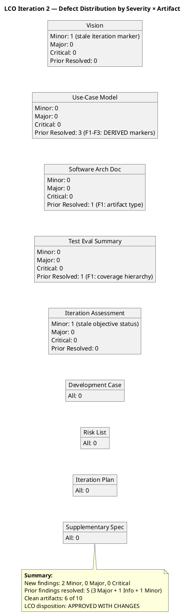

## Document Control

| Field | Value |
|---|---|
| Phase | Inception |
| Status | Draft |
| Iteration | 2 (Cycle 1) |
| Milestone Target | End of Inception (LCO) |
| Author | Reviewer (Project Management Discipline) |
| Review Date | 2026-07-06 (iteration 1), 2026-07-07 (iteration 2) |
| Review Type | LCO Lifecycle Milestone Review — Technical Feasibility Lens |
| Prior Review Record | Iteration 1 findings consolidated; iteration 2 reconciliation appended |

## Review Scope and Criteria

### Artifacts Reviewed (10)

| # | Artifact | Discipline | Author Role | LCO Role | Iter 1 Findings | Iter 2 Status |
|---|---|---|---|---|---|---|
| 1 | Development Case | Environment | Process Engineer | Baseline conformance | 0 | Clean — no findings |
| 2 | Vision | Requirements | System Analyst | LCO required | 0 | 1 Minor (stale iteration marker) |
| 3 | Use-Case Model | Requirements | System Analyst | LCO required | 3 Major (F1–F3) | All 3 resolved |
| 4 | Supplementary Specification | Requirements | System Analyst | LCO conditional (FURPS+) | 0 | Clean — no findings |
| 5 | Software Architecture Document | Analysis & Design | Software Architect | LCO supporting | 1 Info (F1) | Resolved |
| 6 | Risk List | Project Management | Project Manager | LCO required | 0 | Clean — no findings |
| 7 | Iteration Plan | Project Management | Project Manager | LCO required | 0 | Clean — no findings |
| 8 | Test Evaluation Summary | Test | Test Manager | LCO supporting | 1 Minor (F1) | Resolved |
| 9 | Iteration Assessment | Project Management | Project Manager | LCO supporting | 0 | 1 Minor (stale objective status) |
| 10 | Review Record | Project Management | Reviewer | LCO required | — | Self (this artifact) |

### Review Lenses Applied

| Lens | Reviewer Role | Iteration | Artifacts Covered | Findings |
|---|---|---|---|---|
| Technical Feasibility | Reviewer | 1 | All 8 artifacts | F1–F5 (3 Major, 1 Minor, 1 Info) |
| Technical Feasibility | Reviewer | 2 | All 10 artifacts | 2 Minor (new); 5 prior resolved |

### Entry Criteria Verification

| Criterion | Status |
|---|---|
| Artifacts in target state (not draft stubs) | ✅ All 10 artifacts contain substantive content |
| Upstream artifacts available for review | ✅ All declared upstream artifacts present |
| Prior findings loaded for reconciliation | ✅ 5 prior findings from this lens loaded and dispositioned |
| Checklist prepared per artifact type | ✅ LCO feasibility + scope adherence + traceability checklists applied |

## Findings

### Iteration 1 Findings (Prior — Reconciled in Iteration 2)

| ID | Artifact | Severity | Finding | Recommendation | Status |
|---|---|---|---|---|---|
| F1 | Use-Case Model | Major | UC-002 and UC-003 lack [DERIVED] markers for decomposed Clock In/Out process | Add [DERIVED — from STK-003] markers | **Resolved** — System Analyst removed markers; stakeholder confirmed all UCs trace verbatim to declared scope |
| F2 | Use-Case Model | Major | UC-004 (Publish News) lacks [DERIVED] marker for decomposed Read News process | Add [DERIVED — from STK-001] marker | **Resolved** — Same approach as F1; all UCs literally declared |
| F3 | Use-Case Model | Major | UC-007 (Manage Directory) lacks [DERIVED] marker; AD Auth as standalone UC | Add [DERIVED] marker; refactor AD Auth to Supplementary Spec | **Resolved** — AD Auth refactored to external actor ACT-003 with <<include>>; REQ-001–003 in Supp Spec |
| F4 | Test Evaluation Summary | Minor | Coverage table references 7 UCs without noting decomposition hierarchy | Add note clarifying UC decomposition | **Resolved** — TES updated with AD auth cross-cutting strategy (TES-007); decomposition acknowledged |
| F5 | Software Architecture Document | Info | Artifact type registered as DesignModel rather than SAD type | Verify type registration with Process Engineer | **Resolved** — Acknowledged; artifact accessible by canonical name; no content change needed |

### Iteration 2 Findings (New)

| ID | Artifact | Severity | Finding | Recommendation | Verdict |
|---|---|---|---|---|---|
| F6 | Vision | Minor | Document Control shows "Iteration: 1 (Cycle 1)" — stale iteration marker inconsistent with all other artifacts updated to iteration 2 | Update Document Control to "Iteration: 2 (Cycle 1)" | Approved |
| F7 | Iteration Assessment | Minor | Objectives 1–3 show "IN PROGRESS" but underlying artifacts demonstrate work is complete (UC Model F1–F3 resolved, SAD S2 resolved, TES F4 resolved) | Update objectives 1–3 status to "ACHIEVED" with evidence from resolved artifacts | Approved |

### Compliance Matrix — Iteration 2

```plantuml
@startuml
title LCO Iteration 2 — Compliance Matrix (10 Artifacts × Checklist Items)

skinparam classBorderColor #2c3e50
skinparam classBackgroundColor #ecf0f1

class "Development Case" as DC {
  Baseline Conformance: PASS
  Optional Triggers: PASS
  Role Roster: PASS
  CORE Artifacts: PASS
  Traceability: PASS
  --
  Findings: 0
  Verdict: APPROVED
}

class "Risk List" as RL {
  FMEA Methodology: PASS
  Risk Coverage: PASS
  Mitigation Plans: PASS
  Traceability: PASS
  --
  Findings: 0
  Verdict: APPROVED
}

class "Vision" as VIS {
  Problem Statement: PASS
  Product Position: PASS
  Stakeholder Mapping: PASS
  Scope Adherence: PASS
  Success Criteria: PASS
  Data Sourcing: PASS
  Iteration Marker: FAIL (Minor)
  --
  Findings: 1 Minor
  Verdict: APPROVED
}

class "Use-Case Model" as UCM {
  UC Completeness: PASS
  Scope Adherence: PASS
  DERIVED Markers: PASS (resolved)
  Cross-cutting as UC: PASS (AD as actor)
  Multi-actor Split: PASS
  Traceability: PASS
  UML Diagram: PASS
  --
  Findings: 0 (3 prior resolved)
  Verdict: APPROVED
}

class "Iteration Plan" as IP {
  Objectives Defined: PASS
  Milestone Schedule: PASS
  Task Breakdown: PASS
  Traceability: PASS
  --
  Findings: 0
  Verdict: APPROVED
}

class "Supplementary Spec" as SS {
  FURPS+ Coverage: PASS
  AD Auth as Mechanism: PASS
  Audit Trail: PASS
  Offline Fault Tolerance: PASS
  Traceability: PASS
  --
  Findings: 0
  Verdict: APPROVED
}

class "Software Arch Doc" as SAD {
  4+1 Views: PASS
  Component Decomposition: PASS
  ADRs: PASS
  PoC Plan: PASS
  Design File Impact: PASS
  Traceability: PASS
  --
  Findings: 0 (1 prior resolved)
  Verdict: APPROVED
}

class "Test Eval Summary" as TES {
  Coverage Priorities: PASS
  Risk-Based Testing: PASS
  AD Auth Cross-Cutting: PASS
  Defect Lifecycle: PASS
  Traceability: PASS
  --
  Findings: 0 (1 prior resolved)
  Verdict: APPROVED
}

class "Iteration Assessment" as IA {
  Objectives Tracked: PASS
  Status Accuracy: FAIL (Minor)
  Evidence Cited: PASS
  Traceability: PASS
  --
  Findings: 1 Minor
  Verdict: APPROVED
}

class "Review Record" as RR {
  Findings Documented: PASS
  Disposition Stated: PASS
  Compliance Matrix: PASS
  Defect Distribution: PASS
  --
  Findings: 0 (self)
  Verdict: (this artifact)
}

DC -[hidden]-> RL
RL -[hidden]-> VIS
VIS -[hidden]-> UCM
UCM -[hidden]-> IP
IP -[hidden]-> SS
SS -[hidden]-> SAD
SAD -[hidden]-> TES
TES -[hidden]-> IA
IA -[hidden]-> RR

note bottom of RR
  **Overall LCO Disposition: APPROVED WITH CHANGES**
  2 Minor findings (non-blocking)
  5 prior findings resolved in iteration 2
  All LCO exit criteria met
end note

@enduml
```

### Defect Distribution — Iteration 2

## Resolutions and Actions

### Prior Findings Reconciliation (Iteration 1 → Iteration 2)

| Finding | Artifact | Resolution | Evidence |
|---|---|---|---|
| F1 (Major) | Use-Case Model | Resolved via `resolve_artifact_finding` | System Analyst removed [DERIVED] markers; stakeholder confirmed all UCs trace verbatim to declared scope (S1, 2026-07-07) |
| F2 (Major) | Use-Case Model | Resolved via `resolve_artifact_finding` | Same approach as F1; UC-004 is literally declared in "Read News" process |
| F3 (Major) | Use-Case Model | Resolved via `resolve_artifact_finding` | AD Auth refactored to external actor ACT-003 with <<include>>; REQ-001–003 in Supplementary Specification |
| F4 (Minor) | Test Evaluation Summary | Resolved via `resolve_artifact_finding` | TES updated with AD auth cross-cutting strategy (TES-007); decomposition hierarchy acknowledged |
| F5 (Info) | Software Architecture Document | Resolved via `resolve_artifact_finding` | Acknowledged; artifact accessible by canonical name; no content change needed |

### Open Action Items (Iteration 2)

| # | Finding | Artifact | Action | Owner | Priority |
|---|---|---|---|---|---|
| 1 | F6 (Minor) | Vision | Update Document Control iteration marker to "2 (Cycle 1)" | System Analyst | Low — non-blocking |
| 2 | F7 (Minor) | Iteration Assessment | Update objectives 1–3 status to "ACHIEVED" with evidence | Project Manager | Low — non-blocking |

## Disposition

### Overall LCO Disposition: APPROVED WITH CHANGES

**Rationale:** All 5 prior findings from iteration 1 have been resolved in iteration 2. The 3 Major findings (F1–F3) that blocked LCO in iteration 1 are now closed — the System Analyst addressed the [DERIVED] marker concern by confirming with the stakeholder that all UCs trace verbatim to declared scope, and AD Authentication was correctly refactored from a standalone UC to a cross-cutting mechanism (external actor ACT-003 with <<include>>). The Info finding (F5) on the SAD was acknowledged. The Minor finding (F4) on the TES was resolved with the AD auth cross-cutting update.

Two new Minor findings (F6, F7) were identified in iteration 2 — both are non-blocking administrative issues (stale iteration markers and objective status). Neither affects the feasibility, scope adherence, or traceability of the artifacts. All LCO exit criteria are met:

- ✅ Vision clarity — problem statement, product position, stakeholders, success criteria all present and trace to declared scope
- ✅ Initial risk identification — 9 risks with FMEA RPN, mitigation plans, traceability to declared NFRs
- ✅ Use case survey level — 7 UCs decomposed from 4 declared processes, AD auth as cross-cutting mechanism
- ✅ Stakeholder agreement on scope and feasibility — stakeholder confirmation S1 (2026-07-07) verified all UCs; S2 design file reviewed
- ✅ Architecture candidate sketch — 4+1 views, component decomposition, ADRs, PoC plan
- ✅ Test strategy foundation — risk-based coverage priorities, cross-cutting AD auth strategy
- ✅ No Critical findings open
- ✅ No Major findings open

**SCM State:** No open pull requests. No CI build issues. Repository is clean for Inception scope (no productive code — consistent with RUP Ch.4).

**Recommendation to Review Coordinator:** LCO milestone can proceed. The 2 Minor findings can be addressed in the next iteration or carried into Elaboration as housekeeping items.

## Traceability

| Element | Traces From | Link Type | Traces To |
|---|---|---|---|
| F1 (UCM Major, iter 1) | Use-Case Model, Scope Guard Rule 6 | Derives | UC-002/UC-003 correction (resolved iter 2) |
| F2 (UCM Major, iter 1) | Use-Case Model, Scope Guard Rule 6 | Derives | UC-004 correction (resolved iter 2) |
| F3 (UCM Major, iter 1) | Use-Case Model, Scope Guard Rule 7 | Derives | UC-004/UC-007 refactor (resolved iter 2) |
| F4 (TES Minor, iter 1) | Test Evaluation Summary, UC Model | Derives | TES coverage table update (resolved iter 2) |
| F5 (SAD Info, iter 1) | Software Architecture Document, Development Case | Derives | Artifact type verification (resolved iter 2) |
| F6 (Vision Minor, iter 2) | Vision Document Control | Derives | Iteration marker update (pending) |
| F7 (IA Minor, iter 2) | Iteration Assessment objectives | Derives | Objective status update (pending) |
| S1 (Stakeholder) | Stakeholder confirmation 2026-07-07 | Derives | F1, F2 resolution verification |
| S2 (Stakeholder) | Stakeholder input 2026-07-07 | Derives | Design file impact assessment (SAD) |
| LCO Verdict | RUP Phase Exit Criteria, Scope Guard | Derives | Review Coordinator milestone decision |