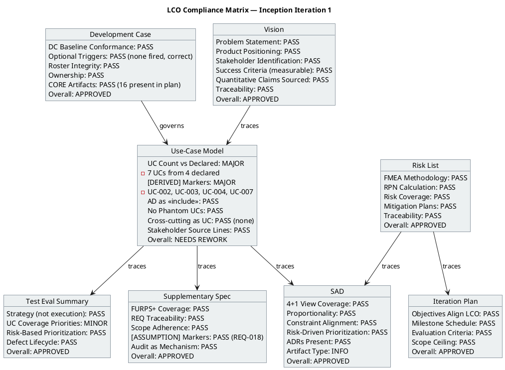
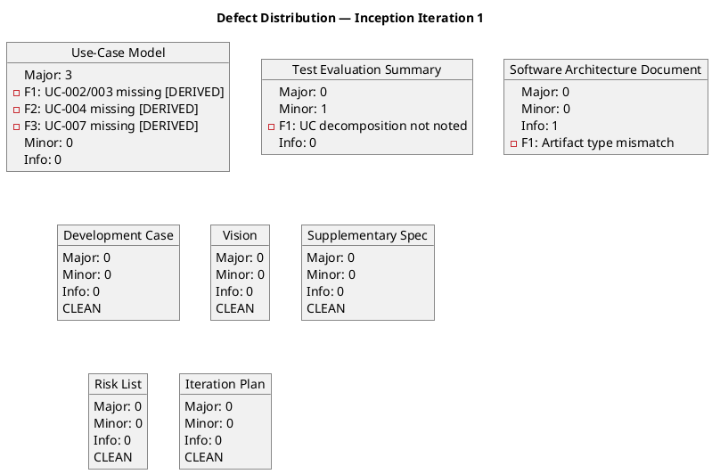

## Document Control

| Field | Value |
|---|---|
| Phase | Inception |
| Status | Draft |
| Iteration | 1 (Cycle 1) |
| Milestone Target | End of Inception (LCO) |
| Author | Reviewer (Project Management Discipline) |
| Review Date | 2026-07-06 |
| Review Type | LCO Exit Criteria — Technical Feasibility Lens |

## Review Scope and Criteria

### Artifacts Reviewed (8)

| # | Artifact | Discipline | Author Role | LCO Role |
|---|---|---|---|---|
| 1 | Development Case | Environment | Process Engineer | Baseline conformance |
| 2 | Vision | Requirements | System Analyst | LCO required |
| 3 | Use-Case Model | Requirements | System Analyst | LCO required |
| 4 | Supplementary Specification | Requirements | System Analyst | LCO conditional (FURPS+) |
| 5 | Software Architecture Document | Analysis & Design | Software Architect | LCO supporting |
| 6 | Risk List | Project Management | Project Manager | LCO required |
| 7 | Iteration Plan | Project Management | Project Manager | LCO required |
| 8 | Test Evaluation Summary | Test | Test Manager | LCO supporting |

### Review Lens

**Feasibility lens** (Inception phase): Is each artifact feasible and acceptable to stakeholders? LCO exit criteria applied: Vision clarity, initial risk identification, use case survey level, stakeholder agreement on scope and feasibility.

### Checklist Applied

- **DC Baseline Conformance**: 24-role roster, 16 CORE artifacts, 6 OPTIONAL triggers, ownership, discipline intensity
- **Scope Adherence**: Every element traces to declared Quick Start input; [DERIVED] markers on non-literal elements
- **Traceability**: Upstream/downstream references present and correct
- **UML Richness**: Diagrams present and formally correct
- **Data Source Verification**: Quantitative claims sourced or marked [ASSUMPTION]
- **Cross-cutting Mechanism Rule**: Auth/sync/audit as `<<include>>` not standalone UCs

### SCM State

No open pull requests found. S1B disposition: N/A (no PRs to dispose).

## Findings

### Compliance Matrix

### Defect Distribution

### Finding Details

| ID | Artifact | Severity | Finding | Recommendation | Verdict |
|---|---|---|---|---|---|
| F1 | Use-Case Model | Major | UC-002 (View Clocking History) and UC-003 (Review and Export Clockings) are decompositions of the single declared "Clock In/Out" use case. They lack `[DERIVED — from STK-0NN]` markers required by Rule 6. Silent promotion of derivations to declared scope. | Add `[DERIVED — from STK-003, awaiting stakeholder confirmation]` to UC-002 and UC-003 summary lines. | NeedsRework |
| F2 | Use-Case Model | Major | UC-004 (Publish News) is derived from the declared "Read News" use case. Splitting into UC-004 (Publish) and UC-005 (Read) is legitimate but UC-004 lacks `[DERIVED]` marker. | Add `[DERIVED — from STK-001, awaiting stakeholder confirmation]` to UC-004 summary line. | NeedsRework |
| F3 | Use-Case Model | Major | UC-007 (Manage Directory) is derived from the declared "Employee Directory" use case. Splitting into UC-006 (Search) and UC-007 (Manage) is legitimate but UC-007 lacks `[DERIVED]` marker. | Add `[DERIVED — from STK-001, awaiting stakeholder confirmation]` to UC-007 summary line. | NeedsRework |
| F4 | Test Evaluation Summary | Minor | Test Coverage Priority table references "7 use cases" without noting that UC-002/003/004/007 are decompositions of the 4 declared use cases. Could lead to over-allocation of test effort. | Add a note to the coverage table clarifying the decomposition hierarchy mapping back to declared scope. | Approved |
| F5 | Software Architecture Document | Info | SAD artifact registered with type "DesignModel" rather than a distinct SAD type. Content is architecturally correct; appears to be a tooling classification issue. | Verify with Process Engineer whether "DesignModel" is the correct type for SAD. If a distinct type exists, reclassify. | Approved |

### Artifacts with No Findings (Clean)

| Artifact | Summary |
|---|---|
| Development Case | DC baseline conformance verified: 24 roles intact, 16 CORE artifacts present, no optional triggers fired (correct for scope), Business Modeling INACTIVE (correct, business-process-led=false), ownership not reassigned, discipline intensity matches canonical matrix. All checks pass. |
| Vision | Problem statement clear and sourced. Product positioning well-defined. Stakeholders identified with influence levels. Success criteria measurable and trace to business goals. No unsourced quantitative claims. Traceability complete to STK/FEAT/UC. |
| Supplementary Specification | FURPS+ categories covered (Functionality, Usability, Reliability, Performance, Supportability, Design Constraints, Interfaces). REQ-001 through REQ-023 trace to declared NFRs and constraints. REQ-018 properly marked [ASSUMPTION]. Audit trail correctly modeled as cross-cutting mechanism with `<<include>>`, not as a UC. |
| Risk List | FMEA methodology properly applied. 8 risks identified with P×I=RPN. RISK-T01 (offline fault tolerance, RPN 63) correctly identified as highest priority. Mitigation strategies appropriate. Traceability to declared NFRs and constraints complete. |
| Iteration Plan | Objectives align with LCO exit criteria. Milestone schedule reasonable (LCO 2026-07-17, LCA 2026-08-14, IOC 2026-09-11, PR 2026-09-25). Evaluation criteria trace to stakeholder acceptance criteria. Scope ceiling respected. |

## Resolutions and Actions

### Open Action Items

| ID | Artifact | Action | Owner | Due |
|---|---|---|---|---|
| F1 | Use-Case Model | Add [DERIVED] markers to UC-002, UC-003 | System Analyst | Next iteration |
| F2 | Use-Case Model | Add [DERIVED] marker to UC-004 | System Analyst | Next iteration |
| F3 | Use-Case Model | Add [DERIVED] marker to UC-007 | System Analyst | Next iteration |
| F4 | Test Evaluation Summary | Add decomposition hierarchy note to coverage table | Test Manager | Next iteration (optional) |
| F5 | Software Architecture Document | Verify artifact type classification with Process Engineer | Software Architect | Next iteration (optional) |

### Prior Findings Reconciliation

No prior findings of this lens (iteration 1, cycle 1 — first review pass).

## Disposition

**Overall LCO Disposition: Approved with Changes**

The project artifacts collectively demonstrate a viable Inception baseline. The Vision is clear, the Use-Case Model captures the declared scope correctly (AD auth as `<<include>>`, no phantom UCs, no cross-cutting UCs), the Supplementary Specification covers FURPS+ comprehensively, the Risk List identifies the primary technical risk (offline fault tolerance) with appropriate RPN, the Iteration Plan aligns with LCO exit criteria, and the SAD presents a proportional candidate architecture.

The 3 Major findings all concern the same root cause: missing `[DERIVED]` markers on decomposed UCs. The decompositions themselves are legitimate — they do not expand scope beyond what the stakeholder declared. The fix is additive (adding markers), not structural. No Critical findings. No LCO blockers identified.

**Conditions for LCO approval:**
1. F1, F2, F3 (Major): Add `[DERIVED — from STK-0NN, awaiting stakeholder confirmation]` markers to UC-002, UC-003, UC-004, UC-007 in the Use-Case Model. These must be resolved before the LCO milestone can close.
2. F4, F5 (Minor/Info): Recommended improvements, not blocking.

## Traceability

| Element | Traces From | Link Type | Traces To |
|---|---|---|---|
| Review Record | All 8 project artifacts | Evaluates | LCO Milestone Decision |
| F1 (UCM Major) | Use-Case Model, Scope Guard Rule 6 | Derives | UC-002, UC-003 correction |
| F2 (UCM Major) | Use-Case Model, Scope Guard Rule 6 | Derives | UC-004 correction |
| F3 (UCM Major) | Use-Case Model, Scope Guard Rule 6 | Derives | UC-007 correction |
| F4 (TES Minor) | Test Evaluation Summary, UC Model | Derives | TES coverage table update |
| F5 (SAD Info) | Software Architecture Document, Development Case | Derives | Artifact type verification |
| DC Conformance Check | IARI DC Baseline (this prompt) | Refines | Development Case artifact |
| Scope Adherence Check | Stakeholder Quick Start (declared scope) | Refines | Use-Case Model, Vision, Supp Spec |