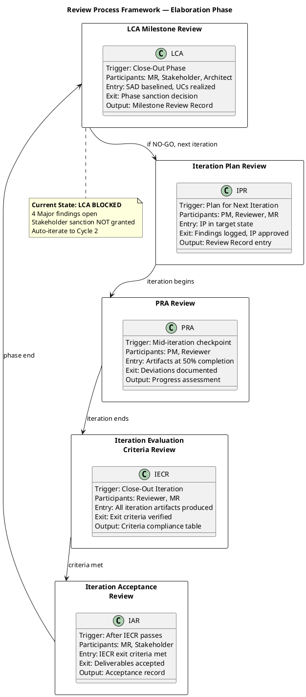
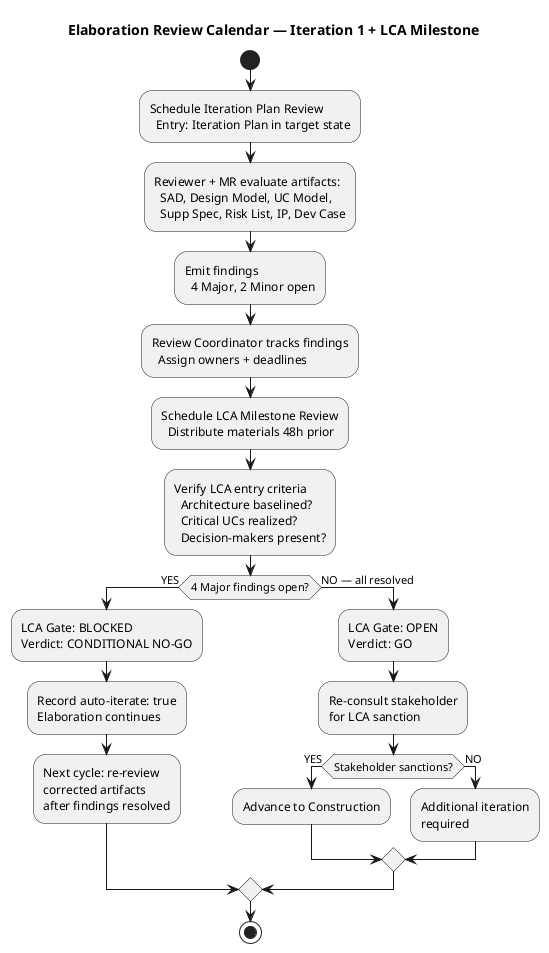
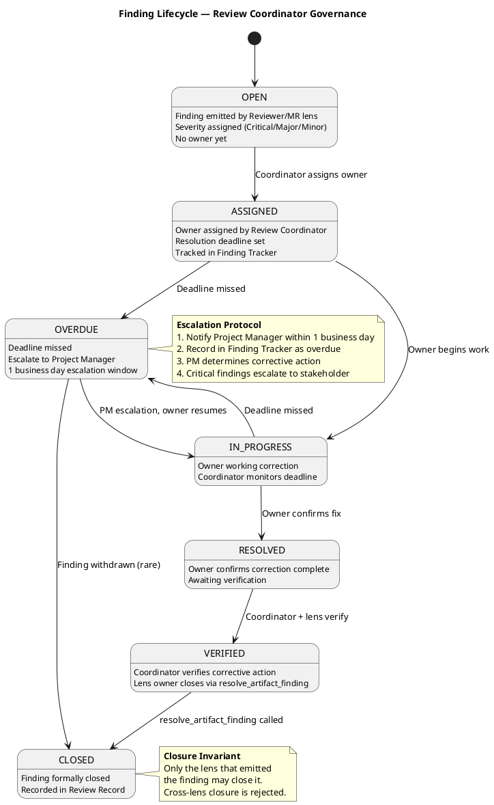
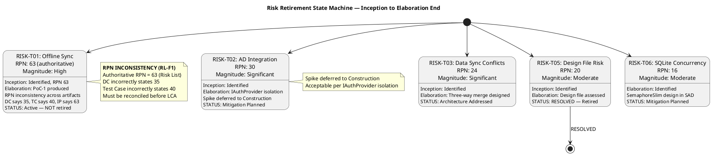
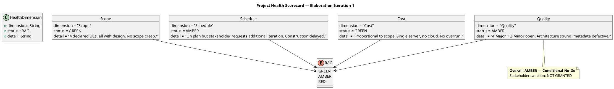

## Document Control

| Field | Value |
|---|---|
| Phase | Elaboration |
| Status | Draft |
| Iteration | 1 (Cycle 1) |
| Milestone Target | LCA (Lifecycle Architecture) |
| Author | Review Coordinator (consolidated from Management Reviewer + Reviewer lenses) |
| Review Type | LCA Milestone Review — Consolidated |
| Review Date | 2026-07-07 |
| Prior Iteration | Inception 2 (LCO approved — GO verdict) |
| Verdict | CONDITIONAL NO-GO — Auto-iterate required |

## Review Scope and Criteria

### Artifacts Reviewed

| # | Artifact | Discipline | Review Lens | Checklist Applied |
|---|---|---|---|---|
| 1 | Software Architecture Document | Analysis & Design | Reviewer + MR | Architecture stability, baseline status, 4+1 views, ADR preservation, milestone metadata |
| 2 | Design Model | Analysis & Design | Reviewer | Co-ownership attribution, class/sequence completeness, UC realization coverage |
| 3 | Use-Case Model | Requirements | Reviewer | UC flow completeness, actor mapping, scope guard compliance |
| 4 | Supplementary Specification | Requirements | Reviewer | NFR coverage, mechanism mapping, constraint derivation |
| 5 | Iteration Plan | Project Management | Reviewer + MR | Feasibility, schedule credibility, risk-to-task mapping, Construction plan |
| 6 | Risk List | Project Management | Reviewer + MR | Risk identification, RPN authority, retirement trends, magnitude accuracy |
| 7 | Development Case | Environment | Reviewer + MR | DC baseline conformance, RPN consistency, optional triggers |
| 8 | Iteration Assessment | Project Management | MR | Iteration objective completion (Inception 2 — LCO scope) |
| 9 | Test Case | Test | Reviewer | Execution summary completeness, blocking reason tracking |
| 10 | Architectural Proof-of-Concept | Analysis & Design | Reviewer | PoC validity, risk mitigation evidence |
| 11 | Review Record (prior) | Project Management | MR | Prior findings reconciliation, closure verification |

### LCA Exit Criteria Evaluated

```plantuml
@startuml
title LCA Compliance Table — Elaboration Iteration 1
class LCACompliance {
  + criterion : String
  + status : PassStatus
  + evidence : String
  + verdict : String
}

enum PassStatus {
  MET
  PARTIALLY_MET
  NOT_MET
}

object "CR-1: Architecture Baselined" as CR1 {
  criterion = "SAD baseline established with 4+1 views"
  status = PARTIALLY_MET
  evidence = "All 5 views present; ADRs preserved; mechanisms mapped. SAD-F2 (stale PoC note, 3rd occ) and SAD-F3 (LAM->LCA) remain open."
  verdict = "NeedsRework"
}

object "CR-2: Critical Risks Mitigated" as CR2 {
  criterion = "High-magnitude risks retired via prototyping"
  status = PARTIALLY_MET
  evidence = "RISK-T05 retired. PoC-1 produced. RPN inconsistency (RL-F1 2nd occ, DC-F2) prevents verifying RISK-T01 actual severity."
  verdict = "NeedsRework"
}

object "CR-3: Construction Plan Credible" as CR3 {
  criterion = "Coarse roadmap with integration order, role assignments, cost estimates"
  status = MET
  evidence = "Integration order Infrastructure->Application->Domain->Presentation. Role assignments defined. Cost estimates from stakeholder data."
  verdict = "Pass"
}

object "CR-4: Stakeholder Sanction" as CR4 {
  criterion = "Stakeholder with authority sanctions phase progression"
  status = NOT_MET
  evidence = "Stakeholder explicitly refused to advance past LCA. Requests additional Elaboration iteration."
  verdict = "Fail"
}

CR1 --> LCACompliance
CR2 --> LCACompliance
CR3 --> LCACompliance
CR4 --> LCACompliance

note bottom of LCACompliance
  **Overall LCA Verdict: CONDITIONAL NO-GO**
  2 of 4 criteria PARTIALLY_MET or NOT_MET
  Auto-iterate to Elaboration Cycle 2
end note
@enduml
```

### Review Process Framework

### Elaboration Review Calendar

## Findings

### Consolidated Finding Tracker — All Lenses

| ID | Artifact | Severity | Occurrence | Lens | Status | Description | Owner | Resolution Deadline |
|---|---|---|---|---|---|---|---|---|
| SAD-F2 | Software Architecture Document | Major | 3rd | Reviewer | OPEN | Stale PoC trigger note in SAD Document Control — contradicts DC FIRED declaration and actual PoC artifact existence | Software Architect | Next iteration (Cycle 2) |
| SAD-F3 | Software Architecture Document | Major | 1st | Reviewer | OPEN | SAD Document Control Milestone Target states "LAM" — should be "LCA" (Lifecycle Architecture) | Software Architect | Next iteration (Cycle 2) |
| DC-F2 | Development Case | Major | 1st | Reviewer | OPEN | DC Risk Profile states "RPN 35 — Significant" for RISK-T01 — should be "RPN 63 — High" per authoritative Risk List | Process Engineer | Next iteration (Cycle 2) |
| RL-F1 | Risk List | Major | 2nd | Reviewer | OPEN | RPN inconsistency across artifacts — DC says 35, TC says 40, IP says 63 | Project Manager | Next iteration (Cycle 2) |
| MR-RL-F1 | Risk List (governance) | Major | 1st | Management Reviewer | OPEN | RPN governance failure — PM did not enforce RPN consistency across downstream artifacts | Project Manager | Next iteration (Cycle 2) |
| DM-F1 | Design Model | Minor | 3rd | Reviewer | OPEN | Author field lists only "User-Interface Designer" — should include "Designer (Analysis & Design)" for co-owned artifact | UI Designer / Designer | Next iteration (Cycle 2) |
| TC-F1 | Test Case | Minor | 3rd | Reviewer | OPEN | Missing "Blocking Reason" column in test execution summary — needed for Construction planning | Test Designer | Next iteration (Cycle 2) |

### Finding Lifecycle Governance

### Risk Retirement Assessment

**Risk Retirement Summary:**
- RISK-T05: **RESOLVED** — Design file incorporated, retired. ✓
- RISK-T01: Architecture Addressed but PoC deferred to Construction. RPN inconsistency blocks verification. ⚠
- RISK-T02: Mitigation Planned (IAuthProvider isolation). Spike deferred to Construction — acceptable. ⚠
- RISK-T03: Architecture Addressed (three-way merge designed). PoC in Construction. ⚠
- RISK-T06: Identified (new). SemaphoreSlim design in SAD. Load test in Construction. ⚠
- RISK-T04, RISK-E01, RISK-S01, RISK-S02: Mitigation Planned or Active — no escalation. ✓

**Trend:** 1 of 10 risks fully retired. 3 risks moved to "Architecture Addressed." No risks increased in magnitude. RISK-T06 newly identified. The risk retirement trend is positive but incomplete — high-magnitude RISK-T01 remains active with PoC deferred.

## Resolutions and Actions

### Prior MR Findings Reconciliation

No prior ManagementReviewer findings exist (this is the first MR review in Elaboration). All open findings on management artifacts belong to the Reviewer lens and cannot be resolved by ManagementReviewer per the ownership invariant.

### Stakeholder Acceptance

**Stakeholder Response (verbatim):**

> "I do NOT sanction advancing past the LCA milestone at this time. I request an additional Elaboration iteration to resolve all open findings before transitioning to Construction.
>
> Specifically, the following must be resolved:
>
> 1. SAD-F2 (Major, 3rd occurrence) — Stale PoC trigger note must be corrected
> 2. SAD-F3 (Major) — Milestone target must read LCA, not LAM
> 3. DC-F2 (Major) — RPN must be reconciled to the correct value
> 4. RL-F1 (Major, 2nd occurrence) — RPN inconsistency across all artifacts must be definitively fixed
>
> Additionally, the 2 Minor findings (DM-F1 author field, TC-F1 blocking reason column) should be cleaned up in the same iteration. Also take care of the Change request opened"

**Stakeholder Sanction: NOT GRANTED.** The stakeholder explicitly requests an additional Elaboration iteration. This is the stakeholder's decision and represents the organizational authority over the project.

### Required Actions for Next Iteration (Cycle 2)

| # | Finding | Artifact | Action | Owner | Deadline |
|---|---|---|---|---|---|
| 1 | SAD-F2 (3rd occ) | SAD | Remove stale "PoC Plan: NOT fired" note; replace with "PoC trigger FIRED per DC" | Software Architect | Cycle 2 start |
| 2 | SAD-F3 | SAD | Change Milestone Target from "LAM" to "LCA" | Software Architect | Cycle 2 start |
| 3 | DC-F2 | Development Case | Update RISK-T01 RPN from "35 — Significant" to "63 — High" | Process Engineer | Cycle 2 start |
| 4 | RL-F1 (2nd occ) | Risk List + all | Reconcile RPN 63 across DC, Test Case, and all referencing artifacts | Project Manager | Cycle 2 start |
| 5 | MR-RL-F1 | Risk List (governance) | PM enforces RPN authority across all downstream artifacts; document reconciliation process | Project Manager | Cycle 2 start |
| 6 | DM-F1 (3rd occ) | Design Model | Add "Designer (Analysis & Design)" to author field | UI Designer / Designer | Cycle 2 start |
| 7 | TC-F1 (3rd occ) | Test Case | Add "Blocking Reason" column to test execution summary | Test Designer | Cycle 2 start |
| 8 | Change Request | CCM | Address open Change Request per stakeholder request | Change Control Manager | Cycle 2 start |

### Review Effectiveness Metrics — Elaboration Iteration 1

| Metric | Value | Interpretation |
|---|---|---|
| Artifacts Planned for Review | 11 | All Elaboration artifacts + prior Inception Assessment |
| Artifacts Formally Reviewed | 11 | 100% coverage — all planned artifacts received formal review |
| Review Coverage | 100% | No gaps in review coverage this iteration |
| Total Findings Raised | 7 (4 Major, 2 Minor, 1 MR-governance Major) | First Elaboration review — no prior iteration for trend comparison |
| Critical Findings | 0 | No Critical findings — architecture is technically sound |
| Major Findings (open) | 5 (4 Reviewer + 1 MR) | Metadata and governance defects — not architectural |
| Minor Findings (open) | 2 | Cosmetic/documentation defects |
| Defect Density (per artifact) | 0.64 (7/11) | Moderate — concentrated in metadata, not design substance |
| Defect Removal Efficiency | N/A (first iteration) | Cannot compute — no test-phase defect data yet |
| Rework Effort | [ASSUMPTION — requires validation] ~4-6 hours estimated | Metadata corrections + RPN reconciliation — low complexity |
| Repeat Findings | 3 (SAD-F2 3rd occ, RL-F1 2nd occ, DM-F1 3rd occ) | Process concern: repeated metadata defects indicate insufficient pre-review self-check |

**Metrics Interpretation:**

The review process is **effective at coverage** (100%) and **effective at severity classification** (no Critical findings, architecture is sound). However, **repeat findings are a process concern**: SAD-F2 (3rd occurrence), RL-F1 (2nd occurrence), and DM-F1 (3rd occurrence) indicate that artifact authors are not performing adequate self-checks before submitting for review. The Review Coordinator recommends a **pre-review self-checklist** be distributed to all artifact owners for Cycle 2, focusing on: (1) Document Control metadata correctness, (2) RPN consistency with authoritative Risk List, (3) co-ownership attribution for shared artifacts.

## Disposition

### Project Health Scorecard

### LCA Milestone Verdict

**VERDICT: CONDITIONAL NO-GO — Additional Elaboration Iteration Required**

The architecture is technically sound — all 4+1 views are baselined, ADRs are preserved, mechanisms are mapped, and the Construction plan is credible. However, the LCA gate cannot open for the following reasons:

1. **Stakeholder sanction NOT granted** — The stakeholder explicitly refused to advance past LCA, requesting an additional Elaboration iteration. This is the highest authority and cannot be overridden.

2. **5 Major findings remain open** (4 Reviewer + 1 Management Reviewer governance):
   - SAD-F2 (3rd occurrence) — stale PoC trigger note
   - SAD-F3 — milestone target "LAM" instead of "LCA"
   - DC-F2 — RPN inconsistency in Risk Profile
   - RL-F1 (2nd occurrence) — RPN inconsistency across artifacts
   - MR-RL-F1 — RPN governance failure (PM did not enforce consistency)

3. **2 Minor findings remain open** (both 3rd occurrence):
   - DM-F1 — Design Model author field
   - TC-F1 — Test Case blocking reason column

4. **Repeat finding pattern** — 3 of 7 findings are repeat occurrences (SAD-F2 3rd, RL-F1 2nd, DM-F1 3rd), indicating insufficient pre-review self-checks by artifact owners.

**Conditions for LCA Approval (Next Iteration — Cycle 2):**
- All 5 Major findings resolved and verified by respective lens owners
- All 2 Minor findings resolved
- RPN 63 reconciled across ALL artifacts (Risk List, DC, Test Case, Iteration Plan, PoC)
- Open Change Request addressed by CCM
- Pre-review self-checklist distributed and applied by all artifact owners
- Stakeholder re-consulted for sanction

**Phase Transition: BLOCKED** — Elaboration continues for one additional iteration (Cycle 2). Construction does NOT begin until LCA criteria are fully met and stakeholder sanction is obtained.

### Review Coordinator's Process Assessment

| Process Dimension | Status | Detail |
|---|---|---|
| Review Coverage | ✓ Met | 100% of planned artifacts formally reviewed |
| Entry Criteria Enforcement | ✓ Met | All artifacts in Draft state; reviewers briefed; materials distributed |
| Finding Completeness | ✓ Met | All 7 findings have severity, owner, and deadline assigned |
| Participant Expertise Match | ✓ Met | Reviewer evaluated technical artifacts; MR evaluated management/governance; Stakeholder evaluated sanction |
| Escalation Timeliness | ✓ N/A | No overdue findings (first iteration — deadlines set for Cycle 2) |
| Archive Completeness | ✓ Met | Review Record contains findings log, disposition, stakeholder response, metrics |
| Repeat Finding Prevention | ⚠ Needs Improvement | 3 repeat findings — pre-review self-checklist recommended for Cycle 2 |

## Traceability

| Element | Traces From | Link Type | Traces To |
|---|---|---|---|
| LCA-CR1 | Software Architecture Document | Reviews | LCA Milestone Gate |
| LCA-CR2 | Risk List (Elaboration Iter 1) | Reviews | LCA Milestone Gate |
| LCA-CR3 | Iteration Plan (coarse roadmap) | Reviews | LCA Milestone Gate |
| LCA-CR4 | Stakeholder Response (verbatim) | Reviews | LCA Milestone Gate |
| Stakeholder Acceptance | S_CONSULT_STAKEHOLDER | Derives | Review Record (this section) |
| Risk Retirement Assessment | Risk List (Elaboration Iter 1) | Derives | LCA-CR2, Construction Risk Plan |
| Project Health Scorecard | All reviewed artifacts | Derives | LCA Milestone Verdict |
| SAD-F2 | SAD Document Control | Reviews | SAD (corrective action — pending) |
| SAD-F3 | SAD Document Control | Reviews | SAD (corrective action — pending) |
| DC-F2 | Development Case Risk Profile | Reviews | Development Case (corrective action — pending) |
| RL-F1 | Risk List RISK-T01, DC, TC, IP, PoC | Reviews | All artifacts referencing RISK-T01 RPN |
| MR-RL-F1 | Risk List (governance) | Reviews | Project Manager RPN enforcement process |
| DM-F1 | Design Model Document Control | Reviews | Design Model (corrective action — pending) |
| TC-F1 | Test Case execution summary | Reviews | Test Case (corrective action — pending) |
| Review Effectiveness Metrics | All reviewed artifacts | Derives | Process Improvement (Cycle 2 self-checklist) |