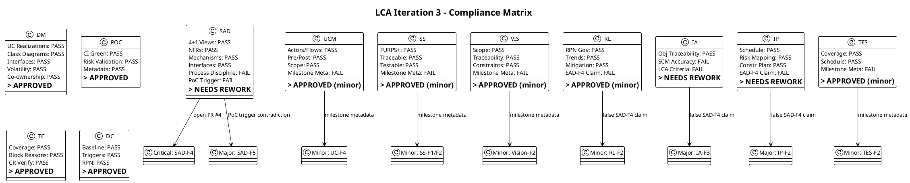
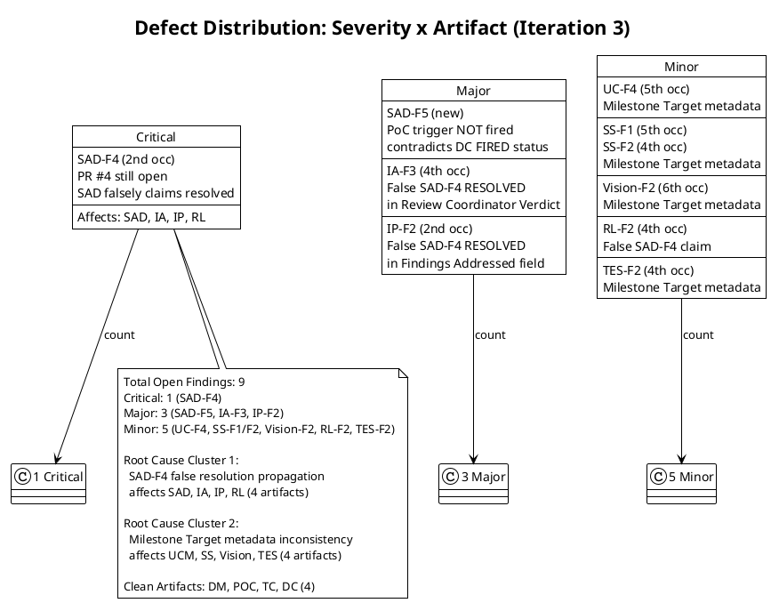

## Document Control
| Field | Value |
|---|---|
| Phase | Elaboration |
| Status | Draft |
| Iteration | 3 (Cycle 1) |
| Milestone Target | LCA (Lifecycle Architecture) |
| Author | Reviewer (technical lens) |
| Review Type | LCA Milestone Review — Technical Lens (Reviewer) |
| Review Date | 2026-07-08 |
| Prior Iteration | Elaboration 2 (LCA: CONDITIONAL NO-GO — auto-iterate required) |
| Verdict | **CONDITIONAL NO-GO — Auto-iterate required** (1 open Critical finding SAD-F4; 3 open Major findings SAD-F5, IA-F3, IP-F2; 5 open Minor findings) |

## Review Scope and Criteria

### Artifacts Reviewed (Iteration 3)

| # | Artifact | Discipline | Review Lens | Checklist Applied | Findings This Iteration |
|---|---|---|---|---|---|
| 1 | Software Architecture Document | Analysis & Design | Architecture | 4+1 views, NFRs, mechanisms, subsystem interfaces, volatility, process discipline | SAD-F4 (Critical, 2nd occ — persisting), SAD-F5 (Major — new: PoC trigger contradiction) |
| 2 | Design Model | Analysis & Design | Design | UC realizations, class diagrams, interfaces, volatility encapsulation | (none — clean) |
| 3 | Use-Case Model | Requirements | Requirements | Actors, flows, pre/post conditions, alternatives, scope adherence | UC-F4 (Minor, 5th occ — persisting) |
| 4 | Supplementary Specification | Requirements | NFR | FURPS+ quantified, traceable, testable | SS-F1 (Minor, 5th occ — persisting), SS-F2 (Minor, 4th occ — persisting) |
| 5 | Vision | Requirements | Feasibility | Scope adherence, stakeholder traceability, constraints | Vision-F2 (Minor, 6th occ — persisting) |
| 6 | Risk List | Project Management | Risk | RPN governance, retirement trends, mitigation status | RL-F2 (Minor, 4th occ — persisting) |
| 7 | Iteration Assessment | Project Management | Completion | Objective traceability, SCM state accuracy, LCA criteria | IA-F3 (Major, 4th occ — persisting) |
| 8 | Iteration Plan | Project Management | Feasibility | Schedule, risk-to-task mapping, Construction plan | IP-F2 (Major, 2nd occ — persisting) |
| 9 | Architectural Proof-of-Concept | Analysis & Design | PoC Validation | CI status, risk coverage, metadata | (none — clean) |
| 10 | Test Case | Test | Test Quality | Coverage, blocking reasons, CR verification | (none — clean) |
| 11 | Test Evaluation Summary | Test | Test Strategy | Coverage priorities, schedule, resources, acceptance criteria | TES-F2 (Minor, 4th occ — persisting) |
| 12 | Development Case | Environment | DC Baseline | Baseline conformance, optional triggers, RPN consistency | (none — clean) |

### SCM State Verified

| Item | Status | Evidence |
|---|---|---|
| Open Pull Requests | PR #4 (poc/E1-risk-t01-offline-sync → main) — **STILL OPEN** | scm_list_pull_requests confirmed |
| PR #4 Review Action | Changes requested by Reviewer (review 4654147443) | scm_request_changes_on_pull_request confirmed |
| CI Build (main) | Success (run #28940541626, 2026-07-08 11:54:19Z) | Test Case Document Control |
| CI Build (PoC branch) | Success (run #28940761467, 2026-07-08 11:58:11Z) | Test Case Document Control |

### Compliance Matrix

## Findings

### Defect Distribution

### Finding Details

#### Critical Findings

| ID | Artifact | Severity | Occurrence | Description | Remediation | Verdict |
|---|---|---|---|---|---|---|
| SAD-F4 | Software Architecture Document | Critical | 2nd | SAD Document Control claims "SAD-F4 RESOLVED (Critical)" and states "PR #4 must be closed without merging" — but PR #4 is STILL OPEN. Changes were requested by the Reviewer, but the PR has not been closed. The SAD's claim that SAD-F4 is resolved is factually incorrect. The architecture baseline on main remains clean (no merge happened), but the process discipline violation (open PR at LCA) persists until PR #4 is actually CLOSED. | Update SAD Document Control: change "SAD-F4 RESOLVED (Critical)" to "SAD-F4 PENDING (Critical) — PR #4 closure required. Changes requested on PR #4 to block merge, but PR remains open. Architecture baseline on main is clean while PR remains open, but the process discipline violation persists until PR #4 is closed." Do not claim resolution until the PR is actually closed. | NeedsRework |

#### Major Findings

| ID | Artifact | Severity | Occurrence | Description | Remediation | Verdict |
|---|---|---|---|---|---|---|
| SAD-F5 | Software Architecture Document | Major | 1st (new) | SAD Document Control Elaboration Iteration 3 Changes states "Optional artifact triggers re-checked: Architectural Proof-of-Concept trigger NOT fired this iteration." This contradicts the Development Case, which declares the PoC trigger as FIRED (resolved in DC-F1). The PoC artifact EXISTS in the project inventory. The SAD's claim that the trigger is "NOT fired this iteration" is misleading — the trigger was FIRED in a prior iteration and the PoC artifact was produced. | Correct the SAD: change "Architectural Proof-of-Concept trigger NOT fired this iteration" to "Architectural Proof-of-Concept trigger FIRED (prior iteration) — PoC-1 artifact produced and referenced. Trigger condition remains satisfied (RISK-T01 RPN 63)." | NeedsRework |
| IA-F3 | Iteration Assessment | Major | 4th | Review Coordinator Verdict states "SAD-F4 (Critical) RESOLVED" — factually incorrect. PR #4 is STILL OPEN. The assessment's objectives status is based on a false premise. This creates a misleading assessment that could cause the LCA milestone gate to open on incorrect information. | Correct the Iteration Assessment: (1) Change Review Coordinator Verdict from "SAD-F4 (Critical) RESOLVED" to "SAD-F4 (Critical) PENDING — PR #4 closure required"; (2) Update any objective status that claims PR #4 closure to reflect that it is still open; (3) Update objectives summary to reflect that the PR #4 closure objective is NOT met. | NeedsRework |
| IP-F2 | Iteration Plan | Major | 2nd | Document Control "Findings Addressed" field states "SAD-F4 (Critical) RESOLVED by Software Architect — architecture baseline clean." Factually incorrect — PR #4 is still open. The Iteration Type field also falsely claims "SAD-F4 resolved." | Correct the Iteration Plan: (1) Change "SAD-F4 (Critical) RESOLVED" to "SAD-F4 (Critical) PENDING — PR #4 closure required"; (2) Update Iteration Type field to remove "SAD-F4 resolved"; (3) Update any objective status that claims PR #4 closure. | NeedsRework |

#### Minor Findings

| ID | Artifact | Severity | Occurrence | Description | Remediation | Verdict |
|---|---|---|---|---|---|---|
| UC-F4 | Use-Case Model | Minor | 5th | Document Control Milestone Target still states "End of Elaboration" instead of canonical "LCA (Lifecycle Architecture)". | Update Milestone Target from "End of Elaboration" to "LCA (Lifecycle Architecture)". Metadata-only correction. | Approved |
| SS-F1 | Supplementary Specification | Minor | 5th | Document Control Milestone Target still states "End of Elaboration" instead of canonical "LCA (Lifecycle Architecture)". | Update Milestone Target from "End of Elaboration" to "LCA (Lifecycle Architecture)". | Approved |
| SS-F2 | Supplementary Specification | Minor | 4th | Duplicate of SS-F1 — same milestone metadata defect. | Same as SS-F1. | Approved |
| Vision-F2 | Vision | Minor | 6th | Document Control Milestone Target still states "End of Elaboration" instead of canonical "LCA (Lifecycle Architecture)". | Update Milestone Target from "End of Elaboration" to "LCA (Lifecycle Architecture)". | Approved |
| RL-F2 | Risk List | Minor | 4th | Document Control states "SAD-F4 (Critical) RESOLVED by Software Architect" — false claim. PR #4 still open. | Change "SAD-F4 (Critical) RESOLVED" to "SAD-F4 (Critical) PENDING — PR #4 closure required." | Approved |
| TES-F2 | Test Evaluation Summary | Minor | 4th | Document Control Milestone Target states "End of Elaboration (LCA)" — not canonical form "LCA (Lifecycle Architecture)". | Update Milestone Target from "End of Elaboration (LCA)" to "LCA (Lifecycle Architecture)". | Approved |

### Clean Artifacts (No Findings)

| Artifact | Checklist Result | Notes |
|---|---|---|
| Design Model | All PASS | UC realizations complete, class diagrams per-package, interfaces defined, co-ownership transparent. DM-F1 resolved, DM-MR-F1 resolved. |
| Architectural Proof-of-Concept | All PASS | CI Green (5/5), risk validation complete, metadata corrected (PoC-F1 resolved). |
| Test Case | All PASS | Coverage adequate, blocking reasons categorized, CR #7 and #8 verified fixed. TC-F1 resolved. |
| Development Case | All PASS | DC baseline conformance verified: 24 roles, 16 CORE artifacts, optional triggers justified, RPN consistent. DC-F1 and DC-F2 resolved. |

## Resolutions and Actions

### Prior Findings Reconciled This Iteration (S_RECONCILE)

| Artifact | Finding Index | Finding Key | Disposition | Rationale |
|---|---|---|---|---|
| Software Architecture Document | 0 (F1, Info) | F1 | Resolved (prior iter) | Artifact type registration acknowledged — no content change needed. |
| Software Architecture Document | 4 (F4, Critical) | F4 | **Left Open** | PR #4 still open. SAD falsely claims resolved. Defect persists. |
| Design Model | 0 (F1, Minor) | F1 | Resolved (prior iter) | Co-ownership attribution corrected. |
| Use-Case Model | 0-2 (F1-F3, Major) | F1-F3 | Resolved (prior iter) | [DERIVED] markers removed, stakeholder confirmed UCs are literal. |
| Use-Case Model | 3 (F4, Minor) | F4 | **Left Open** | Milestone Target still "End of Elaboration". Defect persists. |
| Supplementary Specification | 0 (F1, Minor) | F1 | **Left Open** | Milestone Target still "End of Elaboration". Defect persists. |
| Supplementary Specification | 1 (F2, Minor) | F2 | **Left Open** | Duplicate of F1. Defect persists. |
| Risk List | 0 (F1, Major) | F1 | Resolved (prior iter) | RPN governance protocol established. |
| Risk List | 2 (F2, Minor) | F2 | **Left Open** | False SAD-F4 RESOLVED claim. Defect persists. |
| Iteration Plan | 0 (F1, Minor) | F1 | Resolved (prior iter) | Cycle metadata corrected. |
| Iteration Plan | 1 (F2, Major) | F2 | **Left Open** | False SAD-F4 RESOLVED claim. Defect persists. |
| Iteration Assessment | 0 (F1, Minor) | F1 | Resolved (prior iter) | Objectives status corrected. |
| Iteration Assessment | 1 (F2, Major) | F2 | Resolved (prior iter) | IA updated for Iteration 3. |
| Iteration Assessment | 2 (F3, Major) | F3 | **Left Open** | False SAD-F4 RESOLVED claim. Defect persists. |
| Vision | 0 (F1, Minor) | F1 | Resolved (prior iter) | Iteration marker corrected. |
| Vision | 1 (F2, Minor) | F2 | **Left Open** | Milestone Target still "End of Elaboration". Defect persists. |
| Test Evaluation Summary | 0 (F1, Minor) | F1 | Resolved (prior iter) | Decomposition hierarchy acknowledged. |
| Test Evaluation Summary | 1 (F2, Minor) | F2 | **Left Open** | Milestone Target not canonical form. Defect persists. |
| Development Case | 0 (F1, Major) | F1 | Resolved (prior iter) | PoC trigger declared FIRED. |
| Development Case | 1 (F2, Major) | F2 | Resolved (prior iter) | RPN values corrected. |
| Architectural Proof-of-Concept | 0 (F1, Minor) | F1 | Resolved (prior iter) | LAM→LCA + iteration metadata corrected. |
| Test Case | 0 (F1, Minor) | F1 | Resolved (prior iter) | Blocking Reason column added. |

**Summary:** 9 prior findings left open (all persisting — defects not fixed in current artifact content). 0 resolved this iteration. 0 deferred. 0 rejected.

### Open Action Items

| # | Action | Owner | Severity | Blocking? |
|---|---|---|---|---|
| 1 | Close PR #4 without merging — PoC code must not merge to main | Software Architect / Project Manager | Critical | YES — blocks LCA |
| 2 | Correct SAD Document Control: change "SAD-F4 RESOLVED" to "SAD-F4 PENDING" | Software Architect | Critical | YES — blocks LCA |
| 3 | Correct SAD: fix PoC trigger status from "NOT fired" to "FIRED (prior iteration)" | Software Architect | Major | YES — blocks LCA |
| 4 | Correct Iteration Assessment: change "SAD-F4 RESOLVED" to "SAD-F4 PENDING" | Project Manager | Major | YES — blocks LCA |
| 5 | Correct Iteration Plan: change "SAD-F4 RESOLVED" to "SAD-F4 PENDING" | Project Manager | Major | YES — blocks LCA |
| 6 | Correct Risk List: change "SAD-F4 RESOLVED" to "SAD-F4 PENDING" | Project Manager | Minor | No |
| 7 | Update UC Model Milestone Target to "LCA (Lifecycle Architecture)" | System Analyst | Minor | No |
| 8 | Update Supplementary Spec Milestone Target to "LCA (Lifecycle Architecture)" | System Analyst | Minor | No |
| 9 | Update Vision Milestone Target to "LCA (Lifecycle Architecture)" | System Analyst | Minor | No |
| 10 | Update TES Milestone Target to "LCA (Lifecycle Architecture)" | Test Manager | Minor | No |

## Disposition

### Per-Artifact Verdicts

| Artifact | Verdict | Rationale |
|---|---|---|
| Software Architecture Document | **NeedsRework** | SAD-F4 (Critical) persists — PR #4 still open, SAD falsely claims resolved. SAD-F5 (Major) — PoC trigger status contradicts DC. Architecture content is sound but process discipline metadata is incorrect. |
| Design Model | **Approved** | All checklist items pass. DM-F1 and DM-MR-F1 resolved. No new findings. |
| Use-Case Model | **Approved (with minor)** | UC-F4 (Minor) persists — milestone metadata only. Content is correct: 7 UCs, activity diagrams, SRS consolidated. |
| Supplementary Specification | **Approved (with minor)** | SS-F1/F2 (Minor) persist — milestone metadata only. Content is correct: 45 requirements quantified, no [ASSUMPTION] markers. |
| Vision | **Approved (with minor)** | Vision-F2 (Minor) persists — milestone metadata only. Content is stable and traces to declared scope. |
| Risk List | **Approved (with minor)** | RL-F2 (Minor) persists — false SAD-F4 claim in Document Control. Risk register content is correct. |
| Iteration Assessment | **NeedsRework** | IA-F3 (Major) persists — false SAD-F4 RESOLVED claim in Review Coordinator Verdict. Assessment must accurately reflect SCM state. |
| Iteration Plan | **NeedsRework** | IP-F2 (Major) persists — false SAD-F4 RESOLVED claim in Findings Addressed and Iteration Type fields. |
| Architectural Proof-of-Concept | **Approved** | All checklist items pass. PoC-F1 resolved. CI Green. |
| Test Case | **Approved** | All checklist items pass. TC-F1 resolved. CR #7 and #8 verified fixed. |
| Test Evaluation Summary | **Approved (with minor)** | TES-F2 (Minor) persists — milestone metadata only. Content is sound. |
| Development Case | **Approved** | All checklist items pass. DC-F1 and DC-F2 resolved. Baseline conformance verified. |

### Overall LCA Disposition

**CONDITIONAL NO-GO — Auto-iterate required**

The LCA milestone gate remains blocked by 1 Critical finding (SAD-F4) and 3 Major findings (SAD-F5, IA-F3, IP-F2). The root cause is a single defect cluster: PR #4 has not been closed, and multiple artifacts falsely claim SAD-F4 is resolved. The architecture itself is sound (4+1 views complete, NFRs addressed, mechanisms resolved, PoC validated), but process discipline has not been restored.

**LCA Exit Criteria Assessment:**

| Criterion | Status | Evidence |
|---|---|---|
| LCA-1: SAD baseline established | **PASS** | 4+1 views complete, ADRs stable, component decomposition with interfaces |
| LCA-2: Critical risks mitigated | **PASS** | RISK-T01 PoC validated (CI Green 5/5), RISK-T02 isolated behind IAuthProvider |
| LCA-3: Executable architectural prototype | **PASS** | PoC-1 on branch poc/E1-risk-t01-offline-sync, CI Green |
| LCA-4: UC Model ≥80% complete | **PASS** | 7 UCs fully specified with activity diagrams, SRS consolidated |
| LCA-5: Construction plan defined | **PASS** | Iteration Plan contains Construction phase schedule and risk-to-task mapping |
| LCA-6: Process discipline (no open PRs at LCA) | **FAIL** | PR #4 still open — Critical process discipline violation |
| LCA-7: Artifact metadata consistency | **FAIL** | 4 artifacts have false SAD-F4 RESOLVED claims; 4 artifacts have non-canonical milestone target |

**The architecture is ready for Construction. The process is not.** PR #4 must be closed, and all artifacts that propagated the false "SAD-F4 RESOLVED" claim must be corrected to "SAD-F4 PENDING" before the LCA gate can open.

## Traceability

| Element | Traces From | Link Type | Traces To |
|---|---|---|---|
| SAD-F4 | PR #4 (SCM), RUP Ch.4 Elaboration outcomes | Reviews | SAD Document Control, IA-F3, IP-F2, RL-F2 |
| SAD-F5 | DC-F1 (PoC trigger FIRED) | Derives | SAD Iteration 3 Changes |
| IA-F3 | SAD-F4 (false resolution propagation) | Derives | IA Review Coordinator Verdict, LCA Verdict |
| IP-F2 | SAD-F4 (false resolution propagation) | Derives | IP Findings Addressed, IP Iteration Type |
| RL-F2 | SAD-F4 (false resolution propagation) | Derives | RL Document Control |
| UC-F4 | RUP milestone terminology standard | Reviews | UCM Document Control |
| SS-F1/F2 | RUP milestone terminology standard | Reviews | SS Document Control |
| Vision-F2 | RUP milestone terminology standard | Reviews | Vision Document Control |
| TES-F2 | RUP milestone terminology standard | Reviews | TES Document Control |
| LCA Verdict | All LCA exit criteria (LCA-1 through LCA-7) | Derives | Construction phase entry |
| Compliance Matrix | All 25 checklist items | Reviews | All 12 artifacts |
| Defect Distribution | All 9 open findings | Reviews | 7 affected artifacts |