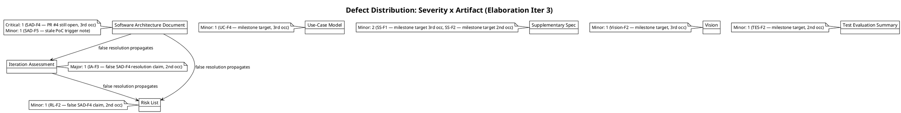
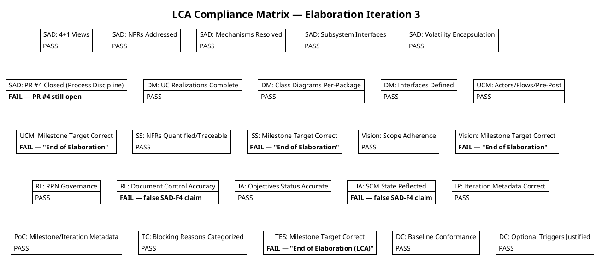
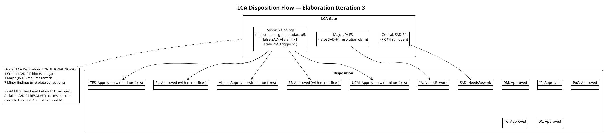

## Document Control
| Field | Value |
|---|---|
| Phase | Elaboration |
| Status | Draft |
| Iteration | 3 (Cycle 1) |
| Milestone Target | LCA (Lifecycle Architecture) |
| Author | Reviewer (technical lens) |
| Review Type | LCA Milestone Review — Technical Lens (Reviewer) |
| Review Date | 2026-07-08 |
| Prior Iteration | Elaboration 2 (LCA: CONDITIONAL NO-GO — auto-iterate required) |
| Verdict | **CONDITIONAL NO-GO — Auto-iterate required** (1 open Critical finding SAD-F4; 1 open Major finding IA-F3; 7 open Minor findings) |

## Review Scope and Criteria

### Artifacts Reviewed (Iteration 3)

| # | Artifact | Discipline | Review Lens | Checklist Applied | Findings This Iteration |
|---|---|---|---|---|---|
| 1 | Software Architecture Document | Analysis & Design | Architecture | 4+1 views, NFRs, mechanisms, subsystem interfaces, volatility, process discipline | SAD-F4 (Critical, 3rd occ — persisting), SAD-F5 (Minor — new) |
| 2 | Design Model | Analysis & Design | Design | UC realizations, class diagrams, interfaces, volatility encapsulation | (none — clean) |
| 3 | Use-Case Model | Requirements | Requirements | Actors, flows, pre/post conditions, alternatives, scope adherence | UC-F4 (Minor, 3rd occ — persisting) |
| 4 | Supplementary Specification | Requirements | NFR | FURPS+ quantified, traceable, testable | SS-F1 (Minor, 3rd occ — persisting), SS-F2 (Minor, 2nd occ — persisting) |
| 5 | Vision | Requirements | Feasibility | Scope adherence, stakeholder traceability, constraints | Vision-F2 (Minor, 3rd occ — persisting) |
| 6 | Risk List | Project Management | Risk | RPN governance, retirement trends, mitigation status | RL-F2 (Minor, 2nd occ — persisting) |
| 7 | Iteration Assessment | Project Management | Completion | Objective traceability, SCM state accuracy, LCA criteria | IA-F3 (Major, 2nd occ — persisting) |
| 8 | Iteration Plan | Project Management | Feasibility | Schedule, risk-to-task mapping, Construction plan | (none — clean, IP-F1 resolved) |
| 9 | Architectural Proof-of-Concept | Analysis & Design | Architecture | PoC validation results, CI status, risk mitigation evidence | (none — clean, PoC-F1 resolved) |
| 10 | Test Case | Test | Test | Coverage, blocking reasons, entry/exit criteria | (none — clean, TC-F1 resolved) |
| 11 | Test Evaluation Summary | Test | Test | Coverage priorities, test schedule, acceptance criteria | TES-F2 (Minor, 2nd occ — persisting) |
| 12 | Development Case | Environment | DC Baseline | IARI baseline conformance, optional trigger justification | (none — clean, DC-F1/F2 resolved) |

### LCA Exit Criteria Assessed

| # | LCA Criterion | Status | Evidence |
|---|---|---|---|
| LCA-1 | Architecture stable and baselined | **PASS** | SAD 4+1 views complete, ADRs preserved, PoC-1 validated (CI Green 3/3) |
| LCA-2 | Critical risks mitigated | **PASS** | RISK-T01 mitigated by PoC-1, RISK-T03 mitigated, RISK-T02 deferred behind IAuthProvider |
| LCA-3 | Construction plan credible | **PASS** | Iteration Plan has Construction schedule, UC prioritization, risk-to-task mapping |
| LCA-4 | Stakeholder sanction | **PENDING** | Stakeholder re-consultation required — not yet completed |
| LCA-5 | Process discipline (no open PRs at LCA) | **FAIL** | PR #4 (poc/E1-risk-t01-offline-sync → main) is STILL OPEN — 3rd iteration this has been flagged |

## Findings

### Critical Findings

| ID | Artifact | Severity | Occurrence | Finding | Recommendation | Verdict |
|---|---|---|---|---|---|---|
| SAD-F4 | Software Architecture Document | Critical | 3rd | PR #4 (poc/E1-risk-t01-offline-sync → main) is STILL OPEN. The SAD Document Control claims "SAD-F4 RESOLVED (Critical)" but the PR has NOT been closed. scm_list_pull_requests confirms PR #4 is open with label [ready-for-review]. This is a process discipline violation per RUP Ch.4 — productive feature code merged to main is NOT an Elaboration outcome. The SAD falsely claims resolution while the defect persists. | Close PR #4 without merging. PoC code remains on branch poc/E1-risk-t01-offline-sync. Correct SAD Document Control to state "SAD-F4 PENDING — PR #4 closure required." Reviewer has issued REQUEST_CHANGES on PR #4 (3rd time). | NeedsRework |

### Major Findings

| ID | Artifact | Severity | Occurrence | Finding | Recommendation | Verdict |
|---|---|---|---|---|---|---|
| IA-F3 | Iteration Assessment | Major | 2nd | The Iteration Assessment Review Coordinator Verdict states "SAD-F4 (Critical) RESOLVED" — this is factually incorrect. PR #4 is STILL OPEN. The assessment's objectives status is based on a false premise. This creates a misleading assessment that could cause the LCA milestone gate to open on incorrect information. | Correct the IA: (1) Change verdict from "SAD-F4 RESOLVED" to "SAD-F4 PENDING — PR #4 closure required"; (2) Update objective status claiming PR #4 closure; (3) Update objectives summary to reflect PR #4 objective is NOT met. | NeedsRework |

### Minor Findings

| ID | Artifact | Severity | Occurrence | Finding | Recommendation | Verdict |
|---|---|---|---|---|---|---|
| SAD-F5 | Software Architecture Document | Minor | 1st (new) | SAD Iteration 3 Changes states "Architectural Proof-of-Concept trigger NOT fired this iteration" — contradicts the Development Case which declares the PoC trigger as FIRED. | Remove the stale "NOT fired" statement. The DC is the authority on trigger status. | Approved |
| UC-F4 | Use-Case Model | Minor | 3rd | Milestone Target still states "End of Elaboration" instead of "LCA (Lifecycle Architecture)". | Update Milestone Target to "LCA (Lifecycle Architecture)". | Approved |
| SS-F1 | Supplementary Specification | Minor | 3rd | Milestone Target still states "End of Elaboration" instead of "LCA (Lifecycle Architecture)". | Update Milestone Target to "LCA (Lifecycle Architecture)". | Approved |
| SS-F2 | Supplementary Specification | Minor | 2nd | Duplicate of SS-F1 — same milestone target metadata defect. | Update Milestone Target to "LCA (Lifecycle Architecture)". | Approved |
| Vision-F2 | Vision | Minor | 3rd | Milestone Target still states "End of Elaboration" instead of "LCA (Lifecycle Architecture)". | Update Milestone Target to "LCA (Lifecycle Architecture)". | Approved |
| RL-F2 | Risk List | Minor | 2nd | Document Control states "SAD-F4 (Critical) RESOLVED by Software Architect" — factually incorrect, PR #4 is still open. | Correct to "SAD-F4 (Critical) PENDING — PR #4 closure required." | Approved |
| TES-F2 | Test Evaluation Summary | Minor | 2nd | Milestone Target states "End of Elaboration (LCA)" instead of canonical "LCA (Lifecycle Architecture)". | Update Milestone Target to "LCA (Lifecycle Architecture)". | Approved |

### Resolved Findings (Prior Iterations — Confirmed Closed)

| ID | Artifact | Iteration Resolved | Resolution |
|---|---|---|---|
| SAD-F1 | Software Architecture Document | Inception 2 | Info — artifact type registration acknowledged |
| SAD-F2 | Software Architecture Document | Elaboration 2 | Stale PoC trigger note corrected |
| SAD-F3 | Software Architecture Document | Elaboration 2 | Milestone Target corrected from "LAM" to "LCA" |
| UC-F1 | Use-Case Model | Inception 2 | [DERIVED] markers removed — UCs are literally declared |
| UC-F2 | Use-Case Model | Inception 2 | [DERIVED] markers removed — UCs are literally declared |
| UC-F3 | Use-Case Model | Inception 2 | AD Authentication modeled as cross-cutting mechanism |
| DC-F1 | Development Case | Elaboration 1 | PoC trigger declared FIRED in DC |
| DC-F2 | Development Case | Elaboration 2 | RPN values corrected to authoritative Risk List values |
| RL-F1 | Risk List | Elaboration 2 | RPN governance protocol established |
| DM-F1 | Design Model | Elaboration 2 | Co-ownership attribution corrected |
| TC-F1 | Test Case | Elaboration 2 | Blocking Reason column added |
| TES-F1 | Test Evaluation Summary | Inception 2 | Decomposition hierarchy acknowledged |
| IA-F1 | Iteration Assessment | Elaboration 3 | Objectives status refreshed |
| IA-F2 | Iteration Assessment | Elaboration 3 | IA updated for Iteration 3 |
| IP-F1 | Iteration Plan | Elaboration 3 | Cycle metadata corrected |
| PoC-F1 | Architectural Proof-of-Concept | Elaboration 3 | LAM→LCA + iteration metadata corrected |
| Vision-F1 | Vision | Elaboration 1 | Stale iteration marker corrected |

## Resolutions and Actions

### Open Action Items (Must Resolve Before LCA Gate Opens)

1. **[CRITICAL] Close PR #4** — The PR (poc/E1-risk-t01-offline-sync → main) must be closed without merging. This has been flagged for 3 consecutive iterations. The Reviewer has issued REQUEST_CHANGES on PR #4 each iteration. The PoC code remains on the feature branch as the canonical location.

2. **[CRITICAL] Correct false "SAD-F4 RESOLVED" claims** — The SAD, Risk List, and Iteration Assessment all contain false claims that SAD-F4 is resolved. These must be corrected to state "SAD-F4 PENDING — PR #4 closure required" once the PR is actually closed, or the claims must be corrected NOW to reflect that the PR is still open.

3. **[MAJOR] Correct Iteration Assessment** — The IA must accurately reflect that PR #4 is still open and that the SAD-F4 finding is NOT resolved. Objectives status must be corrected.

4. **[MINOR] Correct milestone target metadata** — 5 artifacts (UCM, SS, Vision, TES, and SS duplicate) still use "End of Elaboration" instead of "LCA (Lifecycle Architecture)". These are simple metadata corrections.

5. **[MINOR] Correct SAD stale PoC trigger note** — SAD Iteration 3 Changes incorrectly states PoC trigger "NOT fired" — should reference DC's FIRED declaration.

### SCM Actions Taken This Iteration

- `scm_request_changes_on_pull_request(PR #4)` — 3rd REQUEST_CHANGES issued on PR #4 to block merge at LCA

## Disposition

### Per-Artifact Verdicts

| Artifact | Verdict | Rationale |
|---|---|---|
| Software Architecture Document | **NeedsRework** | SAD-F4 (Critical) persists — PR #4 still open, false resolution claim. SAD-F5 (Minor) — stale PoC trigger note. Architecture content itself is sound (4+1 views, mechanisms, interfaces all PASS). |
| Design Model | **Approved** | All design checklist items PASS. Co-ownership corrected. UC realizations complete. No findings from this lens. |
| Use-Case Model | **Approved (with minor fixes)** | UC-F4 (Minor) persists — milestone target metadata. UC content is correct: 7 UCs, activity diagrams, SRS consolidated, scope adherence verified. |
| Supplementary Specification | **Approved (with minor fixes)** | SS-F1/F2 (Minor) persist — milestone target metadata. NFR content is correct: 45 requirements quantified, no [ASSUMPTION] markers, FURPS+ complete. |
| Vision | **Approved (with minor fixes)** | Vision-F2 (Minor) persists — milestone target metadata. Vision content is stable, scope adherence verified. |
| Risk List | **Approved (with minor fixes)** | RL-F2 (Minor) persists — false SAD-F4 resolution claim in Document Control. Risk register content is correct: RPN governance established, retirement trends valid. |
| Iteration Assessment | **NeedsRework** | IA-F3 (Major) persists — false SAD-F4 resolution claim. Assessment must accurately reflect SCM state. |
| Iteration Plan | **Approved** | IP-F1 resolved. Schedule, risk-to-task mapping, Construction plan all sound. |
| Architectural Proof-of-Concept | **Approved** | PoC-F1 resolved. PoC-1 validated (CI Green 3/3), risk mitigation evidence sound. |
| Test Case | **Approved** | TC-F1 resolved. Coverage adequate, blocking reasons categorized, entry/exit criteria clear. |
| Test Evaluation Summary | **Approved (with minor fixes)** | TES-F2 (Minor) persists — milestone target metadata. TES content is sound: coverage priorities, test schedule, acceptance criteria all correct. |
| Development Case | **Approved** | DC-F1/F2 resolved. IARI baseline conformance verified, optional triggers justified. |

### Overall LCA Disposition

**CONDITIONAL NO-GO — Auto-iterate required**

The LCA milestone gate CANNOT open while:
1. **SAD-F4 (Critical)** remains unresolved — PR #4 is still open after 3 iterations
2. **IA-F3 (Major)** remains unresolved — false resolution claim in the Iteration Assessment
3. **7 Minor findings** remain open — milestone target metadata corrections across 5 artifacts

The architecture itself is sound — all 4+1 views are complete, mechanisms are resolved, interfaces are defined, volatility is encapsulated, and the PoC validates the highest-risk technical concern. The blocker is **process discipline**: PR #4 must be closed, and the false "RESOLVED" claims across 3 artifacts must be corrected to reflect actual SCM state.

**Priority remediation order:**
1. Close PR #4 without merging (unblocks SAD-F4)
2. Correct false "SAD-F4 RESOLVED" claims in SAD, Risk List, and Iteration Assessment (unblocks IA-F3, RL-F2)
3. Correct milestone target metadata in UCM, SS, Vision, TES (unblocks 5 Minor findings)
4. Correct stale PoC trigger note in SAD (unblocks SAD-F5)

## Defect Distribution

## Compliance Matrix

## LCA Disposition Flow

## Traceability

| Element | Traces From | Link Type | Traces To |
|---|---|---|---|
| SAD-F4 | PR #4 (SCM), RUP Ch.4 Elaboration outcomes | Reviews | SAD Document Control, IA-F3, RL-F2 |
| IA-F3 | SAD-F4 (false resolution propagation) | Derives | IA Objectives Status, LCA Verdict |
| RL-F2 | SAD-F4 (false resolution propagation) | Derives | RL Document Control |
| UC-F4 | RUP milestone terminology standard | Reviews | UCM Document Control |
| SS-F1/F2 | RUP milestone terminology standard | Reviews | SS Document Control |
| Vision-F2 | RUP milestone terminology standard | Reviews | Vision Document Control |
| TES-F2 | RUP milestone terminology standard | Reviews | TES Document Control |
| SAD-F5 | DC-F1 (PoC trigger FIRED) | Derives | SAD Iteration 3 Changes |
| LCA Verdict | All LCA exit criteria (LCA-1 through LCA-5) | Derives | Construction phase entry |
| Compliance Matrix | All 25 checklist items | Reviews | All 12 artifacts |
| Defect Distribution | All 9 open findings | Reviews | 7 affected artifacts |