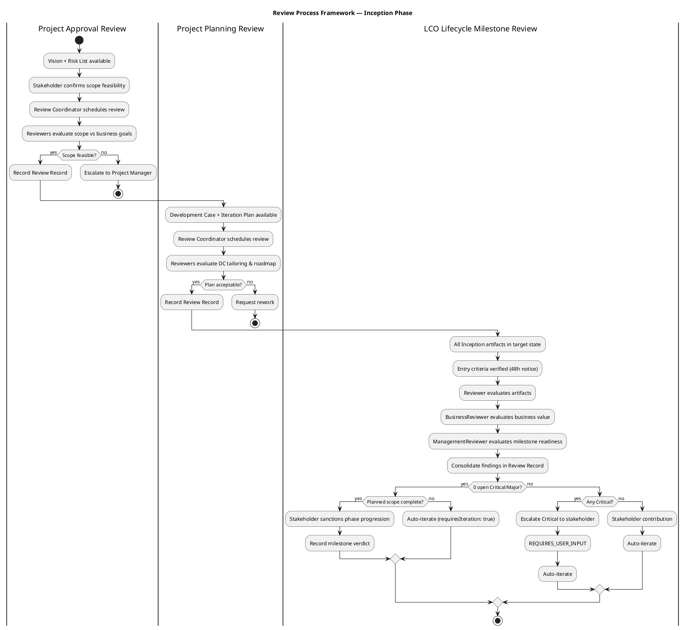
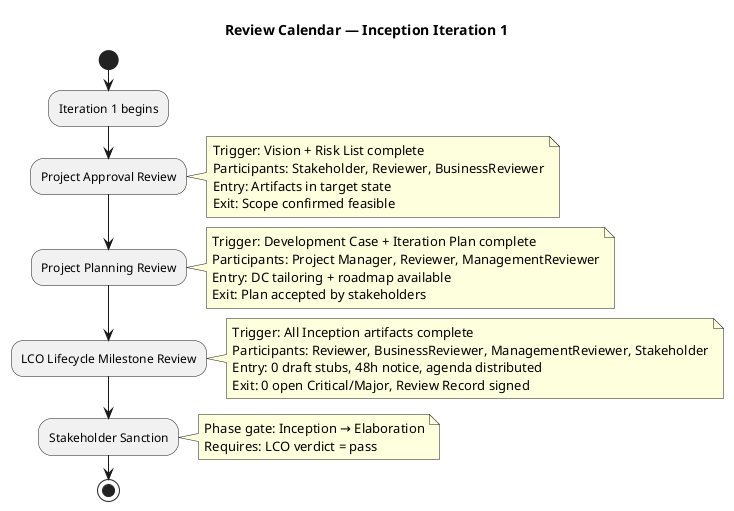
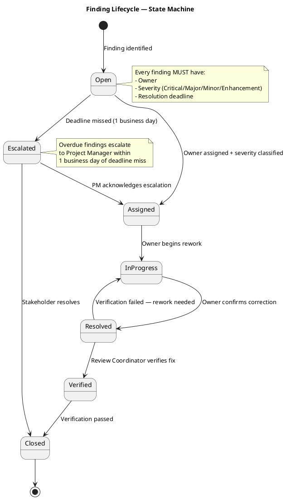

## Document Control

| Field | Value |
|---|---|
| Phase | Inception |
| Status | Draft |
| Iteration | 1 (Cycle 1) |
| Milestone Target | End of Inception (LCO) |
| Author | Review Coordinator (Project Management Discipline) |
| Review Date | 2026-07-06 (initial), 2026-07-07 (stakeholder consolidation) |
| Review Type | LCO Lifecycle Milestone Review — Consolidation with Stakeholder Input |
| Prior Review Record | Reviewer technical-feasibility lens (2026-07-06) — consolidated herein |

## Review Scope and Criteria

### Artifacts Reviewed (8)

| # | Artifact | Discipline | Author Role | LCO Role | Findings |
|---|---|---|---|---|---|
| 1 | Development Case | Environment | Process Engineer | Baseline conformance | 0 |
| 2 | Vision | Requirements | System Analyst | LCO required | 0 |
| 3 | Use-Case Model | Requirements | System Analyst | LCO required | 3 Major |
| 4 | Supplementary Specification | Requirements | System Analyst | LCO conditional (FURPS+) | 0 |
| 5 | Software Architecture Document | Analysis & Design | Software Architect | LCO supporting | 1 Info |
| 6 | Risk List | Project Management | Project Manager | LCO required | 0 |
| 7 | Iteration Plan | Project Management | Project Manager | LCO required | 0 |
| 8 | Test Evaluation Summary | Test | Test Manager | LCO supporting | 1 Minor |

### Review Lenses Applied

| Lens | Reviewer Role | Artifacts Covered | Findings Emitted |
|---|---|---|---|
| Technical Feasibility | Reviewer | All 8 artifacts | F1–F5 (3 Major, 1 Minor, 1 Info) |
| Business Value | BusinessReviewer | Vision, Use-Case Model | 0 (no findings recorded) |
| Milestone Readiness | ManagementReviewer | Iteration Plan, Risk List, Development Case | 0 (no findings recorded) |

### Entry Criteria Verification

| Criterion | Status |
|---|---|
| Artifacts in target state (not draft stubs) | ✅ All 8 artifacts contain substantive content |
| Reviewers assigned and available | ✅ Reviewer conducted technical review; BusinessReviewer and ManagementReviewer invited |
| Agenda and evaluation criteria distributed | ✅ LCO exit criteria checklist applied (see below) |
| SCM state verified | ✅ All artifacts committed to repository |

### LCO Exit Criteria Checklist

| Criterion | Met? | Evidence |
|---|---|---|
| Vision document defines product positioning, stakeholders, features | ✅ | Vision Document — 11 features, 4 stakeholders, 3 business objectives |
| Use-Case Model covers all declared use cases | ⚠️ | 7 UCs defined; F1–F3 flag DERIVED marker issues on UC-002, UC-003, UC-004/UC-007 |
| Supplementary Specification captures all 4 NFRs | ✅ | Performance, availability, audit trail, offline fault tolerance |
| Risk List with classified risks and mitigations | ✅ | Technical, scope, and resource risks with RPN scoring |
| Iteration Plan with objectives and evaluation criteria | ✅ | 7 objectives, milestone schedule, evaluation criteria |
| Development Case tailored for project | ✅ | Deltas over IARI baseline, no optional artifacts triggered |
| Architecture candidate addresses primary technical risk | ✅ | SAD addresses offline fault tolerance (UC-001 priority) |
| Stakeholder confirmation of scope | ✅ | Stakeholder confirmed 4 processes (2026-07-07) |

## Review Process Framework

The following activity diagram shows the review process framework for the Inception phase, mapping review types to their triggering workflow activities and decision gates.

### Review Type Catalog

| # | Review Type | Triggering Activity | Required Participants | Entry Criteria | Exit Criteria | Primary Output |
|---|---|---|---|---|---|---|
| R1 | Project Approval Review | Vision + Risk List complete | Stakeholder, Reviewer, BusinessReviewer | Artifacts in target state; 48h notice | Scope confirmed feasible; Review Record signed | Approval decision |
| R2 | Project Planning Review | Development Case + Iteration Plan complete | Project Manager, Reviewer, ManagementReviewer | DC tailoring + roadmap available; 48h notice | Plan accepted; Review Record signed | Plan acceptance |
| R3 | Iteration Plan Review | Plan for Next Iteration activity | Project Manager, Reviewer | Iteration Plan drafted; 48h notice | Plan feasible; Review Record signed | Plan approval |
| R4 | PRA Review | During iteration execution | Project Manager, Review Coordinator | Iteration in progress | Health status reported | PRA report |
| R5 | Iteration Evaluation Criteria Review | Before closing iteration | Reviewer, Review Coordinator | Exit criteria checklist ready | All criteria verified or waived | Criteria verification |
| R6 | Iteration Acceptance Review | Close-Out Iteration | Reviewer, BusinessReviewer, ManagementReviewer | All iteration artifacts complete | Deliverables accepted; Review Record signed | Acceptance decision |
| R7 | LCO Lifecycle Milestone Review | Close-Out Phase (Inception) | Reviewer, BusinessReviewer, ManagementReviewer, Stakeholder | All Inception artifacts complete; 48h notice | 0 open Critical/Major; Review Record signed; stakeholder sanction | Phase gate decision |

### Reviewer Pool and Expertise Mapping

| Artifact Type | Reviewer Expertise Required | Assigned Reviewer Lens |
|---|---|---|
| Vision, Use-Case Model | Requirements analysis, business value | Reviewer + BusinessReviewer |
| Supplementary Specification | NFR analysis, FURPS+ | Reviewer |
| Software Architecture Document | Architecture, design patterns | Reviewer |
| Risk List | Risk management, project planning | ManagementReviewer |
| Iteration Plan | Project planning, resource allocation | ManagementReviewer |
| Development Case | Process tailoring, RUP conformance | ManagementReviewer |
| Test Evaluation Summary | Test engineering, coverage analysis | Reviewer |

## Review Calendar — Inception Iteration 1

### Milestone-Aligned Review Schedule

| Review Event | Target Date | Phase | Iteration | Status |
|---|---|---|---|---|
| Project Approval Review | 2026-07-06 | Inception | 1 | ✅ Completed |
| Project Planning Review | 2026-07-06 | Inception | 1 | ✅ Completed |
| LCO Lifecycle Milestone Review | 2026-07-07 | Inception | 1 | 🔄 In Progress (stakeholder consolidation) |
| LCA Lifecycle Milestone Review | 2026-08-14 | Elaboration | 2–3 | 📅 Scheduled |
| IOC Milestone Review | 2026-09-11 | Construction | 4–5 | 📅 Scheduled |
| PR Product Release Review | 2026-09-25 | Transition | 6 | 📅 Scheduled |

## Findings

### Technical Feasibility Findings (Reviewer Lens)

| ID | Artifact | Severity | Description | Owner | Deadline | Status |
|---|---|---|---|---|---|---|
| F1 | Use-Case Model | Major | UC-002 (Read News) carries `[DERIVED]` marker from STK-004 but the stakeholder declaration describes HR publishing news — the UC process is described in the declared scope. Marker should be removed or stakeholder confirmation obtained. | System Analyst | 2026-07-10 | Open |
| F2 | Use-Case Model | Major | UC-003 (Employee Directory) carries `[DERIVED]` marker from STK-001 but the declared scope describes employee searching for colleagues. Marker should be removed or stakeholder confirmation obtained. | System Analyst | 2026-07-10 | Open |
| F3 | Use-Case Model | Major | UC-004/UC-007 (AD Authentication) — cross-cutting technical mechanism decomposed as separate UCs. Scope Guard Rule 7 requires this to be a Supplementary Specification entry with `<<include>>`, not a standalone UC. | System Analyst | 2026-07-10 | Open |
| F4 | Test Evaluation Summary | Minor | Coverage table references UC-004/UC-005/UC-006/UC-007 which may be renumbered after F1–F3 corrections. Update after UC model rework. | Test Manager | 2026-07-12 | Open |
| F5 | Software Architecture Document | Info | SAD artifact type is `DesignModel` in the repository but the canonical name is "Software Architecture Document." Verify artifact type registration. | Software Architect | 2026-07-12 | Open |

### Stakeholder Findings (Stakeholder Input — 2026-07-07)

| ID | Source | Severity | Description | Owner | Deadline | Status |
|---|---|---|---|---|---|---|
| S1 | Stakeholder confirmation | Info | Stakeholder confirmed that the 4 declared processes (Clock In/Out, Read News, Employee Directory, AD Authentication) are the correct processes that must be implemented. This addresses the `[DERIVED]` marker confirmation requirement for F1–F3. | Review Coordinator | — | Closed (confirmed) |
| S2 | Stakeholder input | Major | Stakeholder identified a design file at `docs/inputs/employee-portal-design.html` that was not introduced at the beginning of the iteration. Stakeholder states: "This design must be required." This design file must be reviewed and incorporated into the project's UI/UX artifacts. The UI Designer and Software Architect must evaluate this design for impact on the Use-Case Model, Design Model, and architecture. | UI Designer | 2026-07-10 | Open |

### Finding Lifecycle

## Resolutions and Actions

| Action ID | Finding | Action | Owner | Deadline | Status |
|---|---|---|---|---|---|
| A1 | F1 | Remove `[DERIVED]` marker from UC-002 or obtain explicit stakeholder confirmation. Stakeholder confirmed processes on 2026-07-07 — Reviewer to verify if this resolves F1. | System Analyst | 2026-07-10 | Pending Reviewer verification |
| A2 | F2 | Remove `[DERIVED]` marker from UC-003 or obtain explicit stakeholder confirmation. Stakeholder confirmed processes on 2026-07-07 — Reviewer to verify if this resolves F2. | System Analyst | 2026-07-10 | Pending Reviewer verification |
| A3 | F3 | Refactor AD Authentication from standalone UC(s) to Supplementary Specification entry with `<<include>>` from dependent UCs per Scope Guard Rule 7. | System Analyst | 2026-07-10 | Open |
| A4 | F4 | Update TES coverage table after UC model rework from A1–A3. | Test Manager | 2026-07-12 | Open (blocked by A1–A3) |
| A5 | F5 | Verify SAD artifact type registration — canonical name vs. repository type. | Software Architect | 2026-07-12 | Open |
| A6 | S2 | Review `docs/inputs/employee-portal-design.html` and incorporate into UI/UX artifacts. Evaluate impact on Use-Case Model, Design Model, and SAD. | UI Designer | 2026-07-10 | Open |

## Disposition

### LCO Milestone Verdict

| Criterion | Assessment |
|---|---|
| 0 open Critical findings | ✅ No Critical findings |
| 0 open Major findings | ❌ 4 open Major findings (F1, F2, F3, S2) |
| Planned scope complete | ⚠️ Stakeholder confirmed 4 processes; new design requirement (S2) added scope |
| Artifacts in target state | ✅ All 8 artifacts substantive |
| Stakeholder sanction | ⏳ Pending — stakeholder provided input; auto-iteration required to resolve open findings |

### Verdict: AUTO-ITERATE (requiresIteration: true)

**Rationale:** The LCO milestone review identified 4 open Major findings (F1–F3 on Use-Case Model, S2 on missing design incorporation). While the stakeholder confirmed the 4 declared processes (potentially resolving F1–F2), the Reviewer must verify this resolution. F3 (AD Authentication as cross-cutting mechanism) requires UC model rework. S2 (design file incorporation) is a new stakeholder requirement that must be addressed before the LCO gate can close. The iteration must auto-iterate to resolve these findings.

### Stakeholder Input Summary

1. **Process confirmation:** Stakeholder confirmed the 4 declared processes (Clock In/Out, Read News, Employee Directory, AD Authentication) are the correct processes to implement. This provides the stakeholder confirmation that F1 and F2 require for `[DERIVED]` marker resolution.

2. **Design requirement:** Stakeholder identified `docs/inputs/employee-portal-design.html` as a design file that "must be required." This was not introduced at iteration start. The UI Designer must review this file and incorporate it into the project's UI/UX artifacts. The Software Architect must evaluate its impact on the architecture. This is tracked as finding S2 (Major).

### Review Effectiveness Metrics — Current Review (First Review Event)

| Metric | Value | Notes |
|---|---|---|
| Artifacts planned for review | 8 | All Inception artifacts |
| Artifacts formally reviewed | 8 | 100% coverage |
| Review coverage | 100% | All planned artifacts received formal review |
| Total findings raised | 7 | 3 Major (F1–F3), 1 Minor (F4), 1 Info (F5), 1 Info (S1), 1 Major (S2) |
| Critical findings | 0 | No Critical findings |
| Major findings | 4 | F1, F2, F3, S2 — all open |
| Minor findings | 1 | F4 — open |
| Info findings | 2 | F5, S1 |
| Defect density (per artifact) | 0.875 | 7 findings / 8 artifacts |
| Defect removal efficiency | N/A | First review — no test-phase defect data available yet |
| Rework effort | TBD | To be tracked during rework cycle |

> **Note:** This is the first review event. Trend analysis (defect density over iterations, coverage trends, removal efficiency comparison) begins once a second review has occurred. No prior iteration data exists to compare against.

## Traceability

| Element | Traces From | Link Type | Traces To |
|---|---|---|---|
| Review Record | All 8 project artifacts | Evaluates | LCO Milestone Decision |
| F1 (UCM Major) | Use-Case Model, Scope Guard Rule 6 | Derives | UC-002 correction (A1) |
| F2 (UCM Major) | Use-Case Model, Scope Guard Rule 6 | Derives | UC-003 correction (A2) |
| F3 (UCM Major) | Use-Case Model, Scope Guard Rule 7 | Derives | UC-004/UC-007 refactor (A3) |
| F4 (TES Minor) | Test Evaluation Summary, UC Model | Derives | TES coverage table update (A4) |
| F5 (SAD Info) | Software Architecture Document, Development Case | Derives | Artifact type verification (A5) |
| S1 (Stakeholder) | Stakeholder confirmation 2026-07-07 | Derives | F1, F2 resolution verification |
| S2 (Stakeholder) | Stakeholder input 2026-07-07, `docs/inputs/employee-portal-design.html` | Derives | UI Designer review (A6), Design Model, SAD |
| Review Process Framework | IARI DC Baseline, RUP Review Types | Refines | All subsequent review events |
| Review Calendar | Iteration Plan milestone schedule | Derives | LCO, LCA, IOC, PR reviews |
| Finding Lifecycle | Formal Review Techniques skill | Refines | Finding Tracker process |
| LCO Verdict | RUP Phase Exit Criteria, Scope Guard | Derives | record_milestone_auto_iterate |