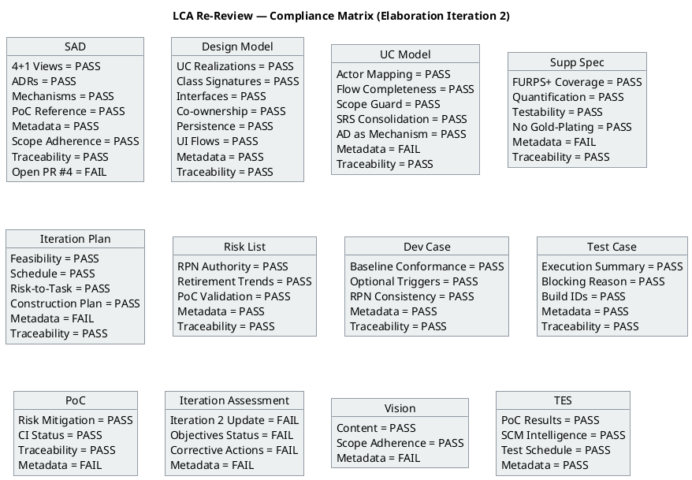
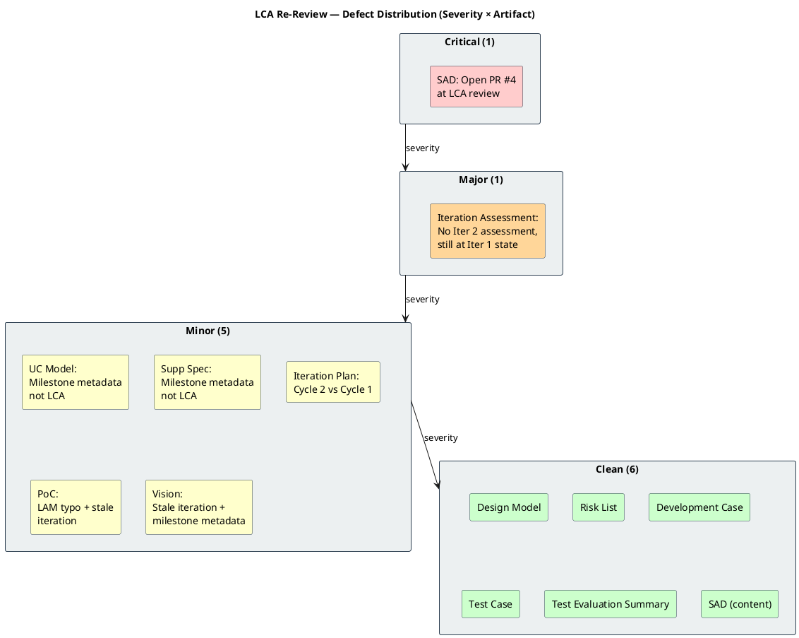

## Document Control

| Field | Value |
|---|---|
| Phase | Elaboration |
| Status | Draft |
| Iteration | 2 (Cycle 1) |
| Milestone Target | LCA (Lifecycle Architecture) |
| Author | Reviewer (technical lens) |
| Review Type | LCA Milestone Re-Review — Technical Lens |
| Review Date | 2026-07-07 |
| Prior Iteration | Elaboration 1 (LCA: CONDITIONAL NO-GO — auto-iterate required) |
| Verdict | **NEEDS REWORK** — 1 Critical (PR #4), 1 Major (Iteration Assessment not updated), 5 Minor (metadata) |

## Review Scope and Criteria

### Artifacts Reviewed

| # | Artifact | Discipline | Review Lens | Checklist Applied | Prior Findings of This Lens | New Findings This Iter |
|---|---|---|---|---|---|---|
| 1 | Software Architecture Document | Analysis & Design | Reviewer | Architecture stability, 4+1 views, ADRs, mechanisms, PoC reference, SCM state | F1 (Info, RESOLVED), F2 (Major, RESOLVED), F3 (Major, RESOLVED) | F4 (Critical — open PR #4) |
| 2 | Design Model | Analysis & Design | Reviewer | UC realizations, class signatures, interfaces, co-ownership, persistence, UI flows | F1 (Minor, RESOLVED) | (none) |
| 3 | Use-Case Model | Requirements | Reviewer | UC flow completeness, actor mapping, scope guard, SRS consolidation | F1-F3 (Major, RESOLVED in Inception 2) | F4 (Minor — milestone metadata, persisting) |
| 4 | Supplementary Specification | Requirements | Reviewer | NFR coverage, FURPS+, quantification, traceability, no gold-plating | (none) | F2 (Minor — milestone metadata) |
| 5 | Iteration Plan | Project Management | Reviewer | Feasibility, schedule, risk-to-task mapping, Construction plan | (none) | F1 (Minor — Cycle 2 vs Cycle 1) |
| 6 | Risk List | Project Management | Reviewer | RPN authority, retirement trends, PoC validation | F1 (Major, RESOLVED) | (none) |
| 7 | Development Case | Environment | Reviewer | DC baseline conformance, optional triggers, RPN consistency | F1 (Major, RESOLVED), F2 (Major, RESOLVED) | (none) |
| 8 | Test Case | Test | Reviewer | Execution summary, blocking reason, build IDs | F1 (Minor, RESOLVED) | (none) |
| 9 | Architectural Proof-of-Concept | Analysis & Design | Reviewer | PoC validity, risk mitigation, CI status, traceability | (none prior) | F1 (Minor — LAM typo + stale iteration, persisting) |
| 10 | Iteration Assessment | Project Management | Reviewer | Iteration 2 update, objectives status, corrective actions | F1 (Minor, persisting), F2 (Major, persisting) | F1 re-emitted (Minor), F2 re-emitted (Major) |
| 11 | Vision | Requirements | Reviewer | Content correctness, scope adherence, metadata | F1 (Minor, RESOLVED in Elab 1) | F2 (Minor — stale iteration + milestone, persisting) |
| 12 | Test Evaluation Summary | Test | Reviewer | PoC results, SCM intelligence, test schedule | (none) | (none) |
| 13 | SCM State | — | Reviewer | Open PRs, CI status, open issues | (none) | PR #4 REQUEST_CHANGES issued |

### Review Methodology

This review applies the **LCA exit criteria lens** (RUP Ch.4): "Do the artifacts collectively satisfy the conditions for phase transition from Elaboration to Construction?" The four LCA exit criteria are:

1. **CR-1: Architecture baselined** — SAD 4+1 views complete, ADRs stable, mechanisms resolved
2. **CR-2: Critical risks mitigated** — RISK-T01 (RPN 63) validated via PoC-1, RISK-T05 retired
3. **CR-3: Construction plan credible** — Iteration Plan has Construction schedule, integration order
4. **CR-4: Stakeholder sanction** — Stakeholder must approve LCA transition

## Findings

### Finding Summary

| ID | Artifact | Severity | Status | Description |
|---|---|---|---|---|
| SAD-F4 | Software Architecture Document | **Critical** | OPEN | Open PR #4 at LCA review — productive code must not merge to main during Elaboration |
| IA-F2 | Iteration Assessment | **Major** | OPEN (persisting, occ 2) | No Iteration 2 assessment — still at Iter 1 metadata, objectives not updated |
| IA-F1 | Iteration Assessment | Minor | OPEN (persisting, occ 2) | Objectives 1-3 show "NOT MET" but underlying findings are all resolved |
| UCM-F4 | Use-Case Model | Minor | OPEN (persisting, occ 2) | Milestone Target = "End of Elaboration" instead of "LCA (Lifecycle Architecture)" |
| SS-F2 | Supplementary Specification | Minor | OPEN (new) | Milestone Target = "End of Elaboration" instead of "LCA (Lifecycle Architecture)" |
| IP-F1 | Iteration Plan | Minor | OPEN (new) | Iteration field = "2 (Cycle 2)" instead of "2 (Cycle 1)" |
| PoC-F1 | Architectural Proof-of-Concept | Minor | OPEN (persisting, occ 2) | Milestone Target = "End of Elaboration (LAM)" + Iteration = "1 (Cycle 1)" |
| VIS-F2 | Vision | Minor | OPEN (persisting, occ 2) | Iteration = "1 (Cycle 1)" + Milestone Target = "End of Elaboration" |

### Critical Findings Detail

#### SAD-F4 (Critical) — Open PR #4 at LCA Review

**Location:** SCM state — PR #4 (`poc/E1-risk-t01-offline-sync` → `main`)

**Description:** Open PR #4 exists at LCA review time, carrying PoC code from the `poc/E1-risk-t01-offline-sync` branch targeting `main`. Per RUP Ch.4, productive feature code merged to main is NOT an Elaboration outcome. Per RUP Ch.16, the prototype is a referenced artifact, not a stream of feature PRs. The PoC has served its purpose (CI Green 3/3, architectural findings captured in CRs #5, #7, #8) and should not merge to main.

**Action Taken:** `scm_request_changes_on_pull_request` issued on PR #4 with rationale citing RUP Ch.4 and Ch.16.

**Remediation:** Close PR #4 without merging. Keep the `poc/E1-risk-t01-offline-sync` branch as a referenced artifact in the SAD traceability. Productive feature code belongs in Construction iterations.

**LCA Impact:** Blocks LCA transition until PR is closed. This is a process discipline violation, not an architecture defect — the PoC code itself is validated.

### Major Findings Detail

#### IA-F2 (Major, persisting occ 2) — No Iteration 2 Assessment

**Location:** Iteration Assessment — Document Control + Objectives Status Summary

**Description:** The Iteration Assessment is still at Iteration 1 metadata ("Iteration: 1 (Cycle 1)") and does not include an Iteration 2 assessment. The LCA re-review requires an updated assessment documenting whether the 6 corrective actions from the Iteration 1 CONDITIONAL NO-GO verdict were completed. The current content only describes the Iter 1 state (0 of 4 objectives achieved, CONDITIONAL NO-GO) but does not assess Iter 2 outcomes (all 6 findings resolved, RPN governance established, PoC validated).

**Remediation:** Update the Iteration Assessment to Iteration 2: (1) Update Document Control iteration to "2 (Cycle 1)"; (2) Add an "Elaboration Iteration 2 — Corrective Actions Status" section documenting that all 6 findings (SAD-F2, SAD-F3, DC-F2, RL-F1, DM-F1, TC-F1) are resolved; (3) Update the objectives status to reflect that the corrective iteration met its objectives; (4) State whether the LCA exit criteria are now met from the PM perspective.

**LCA Impact:** Without an Iteration 2 assessment, the LCA re-review cannot verify that the corrective iteration met its objectives. This is a PM discipline artifact — the Project Manager must update it.

### Minor Findings Detail

#### IA-F1 (Minor, persisting occ 2) — Objectives Status Stale

**Location:** Iteration Assessment — Objectives Status Summary + Objective Detail table

**Description:** Objectives 1-3 show "NOT MET" / "0 of 4 objectives achieved" but the underlying artifacts demonstrate the corrective work is complete. SAD-F2 and SAD-F3 resolved, RL-F1 resolved, DM-F1 resolved, TC-F1 resolved. The assessment status does not match the actual artifact state.

**Remediation:** Update objectives 1-3 status from "NOT MET" to "ACHIEVED" with evidence referencing the resolved findings.

#### UCM-F4 (Minor, persisting occ 2) — Milestone Metadata

**Location:** Use-Case Model — Document Control

**Description:** Milestone Target = "End of Elaboration" instead of "LCA (Lifecycle Architecture)".

**Remediation:** Change to "LCA (Lifecycle Architecture)".

#### SS-F2 (Minor, new) — Milestone Metadata

**Location:** Supplementary Specification — Document Control

**Description:** Milestone Target = "End of Elaboration" instead of "LCA (Lifecycle Architecture)".

**Remediation:** Change to "LCA (Lifecycle Architecture)".

#### IP-F1 (Minor, new) — Cycle Number Inconsistency

**Location:** Iteration Plan — Document Control

**Description:** Iteration field = "2 (Cycle 2)" instead of "2 (Cycle 1)" used by all other artifacts.

**Remediation:** Change to "2 (Cycle 1)".

#### PoC-F1 (Minor, persisting occ 2) — LAM Typo + Stale Iteration

**Location:** Architectural Proof-of-Concept — Document Control

**Description:** Milestone Target = "End of Elaboration (LAM)" — contains "LAM" typo (should be "LCA"). Iteration = "1 (Cycle 1)" — not updated to "2 (Cycle 1)".

**Remediation:** Change Milestone Target to "LCA (Lifecycle Architecture)" and Iteration to "2 (Cycle 1)".

#### VIS-F2 (Minor, persisting occ 2) — Stale Iteration + Milestone Metadata

**Location:** Vision — Document Control

**Description:** Iteration = "1 (Cycle 1)" — not updated to "2 (Cycle 1)". Milestone Target = "End of Elaboration" — should be "LCA (Lifecycle Architecture)".

**Remediation:** Update Iteration to "2 (Cycle 1)" and Milestone Target to "LCA (Lifecycle Architecture)".

## Compliance Matrix

## Defect Distribution

## Resolutions and Actions

### Prior Findings Reconciliation (S_RECONCILE)

| Finding | Artifact | Severity | Disposition | Rationale |
|---|---|---|---|---|
| SAD-F1 | SAD | Info | RESOLVED (prior iter) | Artifact type registration acknowledged — no content change needed |
| SAD-F2 | SAD | Major | RESOLVED (prior iter) | Stale PoC trigger note corrected — PoC reference now accurate |
| SAD-F3 | SAD | Major | RESOLVED (prior iter) | Milestone Target corrected from LAM to LCA |
| DM-F1 | Design Model | Minor | RESOLVED (prior iter) | Author field updated to include all 3 co-owners |
| UCM-F1 | UC Model | Major | RESOLVED (Inception 2) | [DERIVED] markers removed — stakeholder confirmed all UCs literal |
| UCM-F2 | UC Model | Major | RESOLVED (Inception 2) | Same as F1 — UC-004 is literal decomposition |
| UCM-F3 | UC Model | Major | RESOLVED (Inception 2) | AD auth correctly modeled as cross-cutting mechanism |
| RL-F1 | Risk List | Major | RESOLVED (prior iter) | RPN governance protocol established, RISK-T01 RPN=63 canonical |
| DC-F1 | Development Case | Major | RESOLVED (prior iter) | PoC trigger declared FIRED with justification |
| DC-F2 | Development Case | Major | RESOLVED (prior iter) | RPN values corrected to authoritative Risk List values |
| TC-F1 | Test Case | Minor | RESOLVED (prior iter) | Blocking Reason column added to execution summary |
| VIS-F1 | Vision | Minor | RESOLVED (prior iter) | Phase transition corrected iteration marker (Inception → Elaboration) |

### Persisting Findings (Left Open — Re-emitted in S2)

| Finding | Artifact | Severity | Occurrence | Disposition |
|---|---|---|---|---|
| IA-F1 | Iteration Assessment | Minor | 2 | LEFT OPEN — objectives still show "NOT MET" |
| IA-F2 | Iteration Assessment | Major | 2 | LEFT OPEN — no Iteration 2 assessment added |
| VIS-F2 | Vision | Minor | 2 | LEFT OPEN — iteration and milestone metadata stale |
| PoC-F1 | PoC | Minor | 2 | LEFT OPEN — LAM typo and stale iteration persist |
| UCM-F4 | UC Model | Minor | 2 | LEFT OPEN — milestone metadata not corrected |

### New Findings (S2)

| Finding | Artifact | Severity | Disposition |
|---|---|---|---|
| SAD-F4 | SAD | Critical | OPEN — PR #4 must be closed |
| SS-F2 | Supp Spec | Minor | OPEN — milestone metadata |
| IP-F1 | Iteration Plan | Minor | OPEN — cycle number inconsistency |

### SCM Actions Taken

| Action | PR | Date | Result |
|---|---|---|---|
| `scm_request_changes_on_pull_request` | #4 | 2026-07-07 | REQUEST_CHANGES issued — PR must not merge to main during Elaboration |

## Disposition

### Per-Artifact Verdicts

| Artifact | Verdict | Rationale |
|---|---|---|
| Software Architecture Document | **NeedsRework** | Content is sound (4+1 views, ADRs, mechanisms all PASS) but Critical finding SAD-F4 (open PR #4) blocks LCA. PR must be closed. |
| Design Model | **Approved** | All checklist items PASS. UC realizations complete, class signatures full, interfaces defined, co-ownership transparent, persistence mapped. |
| Use-Case Model | **Approved** | Content correct — 7 UCs, SRS consolidated, scope guard satisfied. Minor metadata finding (F4) does not block. |
| Supplementary Specification | **Approved** | All NFRs quantified, FURPS+ complete, no gold-plating. Minor metadata finding does not block. |
| Iteration Plan | **Approved** | Construction plan credible, risk-to-task mapping sound. Minor cycle number inconsistency does not block. |
| Risk List | **Approved** | RPN governance established, RISK-T01=63 canonical, PoC validation referenced. All checklist items PASS. |
| Development Case | **Approved** | Baseline conformance verified, optional triggers justified, RPN consistent. All checklist items PASS. |
| Test Case | **Approved** | Execution summary complete, blocking reasons categorized, build IDs cited from actual CI. All checklist items PASS. |
| Architectural Proof-of-Concept | **Approved** | PoC-1 validates RISK-T01, CI Green 3/3, traceability complete. Minor metadata finding does not block. |
| Iteration Assessment | **NeedsRework** | Major finding IA-F2 — no Iteration 2 assessment. PM must update to reflect corrective action completion. |
| Vision | **Approved** | Content correct, scope adherence verified. Minor metadata finding does not block. |
| Test Evaluation Summary | **Approved** | PoC results incorporated, SCM intelligence updated, test schedule defined. All checklist items PASS. |

### Overall LCA Disposition

**LCA Verdict: NEEDS REWORK — CONDITIONAL**

The architecture baseline is sound — the SAD's 4+1 views, ADRs, design mechanisms, and component interfaces are complete and stable. The Design Model provides full UC realizations with class signatures, persistence mapping, and UI flows. The Risk List has established RPN governance with RISK-T01 validated via PoC-1 (CI Green 3/3). The Development Case conforms to the IARI baseline with justified optional triggers. The Test Case and TES demonstrate architectural testability with Construction entry criteria defined.

**However, two blocking issues prevent LCA approval:**

1. **Critical: Open PR #4 (SAD-F4)** — A pull request carrying PoC code targets `main` during Elaboration. Per RUP Ch.4 and Ch.16, productive feature code must not merge to main during Elaboration. The PR has been issued REQUEST_CHANGES. **Remediation: Close PR #4.** This is a process discipline action, not an architecture defect.

2. **Major: Iteration Assessment not updated (IA-F2)** — The Iteration Assessment still reflects Iteration 1 state (0 of 4 objectives achieved, CONDITIONAL NO-GO) despite all 6 corrective actions being resolved. **Remediation: PM must update to Iteration 2 with corrective action status.**

**The 5 Minor findings (metadata inconsistencies across UC Model, Supp Spec, Iteration Plan, PoC, and Vision) are non-blocking but should be corrected in the next iteration.**

**LCA Exit Criteria Assessment:**

| Criterion | Status | Evidence |
|---|---|---|
| CR-1: Architecture baselined | **PASS** | SAD 4+1 views complete, ADRs stable, mechanisms resolved, PoC-1 validates offline sync |
| CR-2: Critical risks mitigated | **PASS** | RISK-T01 (RPN 63) validated via PoC-1 (CI Green 3/3), RISK-T05 retired, RPN governance established |
| CR-3: Construction plan credible | **PASS** | Iteration Plan has Construction schedule, integration order (Infrastructure → Application → Presentation), UC prioritization |
| CR-4: Stakeholder sanction | **PENDING** | Stakeholder explicitly refused LCA sanction in Iteration 1. Re-consultation required after corrective actions. |

**Recommendation:** Once PR #4 is closed and the Iteration Assessment is updated to reflect Iteration 2 corrective action completion, the technical lens supports LCA approval — subject to stakeholder sanction (CR-4). The architecture is sound; the blocking issues are process discipline (PR management) and PM artifact currency (assessment update), not architecture defects.

## Traceability

| Element | Traces From | Link Type | Traces To |
|---|---|---|---|
| SAD Review | Software Architecture Document (Elaboration Iter 2) | Reviews | SAD (content approved, PR #4 blocks) |
| DM Review | Design Model (Elaboration Iter 2) | Reviews | Design Model (approved) |
| UCM Review | Use-Case Model (Elaboration Iter 2) | Reviews | UC Model (approved, minor metadata) |
| SS Review | Supplementary Specification (Elaboration Iter 2) | Reviews | Supp Spec (approved, minor metadata) |
| IP Review | Iteration Plan (Elaboration Iter 2) | Reviews | Iteration Plan (approved, minor metadata) |
| RL Review | Risk List (Elaboration Iter 2) | Reviews | Risk List (approved) |
| DC Review | Development Case (Elaboration Iter 2) | Reviews | Development Case (approved) |
| TC Review | Test Case (Elaboration Iter 2) | Reviews | Test Case (approved) |
| PoC Review | Architectural Proof-of-Concept (Elaboration Iter 1) | Reviews | PoC (approved, minor metadata) |
| IA Review | Iteration Assessment (Elaboration Iter 1) | Reviews | Iteration Assessment (Major — needs Iter 2 update) |
| Vision Review | Vision (Elaboration Iter 1) | Reviews | Vision (approved, minor metadata) |
| TES Review | Test Evaluation Summary (Elaboration Iter 2) | Reviews | TES (approved) |
| PR #4 Disposition | scm_get_pull_request_diff (#4) | Reviews | PR #4 (REQUEST_CHANGES — do not merge) |
| SCM Issues | scm_list_issues (7 open) | DependsOn | Construction entry criteria |
| LCA Re-Review Verdict | All reviewed artifacts | Derives | LCA Milestone Decision, Construction Entry |
| Review Effectiveness Metrics | All reviewed artifacts | Derives | Process Improvement (Cycle 3 if needed) |