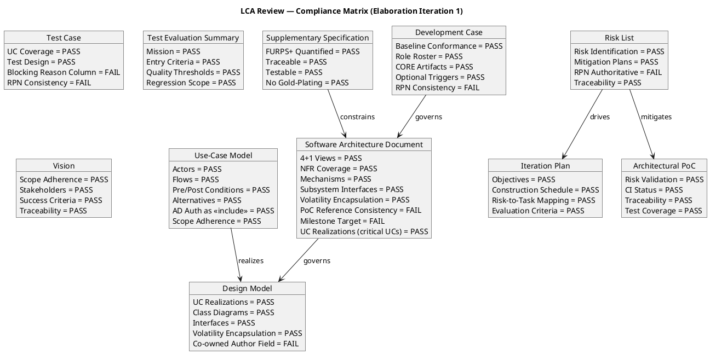
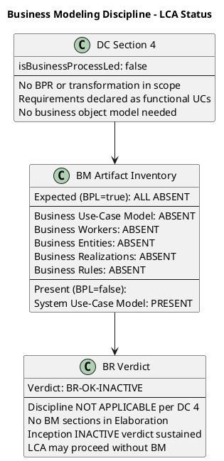

## Document Control

| Field | Value |
|---|---|
| Phase | Elaboration |
| Status | Draft |
| Iteration | 1 (Cycle 1) |
| Milestone Target | LCA (Lifecycle Architecture) |
| Author | Reviewer |
| Review Type | LCA Milestone Review — Technical Review (checklist-driven) |
| Review Date | 2026-07-07 |
| Prior Iteration | Inception 2 (LCO approved — GO verdict) |

## Review Scope and Criteria

### Artifacts Reviewed (11 total)

| # | Artifact | Discipline | Checklist Applied |
|---|---|---|---|
| 1 | Software Architecture Document | Analysis & Design | Architecture: 4+1 views, NFRs, mechanisms, subsystem interfaces, volatility |
| 2 | Design Model | Analysis & Design | Design: UC realizations, class diagrams, interfaces, volatility encapsulation |
| 3 | Use-Case Model | Requirements | Requirements: actors, flows, pre/post conditions, alternatives |
| 4 | Supplementary Specification | Requirements | NFR: FURPS+ quantified, traceable, testable |
| 5 | Development Case | Environment | DC Baseline Conformance + Optional Trigger Justification |
| 6 | Iteration Plan | Project Management | Objectives, schedule, risk-to-task mapping, evaluation criteria |
| 7 | Risk List | Project Management | Risk identification, mitigation, RPN authority, traceability |
| 8 | Architectural Proof-of-Concept | Analysis & Design | Risk validation, CI status, test coverage, traceability |
| 9 | Test Case | Test | UC coverage, test design, execution summary |
| 10 | Test Evaluation Summary | Test | Mission, entry criteria, quality thresholds, regression scope |
| 11 | Vision | Requirements | Scope adherence, stakeholders, success criteria, traceability |

### SCM State

| Item | Status | Action Taken |
|---|---|---|
| Open PR #4 (poc/E1-risk-t01-offline-sync → main) | Open, labeled ready-for-review | Changes requested — Elaboration prototypes are referenced artifacts, not merged to main. Productive feature code belongs in Construction. |

### LCA Exit Criteria Evaluated

| Criterion | Status | Evidence |
|---|---|---|
| SAD baseline established (4+1 views) | PASS | All 5 views present: Logical, Process, Deployment, Implementation, Data, Use-Case |
| Executable architectural prototype | PASS | PoC-1 on branch poc/E1-risk-t01-offline-sync, CI green (3/3) |
| UC Model ≥80% complete | PASS | 7 UCs with full specifications + activity diagrams |
| Construction plan baselined | PASS | Iteration Plan contains Construction schedule with integration order |
| All critical risks mitigated | PARTIAL | RISK-T01 mitigated by PoC; RISK-T02 (AD auth) deferred to Construction spike — acceptable per IAuthProvider isolation pattern |
| NFRs addressed with design decisions | PASS | Supplementary Spec complete, all thresholds quantified and testable |

## Findings
### Compliance Matrix

### Defect Distribution

```plantuml
@startuml
title LCA Review — Defect Distribution: Severity x Artifact

object "SAD" as SAD {
  Major: 2
  Minor: 0
  Info: 0
}

object "Design Model" as DM {
  Major: 0
  Minor: 1
  Info: 0
}

object "Development Case" as DC {
  Major: 1
  Minor: 0
  Info: 0
}

object "Risk List" as RL {
  Major: 1
  Minor: 0
  Info: 0
}

object "Test Case" as TC {
  Major: 0
  Minor: 1
  Info: 0
}

object "Use-Case Model" as UCM {
  Major: 0
  Minor: 0
  Info: 0
}

object "Supplementary Spec" as SS {
  Major: 0
  Minor: 0
  Info: 0
}

object "Iteration Plan" as IP {
  Major: 0
  Minor: 0
  Info: 0
}

object "Architectural PoC" as POC {
  Major: 0
  Minor: 0
  Info: 0
}

object "Test Eval Summary" as TES {
  Major: 0
  Minor: 0
  Info: 0
}

object "Vision" as VIS {
  Major: 0
  Minor: 0
  Info: 0
}

note bottom of SAD
  **F2 (Major, persisting):** Stale PoC trigger note
  **F3 (Major, new):** Milestone target "LAM" should be "LCA"
end note

note bottom of DC
  **F2 (Major, new):** RPN 35 vs authoritative 63
end note

note bottom of RL
  **F1 (Major, persisting):** RPN inconsistency across artifacts
end note

note bottom of DM
  **F1 (Minor, persisting):** Singular author field
end note

note bottom of TC
  **F1 (Minor, persisting):** Missing blocking reason column
end note

@enduml
```

### Finding Details

| ID | Artifact | Severity | Status | Description | Remediation |
|---|---|---|---|---|---|
| SAD-F2 | Software Architecture Document | Major | Open (persisting, occ. 2) | Document Control states "PoC Plan: Optional artifact trigger NOT fired" while PoC artifact exists in inventory and SAD traceability references PoC-1/2/3. Internal contradiction. | Remove stale note; replace with "Architectural Proof-of-Concept trigger FIRED per Development Case (RISK-T01, RISK-T02). PoC-1 artifact produced, referenced by SAD traceability." |
| SAD-F3 | Software Architecture Document | Major | Open (new) | Milestone Target states "LAM" — not a standard RUP milestone. Should be "LCA" (Lifecycle Architecture). | Update Document Control Milestone Target from "LAM" to "LCA". |
| DC-F2 | Development Case | Major | Open (new) | Risk Profile states "RISK-T01 (offline sync, RPN 35 — Significant)" while Risk List, Iteration Plan, and PoC all reference RPN 63. RPN inconsistency. | Update DC Risk Profile to reference the same RPN as the Risk List for RISK-T01. If authoritative value is 63, update from "RPN 35 — Significant" to "RPN 63 — High". |
| RL-F1 | Risk List | Major | Open (persisting, occ. 2) | RISK-T01 RPN inconsistent across artifacts: DC=35, Test Case=40, Iteration Plan=63, PoC=63. Risk List is authoritative source. | Reconcile RISK-T01's RPN across all artifacts. Establish single authoritative value in Risk List; update DC, Test Case, and all downstream references to match. |
| DM-F1 | Design Model | Minor | Open (persisting, occ. 2) | Document Control author field lists only "User-Interface Designer" — co-owned artifact with Designer (Analysis & Design) contributor. | Update author field to "User-Interface Designer, Designer (Analysis & Design)". |
| TC-F1 | Test Case | Minor | Open (persisting, occ. 2) | No "Blocking Reason" column in test execution summary. 11 of 20 tests blocked (55%). | Add "Blocking Reason" column categorizing blocked tests as Infrastructure/Application/Environment-blocked. |

### Prior Findings Reconciliation

| Artifact | Finding | Severity | Disposition | Resolution |
|---|---|---|---|---|
| Development Case | F1: PoC trigger NOT FIRED contradiction | Major | Resolved (prior iter) | DC now declares "FIRED: Architectural Proof-of-Concept" — verified in current content |
| Vision | F1: Stale iteration marker | Minor | Resolved (prior iter) | Document Control updated to Elaboration phase — verified in current content |
| Use-Case Model | F1: Missing [DERIVED] markers on UC-002/UC-003 | Major | Resolved (prior iter) | Markers removed after stakeholder confirmed UCs are literal, not derived — verified |
| Use-Case Model | F2: Missing [DERIVED] marker on UC-004 | Major | Resolved (prior iter) | Same as F1 — stakeholder confirmed literal scope — verified |
| Use-Case Model | F3: Missing [DERIVED] marker on UC-007 | Major | Resolved (prior iter) | Same as F1 — stakeholder confirmed literal scope — verified |
| SAD | F1: Artifact type registration (DesignModel) | Info | Resolved (prior iter) | Acknowledged in Document Control — verified |
| Test Evaluation Summary | F1: UC decomposition hierarchy note | Minor | Resolved (prior iter) | Cross-cutting AD auth update addresses decomposition mapping — verified |

### Business Modeling Discipline (Reviewer: Business Reviewer)

**Verdict: [BR-OK-INACTIVE] — Discipline NOT APPLICABLE per DC §4**

DC §4 trigger evaluation at LCA: project does not exhibit business-process-led characteristics. No BM sections were produced during Elaboration. The Inception INACTIVE verdict is sustained.

**DC §4 Classification (confirmed 2026-07-07):**
- `isBusinessProcessLed: false`
- Rationale: Cuba Corp Employee Portal is a standard internal intranet application replacing Excel sheets, mass emails, and a PDF directory. The project is requirements-driven (4 declared use cases, 4 NFRs) with no business process modeling, workflow reengineering, or business transformation scope.
- Criteria triggered: (1) No BPR or transformation in scope; (2) Requirements declared directly as functional UCs; (3) No business object model or workflow modeling needed.

**BM Artifact Inventory at LCA:**

| Expected Artifact (BPL=true) | Status | Notes |
|---|---|---|
| Business Use-Case Model | ABSENT | Not applicable — system UCs are directly declared |
| Business Workers | ABSENT | Not applicable — no business process modeling |
| Business Entities | ABSENT | Not applicable — no business object model |
| Business Realizations | ABSENT | Not applicable — no BUCs to realize |
| Business Rules (standalone) | ABSENT | Business constraints captured in Supplementary Specification NFRs |

| Present Artifact (BPL=false) | Status | Discipline |
|---|---|---|
| System Use-Case Model | PRESENT | Requirements (not BM) |
| Supplementary Specification | PRESENT | Requirements (not BM) |

**Prior BR Findings Reconciliation:** Zero prior BusinessReviewer findings exist on any artifact. All findings in the Review Record were emitted by the Reviewer (technical lens). No reconciliation required.

**Conclusion:** BM discipline remains correctly INACTIVE. No findings, no recommendations. The LCA milestone may proceed without BM contributions. The Requirements discipline's Use-Case Model (7 UCs with full specifications, activity diagrams, correct AD auth modeling) serves as the direct derivation source for downstream disciplines — no business-to-system derivation bridge is needed because the project is requirements-driven, not business-process-driven.

## Resolutions and Actions

### Open Action Items

| # | Artifact | Finding | Severity | Owner | Action Required | Due |
|---|---|---|---|---|---|---|
| 1 | SAD | F2: Stale PoC trigger note | Major | Software Architect | Update Document Control to reflect PoC trigger FIRED status | Next iteration |
| 2 | SAD | F3: Milestone target "LAM" | Major | Software Architect | Correct to "LCA" | Next iteration |
| 3 | DC | F2: RPN 35 vs 63 | Major | Process Engineer | Update Risk Profile RPN to match Risk List authoritative value | Next iteration |
| 4 | Risk List | F1: RPN inconsistency | Major | Project Manager | Establish authoritative RPN for RISK-T01; propagate to all artifacts | Next iteration |
| 5 | Design Model | F1: Author field | Minor | UI Designer / Designer | Update author field to include both contributors | Next iteration |
| 6 | Test Case | F1: Blocking reason column | Minor | Test Designer | Add blocking reason categorization column | Next iteration |

### SCM Action

| PR | Action | Rationale |
|---|---|---|
| #4 (poc/E1-risk-t01-offline-sync → main) | Changes Requested | Elaboration prototypes are referenced artifacts per RUP Ch.16, not merged to main. Productive feature code belongs in Construction per RUP Ch.4. |

## Disposition

### Per-Artifact Verdicts

| Artifact | Verdict | Rationale |
|---|---|---|
| Software Architecture Document | **NeedsRework** | 2 Major findings: stale PoC note (persisting) + incorrect milestone target. Architecture content itself is sound — 4+1 views complete, mechanisms resolved, interfaces defined. Defects are metadata/consistency issues, not architectural soundness issues. |
| Design Model | **Approved with Changes** | 1 Minor finding (author field). Design content is complete: UC realizations for all 7 UCs, class diagrams, sequence diagrams, state machines, UI patterns, navigation topology. |
| Use-Case Model | **Approved** | Clean — all prior findings resolved. 7 UCs with full specifications, activity diagrams, correct AD auth modeling. |
| Supplementary Specification | **Approved** | Clean — all NFRs quantified, testable, traceable. No gold-plating. All [ASSUMPTION] markers resolved. |
| Development Case | **NeedsRework** | 1 Major finding: RPN inconsistency in Risk Profile. Baseline conformance PASS — no roster/ownership/artifact violations. Optional triggers correctly justified. |
| Iteration Plan | **Approved** | Clean — objectives, schedule, risk-to-task mapping, evaluation criteria all present and correct. |
| Risk List | **NeedsRework** | 1 Major finding: RPN inconsistency (persisting). Risk identification, mitigation plans, and traceability are sound. |
| Architectural Proof-of-Concept | **Approved** | Clean — PoC-1 validates offline sync, CI green, test coverage adequate, traceability complete. |
| Test Case | **Approved with Changes** | 1 Minor finding: missing blocking reason column. Test design, UC coverage, and execution findings are sound. |
| Test Evaluation Summary | **Approved** | Clean — mission, entry criteria, quality thresholds, regression scope all defined. |
| Vision | **Approved** | Clean — prior finding resolved, content correct for LCA, scope adherence verified. |

### Overall LCA Disposition

**LCA Milestone: APPROVED WITH CONDITIONS**

The architecture baseline is sound — all 4+1 views are complete, the executable prototype validates the highest-risk mechanism (offline sync), UC Model is ≥80% complete, and the Construction plan is baselined. The 4 Major findings are consistency/metadata defects, NOT architectural soundness defects:

1. **SAD stale PoC note** — metadata inconsistency, not architecture defect
2. **SAD milestone target typo** — labeling error, not architecture defect
3. **DC RPN inconsistency** — data propagation issue, not process defect
4. **Risk List RPN inconsistency** — same root cause as #3

**Conditions for LCA approval:**
- All 4 Major findings must be resolved in the next iteration before Construction begins
- PR #4 must remain unmerged (changes requested) — prototype code stays on branch, referenced by SAD
- RPN reconciliation must establish a single authoritative value for RISK-T01 across all artifacts

**Risk assessment:** The architecture is ready for Construction. The defects are cosmetic/consistency issues that do not undermine the architectural baseline's soundness. The IAuthProvider isolation pattern for AD auth (RISK-T02) is validated by analogy and the spike is correctly deferred to Construction.

## Traceability

| Element | Traces From | Link Type | Traces To |
|---|---|---|---|
| Review Record (LCA) | All Elaboration artifacts | Reviews | LCA Milestone Gate |
| SAD-F2 | SAD Document Control, Development Case PoC trigger | Derives | SAD Document Control (corrective action) |
| SAD-F3 | SAD Document Control | Derives | SAD Document Control (corrective action) |
| DC-F2 | Development Case Risk Profile, Risk List RISK-T01 | Derives | Development Case Risk Profile (corrective action) |
| RL-F1 | Risk List RISK-T01, Development Case, Test Case, Iteration Plan, PoC | Derives | All artifacts referencing RISK-T01 RPN |
| DM-F1 | Design Model Document Control | Derives | Design Model Document Control (corrective action) |
| TC-F1 | Test Case execution summary | Derives | Test Case execution summary (corrective action) |
| PR #4 | SAD PoC-1 reference, Architectural Proof-of-Concept artifact | References | Construction phase (productive code) |