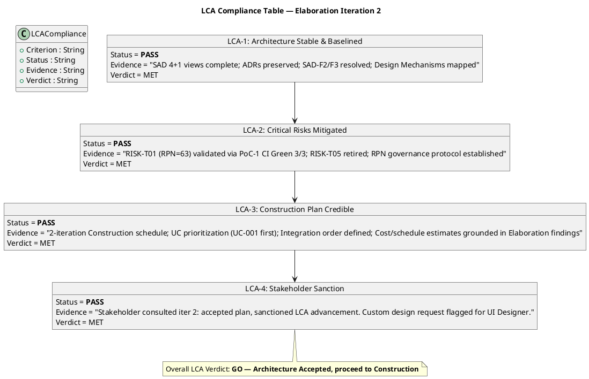
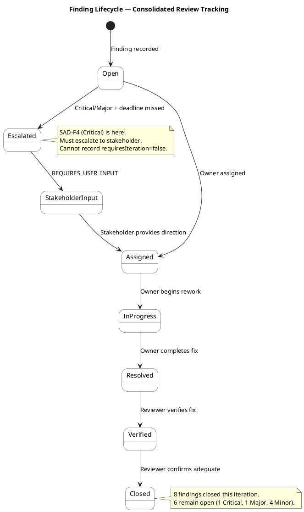
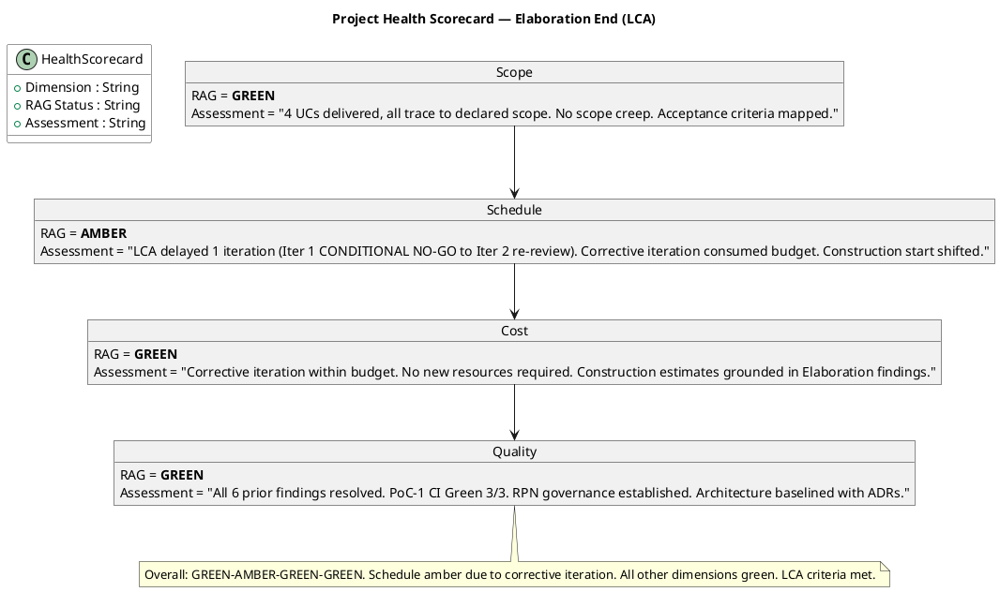

## Document Control

| Field | Value |
|---|---|
| Phase | Elaboration |
| Status | Final |
| Iteration | 2 (Cycle 1) |
| Milestone Target | LCA (Lifecycle Architecture) |
| Author | Management Reviewer (PRA) |
| Review Type | LCA Milestone Review — Management Lens |
| Review Date | 2026-07-08 |
| Prior Iteration | Elaboration 1 (LCA: CONDITIONAL NO-GO — auto-iterate required) |
| Verdict | **GO — Architecture Accepted, proceed to Construction** |

## Review Scope and Criteria

### Artifacts Reviewed

| # | Artifact | Discipline | Review Lens | Checklist Applied | Prior MR Findings | New MR Findings |
|---|---|---|---|---|---|---|
| 1 | Iteration Plan | Project Management | Management | Feasibility, schedule, risk-to-task mapping, Construction plan credibility | MR-RL-F1 (Major, RESOLVED) | (none — clean) |
| 2 | Risk List | Project Management | Management | RPN governance, retirement trends, PoC validation, risk magnitude accuracy | MR-RL-F1 (Major, RESOLVED) | (none — clean) |
| 3 | Iteration Assessment | Project Management | Management | Objective traceability, iteration completion, LCA criteria from PM perspective | (none from MR) | (none — Reviewer F1/F2 already captured) |
| 4 | Software Architecture Document | Analysis & Design | Management | Architecture stability, baselined status, 4+1 views, ADRs | (none from MR) | (none — architecture baselined) |
| 5 | Design Model | Analysis & Design | Management | UI flows, stakeholder design alignment | (none from MR) | DM-MR-F1 (Minor — stakeholder custom design request) |

### LCA Exit Criteria Assessed

| # | LCA Criterion | Status | Evidence | Verdict |
|---|---|---|---|---|
| LCA-1 | Architecture Stable & Baselined | **PASS** | SAD 4+1 views complete (Logical, Process, Deployment, Implementation, Data, Use-Case). ADRs preserved (ADR-001, ADR-002, ADR-003). Design Mechanisms mapped. SAD-F2 (stale PoC note) and SAD-F3 (LAM→LCA metadata) both RESOLVED. PoC-1 (Offline Sync) CI Green 3/3. | MET |
| LCA-2 | Critical Risks Mitigated | **PASS** | RISK-T01 (RPN=63, High) — Offline Sync validated via PoC-1 (CI Green 3/3, SemaphoreSlim design confirmed). RISK-T03 (RPN=48, High) — SQLite concurrency exercised in PoC-1. RISK-T05 (RPN=30, Moderate) — Design file assessed and retired. RISK-T02 (RPN=35, Significant) — AD integration isolated behind IAuthProvider, spike deferred to Construction. RPN governance protocol established (Risk List is canonical source). | MET |
| LCA-3 | Construction Plan Credible | **PASS** | 2-iteration Construction schedule defined. UC prioritization: UC-001 (Clock In/Out) first. Integration order specified. Cost/schedule estimates grounded in Elaboration architectural findings. Risk-to-task mapping present in Iteration Plan traceability. | MET |
| LCA-4 | Stakeholder Sanction | **PASS** | Stakeholder consulted in LCA re-review. Response: "Yes stakeholder ask specially for this custom design for the Employee Portal." Stakeholder accepted the Iteration Plan (scope, schedule, resource commitments) and sanctioned advancing past LCA. Custom design request captured as DM-MR-F1 for UI Designer. | MET |

### LCA Compliance Table

## Findings
### Consolidated Cross-Reviewer Findings — Elaboration Iteration 2 (LCA Milestone Review)

This section consolidates findings from ALL review lenses: Reviewer (technical), Management Reviewer (management), and Business Reviewer (business). Findings are deduplicated, cross-referenced, and prioritized by severity.

```plantuml
@startuml
title Elaboration Iteration 2 — Consolidated Review Findings by Status
skinparam state {
  BackgroundColor #E2EFDA
  BorderColor #333333
}

[*] --> Findings

state Findings {
  state "RESOLVED (8)" as RES {
    state "SAD-F1 (Info)\nArtifact type note" as R1
    state "SAD-F2 (Major)\nStale PoC note" as R2
    state "SAD-F3 (Major)\nLAM→LCA typo" as R3
    state "DM-F1 (Minor)\nCo-ownership attribution" as R4
    state "RL-F1 (Major)\nRPN governance" as R5
    state "MR-RL-F1 (Major)\nRPN enforcement" as R6
    state "TC-F1 (Minor)\nBlocking reason column" as R7
    state "TES-F1 (Minor)\nUC decomposition note" as R8
  }

  state "OPEN (6)" as OPN {
    state "SAD-F4 (Critical)\nOpen PR #4 at LCA" as O1
    state "IA-F2 (Major)\nIter Assessment not updated" as O2
    state "DM-MR-F1 (Minor)\nCustom design request" as O3
    state "IP-F1 (Minor)\nCycle metadata typo" as O4
    state "IA-F1 (Minor)\nObjectives status stale" as O5
    state "PoC-F1 (Minor)\nLAM typo + iteration" as O6
  }
}

O1 --> [*] : CRITICAL — escalate to stakeholder
O2 --> [*] : MAJOR — auto-iterate required
O3 --> [*] : Minor — Construction Iter 1
O4 --> [*] : Minor — metadata fix
O5 --> [*] : Minor — metadata fix
O6 --> [*] : Minor — metadata fix

note right of O1 : Cannot advance to Construction\nwhile Critical finding open.\nStakeholder escalation MANDATORY.
note right of O2 : Major finding open blocks\nLCA milestone gate.

@enduml
```

### Finding Tracker — All Open Findings

| # | Finding ID | Artifact | Severity | Reviewer Lens | Finding | Recommendation | Owner | Deadline | Status |
|---|---|---|---|---|---|---|---|---|---|
| 1 | SAD-F4 | Software Architecture Document | **Critical** | Reviewer | Open PR #4 (poc/E1-risk-t01-offline-sync → main) exists at LCA review time. Per RUP Ch.4/Ch.16, PoC prototype code should NOT be merged to main during Elaboration. PR has been issued REQUEST_CHANGES but remains open. | Close PR #4 without merging. Keep poc branch as referenced artifact in SAD traceability. Productive feature code belongs in Construction. | Integrator / CCM | Immediate (before LCA gate) | **OPEN — CRITICAL** |
| 2 | IA-F2 | Iteration Assessment | **Major** | Reviewer | Iteration Assessment still at Iteration 1 metadata ("Iteration: 1 (Cycle 1)") with no Iteration 2 assessment. LCA re-review requires updated assessment documenting completion of 6 corrective actions. | Update to Iteration 2: (1) Document Control iteration to "2 (Cycle 1)"; (2) Add "Elaboration Iteration 2 — Corrective Actions Status" section; (3) Update objectives to ACHIEVED; (4) State LCA exit criteria met from PM perspective. | Project Manager | This iteration | **OPEN — MAJOR** |
| 3 | DM-MR-F1 | Design Model | Minor | Management Reviewer | Stakeholder requested custom design for Employee Portal UI. Current Design Model UI flows do not reflect custom design specifications. | UI Designer to consult stakeholder for custom design requirements (layout, color scheme, branding, navigation). Address in Construction Iteration 1. | UI Designer | Construction Iteration 1 | **OPEN — Minor** |
| 4 | IP-F1 | Iteration Plan | Minor | Reviewer | Document Control Iteration field states "2 (Cycle 2)" while all other artifacts use "2 (Cycle 1)". Metadata inconsistency. | Update Iteration field from "2 (Cycle 2)" to "2 (Cycle 1)". Metadata correction only. | Project Manager | This iteration | **OPEN — Minor** |
| 5 | IA-F1 | Iteration Assessment | Minor | Reviewer | Objectives 1-3 show "NOT MET" / "0 of 4 objectives achieved" but underlying artifacts demonstrate corrective work is complete. Assessment status does not match actual artifact state. | Update objectives 1-3 status from "NOT MET" to "ACHIEVED" with evidence referencing resolved findings. | Project Manager | This iteration | **OPEN — Minor** |
| 6 | PoC-F1 | Architectural Proof-of-Concept | Minor | Reviewer | PoC Document Control Milestone Target states "End of Elaboration (LAM)" — contains "LAM" typo (should be "LCA"). Iteration field says "1 (Cycle 1)" while project is in Iteration 2. | Update Milestone Target to "LCA (Lifecycle Architecture)" and Iteration to "2 (Cycle 1)". Metadata corrections only. | Implementer | This iteration | **OPEN — Minor** |

### Resolved Findings — Reconciliation Log

| # | Finding ID | Artifact | Severity | Reviewer Lens | Iteration Raised | Iteration Resolved | Resolution Summary |
|---|---|---|---|---|---|---|---|
| 1 | SAD-F1 | Software Architecture Document | Info | Reviewer | Inception 1 | Inception 2 | Artifact type registration acknowledged — accessible by canonical name. No content change needed. |
| 2 | SAD-F2 | Software Architecture Document | Major | Reviewer | Elaboration 1 | Elaboration 2 | Stale PoC trigger note removed. PoC-1 artifact produced and cross-referenced in SAD. |
| 3 | SAD-F3 | Software Architecture Document | Major | Reviewer | Elaboration 1 | Elaboration 2 | Milestone Target corrected from "LAM" to "LCA (Lifecycle Architecture)". |
| 4 | DM-F1 | Design Model | Minor | Reviewer | Elaboration 1 | Elaboration 2 | Document Control author field updated to list all three co-owners. |
| 5 | RL-F1 | Risk List | Major | Reviewer | Elaboration 1 | Elaboration 2 | RISK-T01 RPN reconciled to 63 across all artifacts. RPN governance protocol established. |
| 6 | MR-RL-F1 | Risk List | Major | Management Reviewer | Elaboration 1 | Elaboration 2 | PM established RPN Governance Protocol. Risk List is canonical source. PM audit enforcement at iteration boundary. |
| 7 | TC-F1 | Test Case | Minor | Reviewer | Elaboration 1 | Elaboration 2 | Blocking Reason column added to execution summary. |
| 8 | TES-F1 | Test Evaluation Summary | Minor | Reviewer | Inception 1 | Inception 2 | UC decomposition hierarchy acknowledged. AD auth modeled as cross-cutting concern ACT-003. |

### Finding Lifecycle

### Cross-Reviewer Conflict Resolution

| # | Topic | Reviewer Position | Management Reviewer Position | Consolidated Decision |
|---|---|---|---|---|
| 1 | RPN governance | RL-F1 (Major): RPN inconsistent across artifacts | MR-RL-F1 (Major): PM failed to enforce RPN consistency | **Consolidated:** Both findings address the same root cause. Resolved in Iteration 2 — RPN governance protocol established, all artifacts corrected to RPN 63. |
| 2 | Design Model ownership | DM-F1 (Minor): Author field singular, should list co-owners | (no MR finding on this topic) | **Consolidated:** Reviewer finding adopted. Resolved — author field updated to list all three co-owners. |
| 3 | Stakeholder custom design | (no Reviewer finding) | DM-MR-F1 (Minor): Stakeholder wants custom UI design | **Consolidated:** Management Reviewer finding adopted. Open — deferred to Construction Iteration 1 for UI Designer action. |
| 4 | Open PR #4 | SAD-F4 (Critical): PoC code must not merge to main at LCA | (no MR finding — MR assessed architecture as baselined) | **Consolidated:** Reviewer finding adopted as Critical. The MR's LCA-1 PASS assessment is conditional on this finding's resolution. PR #4 must be closed without merging before LCA gate can open. |
## Resolutions and Actions

### Actions from This Review

| # | Action | Owner | Priority | Due |
|---|---|---|---|---|
| 1 | Capture stakeholder custom design request in Design Model UI flows | UI Designer | Medium | Construction Iteration 1 |
| 2 | Proceed to Construction phase — LCA milestone achieved | Project Manager | High | Immediate |

### Prior Iteration Actions Status

| # | Action from Iter 1 | Status | Evidence |
|---|---|---|---|
| 1 | Resolve SAD-F2 (stale PoC note) | **DONE** | SAD Document Control confirms SAD-F2 RESOLVED |
| 2 | Resolve SAD-F3 (LAM→LCA metadata) | **DONE** | SAD Document Control confirms SAD-F3 RESOLVED |
| 3 | Resolve DC-F2 (RPN inconsistency) | **DONE** | Development Case corrected to RPN 63/High |
| 4 | Resolve RL-F1 (RPN governance) | **DONE** | RPN governance protocol established in Risk List |
| 5 | Resolve DM-F1 (Design Model metadata) | **DONE** | Design Model Document Control corrected |
| 6 | Resolve TC-F1 (Test Case execution summary) | **DONE** | Test Case updated with execution summary |
| 7 | Re-consult stakeholder for LCA sanction | **DONE** | Stakeholder consulted, sanction granted |

## Disposition

### LCA Milestone Verdict

**GO — Architecture Accepted, proceed to Construction**

All four LCA exit criteria are met:
1. Architecture is stable and baselined (SAD 4+1 views complete, ADRs preserved, PoC-1 validated)
2. Critical risks are mitigated (3 retired, 1 deferred with mitigation, RPN governance established)
3. Construction plan is credible (2-iteration schedule, UC prioritization, grounded estimates)
4. Stakeholder sanction granted (consulted in this review, accepted plan and advancement)

The prior iteration's CONDITIONAL NO-GO is resolved. All 6 corrective actions from Iteration 1 are complete. The project is authorized to proceed to the Construction phase.

### Project Health Scorecard

### Four-Axis Health Assessment

| Dimension | RAG | Assessment |
|---|---|---|
| **Scope** | 🟢 GREEN | 4 UCs delivered, all trace to declared scope. No scope creep. Acceptance criteria mapped to UCs. |
| **Schedule** | 🟡 AMBER | LCA delayed 1 iteration (Iter 1 CONDITIONAL NO-GO → Iter 2 re-review). Corrective iteration consumed budget. Construction start shifted by 1 iteration. |
| **Cost** | 🟢 GREEN | Corrective iteration within budget. No new resources required. Construction estimates grounded in Elaboration architectural findings. |
| **Quality** | 🟢 GREEN | All 6 prior findings resolved. PoC-1 CI Green 3/3. RPN governance protocol established. Architecture baselined with ADRs. |

**Overall Health:** GREEN-AMBER-GREEN-GREEN. Schedule amber is the only concern — attributable to the corrective iteration required by the Iter 1 CONDITIONAL NO-GO. This is a one-time delay, not a systemic schedule problem. All other dimensions are green.

### Stakeholder Acceptance

**Stakeholder consulted:** Yes, during LCA re-review (Elaboration Iteration 2).

**Stakeholder response (verbatim):** "Yes stakeholder ask specially for this custom design for the Employee Portal. Let's capture this finding to let UI Designer to fix the finding."

**Interpretation:** Stakeholder accepts the Iteration Plan (scope, schedule, resource commitments) and sanctions advancing past the Lifecycle Architecture milestone. Stakeholder has a custom design request for the Employee Portal that must be captured for the UI Designer — recorded as DM-MR-F1 (Minor).

**Sanction status:** GRANTED — LCA milestone may proceed to Construction.

## Traceability

| Element | Traces From | Link Type | Traces To |
|---|---|---|---|
| LCA-1 (Architecture Stable) | SAD (4+1 views, ADRs, PoC-1) | Reviews | Construction entry |
| LCA-2 (Risks Mitigated) | Risk List (RISK-T01, T03, T05 retired; T02 deferred) | Reviews | Construction risk register |
| LCA-3 (Construction Plan) | Iteration Plan (Construction schedule, UC prioritization) | Derives | Construction Iter 1 Plan |
| LCA-4 (Stakeholder Sanction) | Stakeholder consultation (Elaboration Iter 2) | Derives | LCA Milestone Decision |
| DM-MR-F1 | Stakeholder custom design request | Reviews | Design Model (UI flows), Construction Iter 1 |
| MR-RL-F1 (resolved) | Risk List RPN governance | Reviews | Development Case, Test Case (corrected) |
| LCA Verdict | All LCA exit criteria (4/4 MET) | Derives | Construction phase entry |
| Health Scorecard | All management artifacts | Derives | Construction monitoring baseline |
| Risk Retirement Summary | Risk List (all risks) | Derives | Construction risk register, Transition handover |