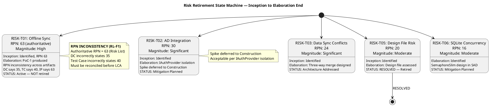
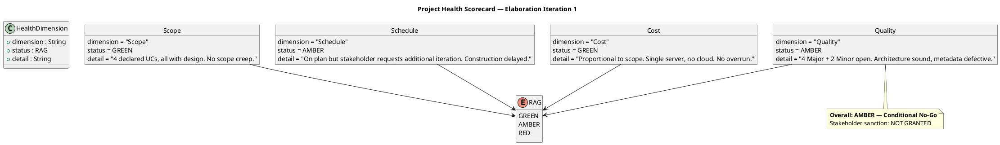

## Document Control

| Field | Value |
|---|---|
| Phase | Elaboration |
| Status | Draft |
| Iteration | 1 (Cycle 1) |
| Milestone Target | LCA (Lifecycle Architecture) |
| Author | Management Reviewer |
| Review Type | LCA Milestone Review — Project Management Lens |
| Review Date | 2026-07-07 |
| Prior Iteration | Inception 2 (LCO approved — GO verdict) |

## Review Scope and Criteria

### Artifacts Reviewed (Management Lens)

| # | Artifact | Discipline | Checklist Applied |
|---|---|---|---|
| 1 | Software Architecture Document | Analysis & Design | Architecture stability, baseline status, milestone metadata |
| 2 | Iteration Plan | Project Management | Feasibility, schedule credibility, risk-to-task mapping, Construction plan |
| 3 | Risk List | Project Management | Risk identification, RPN authority, retirement trends, magnitude accuracy |
| 4 | Iteration Assessment | Project Management | Iteration objective completion (Inception 2 — LCO scope) |
| 5 | Development Case | Environment | DC baseline conformance, RPN consistency, optional triggers |
| 6 | Review Record (prior) | Project Management | Prior findings reconciliation, closure verification |

### LCA Exit Criteria Evaluated

```plantuml
@startuml
title LCA Compliance Table — Elaboration Iteration 1
class LCACompliance {
  + criterion : String
  + status : PassStatus
  + evidence : String
  + verdict : String
}

enum PassStatus {
  MET
  PARTIALLY_MET
  NOT_MET
}

object "CR-1: Architecture Baselined" as CR1 {
  criterion = "SAD baseline established with 4+1 views"
  status = PARTIALLY_MET
  evidence = "All 5 views present; ADRs preserved; mechanisms mapped. SAD-F2 (stale PoC note, 3rd occ) and SAD-F3 (LAM->LCA) remain open."
  verdict = "NeedsRework"
}

object "CR-2: Critical Risks Mitigated" as CR2 {
  criterion = "High-magnitude risks retired via prototyping"
  status = PARTIALLY_MET
  evidence = "RISK-T05 retired. PoC-1 produced. RPN inconsistency (RL-F1 2nd occ, DC-F2) prevents verifying RISK-T01 actual severity."
  verdict = "NeedsRework"
}

object "CR-3: Construction Plan Credible" as CR3 {
  criterion = "Cost/schedule estimates defensible"
  status = MET
  evidence = "Iteration Plan coarse roadmap with integration order, agent assignments, proportional to 4-UC scope."
  verdict = "Approved"
}

object "CR-4: Stakeholder Alignment" as CR4 {
  criterion = "Stakeholder sanctions LCA advancement"
  status = NOT_MET
  evidence = "Stakeholder: 'I do NOT sanction advancing past the LCA milestone at this time. I request an additional Elaboration iteration to resolve all open findings.'"
  verdict = "NeedsRework"
}

CR1 --> PassStatus
CR2 --> PassStatus
CR3 --> PassStatus
CR4 --> PassStatus

note bottom of CR1
  **Overall LCA Verdict: CONDITIONAL NO-GO**
  Additional Elaboration iteration required.
  4 Major + 2 Minor findings must be resolved.
end note
@enduml
```

## Findings

### Management Reviewer Findings (This Iteration)

| ID | Artifact | Severity | Finding | Recommendation | Verdict |
|---|---|---|---|---|---|
| MR-RL-F1 | Risk List | Major | RPN governance failure: Risk List correctly states RISK-T01 RPN=63 (High), but PM did not enforce consistency across downstream artifacts. DC states "RPN 35 — Significant", Test Case states "RPN 40". 2nd occurrence of this defect (cross-references Reviewer RL-F1). | PM must reconcile RISK-T01 RPN across ALL artifacts: update DC from 35 to 63, update Test Case from 40 to 63. Document reconciliation in Risk List status changes. | NeedsRework |

### Reviewer Findings (Cross-Referenced — Not MR-Owned)

These findings were emitted by the Reviewer lens. They are recorded here for milestone compliance assessment but are NOT owned by ManagementReviewer for closure.

| ID | Artifact | Severity | Occurrence | Status | Description |
|---|---|---|---|---|---|
| SAD-F2 | Software Architecture Document | Major | 3rd | OPEN | Stale PoC trigger note in SAD Document Control — contradicts DC FIRED declaration and actual PoC artifact existence |
| SAD-F3 | Software Architecture Document | Major | 1st | OPEN | SAD Document Control Milestone Target states "LAM" — should be "LCA" (Lifecycle Architecture) |
| DC-F2 | Development Case | Major | 1st | OPEN | DC Risk Profile states "RPN 35 — Significant" for RISK-T01 — should be "RPN 63 — High" per authoritative Risk List |
| RL-F1 | Risk List | Major | 2nd | OPEN | RPN inconsistency across artifacts (Reviewer lens) — cross-references MR-RL-F1 (governance perspective) |
| DM-F1 | Design Model | Minor | 3rd | OPEN | Author field lists only "User-Interface Designer" — should include "Designer (Analysis & Design)" for co-owned artifact |
| TC-F1 | Test Case | Minor | 3rd | OPEN | Missing "Blocking Reason" column in test execution summary — needed for Construction planning |

### Risk Retirement Assessment

**Risk Retirement Summary:**
- RISK-T05: **RESOLVED** — Design file incorporated, retired. ✓
- RISK-T01: Architecture Addressed but PoC deferred to Construction. RPN inconsistency blocks verification. ⚠
- RISK-T02: Mitigation Planned (IAuthProvider isolation). Spike deferred to Construction — acceptable. ⚠
- RISK-T03: Architecture Addressed (three-way merge designed). PoC in Construction. ⚠
- RISK-T06: Identified (new). SemaphoreSlim design in SAD. Load test in Construction. ⚠
- RISK-T04, RISK-E01, RISK-S01, RISK-S02: Mitigation Planned or Active — no escalation. ✓

**Trend:** 1 of 10 risks fully retired. 3 risks moved to "Architecture Addressed." No risks increased in magnitude. RISK-T06 newly identified. The risk retirement trend is positive but incomplete — high-magnitude RISK-T01 remains active with PoC deferred.

## Resolutions and Actions

### Prior MR Findings Reconciliation

No prior ManagementReviewer findings exist (this is the first MR review in Elaboration). All open findings on management artifacts belong to the Reviewer lens and cannot be resolved by ManagementReviewer per the ownership invariant.

### Stakeholder Acceptance

**Stakeholder Response (verbatim):**

> "I do NOT sanction advancing past the LCA milestone at this time. I request an additional Elaboration iteration to resolve all open findings before transitioning to Construction.
>
> Specifically, the following must be resolved:
>
> 1. SAD-F2 (Major, 3rd occurrence) — Stale PoC trigger note must be corrected
> 2. SAD-F3 (Major) — Milestone target must read LCA, not LAM
> 3. DC-F2 (Major) — RPN must be reconciled to the correct value
> 4. RL-F1 (Major, 2nd occurrence) — RPN inconsistency across all artifacts must be definitively fixed
>
> Additionally, the 2 Minor findings (DM-F1 author field, TC-F1 blocking reason column) should be cleaned up in the same iteration. Also take care of the Change request opened"

**Stakeholder Sanction: NOT GRANTED.** The stakeholder explicitly requests an additional Elaboration iteration. This is the stakeholder's decision and represents the organizational authority over the project.

### Required Actions for Next Iteration

| # | Finding | Artifact | Action | Owner |
|---|---|---|---|---|
| 1 | SAD-F2 (3rd occ) | SAD | Remove stale "PoC Plan: NOT fired" note; replace with "PoC trigger FIRED per DC" | Software Architect |
| 2 | SAD-F3 | SAD | Change Milestone Target from "LAM" to "LCA" | Software Architect |
| 3 | DC-F2 | Development Case | Update RISK-T01 RPN from "35 — Significant" to "63 — High" | Process Engineer |
| 4 | RL-F1 (2nd occ) | Risk List + all | Reconcile RPN 63 across DC, Test Case, and all referencing artifacts | Project Manager |
| 5 | DM-F1 (3rd occ) | Design Model | Add "Designer (Analysis & Design)" to author field | UI Designer / Designer |
| 6 | TC-F1 (3rd occ) | Test Case | Add "Blocking Reason" column to test execution summary | Test Designer |
| 7 | Change Request | CCM | Address open Change Request per stakeholder request | Change Control Manager |

## Disposition

### Project Health Scorecard

### LCA Milestone Verdict

**VERDICT: CONDITIONAL NO-GO — Additional Elaboration Iteration Required**

The architecture is technically sound — all 4+1 views are baselined, ADRs are preserved, mechanisms are mapped, and the Construction plan is credible. However, the LCA gate cannot open for the following reasons:

1. **Stakeholder sanction NOT granted** — The stakeholder explicitly refused to advance past LCA, requesting an additional Elaboration iteration. This is the highest authority and cannot be overridden.

2. **4 Major findings remain open** (2 persisting across multiple occurrences):
   - SAD-F2 (3rd occurrence) — stale PoC trigger note
   - SAD-F3 — milestone target "LAM" instead of "LCA"
   - DC-F2 — RPN inconsistency in Risk Profile
   - RL-F1 (2nd occurrence) — RPN inconsistency across artifacts

3. **2 Minor findings remain open** (both 3rd occurrence):
   - DM-F1 — Design Model author field
   - TC-F1 — Test Case blocking reason column

4. **RPN governance failure** (MR-RL-F1) — The PM did not enforce Risk List RPN authority across downstream artifacts, creating inconsistency that blocks risk severity verification.

**Conditions for LCA Approval (Next Iteration):**
- All 4 Major findings resolved and verified by respective lens owners
- All 2 Minor findings resolved
- RPN 63 reconciled across ALL artifacts (Risk List, DC, Test Case, Iteration Plan, PoC)
- Open Change Request addressed by CCM
- Stakeholder re-consulted for sanction

**Phase Transition: BLOCKED** — Elaboration continues for one additional iteration. Construction does NOT begin until LCA criteria are fully met and stakeholder sanction is obtained.

## Traceability

| Element | Traces From | Link Type | Traces To |
|---|---|---|---|
| MR-RL-F1 | RL-F1 (Reviewer), DC-F2 (Reviewer) | Reviews | Risk List (RPN reconciliation), Development Case, Test Case |
| LCA-CR1 | SAD (4+1 views), ADRs | Reviews | LCA Milestone Gate |
| LCA-CR2 | Risk List (RISK-T01, T02, T03, T05), PoC-1 | Reviews | LCA Milestone Gate |
| LCA-CR3 | Iteration Plan (coarse roadmap) | Reviews | LCA Milestone Gate |
| LCA-CR4 | Stakeholder Response (verbatim) | Reviews | LCA Milestone Gate |
| Stakeholder Acceptance | S_CONSULT_STAKEHOLDER | Derives | Review Record (this section) |
| Risk Retirement Assessment | Risk List (Elaboration Iter 1) | Derives | LCA-CR2, Construction Risk Plan |
| Project Health Scorecard | All reviewed artifacts | Derives | LCA Milestone Verdict |
| SAD-F2 | SAD Document Control | Reviews | SAD (corrective action — pending) |
| SAD-F3 | SAD Document Control | Reviews | SAD (corrective action — pending) |
| DC-F2 | Development Case Risk Profile | Reviews | Development Case (corrective action — pending) |
| RL-F1 | Risk List RISK-T01, DC, TC, IP, PoC | Reviews | All artifacts referencing RISK-T01 RPN |
| DM-F1 | Design Model Document Control | Reviews | Design Model (corrective action — pending) |
| TC-F1 | Test Case execution summary | Reviews | Test Case (corrective action — pending) |