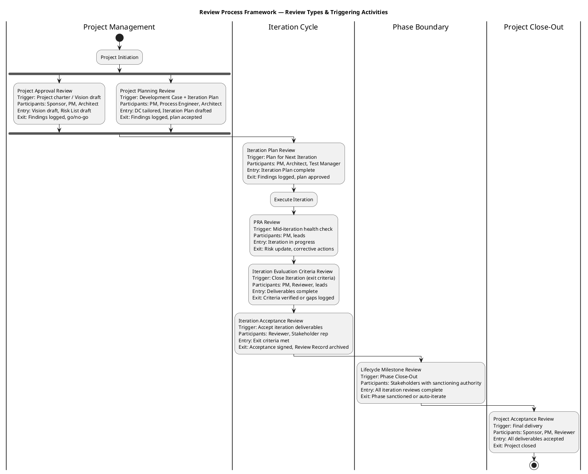
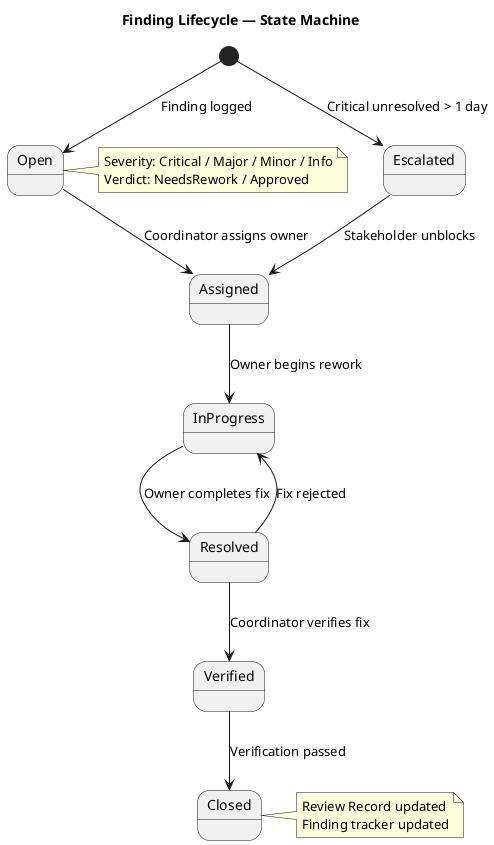
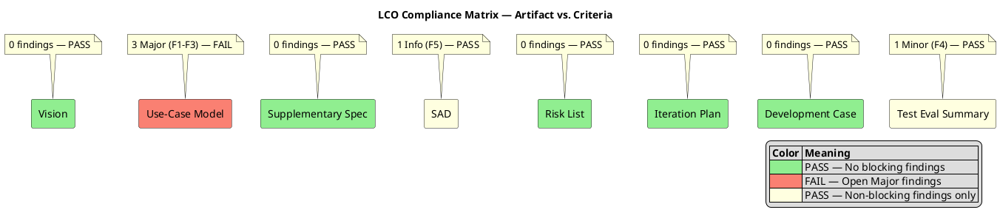
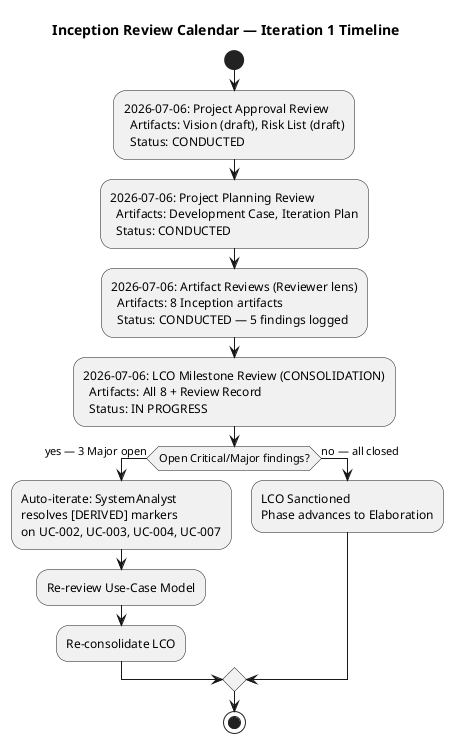

## Document Control

| Field | Value |
|---|---|
| Phase | Inception |
| Status | Draft |
| Iteration | 1 (Cycle 1) |
| Milestone Target | End of Inception (LCO) |
| Author | Review Coordinator (Project Management Discipline) |
| Review Date | 2026-07-06 |
| Review Type | LCO Lifecycle Milestone Review — Consolidation |
| Prior Review Record | Reviewer technical-feasibility lens (same date) — consolidated herein |

## Review Scope and Criteria

### Artifacts Reviewed (8)

| # | Artifact | Discipline | Author Role | LCO Role | Findings |
|---|---|---|---|---|---|
| 1 | Development Case | Environment | Process Engineer | Baseline conformance | 0 |
| 2 | Vision | Requirements | System Analyst | LCO required | 0 |
| 3 | Use-Case Model | Requirements | System Analyst | LCO required | 3 Major |
| 4 | Supplementary Specification | Requirements | System Analyst | LCO conditional (FURPS+) | 0 |
| 5 | Software Architecture Document | Analysis & Design | Software Architect | LCO supporting | 1 Info |
| 6 | Risk List | Project Management | Project Manager | LCO required | 0 |
| 7 | Iteration Plan | Project Management | Project Manager | LCO required | 0 |
| 8 | Test Evaluation Summary | Test | Test Manager | LCO supporting | 1 Minor |

### Review Lenses Applied

| Lens | Reviewer Role | Artifacts Covered | Findings Emitted |
|---|---|---|---|
| Technical Feasibility | Reviewer | All 8 artifacts | F1–F5 (3 Major, 1 Minor, 1 Info) |
| Business Value | BusinessReviewer | Vision, Use-Case Model | 0 (no findings recorded) |
| Milestone Readiness | ManagementReviewer | Iteration Plan, Risk List, Development Case | 0 (no findings recorded) |

### Entry Criteria Verification

| Criterion | Status |
|---|---|
| Artifacts in target state (not draft stubs) | ✅ All 8 artifacts contain substantive content |
| Reviewers assigned and available | ✅ Reviewer conducted technical review; BusinessReviewer and ManagementReviewer invited |
| Agenda and evaluation criteria distributed | ✅ LCO exit criteria checklist applied (see below) |
| SCM state checked | ✅ No open PRs at review time |

### LCO Exit Criteria Checklist

- [x] **DC Baseline Conformance**: 24-role roster, 16 CORE artifacts, 6 OPTIONAL triggers, ownership, discipline intensity — Development Case conforms
- [x] **Scope Adherence**: Every element traces to declared Quick Start input; [DERIVED] markers required on non-literal elements — **3 findings: markers missing on UC-002, UC-003, UC-004, UC-007**
- [x] **Traceability**: Upstream/downstream references present and correct across all artifacts
- [x] **UML Richness**: Diagrams present and formally correct in all artifacts
- [x] **Data Source Verification**: Quantitative claims sourced or marked [ASSUMPTION]
- [x] **Cross-cutting Mechanism Rule**: Auth/sync/audit as `<<include>>` not standalone UCs — Use-Case Model conforms (AD auth is Supplementary Spec entry, not a UC)

### Review Process Framework

### Reviewer Pool & Expertise Mapping

| Artifact Type | Required Expertise | Assigned Reviewer |
|---|---|---|
| Vision, Use-Case Model, Supplementary Spec | Requirements analysis, scope guard | Reviewer (Requirements lens) |
| Software Architecture Document | Architecture, .NET, offline sync patterns | Reviewer (Architecture lens) |
| Risk List, Iteration Plan | Project management, estimation | ManagementReviewer |
| Development Case | Process tailoring, RUP conformance | Reviewer (Process lens) |
| Test Evaluation Summary | Test strategy, coverage analysis | Reviewer (Test lens) |
| Vision (business value) | Business goals, stakeholder needs | BusinessReviewer |

### Finding Lifecycle

## Findings

### Consolidated Finding Tracker

| ID | Artifact | Severity | Verdict | Finding | Recommendation | Owner | Deadline | Status |
|---|---|---|---|---|---|---|---|---|
| F1 | Use-Case Model | Major | NeedsRework | UC-002 (View Clocking History) and UC-003 (Review and Export Clockings) are decompositions of the declared "Clock In/Out" use case but lack the [DERIVED — from STK-0NN] marker required by Scope Guard Rule 6 | Add [DERIVED — from STK-003, awaiting stakeholder confirmation] to UC-002 and UC-003 summary lines | SystemAnalyst | Next iteration | **Open** |
| F2 | Use-Case Model | Major | NeedsRework | UC-004 (Publish News) is derived from the declared "Read News" use case but lacks the [DERIVED — from STK-0NN] marker required by Scope Guard Rule 6 | Add [DERIVED — from STK-001, awaiting stakeholder confirmation] to UC-004 summary line | SystemAnalyst | Next iteration | **Open** |
| F3 | Use-Case Model | Major | NeedsRework | UC-007 (Manage Directory) is derived from the declared "Employee Directory" use case but lacks the [DERIVED — from STK-0NN] marker required by Scope Guard Rule 6 | Add [DERIVED — from STK-001, awaiting stakeholder confirmation] to UC-007 summary line | SystemAnalyst | Next iteration | **Open** |
| F4 | Test Evaluation Summary | Minor | Approved | Coverage table references "7 use cases" without noting UC-002/003/004/007 are decompositions of the 4 declared use cases | Add note to coverage table clarifying decomposition hierarchy | TestManager | Next iteration | **Open (non-blocking)** |
| F5 | Software Architecture Document | Info | Approved | SAD registered with type "DesignModel" rather than a distinct SAD type — tooling classification issue, not content defect | Verify with Process Engineer whether DesignModel is correct type; document mapping in DC if so | ProcessEngineer | Next iteration | **Open (non-blocking)** |

### Finding Severity Distribution

| Severity | Count | Blocking? |
|---|---|---|
| Critical | 0 | — |
| Major | 3 | Yes — all NeedsRework, all unresolved |
| Minor | 1 | No — Approved with recommendation |
| Info | 1 | No — Approved with recommendation |
| **Total** | **5** | |

### Cross-Reviewer Conflict Resolution

| Conflict | Resolution |
|---|---|
| No conflicts detected | BusinessReviewer and ManagementReviewer recorded zero findings. Reviewer's technical findings stand unchallenged. No conflicting verdicts to reconcile. |

### Compliance Matrix

## Resolutions and Actions

### Action Items — Blocking (Must Resolve Before LCO Close)

| Action ID | Finding | Action | Owner | Deadline | Status |
|---|---|---|---|---|---|
| A1 | F1 | Add [DERIVED — from STK-003, awaiting stakeholder confirmation] to UC-002 and UC-003 | SystemAnalyst | Iteration 1 Cycle 2 | **Pending** |
| A2 | F2 | Add [DERIVED — from STK-001, awaiting stakeholder confirmation] to UC-004 | SystemAnalyst | Iteration 1 Cycle 2 | **Pending** |
| A3 | F3 | Add [DERIVED — from STK-001, awaiting stakeholder confirmation] to UC-007 | SystemAnalyst | Iteration 1 Cycle 2 | **Pending** |

### Action Items — Non-Blocking (Recommended for Next Iteration)

| Action ID | Finding | Action | Owner | Deadline | Status |
|---|---|---|---|---|---|
| A4 | F4 | Add decomposition hierarchy note to TES coverage table | TestManager | Elaboration Iteration 1 | **Pending** |
| A5 | F5 | Verify SAD artifact type with Process Engineer; document mapping in DC if needed | ProcessEngineer | Elaboration Iteration 1 | **Pending** |

### Escalation Status

| Item | Status | Escalated To |
|---|---|---|
| None | No overdue findings (first review cycle) | N/A |

### Review Effectiveness Metrics — Inception Iteration 1 (Cycle 1)

> **First review event — no prior review history exists.** Metrics reflect this review only. Trend analysis begins once a second review has occurred.

| Metric | Value | Notes |
|---|---|---|
| Artifacts planned for review | 8 | All Inception deliverables |
| Artifacts formally reviewed | 8 | 100% coverage |
| Review coverage | 100% | All planned artifacts received formal review |
| Total findings raised | 5 | 3 Major, 1 Minor, 1 Info |
| Critical findings | 0 | — |
| Major findings (open) | 3 | All on Use-Case Model — [DERIVED] marker compliance |
| Major findings (closed) | 0 | — |
| Minor findings | 1 | TES coverage table — non-blocking |
| Info findings | 1 | SAD artifact type — non-blocking |
| Defect density (UCM) | 3 findings / 1 artifact | Highest density — scope guard compliance gap |
| Defect density (overall) | 5 findings / 8 artifacts = 0.625 per artifact | — |
| Defect removal efficiency | N/A (first review) | Will compute once test phase produces defect data |
| Rework effort | TBD | SystemAnalyst rework for [DERIVED] markers — estimated < 1 hour |

### Review Calendar — Inception

## Disposition

### Milestone Verdict: LCO — Inception Phase

| Criterion | Result |
|---|---|
| Open Critical findings | 0 |
| Open Major NeedsRework findings | **3** (F1, F2, F3 — Use-Case Model) |
| All planned iteration objectives achieved | **No** — Use-Case Model requires correction before LCO can close |
| Phase scope complete | **No** — [DERIVED] marker compliance is a Scope Guard requirement; unresolved Major findings block LCO exit |

### Verdict: AUTO-ITERATE

The LCO milestone review identifies **3 open Major NeedsRework findings** on the Use-Case Model. Per the milestone verdict rules, the phase cannot advance while open Major findings remain. The Review Coordinator records `requiresIteration: true`.

**Rationale:** The findings are not architectural or scope-expansion defects — they are documentation compliance gaps (missing [DERIVED] markers). The underlying use case decompositions are valid; the SystemAnalyst must add the required provenance markers. This is low-effort rework (< 1 hour estimated) that can be resolved in a single auto-iteration cycle.

**Conditions for LCO Close (next cycle):**
1. SystemAnalyst adds [DERIVED — from STK-003] to UC-002 and UC-003 (resolves F1)
2. SystemAnalyst adds [DERIVED — from STK-001] to UC-004 (resolves F2)
3. SystemAnalyst adds [DERIVED — from STK-001] to UC-007 (resolves F3)
4. Reviewer re-reviews Use-Case Model and closes F1, F2, F3 via `resolve_artifact_finding`
5. Review Coordinator re-consolidates — if 0 open Critical/Major findings, LCO is sanctioned

**Non-blocking items (A4, A5) may be deferred to Elaboration Iteration 1.**

### Review Sign-off

| Role | Name | Status |
|---|---|---|
| Review Coordinator | ReviewCoordinator | Signed — this document |
| Technical Reviewer | Reviewer | Findings F1–F5 emitted and recorded |
| Business Reviewer | BusinessReviewer | Invited — no findings recorded |
| Management Reviewer | ManagementReviewer | Invited — no findings recorded |
| Stakeholder (Sponsor) | Laura Gómez | Pending — stakeholder input requested via milestone gate |

## Traceability

| Element | Traces From | Link Type | Traces To |
|---|---|---|---|
| Review Record | All 8 project artifacts | Evaluates | LCO Milestone Decision |
| F1 (UCM Major) | Use-Case Model, Scope Guard Rule 6 | Derives | UC-002, UC-003 correction (A1) |
| F2 (UCM Major) | Use-Case Model, Scope Guard Rule 6 | Derives | UC-004 correction (A2) |
| F3 (UCM Major) | Use-Case Model, Scope Guard Rule 6 | Derives | UC-007 correction (A3) |
| F4 (TES Minor) | Test Evaluation Summary, UC Model | Derives | TES coverage table update (A4) |
| F5 (SAD Info) | Software Architecture Document, Development Case | Derives | Artifact type verification (A5) |
| Review Process Framework | IARI DC Baseline, RUP Review Types | Refines | All subsequent review events |
| Review Calendar | Iteration Plan milestone schedule | Derives | LCO, LCA, IOC, PR reviews |
| Finding Lifecycle | Formal Review Techniques skill | Refines | Finding Tracker process |
| LCO Verdict | RUP Phase Exit Criteria, Scope Guard | Derives | record_milestone_auto_iterate |