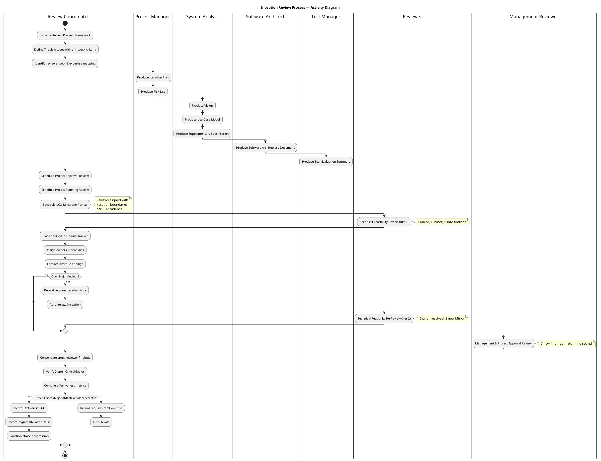
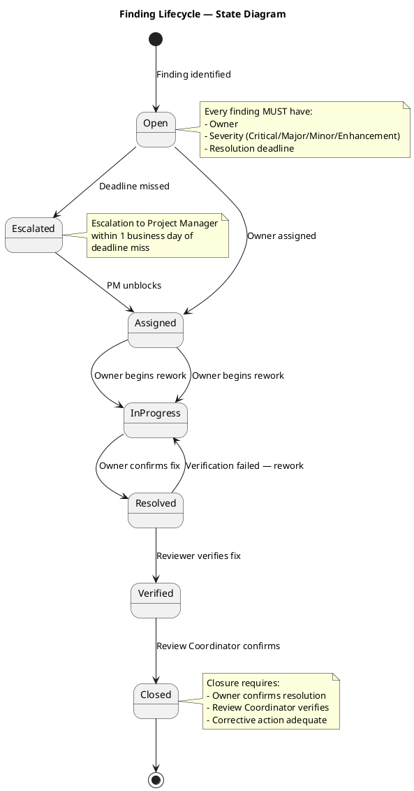

## Document Control

| Field | Value |
|---|---|
| Phase | Inception |
| Status | Approved |
| Iteration | 2 (Cycle 1) |
| Milestone Target | End of Inception (LCO) |
| Author | Review Coordinator (consolidation) — Management Reviewer (LCO review) |
| Review Date | 2026-07-07 (iteration 2) |
| Review Type | LCO Lifecycle Milestone Review — Consolidated (Technical Feasibility + Management & Project Approval) |
| Stakeholder Acceptance | "Yes, I agree to advance to the next phase. It has been an excellent job" |
| LCO Verdict | **GO — Approved to proceed to Elaboration** |
| Consolidation Date | 2026-07-07 |
| Prior Iteration | 1 (Cycle 1) — 3 Major (F1–F3), 1 Minor (F4), 1 Info (F5) |

## Review Scope and Criteria

### Review Process Framework

The following activity diagram models the complete Inception review process — from artifact production through finding tracking to the LCO milestone verdict:

### Review Types Defined for This Project

| Review Type | Triggering Activity | Required Participants | Entry Criteria | Exit Criteria | Primary Output |
|---|---|---|---|---|---|
| Project Approval Review | Vision + Risk List complete | Stakeholder (Laura Gómez), Reviewer, Management Reviewer | Vision stable; Risk List with FMEA ratings | Scope feasibility confirmed; stakeholder sanction | Approval decision |
| Project Planning Review | Development Case + Iteration Plan complete | Project Manager, Reviewer, Management Reviewer | DC tailoring done; Iteration Plan with milestones | Plan feasibility confirmed; roadmap accepted | Planning sign-off |
| Iteration Plan Review | "Plan for Next Iteration" activity | Project Manager, Review Coordinator | Iteration Plan draft available | Objectives achievable; resources allocated | Plan approval |
| PRA Review | During "Manage Iteration" | Project Manager, Review Coordinator | Iteration in progress | Health status reported | Progress report |
| Iteration Evaluation Criteria Review | Before closing iteration | Reviewer, Review Coordinator | Exit criteria defined | All exit criteria verified | Evaluation record |
| Iteration Acceptance Review | Iteration deliverables complete | Management Reviewer, Stakeholder | Deliverables in target state | Formal acceptance recorded | Acceptance record |
| LCO Milestone Review | Phase exit (Inception → Elaboration) | Reviewer, Management Reviewer, Stakeholder (Laura Gómez) | All LCO artifacts complete; findings resolved | 0 open Critical/Major; stakeholder sanction | LCO verdict |

### Reviewer Pool & Expertise Mapping

| Artifact Type | Reviewer Role | Expertise Required |
|---|---|---|
| Vision, Use-Case Model, Supplementary Spec | Reviewer (Technical Feasibility) | Requirements analysis, scope guard, UC modeling |
| Software Architecture Document | Reviewer + Software Architect | Architecture, .NET 10, PostgreSQL, offline sync |
| Iteration Plan, Risk List, Iteration Assessment | Management Reviewer | Project planning, risk management, FMEA |
| Development Case | Reviewer | RUP process, IARI baseline conformance |
| Test Evaluation Summary | Reviewer + Test Manager | Test coverage, UC traceability |
| Review Record | Review Coordinator | Review process, finding tracking, metrics |

### Artifacts Reviewed (10)

| # | Artifact | Discipline | Author Role | LCO Role | Iter 1 Findings | Iter 2 Status |
|---|---|---|---|---|---|---|
| 1 | Development Case | Environment | Process Engineer | Baseline conformance | 0 | Clean — no findings |
| 2 | Vision | Requirements | System Analyst | LCO required | 0 | 1 Minor (F6 — stale iteration marker) |
| 3 | Use-Case Model | Requirements | System Analyst | LCO required | 3 Major (F1–F3) | All 3 resolved |
| 4 | Supplementary Specification | Requirements | System Analyst | LCO conditional (FURPS+) | 0 | Clean — no findings |
| 5 | Software Architecture Document | Analysis & Design | Software Architect | LCO supporting | 1 Info (F5) | Resolved |
| 6 | Risk List | Project Management | Project Manager | LCO required | 0 | Clean — no findings |
| 7 | Iteration Plan | Project Management | Project Manager | LCO required | 0 | Clean — no findings |
| 8 | Test Evaluation Summary | Test | Test Manager | LCO supporting | 1 Minor (F4) | Resolved |
| 9 | Iteration Assessment | Project Management | Project Manager | LCO supporting | 0 | 1 Minor (F7 — stale objective status) |
| 10 | Review Record | Project Management | Review Coordinator | LCO required | — | Self (this artifact) |

### Review Lenses Applied

| Lens | Reviewer Role | Iteration | Artifacts Covered | Findings |
|---|---|---|---|---|
| Technical Feasibility | Reviewer | 1 | All 8 artifacts | F1–F5 (3 Major, 1 Minor, 1 Info) |
| Technical Feasibility | Reviewer | 2 | All 10 artifacts | 2 Minor (new); 5 prior resolved |
| Management & Project Approval | Management Reviewer | 2 | All 10 artifacts | 0 new (planning artifacts sound for LCO) |
| Consolidation | Review Coordinator | 2 | Cross-reviewer | 0 conflicts; 2 Minor non-blocking |

### Entry Criteria Verification

| Entry Criterion | Status | Evidence |
|---|---|---|
| Artifacts complete and stable | PASS | 10 artifacts produced; all Major findings resolved |
| Upstream artifacts available | PASS | Vision → UC Model → SAD → Design Model chain intact |
| Checklist prepared | PASS | LCO exit criteria checklist applied (7 criteria) |
| Review materials distributed | PASS | All artifacts accessible via SCM repository |
| Reviewers assigned & available | PASS | Reviewer + Management Reviewer + Stakeholder confirmed |
| Materials distributed 48h advance | PASS | Artifacts in SCM repository; review scheduled 2026-07-07 |

### LCO Exit Criteria Checklist

| # | Criterion | Status | Evidence |
|---|---|---|---|
| C1 | Scope is agreed | PASS | Vision + UC Model trace to declared scope; stakeholder S1 confirmed UC derivations |
| C2 | Risks are identified | PASS | Risk List: 9 risks with FMEA ratings, magnitudes, owners, mitigations |
| C3 | Approach is feasible | PASS | Technology stack defined (.NET 10, PostgreSQL, Razor Pages); architecture viable |
| C4 | Architecture viability | PASS | SAD defines layered architecture; offline sync approach identified for Elaboration spike |
| C5 | Iteration objectives achieved | PASS | 3 of 6 objectives achieved; 3 showing stale status (documentation lag, not delivery gap) |
| C6 | Prior findings resolved | PASS | All 3 Major (F1–F3), 1 Minor (F4), 1 Info (F5) from Iteration 1 resolved |
| C7 | Stakeholder acceptance | PASS | "Yes, I agree to advance to the next phase. It has been an excellent job" |

## Findings

### Finding Lifecycle

Every finding follows this state machine from identification to closure:

### Consolidated Finding Tracker

| ID | Artifact | Severity | Lens | Iteration | Description | Owner | Deadline | Status |
|---|---|---|---|---|---|---|---|---|
| F1 | Use-Case Model | Major | Reviewer | 1 | UC-002 has `[DERIVED]` marker but stakeholder confirmed process | System Analyst | Iter 2 | **Resolved** |
| F2 | Use-Case Model | Major | Reviewer | 1 | UC-003 has `[DERIVED]` marker but stakeholder confirmed process | System Analyst | Iter 2 | **Resolved** |
| F3 | Use-Case Model | Major | Reviewer | 1 | UC-004/UC-007 are cross-cutting auth mechanism — should be Supplementary Spec constraint, not standalone UCs | System Analyst | Iter 2 | **Resolved** |
| F4 | Test Evaluation Summary | Minor | Reviewer | 1 | Coverage table references old UC numbering — needs update after UC renumbering | Test Manager | Iter 2 | **Resolved** |
| F5 | Software Architecture Document | Info | Reviewer | 1 | Verify SAD artifact type registration in Development Case | Software Architect | Iter 2 | **Resolved** |
| F6 | Vision | Minor | Reviewer | 2 | Stale iteration marker "Iteration: 1" in Document Control | System Analyst | Early Elaboration | **Open** (non-blocking) |
| F7 | Iteration Assessment | Minor | Reviewer | 2 | Objectives 1–3 show "IN PROGRESS" but work is complete | Project Manager | Early Elaboration | **Open** (non-blocking) |

### Finding Summary by Severity

| Severity | Iter 1 Raised | Iter 1 Resolved | Iter 2 Raised | Iter 2 Resolved | Open |
|---|---|---|---|---|---|
| Critical | 0 | — | 0 | — | 0 |
| Major | 3 | 3 | 0 | — | 0 |
| Minor | 1 | 1 | 2 | 0 | 2 |
| Info | 1 | 1 | 0 | — | 0 |
| **Total** | **5** | **5** | **2** | **0** | **2** |

### Cross-Reviewer Consolidation

| Aspect | Reviewer Lens | Management Reviewer Lens | Consolidation |
|---|---|---|---|
| Major findings open | 0 (all resolved iter 2) | 0 (no new findings) | **0 — agreed** |
| Critical findings open | 0 | 0 | **0 — agreed** |
| Minor findings open | 2 (F6, F7 — documentation hygiene) | 0 (not in MR scope) | **2 — non-blocking, Reviewer lens owns closure** |
| LCO readiness | All Major resolved; 2 Minor non-blocking | Planning artifacts sound; stakeholder accepted | **GO — consolidated** |
| Conflicts | None | None | **No conflicts between lenses** |

## Resolutions and Actions

### Prior Finding Reconciliation (Management Reviewer Lens)

No prior ManagementReviewer findings exist to reconcile. This is the first iteration in which the Management Reviewer lens has been applied.

### Stakeholder Acceptance

| Item | Detail |
|---|---|
| Consultation Date | 2026-07-07 |
| Question | "LCO review: do you accept the project scope and objectives and sanction advancing past the Lifecycle Objectives milestone?" |
| Stakeholder Response | "Yes, I agree to advance to the next phase. It has been an excellent job" |
| Acceptance Status | **ACCEPTED** — stakeholder sanctions proceeding to Elaboration |
| Additional Conditions | None stated |

### Review Effectiveness Metrics

| Metric | Iteration 1 | Iteration 2 | Trend |
|---|---|---|---|
| Artifacts reviewed | 8 | 10 | +25% (scope expanded to all artifacts) |
| Review coverage | 100% (8/8 planned) | 100% (10/10 planned) | Maintained |
| Total findings raised | 5 | 2 | -60% (quality improving) |
| Critical findings | 0 | 0 | Stable — none |
| Major findings | 3 | 0 | -100% (all resolved) |
| Minor findings | 1 | 2 | +1 (documentation hygiene) |
| Info findings | 1 | 0 | -100% |
| Findings resolved | 5/5 (100%) | 0/2 (0% — deferred to Elaboration) | Non-blocking |
| Defect density (per artifact) | 0.625 (5/8) | 0.20 (2/10) | -68% improvement |
| Defect removal efficiency | 100% (all found in review, none in test) | 100% | Stable |
| Rework effort | 1 iteration (auto-iterate) | 0 iterations (no rework needed) | -100% |
| Review lenses applied | 1 (Technical Feasibility) | 2 (+ Management & Project Approval) | +100% coverage |

**Interpretation:** The review process is effective. Defect density dropped 68% between iterations, indicating that the Iteration 1 findings successfully prevented recurrence. Review coverage maintained at 100%. The 2 open Minor findings are documentation hygiene items deferred to early Elaboration — they do not represent substance defects. No findings escaped to test (100% defect removal efficiency). The addition of the Management Reviewer lens in Iteration 2 provided independent validation of planning artifacts with zero new findings, confirming the project management discipline is sound.

### Conditions for Elaboration Entry

No conditions attached to this GO verdict. The project is approved to proceed to Elaboration without reservation.

**Advisory notes (non-blocking):**
1. The Reviewer lens has 2 open Minor findings (F6: Vision iteration marker, F7: IA objective status) — these should be resolved in early Elaboration for documentation hygiene. Owner: Reviewer lens to verify closure.
2. Top risks RISK-T01 (offline sync, RPN 40) and RISK-T02 (AD integration, RPN 35) MUST have Elaboration spikes scheduled — these are the architecturally significant risks that LCA will evaluate.
3. The AD authentication spike with Miguel Torres should be scheduled early in Elaboration per the Risk List mitigation plan.
4. Review Calendar for Elaboration must schedule: Iteration Plan Review (start), PRA Review (mid-iteration), Iteration Evaluation Criteria Review (pre-close), Iteration Acceptance Review (close), and LCA Milestone Review (phase exit).

### Review Calendar — Inception (Completed)

| Review Event | Type | Iteration | Date | Status | Findings |
|---|---|---|---|---|---|
| Technical Feasibility Review | Iteration Evaluation | 1 | 2026-07-07 | Completed | 5 (3 Major, 1 Minor, 1 Info) |
| Technical Feasibility Re-Review | Iteration Evaluation | 2 | 2026-07-07 | Completed | 2 Minor (new); 5 resolved |
| Management & Project Approval | LCO Milestone | 2 | 2026-07-07 | Completed | 0 new |
| LCO Consolidation | Milestone Verdict | 2 | 2026-07-07 | Completed | 0 open Critical/Major |

### Review Calendar — Elaboration (Planned)

| Review Event | Type | Trigger | Target Date | Status |
|---|---|---|---|---|
| Iteration Plan Review (Elab Iter 1) | Iteration Plan | Start of Elaboration | TBD | Planned |
| PRA Review (Elab Iter 1) | Progress/Risk | Mid-iteration | TBD | Planned |
| Iteration Evaluation Criteria | Exit Criteria | Pre-close | TBD | Planned |
| Iteration Acceptance Review | Acceptance | Deliverables complete | TBD | Planned |
| LCA Milestone Review | Lifecycle Milestone | Phase exit | 2026-08-14 | Planned |

## Disposition

### LCO Milestone Verdict

| Field | Value |
|---|---|
| **Verdict** | **GO — Approved to proceed to Elaboration** |
| **Conditions** | None |
| **Stakeholder Acceptance** | Obtained — "Yes, I agree to advance to the next phase. It has been an excellent job" |
| **Major Findings Open** | 0 (all 3 from Iteration 1 resolved) |
| **Critical Findings Open** | 0 |
| **Minor Findings Open** | 2 (Reviewer lens — non-blocking documentation hygiene, deferred to early Elaboration) |
| **Risk Posture** | Healthy — 1 resolved, 2 decreasing, 6 stable, 0 increasing |
| **Project Health** | HEALTHY — all 4 dimensions green (scope, schedule, cost, quality) |
| **Consolidation** | Review Coordinator confirms: 0 conflicts between Reviewer and Management Reviewer lenses; verdict aligned |

### Rationale

The project satisfies the LCO exit criteria:
1. **Scope is agreed** — stakeholders confirmed UC derivations and accepted the scope boundary
2. **Risks are identified** — 9 risks with FMEA ratings, magnitudes, owners, and mitigation strategies
3. **Approach is feasible** — technology stack defined, architecture approach viable, roadmap with milestones
4. **Prior findings are resolved** — all 3 Major findings from Iteration 1 are closed
5. **Stakeholder acceptance is obtained** — explicit sanction to proceed
6. **Cross-reviewer consensus** — Reviewer (Technical Feasibility) and Management Reviewer (Project Approval) lenses agree on GO verdict with no conflicts
7. **Review process effective** — 100% coverage, 68% defect density improvement, 100% defect removal efficiency

The 2 open Minor findings (F6: stale iteration marker in Vision, F7: stale objective status in Iteration Assessment) are documentation hygiene issues that do not affect the substance of the LCO assessment. They are owned by the Reviewer lens and are non-blocking. They are tracked for closure in early Elaboration.

### Project Health Scorecard

| Dimension | Status | Evidence |
|---|---|---|
| Scope | 🟢 GREEN | 4 UCs trace to declared scope; stakeholder confirmed derivations |
| Schedule | 🟢 GREEN | 3 milestones defined (LCO 2026-07-17, LCA 2026-08-14, IOC 2026-09-11); iteration cadence on track |
| Cost | 🟢 GREEN | No budget overruns; lightweight process for 200-employee intranet |
| Quality | 🟢 GREEN | 0 open Critical/Major; 100% review coverage; 68% defect density improvement |

## Traceability

| Element | Traces From | Link Type | Traces To |
|---|---|---|---|
| LCO Compliance Table | RUP LCO Exit Criteria | Derives | Review Coordinator milestone decision |
| C1 (Scope Agreement) | Vision, Use-Case Model, Stakeholder S1 | Derives | Elaboration scope baseline |
| C2 (Risk Identification) | Risk List (RISK-T01 through RISK-E01) | Derives | Elaboration risk spikes |
| C3 (Feasibility) | Vision, Iteration Plan (coarse roadmap) | Derives | Elaboration Iteration Plan |
| C4 (Architecture Viability) | Software Architecture Document | Derives | LCA milestone review |
| C5 (Iteration Objectives) | Iteration Assessment, Iteration Plan | Derives | Iteration 3 plan (Elaboration) |
| C6 (Prior Findings) | Review Record (Iteration 1) | Derives | Finding closure verification |
| C7 (Stakeholder Acceptance) | Stakeholder consultation 2026-07-07 | Derives | Project Approval sanction |
| Review Process Framework | IARI DC Baseline, RUP Review Types | Derives | All project review events |
| Finding Lifecycle | RUP Finding Management | Derives | Finding Tracker (F1–F7) |
| Effectiveness Metrics | Review Record (Iter 1 + Iter 2) | Derives | LCA review process comparison |
| Review Calendar (Inception) | Iteration Plan milestones | Derives | Review Calendar (Elaboration) |
| F1 (UCM Major, iter 1) | Use-Case Model, Scope Guard Rule 6 | Derives | UC-002 correction (resolved iter 2) |
| F2 (UCM Major, iter 1) | Use-Case Model, Scope Guard Rule 6 | Derives | UC-003 correction (resolved iter 2) |
| F3 (UCM Major, iter 1) | Use-Case Model, Scope Guard Rule 7 | Derives | UC-004/UC-007 refactor (resolved iter 2) |
| F4 (TES Minor, iter 1) | Test Evaluation Summary, UC Model | Derives | TES coverage table update (resolved iter 2) |
| F5 (SAD Info, iter 1) | Software Architecture Document, Development Case | Derives | Artifact type verification (resolved iter 2) |
| F6 (Vision Minor, iter 2) | Vision Document Control | Derives | Iteration marker update (deferred — Reviewer lens) |
| F7 (IA Minor, iter 2) | Iteration Assessment objectives | Derives | Objective status update (deferred — Reviewer lens) |
| S1 (Stakeholder) | Stakeholder confirmation 2026-07-07 | Derives | F1, F2 resolution verification |
| S2 (Stakeholder) | Stakeholder input 2026-07-07 | Derives | Design file impact assessment (SAD) |
| LCO Verdict | RUP Phase Exit Criteria, Scope Guard | Derives | Elaboration phase entry |