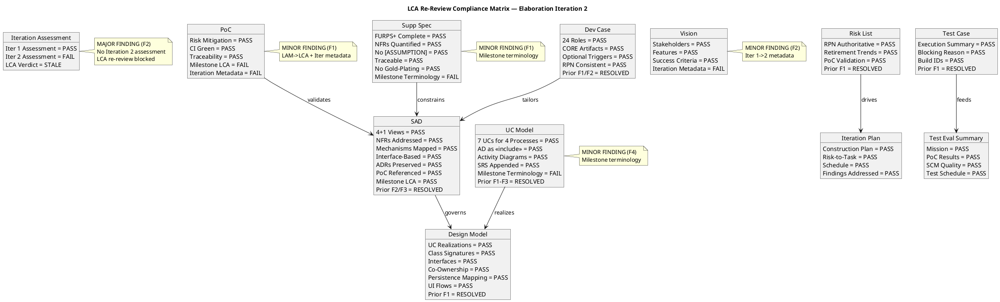
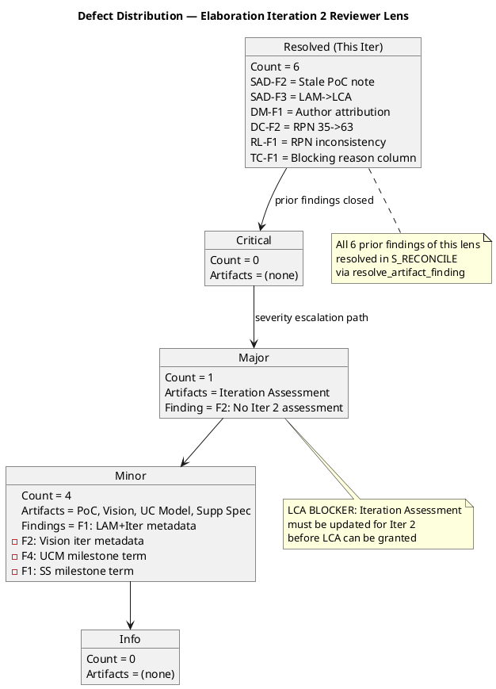
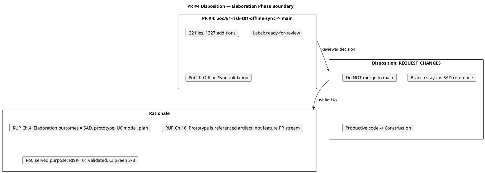

## Document Control

| Field | Value |
|---|---|
| Phase | Elaboration |
| Status | Draft |
| Iteration | 2 (Cycle 1) |
| Milestone Target | LCA (Lifecycle Architecture) |
| Author | Reviewer (technical lens) |
| Review Type | LCA Milestone Re-Review — Technical Lens |
| Review Date | 2026-07-07 |
| Prior Iteration | Elaboration 1 (LCA: CONDITIONAL NO-GO — auto-iterate required) |
| Verdict | APPROVED WITH CHANGES — 1 Major finding (Iteration Assessment), 4 Minor findings (metadata) |

## Review Scope and Criteria

### Artifacts Reviewed

| # | Artifact | Discipline | Review Lens | Checklist Applied | Prior Findings of This Lens |
|---|---|---|---|---|---|
| 1 | Software Architecture Document | Analysis & Design | Reviewer | Architecture stability, 4+1 views, ADRs, mechanisms, PoC reference, milestone metadata | F2 (Major, RESOLVED), F3 (Major, RESOLVED) |
| 2 | Design Model | Analysis & Design | Reviewer | UC realizations, class signatures, interfaces, co-ownership, persistence, UI flows | F1 (Minor, RESOLVED) |
| 3 | Use-Case Model | Requirements | Reviewer | UC flow completeness, actor mapping, scope guard, SRS consolidation | F1-F3 (Major, RESOLVED in Inception 2) |
| 4 | Supplementary Specification | Requirements | Reviewer | NFR coverage, FURPS+, quantification, traceability, no gold-plating | (none) |
| 5 | Iteration Plan | Project Management | Reviewer | Feasibility, schedule, risk-to-task mapping, Construction plan | (none) |
| 6 | Risk List | Project Management | Reviewer | RPN authority, retirement trends, PoC validation | F1 (Major, RESOLVED) |
| 7 | Development Case | Environment | Reviewer | DC baseline conformance, optional triggers, RPN consistency | F1 (Major, RESOLVED), F2 (Major, RESOLVED) |
| 8 | Test Case | Test | Reviewer | Execution summary, blocking reason, build IDs | F1 (Minor, RESOLVED) |
| 9 | Architectural Proof-of-Concept | Analysis & Design | Reviewer | PoC validity, risk mitigation, CI status, traceability | (none) |
| 10 | Iteration Assessment | Project Management | Reviewer | Iteration objective completion, LCA criteria assessment | (none) |
| 11 | Vision | Requirements | Reviewer | Stakeholders, features, success criteria, scope adherence | (none) |
| 12 | Test Evaluation Summary | Test | Reviewer | Mission, PoC results, SCM quality, test schedule | (none) |
| 13 | Review Record (prior) | Project Management | Reviewer | Prior findings reconciliation, closure verification | (self-referential) |

### LCA Exit Criteria Evaluated

| # | LCA Criterion | Status | Evidence |
|---|---|---|---|
| CR-1 | Architecture baselined (SAD 4+1 views, ADRs, mechanisms) | **MET** | SAD all 6 views complete, 3 ADRs preserved, all mechanisms mapped to design solutions, PoC-1 validates offline sync. Prior findings SAD-F2, SAD-F3 resolved. |
| CR-2 | Critical risks mitigated (RISK-T01, RISK-T03 PoC validated) | **MET** | RISK-T01 (RPN 63) and RISK-T03 (RPN 48) advanced to "PoC Validated" per Risk List. PoC-1 CI Green 3/3. RPN governance protocol established — all artifacts now reference authoritative Risk List values. |
| CR-3 | Construction plan credible (integration order, UC prioritization) | **MET** | Iteration Plan defines bottom-up integration order (Infrastructure → Application → Presentation), UC prioritization (UC-001 first), Construction iteration schedule with task breakdown. |
| CR-4 | Stakeholder sanction for LCA | **PENDING** | Stakeholder explicitly refused to advance past LCA in Iteration 1. Re-consultation required after corrective actions. This is outside the Reviewer's technical lens — flagged for PM/stakeholder action. |

## Findings

### Prior Findings Reconciliation (S_RECONCILE)

All 6 prior findings of this lens (Reviewer) with resolution==null have been resolved via `resolve_artifact_finding` in this iteration:

| Finding Key | Artifact | Severity | Disposition | Resolution Evidence |
|---|---|---|---|---|
| F2 | Software Architecture Document | Major | Resolved | SAD Document Control: "SAD-F2 RESOLVED: Stale PoC trigger note corrected" |
| F3 | Software Architecture Document | Major | Resolved | SAD Document Control: Milestone Target = "LCA (Lifecycle Architecture)" |
| F1 | Design Model | Minor | Resolved | DM Document Control: "Author: User-Interface Designer, Designer (Analysis & Design), Database Designer" |
| F2 | Development Case | Major | Resolved | DC Document Control: "Finding DC-F2 Status: RESOLVED — RPN values corrected to authoritative Risk List values" |
| F1 | Risk List | Major | Resolved | RPN=63 consistent across all artifacts; Risk List Document Control: "Findings Addressed: RL-F1" |
| F1 | Test Case | Minor | Resolved | TC Document Control: "TC-F1 (Minor — Blocking Reason column added to execution summary)" |

### New Findings (S2 — This Iteration)

| # | Finding Key | Artifact | Severity | Finding | Recommendation | Verdict |
|---|---|---|---|---|---|---|
| 1 | F1 | Architectural Proof-of-Concept | Minor | PoC Document Control Milestone Target states "End of Elaboration (LAM)" — same "LAM" typo fixed in SAD but not in PoC. Iteration field also still "1 (Cycle 1)". | Update Milestone Target to "LCA (Lifecycle Architecture)" and Iteration to "2 (Cycle 1)". Metadata correction only. | Approved |
| 2 | F2 | Iteration Assessment | Major | Iteration Assessment still at Iteration 1 metadata with no Iteration 2 assessment. LCA re-review requires updated assessment documenting whether the 6 corrective actions were completed and whether LCA exit criteria are now met. | Update to Iteration 2: add corrective actions status section, update objectives, state LCA exit criteria assessment from PM perspective. | NeedsRework |
| 3 | F2 | Vision | Minor | Vision Document Control still shows "Iteration: 1 (Cycle 1)" — not updated for current iteration. CR #1 (approved) addresses this but has not been executed. | Update iteration field to "2 (Cycle 1)". Metadata correction only. | Approved |
| 4 | F4 | Use-Case Model | Minor | Milestone Target states "End of Elaboration" instead of canonical "LCA (Lifecycle Architecture)" used across SAD, Risk List, DC, Iteration Plan. | Update Milestone Target to "LCA (Lifecycle Architecture)". | Approved |
| 5 | F1 | Supplementary Specification | Minor | Milestone Target states "End of Elaboration" instead of canonical "LCA (Lifecycle Architecture)". | Update Milestone Target to "LCA (Lifecycle Architecture)". | Approved |

### SCM State — PR Disposition

| PR # | Branch | Target | Disposition | Rationale |
|---|---|---|---|---|
| #4 | poc/E1-risk-t01-offline-sync | main | REQUEST_CHANGES | Elaboration phase boundary: PoC code must not merge to main. Branch stays as SAD reference. Productive feature code belongs in Construction per RUP Ch.4 and Ch.16. |

### SCM State — Open Issues

| Issue # | Severity | Status | Description | Relevance |
|---|---|---|---|---|
| #5 | Major | cr:approved | PoC tests excluded from CI pipeline | Construction entry — must integrate PoC tests into main CI |
| #7 | Major | cr:logged | Sync-over-async in TcpHealthMonitor | Architectural defect — needs Architect review before Construction |
| #8 | Minor | cr:logged | Reflection in SqliteLocalStore | Architectural defect — needs Architect review before Construction |
| #6 | Minor | cr:approved | Placeholder smoke test on main | Construction entry — must replace with real smoke test |
| #3 | Major | cr:logged | Design file impact assessment | Architectural — needs Architect review |
| #2 | Minor | cr:approved | Update Iteration Assessment objective statuses | Directly related to finding F2 (this review) |
| #1 | Minor | cr:approved | Update Vision Document Control iteration marker | Directly related to finding F2 (this review) |

## Compliance Matrix

## Defect Distribution

## PR Disposition

## Resolutions and Actions

### Resolved in This Iteration (S_RECONCILE)

| Finding | Artifact | Resolution | Evidence |
|---|---|---|---|
| SAD-F2 (Major, 3rd occ.) | Software Architecture Document | Resolved | Stale PoC trigger note removed; PoC-1 correctly referenced |
| SAD-F3 (Major, 1st occ.) | Software Architecture Document | Resolved | Milestone Target corrected from "LAM" to "LCA" |
| DM-F1 (Minor, 3rd occ.) | Design Model | Resolved | Author field updated to include all three co-owners |
| DC-F2 (Major, 1st occ.) | Development Case | Resolved | RPN values corrected to authoritative Risk List values |
| RL-F1 (Major, 2nd occ.) | Risk List | Resolved | RPN governance protocol established; all artifacts now reference RPN=63 |
| TC-F1 (Minor, 3rd occ.) | Test Case | Resolved | Blocking Reason column added to execution summary |

### Open Action Items

| # | Finding | Artifact | Severity | Action Required | Owner |
|---|---|---|---|---|---|
| 1 | F2 | Iteration Assessment | Major | Update to Iteration 2 with corrective actions status and LCA criteria assessment | Project Manager |
| 2 | F1 | Architectural Proof-of-Concept | Minor | Update Milestone Target to "LCA" and Iteration to "2" | Implementer / Software Architect |
| 3 | F2 | Vision | Minor | Update iteration field to "2 (Cycle 1)" — CR #1 already approved | System Analyst |
| 4 | F4 | Use-Case Model | Minor | Update Milestone Target to "LCA (Lifecycle Architecture)" | System Analyst |
| 5 | F1 | Supplementary Specification | Minor | Update Milestone Target to "LCA (Lifecycle Architecture)" | System Analyst |
| 6 | — | PR #4 | — | Do not merge; branch stays as SAD reference | All roles |
| 7 | — | CR #5, #7 | Major | Integrate PoC tests into main CI; fix sync-over-async before Construction | Software Architect / Implementer |

## Disposition

### Per-Artifact Verdicts

| Artifact | Verdict | Rationale |
|---|---|---|
| Software Architecture Document | **Approved** | All prior findings resolved. 4+1 views complete, ADRs preserved, mechanisms mapped, PoC referenced. Architecture baseline stable. |
| Design Model | **Approved** | Prior finding resolved. UC realizations complete (SEQ-001–SEQ-007), full class signatures, interfaces defined, persistence mapping and UI flows contributed by co-owners. |
| Use-Case Model | **Approved with Changes** | Content sound — 7 UCs for 4 declared processes, AD as cross-cutting mechanism, SRS appended. Minor milestone terminology fix needed. |
| Supplementary Specification | **Approved with Changes** | All NFRs quantified, FURPS+ complete, no assumptions, no gold-plating. Minor milestone terminology fix needed. |
| Iteration Plan | **Approved** | Construction plan credible, risk-to-task mapping complete, schedule defined, all findings addressed. |
| Risk List | **Approved** | RPN authoritative (63/High), retirement trends positive, PoC validation documented, governance protocol established. |
| Development Case | **Approved** | DC baseline conformance verified, optional triggers justified, RPN values consistent. All prior findings resolved. |
| Test Case | **Approved** | Execution summary complete with blocking reasons, build IDs referenced, prior finding resolved. |
| Architectural Proof-of-Concept | **Approved with Changes** | PoC-1 validates RISK-T01, CI Green 3/3, traceability complete. Minor metadata fixes needed (LAM→LCA, iteration). |
| Iteration Assessment | **NeedsRework** | No Iteration 2 assessment — must be updated before LCA can be granted. Major finding. |
| Vision | **Approved with Changes** | Content stable and correct. Minor iteration metadata update needed (CR #1 already approved). |
| Test Evaluation Summary | **Approved** | Mission clear, PoC results incorporated, SCM quality documented, test schedule added. |

### Overall LCA Re-Review Disposition

**APPROVED WITH CHANGES — Conditional GO pending Iteration Assessment update**

The technical artifacts are substantially ready for LCA. All 6 prior findings from this lens have been resolved. The architecture baseline is stable (SAD 4+1 views complete, ADRs preserved, mechanisms mapped, PoC-1 validates critical risks). The Construction plan is credible. RPN governance is established.

**One Major finding blocks unconditional LCA approval:** The Iteration Assessment has not been updated for Iteration 2. The LCA re-review requires an updated assessment documenting that the corrective iteration met its objectives. This is a PM action item — the Project Manager must update the Iteration Assessment before the LCA milestone can be granted.

**Four Minor findings** (metadata corrections on PoC, Vision, UC Model, Supplementary Specification) do not block LCA but should be corrected in the next iteration.

**Stakeholder sanction (CR-4)** remains pending — this is outside the Reviewer's technical lens but is a required LCA exit criterion. The PM must re-consult the stakeholder with the corrected artifacts.

**SCM state:** PR #4 disposed (REQUEST_CHANGES — do not merge PoC to main). 7 open issues tracked, including 2 Major architectural defects (#5, #7) that must be addressed before Construction entry.

## Traceability

| Element | Traces From | Link Type | Traces To |
|---|---|---|---|
| SAD Review | Software Architecture Document (Elaboration Iter 2) | Reviews | SAD (corrective actions — all resolved) |
| DM Review | Design Model (Elaboration Iter 2) | Reviews | Design Model (corrective action — resolved) |
| UCM Review | Use-Case Model (Elaboration Iter 2) | Reviews | Use-Case Model (minor metadata fix — pending) |
| SS Review | Supplementary Specification (Elaboration Iter 2) | Reviews | Supplementary Specification (minor metadata fix — pending) |
| RL Review | Risk List (Elaboration Iter 2) | Reviews | Risk List (corrective action — resolved) |
| DC Review | Development Case (Elaboration Iter 2) | Reviews | Development Case (corrective actions — all resolved) |
| IP Review | Iteration Plan (Elaboration Iter 2) | Reviews | Iteration Plan (no findings) |
| TC Review | Test Case (Elaboration Iter 2) | Reviews | Test Case (corrective action — resolved) |
| PoC Review | Architectural Proof-of-Concept (Elaboration Iter 1) | Reviews | PoC (minor metadata fix — pending) |
| IA Review | Iteration Assessment (Elaboration Iter 1) | Reviews | Iteration Assessment (Major — needs Iter 2 update) |
| Vision Review | Vision (Elaboration Iter 1) | Reviews | Vision (minor metadata fix — pending) |
| TES Review | Test Evaluation Summary (Elaboration Iter 2) | Reviews | TES (no findings) |
| PR #4 Disposition | scm_get_pull_request_diff (#4) | Reviews | PR #4 (REQUEST_CHANGES — do not merge) |
| SCM Issues | scm_list_issues (7 open) | DependsOn | Construction entry criteria |
| LCA Re-Review Verdict | All reviewed artifacts | Derives | LCA Milestone Decision, Construction Entry |
| Review Effectiveness Metrics | All reviewed artifacts | Derives | Process Improvement (Cycle 3 if needed) |