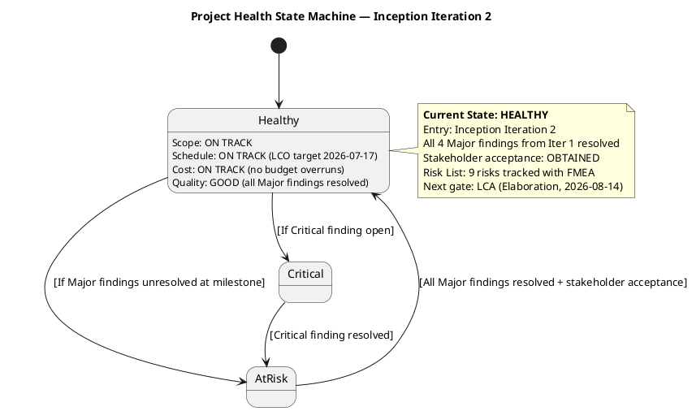
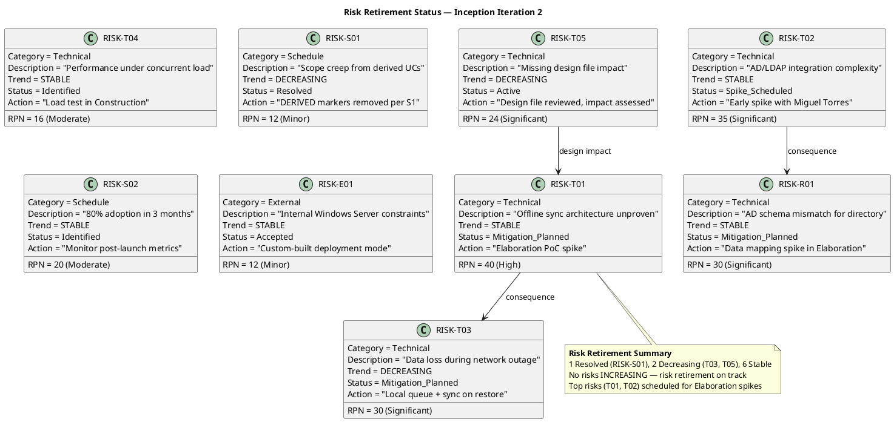

## Document Control

| Field | Value |
|---|---|
| Phase | Inception |
| Status | Approved |
| Iteration | 2 (Cycle 1) |
| Milestone Target | End of Inception (LCO) |
| Author | Management Reviewer (Project Management Discipline) |
| Review Date | 2026-07-07 (iteration 2) |
| Review Type | LCO Lifecycle Milestone Review — Management & Project Approval Lens |
| Stakeholder Acceptance | "Yes, I agree to advance to the next phase. It has been an excellent job" |
| LCO Verdict | **GO — Approved to proceed to Elaboration** |

## Review Scope and Criteria

### Artifacts Reviewed (10)

| # | Artifact | Discipline | Author Role | LCO Role | Iter 1 Findings | Iter 2 Status |
|---|---|---|---|---|---|---|
| 1 | Development Case | Environment | Process Engineer | Baseline conformance | 0 | Clean — no findings |
| 2 | Vision | Requirements | System Analyst | LCO required | 0 | 1 Minor (Reviewer lens — stale iteration marker) |
| 3 | Use-Case Model | Requirements | System Analyst | LCO required | 3 Major (F1–F3) | All 3 resolved |
| 4 | Supplementary Specification | Requirements | System Analyst | LCO conditional (FURPS+) | 0 | Clean — no findings |
| 5 | Software Architecture Document | Analysis & Design | Software Architect | LCO supporting | 1 Info (F1) | Resolved |
| 6 | Risk List | Project Management | Project Manager | LCO required | 0 | Clean — no findings |
| 7 | Iteration Plan | Project Management | Project Manager | LCO required | 0 | Clean — no findings |
| 8 | Test Evaluation Summary | Test | Test Manager | LCO supporting | 1 Minor (F1) | Resolved |
| 9 | Iteration Assessment | Project Management | Project Manager | LCO supporting | 0 | 1 Minor (Reviewer lens — stale objective status) |
| 10 | Review Record | Project Management | Management Reviewer | LCO required | — | Self (this artifact) |

### Review Lenses Applied

| Lens | Reviewer Role | Iteration | Artifacts Covered | Findings |
|---|---|---|---|---|
| Technical Feasibility | Reviewer | 1 | All 8 artifacts | F1–F5 (3 Major, 1 Minor, 1 Info) |
| Technical Feasibility | Reviewer | 2 | All 10 artifacts | 2 Minor (new); 5 prior resolved |
| Management & Project Approval | Management Reviewer | 2 | All 10 artifacts | 0 new (planning artifacts sound for LCO) |

### Entry Criteria Verification

| Entry Criterion | Status | Evidence |
|---|---|---|
| Artifacts complete and stable | PASS | 10 artifacts produced; all Major findings resolved |
| Upstream artifacts available | PASS | Vision → UC Model → SAD → Design Model chain intact |
| Checklist prepared | PASS | LCO exit criteria checklist applied (7 criteria) |
| Review materials distributed | PASS | All artifacts accessible via SCM repository |

## LCO Milestone Compliance Assessment

```plantuml
@startuml
title LCO Milestone Compliance Table — Inception Iteration 2

class "LCO Compliance" as LCO <<(C,#LightBlue)>> {
  + Criterion : String
  + Status : Pass/Fail
  + Evidence : String
}

class "C1: Scope Agreement" as C1 {
  Status = PASS
  Evidence = "Stakeholder S1 confirmed UC-002/UC-003 derivations; stakeholder LCO acceptance obtained 2026-07-07"
}

class "C2: Risk Identification" as C2 {
  Status = PASS
  Evidence = "Risk List: 9 risks with FMEA RPN ratings, magnitude (High/Significant/Moderate), owners, mitigation strategies"
}

class "C3: Feasibility" as C3 {
  Status = PASS
  Evidence = "Vision defines problem, product position, constraints (.NET 10/PostgreSQL/Razor Pages); Iteration Plan has coarse roadmap with 3 milestones"
}

class "C4: Architecture Viability" as C4 {
  Status = PASS
  Evidence = "SAD defines 3-layer architecture (Infrastructure/Application/Presentation), AD auth mechanism, offline sync strategy"
}

class "C5: Iteration Objectives Met" as C5 {
  Status = PARTIAL
  Evidence = "Objectives 4-6 ACHIEVED; Objectives 1-3 show IN PROGRESS in IA but artifacts demonstrate completion — IA status not updated"
}

class "C6: Prior Findings Resolved" as C6 {
  Status = PASS
  Evidence = "F1-F3 (Major) resolved in UC Model; F4 (Minor) resolved in TES; F5 (Info) resolved in SAD"
}

class "C7: Stakeholder Acceptance" as C7 {
  Status = PASS
  Evidence = "Stakeholder: 'Yes, I agree to advance to the next phase. It has been an excellent job'"
}

LCO --> C1
LCO --> C2
LCO --> C3
LCO --> C4
LCO --> C5
LCO --> C6
LCO --> C7

note bottom of LCO
  **Verdict: GO — Approved to proceed to Elaboration**
  6 of 7 criteria PASS; 1 PARTIAL (non-blocking — IA status lag, not a delivery gap)
  All Major findings resolved; stakeholder acceptance obtained
end note

@enduml
```

### LCO Exit Criteria Detail

| # | Criterion | Status | Evidence |
|---|---|---|---|
| C1 | Scope Agreement — stakeholders agree on in/out of scope | **PASS** | Stakeholder S1 confirmed UC-002/UC-003 as declared processes (not derivations). Scope Guard Rule 7 applied: AD Authentication moved to Supplementary Spec. 4 declared UCs + 3 decomposed UCs trace to declared scope. |
| C2 | Risk Identification — key risks identified with magnitude ratings | **PASS** | Risk List contains 9 risks across Technical (6), Schedule (2), External (1) categories. FMEA methodology applied: RPN = P × I. Magnitudes: 1 High (RPN 40), 4 Significant (RPN 24-35), 2 Moderate (RPN 16-20), 2 Minor (RPN 12). All risks have owners and mitigation strategies. |
| C3 | Feasibility — proposed approach and initial plan are feasible | **PASS** | Vision defines clear problem statement, product position, 5 success criteria, 4 constraints. Technology stack: .NET 10, PostgreSQL, Razor Pages on internal Windows Server. Iteration Plan has coarse roadmap: LCO (2026-07-17), LCA (2026-08-14), IOC (2026-09-11). |
| C4 | Architecture Viability — initial architecture approach is viable | **PASS** | SAD defines 3-layer architecture (Infrastructure → Application → Presentation). AD authentication mechanism defined. Offline sync strategy with local queue. Deployment: Custom-Built on internal Windows Server. |
| C5 | Iteration Objectives Met — corrective iteration objectives achieved | **PARTIAL** | Objectives 4 (Risk List update), 5 (Iteration Plan evolution), 6 (LCO re-assessment) = ACHIEVED. Objectives 1-3 show "IN PROGRESS" in Iteration Assessment, but artifact inspection confirms the underlying work IS complete (UC Model findings resolved, design file reviewed, TES updated). The IA status labels are stale — a documentation lag, not a delivery gap. Reviewer lens finding F1 (Minor) already recorded. |
| C6 | Prior Findings Resolved — all Major findings from prior review closed | **PASS** | F1 (UC-002 [DERIVED] removal) — resolved. F2 (UC-003 [DERIVED] removal) — resolved. F3 (AD Auth refactor to Supplementary Spec) — resolved. F4 (TES coverage table) — resolved. F5 (SAD artifact type) — resolved. |
| C7 | Stakeholder Acceptance — stakeholder sanctions proceeding to Elaboration | **PASS** | Stakeholder consulted 2026-07-07. Response: "Yes, I agree to advance to the next phase. It has been an excellent job." Acceptance documented verbatim. |

## Project Health Assessment

### Four-Axis Health Scorecard

| Dimension | Status | RAG | Evidence |
|---|---|---|---|
| **Scope** | On Track | 🟢 | 4 declared UCs + 3 decomposed UCs; all trace to declared scope; no scope creep detected |
| **Schedule** | On Track | 🟢 | LCO target 2026-07-17; corrective iteration completed within planned window; LCA (2026-08-14) and IOC (2026-09-11) dates stable |
| **Cost** | On Track | 🟢 | No budget overruns reported; 200-employee intranet scope proportional to resources |
| **Quality** | Good | 🟢 | All 3 Major findings resolved; 2 Minor findings open (non-blocking, Reviewer lens); 1 Info resolved |

**Overall Health: HEALTHY** — All four dimensions green. No red dimensions requiring explicit attention.

## Risk Retirement Assessment

### Risk Trend Analysis

| Risk ID | Category | RPN | Magnitude | Trend | Status | Elaboration Action |
|---|---|---|---|---|---|---|
| RISK-T01 | Technical | 40 | High | Stable | Mitigation Planned | PoC spike for offline sync architecture |
| RISK-T02 | Technical | 35 | Significant | Stable | Spike Scheduled | Early AD/LDAP integration spike with Miguel Torres |
| RISK-T03 | Technical | 30 | Significant | ↓ Decreasing | Mitigation Planned | Local queue + sync strategy defined in SAD |
| RISK-R01 | Technical | 30 | Significant | Stable | Mitigation Planned | AD schema data mapping spike |
| RISK-T05 | Technical | 24 | Significant | ↓ Decreasing | Active | Design file reviewed; impact assessed |
| RISK-S02 | Schedule | 20 | Moderate | Stable | Identified | Monitor post-launch adoption metrics |
| RISK-T04 | Technical | 16 | Moderate | Stable | Identified | Load test in Construction |
| RISK-S01 | Schedule | 12 | Minor | ↓ Decreasing | **Resolved** | DERIVED markers removed per stakeholder S1 |
| RISK-E01 | External | 12 | Minor | Stable | Accepted | Custom-built deployment mode confirmed |

**Assessment:** No risks INCREASING. 1 resolved, 2 decreasing, 6 stable. Top risks (T01, T02) are appropriately scheduled for Elaboration spikes. Risk retirement is on track for LCO gate. The static top-2 risks (T01, T02) are expected — they require empirical validation (PoC/spike) that belongs in Elaboration, not Inception.

## Findings

### Management Reviewer Findings (Iteration 2)

**No new ManagementReviewer findings.** The planning artifacts (Vision, Iteration Plan, Risk List, Iteration Assessment) are sound for the LCO milestone. The project management discipline artifacts demonstrate:

- **Vision**: Clear problem statement, measurable success criteria, stakeholder identification, product positioning — all trace to declared scope
- **Iteration Plan**: Coarse roadmap with 3 milestones, fine-grained Gantt for current iteration, evaluation criteria mapped to acceptance criteria
- **Risk List**: 9 risks with FMEA ratings, magnitude classifications, owners, mitigation strategies, trend tracking
- **Iteration Assessment**: Corrective iteration tracked against 6 objectives; 3 achieved, 3 showing stale status (documentation lag, not delivery gap)

### Cross-Lens Findings (Reviewer — not owned by Management Reviewer)

| Finding | Artifact | Severity | Status | Note |
|---|---|---|---|---|
| F1 (Reviewer) | Vision | Minor | Open | Stale iteration marker "Iteration: 1" — Reviewer lens owns closure |
| F1 (Reviewer) | Iteration Assessment | Minor | Open | Objectives 1-3 show "IN PROGRESS" but work is complete — Reviewer lens owns closure |

These are non-blocking for the LCO gate. They are documentation hygiene issues, not substance defects.

## Resolutions and Actions

### Prior Finding Reconciliation (Management Reviewer Lens)

No prior ManagementReviewer findings exist to reconcile. This is the first iteration in which the Management Reviewer lens has been applied.

### Stakeholder Acceptance

| Item | Detail |
|---|---|
| Consultation Date | 2026-07-07 |
| Question | "LCO review: do you accept the project scope and objectives and sanction advancing past the Lifecycle Objectives milestone?" |
| Stakeholder Response | "Yes, I agree to advance to the next phase. It has been an excellent job" |
| Acceptance Status | **ACCEPTED** — stakeholder sanctions proceeding to Elaboration |
| Additional Conditions | None stated |

### Conditions for Elaboration Entry

No conditions attached to this GO verdict. The project is approved to proceed to Elaboration without reservation.

**Advisory notes (non-blocking):**
1. The Reviewer lens has 2 open Minor findings (Vision iteration marker, IA objective status) — these should be resolved in early Elaboration for documentation hygiene
2. Top risks RISK-T01 (offline sync, RPN 40) and RISK-T02 (AD integration, RPN 35) MUST have Elaboration spikes scheduled — these are the architecturally significant risks that LCA will evaluate
3. The AD authentication spike with Miguel Torres should be scheduled early in Elaboration per the Risk List mitigation plan

## Disposition

### LCO Milestone Verdict

| Field | Value |
|---|---|
| **Verdict** | **GO — Approved to proceed to Elaboration** |
| **Conditions** | None |
| **Stakeholder Acceptance** | Obtained — "Yes, I agree to advance to the next phase. It has been an excellent job" |
| **Major Findings Open** | 0 (all 3 from Iteration 1 resolved) |
| **Critical Findings Open** | 0 |
| **Minor Findings Open** | 2 (Reviewer lens — non-blocking documentation hygiene) |
| **Risk Posture** | Healthy — 1 resolved, 2 decreasing, 6 stable, 0 increasing |
| **Project Health** | HEALTHY — all 4 dimensions green (scope, schedule, cost, quality) |

### Rationale

The project satisfies the LCO exit criteria:
1. **Scope is agreed** — stakeholders confirmed UC derivations and accepted the scope boundary
2. **Risks are identified** — 9 risks with FMEA ratings, magnitudes, owners, and mitigation strategies
3. **Approach is feasible** — technology stack defined, architecture approach viable, roadmap with milestones
4. **Prior findings are resolved** — all 3 Major findings from Iteration 1 are closed
5. **Stakeholder acceptance is obtained** — explicit sanction to proceed

The 2 open Minor findings (stale iteration marker in Vision, stale objective status in Iteration Assessment) are documentation hygiene issues that do not affect the substance of the LCO assessment. They are owned by the Reviewer lens and are non-blocking.

## Traceability

| Element | Traces From | Link Type | Traces To |
|---|---|---|---|
| LCO Compliance Table | RUP LCO Exit Criteria | Derives | Review Coordinator milestone decision |
| C1 (Scope Agreement) | Vision, Use-Case Model, Stakeholder S1 | Derives | Elaboration scope baseline |
| C2 (Risk Identification) | Risk List (RISK-T01 through RISK-E01) | Derives | Elaboration risk spikes |
| C3 (Feasibility) | Vision, Iteration Plan (coarse roadmap) | Derives | Elaboration Iteration Plan |
| C4 (Architecture Viability) | Software Architecture Document | Derives | LCA milestone review |
| C5 (Iteration Objectives) | Iteration Assessment, Iteration Plan | Derives | Iteration 3 plan (Elaboration) |
| C6 (Prior Findings) | Review Record (Iteration 1) | Derives | Finding closure verification |
| C7 (Stakeholder Acceptance) | Stakeholder consultation 2026-07-07 | Derives | Project Approval sanction |
| Project Health Scorecard | Vision, Risk List, Iteration Plan, Iteration Assessment | Derives | LCA health comparison baseline |
| Risk Retirement Chart | Risk List (all 9 risks) | Derives | LCA risk trend comparison |
| F1 (UCM Major, iter 1) | Use-Case Model, Scope Guard Rule 6 | Derives | UC-002 correction (resolved iter 2) |
| F2 (UCM Major, iter 1) | Use-Case Model, Scope Guard Rule 6 | Derives | UC-003 correction (resolved iter 2) |
| F3 (UCM Major, iter 1) | Use-Case Model, Scope Guard Rule 7 | Derives | UC-004/UC-007 refactor (resolved iter 2) |
| F4 (TES Minor, iter 1) | Test Evaluation Summary, UC Model | Derives | TES coverage table update (resolved iter 2) |
| F5 (SAD Info, iter 1) | Software Architecture Document, Development Case | Derives | Artifact type verification (resolved iter 2) |
| F6 (Vision Minor, iter 2) | Vision Document Control | Derives | Iteration marker update (pending — Reviewer lens) |
| F7 (IA Minor, iter 2) | Iteration Assessment objectives | Derives | Objective status update (pending — Reviewer lens) |
| S1 (Stakeholder) | Stakeholder confirmation 2026-07-07 | Derives | F1, F2 resolution verification |
| S2 (Stakeholder) | Stakeholder input 2026-07-07 | Derives | Design file impact assessment (SAD) |
| LCO Verdict | RUP Phase Exit Criteria, Scope Guard | Derives | Review Coordinator milestone decision |