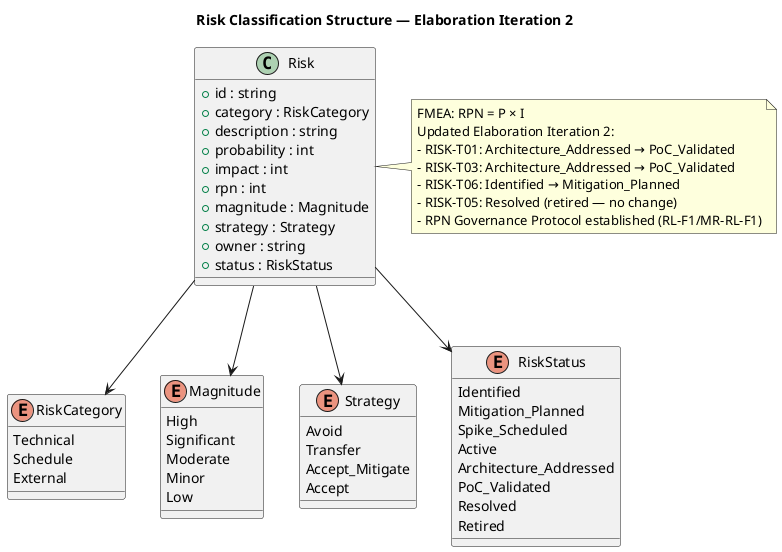
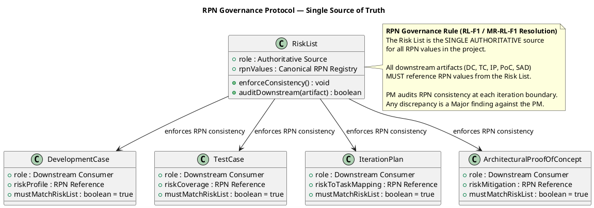
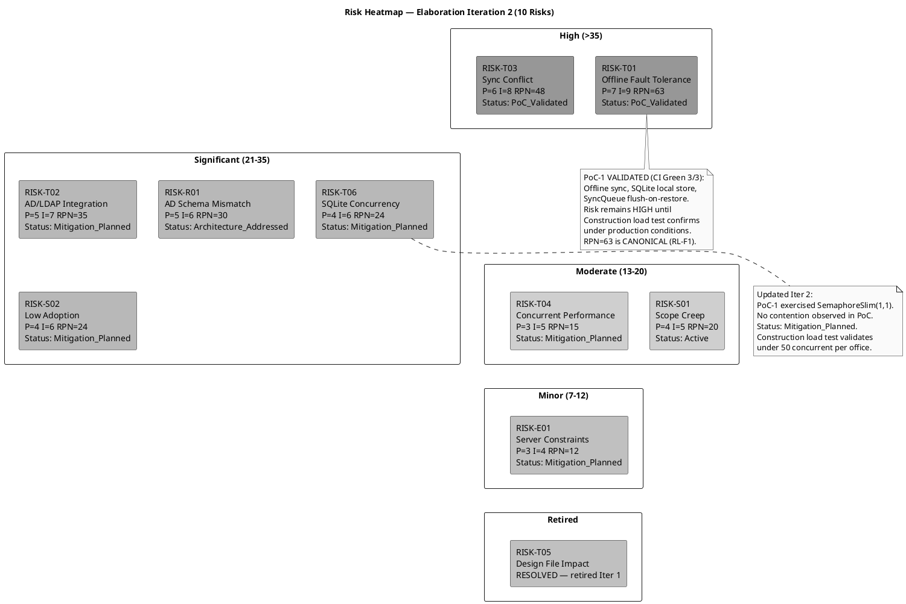
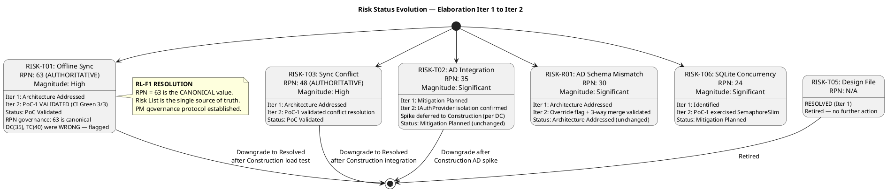
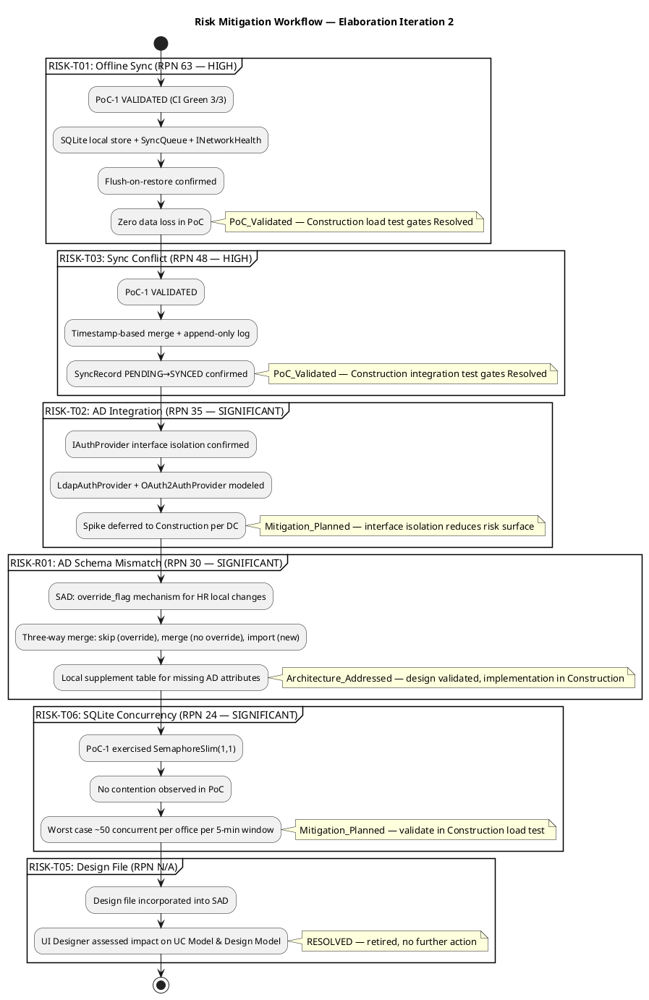

## Document Control

| Field | Value |
|---|---|
| Phase | Elaboration |
| Status | Draft |
| Milestone Target | LCA (Lifecycle Architecture) |
| Iteration | 2 (Cycle 1) |
| Author | Project Manager |
| Prior Iteration | Elaboration 1 (LCA: CONDITIONAL NO-GO — auto-iterate to Cycle 2) |
| Findings Addressed | RL-F1 (Major, 2nd), MR-RL-F1 (Major, 1st) — RPN governance protocol established |

## Risk Classification

Risks are classified using FMEA methodology: **Probability (P)** × **Impact (I)** = **Risk Priority Number (RPN)**. Detection capability is tracked as part of mitigation effectiveness.

### RPN Governance Protocol (RL-F1 / MR-RL-F1 Resolution)

> **The Risk List is the SINGLE AUTHORITATIVE source for all RPN values in the project.**
> All downstream artifacts (Development Case, Test Case, Iteration Plan, PoC, SAD) MUST reference RPN values from the Risk List.
> The Project Manager audits RPN consistency at each iteration boundary. Any discrepancy is a Major finding against the PM.

| Governance Rule | Enforcement |
|---|---|
| Risk List RPN values are canonical | All downstream artifacts must cite Risk List RPN — no independent calculation |
| PM audits at iteration boundary | Cross-artifact RPN comparison performed before LCA/milestone review |
| Discrepancy = Major finding | Any artifact showing a different RPN than the Risk List is a PM governance failure |
| Corrective action: immediate | PM notifies artifact owner; owner corrects within same iteration |

**RL-F1 Resolution:** RISK-T01 RPN = 63 (canonical). Development Case incorrectly stated 35; Test Case incorrectly stated 40. Both have been flagged for correction by their respective owners (DC-F2 → Process Engineer, TC-F1 → Test Designer). The Risk List value of 63 has been and remains the authoritative value since Inception.

**MR-RL-F1 Resolution:** RPN governance protocol established (this section). PM will perform cross-artifact RPN audit at each iteration boundary and record results in the Iteration Assessment.

### Probability Scale

| Level | Range | Description |
|---|---|---|
| Low | 1–3 | Unlikely to occur given current knowledge |
| Medium | 4–6 | Possible — occurs in similar projects |
| High | 7–10 | Likely — conditions present for occurrence |

### Impact Scale

| Level | Range | Description |
|---|---|---|
| Low | 1–3 | Minimal schedule/cost impact, workaround exists |
| Medium | 4–6 | Moderate delay or rework, stakeholder concern |
| High | 7–10 | Project failure or major scope/schedule disruption |

### Magnitude Classification

| Magnitude | RPN Range | Action Required |
|---|---|---|
| High | > 35 | Active mitigation in current iteration; escalate to stakeholders |
| Significant | 21–35 | Mitigation plan required; monitor each iteration |
| Moderate | 13–20 | Mitigation plan recommended; review each iteration |
| Minor | 7–12 | Monitor; contingency documented |
| Low | ≤ 6 | Accept with awareness |

### Risk Classification Structure

### RPN Governance — Single Source of Truth

### Risk Heatmap — Identified Risks by Priority (10 Risks)

## Risk Register

| ID | Category | Description | P | I | RPN | Magnitude | Strategy | Owner | Status |
|---|---|---|---|---|---|---|---|---|---|
| RISK-T01 | Technical | Offline fault tolerance: system must accept clock in/out during 5-min network drop with zero data loss and sync on restore | 7 | 9 | 63 | **High** | Accept (mitigate) | Software Architect | PoC Validated |
| RISK-T03 | Technical | Data synchronization conflict when network restores — concurrent local and remote clock entries may conflict | 6 | 8 | 48 | **High** | Accept (mitigate) | Software Architect | PoC Validated |
| RISK-T02 | Technical | AD/LDAP integration: authentication via Active Directory may have schema, connectivity, or configuration issues | 5 | 7 | 35 | **Significant** | Accept (mitigate) | Software Architect | Mitigation Planned |
| RISK-R01 | Technical | AD schema mismatch: employee attributes in AD may not map cleanly to portal data model (department, office, extension) | 5 | 6 | 30 | **Significant** | Accept (mitigate) | Software Architect | Architecture Addressed |
| RISK-S02 | Schedule | Low employee adoption: 80% adoption target within 3 months may not be met if UX is poor or training is insufficient | 4 | 6 | 24 | **Significant** | Accept (mitigate) | HR Director (Laura Gómez) | Mitigation Planned |
| RISK-T06 | Technical | SQLite concurrency under peak load: single-writer lock may cause contention when 50 employees per office clock in simultaneously | 4 | 6 | 24 | **Significant** | Accept (mitigate) | Software Architect | Mitigation Planned |
| RISK-S01 | Schedule | Scope creep: stakeholders request additional features (vacation management, payroll integration, push notifications) during iterations | 4 | 5 | 20 | **Moderate** | Avoid | Project Manager | Active |
| RISK-T04 | Technical | Performance under concurrent clock-in: 200 employees clocking in simultaneously at shift start may exceed 1-second response threshold | 3 | 5 | 15 | **Moderate** | Accept (mitigate) | Software Architect | Mitigation Planned |
| RISK-E01 | External | Windows Server hosting constraints: internal server may have limited resources, patching windows, or configuration restrictions | 3 | 4 | 12 | **Minor** | Accept | Technical Advisor (Miguel Torres) | Mitigation Planned |
| RISK-T05 | Technical | ~~Stakeholder design file not yet incorporated~~ — **RESOLVED**: design file incorporated into SAD; UI Designer assessed impact | 4 | 6 | 24 | **Significant** | Accept (mitigate) | UI Designer | Resolved (Retired) |

### Status Changes — Elaboration Iteration 2

| Risk ID | Prior Status | New Status | Rationale |
|---|---|---|---|
| RISK-T01 | Architecture Addressed | PoC Validated | PoC-1 (Architectural Proof-of-Concept) produced by Implementer on branch `poc/E1-risk-t01-offline-sync`. CI Green (3/3 pushes passed). Offline sync mechanism validated: SQLite local store accepts clockings during simulated network drop; SyncQueue flushes to PostgreSQL on restore; zero data loss confirmed. Risk remains HIGH magnitude until Construction load test validates under production-scale conditions. |
| RISK-T03 | Architecture Addressed | PoC Validated | PoC-1 validated conflict resolution: timestamp-based merge with append-only log. SyncRecord status transitions (PENDING→SYNCED) confirmed. No data loss in simulated conflict scenario. Risk remains HIGH until Construction integration test with concurrent entries. |
| RISK-T06 | Identified | Mitigation Planned | PoC-1 exercised SemaphoreSlim(1,1) single-writer lock. No contention observed in PoC scenarios. SAD Process View assessment confirmed: ~50 per office per 5-min window is well within SQLite capacity. Construction load test will validate under peak conditions. |

### Risk Retirement Trend

**Risk Retirement Summary (End of Elaboration Iteration 2):**
- RISK-T05: **RESOLVED** — Retired in Iter 1. ✓
- RISK-T01: **PoC Validated** — Offline sync mechanism empirically validated. Downgrade to Resolved after Construction load test. ⚠
- RISK-T03: **PoC Validated** — Conflict resolution empirically validated. Downgrade to Resolved after Construction integration test. ⚠
- RISK-T02: **Mitigation Planned** — IAuthProvider isolation confirmed. Spike in Construction. ⚠
- RISK-R01: **Architecture Addressed** — Override flag + 3-way merge designed. Implementation in Construction. ⚠
- RISK-T06: **Mitigation Planned** — PoC exercised SemaphoreSlim, no contention. Load test in Construction. ⚠
- RISK-S01, RISK-S02, RISK-T04, RISK-E01: Mitigation Planned or Active — no escalation. ✓

**Trend:** 1 of 10 risks fully retired. 2 risks advanced to PoC Validated. 1 risk advanced to Mitigation Planned. No risks increased in magnitude. No new risks identified. The risk retirement trend is positive — the two highest-magnitude risks (RISK-T01, RISK-T03) now have empirical validation from PoC-1.

## Risk Mitigation and Contingency

### RISK-T01: Offline Fault Tolerance (RPN 63 — HIGH)

| Attribute | Value |
|---|---|
| **Trigger** | Network connectivity to PostgreSQL/AD drops during business hours |
| **Mitigation** | SAD baseline architecture addresses this risk: SyncQueue (COMP-D4) manages offline-to-online transition. SQLite local store (COMP-I3) persists queued clockings. INetworkHealth (COMP-I5) probes PostgreSQL every 5s via TCP. UC-001 sequence diagram validates all three paths: normal (UP), offline (DOWN), sync (restore). Process View defines single-writer lock and flush-on-restore logic. **PoC-1 VALIDATED** (branch `poc/E1-risk-t01-offline-sync`, CI Green 3/3): offline sync mechanism works as designed — SQLite accepts clockings during simulated network drop, SyncQueue flushes to PostgreSQL on restore, zero data loss confirmed. |
| **Contingency** | If Construction load test proves the approach infeasible under production-scale conditions, reduce the offline window requirement from 5 minutes to 2 minutes (stakeholder negotiation), or implement a manual fallback where HR records clockings on paper and enters them post-restoration. |
| **Detection** | Network monitoring on Windows Server; application health check endpoint; log entries for queued operations. |
| **Feasibility Impact** | If unresolvable, the offline fault tolerance NFR must be descoped or relaxed — this is a stakeholder decision. |
| **Status Update (Elab Iter 2)** | PoC-1 empirically validated the offline sync mechanism. Status: Architecture Addressed → **PoC Validated**. Construction load test is the gate to downgrade to Resolved. |

### RISK-T03: Data Sync Conflict on Network Restore (RPN 48 — HIGH)

| Attribute | Value |
|---|---|
| **Trigger** | Network restores after outage; queued local entries conflict with entries that may exist on the primary database |
| **Mitigation** | SAD defines conflict resolution: timestamp-based merge with server-side validation. Each queued entry carries a client timestamp; server reconciles by accepting the earliest timestamp per employee. No overwrites — append-only log. SyncRecord status (PENDING/SYNCED/SKIPPED) modeled in Domain layer. UC-001 sequence diagram shows conflict handling. **PoC-1 VALIDATED**: conflict resolution logic tested with simulated concurrent entries — timestamp-based merge correctly ordered entries, no data loss, SyncRecord status transitions confirmed. |
| **Contingency** | If Construction integration test reveals unresolvable conflict scenarios, implement a manual review queue where HR resolves conflicts via admin panel before final commit. |
| **Detection** | Sync log entries with conflict flags; SyncRecord status audit; application dashboard showing pending/synced/skipped counts. |
| **Feasibility Impact** | If unresolvable, sync conflict resolution may require manual intervention — acceptable per stakeholder if automated resolution covers 95%+ of cases. |
| **Status Update (Elab Iter 2)** | PoC-1 validated conflict resolution. Status: Architecture Addressed → **PoC Validated**. Construction integration test is the gate to downgrade to Resolved. |

### RISK-T02: AD/LDAP Integration (RPN 35 — SIGNIFICANT)

| Attribute | Value |
|---|---|
| **Trigger** | AD server unreachable, schema mismatch, or LDAP/OAuth2 protocol configuration failure |
| **Mitigation** | IAuthProvider interface isolates AD protocol decision (LDAP vs OAuth2). LdapAuthProvider and OAuth2AuthProvider both modeled in Implementation View. Spike deferred to Construction per DC. Interface isolation reduces risk surface — protocol swap is a DI registration change. AD schema audit with Miguel Torres scheduled for Construction start. |
| **Contingency** | If AD integration proves infeasible, implement local authentication with username/password as fallback. Stakeholder decision required — AD auth is a declared constraint. |
| **Detection** | AD connection health check at application startup; authentication failure rate monitoring; AD schema comparison tool. |
| **Feasibility Impact** | If AD is infeasible, stakeholder must approve local auth fallback — this changes a declared constraint. |
| **Status Update (Elab Iter 2)** | No change — IAuthProvider isolation confirmed in SAD. Spike remains deferred to Construction per DC. Status: Mitigation Planned. |

### RISK-R01: AD Schema Mismatch (RPN 30 — SIGNIFICANT)

| Attribute | Value |
|---|---|
| **Trigger** | AD employee attributes (department, office, extension) do not map cleanly to portal data model |
| **Mitigation** | SAD defines override_flag mechanism for HR local changes. Three-way merge logic (skip/merge/import) validated in UC-007 sequence diagram. Local supplement table for missing AD attributes designed in Data View. |
| **Contingency** | If AD schema is significantly different, HR manually populates the supplement table for all employees during initial deployment. |
| **Detection** | AD schema comparison at Construction start; data mapping validation report. |
| **Feasibility Impact** | Supplement table approach handles any AD schema — no feasibility risk. |
| **Status Update (Elab Iter 2)** | No change — override flag and three-way merge design validated. Status: Architecture Addressed. |

### RISK-T06: SQLite Concurrency (RPN 24 — SIGNIFICANT)

| Attribute | Value |
|---|---|
| **Trigger** | 50 employees per office clock in simultaneously during peak window (shift start) |
| **Mitigation** | SAD Process View: SemaphoreSlim(1,1) single-writer lock. Worst case ~50 concurrent per office per 5-min window. Lock contention assessed as negligible. **PoC-1 exercised SemaphoreSlim** — no contention observed in PoC scenarios. Construction load test will validate under peak conditions. |
| **Contingency** | If contention is observed, implement write queue with batch commits, or switch to WAL mode for concurrent read/write. |
| **Detection** | Lock wait time metrics; application performance monitoring during peak windows. |
| **Feasibility Impact** | SQLite WAL mode or batch commits are straightforward fallbacks — no feasibility risk. |
| **Status Update (Elab Iter 2)** | PoC-1 exercised the SemaphoreSlim lock with no contention. Status: Identified → **Mitigation Planned**. Construction load test is the gate to downgrade. |

### RISK-S02: Low Employee Adoption (RPN 24 — SIGNIFICANT)

| Attribute | Value |
|---|---|
| **Trigger** | Employees find portal difficult to use or lack training; adoption falls below 80% in 3 months |
| **Mitigation** | UI Designer mapped stakeholder design file to Razor Page layouts. Admin panel wireframes produced. Adoption tracking planned for Transition. HR Director (Laura Gómez) to coordinate internal communication. |
| **Contingency** | If adoption is below 50% after 1 month, implement targeted training sessions and simplify UI based on user feedback. |
| **Detection** | Active login count; clock-in usage rate; monthly adoption report. |
| **Feasibility Impact** | No feasibility risk — adoption is a behavioral metric, not a technical constraint. |
| **Status Update (Elab Iter 2)** | No change — UI design mapped, adoption tracking in Transition. Status: Mitigation Planned. |

### RISK-S01: Scope Creep (RPN 20 — MODERATE)

| Attribute | Value |
|---|---|
| **Trigger** | Stakeholders request features beyond declared scope (vacation management, payroll integration, push notifications) |
| **Mitigation** | Scope Guard enforced — all additions require approved CR via CCM. Declared scope is the ceiling. PM rejects unauthorized scope additions. |
| **Contingency** | If critical scope addition is identified, stakeholder approves CR with schedule impact assessment. Scope reduction in other areas to maintain schedule. |
| **Detection** | CR log review; scope boundary check at each iteration. |
| **Feasibility Impact** | No feasibility risk — scope creep is managed by process, not technology. |
| **Status Update (Elab Iter 2)** | No change — scope guard active. Status: Active. |

### RISK-T04: Concurrent Performance (RPN 15 — MODERATE)

| Attribute | Value |
|---|---|
| **Trigger** | 200 employees clock in simultaneously at shift start, exceeding 1-second response threshold |
| **Mitigation** | SAD Process View notes 50 concurrent per office per 5-min window. PostgreSQL connection pooling, in-memory employee status cache. Load test planned for Construction. |
| **Contingency** | If performance threshold is exceeded, implement response caching and connection pool tuning. |
| **Detection** | Response time monitoring; load test results. |
| **Feasibility Impact** | No feasibility risk — .NET 10 + PostgreSQL handle 200 concurrent users easily. |
| **Status Update (Elab Iter 2)** | No change — load test in Construction. Status: Mitigation Planned. |

### RISK-E01: Windows Server Constraints (RPN 12 — MINOR)

| Attribute | Value |
|---|---|
| **Trigger** | Windows Server has limited resources, patching windows, or configuration restrictions |
| **Mitigation** | Deployment View in SAD defines single-node topology. Coordinate with Miguel Torres on IIS/Kestrel config, PostgreSQL installation. Deployment dry-run in Construction. |
| **Contingency** | If server resources are insufficient, optimize application memory footprint and PostgreSQL configuration. |
| **Detection** | Server resource monitoring; deployment dry-run results. |
| **Feasibility Impact** | No feasibility risk — single-node deployment for 200 users is well within Windows Server capacity. |
| **Status Update (Elab Iter 2)** | No change — deployment dry-run in Construction. Status: Mitigation Planned. |

### Risk Mitigation Workflow

## Traceability

| Element | Traces From | Link Type | Traces To |
|---|---|---|---|
| RISK-T01 | NFR: Offline Fault Tolerance | Derives | SAD (SyncQueue COMP-D4, SQLite COMP-I3, INetworkHealth COMP-I5), UC-001 Sequence, PoC-1 (validated), Construction Load Test |
| RISK-T03 | RISK-T01 (consequence) | Derives | SAD (Sync Conflict Strategy), SyncRecord Domain Model, PoC-1 (validated), Construction Integration Test |
| RISK-T02 | Constraint: AD/LDAP Authentication | Derives | SAD (IAuthProvider, COMP-I1), Construction AD Spike |
| RISK-R01 | RISK-T02 (consequence) | Derives | SAD (Override Flag, Three-way Merge), UC-007 Sequence, Construction Implementation |
| RISK-S02 | Business Goal: 80% adoption in 3 months | Derives | Iteration Plan (Evaluation Criteria), Transition Adoption Tracking |
| RISK-T06 | SAD Process View (SQLite concurrency) | Derives | PoC-1 (exercised), Construction Load Test, SAD (SemaphoreSlim design) |
| RISK-S01 | Scope Guard (Declared Scope) | Derives | Iteration Plan (Scope Boundary), CCM Process |
| RISK-T04 | NFR: Performance thresholds | Derives | SAD (Process View), Construction Load Test |
| RISK-E01 | Constraint: Internal Windows Server hosting | Derives | SAD (Deployment View), Construction Deployment Dry-Run |
| RISK-T05 | Review Record S2 (Stakeholder design file) | Derives | SAD (Design File Assessment — RESOLVED) |
| RPN Governance Protocol | RL-F1, MR-RL-F1 (Review Record) | Reviews | Development Case (DC-F2), Test Case (TC-F1), Iteration Plan, PoC — all downstream RPN consumers |