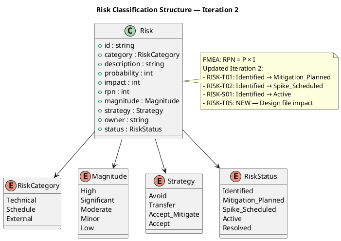
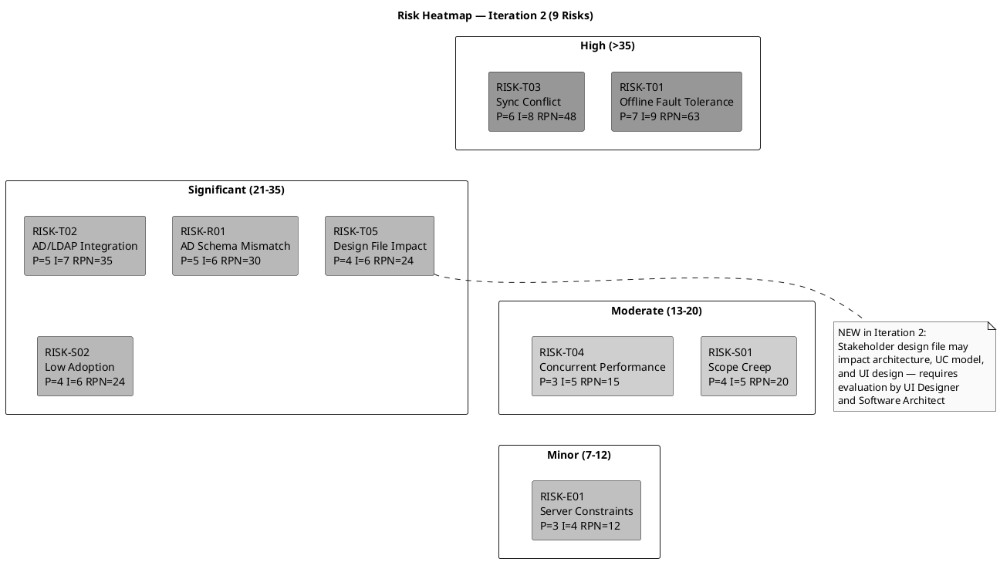

## Document Control
| Field | Value |
|---|---|
| Phase | Inception |
| Status | Draft |
| Milestone Target | End of Inception (LCO) |
| Iteration | 2 (Cycle 1) |
| Author | Project Manager |
## Risk Classification
Risks are classified using FMEA methodology: **Probability (P)** × **Impact (I)** = **Risk Priority Number (RPN)**. Detection capability is tracked as part of mitigation effectiveness.

### Probability Scale

| Level | Range | Description |
|---|---|---|
| Low | 1–3 | Unlikely to occur given current knowledge |
| Medium | 4–6 | Possible — occurs in similar projects |
| High | 7–10 | Likely — conditions present for occurrence |

### Impact Scale

| Level | Range | Description |
|---|---|---|
| Low | 1–3 | Minimal schedule/cost impact, workaround exists |
| Medium | 4–6 | Moderate delay or rework, stakeholder concern |
| High | 7–10 | Project failure or major scope/schedule disruption |

### Magnitude Classification

| Magnitude | RPN Range | Action Required |
|---|---|---|
| High | > 35 | Active mitigation in current iteration; escalate to stakeholders |
| Significant | 21–35 | Mitigation plan required; monitor each iteration |
| Moderate | 13–20 | Mitigation plan recommended; review each iteration |
| Minor | 7–12 | Monitor; contingency documented |
| Low | ≤ 6 | Accept with awareness |

### Risk Classification Structure

### Risk Heatmap — Identified Risks by Priority (9 Risks)

## Risk Register
| ID | Category | Description | P | I | RPN | Magnitude | Strategy | Owner | Status |
|---|---|---|---|---|---|---|---|---|---|
| RISK-T01 | Technical | Offline fault tolerance: system must accept clock in/out during 5-min network drop with zero data loss and sync on restore | 7 | 9 | 63 | **High** | Accept (mitigate) | Software Architect | Mitigation Planned |
| RISK-T03 | Technical | Data synchronization conflict when network restores — concurrent local and remote clock entries may conflict | 6 | 8 | 48 | **High** | Accept (mitigate) | Software Architect | Identified |
| RISK-T02 | Technical | AD/LDAP integration: authentication via Active Directory may have schema, connectivity, or configuration issues | 5 | 7 | 35 | **Significant** | Accept (mitigate) | Software Architect | Spike Scheduled |
| RISK-R01 | Technical | AD schema mismatch: employee attributes in AD may not map cleanly to portal data model (department, office, extension) | 5 | 6 | 30 | **Significant** | Accept (mitigate) | Software Architect | Identified |
| RISK-S02 | Schedule | Low employee adoption: 80% adoption target within 3 months may not be met if UX is poor or training is insufficient | 4 | 6 | 24 | **Significant** | Accept (mitigate) | HR Director (Laura Gómez) | Identified |
| RISK-T05 | Technical | Stakeholder design file (`employee-portal-design.html`) not yet incorporated — may require architecture, UC model, or UI design changes | 4 | 6 | 24 | **Significant** | Accept (mitigate) | UI Designer | Identified |
| RISK-S01 | Schedule | Scope creep: stakeholders request additional features (vacation management, payroll integration, push notifications) during iterations | 4 | 5 | 20 | **Moderate** | Avoid | Project Manager | Active |
| RISK-T04 | Technical | Performance under concurrent clock-in: 200 employees clocking in simultaneously at shift start may exceed 1-second response threshold | 3 | 5 | 15 | **Moderate** | Accept (mitigate) | Software Architect | Identified |
| RISK-E01 | External | Windows Server hosting constraints: internal server may have limited resources, patching windows, or configuration restrictions | 3 | 4 | 12 | **Minor** | Accept | Technical Advisor (Miguel Torres) | Identified |
## Risk Mitigation and Contingency
### RISK-T01: Offline Fault Tolerance (RPN 63 — HIGH)

| Attribute | Value |
|---|---|
| **Trigger** | Network connectivity to PostgreSQL/AD drops during business hours |
| **Mitigation** | Architect a local caching/queueing mechanism on the web server that accepts clock in/out operations during network interruption. Store entries in a local persistent store (e.g., SQLite or local file) and sync to PostgreSQL when connectivity restores. This must be validated via a Proof of Concept in Elaboration Iteration 1. |
| **Contingency** | If PoC proves the approach infeasible within Elaboration, reduce the offline window requirement from 5 minutes to 2 minutes (stakeholder negotiation), or implement a manual fallback where HR records clockings on paper and enters them post-restoration. |
| **Detection** | Network monitoring on Windows Server; application health check endpoint; log entries for queued operations. |
| **Feasibility Impact** | If unresolvable, the offline fault tolerance NFR must be descoped or relaxed — this is a stakeholder decision. |
| **Status Update (Iter 2)** | SAD addresses offline sync strategy; PoC deferred to Elaboration Iteration 1. Status: Identified → **Mitigation Planned**. |

### RISK-T03: Data Sync Conflict on Network Restore (RPN 48 — HIGH)

| Attribute | Value |
|---|---|
| **Trigger** | Network restores after outage; queued local entries conflict with entries that may exist on the primary database |
| **Mitigation** | Design a conflict resolution strategy: timestamp-based merge with server-side validation. Each queued entry carries a client timestamp; server reconciles by accepting the earliest timestamp per employee. No overwrites — append-only log. |
| **Contingency** | If conflict resolution is too complex, implement a "last-write-wins" with HR manual review of flagged conflicts. HR sees a conflict report and resolves manually. |
| **Detection** | Sync process logs conflicts; HR dashboard shows unresolved sync conflicts. |

### RISK-T02: AD/LDAP Integration (RPN 35 — SIGNIFICANT)

| Attribute | Value |
|---|---|
| **Trigger** | AD connection fails during development or production; LDAP query performance issues; authentication errors |
| **Mitigation** | Early spike in Elaboration Iteration 1: validate LDAP connectivity from .NET 10 on Windows Server, test authentication flow, and document AD connection parameters with Miguel Torres. Use System.DirectoryServices.Protocols or Novell.Directory.Ldap.NETStandard. |
| **Contingency** | If AD integration proves problematic, implement a fallback authentication mode using local credentials (bcrypt-hashed) with a migration path to AD. This is a temporary measure — AD remains the target. |
| **Detection** | Authentication failure rate monitoring; AD connection health check. |
| **Status Update (Iter 2)** | Elaboration spike with Miguel Torres confirmed in Iteration Plan. Status: Identified → **Spike Scheduled**. |

### RISK-R01: AD Schema Mismatch (RPN 30 — SIGNIFICANT)

| Attribute | Value |
|---|---|
| **Trigger** | Required employee attributes (department, office, extension phone) are not populated in AD or use non-standard attribute names |
| **Mitigation** | During Elaboration, audit the actual AD schema with Miguel Torres. Map AD attributes to portal fields. For missing attributes, use a local supplement table in PostgreSQL keyed by AD user GUID. HR maintains supplemental data via the admin panel. |
| **Contingency** | If AD cannot provide key attributes, all employee directory data is maintained locally in PostgreSQL with manual HR entry. AD is used for authentication only, not data sourcing. |
| **Detection** | Data quality report comparing AD entries to portal directory entries. |

### RISK-S02: Low Employee Adoption (RPN 24 — SIGNIFICANT)

| Attribute | Value |
|---|---|
| **Trigger** | Adoption rate below 80% at 3-month mark; low active login counts |
| **Mitigation** | Prioritize UX simplicity in design — clock in/out must be one click from main screen. Laura Gómez to communicate launch via internal channels. Provide a brief on-screen guide for first-time users. Track adoption metrics (active logins, clocking usage) from day one. |
| **Contingency** | If adoption is below 60% at 6 weeks, escalate to Laura Gómez for mandatory usage directive. Conduct a user feedback survey to identify barriers. |
| **Detection** | Weekly adoption dashboard: unique logins, clocking events per day, directory searches. |

### RISK-T05: Design File Impact on Architecture and UC Model (RPN 24 — SIGNIFICANT) — NEW

| Attribute | Value |
|---|---|
| **Trigger** | Stakeholder-provided design file (`docs/inputs/employee-portal-design.html`) contains UI/UX specifications that conflict with or extend the current architecture, UC model, or data model |
| **Mitigation** | UI Designer and Software Architect evaluate the design file in Iteration 2 for impact on Use Case Model, Design Model, and SAD. Identify any architectural changes required. Incorporate design constraints into Elaboration planning. |
| **Contingency** | If the design file requires significant architectural changes, extend Elaboration by 1 iteration or reduce Construction scope to accommodate rework. If the design is purely cosmetic (CSS/layout), no architectural impact — incorporate in Construction. |
| **Detection** | Design review report comparing design file to current SAD and UC Model; gap analysis documented. |
| **Source** | Review Record finding S2 (stakeholder input, 2026-07-07) |

### RISK-S01: Scope Creep (RPN 20 — MODERATE)

| Attribute | Value |
|---|---|
| **Trigger** | Stakeholders request features beyond declared scope (vacation management, payroll integration, push notifications, mobile app) |
| **Mitigation** | Enforce Change Control Board process: all scope additions require a Change Request assessed for impact. Project Manager rejects verbal scope additions. Scope boundary documented in Vision (SystemAnalyst) and referenced in every Iteration Plan. |
| **Contingency** | If a critical scope addition is approved, reduce existing iteration scope to accommodate — do not extend schedule without stakeholder approval. |
| **Detection** | CR log review each iteration; scope baseline comparison. |
| **Status Update (Iter 2)** | S2 design file introduction is a scope input, not creep — but must be managed through CCM. Status: Identified → **Active**. |

### RISK-T04: Performance Under Concurrent Clock-In (RPN 15 — MODERATE)

| Attribute | Value |
|---|---|
| **Trigger** | Shift-change times (7:00, 8:00, 17:00, 18:00) when many employees clock in/out simultaneously |
| **Mitigation** | Load test with 200 concurrent clock-in requests during Construction. Optimize PostgreSQL connection pooling and query performance. Cache employee status in memory. |
| **Contingency** | If performance threshold is exceeded, implement client-side queuing with optimistic UI (show confirmation immediately, persist asynchronously). |
| **Detection** | Application response time monitoring; alert if clock in/out exceeds 1 second. |

### RISK-E01: Windows Server Hosting Constraints (RPN 12 — MINOR)

| Attribute | Value |
|---|---|
| **Trigger** | Server resource limitations, patching downtime, IIS configuration issues |
| **Mitigation** | Coordinate with Miguel Torres on server specifications, IIS/Kestrel configuration, and PostgreSQL installation. Document deployment requirements early in Elaboration. |
| **Contingency** | If server resources are insufficient, request a VM allocation or resource upgrade from IT. |
| **Detection** | Server resource monitoring; deployment dry-run in Elaboration. |
## Traceability
| Element | Traces From | Link Type | Traces To |
|---|---|---|---|
| RISK-T01 | NFR: Offline Fault Tolerance | Derives | Elaboration PoC, SAD (Architecture) |
| RISK-T03 | RISK-T01 (consequence) | Derives | SAD (Sync Strategy), Design Model |
| RISK-T02 | Constraint: AD/LDAP Authentication | Derives | SAD (Security Mechanism), Elaboration Spike |
| RISK-R01 | RISK-T02 (consequence) | Derives | Design Model (Data Mapping), Supplementary Spec |
| RISK-S02 | Business Goal: 80% adoption in 3 months | Derives | Iteration Plan (Evaluation Criteria) |
| RISK-S01 | Scope Guard (Declared Scope) | Derives | Iteration Plan (Scope Boundary), CCM Process |
| RISK-T04 | NFR: Performance thresholds | Derives | SAD (Performance), Test Plan (Load Test) |
| RISK-E01 | Constraint: Internal Windows Server hosting | Derives | SAD (Deployment View), Deployment Model |
| RISK-T05 | Review Record S2 (Stakeholder design file) | Derives | Design Model, SAD, Use Case Model (design impact) |
