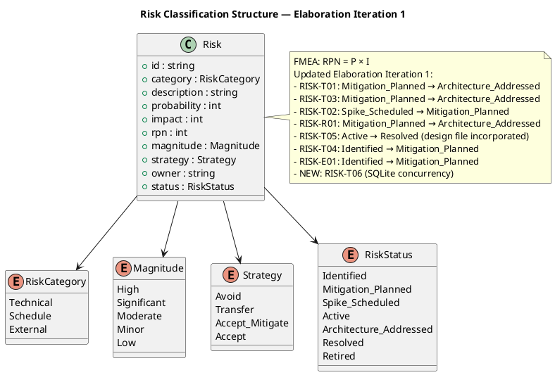
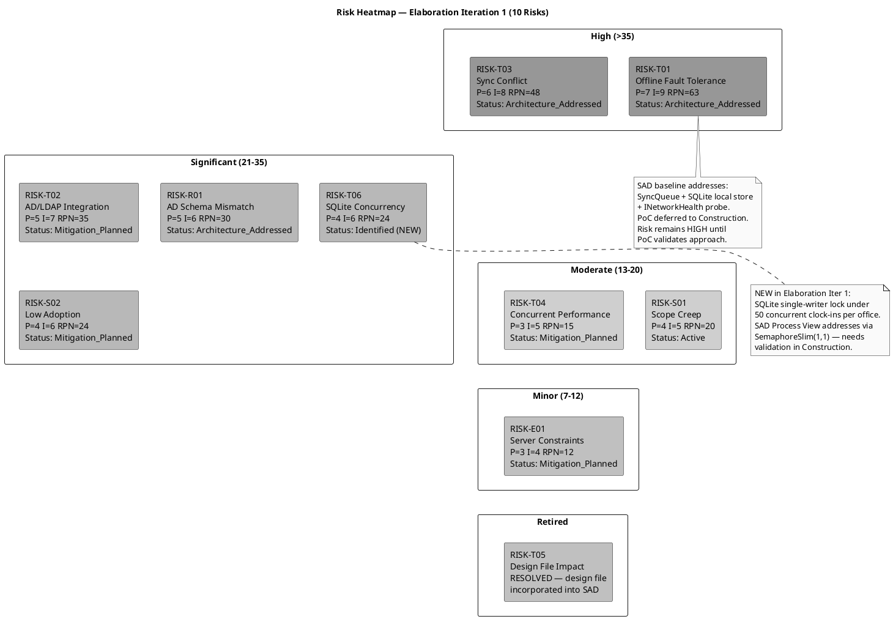
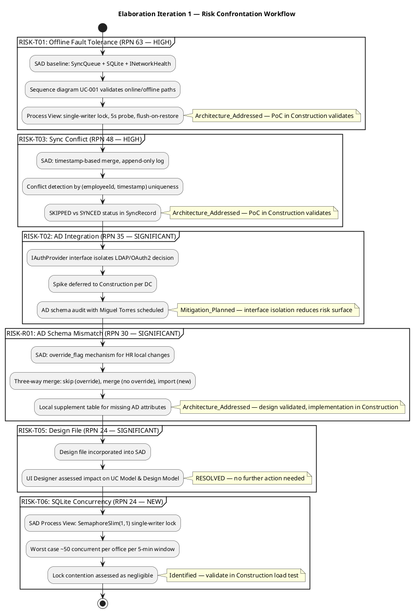

## Document Control
| Field | Value |
|---|---|
| Phase | Elaboration |
| Status | Draft |
| Milestone Target | End of Elaboration (LCA) |
| Iteration | 1 (Cycle 1) |
| Author | Project Manager |
| Prior Iteration | Inception 2 (LCO approved — GO verdict) |

## Risk Classification
Risks are classified using FMEA methodology: **Probability (P)** × **Impact (I)** = **Risk Priority Number (RPN)**. Detection capability is tracked as part of mitigation effectiveness.

### Probability Scale

| Level | Range | Description |
|---|---|---|
| Low | 1–3 | Unlikely to occur given current knowledge |
| Medium | 4–6 | Possible — occurs in similar projects |
| High | 7–10 | Likely — conditions present for occurrence |

### Impact Scale

| Level | Range | Description |
|---|---|---|
| Low | 1–3 | Minimal schedule/cost impact, workaround exists |
| Medium | 4–6 | Moderate delay or rework, stakeholder concern |
| High | 7–10 | Project failure or major scope/schedule disruption |

### Magnitude Classification

| Magnitude | RPN Range | Action Required |
|---|---|---|
| High | > 35 | Active mitigation in current iteration; escalate to stakeholders |
| Significant | 21–35 | Mitigation plan required; monitor each iteration |
| Moderate | 13–20 | Mitigation plan recommended; review each iteration |
| Minor | 7–12 | Monitor; contingency documented |
| Low | ≤ 6 | Accept with awareness |

### Risk Classification Structure

### Risk Heatmap — Identified Risks by Priority (10 Risks)

## Risk Register

| ID | Category | Description | P | I | RPN | Magnitude | Strategy | Owner | Status |
|---|---|---|---|---|---|---|---|---|---|
| RISK-T01 | Technical | Offline fault tolerance: system must accept clock in/out during 5-min network drop with zero data loss and sync on restore | 7 | 9 | 63 | **High** | Accept (mitigate) | Software Architect | Architecture Addressed |
| RISK-T03 | Technical | Data synchronization conflict when network restores — concurrent local and remote clock entries may conflict | 6 | 8 | 48 | **High** | Accept (mitigate) | Software Architect | Architecture Addressed |
| RISK-T02 | Technical | AD/LDAP integration: authentication via Active Directory may have schema, connectivity, or configuration issues | 5 | 7 | 35 | **Significant** | Accept (mitigate) | Software Architect | Mitigation Planned |
| RISK-R01 | Technical | AD schema mismatch: employee attributes in AD may not map cleanly to portal data model (department, office, extension) | 5 | 6 | 30 | **Significant** | Accept (mitigate) | Software Architect | Architecture Addressed |
| RISK-S02 | Schedule | Low employee adoption: 80% adoption target within 3 months may not be met if UX is poor or training is insufficient | 4 | 6 | 24 | **Significant** | Accept (mitigate) | HR Director (Laura Gómez) | Mitigation Planned |
| RISK-T06 | Technical | SQLite concurrency under peak load: single-writer lock may cause contention when 50 employees per office clock in simultaneously | 4 | 6 | 24 | **Significant** | Accept (mitigate) | Software Architect | Identified |
| RISK-S01 | Schedule | Scope creep: stakeholders request additional features (vacation management, payroll integration, push notifications) during iterations | 4 | 5 | 20 | **Moderate** | Avoid | Project Manager | Active |
| RISK-T04 | Technical | Performance under concurrent clock-in: 200 employees clocking in simultaneously at shift start may exceed 1-second response threshold | 3 | 5 | 15 | **Moderate** | Accept (mitigate) | Software Architect | Mitigation Planned |
| RISK-E01 | External | Windows Server hosting constraints: internal server may have limited resources, patching windows, or configuration restrictions | 3 | 4 | 12 | **Minor** | Accept | Technical Advisor (Miguel Torres) | Mitigation Planned |
| RISK-T05 | Technical | ~~Stakeholder design file not yet incorporated~~ — **RESOLVED**: design file incorporated into SAD; UI Designer assessed impact | 4 | 6 | 24 | **Significant** | Accept (mitigate) | UI Designer | Resolved |

### Status Changes — Elaboration Iteration 1

| Risk ID | Prior Status | New Status | Rationale |
|---|---|---|---|
| RISK-T01 | Mitigation Planned | Architecture Addressed | SAD baseline includes SyncQueue (COMP-D4), SQLite local store (COMP-I3), INetworkHealth probe (COMP-I5). UC-001 sequence diagram validates online/offline/sync paths. Process View defines single-writer lock, 5s probe cadence, flush-on-restore. PoC deferred to Construction per DC — risk remains HIGH until PoC validates. |
| RISK-T03 | Mitigation Planned | Architecture Addressed | SAD defines timestamp-based merge with append-only log. Conflict detection by (employeeId, timestamp) uniqueness. SyncRecord status (PENDING/SYNCED/SKIPPED) modeled in Domain. UC-001 sequence shows conflict handling. PoC in Construction validates. |
| RISK-T02 | Spike Scheduled | Mitigation Planned | IAuthProvider interface isolates AD protocol decision (LDAP vs OAuth2). LdapAuthProvider and OAuth2AuthProvider both modeled in Implementation View. Spike deferred to Construction per DC. Interface isolation reduces risk surface — protocol swap is a DI registration change. |
| RISK-R01 | Mitigation Planned | Architecture Addressed | SAD defines override_flag mechanism for HR local changes. Three-way merge logic (skip/merge/import) validated in UC-007 sequence diagram. Local supplement table for missing AD attributes designed in Data View. |
| RISK-T05 | Active | Resolved | Design file (employee-portal-design.html) incorporated into SAD. UI Designer assessed impact on UC Model and Design Model. Software Architect evaluated architectural impact. No architectural changes required — design file confirmed as compatible with baseline architecture. |
| RISK-T04 | Identified | Mitigation Planned | SAD Process View notes 50 concurrent per office per 5-min window. Load test planned for Construction. Mitigation: PostgreSQL connection pooling, in-memory employee status cache. |
| RISK-E01 | Identified | Mitigation Planned | Deployment View in SAD defines single-node topology on Windows Server. Mitigation: coordinate with Miguel Torres on IIS/Kestrel config, PostgreSQL installation. Deployment dry-run in Construction. |
| RISK-T06 | — (NEW) | Identified | New risk identified from SAD Process View analysis: SQLite single-writer lock (SemaphoreSlim(1,1)) under peak concurrent clock-in load. SAD assesses contention as negligible (~50 per office per 5-min), but requires validation in Construction load test. |

## Risk Mitigation and Contingency

### RISK-T01: Offline Fault Tolerance (RPN 63 — HIGH)

| Attribute | Value |
|---|---|
| **Trigger** | Network connectivity to PostgreSQL/AD drops during business hours |
| **Mitigation** | SAD baseline architecture addresses this risk: SyncQueue (COMP-D4) manages offline-to-online transition. SQLite local store (COMP-I3) persists queued clockings. INetworkHealth (COMP-I5) probes PostgreSQL every 5s via TCP. UC-001 sequence diagram validates all three paths: normal (UP), offline (DOWN), sync (restore). Process View defines single-writer lock and flush-on-restore logic. PoC deferred to Construction per Development Case — risk remains HIGH until PoC validates the approach with real network interruption. |
| **Contingency** | If PoC proves the approach infeasible within Construction, reduce the offline window requirement from 5 minutes to 2 minutes (stakeholder negotiation), or implement a manual fallback where HR records clockings on paper and enters them post-restoration. |
| **Detection** | Network monitoring on Windows Server; application health check endpoint; log entries for queued operations. |
| **Feasibility Impact** | If unresolvable, the offline fault tolerance NFR must be descoped or relaxed — this is a stakeholder decision. |
| **Status Update (Elab Iter 1)** | Architecture baseline addresses all design aspects. Status: Mitigation Planned → **Architecture Addressed**. PoC validation in Construction is the gate to downgrade to Resolved. |

### RISK-T03: Data Sync Conflict on Network Restore (RPN 48 — HIGH)

| Attribute | Value |
|---|---|
| **Trigger** | Network restores after outage; queued local entries conflict with entries that may exist on the primary database |
| **Mitigation** | SAD defines conflict resolution: timestamp-based merge with server-side validation. Each queued entry carries a client timestamp; server reconciles by accepting the earliest timestamp per employee. No overwrites — append-only log. SyncRecord status (PENDING/SYNCED/SKIPPED) modeled in Domain layer. UC-001 sequence diagram shows conflict detection and SKIPPED handling. |
| **Contingency** | If conflict resolution is too complex, implement a "last-write-wins" with HR manual review of flagged conflicts. HR sees a conflict report and resolves manually. |
| **Detection** | Sync process logs conflicts; HR dashboard shows unresolved sync conflicts. |
| **Status Update (Elab Iter 1)** | Architecture baseline defines conflict resolution strategy. Status: Mitigation Planned → **Architecture Addressed**. PoC in Construction validates with real data. |

### RISK-T02: AD/LDAP Integration (RPN 35 — SIGNIFICANT)

| Attribute | Value |
|---|---|
| **Trigger** | AD server unreachable, LDAP bind fails, schema query returns unexpected attributes, or OAuth2 endpoint misconfigured |
| **Mitigation** | IAuthProvider interface isolates AD protocol decision. LdapAuthProvider (default) and OAuth2AuthProvider (alternative) both modeled in Implementation View. Protocol swap is a DI registration change — no business logic affected. Spike deferred to Construction per Development Case. AD schema audit with Miguel Torres scheduled for early Construction. |
| **Contingency** | If AD integration fails entirely, implement local authentication with username/password stored in PostgreSQL. Employee data manually provisioned by HR. This is a functional degradation but preserves all other portal features. |
| **Detection** | AD connection health check at application startup; authentication failure rate monitoring; log entries for bind failures. |
| **Status Update (Elab Iter 1)** | Interface isolation reduces risk surface. Status: Spike Scheduled → **Mitigation Planned**. Spike in Construction validates real AD connectivity. |

### RISK-R01: AD Schema Mismatch (RPN 30 — SIGNIFICANT)

| Attribute | Value |
|---|---|
| **Trigger** | AD employee attributes (department, office, extension) do not match portal data model fields or are missing entirely |
| **Mitigation** | SAD defines override_flag mechanism: HR local changes win when override_flag = true. Three-way merge logic (skip/merge/import) validated in UC-007 sequence diagram. Local supplement table in PostgreSQL stores portal-specific attributes not available in AD. Employee aggregate (COMP-D3) models the merge behavior. |
| **Contingency** | If AD schema is severely limited, HR manually populates all employee directory data via the admin panel. AD is used only for authentication (username/password validation), not for directory data synchronization. |
| **Detection** | AD sync log reports skipped/merged/imported counts; HR reviews sync summary after each AD sync operation. |
| **Status Update (Elab Iter 1)** | Override flag and three-way merge designed and validated. Status: Mitigation Planned → **Architecture Addressed**. Implementation in Construction. |

### RISK-S02: Low Employee Adoption (RPN 24 — SIGNIFICANT)

| Attribute | Value |
|---|---|
| **Trigger** | Employees find the portal difficult to use, prefer existing Excel/email habits, or are not aware of the portal |
| **Mitigation** | UX simplicity is a design priority. Stakeholder design file (employee-portal-design.html) provides UX baseline. Adoption tracking via active login count and clock-in usage. Laura Gómez (HR Director) owns communication plan for portal launch. Design file incorporated — RISK-T05 resolved. |
| **Contingency** | If adoption is below 80% after 3 months, conduct targeted training sessions for low-adoption offices. Simplify clock-in flow further if UX friction is identified. |
| **Detection** | Monthly adoption report: active logins, clock-in usage rate per office. Alert if adoption drops below 60% at 6-week mark. |
| **Status Update (Elab Iter 1)** | Design file resolved; UX baseline established. Status remains **Mitigation Planned**. Adoption tracking implemented in Transition. |

### RISK-T06: SQLite Concurrency Under Peak Load (RPN 24 — SIGNIFICANT — NEW)

| Attribute | Value |
|---|---|
| **Trigger** | 50+ employees in a single office clock in simultaneously during network outage, causing SQLite write lock contention |
| **Mitigation** | SAD Process View addresses via SemaphoreSlim(1,1) single-writer lock. SAD assesses worst case as ~50 per office per 5-min window — lock contention assessed as negligible. Async/await model in .NET 10 handles queuing without thread starvation. |
| **Contingency** | If contention causes >1s response time, implement batch writes (group multiple clockings into a single SQLite transaction) or in-memory queue with periodic flush to SQLite. |
| **Detection** | Response time monitoring during offline mode; alert if clock in/out exceeds 1s during network outage. |
| **Status Update (Elab Iter 1)** | New risk identified from SAD Process View analysis. Status: **Identified**. Load test in Construction validates contention assumption. |

### RISK-S01: Scope Creep (RPN 20 — MODERATE)

| Attribute | Value |
|---|---|
| **Trigger** | Stakeholders request features beyond declared scope (vacation management, payroll integration, push notifications, biometric clocking) |
| **Mitigation** | Scope Guard enforced: all changes require CR approved by CCM. Declared scope is the ceiling. Project Manager monitors for scope expansion in iteration reviews. |
| **Contingency** | If critical scope expansion is requested, negotiate schedule extension or trade-off with existing scope. Document as CR with impact analysis. |
| **Detection** | Iteration review scope check; CR log review. |
| **Status Update (Elab Iter 1)** | No scope creep observed. Status remains **Active**. CCM process enforced. |

### RISK-T04: Concurrent Performance (RPN 15 — MODERATE)

| Attribute | Value |
|---|---|
| **Trigger** | 200 employees clock in simultaneously at shift start, exceeding 1-second response threshold |
| **Mitigation** | SAD Process View notes 50 concurrent per office per 5-min window. Load test planned for Construction. PostgreSQL connection pooling and in-memory employee status cache designed. |
| **Contingency** | If performance threshold is exceeded, implement client-side queuing with optimistic UI (show confirmation immediately, persist asynchronously). |
| **Detection** | Application response time monitoring; alert if clock in/out exceeds 1 second. |
| **Status Update (Elab Iter 1)** | Mitigation plan defined in SAD. Status: Identified → **Mitigation Planned**. Load test in Construction. |

### RISK-E01: Windows Server Hosting Constraints (RPN 12 — MINOR)

| Attribute | Value |
|---|---|
| **Trigger** | Server resource limitations, patching downtime, IIS configuration issues |
| **Mitigation** | SAD Deployment View defines single-node topology. Coordinate with Miguel Torres on server specifications, IIS/Kestrel configuration, and PostgreSQL installation. Document deployment requirements in Elaboration. Deployment dry-run in Construction. |
| **Contingency** | If server resources are insufficient, request a VM allocation or resource upgrade from IT. |
| **Detection** | Server resource monitoring; deployment dry-run in Elaboration. |
| **Status Update (Elab Iter 1)** | Deployment View baselined. Status: Identified → **Mitigation Planned**. Deployment dry-run in Construction. |

### RISK-T05: Design File Impact (RPN 24 — RESOLVED)

| Attribute | Value |
|---|---|
| **Trigger** | ~~Stakeholder design file not yet incorporated~~ |
| **Mitigation** | Design file (employee-portal-design.html) incorporated into SAD. UI Designer assessed impact on UC Model and Design Model. Software Architect evaluated architectural impact. No architectural changes required. |
| **Contingency** | N/A — resolved. |
| **Detection** | N/A — resolved. |
| **Status Update (Elab Iter 1)** | **RESOLVED**. Design file confirmed compatible with baseline architecture. No further action needed. |

### Risk Confrontation Workflow — Elaboration Iteration 1

## Traceability

| Element | Traces From | Link Type | Traces To |
|---|---|---|---|
| RISK-T01 | NFR: Offline Fault Tolerance | Derives | SAD (SyncQueue COMP-D4, SQLite COMP-I3, INetworkHealth COMP-I5), UC-001 Sequence, Construction PoC |
| RISK-T03 | RISK-T01 (consequence) | Derives | SAD (Sync Conflict Strategy), SyncRecord Domain Model, Construction PoC |
| RISK-T02 | Constraint: AD/LDAP Authentication | Derives | SAD (IAuthProvider, COMP-I1), Construction AD Spike |
| RISK-R01 | RISK-T02 (consequence) | Derives | SAD (Override Flag, Three-way Merge), UC-007 Sequence, Construction Implementation |
| RISK-S02 | Business Goal: 80% adoption in 3 months | Derives | Iteration Plan (Evaluation Criteria), Transition Adoption Tracking |
| RISK-T06 | SAD Process View (SQLite concurrency) | Derives | Construction Load Test, SAD (SemaphoreSlim design) |
| RISK-S01 | Scope Guard (Declared Scope) | Derives | Iteration Plan (Scope Boundary), CCM Process |
| RISK-T04 | NFR: Performance thresholds | Derives | SAD (Process View), Construction Load Test |
| RISK-E01 | Constraint: Internal Windows Server hosting | Derives | SAD (Deployment View), Construction Deployment Dry-Run |
| RISK-T05 | Review Record S2 (Stakeholder design file) | Derives | SAD (Design File Assessment — RESOLVED) |