## Document Control

| Field | Value |
|---|---|
| Phase | Elaboration |
| Status | Draft |
| Milestone Target | LCA (Lifecycle Architecture) |
| Iteration | 3 (Cycle 1) |
| Author | Project Manager |
| Prior Iteration | Elaboration 2 (LCA: CONDITIONAL NO-GO — auto-iterate to Cycle 3) |
| Findings Addressed | RL-F1 (Major, 2nd), MR-RL-F1 (Major, 1st) — RPN governance protocol established; SAD-F4 (Critical) RESOLVED by Software Architect — architecture baseline clean, no risk status changes needed this iteration |

## Risk Classification

Risks are classified using FMEA methodology: **Probability (P)** × **Impact (I)** = **Risk Priority Number (RPN)**. Detection capability is tracked as part of mitigation effectiveness.

### RPN Governance Protocol (RL-F1 / MR-RL-F1 Resolution)

> **The Risk List is the SINGLE AUTHORITATIVE source for all RPN values in the project.**
> All downstream artifacts (Development Case, Test Case, Iteration Plan, PoC, SAD) MUST reference RPN values from the Risk List.
> The Project Manager audits RPN consistency at each iteration boundary. Any discrepancy is a Major finding against the PM.

| Governance Rule | Enforcement |
|---|---|
| Risk List RPN values are canonical | All downstream artifacts must cite Risk List RPN — no independent calculation |
| PM audits at iteration boundary | Cross-artifact RPN comparison performed before LCA/milestone review |
| Discrepancy = Major finding | Any artifact showing a different RPN than the Risk List is a PM governance failure |
| Corrective action: immediate | PM notifies artifact owner; owner corrects within same iteration |

**RL-F1 Resolution:** RISK-T01 RPN = 63 (canonical). Development Case incorrectly stated 35; Test Case incorrectly stated 40. Both have been flagged for correction by their respective owners (DC-F2 → Process Engineer, TC-F1 → Test Designer). The Risk List value of 63 has been and remains the authoritative value since Inception.

**MR-RL-F1 Resolution:** RPN governance protocol established (this section). PM will perform cross-artifact RPN audit at each iteration boundary and record results in the Iteration Assessment.

### Probability Scale

| Level | Score | Description |
|---|---|---|
| Very Low | 1 | < 10% chance of occurrence |
| Low | 2-3 | 10-30% chance of occurrence |
| Medium | 4-6 | 30-60% chance of occurrence |
| High | 7-8 | 60-85% chance of occurrence |
| Very High | 9-10 | > 85% chance of occurrence |

### Impact Scale

| Level | Score | Description |
|---|---|---|
| Negligible | 1 | No impact on project objectives |
| Minor | 2-3 | Minor schedule slip or quality degradation |
| Moderate | 4-6 | Significant rework or schedule impact |
| Serious | 7-8 | Major scope or schedule impact, stakeholder dissatisfaction |
| Catastrophic | 9-10 | Project failure or inability to meet core objectives |

### Magnitude Classification

| RPN Range | Magnitude | Required Action |
|---|---|---|
| ≥ 50 | **High** | Must have mitigation + contingency; PM tracks weekly |
| 25-49 | **Significant** | Must have mitigation; PM tracks at iteration boundary |
| 10-24 | **Moderate** | Mitigation recommended; PM tracks at phase boundary |
| < 10 | **Minor** | Accept with monitoring |

## Risk Register

| ID | Category | Description | P | I | RPN | Magnitude | Strategy | Owner | Status |
|---|---|---|---|---|---|---|---|---|---|
| RISK-T01 | Technical | Offline fault tolerance: system must accept clock in/out during 5-min network drop with zero data loss and sync on restore | 7 | 9 | 63 | **High** | Accept (mitigate) | Software Architect | PoC Validated |
| RISK-T03 | Technical | Data synchronization conflict when network restores — concurrent local and remote clock entries may conflict | 6 | 8 | 48 | **High** | Accept (mitigate) | Software Architect | PoC Validated |
| RISK-T02 | Technical | AD/LDAP integration: authentication via Active Directory may have schema, connectivity, or configuration issues | 5 | 7 | 35 | **Significant** | Accept (mitigate) | Software Architect | Mitigation Planned |
| RISK-R01 | Technical | AD schema mismatch: employee attributes in AD may not map cleanly to portal data model (department, office, extension) | 5 | 6 | 30 | **Significant** | Accept (mitigate) | Software Architect | Architecture Addressed |
| RISK-S02 | Schedule | Low employee adoption: 80% adoption target within 3 months may not be met if UX is poor or training is insufficient | 4 | 6 | 24 | **Significant** | Accept (mitigate) | HR Director (Laura Gómez) | Mitigation Planned |
| RISK-T06 | Technical | SQLite concurrency under peak load: single-writer lock may cause contention when 50 employees per office clock in simultaneously | 4 | 6 | 24 | **Significant** | Accept (mitigate) | Software Architect | Mitigation Planned |
| RISK-S01 | Schedule | Scope creep: stakeholders request additional features (vacation management, payroll integration, push notifications) during iterations | 4 | 5 | 20 | **Moderate** | Avoid | Project Manager | Active |
| RISK-T04 | Technical | Performance under concurrent clock-in: 200 employees clocking in simultaneously at shift start may exceed 1-second response threshold | 3 | 5 | 15 | **Moderate** | Accept (mitigate) | Software Architect | Mitigation Planned |
| RISK-E01 | External | Windows Server hosting constraints: internal server may have limited resources, patching windows, or configuration restrictions | 3 | 4 | 12 | **Minor** | Accept | Technical Advisor (Miguel Torres) | Mitigation Planned |
| RISK-T05 | Technical | ~~Stakeholder design file not yet incorporated~~ — **RESOLVED**: design file incorporated into SAD; UI Designer assessed impact | 4 | 6 | 24 | **Significant** | Accept (mitigate) | UI Designer | Resolved (Retired) |

### Status Changes — Elaboration Iteration 3

| Risk ID | Prior Status | New Status | Rationale |
|---|---|---|---|
| (none) | — | — | SAD-F4 (Critical) RESOLVED by Software Architect — PR #4 closed without merging, PoC code stays on feature branch. Architecture baseline on main is clean. No risk status changes this iteration — all risks remain at their Iteration 2 status. The SAD-F4 resolution confirms the architecture baseline integrity but does not change any technical risk's probability or impact. |

### Risk Retirement Trend

```plantuml
@startuml
title Elaboration Iteration 3 — Risk Status Evolution

state "RISK-T01: Offline Sync\nRPN: 63 (AUTHORITATIVE)\nMagnitude: High" as T01 {
  T01 : Iter 1: Architecture Addressed
  T01 : Iter 2: PoC-1 VALIDATED (CI Green 3/3)
  T01 : Iter 3: SAD-F4 RESOLVED — PoC code stays on feature branch
  T01 : Status: PoC Validated (unchanged)
  T01 : RPN governance: 63 is canonical
}

state "RISK-T03: Sync Conflict\nRPN: 48 (AUTHORITATIVE)\nMagnitude: High" as T03 {
  T03 : Iter 1: Architecture Addressed
  T03 : Iter 2: PoC-1 validated conflict resolution
  T03 : Iter 3: No change — awaiting Construction integration test
  T03 : Status: PoC Validated (unchanged)
}

state "RISK-T02: AD Integration\nRPN: 35\nMagnitude: Significant" as T02 {
  T02 : Iter 1: Mitigation Planned
  T02 : Iter 2: IAuthProvider isolation confirmed
  T02 : Iter 3: No change — spike deferred to Construction
  T02 : Status: Mitigation Planned (unchanged)
}

state "RISK-R01: AD Schema Mismatch\nRPN: 30\nMagnitude: Significant" as R01 {
  R01 : Iter 1: Architecture Addressed
  R01 : Iter 2: Override flag + 3-way merge validated
  R01 : Iter 3: No change — implementation in Construction
  R01 : Status: Architecture Addressed (unchanged)
}

state "RISK-T06: SQLite Concurrency\nRPN: 24\nMagnitude: Significant" as T06 {
  T06 : Iter 1: Identified
  T06 : Iter 2: PoC-1 exercised SemaphoreSlim
  T06 : Iter 3: No change — load test in Construction
  T06 : Status: Mitigation Planned (unchanged)
}

state "RISK-T05: Design File\nRPN: N/A" as T05 {
  T05 : RESOLVED (Iter 1)
  T05 : Retired — no further action
}

state "RISK-S01: Scope Creep\nRPN: 20\nMagnitude: Moderate" as S01 {
  S01 : Iter 3: Active — no scope changes requested
  S01 : Status: Active (unchanged)
}

state "RISK-S02: Low Adoption\nRPN: 24\nMagnitude: Significant" as S02 {
  S02 : Iter 3: No change — measurement in Transition
  S02 : Status: Mitigation Planned (unchanged)
}

state "RISK-T04: Performance\nRPN: 15\nMagnitude: Moderate" as T04 {
  T04 : Iter 3: No change — Construction load test
  T04 : Status: Mitigation Planned (unchanged)
}

state "RISK-E01: Windows Server\nRPN: 12\nMagnitude: Minor" as E01 {
  E01 : Iter 3: No change — Construction deployment dry-run
  E01 : Status: Mitigation Planned (unchanged)
}

[*] --> T01
[*] --> T03
[*] --> T02
[*] --> R01
[*] --> T06
[*] --> S01
[*] --> S02
[*] --> T04
[*] --> E01
T05 --> [*] : Retired

T01 --> [*] : Downgrade to Resolved\nafter Construction load test
T03 --> [*] : Downgrade to Resolved\nafter Construction integration
T02 --> [*] : Downgrade after\nConstruction AD spike

note right of T01
  **SAD-F4 RESOLVED (Iter 3)**
  PR #4 blocked from merging to main.
  PoC code stays on feature branch.
  Architecture baseline on main is CLEAN.
  No risk status changes this iteration —
  all risks remain at their Iter 2 status.
end note

@enduml
```

**Risk Retirement Summary (End of Elaboration Iteration 3):**
- RISK-T05: **RESOLVED** — Retired in Iter 1. ✓
- RISK-T01: **PoC Validated** — Offline sync mechanism empirically validated. Downgrade to Resolved after Construction load test. ⚠
- RISK-T03: **PoC Validated** — Conflict resolution empirically validated. Downgrade to Resolved after Construction integration test. ⚠
- RISK-T02: **Mitigation Planned** — IAuthProvider isolation confirmed. Spike in Construction. ⚠
- RISK-R01: **Architecture Addressed** — Override flag + 3-way merge designed. Implementation in Construction. ⚠
- RISK-T06: **Mitigation Planned** — PoC exercised SemaphoreSlim, no contention. Load test in Construction. ⚠
- RISK-S01, RISK-S02, RISK-T04, RISK-E01: Mitigation Planned or Active — no escalation. ✓

**Trend:** 1 of 10 risks fully retired. 2 risks at PoC Validated. No risks changed status this iteration. No new risks identified. No risks escalated. The SAD-F4 resolution confirms architecture baseline integrity without altering any risk's probability or impact profile. The risk register is stable entering LCA re-review.

## Risk Mitigation and Contingency

### RISK-T01: Offline Fault Tolerance (RPN 63 — HIGH)

| Attribute | Value |
|---|---|
| **Trigger** | Network connectivity to PostgreSQL/AD drops during business hours |
| **Mitigation** | SAD baseline architecture addresses this risk: SyncQueue (COMP-D4) manages offline-to-online transition. SQLite local store (COMP-I3) persists queued clockings. INetworkHealth (COMP-I5) probes PostgreSQL every 5s via TCP. UC-001 sequence diagram validates all three paths: normal (UP), offline (DOWN), sync (restore). Process View defines single-writer lock and flush-on-restore logic. **PoC-1 VALIDATED** (branch `poc/E1-risk-t01-offline-sync`, CI Green 3/3): offline sync mechanism works as designed — SQLite accepts clockings during simulated network drop, SyncQueue flushes to PostgreSQL on restore, zero data loss confirmed. |
| **Contingency** | If Construction load test proves the approach infeasible under production-scale conditions, reduce the offline window requirement from 5 minutes to 2 minutes (stakeholder negotiation), or implement a manual fallback where HR records clockings on paper and enters them post-restoration. |
| **Detection** | Network monitoring on Windows Server; application health check endpoint; log entries for queued operations. |
| **Feasibility Impact** | If unresolvable, the offline fault tolerance NFR must be descoped or relaxed — this is a stakeholder decision. |
| **Status Update (Elab Iter 3)** | No change. SAD-F4 resolution confirms PoC code stays on feature branch — PoC validation results remain valid. Status: PoC Validated. Construction load test is the gate to downgrade to Resolved. |

### RISK-T03: Data Sync Conflict on Network Restore (RPN 48 — HIGH)

| Attribute | Value |
|---|---|
| **Trigger** | Network restores after outage; queued local entries conflict with entries that may exist on the primary database |
| **Mitigation** | SAD defines conflict resolution: timestamp-based merge with server-side validation. Each queued entry carries a client timestamp; server reconciles by accepting the earliest timestamp per employee. SyncRecord status transitions (PENDING→SYNCED) prevent duplicate processing. **PoC-1 VALIDATED**: conflict resolution tested in simulated network drop/restore cycle — no data loss, no duplicate entries. |
| **Contingency** | If Construction integration test reveals unresolvable conflict patterns, implement manual conflict resolution UI for HR to review and approve queued entries before final commit. |
| **Detection** | Sync log entries; SyncRecord status monitoring; alert on stuck PENDING records. |
| **Feasibility Impact** | If unresolvable, offline sync may need to be limited to read-only operations (no clock in/out during outage) — stakeholder decision. |
| **Status Update (Elab Iter 3)** | No change. Status: PoC Validated. Construction integration test is the gate to downgrade to Resolved. |

### RISK-T02: AD/LDAP Integration (RPN 35 — SIGNIFICANT)

| Attribute | Value |
|---|---|
| **Trigger** | AD server unreachable, schema mismatch, or LDAP/OAuth2 configuration error during Construction or deployment |
| **Mitigation** | IAuthProvider interface isolates AD integration behind a pluggable abstraction. LdapAuthProvider and OAuth2AuthProvider modeled as alternative implementations. AD spike deferred to Construction per Development Case — spike will validate connectivity, schema mapping, and authentication flow against the actual AD server. |
| **Contingency** | If AD integration proves infeasible, implement LocalAuthProvider with username/password stored in PostgreSQL — degraded mode without SSO, but portal remains functional. Stakeholder must approve this fallback. |
| **Detection** | AD connectivity health check endpoint; authentication failure rate monitoring; log entries for LDAP bind errors. |
| **Feasibility Impact** | If unresolvable, SSO is lost — employees must authenticate with portal-local credentials. This is a stakeholder decision. |
| **Status Update (Elab Iter 3)** | No change. Status: Mitigation Planned. IAuthProvider isolation remains the mitigation. AD spike in Construction Iter 1. |

### RISK-R01: AD Schema Mismatch (RPN 30 — SIGNIFICANT)

| Attribute | Value |
|---|---|
| **Trigger** | AD employee attributes (department, office, extension) do not match portal data model fields or are missing entirely |
| **Mitigation** | SAD defines override_flag mechanism: HR can locally supplement or override AD-sourced attributes. Three-way merge strategy: skip (override), merge (no override), import (new employee). Local supplement table stores HR-maintained fields not available in AD. |
| **Contingency** | If AD schema is significantly incompatible, all employee data is HR-maintained via the administration panel (no AD sync for directory data — only authentication uses AD). |
| **Detection** | AD sync log; field mapping validation report; HR review of synced records. |
| **Feasibility Impact** | If unresolvable, directory data is fully HR-manual — increases HR workload but does not block the portal. |
| **Status Update (Elab Iter 3)** | No change. Status: Architecture Addressed. Implementation in Construction. |

### RISK-T06: SQLite Concurrency (RPN 24 — SIGNIFICANT)

| Attribute | Value |
|---|---|
| **Trigger** | 50+ employees per office clock in simultaneously during peak window (shift start) |
| **Mitigation** | SAD Process View defines SemaphoreSlim(1,1) single-writer lock for SQLite access. PoC-1 exercised this pattern — no contention observed. Worst-case analysis: ~50 concurrent per office per 5-min window is well within SQLite capacity with WAL mode. |
| **Contingency** | If Construction load test reveals contention, switch to write-queue pattern: clockings are queued in-memory and flushed to SQLite in batches, reducing lock contention. |
| **Detection** | Application performance monitoring; SQLite lock wait time logging; alert on lock timeout. |
| **Feasibility Impact** | If unresolvable, offline mode may need to limit concurrent clockings — unlikely given PoC results. |
| **Status Update (Elab Iter 3)** | No change. Status: Mitigation Planned. Construction load test will validate under peak conditions. |

### RISK-S02: Low Employee Adoption (RPN 24 — SIGNIFICANT)

| Attribute | Value |
|---|---|
| **Trigger** | Employees find the portal difficult to use, prefer Excel/email habits, or lack training |
| **Mitigation** | UX design validated by UI Designer (Design Model). Simple clock in/out interface. News on main page. Directory search with instant results. Transition phase includes adoption tracking and training materials. |
| **Contingency** | If adoption is below 80% after 3 months, HR conducts targeted training sessions and management mandates portal usage for time tracking. |
| **Detection** | Active login count; clock in/out usage rate; employee feedback survey. |
| **Feasibility Impact** | If unresolvable, business goal of 80% adoption is missed — HR continues with hybrid Excel/portal approach. |
| **Status Update (Elab Iter 3)** | No change. Status: Mitigation Planned. Measurement in Transition. |

### RISK-S01: Scope Creep (RPN 20 — MODERATE)

| Attribute | Value |
|---|---|
| **Trigger** | Stakeholders request additional features (vacation management, payroll integration, push notifications) during iterations |
| **Mitigation** | Scope Guard enforced — declared scope is the ceiling. All change requests go through CCM Board. PM rejects out-of-scope requests and logs them as recommendations. |
| **Contingency** | If stakeholder insists on scope expansion, negotiate schedule extension or defer to post-release enhancement. |
| **Detection** | Change request log; stakeholder meeting minutes. |
| **Feasibility Impact** | If unmanaged, scope creep extends schedule and increases risk. |
| **Status Update (Elab Iter 3)** | No change. Status: Active. No scope changes requested this iteration. |

### RISK-T04: Performance Under Concurrent Clock-In (RPN 15 — MODERATE)

| Attribute | Value |
|---|---|
| **Trigger** | 200 employees clock in simultaneously at shift start, exceeding 1-second response threshold |
| **Mitigation** | SAD Process View defines connection pooling, async operations, and indexed queries. Construction load test will validate under simulated peak conditions. |
| **Contingency** | If performance is unacceptable, implement client-side debouncing or staggered clock-in windows (5-min grace period). |
| **Detection** | Response time monitoring; alert on > 1-second clock in/out response. |
| **Feasibility Impact** | If unresolvable, 1-second threshold may need relaxation — stakeholder decision. |
| **Status Update (Elab Iter 3)** | No change. Status: Mitigation Planned. Construction load test required. |

### RISK-E01: Windows Server Hosting Constraints (RPN 12 — MINOR)

| Attribute | Value |
|---|---|
| **Trigger** | Internal Windows Server has limited resources, patching windows, or configuration restrictions |
| **Mitigation** | SAD Deployment View defines single-node topology on Windows Server with IIS/Kestrel. Resource requirements are modest (200 users, internal network). Construction deployment dry-run will validate. |
| **Contingency** | If server resources are insufficient, optimize application (reduce memory footprint, enable response caching). |
| **Detection** | Server resource monitoring; application health check. |
| **Feasibility Impact** | If unresolvable, may need server upgrade — infrastructure decision. |
| **Status Update (Elab Iter 3)** | No change. Status: Mitigation Planned. Construction deployment dry-run will validate. |

### RISK-T05: Stakeholder Design File (RPN N/A — RETIRED)

| Attribute | Value |
|---|---|
| **Resolution** | Design file incorporated into SAD. UI Designer assessed impact on UC Model and Design Model. Risk retired in Iteration 1. |
| **Status** | RESOLVED — no further action required. |

## Traceability

| Element | Traces From | Link Type | Traces To |
|---|---|---|---|
| RISK-T01 | NFR: Offline Fault Tolerance, SAD (COMP-D4, COMP-I3, COMP-I5) | Derives | PoC-1 (validated), Construction Load Test, SAD (Process View) |
| RISK-T03 | RISK-T01 (consequence), SAD (SyncQueue, SyncRecord) | Derives | PoC-1 (validated), Construction Integration Test |
| RISK-T02 | Constraint: AD authentication, SAD (IAuthProvider) | Derives | Construction AD Spike, SAD (LdapAuthProvider, OAuth2AuthProvider) |
| RISK-R01 | RISK-T02 (consequence) | Derives | SAD (Override Flag, Three-way Merge), UC-007 Sequence, Construction Implementation |
| RISK-S02 | Business Goal: 80% adoption in 3 months | Derives | Iteration Plan (Evaluation Criteria), Transition Adoption Tracking |
| RISK-T06 | SAD Process View (SQLite concurrency) | Derives | PoC-1 (exercised), Construction Load Test, SAD (SemaphoreSlim design) |
| RISK-S01 | Scope Guard (Declared Scope) | Derives | Iteration Plan (Scope Boundary), CCM Process |
| RISK-T04 | NFR: Performance thresholds | Derives | SAD (Process View), Construction Load Test |
| RISK-E01 | Constraint: Internal Windows Server hosting | Derives | SAD (Deployment View), Construction Deployment Dry-Run |
| RISK-T05 | Review Record S2 (Stakeholder design file) | Derives | SAD (Design File Assessment — RESOLVED) |
| RPN Governance Protocol | RL-F1, MR-RL-F1 (Review Record) | Reviews | Development Case (DC-F2), Test Case (TC-F1), Iteration Plan, PoC — all downstream RPN consumers |