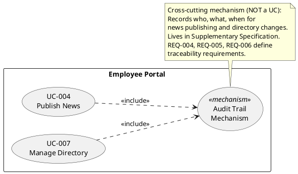
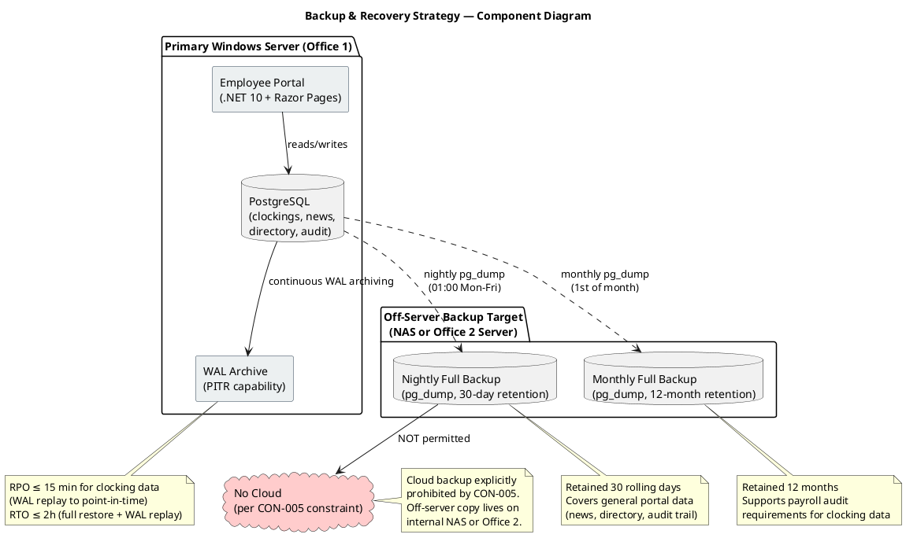

## Document Control
| Field | Value |
|---|---|
| Phase | Elaboration |
| Status | Draft |
| Iteration | 1 (Cycle 1) |
| Milestone Target | End of Elaboration |
| Author | System Analyst / Requirements Specifier |

### Elaboration Iteration 1 Changes

- Phase transition from Inception (LCO approved). FURPS+ categories confirmed complete.
- **REQ-018 [ASSUMPTION] resolved:** Directory search response time threshold quantified at ≤2 seconds (derived from acceptance criteria: 10-second total target includes navigation + search; 2s for search leaves 8s for navigation and reading — conservative).
- **REQ-024 [ASSUMPTION] resolved:** Backup strategy confirmed by stakeholder. Nightly full backup (pg_dump, 30-day retention), RPO ≤ 24h for general portal data. No longer an assumption.
- **REQ-025 [ASSUMPTION] resolved:** 50 concurrent users during peak clock-in window confirmed by stakeholder. No longer an assumption.
- **REQ-026 added:** PostgreSQL WAL archiving for PITR of clocking data — RPO ≤ 15 min (payroll-critical).
- **REQ-027 added:** Off-server backup copy (NAS or Office 2) — no cloud per CON-005.
- **REQ-028 added:** Monthly test-restore verification of backup integrity.
- **REQ-029 added:** Monthly full backup retained 12 months for payroll audit support.
- All NFR thresholds now testable with no remaining [ASSUMPTION] markers. No gold-plating: every threshold justified by declared business value, constraints, or stakeholder confirmation.
## Functionality

### Security

| ID | Requirement | Threshold | Source | Traces To |
|---|---|---|---|---|
| REQ-001 | All portal access requires Active Directory authentication via LDAP/OAuth2 | 100% of sessions authenticated | CON-004, STK-002 | All UCs (<<include>>) |
| REQ-002 | HR Administrator role distinguishes from regular Employee role for admin panel access | Role-based access control on UC-003, UC-004, UC-007 | STK-001 | UC-003, UC-004, UC-007 |
| REQ-003 | No access from outside the corporate network | Portal bound to internal network only | CON-006, STK-002 | All UCs |

### Audit Trail

| ID | Requirement | Threshold | Source | Traces To |
|---|---|---|---|---|
| REQ-004 | Audit trail records who, what, when for every news publishing action | 100% of publish/edit/delete events logged | Declared NFR (Audit) | UC-004 |
| REQ-005 | Audit trail records who, what, when for every directory change | 100% of create/update/deactivate events logged | Declared NFR (Audit) | UC-007 |
| REQ-006 | Audit trail entries are traceable and immutable | Entries cannot be modified or deleted | Declared NFR (Audit) | UC-004, UC-007 |

### Licensing

| ID | Requirement | Threshold | Source | Traces To |
|---|---|---|---|---|
| REQ-007 | No per-user licensing costs (internal open-source or included runtime) | .NET 10 (free), PostgreSQL (free) | CON-001, CON-003 | — |

## Usability

| ID | Requirement | Threshold | Source | Traces To |
|---|---|---|---|---|
| REQ-008 | Employee finds colleague's phone/email in under 10 seconds | ≤10 seconds from directory page load to result | Acceptance Criteria | UC-006 |
| REQ-009 | 80% of employees complete at least one clocking with no prior training | Zero-training usability for clock in/out | Acceptance Criteria, OBJ-003 | UC-001 |
| REQ-010 | Portal is responsive and accessible from Chrome and Edge | Compatible with current Chrome and Edge versions | CON-007 | All UCs |
| REQ-011 | News page shows featured banner and category filter intuitively | No training required to filter news | STK-003 | UC-005 |

## Reliability
| ID | Requirement | Threshold | Source | Traces To |
|---|---|---|---|---|
| REQ-012 | Portal available Monday–Friday 7:00–19:00 | ≥99% uptime during business hours | Declared NFR (Availability), CON-009 | All UCs |
| REQ-013 | Offline fault tolerance: clock in/out continues during network drops up to 5 minutes | Zero data loss; auto-sync on network restore | Declared NFR (Offline), STK-003 | UC-001 |
| REQ-014 | No data loss during offline-to-online sync | 100% of queued clockings synced | Declared NFR (Offline) | UC-001 |
| REQ-015 | System recovers gracefully from brief network interruptions | Portal resumes normal operation without manual restart | STK-002 | All UCs |
| REQ-024 | Nightly full database backup (pg_dump) retained 30 rolling days | Nightly backup at 01:00 Mon–Fri; RPO ≤ 24h for general portal data (news, directory, audit trail) | Stakeholder confirmation (Elaboration Iter 1) — replaces prior [ASSUMPTION] | UC-004, UC-005, UC-006, UC-007 |
| REQ-025 | Concurrent user capacity during peak clock-in window (09:00–09:30) | Response time within declared thresholds at 50 concurrent users | Stakeholder confirmation (Elaboration Iter 1) — replaces prior [ASSUMPTION] | UC-001, All UCs |
| REQ-026 | PostgreSQL WAL archiving enabled for Point-In-Time Recovery of clocking data | RPO ≤ 15 minutes for clocking data (payroll-critical); WAL replay to point-in-time | Stakeholder confirmation (Elaboration Iter 1) | UC-001, UC-002, UC-003 |
| REQ-027 | Backup copies stored OFF the primary Windows Server (NAS or Office 2 server) | 100% of backups on separate physical hardware; no cloud per CON-005 | Stakeholder confirmation (Elaboration Iter 1), CON-005 | UC-001, UC-002, UC-003, UC-004, UC-007 |
| REQ-028 | Monthly test-restore verification of backup integrity | 1 test-restore per month; restore verified against checksum | Stakeholder confirmation (Elaboration Iter 1) | UC-001, UC-002, UC-003 |
| REQ-029 | Monthly full backup (pg_dump) retained 12 months for payroll audit support | 12 monthly backups retained; supports payroll audit trail requirements | Stakeholder confirmation (Elaboration Iter 1) | UC-001, UC-002, UC-003 |

**Backup & Recovery Strategy — Component Diagram:**

**Rationale — Backup Strategy Alignment:**

- **Availability window alignment:** Backups run at 01:00 (outside Mon–Fri 7:00–19:00 business window) — no impact on portal availability.
- **Audit trail preservation:** Nightly and monthly pg_dump captures the full database including audit trail tables (news authorship, directory changes) — preserves REQ-004/REQ-005/REQ-006 traceability.
- **Payroll-critical data:** Clocking data gets enhanced protection via WAL archiving (RPO ≤15 min) because losing a full day of clock-ins corrupts payroll. General portal data (news, directory) tolerates 24h RPO via nightly backup.
- **No cloud:** Off-server copy targets an internal NAS or Office 2 server — consistent with CON-005 (internal Windows Server, no cloud).
- **RTO ≤ 2h:** Full restore from pg_dump + WAL replay estimated within 2 hours — acceptable given the 12-hour business window (7:00–19:00).
## Performance

| ID | Requirement | Threshold | Source | Traces To |
|---|---|---|---|---|
| REQ-016 | Page load time | < 3 seconds | Declared NFR (Performance), CON-008 | All UCs |
| REQ-017 | Clock in/out operation response time | < 1 second | Declared NFR (Performance), CON-008 | UC-001 |
| REQ-018 | Directory search response time | ≤ 2 seconds | STK-003, Acceptance Criteria (10s total target includes navigation + reading; 2s search leaves 8s margin) | UC-006 |
| REQ-019 | News page load with featured banner and category filter | < 3 seconds | CON-008 | UC-005 |

## Supportability

| ID | Requirement | Threshold | Source | Traces To |
|---|---|---|---|---|
| REQ-020 | Maintainable codebase using standard .NET 10 patterns | Follows .NET conventions; no exotic frameworks | CON-001, STK-004 | — |
| REQ-021 | PostgreSQL schema is documented and version-controlled | Schema migrations tracked | CON-003, STK-004 | — |
| REQ-022 | Application configurable for 3-office deployment without code changes | Office list is data-driven, not hardcoded | STK-003 | UC-006, UC-007 |
| REQ-023 | Employee data synchronized with AD; manual override available for HR | AD sync + HR admin panel coexist | CON-004, STK-001 | UC-007 |

## Design Constraints

| ID | Constraint | Detail | Source |
|---|---|---|---|
| DC-001 | Backend framework | .NET 10 with REST API | CON-001 |
| DC-002 | Frontend technology | Razor Pages (no SPA) | CON-002 |
| DC-003 | Database | PostgreSQL | CON-003 |
| DC-004 | Authentication | Active Directory via LDAP/OAuth2 | CON-004 |
| DC-005 | Hosting | Internal Windows Server, no cloud | CON-005 |
| DC-006 | Network access | Corporate intranet only, no external access | CON-006 |
| DC-007 | Browser support | Chrome and Edge (current versions) only | CON-007 |

## Interfaces

| ID | Interface | Type | Direction | Detail |
|---|---|---|---|---|
| INT-001 | Active Directory | External system | Portal → AD | LDAP/OAuth2 for authentication; employee data sync (name, email, department) |
| INT-002 | Browser (Chrome/Edge) | User agent | Portal → Browser | HTTP/HTTPS responses rendered as Razor Pages |
| INT-003 | PostgreSQL | Database | Portal → DB | Standard ADO.NET / EF Core connection |

## Applicable Standards

| Standard | Applicability |
|---|---|
| LDAPv3 | AD authentication protocol |
| OAuth2 | Alternative AD authentication protocol (decision pending — Stability: Low) |
| CSV (RFC 4180) | Clocking export format |
| HTTP/HTTPS | Web transport |
| HTML5 / CSS3 | Razor Pages rendering |

## Traceability
| Element | Traces From | Link Type | Traces To |
|---|---|---|---|
| REQ-001 | CON-004, STK-002 | Refines | All UCs (<<include>> auth) |
| REQ-002 | STK-001 | Refines | UC-003, UC-004, UC-007 |
| REQ-003 | CON-006, STK-002 | Refines | All UCs |
| REQ-004 | Declared NFR (Audit) | Refines | UC-004 |
| REQ-005 | Declared NFR (Audit) | Refines | UC-007 |
| REQ-006 | Declared NFR (Audit) | Refines | UC-004, UC-007 |
| REQ-007 | CON-001, CON-003 | Refines | — |
| REQ-008 | Acceptance Criteria | Refines | UC-006 |
| REQ-009 | Acceptance Criteria, OBJ-003 | Refines | UC-001 |
| REQ-010 | CON-007 | Refines | All UCs |
| REQ-011 | STK-003 | Refines | UC-005 |
| REQ-012 | Declared NFR (Availability), CON-009 | Refines | All UCs |
| REQ-013 | Declared NFR (Offline), STK-003 | Refines | UC-001 |
| REQ-014 | Declared NFR (Offline) | Refines | UC-001 |
| REQ-015 | STK-002 | Refines | All UCs |
| REQ-016 | Declared NFR (Performance), CON-008 | Refines | All UCs |
| REQ-017 | Declared NFR (Performance), CON-008 | Refines | UC-001 |
| REQ-018 | STK-003, Acceptance Criteria | Refines | UC-006 |
| REQ-019 | CON-008 | Refines | UC-005 |
| REQ-020 | CON-001, STK-004 | Refines | — |
| REQ-021 | CON-003, STK-004 | Refines | — |
| REQ-022 | STK-003 | Refines | UC-006, UC-007 |
| REQ-023 | CON-004, STK-001 | Refines | UC-007 |
| REQ-024 | Stakeholder confirmation (Elaboration Iter 1) | Refines | UC-004, UC-005, UC-006, UC-007 |
| REQ-025 | Stakeholder confirmation (Elaboration Iter 1) | Refines | UC-001, All UCs |
| REQ-026 | Stakeholder confirmation (Elaboration Iter 1) | Refines | UC-001, UC-002, UC-003 |
| REQ-027 | Stakeholder confirmation (Elaboration Iter 1), CON-005 | Refines | UC-001, UC-002, UC-003, UC-004, UC-007 |
| REQ-028 | Stakeholder confirmation (Elaboration Iter 1) | Refines | UC-001, UC-002, UC-003 |
| REQ-029 | Stakeholder confirmation (Elaboration Iter 1) | Refines | UC-001, UC-002, UC-003 |
| DC-001 through DC-007 | CON-001 through CON-007 | Refines | Architecture Document |
| INT-001 | CON-004 | Refines | Architecture Document |
| INT-002 | CON-007 | Refines | Architecture Document |
| INT-003 | CON-003 | Refines | Architecture Document |
