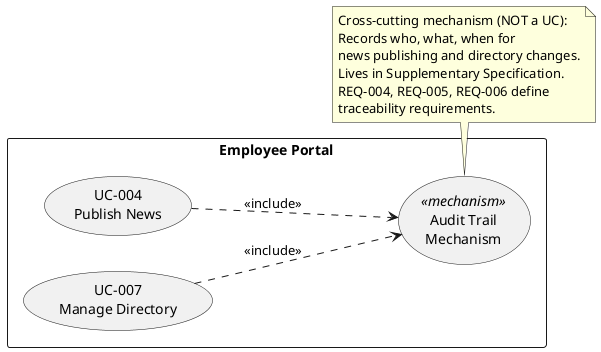
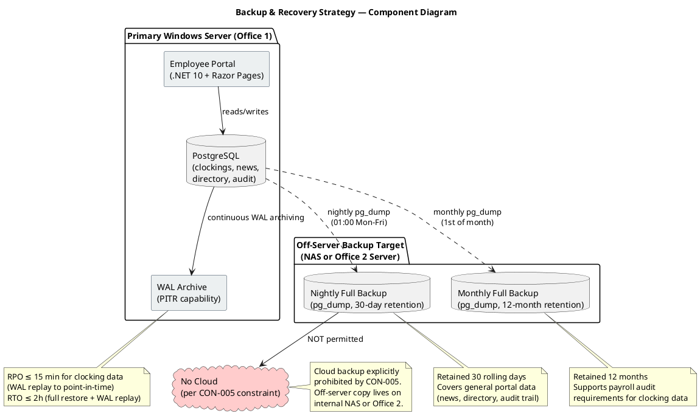

## Document Control
| Field | Value |
|---|---|
| Phase | Elaboration |
| Status | Draft |
| Iteration | 3 (Cycle 1) |
| Milestone Target | End of Elaboration |
| Author | System Analyst / Requirements Specifier |

### Elaboration Iteration 3 Changes

- **Supplementary Specification reviewed against SAD baseline.** All NFR thresholds remain valid and aligned with architectural decisions (IAuthProvider isolation, SQLite local store, SyncQueue).
- **REQ-001 stability annotation clarified:** AD authentication method (LDAP vs OAuth2) remains undecided — Stability: Low. IAuthProvider isolation pattern (SAD) decouples this decision from application logic; spike deferred to Construction per architectural decision.
- **No new NFRs added.** All 45 requirements (REQ-001 through REQ-045) and 7 design constraints (DC-001 through DC-007) remain unchanged — no findings target the Supplementary Specification.
- **FURPS+ categories confirmed complete** for Elaboration baseline: Functionality (security, audit, licensing), Usability (per-role + cross-cutting), Reliability (availability, offline, backup/recovery), Performance (page load, clocking, search, news), Supportability (maintainability, configurability, AD sync), Design Constraints (7), Interfaces (3), Applicable Standards (5).

### Elaboration Iteration 2 Changes

- **No findings from Review Record (Elaboration Iter 1) target the Supplementary Specification.** All NFR thresholds quantified in Iteration 1 remain valid — no [ASSUMPTION] markers remain, no gold-plating identified.
- Document Control updated from Iteration 1 to Iteration 2 to reflect current iteration metadata.
- Content preserved from Elaboration Iteration 1 baseline — all 29 requirements (REQ-001 through REQ-029) and design constraints (DC-001 through DC-007) remain unchanged.

### Elaboration Iteration 1 Changes

- Phase transition from Inception (LCO approved). FURPS+ categories confirmed complete.
- **REQ-018 [ASSUMPTION] resolved:** Directory search response time threshold quantified at ≤2 seconds.
- **REQ-024 [ASSUMPTION] resolved:** Backup strategy confirmed by stakeholder. Nightly full backup, RPO ≤ 24h.
- **REQ-025 [ASSUMPTION] resolved:** 50 concurrent users during peak clock-in window confirmed.
- **REQ-026 through REQ-029 added:** PostgreSQL WAL archiving, off-server backup, monthly test-restore, 12-month retention.
- All NFR thresholds now testable with no remaining [ASSUMPTION] markers.
## Functionality

### Security

| ID | Requirement | Threshold | Source | Traces To |
|---|---|---|---|---|
| REQ-001 | All portal access requires Active Directory authentication via LDAP/OAuth2 | 100% of sessions authenticated | CON-004, STK-002 | All UCs (<<include>>) |
| REQ-002 | HR Administrator role distinguishes from regular Employee role for admin panel access | Role-based access control on UC-003, UC-004, UC-007 | STK-001 | UC-003, UC-004, UC-007 |
| REQ-003 | No access from outside the corporate network | Portal bound to internal network only | CON-006, STK-002 | All UCs |

### Audit Trail

| ID | Requirement | Threshold | Source | Traces To |
|---|---|---|---|---|
| REQ-004 | Audit trail records who, what, when for every news publishing action | 100% of publish/edit/delete events logged | Declared NFR (Audit) | UC-004 |
| REQ-005 | Audit trail records who, what, when for every directory change | 100% of create/update/deactivate events logged | Declared NFR (Audit) | UC-007 |
| REQ-006 | Audit trail entries are traceable and immutable | Entries cannot be modified or deleted | Declared NFR (Audit) | UC-004, UC-007 |

### Licensing

| ID | Requirement | Threshold | Source | Traces To |
|---|---|---|---|---|
| REQ-007 | No per-user licensing costs (internal open-source or included runtime) | .NET 10 (free), PostgreSQL (free) | CON-001, CON-003 | — |

## Usability
### Usability Requirements by User Role

The following measurable usability requirements apply to the Employee Portal UI. Each requirement is testable with a specific threshold and traces to use cases and acceptance criteria. Requirements are organized by user role to ensure coverage across all interaction contexts.

#### Employee (ACT-001) — All Employees

| ID | Requirement | Threshold | Source | Traces To |
|---|---|---|---|---|
| REQ-008 | Employee finds colleague's phone/email in under 10 seconds | ≤10 seconds from directory page load to result display | Acceptance Criteria | UC-006 |
| REQ-009 | 80% of employees complete at least one clocking with no prior training | ≥80% first-use success rate without training; task completion in ≤3 clicks from home page | Acceptance Criteria, OBJ-003 | UC-001 |
| REQ-010 | Portal is responsive and accessible from Chrome and Edge | Renders correctly on current Chrome and Edge versions at ≥1280px and ≥768px viewport widths | CON-007 | All UCs |
| REQ-011 | News page shows featured banner and category filter intuitively | 100% of test users identify category filter without instruction; featured banner visually distinct from regular news list | STK-003 | UC-005 |
| REQ-030 | Clock In/Out button is the primary visual element on the home page | Button occupies top-center position, minimum 200px width, high-contrast color; status label ("Clocked In" / "Clocked Out") visible above button | Acceptance Criteria (UC-001), REQ-009 | UC-001 |
| REQ-031 | Clocking confirmation is immediately visible | Confirmation message appears within 1 second of click (per performance threshold); includes exact recorded timestamp | Acceptance Criteria, Performance NFR | UC-001 |
| REQ-032 | Clocking history displays current month in chronological order | History table shows date, time, and type (In/Out) sorted by date descending; no pagination needed for single month (≤31 rows × 2 entries) | UC-002 flow | UC-002 |
| REQ-033 | Directory search provides real-time filtering | Search results update within 2 seconds of query input; results show name, title, department, office, email, extension | REQ-008, UC-006 flow | UC-006 |
| REQ-034 | News list is sorted by date descending with category filter visible | Default view shows most recent news first; category filter (General, HR, IT, Events) visible above list; featured news banner at top | UC-005 flow, REQ-011 | UC-005 |
| REQ-035 | Offline status indicator is visible when network drops | Banner or icon appears within 3 seconds of network loss; message: "Offline mode — clocking will sync when connection is restored" | UC-001 AF-1, Offline NFR | UC-001 |
| REQ-036 | Session expiry message is clear and actionable | Message: "Session expired — network connection required"; no ambiguous error codes; employee knows to wait for network restore | UC-001 EF-1 | UC-001 |

#### HR Administrator (ACT-002)

| ID | Requirement | Threshold | Source | Traces To |
|---|---|---|---|---|
| REQ-037 | HR admin panel is accessible from a visible navigation element | Admin link visible in navigation bar for HR role only; not visible to regular employees | REQ-002, UC-003/UC-004/UC-007 | UC-003, UC-004, UC-007 |
| REQ-038 | CSV export button is clearly labeled and produces download within 3 seconds | Button labeled "Export CSV"; click triggers file download; progress indicator if >1 second | UC-003 flow, Performance NFR | UC-003 |
| REQ-039 | News publishing form has all required fields visible on one screen | Title, body, date (auto-filled), category dropdown, featured checkbox — no multi-step wizard | UC-004 flow, Acceptance Criteria | UC-004 |
| REQ-040 | Directory management panel shows entry list with edit/deactivate actions | Table view with name, department, office columns; Edit and Deactivate buttons per row; Create New button at top | UC-007 flow | UC-007 |
| REQ-041 | AD sync conflict warning is clear and offers override choice | Warning dialog: "This field is synced with Active Directory. Override will prevent future AD updates for this field." with Confirm/Cancel buttons | UC-007 S3 scenario | UC-007 |

#### Cross-Cutting Usability Criteria

| ID | Requirement | Threshold | Source | Traces To |
|---|---|---|---|---|
| REQ-042 | Consistent navigation bar across all pages | Same navigation structure (Home, News, Directory, [Admin]) on every page; active page highlighted | Nielsen Heuristic #4 (Consistency) | All UCs |
| REQ-043 | Error messages use plain language with recovery guidance | No raw exception codes; every error includes a suggested action (e.g., "Try again" or "Contact HR") | Nielsen Heuristic #9 (Error recovery) | All UCs |
| REQ-044 | All interactive elements have visible focus indicators for keyboard navigation | Focus outline visible on all buttons, links, inputs, and form controls; tab order follows visual order | Nielsen Heuristic #6 (Recognition over recall) | All UCs |
| REQ-045 | Page load provides visual feedback | Loading indicator (spinner or progress bar) visible within 500ms of navigation; no blank screen for >1 second | Performance NFR (3s page load), Nielsen Heuristic #1 (System status visibility) | All UCs |

### Usability Measurement Plan

| Criterion | Measurement Method | Target | When |
|---|---|---|---|
| Zero-training clocking (REQ-009) | Usability test with 5 untrained employees; measure task completion and time | ≥80% complete clocking without help; ≤30 seconds | Elaboration prototype validation |
| Directory search speed (REQ-008) | Timed task: "Find Juan Pérez's phone number" from portal home | ≤10 seconds (navigation + search + result) | Elaboration prototype validation |
| News filter intuitiveness (REQ-011) | Observation: ask user to "show only IT news" without instruction | 100% identify filter without help | Elaboration prototype validation |
| Error recovery (REQ-043) | Inject error states (offline, session expired); observe user response | User takes correct action without external help | Elaboration prototype validation |
## Reliability
| ID | Requirement | Threshold | Source | Traces To |
|---|---|---|---|---|
| REQ-012 | Portal available Monday–Friday 7:00–19:00 | ≥99% uptime during business hours | Declared NFR (Availability), CON-009 | All UCs |
| REQ-013 | Offline fault tolerance: clock in/out continues during network drops up to 5 minutes | Zero data loss; auto-sync on network restore | Declared NFR (Offline), STK-003 | UC-001 |
| REQ-014 | No data loss during offline-to-online sync | 100% of queued clockings synced | Declared NFR (Offline) | UC-001 |
| REQ-015 | System recovers gracefully from brief network interruptions | Portal resumes normal operation without manual restart | STK-002 | All UCs |
| REQ-024 | Nightly full database backup (pg_dump) retained 30 rolling days | Nightly backup at 01:00 Mon–Fri; RPO ≤ 24h for general portal data (news, directory, audit trail) | Stakeholder confirmation (Elaboration Iter 1) — replaces prior [ASSUMPTION] | UC-004, UC-005, UC-006, UC-007 |
| REQ-025 | Concurrent user capacity during peak clock-in window (09:00–09:30) | Response time within declared thresholds at 50 concurrent users | Stakeholder confirmation (Elaboration Iter 1) — replaces prior [ASSUMPTION] | UC-001, All UCs |
| REQ-026 | PostgreSQL WAL archiving enabled for Point-In-Time Recovery of clocking data | RPO ≤ 15 minutes for clocking data (payroll-critical); WAL replay to point-in-time | Stakeholder confirmation (Elaboration Iter 1) | UC-001, UC-002, UC-003 |
| REQ-027 | Backup copies stored OFF the primary Windows Server (NAS or Office 2 server) | 100% of backups on separate physical hardware; no cloud per CON-005 | Stakeholder confirmation (Elaboration Iter 1), CON-005 | UC-001, UC-002, UC-003, UC-004, UC-007 |
| REQ-028 | Monthly test-restore verification of backup integrity | 1 test-restore per month; restore verified against checksum | Stakeholder confirmation (Elaboration Iter 1) | UC-001, UC-002, UC-003 |
| REQ-029 | Monthly full backup (pg_dump) retained 12 months for payroll audit support | 12 monthly backups retained; supports payroll audit trail requirements | Stakeholder confirmation (Elaboration Iter 1) | UC-001, UC-002, UC-003 |

**Backup & Recovery Strategy — Component Diagram:**

**Rationale — Backup Strategy Alignment:**

- **Availability window alignment:** Backups run at 01:00 (outside Mon–Fri 7:00–19:00 business window) — no impact on portal availability.
- **Audit trail preservation:** Nightly and monthly pg_dump captures the full database including audit trail tables (news authorship, directory changes) — preserves REQ-004/REQ-005/REQ-006 traceability.
- **Payroll-critical data:** Clocking data gets enhanced protection via WAL archiving (RPO ≤15 min) because losing a full day of clock-ins corrupts payroll. General portal data (news, directory) tolerates 24h RPO via nightly backup.
- **No cloud:** Off-server copy targets an internal NAS or Office 2 server — consistent with CON-005 (internal Windows Server, no cloud).
- **RTO ≤ 2h:** Full restore from pg_dump + WAL replay estimated within 2 hours — acceptable given the 12-hour business window (7:00–19:00).
## Performance

| ID | Requirement | Threshold | Source | Traces To |
|---|---|---|---|---|
| REQ-016 | Page load time | < 3 seconds | Declared NFR (Performance), CON-008 | All UCs |
| REQ-017 | Clock in/out operation response time | < 1 second | Declared NFR (Performance), CON-008 | UC-001 |
| REQ-018 | Directory search response time | ≤ 2 seconds | STK-003, Acceptance Criteria (10s total target includes navigation + reading; 2s search leaves 8s margin) | UC-006 |
| REQ-019 | News page load with featured banner and category filter | < 3 seconds | CON-008 | UC-005 |

## Supportability

| ID | Requirement | Threshold | Source | Traces To |
|---|---|---|---|---|
| REQ-020 | Maintainable codebase using standard .NET 10 patterns | Follows .NET conventions; no exotic frameworks | CON-001, STK-004 | — |
| REQ-021 | PostgreSQL schema is documented and version-controlled | Schema migrations tracked | CON-003, STK-004 | — |
| REQ-022 | Application configurable for 3-office deployment without code changes | Office list is data-driven, not hardcoded | STK-003 | UC-006, UC-007 |
| REQ-023 | Employee data synchronized with AD; manual override available for HR | AD sync + HR admin panel coexist | CON-004, STK-001 | UC-007 |

## Design Constraints

| ID | Constraint | Detail | Source |
|---|---|---|---|
| DC-001 | Backend framework | .NET 10 with REST API | CON-001 |
| DC-002 | Frontend technology | Razor Pages (no SPA) | CON-002 |
| DC-003 | Database | PostgreSQL | CON-003 |
| DC-004 | Authentication | Active Directory via LDAP/OAuth2 | CON-004 |
| DC-005 | Hosting | Internal Windows Server, no cloud | CON-005 |
| DC-006 | Network access | Corporate intranet only, no external access | CON-006 |
| DC-007 | Browser support | Chrome and Edge (current versions) only | CON-007 |

## Interfaces

| ID | Interface | Type | Direction | Detail |
|---|---|---|---|---|
| INT-001 | Active Directory | External system | Portal → AD | LDAP/OAuth2 for authentication; employee data sync (name, email, department) |
| INT-002 | Browser (Chrome/Edge) | User agent | Portal → Browser | HTTP/HTTPS responses rendered as Razor Pages |
| INT-003 | PostgreSQL | Database | Portal → DB | Standard ADO.NET / EF Core connection |

## Applicable Standards

| Standard | Applicability |
|---|---|
| LDAPv3 | AD authentication protocol |
| OAuth2 | Alternative AD authentication protocol (decision pending — Stability: Low) |
| CSV (RFC 4180) | Clocking export format |
| HTTP/HTTPS | Web transport |
| HTML5 / CSS3 | Razor Pages rendering |

## Traceability
| Element | Traces From | Link Type | Traces To |
|---|---|---|---|
| REQ-001 | CON-004, STK-002 | Refines | All UCs (<<include>> auth) |
| REQ-002 | STK-001 | Refines | UC-003, UC-004, UC-007 |
| REQ-003 | CON-006, STK-002 | Refines | All UCs |
| REQ-004 | Declared NFR (Audit) | Refines | UC-004 |
| REQ-005 | Declared NFR (Audit) | Refines | UC-007 |
| REQ-006 | Declared NFR (Audit) | Refines | UC-004, UC-007 |
| REQ-007 | CON-001, CON-003 | Refines | — |
| REQ-008 | Acceptance Criteria | Refines | UC-006 |
| REQ-009 | Acceptance Criteria, OBJ-003 | Refines | UC-001 |
| REQ-010 | CON-007 | Refines | All UCs |
| REQ-011 | STK-003 | Refines | UC-005 |
| REQ-012 | Declared NFR (Availability), CON-009 | Refines | All UCs |
| REQ-013 | Declared NFR (Offline), STK-003 | Refines | UC-001 |
| REQ-014 | Declared NFR (Offline) | Refines | UC-001 |
| REQ-015 | STK-002 | Refines | All UCs |
| REQ-016 | Declared NFR (Performance), CON-008 | Refines | All UCs |
| REQ-017 | Declared NFR (Performance), CON-008 | Refines | UC-001 |
| REQ-018 | STK-003, Acceptance Criteria | Refines | UC-006 |
| REQ-019 | CON-008 | Refines | UC-005 |
| REQ-020 | CON-001, STK-004 | Refines | — |
| REQ-021 | CON-003, STK-004 | Refines | — |
| REQ-022 | STK-003 | Refines | UC-006, UC-007 |
| REQ-023 | CON-004, STK-001 | Refines | UC-007 |
| REQ-024 | Stakeholder confirmation (Elaboration Iter 1) | Refines | UC-004, UC-005, UC-006, UC-007 |
| REQ-025 | Stakeholder confirmation (Elaboration Iter 1) | Refines | UC-001, All UCs |
| REQ-026 | Stakeholder confirmation (Elaboration Iter 1) | Refines | UC-001, UC-002, UC-003 |
| REQ-027 | Stakeholder confirmation (Elaboration Iter 1), CON-005 | Refines | UC-001, UC-002, UC-003, UC-004, UC-007 |
| REQ-028 | Stakeholder confirmation (Elaboration Iter 1) | Refines | UC-001, UC-002, UC-003 |
| REQ-029 | Stakeholder confirmation (Elaboration Iter 1) | Refines | UC-001, UC-002, UC-003 |
| DC-001 through DC-007 | CON-001 through CON-007 | Refines | Architecture Document |
| INT-001 | CON-004 | Refines | Architecture Document |
| INT-002 | CON-007 | Refines | Architecture Document |
| INT-003 | CON-003 | Refines | Architecture Document |
