## Document Control

| Field | Value |
|---|---|
| Phase | Elaboration |
| Status | Draft |
| Iteration | 1 (Cycle 1) |
| Milestone Target | End of Elaboration |
| Author | System Analyst |

### Elaboration Iteration 1 Changes

- Phase transition from Inception (LCO approved). All 7 UCs now fully specified with activity diagrams.
- UC-001 (architecturally significant) enhanced with offline sync sequence diagram and 3 concrete scenarios.
- UC-004 and UC-007 activity diagrams added showing audit trail integration and AD sync conflict handling.
- All UC specifications preserved from Inception baseline; activity diagrams and scenario walkthroughs added for Elaboration depth (~80% detail).

## Use-Case Diagram

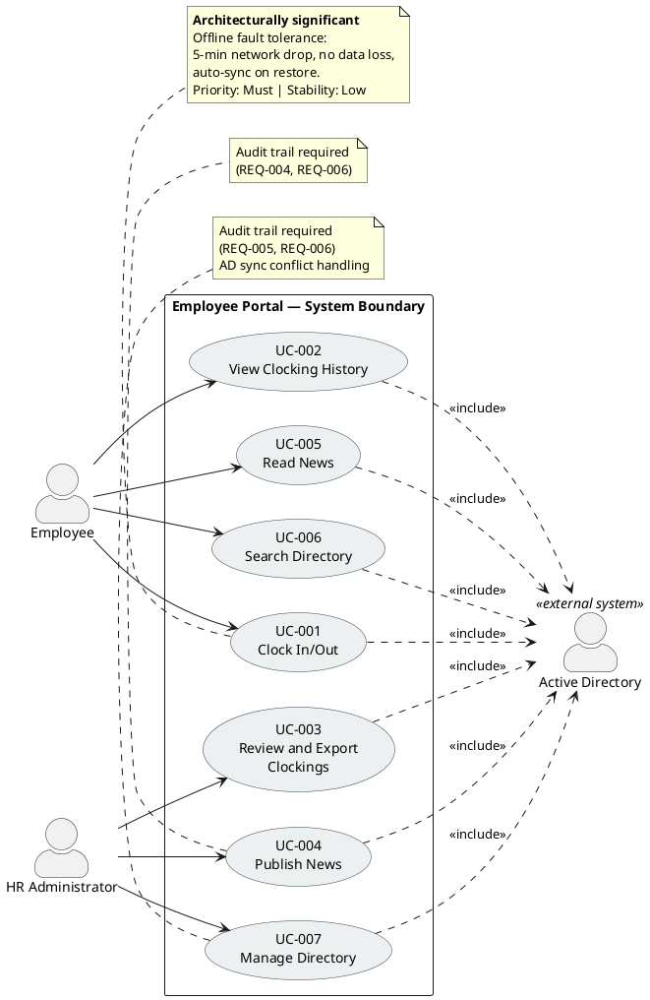

## Actors

| ID | Actor | Type | Description | Associated UCs |
|---|---|---|---|---|
| ACT-001 | Employee | Human (primary) | 200 corporate users across 3 offices. Uses AD credentials to access portal. Clocks in/out, views own history, reads news, searches directory. | UC-001, UC-002, UC-005, UC-006 |
| ACT-002 | HR Administrator | Human (primary) | HR staff member with elevated permissions. Publishes news, manages directory entries, reviews all clockings, exports CSV reports. | UC-003, UC-004, UC-007 |
| ACT-003 | Active Directory | External system | Corporate identity provider. Authenticates all users via LDAP/OAuth2. Provides employee data for directory synchronization. Cross-cutting mechanism — not a use case actor in the traditional sense; included by all UCs. | <<include>> from all UCs |

## Use-Case Survey
| ID | Use Case | Primary Actor | Trigger | Outcome (Value) | MoSCoW | Stability | Architecturally Significant? | Stakeholder Source | UI Flow Reference |
|---|---|---|---|---|---|---|---|---|---|
| UC-001 | Clock In/Out | Employee | Employee accesses portal to record work time | Timestamp recorded with confirmation; works offline | Must | Low | **Yes** — offline fault tolerance drives architectural decisions | "Employee logs in with corporate credentials (Active Directory). Main screen shows Clock In or Clock Out button depending on current status. System records exact time and shows confirmation." | DM §Use-Case Realizations → UC-001 Interaction Flow (activity diagram); Screens: HomePage, Offline Banner, Session Expired; REQ-009, REQ-030, REQ-031, REQ-035, REQ-036 |
| UC-002 | View Clocking History | Employee | Employee wants to review own clockings | Current month clocking history displayed | Must | High | No | "Employee can view their clocking history for the current month." | DM §Use-Case Realizations → UC-002 Interaction Flow (activity diagram); Screens: HomePage → HistoryPage; REQ-032, REQ-042 |
| UC-003 | Review and Export Clockings | HR Administrator | HR needs monthly clocking report | All employees' clockings viewable; CSV export generated | Must | Medium | No | "HR can view all employees' clockings and export a monthly report in CSV." | DM §Use-Case Realizations → UC-003 Interaction Flow (activity diagram); Screens: AdminClockingsPage, CSV Export; REQ-037, REQ-038 |
| UC-004 | Publish News | HR Administrator | HR has announcement to distribute | News item published with title, body, date, category, featured flag | Must | Medium | No | "HR publishes internal news and announcements (title, body, date, category)." | DM §Use-Case Realizations → UC-004 Interaction Flow (activity diagram); Screens: AdminNewsPage, Validation Error; REQ-039, REQ-037; Salt wireframe available |
| UC-005 | Read News | Employee | Employee opens portal main page | News list displayed sorted by date with category filter and featured banner | Must | High | No | "Employees see news on main page sorted by date, can filter by category (General, HR, IT, Events). Featured news appears with a banner at the top. Read-only for employees — no comments or reactions." | DM §Use-Case Realizations → UC-005 Interaction Flow (activity diagram); Screens: NewsListPage, Featured Banner, NewsDetailPage; REQ-011, REQ-034, REQ-042 |
| UC-006 | Search Directory | Employee | Employee needs colleague's contact info | Matching directory entries displayed with name, title, department, office, email, extension | Must | High | No | "Employee searches for colleagues by name, department, or office. Each entry shows: name, job title, department, office, email, and extension phone number." | DM §Use-Case Realizations → UC-006 Interaction Flow (activity diagram); Screens: DirectoryPage, Search Results; REQ-008, REQ-033; Salt wireframe available |
| UC-007 | Manage Directory | HR Administrator | HR needs to update employee directory data | Directory entry created/updated/deactivated via admin panel | Must | Medium | No | "HR keeps data up to date from an administration panel. Directory shows corporate data only — no private personal information." | DM §Use-Case Realizations → UC-007 Interaction Flow (activity diagram); Screens: AdminDirectoryPage, Entry Form, AD Conflict Dialog; REQ-040, REQ-041, REQ-037 |

**ATM Test verification:** All 7 use cases pass — each has (a) a primary actor who initiates, (b) a clear trigger, and (c) a measurable outcome delivering observable value.

**UI Flow Coverage:** All 7 UCs of UI significance have interaction flow activity diagrams in the Design Model (§Use-Case Realizations). Each flow traces to use-case flow steps and applies measurable usability requirements from the Supplementary Specification (REQ-008 through REQ-045). Salt wireframes produced for 3 primary screens (Home/Clock, Directory Search, Admin News Publishing).

**Scope guard notes:**
- AD authentication is a cross-cutting mechanism included by all UCs — NOT a standalone use case (per Rule 7).
- No UCs inferred beyond declared scope. All 7 UCs trace verbatim to declared stakeholder requirements.
- No `[SCOPE_QUESTION]` or `[DERIVED]` markers needed — all UCs are literally declared.
- Stakeholder confirmation (S1, 2026-07-07): all 4 declared processes confirmed correct.
## Use-Case Specifications
### UC-001: Clock In/Out ⭐ Architecturally Significant

| Field | Value |
|---|---|
| Primary Actor | Employee (ACT-001) |
| Trigger | Employee accesses portal to record work time start or end |
| Precondition | Employee is authenticated via AD (or has valid cached session for offline mode) |
| Postcondition | Clocking timestamp is recorded and confirmed; if offline, timestamp is queued for sync |
| Priority | Must |
| Stability | Low — offline fault tolerance mechanism is primary technical risk |
| Includes | AD Authentication (cross-cutting) |

**Main Flow:**
1. Employee navigates to portal home page
2. System authenticates employee via Active Directory (`<<include>>`)
3. System checks employee's current clocking status
4. System displays "Clock In" button (if clocked out) or "Clock Out" button (if clocked in)
5. Employee clicks the displayed button
6. System records exact timestamp
7. System displays confirmation with recorded time

**Alternative Flows:**
- **AF-1: Network drop (offline mode):** If AD or server is unreachable (network drop ≤5 min), system uses cached session, records timestamp locally, queues for sync. On network restore, syncs queued data with zero data loss.
- **AF-2: Already clocked in/out:** If employee attempts to clock in when already clocked in, system shows current status and does not create duplicate entry.

**Exception Flows:**
- **EF-1: Cached session expired (>5 min offline):** System displays "Session expired — network connection required" message. Employee must wait for network restore to clock in/out. No timestamp is recorded.
- **EF-2: Sync conflict on restore:** If a queued clocking conflicts with a server-side entry (e.g., HR manually entered a clocking during outage), system flags the conflict for HR resolution. Employee's original timestamp is preserved; HR reviews and resolves.

**Activity Diagram (UC-001 Flow):**

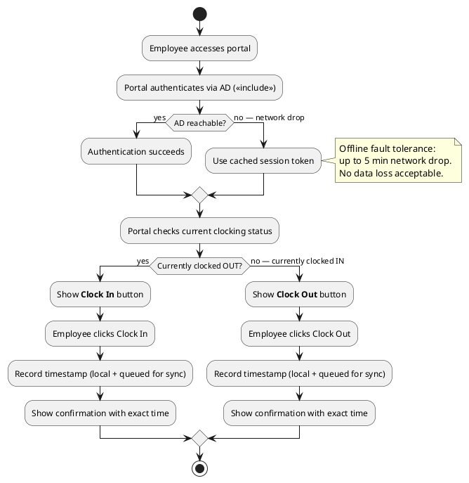

**Sequence Diagram — Offline Sync Recovery:**

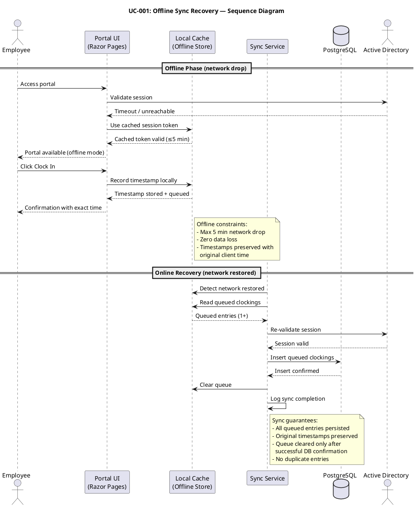

**Concrete Scenarios:**

| # | Scenario | Actor | Steps | Expected Outcome |
|---|---|---|---|---|
| S1 | Morning clock-in (online) | Carlos (Employee, Havana office) | Accesses portal → AD authenticates → sees "Clock In" → clicks → confirmation at 08:32:15 | Timestamp 2026-07-08 08:32:15 recorded; confirmation displayed |
| S2 | Clock-in during network drop | María (Employee, Santiago office) | Accesses portal → AD unreachable → cached session → sees "Clock In" → clicks → confirmation at 09:05:22 | Timestamp queued locally; confirmation displayed; sync occurs when network restores at 09:07 |
| S3 | Duplicate clock-in attempt | Carlos (Employee) | Already clocked in at 08:32 → accesses portal again → sees "Clock Out" (not "Clock In") | System shows current status (clocked in since 08:32); no duplicate entry created |

---

### UC-002: View Clocking History

| Field | Value |
|---|---|
| Primary Actor | Employee (ACT-001) |
| Trigger | Employee wants to review own clockings for current month |
| Precondition | Employee is authenticated via AD |
| Postcondition | Current month's clocking history is displayed |
| Priority | Must |
| Stability | High |
| Includes | AD Authentication (cross-cutting) |

**Main Flow:**
1. Employee navigates to clocking history page
2. System authenticates employee via AD (`<<include>>`)
3. System retrieves employee's clockings for the current month
4. System displays clocking history table (date, clock in time, clock out time) sorted by date descending

**Alternative Flows:**
- **AF-1: No clockings this month:** If no clockings exist for the current month, system displays "No clockings recorded this month."

**Exception Flows:**
- **EF-1: Database query timeout:** System displays "Unable to load history — please try again" and logs error.

**Activity Diagram (UC-002 Flow):**

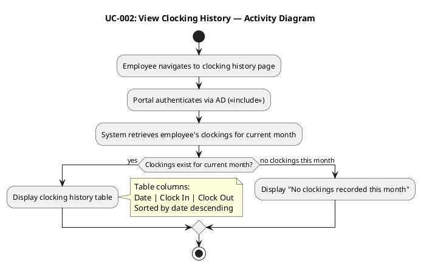

**Concrete Scenarios:**

| # | Scenario | Actor | Steps | Expected Outcome |
|---|---|---|---|---|
| S1 | View mid-month history | Carlos (Employee) | Navigates to history page on July 15 → sees 10 clocking entries from July 1–14 | Table with 10 rows, sorted by date descending |
| S2 | View on first of month | María (Employee) | Navigates to history on July 1 → no clockings yet | "No clockings recorded this month" message displayed |

---

### UC-003: Review and Export Clockings

| Field | Value |
|---|---|
| Primary Actor | HR Administrator (ACT-002) |
| Trigger | HR needs to review or export monthly clocking report |
| Precondition | HR Administrator is authenticated via AD with HR role |
| Postcondition | All employees' clockings are viewable; CSV export generated if requested |
| Priority | Must |
| Stability | Medium |
| Includes | AD Authentication (cross-cutting) |

**Main Flow:**
1. HR Administrator navigates to clocking review page
2. System authenticates HR Admin via AD (`<<include>>`) and verifies HR role
3. HR selects month filter
4. System retrieves all employees' clockings for selected month
5. System displays clocking table (paginated, 50 rows/page)
6. HR clicks "Export CSV"
7. System generates CSV file (RFC 4180 compliant)
8. System logs export action in audit trail
9. Browser downloads CSV file

**Alternative Flows:**
- **AF-1: Browse without export:** HR reviews clocking data on screen without exporting. Flow ends at step 5.
- **AF-2: Filter by employee:** HR can filter by specific employee name in addition to month.

**Exception Flows:**
- **EF-1: No clockings for selected month:** System displays "No clockings found for selected month."
- **EF-2: CSV generation fails:** System displays error message, logs error, HR can retry.

**Activity Diagram (UC-003 Flow):**

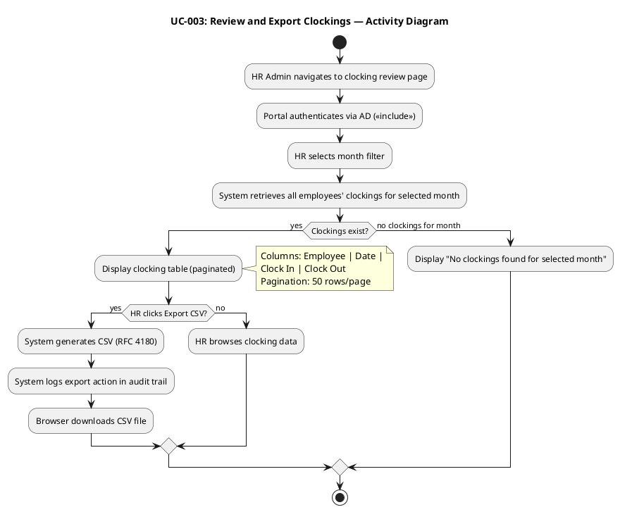

**Sequence Diagram — CSV Export Realization:**

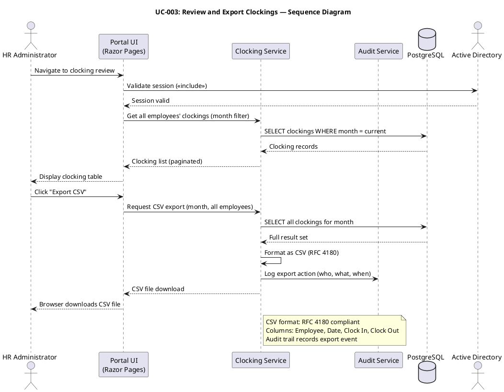

**Concrete Scenarios:**

| # | Scenario | Actor | Steps | Expected Outcome |
|---|---|---|---|---|
| S1 | Monthly export for payroll | Laura (HR Admin) | Selects June 2026 → sees 200 employees' clockings → clicks Export CSV → downloads file | CSV file with ~4000 rows (200 employees × ~20 working days), RFC 4180 compliant |
| S2 | Browse without export | Laura (HR Admin) | Selects July 2026 → reviews clockings on screen → does not export | Clocking table displayed, paginated; no CSV generated |
| S3 | Export with no data | Laura (HR Admin) | Selects December 2025 (pre-system) → no clockings | "No clockings found for selected month" message |

---

### UC-004: Publish News

| Field | Value |
|---|---|
| Primary Actor | HR Administrator (ACT-002) |
| Trigger | HR has announcement or news to distribute to employees |
| Precondition | HR Administrator is authenticated via AD with HR role |
| Postcondition | News item is published with title, body, date, category, and featured flag; audit trail entry created |
| Priority | Must |
| Stability | Medium |
| Includes | AD Authentication (cross-cutting), Audit Trail (cross-cutting) |

**Main Flow:**
1. HR Administrator navigates to news management panel
2. System authenticates HR Admin via AD (`<<include>>`) and verifies HR role
3. HR enters news title, body, category (General, HR, IT, Events), and date
4. HR optionally marks news as "featured"
5. HR clicks "Publish"
6. System validates required fields (title, body, category required)
7. System saves news item
8. System creates audit trail entry (who, what, when)
9. System displays publication confirmation

**Alternative Flows:**
- **AF-1: Edit existing news:** HR selects an existing news item, modifies fields, clicks "Save." System updates item and creates audit trail entry.
- **AF-2: Delete news:** HR selects existing news item and clicks "Delete." System marks as deleted (soft delete) and creates audit trail entry.

**Exception Flows:**
- **EF-1: Validation failure:** If title or body is empty, system displays validation errors. HR corrects and resubmits.

**Activity Diagram (UC-004 Flow):**

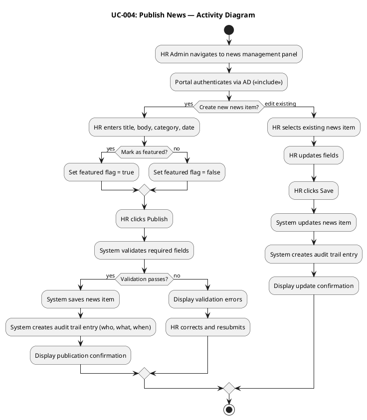

**Concrete Scenarios:**

| # | Scenario | Actor | Steps | Expected Outcome |
|---|---|---|---|---|
| S1 | Publish featured IT maintenance notice | Laura (HR Admin) | Enters title "Server Maintenance Friday" → body → category IT → marks featured → publishes | News item saved with featured=true; audit trail entry created; appears as banner on employee home page |
| S2 | Publish general announcement | Laura (HR Admin) | Enters title "New Coffee Machine" → body → category General → does NOT mark featured → publishes | News item saved with featured=false; appears in news list (not banner); audit trail entry created |
| S3 | Edit existing news with wrong date | Laura (HR Admin) | Selects news item → changes date from July 10 to July 15 → saves | News item updated; audit trail entry records edit action with timestamp |

---

### UC-005: Read News

| Field | Value |
|---|---|
| Primary Actor | Employee (ACT-001) |
| Trigger | Employee opens portal main page |
| Precondition | Employee is authenticated via AD |
| Postcondition | News items are displayed sorted by date with optional category filter and featured banner |
| Priority | Must |
| Stability | High |
| Includes | AD Authentication (cross-cutting) |

**Main Flow:**
1. Employee navigates to portal home page
2. System authenticates employee via AD (`<<include>>`)
3. System retrieves published news items sorted by date (descending)
4. If featured news exists, system displays featured banner at top
5. System displays news list below banner
6. Employee optionally selects a category filter (General, HR, IT, Events)
7. System filters news list by selected category
8. Employee clicks a news item to read full content

**Alternative Flows:**
- **AF-1: No category filter:** Employee browses all news without filtering. Flow proceeds from step 5 to step 8.
- **AF-2: No featured news:** If no news items have the featured flag, the banner section is skipped.

**Exception Flows:**
- **EF-1: No news items published:** System displays "No news available" message on home page.

**Activity Diagram (UC-005 Flow):**

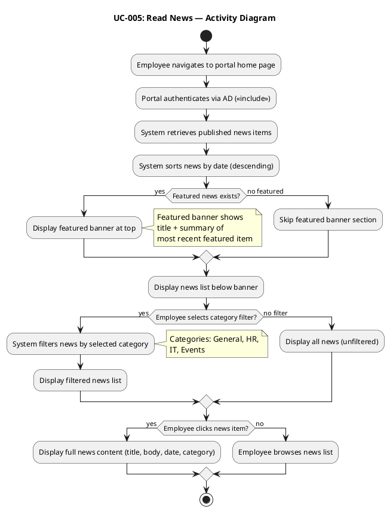

**Concrete Scenarios:**

| # | Scenario | Actor | Steps | Expected Outcome |
|---|---|---|---|---|
| S1 | Browse all news | Carlos (Employee) | Opens portal → sees featured banner (IT maintenance) → scrolls news list → clicks "New Coffee Machine" | Full news content displayed; featured banner visible at top |
| S2 | Filter by HR category | María (Employee) | Opens portal → clicks "HR" category filter → sees only HR-category news | Filtered list showing only HR-category items, sorted by date |
| S3 | No featured news | Carlos (Employee) | Opens portal on a day with no featured news → sees news list without banner | News list displayed; no banner section shown |

---

### UC-006: Search Directory

| Field | Value |
|---|---|
| Primary Actor | Employee (ACT-001) |
| Trigger | Employee needs to find a colleague's contact information |
| Precondition | Employee is authenticated via AD |
| Postcondition | Matching directory entries are displayed with corporate contact data |
| Priority | Must |
| Stability | High |
| Includes | AD Authentication (cross-cutting) |

**Main Flow:**
1. Employee navigates to directory page
2. System authenticates employee via AD (`<<include>>`)
3. Employee enters search criteria (name, department, or office)
4. System queries directory entries matching criteria
5. System displays matching entries (name, job title, department, office, email, extension phone)
6. Employee reviews results

**Alternative Flows:**
- **AF-1: Browse all (no criteria):** Employee opens directory without entering search criteria. System displays all entries (paginated).

**Exception Flows:**
- **EF-1: No results found:** System displays "No colleagues found matching criteria."
- **EF-2: Search timeout:** If query exceeds 2 seconds (REQ-018), system displays partial results or "Search timed out — please refine criteria."

**Activity Diagram (UC-006 Flow):**

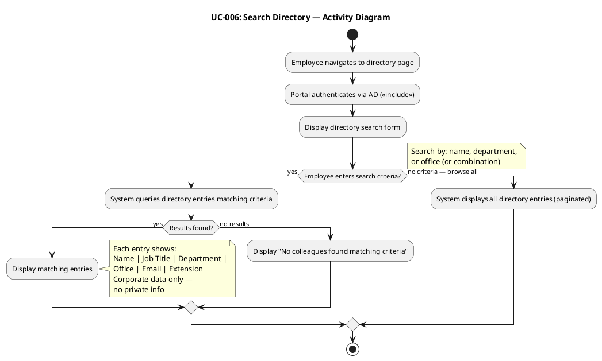

**Concrete Scenarios:**

| # | Scenario | Actor | Steps | Expected Outcome |
|---|---|---|---|---|
| S1 | Search by name | Carlos (Employee) | Types "María" in name field → clicks Search | All employees named María displayed with title, dept, office, email, extension |
| S2 | Filter by department | Carlos (Employee) | Selects "IT" department filter → clicks Search | All IT department employees displayed |
| S3 | Search by office | María (Employee) | Selects "Santiago" office → clicks Search | All employees at Santiago office displayed |
| S4 | No results | Carlos (Employee) | Types "xyz" in name field → clicks Search | "No colleagues found matching criteria" message |

---

### UC-007: Manage Directory

| Field | Value |
|---|---|
| Primary Actor | HR Administrator (ACT-002) |
| Trigger | HR needs to create, update, or deactivate an employee directory entry |
| Precondition | HR Administrator is authenticated via AD with HR role |
| Postcondition | Directory entry is created/updated/deactivated; audit trail entry created |
| Priority | Must |
| Stability | Medium |
| Includes | AD Authentication (cross-cutting), Audit Trail (cross-cutting) |

**Main Flow:**
1. HR Administrator navigates to directory admin panel
2. System authenticates HR Admin via AD (`<<include>>`) and verifies HR role
3. HR selects action: create new entry or edit existing entry
4. **Create:** HR enters name, job title, department, office, email, extension phone
5. HR clicks "Save"
6. System creates directory entry
7. System creates audit trail entry (who, what, when)
8. System displays creation confirmation

**Alternative Flows:**
- **AF-1: Edit existing entry:** HR selects employee entry, updates fields, clicks "Save." System updates entry and creates audit trail entry.
- **AF-2: Deactivate entry:** HR selects employee entry and clicks "Deactivate." Entry is marked inactive (not deleted); audit trail entry created.
- **AF-3: AD sync conflict:** If AD-synchronized data conflicts with manual edit, system flags conflict for HR resolution.

**Exception Flows:**
- **EF-1: Required field missing:** If name or email is empty, system displays validation error. HR corrects and resubmits.
- **EF-2: AD sync conflict unresolved:** If HR attempts to save an AD-synced field change without choosing override or revert, system blocks save and prompts for resolution.

**Activity Diagram (UC-007 Flow):**

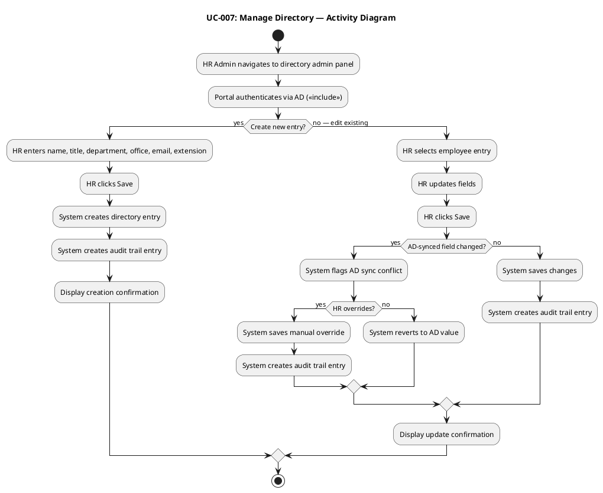

**Sequence Diagram — AD Sync Conflict Resolution:**

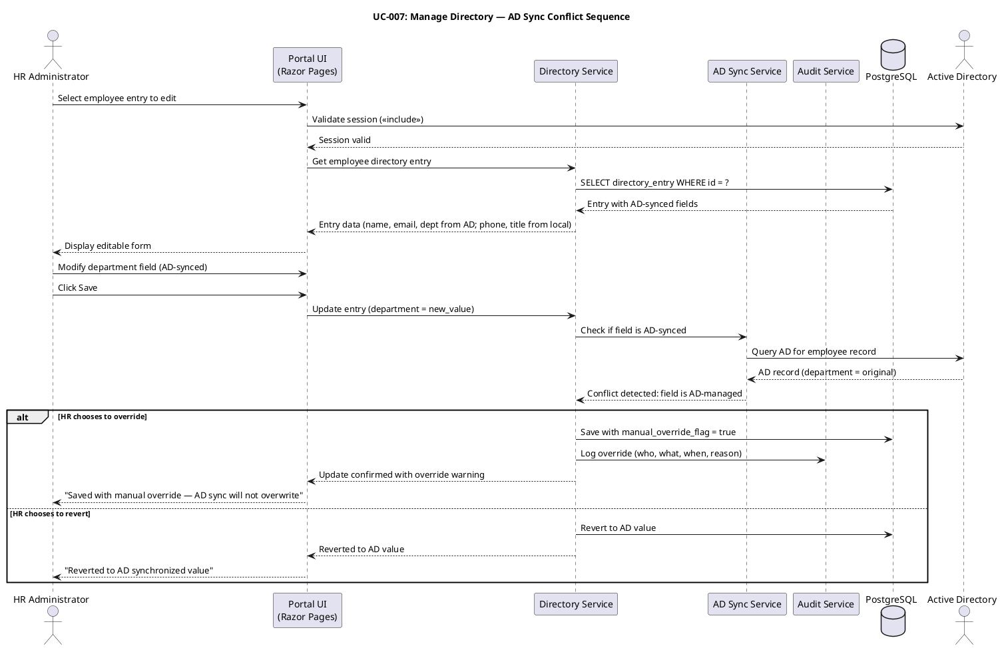

**Concrete Scenarios:**

| # | Scenario | Actor | Steps | Expected Outcome |
|---|---|---|---|---|
| S1 | Create new employee entry | Laura (HR Admin) | Enters name "Pedro Ruiz" → title "Accountant" → dept Finance → office Havana → email pruiz@cubacorp.com → ext 2205 → saves | Entry created; audit trail entry logged; Pedro appears in directory search |
| S2 | Update extension phone (non-AD field) | Laura (HR Admin) | Selects Carlos → changes extension from 2100 to 2150 → saves | Entry updated; no AD conflict (phone is local field); audit trail entry created |
| S3 | Update department (AD-synced field) with override | Laura (HR Admin) | Selects María → changes dept from IT to Operations → system flags AD conflict → HR chooses override → saves | Entry saved with manual_override_flag=true; audit trail logs override; AD sync will not overwrite this field |
| S4 | Deactivate departing employee | Laura (HR Admin) | Selects Juan → clicks Deactivate → confirms | Entry marked inactive; not visible in directory search; audit trail entry created |
## Traceability

| Element | Traces From | Link Type | Traces To |
|---|---|---|---|
| UC-001 | FEAT-001, FEAT-010 | Refines | ACL-001 (future), TC-001 (future) |
| UC-002 | FEAT-002 | Refines | ACL-001 (future), TC-002 (future) |
| UC-003 | FEAT-003 | Refines | ACL-002 (future), TC-003 (future) |
| UC-004 | FEAT-004, FEAT-006 | Refines | ACL-003 (future), TC-004 (future) |
| UC-005 | FEAT-005 | Refines | ACL-003 (future), TC-005 (future) |
| UC-006 | FEAT-007 | Refines | ACL-004 (future), TC-006 (future) |
| UC-007 | FEAT-008 | Refines | ACL-004 (future), TC-007 (future) |
| ACT-001 | STK-003 | — | UC-001, UC-002, UC-005, UC-006 |
| ACT-002 | STK-001 | — | UC-003, UC-004, UC-007 |
| ACT-003 | STK-002, CON-004 | — | <<include>> from all UCs |