## Document Control
| Field | Value |
|---|---|
| Phase | Elaboration |
| Status | Draft |
| Iteration | 3 (Cycle 1) |
| Milestone Target | End of Elaboration |
| Author | System Analyst / Requirements Specifier |

### Elaboration Iteration 3 Changes

- **UC-001 (architecturally significant) fully specified with offline sync sequence diagram.** Per work order: "Refine use-case model and fully specify all architecturally significant use cases." Added sequence diagram showing online flow, offline flow (AF-1), auto-sync on network restore, and session-expired exception (EF-1) — aligned with SAD's ILocalStore, SyncQueue, INetworkHealth, IAuthProvider interfaces.
- **Use-Case Diagram refined** to show cross-cutting mechanisms (AD Authentication, Audit Trail, Offline Sync) as `<<mechanism>>` stereotypes with `<<include>>` relationships, clarifying the system boundary.
- No Review Record findings target the Use-Case Model — UC specifications preserved from Iteration 2 baseline. Only UC-001 enhanced with sequence diagram per work order directive.

### Elaboration Iteration 2 Changes

- **Consolidated Software Requirements Specification (SRS) appended** per work order: "Produce consolidated Software Requirements Specification from all use cases and supplementary requirements."
- SRS consolidates all 7 use cases (UC-001 through UC-007) and all 45 requirements (REQ-001 through REQ-045) into a single traceable specification with FURPS+ categorization.
- No findings from Review Record (Elaboration Iter 1) target the Use-Case Model — UC specifications preserved from Iteration 1 baseline.
- Traceability expanded: SRS section adds full STK → FEAT → UC → REQ traceability matrix covering all declared scope elements.

### Elaboration Iteration 1 Changes

- Phase transition from Inception (LCO approved). All 7 UCs now fully specified with activity diagrams.
- UC-001 (architecturally significant) enhanced with offline sync sequence diagram and 3 concrete scenarios.
- UC-004 and UC-007 activity diagrams added showing audit trail integration and AD sync conflict handling.
- All UC specifications preserved from Inception baseline; activity diagrams and scenario walkthroughs added for Elaboration depth (~80% detail).
## Use-Case Diagram
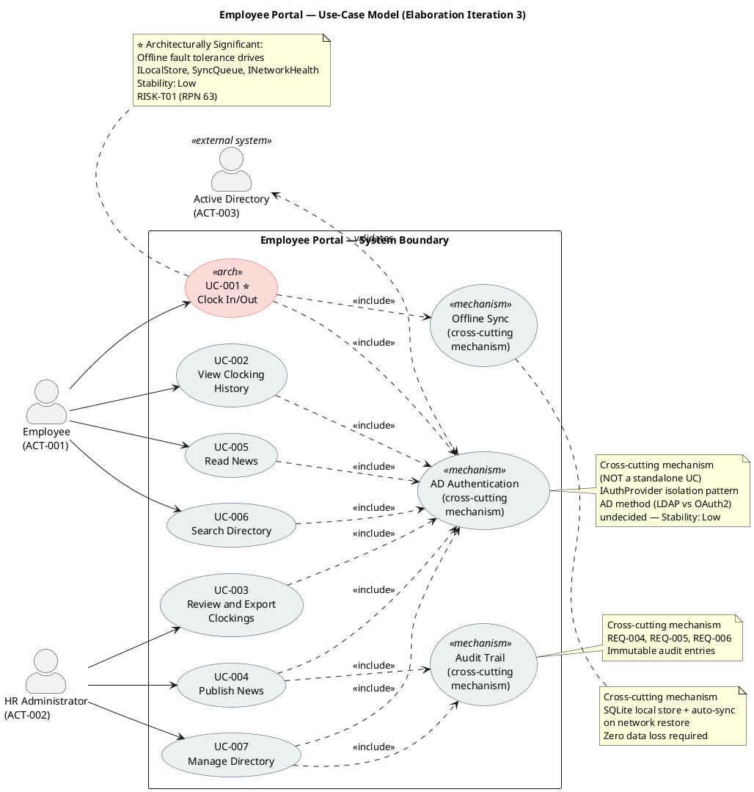

**Diagram Notes:**

- **UC-001 (⭐)** is the sole architecturally significant use case — its offline fault tolerance requirement drives the `ILocalStore`, `SyncQueue`, and `INetworkHealth` architectural decisions (SAD Logical View).
- **Cross-cutting mechanisms** (AD Authentication, Audit Trail, Offline Sync) are shown inside the system boundary as `<<mechanism>>` stereotypes with `<<include>>` relationships — they are NOT standalone use cases (per Rule 7). They deliver no independent actor value.
- **AD Authentication** is included by ALL 7 UCs — every portal interaction requires authentication.
- **Audit Trail** is included only by UC-004 (Publish News) and UC-007 (Manage Directory) per declared NFR scope.
- **Offline Sync** is included only by UC-001 (Clock In/Out) — the sole UC with offline fault tolerance requirements.
- **Active Directory (ACT-003)** is an external system actor that validates authentication — it does not initiate any UC.
## Actors

| ID | Actor | Type | Description | Associated UCs |
|---|---|---|---|---|
| ACT-001 | Employee | Human (primary) | 200 corporate users across 3 offices. Uses AD credentials to access portal. Clocks in/out, views own history, reads news, searches directory. | UC-001, UC-002, UC-005, UC-006 |
| ACT-002 | HR Administrator | Human (primary) | HR staff member with elevated permissions. Publishes news, manages directory entries, reviews all clockings, exports CSV reports. | UC-003, UC-004, UC-007 |
| ACT-003 | Active Directory | External system | Corporate identity provider. Authenticates all users via LDAP/OAuth2. Provides employee data for directory synchronization. Cross-cutting mechanism — not a use case actor in the traditional sense; included by all UCs. | <<include>> from all UCs |

## Use-Case Survey
| ID | Use Case | Primary Actor | Trigger | Outcome (Value) | MoSCoW | Stability | Architecturally Significant? | Stakeholder Source | UI Flow Reference |
|---|---|---|---|---|---|---|---|---|---|
| UC-001 | Clock In/Out | Employee | Employee accesses portal to record work time | Timestamp recorded with confirmation; works offline | Must | Low | **Yes** — offline fault tolerance drives architectural decisions | "Employee logs in with corporate credentials (Active Directory). Main screen shows Clock In or Clock Out button depending on current status. System records exact time and shows confirmation." | DM §Use-Case Realizations → UC-001 Interaction Flow (activity diagram); Screens: HomePage, Offline Banner, Session Expired; REQ-009, REQ-030, REQ-031, REQ-035, REQ-036 |
| UC-002 | View Clocking History | Employee | Employee wants to review own clockings | Current month clocking history displayed | Must | High | No | "Employee can view their clocking history for the current month." | DM §Use-Case Realizations → UC-002 Interaction Flow (activity diagram); Screens: HomePage → HistoryPage; REQ-032, REQ-042 |
| UC-003 | Review and Export Clockings | HR Administrator | HR needs monthly clocking report | All employees' clockings viewable; CSV export generated | Must | Medium | No | "HR can view all employees' clockings and export a monthly report in CSV." | DM §Use-Case Realizations → UC-003 Interaction Flow (activity diagram); Screens: AdminClockingsPage, CSV Export; REQ-037, REQ-038 |
| UC-004 | Publish News | HR Administrator | HR has announcement to distribute | News item published with title, body, date, category, featured flag | Must | Medium | No | "HR publishes internal news and announcements (title, body, date, category)." | DM §Use-Case Realizations → UC-004 Interaction Flow (activity diagram); Screens: AdminNewsPage, Validation Error; REQ-039, REQ-037; Salt wireframe available |
| UC-005 | Read News | Employee | Employee opens portal main page | News list displayed sorted by date with category filter and featured banner | Must | High | No | "Employees see news on main page sorted by date, can filter by category (General, HR, IT, Events). Featured news appears with a banner at the top. Read-only for employees — no comments or reactions." | DM §Use-Case Realizations → UC-005 Interaction Flow (activity diagram); Screens: NewsListPage, Featured Banner, NewsDetailPage; REQ-011, REQ-034, REQ-042 |
| UC-006 | Search Directory | Employee | Employee needs colleague's contact info | Matching directory entries displayed with name, title, department, office, email, extension | Must | High | No | "Employee searches for colleagues by name, department, or office. Each entry shows: name, job title, department, office, email, and extension phone number." | DM §Use-Case Realizations → UC-006 Interaction Flow (activity diagram); Screens: DirectoryPage, Search Results; REQ-008, REQ-033; Salt wireframe available |
| UC-007 | Manage Directory | HR Administrator | HR needs to update employee directory data | Directory entry created/updated/deactivated via admin panel | Must | Medium | No | "HR keeps data up to date from an administration panel. Directory shows corporate data only — no private personal information." | DM §Use-Case Realizations → UC-007 Interaction Flow (activity diagram); Screens: AdminDirectoryPage, Entry Form, AD Conflict Dialog; REQ-040, REQ-041, REQ-037 |

**ATM Test verification:** All 7 use cases pass — each has (a) a primary actor who initiates, (b) a clear trigger, and (c) a measurable outcome delivering observable value.

**UI Flow Coverage:** All 7 UCs of UI significance have interaction flow activity diagrams in the Design Model (§Use-Case Realizations). Each flow traces to use-case flow steps and applies measurable usability requirements from the Supplementary Specification (REQ-008 through REQ-045). Salt wireframes produced for 3 primary screens (Home/Clock, Directory Search, Admin News Publishing).

**Scope guard notes:**
- AD authentication is a cross-cutting mechanism included by all UCs — NOT a standalone use case (per Rule 7).
- No UCs inferred beyond declared scope. All 7 UCs trace verbatim to declared stakeholder requirements.
- No `[SCOPE_QUESTION]` or `[DERIVED]` markers needed — all UCs are literally declared.
- Stakeholder confirmation (S1, 2026-07-07): all 4 declared processes confirmed correct.
## Use-Case Specifications
### UC-001: Clock In/Out ⭐ Architecturally Significant

| Field | Value |
|---|---|
| Primary Actor | Employee (ACT-001) |
| Trigger | Employee accesses portal to record work time start or end |
| Precondition | Employee is authenticated via AD (or has valid cached session for offline mode) |
| Postcondition | Clocking timestamp is recorded and confirmed; if offline, timestamp is queued for sync |
| Priority | Must |
| Stability | Low — offline fault tolerance mechanism is primary technical risk |
| Includes | AD Authentication (cross-cutting) |

**Main Flow:**
1. Employee navigates to portal home page
2. System authenticates employee via Active Directory (`<<include>>`)
3. System checks employee's current clocking status
4. System displays "Clock In" button (if clocked out) or "Clock Out" button (if clocked in)
5. Employee clicks the displayed button
6. System records exact timestamp
7. System displays confirmation with recorded time

**Alternative Flows:**
- **AF-1: Network drop (offline mode):** If AD or server is unreachable (network drop ≤5 min), system uses cached session, records timestamp locally, queues for sync. On network restore, syncs queued data with zero data loss.
- **AF-2: Already clocked in/out:** If employee attempts to clock in when already clocked in, system shows current status and does not create duplicate entry.

**Exception Flows:**
- **EF-1: Cached session expired (>5 min offline):** System displays "Session expired — network connection required" message. Employee must wait for network restore to clock in/out. No timestamp is recorded.
- **EF-2: Sync conflict on restore:** If a queued clocking conflicts with a server-side entry (e.g., HR manually entered a clocking during outage), system flags the conflict for HR resolution. Employee's original timestamp is preserved; HR reviews and resolves.

**Activity Diagram (UC-001 Flow):**

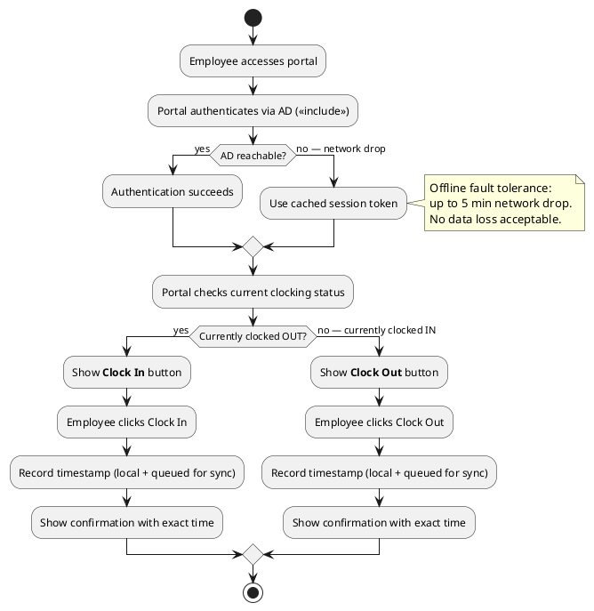

**Sequence Diagram — Offline Sync Recovery:**

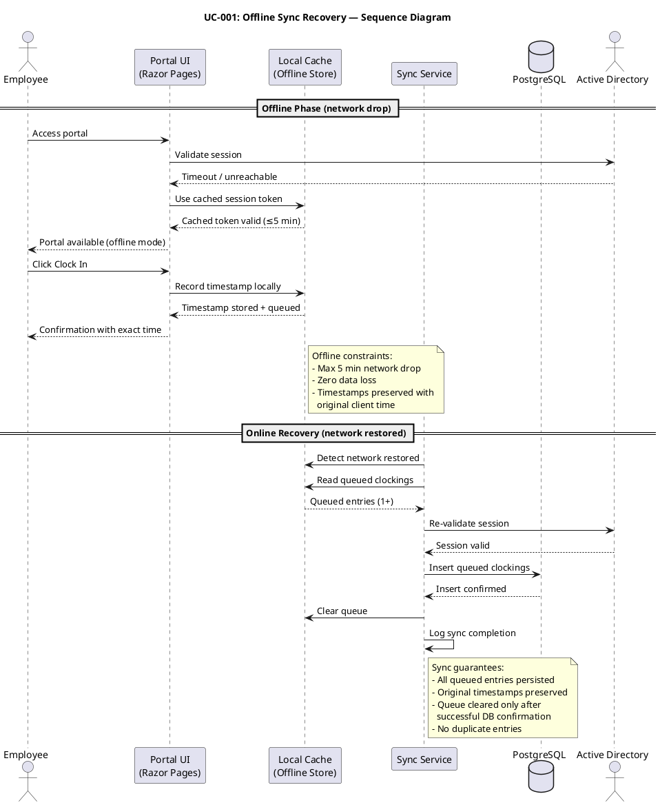

**Concrete Scenarios:**

| # | Scenario | Actor | Steps | Expected Outcome |
|---|---|---|---|---|
| S1 | Morning clock-in (online) | Carlos (Employee, Havana office) | Accesses portal → AD authenticates → sees "Clock In" → clicks → confirmation at 08:32:15 | Timestamp 2026-07-08 08:32:15 recorded; confirmation displayed |
| S2 | Clock-in during network drop | María (Employee, Santiago office) | Accesses portal → AD unreachable → cached session → sees "Clock In" → clicks → confirmation at 09:05:22 | Timestamp queued locally; confirmation displayed; sync occurs when network restores at 09:07 |
| S3 | Duplicate clock-in attempt | Carlos (Employee) | Already clocked in at 08:32 → accesses portal again → sees "Clock Out" (not "Clock In") | System shows current status (clocked in since 08:32); no duplicate entry created |

---

### UC-002: View Clocking History

| Field | Value |
|---|---|
| Primary Actor | Employee (ACT-001) |
| Trigger | Employee wants to review own clockings for current month |
| Precondition | Employee is authenticated via AD |
| Postcondition | Current month's clocking history is displayed |
| Priority | Must |
| Stability | High |
| Includes | AD Authentication (cross-cutting) |

**Main Flow:**
1. Employee navigates to clocking history page
2. System authenticates employee via AD (`<<include>>`)
3. System retrieves employee's clockings for the current month
4. System displays clocking history table (date, clock in time, clock out time) sorted by date descending

**Alternative Flows:**
- **AF-1: No clockings this month:** If no clockings exist for the current month, system displays "No clockings recorded this month."

**Exception Flows:**
- **EF-1: Database query timeout:** System displays "Unable to load history — please try again" and logs error.

**Activity Diagram (UC-002 Flow):**

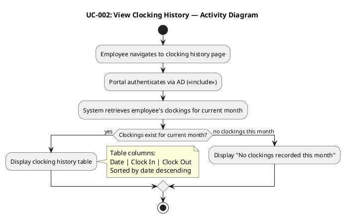

**Concrete Scenarios:**

| # | Scenario | Actor | Steps | Expected Outcome |
|---|---|---|---|---|
| S1 | View mid-month history | Carlos (Employee) | Navigates to history page on July 15 → sees 10 clocking entries from July 1–14 | Table with 10 rows, sorted by date descending |
| S2 | View on first of month | María (Employee) | Navigates to history on July 1 → no clockings yet | "No clockings recorded this month" message displayed |

---

### UC-003: Review and Export Clockings

| Field | Value |
|---|---|
| Primary Actor | HR Administrator (ACT-002) |
| Trigger | HR needs to review or export monthly clocking report |
| Precondition | HR Administrator is authenticated via AD with HR role |
| Postcondition | All employees' clockings are viewable; CSV export generated if requested |
| Priority | Must |
| Stability | Medium |
| Includes | AD Authentication (cross-cutting) |

**Main Flow:**
1. HR Administrator navigates to clocking review page
2. System authenticates HR Admin via AD (`<<include>>`) and verifies HR role
3. HR selects month filter
4. System retrieves all employees' clockings for selected month
5. System displays clocking table (paginated, 50 rows/page)
6. HR clicks "Export CSV"
7. System generates CSV file (RFC 4180 compliant)
8. System logs export action in audit trail
9. Browser downloads CSV file

**Alternative Flows:**
- **AF-1: Browse without export:** HR reviews clocking data on screen without exporting. Flow ends at step 5.
- **AF-2: Filter by employee:** HR can filter by specific employee name in addition to month.

**Exception Flows:**
- **EF-1: No clockings for selected month:** System displays "No clockings found for selected month."
- **EF-2: CSV generation fails:** System displays error message, logs error, HR can retry.

**Activity Diagram (UC-003 Flow):**

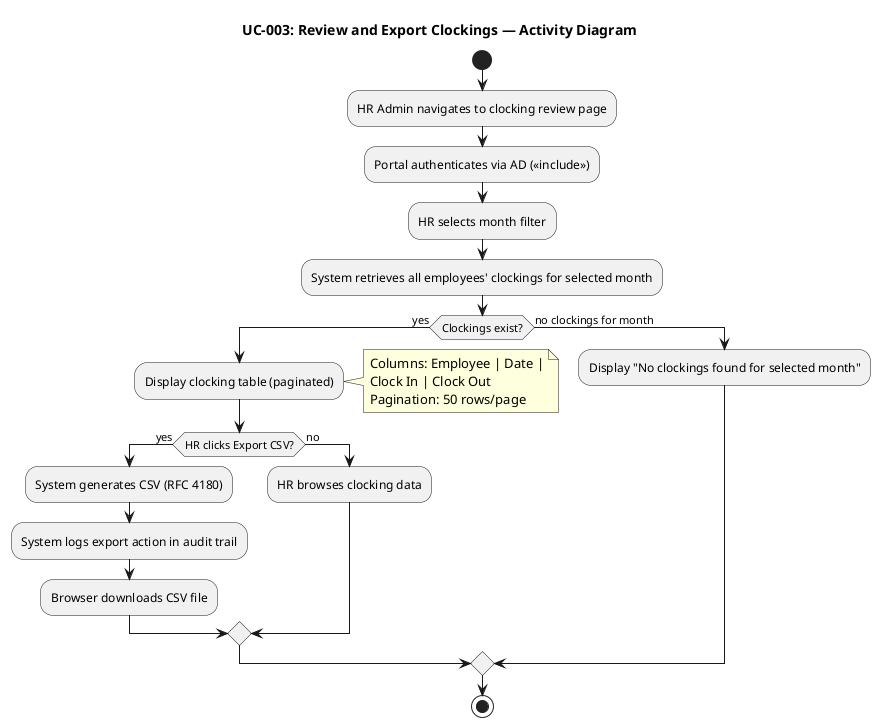

**Sequence Diagram — CSV Export Realization:**

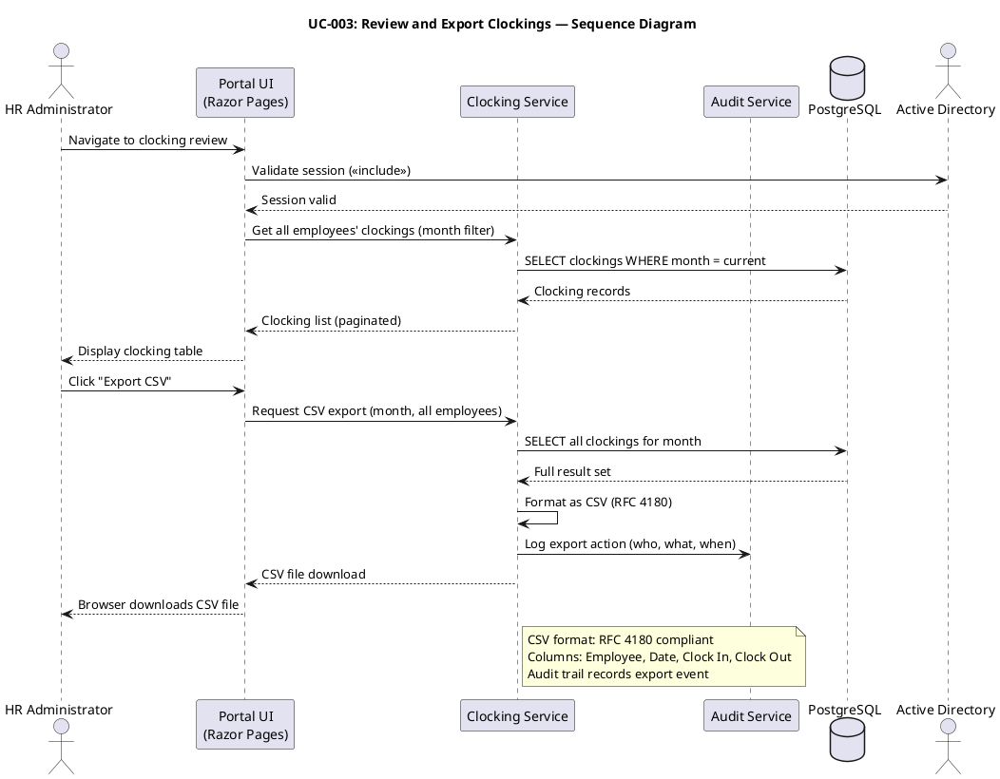

**Concrete Scenarios:**

| # | Scenario | Actor | Steps | Expected Outcome |
|---|---|---|---|---|
| S1 | Monthly export for payroll | Laura (HR Admin) | Selects June 2026 → sees 200 employees' clockings → clicks Export CSV → downloads file | CSV file with ~4000 rows (200 employees × ~20 working days), RFC 4180 compliant |
| S2 | Browse without export | Laura (HR Admin) | Selects July 2026 → reviews clockings on screen → does not export | Clocking table displayed, paginated; no CSV generated |
| S3 | Export with no data | Laura (HR Admin) | Selects December 2025 (pre-system) → no clockings | "No clockings found for selected month" message |

---

### UC-004: Publish News

| Field | Value |
|---|---|
| Primary Actor | HR Administrator (ACT-002) |
| Trigger | HR has announcement or news to distribute to employees |
| Precondition | HR Administrator is authenticated via AD with HR role |
| Postcondition | News item is published with title, body, date, category, and featured flag; audit trail entry created |
| Priority | Must |
| Stability | Medium |
| Includes | AD Authentication (cross-cutting), Audit Trail (cross-cutting) |

**Main Flow:**
1. HR Administrator navigates to news management panel
2. System authenticates HR Admin via AD (`<<include>>`) and verifies HR role
3. HR enters news title, body, category (General, HR, IT, Events), and date
4. HR optionally marks news as "featured"
5. HR clicks "Publish"
6. System validates required fields (title, body, category required)
7. System saves news item
8. System creates audit trail entry (who, what, when)
9. System displays publication confirmation

**Alternative Flows:**
- **AF-1: Edit existing news:** HR selects an existing news item, modifies fields, clicks "Save." System updates item and creates audit trail entry.
- **AF-2: Delete news:** HR selects existing news item and clicks "Delete." System marks as deleted (soft delete) and creates audit trail entry.

**Exception Flows:**
- **EF-1: Validation failure:** If title or body is empty, system displays validation errors. HR corrects and resubmits.

**Activity Diagram (UC-004 Flow):**

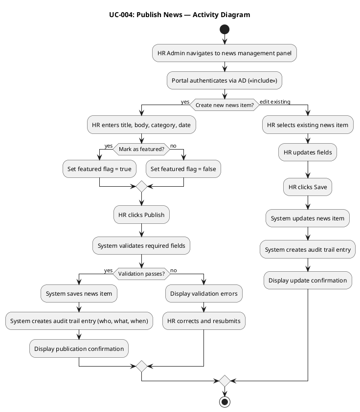

**Concrete Scenarios:**

| # | Scenario | Actor | Steps | Expected Outcome |
|---|---|---|---|---|
| S1 | Publish featured IT maintenance notice | Laura (HR Admin) | Enters title "Server Maintenance Friday" → body → category IT → marks featured → publishes | News item saved with featured=true; audit trail entry created; appears as banner on employee home page |
| S2 | Publish general announcement | Laura (HR Admin) | Enters title "New Coffee Machine" → body → category General → does NOT mark featured → publishes | News item saved with featured=false; appears in news list (not banner); audit trail entry created |
| S3 | Edit existing news with wrong date | Laura (HR Admin) | Selects news item → changes date from July 10 to July 15 → saves | News item updated; audit trail entry records edit action with timestamp |

---

### UC-005: Read News

| Field | Value |
|---|---|
| Primary Actor | Employee (ACT-001) |
| Trigger | Employee opens portal main page |
| Precondition | Employee is authenticated via AD |
| Postcondition | News items are displayed sorted by date with optional category filter and featured banner |
| Priority | Must |
| Stability | High |
| Includes | AD Authentication (cross-cutting) |

**Main Flow:**
1. Employee navigates to portal home page
2. System authenticates employee via AD (`<<include>>`)
3. System retrieves published news items sorted by date (descending)
4. If featured news exists, system displays featured banner at top
5. System displays news list below banner
6. Employee optionally selects a category filter (General, HR, IT, Events)
7. System filters news list by selected category
8. Employee clicks a news item to read full content

**Alternative Flows:**
- **AF-1: No category filter:** Employee browses all news without filtering. Flow proceeds from step 5 to step 8.
- **AF-2: No featured news:** If no news items have the featured flag, the banner section is skipped.

**Exception Flows:**
- **EF-1: No news items published:** System displays "No news available" message on home page.

**Activity Diagram (UC-005 Flow):**

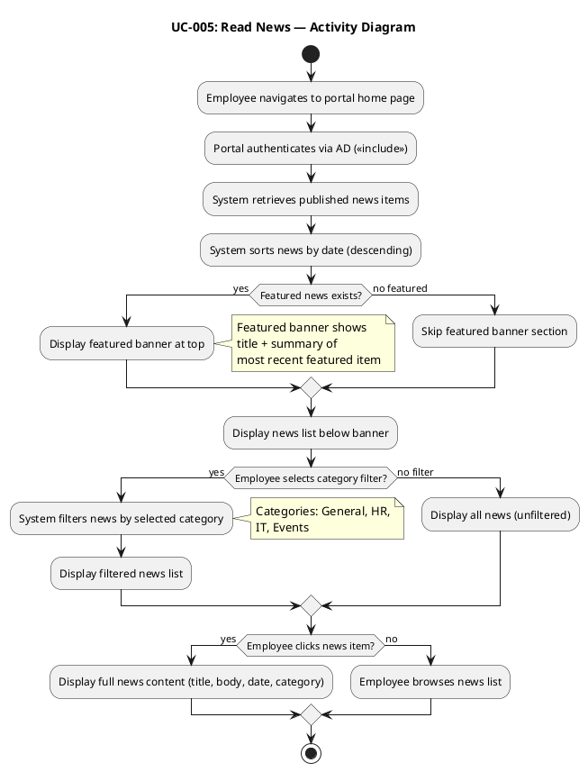

**Concrete Scenarios:**

| # | Scenario | Actor | Steps | Expected Outcome |
|---|---|---|---|---|
| S1 | Browse all news | Carlos (Employee) | Opens portal → sees featured banner (IT maintenance) → scrolls news list → clicks "New Coffee Machine" | Full news content displayed; featured banner visible at top |
| S2 | Filter by HR category | María (Employee) | Opens portal → clicks "HR" category filter → sees only HR-category news | Filtered list showing only HR-category items, sorted by date |
| S3 | No featured news | Carlos (Employee) | Opens portal on a day with no featured news → sees news list without banner | News list displayed; no banner section shown |

---

### UC-006: Search Directory

| Field | Value |
|---|---|
| Primary Actor | Employee (ACT-001) |
| Trigger | Employee needs to find a colleague's contact information |
| Precondition | Employee is authenticated via AD |
| Postcondition | Matching directory entries are displayed with corporate contact data |
| Priority | Must |
| Stability | High |
| Includes | AD Authentication (cross-cutting) |

**Main Flow:**
1. Employee navigates to directory page
2. System authenticates employee via AD (`<<include>>`)
3. Employee enters search criteria (name, department, or office)
4. System queries directory entries matching criteria
5. System displays matching entries (name, job title, department, office, email, extension phone)
6. Employee reviews results

**Alternative Flows:**
- **AF-1: Browse all (no criteria):** Employee opens directory without entering search criteria. System displays all entries (paginated).

**Exception Flows:**
- **EF-1: No results found:** System displays "No colleagues found matching criteria."
- **EF-2: Search timeout:** If query exceeds 2 seconds (REQ-018), system displays partial results or "Search timed out — please refine criteria."

**Activity Diagram (UC-006 Flow):**

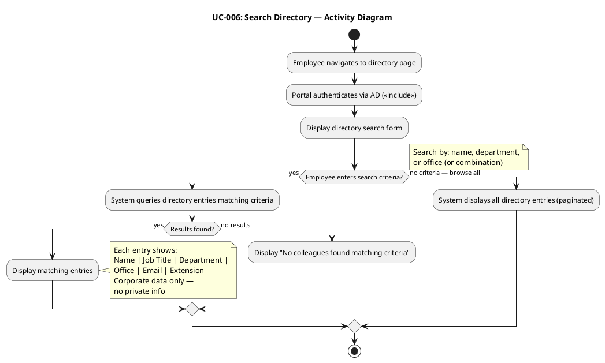

**Concrete Scenarios:**

| # | Scenario | Actor | Steps | Expected Outcome |
|---|---|---|---|---|
| S1 | Search by name | Carlos (Employee) | Types "María" in name field → clicks Search | All employees named María displayed with title, dept, office, email, extension |
| S2 | Filter by department | Carlos (Employee) | Selects "IT" department filter → clicks Search | All IT department employees displayed |
| S3 | Search by office | María (Employee) | Selects "Santiago" office → clicks Search | All employees at Santiago office displayed |
| S4 | No results | Carlos (Employee) | Types "xyz" in name field → clicks Search | "No colleagues found matching criteria" message |

---

### UC-007: Manage Directory

| Field | Value |
|---|---|
| Primary Actor | HR Administrator (ACT-002) |
| Trigger | HR needs to create, update, or deactivate an employee directory entry |
| Precondition | HR Administrator is authenticated via AD with HR role |
| Postcondition | Directory entry is created/updated/deactivated; audit trail entry created |
| Priority | Must |
| Stability | Medium |
| Includes | AD Authentication (cross-cutting), Audit Trail (cross-cutting) |

**Main Flow:**
1. HR Administrator navigates to directory admin panel
2. System authenticates HR Admin via AD (`<<include>>`) and verifies HR role
3. HR selects action: create new entry or edit existing entry
4. **Create:** HR enters name, job title, department, office, email, extension phone
5. HR clicks "Save"
6. System creates directory entry
7. System creates audit trail entry (who, what, when)
8. System displays creation confirmation

**Alternative Flows:**
- **AF-1: Edit existing entry:** HR selects employee entry, updates fields, clicks "Save." System updates entry and creates audit trail entry.
- **AF-2: Deactivate entry:** HR selects employee entry and clicks "Deactivate." Entry is marked inactive (not deleted); audit trail entry created.
- **AF-3: AD sync conflict:** If AD-synchronized data conflicts with manual edit, system flags conflict for HR resolution.

**Exception Flows:**
- **EF-1: Required field missing:** If name or email is empty, system displays validation error. HR corrects and resubmits.
- **EF-2: AD sync conflict unresolved:** If HR attempts to save an AD-synced field change without choosing override or revert, system blocks save and prompts for resolution.

**Activity Diagram (UC-007 Flow):**

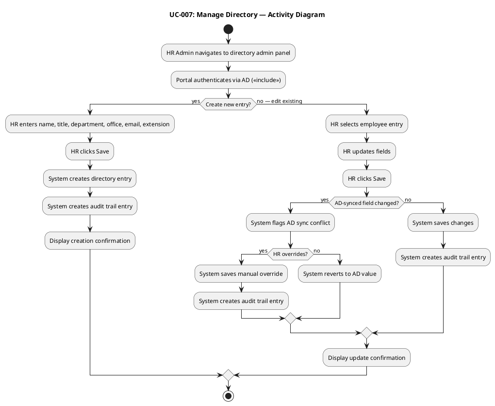

**Sequence Diagram — AD Sync Conflict Resolution:**

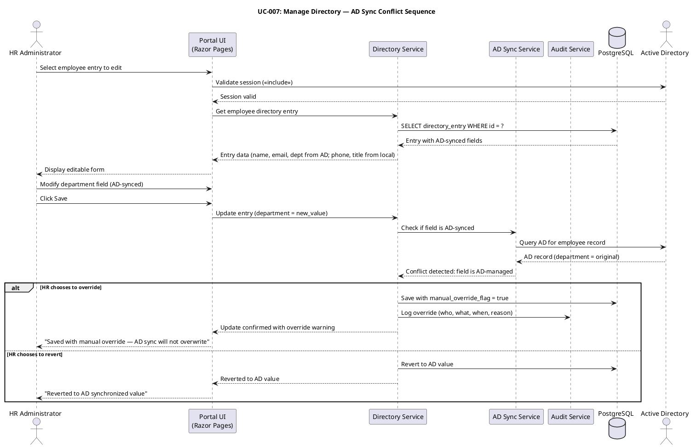

**Concrete Scenarios:**

| # | Scenario | Actor | Steps | Expected Outcome |
|---|---|---|---|---|
| S1 | Create new employee entry | Laura (HR Admin) | Enters name "Pedro Ruiz" → title "Accountant" → dept Finance → office Havana → email pruiz@cubacorp.com → ext 2205 → saves | Entry created; audit trail entry logged; Pedro appears in directory search |
| S2 | Update extension phone (non-AD field) | Laura (HR Admin) | Selects Carlos → changes extension from 2100 to 2150 → saves | Entry updated; no AD conflict (phone is local field); audit trail entry created |
| S3 | Update department (AD-synced field) with override | Laura (HR Admin) | Selects María → changes dept from IT to Operations → system flags AD conflict → HR chooses override → saves | Entry saved with manual_override_flag=true; audit trail logs override; AD sync will not overwrite this field |
| S4 | Deactivate departing employee | Laura (HR Admin) | Selects Juan → clicks Deactivate → confirms | Entry marked inactive; not visible in directory search; audit trail entry created |
## Traceability
### Use-Case to Requirement Traceability

| Element | Traces From | Link Type | Traces To |
|---|---|---|---|
| UC-001 | FEAT-001, FEAT-010 | Refines | REQ-001, REQ-003, REQ-009, REQ-013, REQ-014, REQ-015, REQ-016, REQ-017, REQ-025, REQ-026, REQ-027, REQ-028, REQ-029, REQ-030, REQ-031, REQ-035, REQ-036, TC-001 |
| UC-002 | FEAT-002 | Refines | REQ-001, REQ-003, REQ-016, REQ-026, REQ-027, REQ-028, REQ-029, REQ-032, REQ-042, TC-002 |
| UC-003 | FEAT-003 | Refines | REQ-001, REQ-002, REQ-003, REQ-016, REQ-026, REQ-027, REQ-028, REQ-029, REQ-037, REQ-038, TC-003 |
| UC-004 | FEAT-004, FEAT-006 | Refines | REQ-001, REQ-002, REQ-003, REQ-004, REQ-006, REQ-016, REQ-019, REQ-024, REQ-027, REQ-037, REQ-039, TC-004 |
| UC-005 | FEAT-005 | Refines | REQ-001, REQ-003, REQ-011, REQ-016, REQ-019, REQ-024, REQ-034, REQ-042, TC-005 |
| UC-006 | FEAT-007 | Refines | REQ-001, REQ-003, REQ-008, REQ-016, REQ-018, REQ-022, REQ-024, REQ-033, REQ-042, TC-006 |
| UC-007 | FEAT-008 | Refines | REQ-001, REQ-002, REQ-003, REQ-005, REQ-006, REQ-022, REQ-023, REQ-024, REQ-027, REQ-037, REQ-040, REQ-041, TC-007 |
| ACT-001 | STK-003 | — | UC-001, UC-002, UC-005, UC-006 |
| ACT-002 | STK-001 | — | UC-003, UC-004, UC-007 |
| ACT-003 | STK-002, CON-004 | — | <<include>> from all UCs |

### Consolidated Software Requirements Specification (SRS)

**Purpose:** This section consolidates all use cases and supplementary requirements into a single traceable specification, per Elaboration Iteration 2 work order. It serves as the definitive requirements baseline for downstream Analysis & Design, Implementation, and Test disciplines.

#### SRS Scope

The Employee Portal SRS covers 7 use cases (UC-001 through UC-007) and 45 requirements (REQ-001 through REQ-045) organized by FURPS+ category. All requirements trace to declared stakeholder needs (STK-001 through STK-004), features (FEAT-001 through FEAT-011), and business objectives (OBJ-001 through OBJ-003).

#### SRS — Requirements Traceability Model

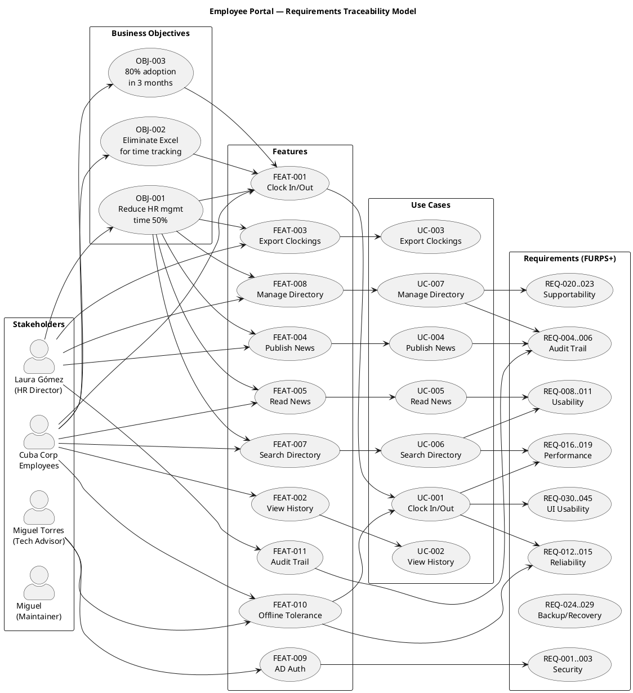

#### SRS — FURPS+ Requirements Coverage

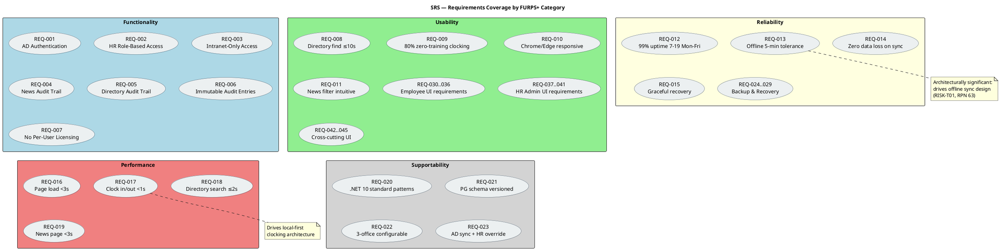

#### SRS — Use Case to Requirement Allocation

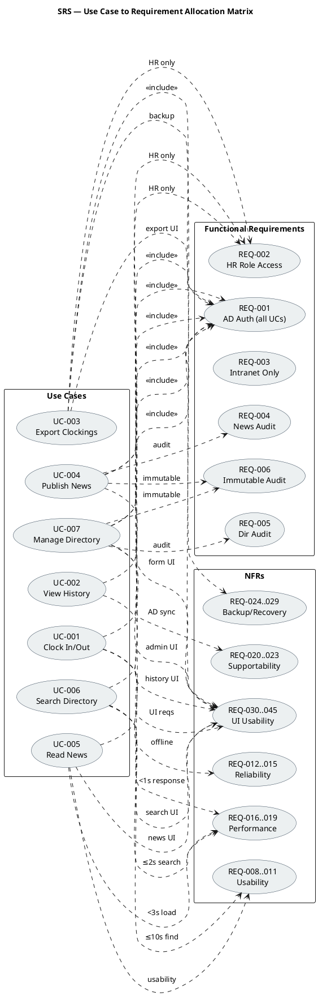

#### SRS — Consolidated Requirements Register

**Functionality — Security**

| ID | Requirement | Threshold | Source | Traces To UCs |
|---|---|---|---|---|
| REQ-001 | All portal access requires Active Directory authentication via LDAP/OAuth2 | 100% of sessions authenticated | CON-004, STK-002, FEAT-009 | All UCs (<<include>>) |
| REQ-002 | HR Administrator role distinguishes from regular Employee role for admin panel access | Role-based access control on UC-003, UC-004, UC-007 | STK-001, FEAT-003/004/008 | UC-003, UC-004, UC-007 |
| REQ-003 | No access from outside the corporate network | Portal bound to internal network only | CON-006, STK-002 | All UCs |

**Functionality — Audit Trail**

| ID | Requirement | Threshold | Source | Traces To UCs |
|---|---|---|---|---|
| REQ-004 | Audit trail records who, what, when for every news publishing action | 100% of publish/edit/delete events logged | Declared NFR (Audit), FEAT-011 | UC-004 |
| REQ-005 | Audit trail records who, what, when for every directory change | 100% of create/update/deactivate events logged | Declared NFR (Audit), FEAT-011 | UC-007 |
| REQ-006 | Audit trail entries are traceable and immutable | Entries cannot be modified or deleted | Declared NFR (Audit) | UC-004, UC-007 |

**Functionality — Licensing**

| ID | Requirement | Threshold | Source | Traces To UCs |
|---|---|---|---|---|
| REQ-007 | No per-user licensing costs (internal open-source or included runtime) | .NET 10 (free), PostgreSQL (free) | CON-001, CON-003 | — |

**Usability — Employee (ACT-001)**

| ID | Requirement | Threshold | Source | Traces To UCs |
|---|---|---|---|---|
| REQ-008 | Employee finds colleague's phone/email in under 10 seconds | ≤10 seconds from directory page load to result display | Acceptance Criteria, FEAT-007 | UC-006 |
| REQ-009 | 80% of employees complete at least one clocking with no prior training | ≥80% first-use success rate without training; ≤3 clicks from home page | Acceptance Criteria, OBJ-003, FEAT-001 | UC-001 |
| REQ-010 | Portal is responsive and accessible from Chrome and Edge | Renders correctly at ≥1280px and ≥768px viewport widths | CON-007 | All UCs |
| REQ-011 | News page shows featured banner and category filter intuitively | 100% of test users identify category filter without instruction | STK-003, FEAT-005 | UC-005 |
| REQ-030 | Clock In/Out button is the primary visual element on the home page | Button top-center, min 200px width, high-contrast; status label visible above | Acceptance Criteria, FEAT-001 | UC-001 |
| REQ-031 | Clocking confirmation is immediately visible | Confirmation within 1 second; includes exact recorded timestamp | Acceptance Criteria, Performance NFR | UC-001 |
| REQ-032 | Clocking history displays current month in chronological order | Date, time, type (In/Out) sorted descending; ≤31 rows × 2 entries | UC-002 flow, FEAT-002 | UC-002 |
| REQ-033 | Directory search provides real-time filtering | Results update within 2 seconds; show name, title, dept, office, email, extension | REQ-008, UC-006 flow | UC-006 |
| REQ-034 | News list sorted by date descending with category filter visible | Most recent first; filter (General, HR, IT, Events) visible; featured banner at top | UC-005 flow, FEAT-005 | UC-005 |
| REQ-035 | Offline status indicator visible when network drops | Banner/icon within 3 seconds; message: "Offline mode — clocking will sync when connection is restored" | UC-001 AF-1, FEAT-010 | UC-001 |
| REQ-036 | Session expiry message is clear and actionable | "Session expired — network connection required"; no ambiguous error codes | UC-001 EF-1 | UC-001 |

**Usability — HR Administrator (ACT-002)**

| ID | Requirement | Threshold | Source | Traces To UCs |
|---|---|---|---|---|
| REQ-037 | HR admin panel accessible from visible navigation element | Admin link visible for HR role only; not visible to regular employees | REQ-002, FEAT-003/004/008 | UC-003, UC-004, UC-007 |
| REQ-038 | CSV export button clearly labeled, produces download within 3 seconds | Button labeled "Export CSV"; progress indicator if >1 second | UC-003 flow, FEAT-003 | UC-003 |
| REQ-039 | News publishing form has all required fields on one screen | Title, body, date (auto-filled), category dropdown, featured checkbox — no wizard | UC-004 flow, FEAT-004 | UC-004 |
| REQ-040 | Directory management panel shows entry list with edit/deactivate actions | Table: name, dept, office columns; Edit/Deactivate per row; Create New at top | UC-007 flow, FEAT-008 | UC-007 |
| REQ-041 | AD sync conflict warning is clear and offers override choice | Warning dialog: "This field is synced with AD. Override will prevent future AD updates." Confirm/Cancel | UC-007 S3 scenario | UC-007 |

**Usability — Cross-Cutting**

| ID | Requirement | Threshold | Source | Traces To UCs |
|---|---|---|---|---|
| REQ-042 | Consistent navigation bar across all pages | Same structure (Home, News, Directory, [Admin]) on every page; active page highlighted | Nielsen Heuristic #4 | All UCs |
| REQ-043 | Error messages use plain language with recovery guidance | No raw exception codes; every error includes suggested action | Nielsen Heuristic #9 | All UCs |
| REQ-044 | All interactive elements have visible focus indicators for keyboard navigation | Focus outline visible on all controls; tab order follows visual order | Nielsen Heuristic #6 | All UCs |
| REQ-045 | Page load provides visual feedback | Loading indicator visible within 500ms; no blank screen >1 second | Performance NFR, Nielsen Heuristic #1 | All UCs |

**Reliability**

| ID | Requirement | Threshold | Source | Traces To UCs |
|---|---|---|---|---|
| REQ-012 | Portal available Monday–Friday 7:00–19:00 | ≥99% uptime during business hours | Declared NFR (Availability) | All UCs |
| REQ-013 | Offline fault tolerance: clock in/out continues during network drops up to 5 minutes | Zero data loss; auto-sync on network restore | Declared NFR (Offline), FEAT-010 | UC-001 |
| REQ-014 | No data loss during offline-to-online sync | 100% of queued clockings synced | Declared NFR (Offline) | UC-001 |
| REQ-015 | System recovers gracefully from brief network interruptions | Portal resumes normal operation without manual restart | STK-002 | All UCs |
| REQ-024 | Nightly full database backup (pg_dump) retained 30 rolling days | Nightly at 01:00 Mon–Fri; RPO ≤ 24h for general portal data | Stakeholder confirmation (Elab Iter 1) | UC-004, UC-005, UC-006, UC-007 |
| REQ-025 | Concurrent user capacity during peak clock-in window (09:00–09:30) | Response time within thresholds at 50 concurrent users | Stakeholder confirmation (Elab Iter 1) | UC-001, All UCs |
| REQ-026 | PostgreSQL WAL archiving for PITR of clocking data | RPO ≤ 15 minutes for clocking data (payroll-critical) | Stakeholder confirmation (Elab Iter 1) | UC-001, UC-002, UC-003 |
| REQ-027 | Backup copies stored off primary Windows Server (NAS or Office 2) | 100% on separate physical hardware; no cloud per CON-005 | Stakeholder confirmation (Elab Iter 1) | UC-001, UC-002, UC-003, UC-004, UC-007 |
| REQ-028 | Monthly test-restore verification of backup integrity | 1 test-restore per month; verified against checksum | Stakeholder confirmation (Elab Iter 1) | UC-001, UC-002, UC-003 |
| REQ-029 | Monthly full backup retained 12 months for payroll audit support | 12 monthly backups retained | Stakeholder confirmation (Elab Iter 1) | UC-001, UC-002, UC-003 |

**Performance**

| ID | Requirement | Threshold | Source | Traces To UCs |
|---|---|---|---|---|
| REQ-016 | Page load time | < 3 seconds | Declared NFR (Performance) | All UCs |
| REQ-017 | Clock in/out operation response time | < 1 second | Declared NFR (Performance) | UC-001 |
| REQ-018 | Directory search response time | ≤ 2 seconds | Acceptance Criteria (10s total; 2s search leaves 8s margin) | UC-006 |
| REQ-019 | News page load with featured banner and category filter | < 3 seconds | Declared NFR (Performance) | UC-005 |

**Supportability**

| ID | Requirement | Threshold | Source | Traces To UCs |
|---|---|---|---|---|
| REQ-020 | Maintainable codebase using standard .NET 10 patterns | Follows .NET conventions; no exotic frameworks | CON-001, STK-004 | — |
| REQ-021 | PostgreSQL schema is documented and version-controlled | Schema migrations tracked | CON-003, STK-004 | — |
| REQ-022 | Application configurable for 3-office deployment without code changes | Office list is data-driven, not hardcoded | STK-003 | UC-006, UC-007 |
| REQ-023 | Employee data synchronized with AD; manual override available for HR | AD sync + HR admin panel coexist | CON-004, STK-001 | UC-007 |

**Design Constraints**

| ID | Constraint | Detail | Source |
|---|---|---|---|
| DC-001 | Backend framework | .NET 10 with REST API | CON-001 |
| DC-002 | Frontend technology | Razor Pages (no SPA) | CON-002 |
| DC-003 | Database | PostgreSQL | CON-003 |
| DC-004 | Authentication | Active Directory via LDAP/OAuth2 | CON-004 |
| DC-005 | Hosting | Internal Windows Server, no cloud | CON-005 |
| DC-006 | Network access | Corporate intranet only, no external access | CON-006 |
| DC-007 | Browser support | Chrome and Edge (current versions) only | CON-007 |

**Interfaces**

| ID | Interface | Type | Direction | Detail |
|---|---|---|---|---|
| INT-001 | Active Directory | External system | Portal → AD | LDAP/OAuth2 for authentication; employee data sync (name, email, department) |
| INT-002 | Browser (Chrome/Edge) | User agent | Portal → Browser | HTTP/HTTPS responses rendered as Razor Pages |
| INT-003 | PostgreSQL | Database | Portal → DB | Standard ADO.NET / EF Core connection |

**Applicable Standards**

| Standard | Applicability |
|---|---|
| LDAPv3 | AD authentication protocol |
| OAuth2 | Alternative AD authentication protocol (decision pending — Stability: Low) |
| CSV (RFC 4180) | Clocking export format |
| HTTP/HTTPS | Web transport |
| HTML5 / CSS3 | Razor Pages rendering |

#### SRS — Consolidated Use Case Summary

| UC ID | Name | Actor | MoSCoW | Stability | Arch. Sig.? | Key Requirements | Scenarios |
|---|---|---|---|---|---|---|---|
| UC-001 | Clock In/Out | Employee | Must | Low | **Yes** — offline sync | REQ-001, 003, 009, 013, 014, 015, 016, 017, 025, 030, 031, 035, 036 | S1: Normal clock in; S2: Offline clock in; S3: Sync conflict on restore |
| UC-002 | View Clocking History | Employee | Must | High | No | REQ-001, 003, 016, 032, 042 | S1: View current month; S2: Empty month (no clockings yet) |
| UC-003 | Review and Export Clockings | HR Admin | Must | Medium | No | REQ-001, 002, 003, 016, 037, 038 | S1: View all clockings; S2: Export CSV; S3: Filter by employee |
| UC-004 | Publish News | HR Admin | Must | Medium | No | REQ-001, 002, 003, 004, 006, 016, 019, 037, 039 | S1: Publish new news; S2: Edit existing; S3: Mark as featured |
| UC-005 | Read News | Employee | Must | High | No | REQ-001, 003, 011, 016, 019, 034, 042 | S1: Browse all news; S2: Filter by category; S3: Read featured news |
| UC-006 | Search Directory | Employee | Must | High | No | REQ-001, 003, 008, 016, 018, 022, 033, 042 | S1: Search by name; S2: Filter by department; S3: Filter by office |
| UC-007 | Manage Directory | HR Admin | Must | Medium | No | REQ-001, 002, 003, 005, 006, 022, 023, 037, 040, 041 | S1: Create entry; S2: Update local field; S3: Override AD-synced field; S4: Deactivate employee |

#### SRS — Full Stakeholder-to-Requirement Traceability

| Stakeholder | Need/Constraint | Feature | Use Case | Requirements |
|---|---|---|---|---|
| STK-001 (Laura Gómez, HR Director) | Reduce HR management time by 50% | FEAT-003, FEAT-004, FEAT-006, FEAT-008, FEAT-011 | UC-003, UC-004, UC-007 | REQ-002, 004, 005, 006, 023, 037, 038, 039, 040, 041 |
| STK-002 (Miguel Torres, Tech Advisor) | AD authentication; offline fault tolerance; internal hosting | FEAT-009, FEAT-010 | (cross-cutting <<include>>) | REQ-001, 003, 012, 013, 014, 015, DC-001..007, INT-001..003 |
| STK-003 (Cuba Corp Employees) | Easy time tracking; news access; directory lookup; zero-training adoption | FEAT-001, FEAT-002, FEAT-005, FEAT-007, FEAT-010 | UC-001, UC-002, UC-005, UC-006 | REQ-008, 009, 010, 011, 016, 017, 018, 030..036, 042..045 |
| STK-004 (Miguel, Maintainer) | Maintainable codebase; documented schema | (supportability) | — | REQ-020, 021, DC-001, DC-003 |

#### SRS — Acceptance Criteria to Requirement Mapping

| Acceptance Criterion | Traces To | Verification Method |
|---|---|---|
| Employee can clock in/out without HR/dev help | UC-001, REQ-009, REQ-030, REQ-031 | Usability test: 5 untrained employees, ≤30s task completion |
| HR Administrator can publish news without technical assistance | UC-004, REQ-039 | Usability test: HR publishes news item in ≤2 minutes |
| Any employee finds colleague's phone/email in under 10 seconds | UC-006, REQ-008, REQ-018, REQ-033 | Timed task: home page → directory → search → result ≤10s |
| 80% of employees complete at least one clocking with no prior training | UC-001, REQ-009 | Post-launch metric: 80% of 200 employees clock within first week |
| System works temporarily offline (5-min network drop, no data loss) | UC-001 AF-1, REQ-013, REQ-014 | Integration test: disconnect network, clock in/out, reconnect, verify sync |
