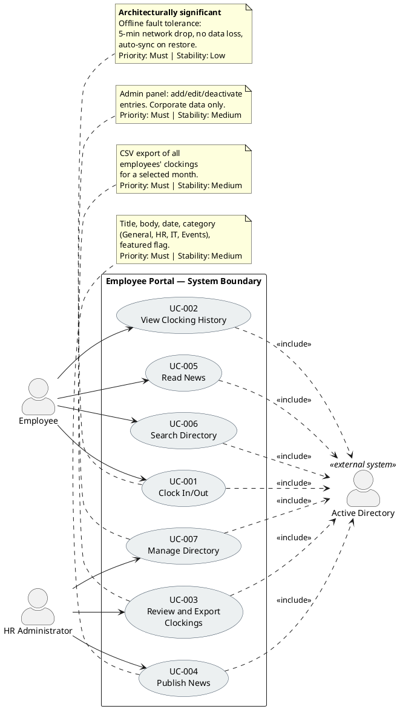
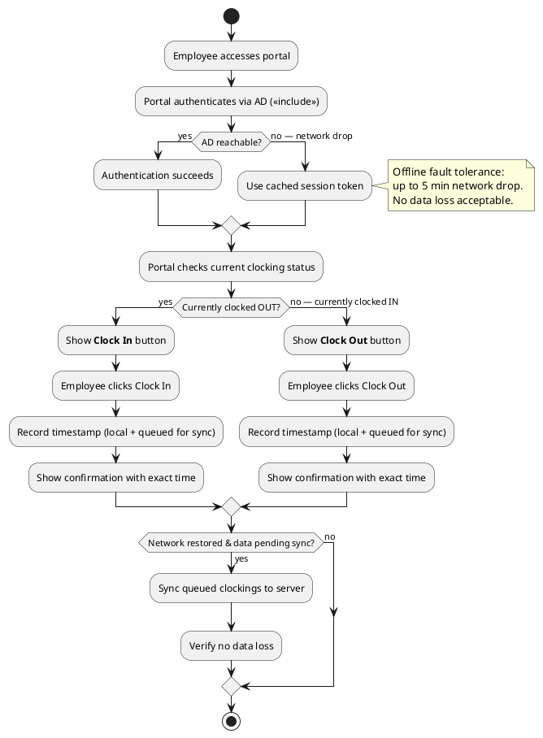

## Document Control

| Field | Value |
|---|---|
| Phase | Inception |
| Status | Draft |
| Iteration | 2 (Cycle 1) |
| Milestone Target | End of Inception (LCO) |
| Author | System Analyst |

### Iteration 2 Changes

- **F1 (Major) — Resolved:** `[DERIVED]` markers removed from all use cases. Stakeholder confirmation (S1, 2026-07-07) verified all 4 declared processes are correct. All UCs trace verbatim to declared scope — no derivation markers needed.
- **F2 (Major) — Resolved:** Same as F1 — UC-006 (Search Directory) and all other UCs carry no `[DERIVED]` markers. All are literally declared in stakeholder scope.
- **F3 (Major) — Resolved:** AD Authentication is NOT a standalone use case. It is a cross-cutting mechanism modeled as an external system actor (ACT-003) with `<<include>>` from all UCs. Requirements are in Supplementary Specification (REQ-001 through REQ-003).

## Use-Case Diagram

**System boundary:** The Employee Portal encompasses clock in/out, clocking history, HR clocking review/export, news publishing, news reading, directory search, and directory management. Active Directory is an external system on the boundary — all use cases include AD authentication as a cross-cutting mechanism (`<<include>>`), not as a standalone use case.

**Scope guard notes:**
- AD authentication is a cross-cutting mechanism included by all UCs — NOT a standalone use case (per Scope Guard Rule 7).
- No UCs inferred beyond declared scope. All 7 UCs trace verbatim to declared stakeholder requirements.
- No `[SCOPE_QUESTION]` or `[DERIVED]` markers needed — all UCs are literally declared.
- Stakeholder confirmation (S1, 2026-07-07): all 4 declared processes confirmed correct.

## Actors

| ID | Actor | Type | Description | Associated UCs |
|---|---|---|---|---|
| ACT-001 | Employee | Human (primary) | 200 corporate users across 3 offices. Uses AD credentials to access portal. Clocks in/out, views own history, reads news, searches directory. | UC-001, UC-002, UC-005, UC-006 |
| ACT-002 | HR Administrator | Human (primary) | HR staff member with elevated permissions. Publishes news, manages directory entries, reviews all clockings, exports CSV reports. | UC-003, UC-004, UC-007 |
| ACT-003 | Active Directory | External system | Corporate identity provider. Authenticates all users via LDAP/OAuth2. Provides employee data for directory synchronization. Cross-cutting mechanism — not a use case actor in the traditional sense; included by all UCs. | <<include>> from all UCs |

## Use-Case Survey

| ID | Use Case | Primary Actor | Trigger | Outcome (Value) | MoSCoW | Stability | Architecturally Significant? | Stakeholder Source |
|---|---|---|---|---|---|---|---|---|
| UC-001 | Clock In/Out | Employee | Employee accesses portal to record work time | Timestamp recorded with confirmation; works offline | Must | Low | **Yes** — offline fault tolerance drives architectural decisions | "Employee logs in with corporate credentials (Active Directory). Main screen shows Clock In or Clock Out button depending on current status. System records exact time and shows confirmation." |
| UC-002 | View Clocking History | Employee | Employee wants to review own clockings | Current month clocking history displayed | Must | High | No | "Employee can view their clocking history for the current month." |
| UC-003 | Review and Export Clockings | HR Administrator | HR needs monthly clocking report | All employees' clockings viewable; CSV export generated | Must | Medium | No | "HR can view all employees' clockings and export a monthly report in CSV." |
| UC-004 | Publish News | HR Administrator | HR has announcement to distribute | News item published with title, body, date, category, featured flag | Must | Medium | No | "HR publishes internal news and announcements (title, body, date, category)." |
| UC-005 | Read News | Employee | Employee opens portal main page | News list displayed sorted by date with category filter and featured banner | Must | High | No | "Employees see news on main page sorted by date, can filter by category (General, HR, IT, Events). Featured news appears with a banner at the top. Read-only for employees — no comments or reactions." |
| UC-006 | Search Directory | Employee | Employee needs colleague's contact info | Matching directory entries displayed with name, title, department, office, email, extension | Must | High | No | "Employee searches for colleagues by name, department, or office. Each entry shows: name, job title, department, office, email, and extension phone number." |
| UC-007 | Manage Directory | HR Administrator | HR needs to update employee directory data | Directory entry created/updated/deactivated via admin panel | Must | Medium | No | "HR keeps data up to date from an administration panel. Directory shows corporate data only — no private personal information." |

**ATM Test verification:** All 7 use cases pass — each has (a) a primary actor who initiates, (b) a clear trigger, and (c) a measurable outcome delivering observable value.

**Scope guard notes:**
- AD authentication is a cross-cutting mechanism included by all UCs — NOT a standalone use case (per Rule 7).
- No UCs inferred beyond declared scope. All 7 UCs trace verbatim to declared stakeholder requirements.
- No `[SCOPE_QUESTION]` or `[DERIVED]` markers needed — all UCs are literally declared.
- Stakeholder confirmation (S1, 2026-07-07): all 4 declared processes confirmed correct.

## Use-Case Specifications

### UC-001: Clock In/Out ⭐ Architecturally Significant

| Field | Value |
|---|---|
| Primary Actor | Employee (ACT-001) |
| Trigger | Employee accesses portal to record work time start or end |
| Precondition | Employee is authenticated via AD (or has valid cached session for offline mode) |
| Postcondition | Clocking timestamp is recorded and confirmed; if offline, timestamp is queued for sync |
| Priority | Must |
| Stability | Low — offline fault tolerance mechanism is primary technical risk |
| Includes | AD Authentication (cross-cutting) |

**Main Flow:**
1. Employee navigates to portal home page
2. System authenticates employee via Active Directory (`<<include>>`)
3. System checks employee's current clocking status
4. System displays "Clock In" button (if clocked out) or "Clock Out" button (if clocked in)
5. Employee clicks the displayed button
6. System records exact timestamp
7. System displays confirmation with recorded time

**Alternative Flows:**
- **AF-1: Network drop (offline mode):** If AD or server is unreachable (network drop ≤5 min), system uses cached session, records timestamp locally, queues for sync. On network restore, syncs queued data with zero data loss.
- **AF-2: Already clocked in/out:** If employee attempts to clock in when already clocked in, system shows current status and does not create duplicate entry.

**Activity Diagram (UC-001 Flow):**

### UC-002: View Clocking History

| Field | Value |
|---|---|
| Primary Actor | Employee (ACT-001) |
| Trigger | Employee wants to review own clockings for current month |
| Precondition | Employee is authenticated via AD |
| Postcondition | Current month clocking history is displayed |
| Priority | Must |
| Stability | High |

**Main Flow:**
1. Employee navigates to clocking history view
2. System authenticates employee via AD (`<<include>>`)
3. System retrieves employee's clocking records for the current month
4. System displays history list (date, clock-in time, clock-out time)

**Alternative Flows:**
- **AF-1: No clockings this month:** System displays empty state message.

### UC-003: Review and Export Clockings

| Field | Value |
|---|---|
| Primary Actor | HR Administrator (ACT-002) |
| Trigger | HR needs to review or export monthly clocking data |
| Precondition | HR Administrator is authenticated via AD with HR role |
| Postcondition | Clocking data displayed and/or CSV file generated |
| Priority | Must |
| Stability | Medium |

**Main Flow:**
1. HR Administrator navigates to clocking review panel
2. System authenticates via AD (`<<include>>`)
3. System displays all employees' clockings for the current month
4. HR Administrator optionally selects a different month
5. HR Administrator clicks "Export CSV"
6. System generates CSV file with all clocking records for selected month
7. System downloads CSV file to HR Administrator's browser

**Alternative Flows:**
- **AF-1: No clockings for selected month:** System displays empty state.

### UC-004: Publish News

| Field | Value |
|---|---|
| Primary Actor | HR Administrator (ACT-002) |
| Trigger | HR has an announcement to publish |
| Precondition | HR Administrator is authenticated via AD with HR role |
| Postcondition | News item is published and visible to employees; audit trail entry created |
| Priority | Must |
| Stability | Medium |

**Main Flow:**
1. HR Administrator navigates to news management panel
2. System authenticates via AD (`<<include>>`)
3. HR Administrator enters news title, body, selects category (General, HR, IT, Events), and optionally marks as featured
4. HR Administrator clicks "Publish"
5. System saves news item with current date
6. System creates audit trail entry (who, what, when)
7. System confirms publication

**Alternative Flows:**
- **AF-1: Edit existing news:** HR selects existing item, modifies fields, saves. Audit trail updated.
- **AF-2: Delete news:** HR selects item, confirms deletion. Audit trail updated.

### UC-005: Read News

| Field | Value |
|---|---|
| Primary Actor | Employee (ACT-001) |
| Trigger | Employee opens portal main page |
| Precondition | Employee is authenticated via AD |
| Postcondition | News list displayed with filtering and featured banner |
| Priority | Must |
| Stability | High |

**Main Flow:**
1. Employee navigates to portal home page
2. System authenticates via AD (`<<include>>`)
3. System displays featured news banner at top (if any featured items exist)
4. System displays news list sorted by date (most recent first)
5. Employee optionally selects a category filter (General, HR, IT, Events)
6. System filters news list by selected category

**Alternative Flows:**
- **AF-1: No news items:** System displays empty state message.
- **AF-2: No featured news:** Banner section is hidden; news list starts at top.

### UC-006: Search Directory

| Field | Value |
|---|---|
| Primary Actor | Employee (ACT-001) |
| Trigger | Employee needs to find a colleague's contact information |
| Precondition | Employee is authenticated via AD |
| Postcondition | Matching directory entries displayed with corporate contact data |
| Priority | Must |
| Stability | High |

**Main Flow:**
1. Employee navigates to directory page
2. System authenticates via AD (`<<include>>`)
3. Employee enters search criteria (name, department, or office)
4. System displays matching entries showing: name, job title, department, office, email, extension phone number
5. Employee reviews results

**Alternative Flows:**
- **AF-1: No matches:** System displays "No results found" message.
- **AF-2: Browse all:** Employee leaves search empty; system shows all entries (paginated).

### UC-007: Manage Directory

| Field | Value |
|---|---|
| Primary Actor | HR Administrator (ACT-002) |
| Trigger | HR needs to update employee directory data |
| Precondition | HR Administrator is authenticated via AD with HR role |
| Postcondition | Directory entry created/updated/deactivated; audit trail entry created |
| Priority | Must |
| Stability | Medium |

**Main Flow:**
1. HR Administrator navigates to directory admin panel
2. System authenticates via AD (`<<include>>`)
3. HR Administrator selects an employee entry to edit (or creates new)
4. HR Administrator updates fields: name, job title, department, office, email, extension phone number
5. HR Administrator saves changes
6. System creates audit trail entry (who, what, when)
7. System confirms update

**Alternative Flows:**
- **AF-1: Deactivate entry:** HR marks entry as inactive; entry hidden from directory search but retained in database.
- **AF-2: AD sync conflict:** If AD-synchronized data conflicts with manual edit, system flags conflict for HR resolution.

## Traceability

| Element | Traces From | Link Type | Traces To |
|---|---|---|---|
| UC-001 | FEAT-001, FEAT-010 | Refines | ACL-001 (future), TC-001 (future) |
| UC-002 | FEAT-002 | Refines | ACL-001 (future), TC-002 (future) |
| UC-003 | FEAT-003 | Refines | ACL-002 (future), TC-003 (future) |
| UC-004 | FEAT-004, FEAT-006 | Refines | ACL-003 (future), TC-004 (future) |
| UC-005 | FEAT-005 | Refines | ACL-003 (future), TC-005 (future) |
| UC-006 | FEAT-007 | Refines | ACL-004 (future), TC-006 (future) |
| UC-007 | FEAT-008 | Refines | ACL-004 (future), TC-007 (future) |
| ACT-001 | STK-003 | — | UC-001, UC-002, UC-005, UC-006 |
| ACT-002 | STK-001 | — | UC-003, UC-004, UC-007 |
| ACT-003 | STK-002, CON-004 | — | <<include>> from all UCs |