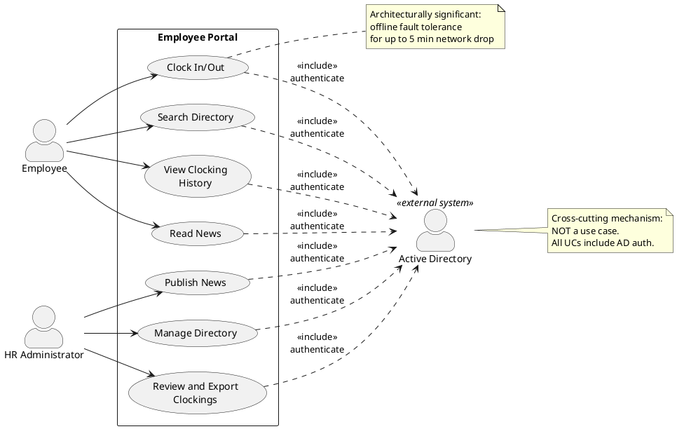

## Document Control
| Field | Value |
|---|---|
| Phase | Elaboration |
| Status | Draft |
| Iteration | 3 (Cycle 1) |
| Milestone Target | End of Elaboration |
| Author | System Analyst |

### Elaboration Iteration 3 Changes

- **Vision reviewed against SAD baseline and Risk List.** All features, stakeholders, and constraints remain valid — no findings or CRs target the Vision.
- **AD authentication method (LDAP vs OAuth2) remains undecided** — Stability: Low. IAuthProvider isolation pattern (SAD) decouples this decision; spike deferred to Construction. Vision constraints unchanged.
- **No scope changes.** All 11 features (FEAT-001 through FEAT-011), 4 stakeholders (STK-001 through STK-004), and 7 constraints (CON-001 through CON-007) preserved from prior baseline.

### Elaboration Iteration 1 Changes

- **F6 (Minor) — Resolved:** Document Control updated from Inception to Elaboration phase. Iteration marker corrected.
- Phase transition: Inception LCO approved (GO verdict, 2026-07-07). Vision content preserved from Inception baseline — no findings or CRs target Vision features, stakeholders, or constraints in this iteration.
## Problem Statement

Cuba Corp (200 employees, 3 offices) manages time tracking through shared Excel sheets, distributes internal communications via mass emails, and maintains an outdated PDF phone directory. This fragmentation causes:

- **Time tracking errors:** Excel sheets are manually consolidated, prone to data loss and version conflicts. HR spends significant time reconciling records.
- **Communication gaps:** Mass emails are easily ignored; employees miss important announcements. No categorization or prioritization exists.
- **Directory staleness:** The PDF phone directory is updated infrequently; colleagues cannot find current contact information quickly.

**Root cause:** No centralized, browser-accessible platform exists for these three core employee services.

**Affected stakeholders:**
- HR Director (Laura Gómez) — bears the operational cost of manual reconciliation
- 200 Employees — lose productivity searching for information and tracking time
- IT/Maintenance (Miguel Torres) — must support fragmented tools

**Success criteria (measurable):**
1. Reduce HR management time by 50% for time tracking, news distribution, and directory updates
2. Eliminate 100% of Excel usage for time tracking (replaced by portal clock feature)
3. Achieve 80% employee adoption (active logins + clock usage) within 3 months of launch
4. Any employee finds a colleague's phone/email in under 10 seconds
5. System works temporarily offline: 5-minute network drop → no data loss, auto-sync on restore

## Product Position Statement

**For** Cuba Corp employees and HR staff
**Who** need centralized time tracking, news distribution, and directory lookup
**The Employee Portal** is an internal web application
**That** replaces fragmented Excel sheets, mass emails, and PDF directories with a single browser-accessible platform
**Unlike** the current manual tools (Excel, email, PDF)
**Our product** provides real-time clock in/out, categorized news with featured banners, and searchable directory — all authenticated via Active Directory and accessible from the corporate intranet.

## Stakeholder Summary

| ID | Stakeholder | Role | Influence | Key Needs |
|---|---|---|---|---|
| STK-001 | Laura Gómez | HR Director — Project Sponsor | High | Reduce HR management time by 50%; eliminate Excel; centralized news distribution; audit trail for compliance |
| STK-002 | Miguel Torres | Technical Advisor | High | AD integration via LDAP/OAuth2; internal Windows Server hosting; .NET 10 + PostgreSQL; no external access |
| STK-003 | Cuba Corp Employees | End Users (200, 3 offices) | Medium | Simple clock in/out; find colleagues quickly; read news without email overload; works during brief network outages |
| STK-004 | Miguel (Potential maintainer) | Maintenance | Medium | Maintainable codebase; standard technology stack; clear documentation |

## Product Overview

The Employee Portal is a single internal web application with three functional areas and one cross-cutting authentication mechanism:

1. **Time Tracking** — Clock in/out with offline fault tolerance, personal history view, and HR reporting with CSV export
2. **News** — HR-published announcements with category filtering and featured banners; read-only for employees
3. **Directory** — Searchable colleague directory with HR administration panel; corporate data only
4. **Authentication** — Active Directory integration (cross-cutting mechanism, not a standalone use case)

## Features

| ID | Feature | Priority | MoSCoW | Stability | Traces To |
|---|---|---|---|---|---|
| FEAT-001 | Clock In/Out with status-aware button and time recording | High | Must | High | STK-003, OBJ-001, OBJ-002 |
| FEAT-002 | View personal clocking history (current month) | High | Must | High | STK-003, OBJ-002 |
| FEAT-003 | HR review all clockings and export CSV monthly report | High | Must | Medium | STK-001, OBJ-001 |
| FEAT-004 | HR publish news (title, body, date, category, featured flag) | Medium | Must | Medium | STK-001, OBJ-001 |
| FEAT-005 | Employee browse news sorted by date with category filter | Medium | Must | High | STK-003, OBJ-001 |
| FEAT-006 | Featured news banner at top of news page | Medium | Should | Medium | STK-001 |
| FEAT-007 | Employee search directory by name, department, or office | Medium | Must | High | STK-003, OBJ-001 |
| FEAT-008 | HR manage directory entries via admin panel | Medium | Must | Medium | STK-001, OBJ-001 |
| FEAT-009 | Active Directory authentication (LDAP/OAuth2) | High | Must | Low | STK-002, STK-003 |
| FEAT-010 | Offline fault tolerance for clock in/out (5-min network drop) | Medium | Must | Low | STK-003, STK-002 |
| FEAT-011 | Audit trail for news publishing and directory changes | Medium | Should | Medium | STK-001 |

**Stability notes:**
- **FEAT-009 (AD Auth):** Stability Low — AD integration method (LDAP vs OAuth2) may change based on infrastructure decisions in Elaboration.
- **FEAT-010 (Offline):** Stability Low — Offline sync mechanism is the primary technical risk; implementation approach may evolve.

## Assumptions and Dependencies

| ID | Assumption / Dependency | Impact if Wrong |
|---|---|---|
| ASM-001 | Active Directory infrastructure is operational and accessible from the portal server | Authentication fails; portal unusable |
| ASM-002 | Employee data in AD is current (name, email, department) | Directory shows stale data; HR must manually correct |
| ASM-003 | Corporate network can sustain brief (≤5 min) outages | Offline tolerance requirement may need revision |
| ASM-004 | Windows Server has .NET 10 runtime support | Hosting environment incompatible |
| DEP-001 | PostgreSQL database available on internal server | Data persistence unavailable |
| DEP-002 | Chrome and Edge are the standard browsers across all 3 offices | Browser compatibility issues |

## Constraints

| ID | Constraint | Type | Source |
|---|---|---|---|
| CON-001 | Backend: .NET 10 with REST API | Technical | STK-002 |
| CON-002 | Frontend: Razor Pages (intranet, no SPA) | Technical | STK-002 |
| CON-003 | Database: PostgreSQL | Technical | STK-002 |
| CON-004 | Authentication via Active Directory (LDAP/OAuth2) | Architectural | STK-002 |
| CON-005 | Hosting on internal Windows Server (no cloud) | Operational | STK-002 |
| CON-006 | No access from outside corporate network | Operational | STK-002 |
| CON-007 | Compatible with Chrome and Edge only | Technical | STK-002 |
| CON-008 | Page load under 3 seconds; clock in/out under 1 second | Performance | Declared NFR |
| CON-009 | Available Mon–Fri 7:00–19:00 with fault tolerance | Availability | Declared NFR |

## Other Product Requirements

- **Audit trail:** News publishing and directory changes must be traceable (who, what, when). See Supplementary Specification for details.
- **Offline fault tolerance:** Clock in/out must function during network drops up to 5 minutes with zero data loss and automatic sync on restore. This is the primary technical risk for Elaboration.
- **Data privacy:** Directory shows corporate data only (name, title, department, office, email, extension). No private personal information.

## Traceability

| Element | Traces From | Link Type | Traces To |
|---|---|---|---|
| FEAT-001 | STK-003, OBJ-001, OBJ-002 | Refines | UC-001 |
| FEAT-002 | STK-003, OBJ-002 | Refines | UC-002 |
| FEAT-003 | STK-001, OBJ-001 | Refines | UC-003 |
| FEAT-004 | STK-001, OBJ-001 | Refines | UC-004 |
| FEAT-005 | STK-003, OBJ-001 | Refines | UC-005 |
| FEAT-006 | STK-001 | Refines | UC-004 |
| FEAT-007 | STK-003, OBJ-001 | Refines | UC-006 |
| FEAT-008 | STK-001, OBJ-001 | Refines | UC-007 |
| FEAT-009 | STK-002, STK-003 | Refines | Supplementary Spec (Auth) |
| FEAT-010 | STK-003, STK-002 | Refines | UC-001, Supplementary Spec (Reliability) |
| FEAT-011 | STK-001 | Refines | Supplementary Spec (Functionality) |
| STK-001 | Laura Gómez (HR Director) | — | FEAT-003, FEAT-004, FEAT-006, FEAT-008, FEAT-011 |
| STK-002 | Miguel Torres (Technical Advisor) | — | FEAT-009, FEAT-010, CON-001 through CON-007 |
| STK-003 | Cuba Corp Employees | — | FEAT-001, FEAT-002, FEAT-005, FEAT-007, FEAT-010 |
| STK-004 | Miguel (Maintainer) | — | CON-001, CON-002, CON-003 |