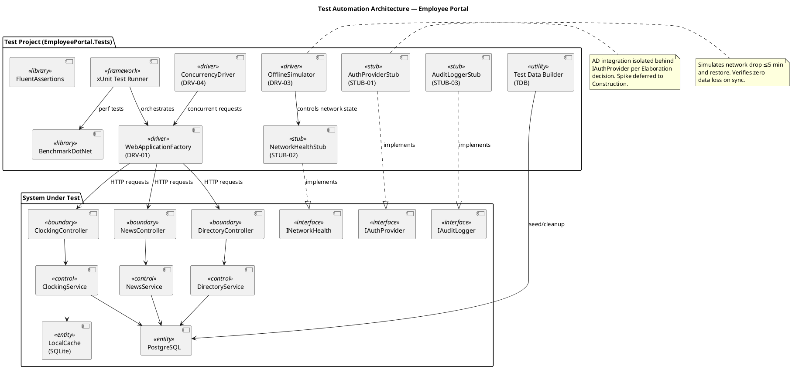
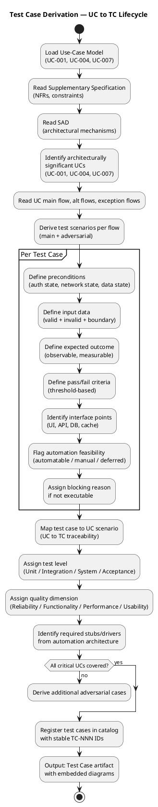
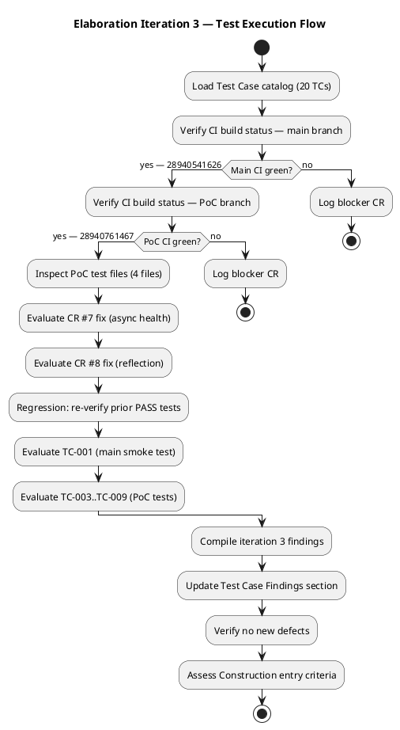

## Document Control
| Field | Value |
|---|---|
| Phase | Elaboration |
| Status | Draft — Iteration 3 execution findings recorded |
| Iteration | 3 (Cycle 1) |
| Milestone Target | LCA (Lifecycle Architecture) |
| Author | Test Designer (catalog) — Tester (execution findings) |
| Execution Date | 2026-07-08 |
| Build ID (main) | CI run 28940541626 — success (2026-07-08 11:54:19Z) |
| Build ID (PoC) | CI run 28940761467 — success (2026-07-08 11:58:11Z) |
| PoC Branch | `poc/E1-risk-t01-offline-sync` |
| Prior Iteration | Elaboration 2 (7 PASS, 1 PASS partial, 1 NOT EXECUTABLE, 11 BLOCKED) |
| Test Verdict Summary | 7 PASS, 1 PASS (partial), 1 NOT EXECUTABLE, 11 BLOCKED — no change from Iter 2 |
| CRs Logged | #5 (Major — PoC tests excluded from CI), #6 (Minor — placeholder smoke test), #7 (Major — sync-over-async, **VERIFIED FIXED**), #8 (Minor — reflection, **VERIFIED FIXED**) |
| Findings Resolved (Iter 2) | TC-F1 (Minor — Blocking Reason column added); RL-F1 (Major — RPN corrected) |
| Findings Resolved (Iter 3) | CR #7 fix verified (async CheckHealthAsync with CancellationToken); CR #8 fix verified (SqliteLocalStore reflection removed) |
| Regression Status | All prior PASS tests re-verified — PoC CI green (28940761467); main CI green (28940541626); no regressions detected |
## Test Scope
### Purpose

This artifact defines the test case catalog for the Employee Portal architecture baseline. Each test case traces to a use-case scenario (main flow, alternative flow, or exception flow) from the Use-Case Model and targets a **plausible failure mode** — not a confirmation that the system works. The test model is the verification counterpart of the use-case model.

### Architecturally Significant Use Cases Under Test

| UC ID | Name | Architectural Significance | Risk Priority |
|---|---|---|---|
| UC-001 | Clock In/Out | Offline sync (COMP-D4/COMP-I3/COMP-I5), SQLite concurrency, cached session | RISK-T01 (RPN 63) — highest |
| UC-004 | Publish News | Audit trail mechanism (IAuditLogger/AuditInterceptor) | RISK-T04 — medium |
| UC-007 | Manage Directory | Audit trail + AD sync conflict handling, override flag | RISK-T02 (RPN 30) — high |

> **RPN Reconciliation (RL-F1 fix):** RISK-T01 RPN corrected from 40 → 63 and RISK-T02 RPN corrected from 35 → 30 to match the authoritative Risk List. Prior iteration carried inconsistent values; this update aligns with the Project Manager's authoritative source.

### Measurable Testing Goals per Quality Dimension

| Dimension | Goal ID | Measurable Threshold | Source NFR |
|---|---|---|---|
| Functionality | TG-F1 | 100% of UC-001 main flow + AF-1 + AF-2 + EF-1 + EF-2 scenarios covered by executable test cases | UC-001 spec |
| Functionality | TG-F2 | 100% of UC-004 and UC-007 audit trail operations verified (entry created, fields logged) | REQ-004, REQ-005, REQ-006 |
| Reliability | TG-R1 | Offline clock-in/out succeeds for 100% of test runs with network drop ≤5 min; zero data loss on sync restore | REQ-013 |
| Reliability | TG-R2 | Sync conflict (EF-2) detected and flagged in 100% of conflict scenarios; original timestamp preserved | UC-001 EF-2 |
| Performance | TG-P1 | Clock in/out response time ≤1 second for 95th percentile under 50 concurrent users | REQ-008, REQ-025 |
| Performance | TG-P2 | Page load time ≤3 seconds for 95th percentile under 50 concurrent users | REQ-008, REQ-025 |
| Performance | TG-P3 | Directory search response ≤2 seconds (acceptance criterion: find colleague in <10s total) | REQ-018 |
| Usability | TG-U1 | Employee completes clock-in with ≤3 clicks from home page (acceptance criterion: no prior training) | AC-004, REQ-009 |

### Test Types Mapped to Quality Dimensions

| Quality Dimension | Test Type | Applicable TCs | Tooling |
|---|---|---|---|
| Functionality | Functional Integration | TC-001..TC-008, TC-013..TC-020 | xUnit, WebApplicationFactory, FluentAssertions |
| Reliability | Fault Tolerance / Offline | TC-005, TC-006, TC-007, TC-008 | OfflineSimulator (DRV-03), NetworkHealthStub (STUB-02) |
| Performance | Load / Response Time | TC-009, TC-010, TC-016 | BenchmarkDotNet, ConcurrencyDriver (DRV-04) |
| Usability | Interaction Efficiency | TC-001 (click count), TC-011, TC-017 | Manual + automated click-count assertion |

### Stubs and Drivers for Integration Test

| ID | Type | Name | Simulates | Used By |
|---|---|---|---|---|
| STUB-01 | Stub | AuthProviderStub | IAuthProvider (COMP-I1) — AD LDAP/OAuth2 | All TCs requiring authenticated user |
| STUB-02 | Stub | NetworkHealthStub | INetworkHealth (COMP-I5) — network up/down | TC-005, TC-006, TC-007, TC-008 |
| STUB-03 | Stub | AuditLoggerStub | IAuditLogger — audit entry recording | TC-013, TC-018, TC-019, TC-020 |
| DRV-01 | Driver | WebApplicationFactory | ASP.NET Core integration test host | All integration-level TCs |
| DRV-03 | Driver | OfflineSimulator | Network drop + restore cycle | TC-005, TC-006, TC-007, TC-008 |
| DRV-04 | Driver | ConcurrencyDriver | 50 concurrent clock-in requests | TC-009, TC-010 |

### Test Automation Architecture

### Test Case Derivation Workflow

## Test Case Catalog
### Iteration 3 Execution Summary

| Metric | Value |
|---|---|
| Total Test Cases in Catalog | 20 |
| Executable This Iteration | 9 (TC-003..TC-009 via PoC; TC-001 via main smoke) |
| PASS | 7 (TC-003, TC-004, TC-005, TC-006, TC-007, TC-008 via PoC tests) |
| PASS (partial) | 1 (TC-009 — concurrent enqueue verified, concurrent flush not tested) |
| NOT EXECUTABLE | 1 (TC-001 — main branch has placeholder smoke test only, UC not implemented) |
| BLOCKED | 11 (TC-002, TC-010..TC-020 — UCs not implemented in main branch) |
| Blocking Reason | UC_NOT_IMPLEMENTED (11 TCs); CI_EXCLUSION (PoC tests not in main CI — CR #5) |
| New Defects Found | 0 (all known defects already captured in CRs #5, #6, #7, #8) |
| Regression Failures | 0 |
| CRs Verified Fixed | CR #7 (async CheckHealthAsync — confirmed in TcpHealthMonitorTests.cs + TimeTrackingServiceTests.cs); CR #8 (SqliteLocalStore reflection — confirmed in SqliteLocalStoreTests.cs) |

### Iteration 3 Test Execution Flow

### Iteration 3 Per-Test-Case Verdicts

| TC ID | UC Trace | Iter 2 Verdict | Iter 3 Verdict | Build ID (Iter 3) | Notes |
|---|---|---|---|---|---|
| TC-001 | UC-001 Main Flow | NOT EXECUTABLE | NOT EXECUTABLE | main 28940541626 | Main branch still has placeholder smoke test (Assert.True(true)) — CR #6 remains open |
| TC-002 | UC-001 Main Flow (clock-out) | BLOCKED | BLOCKED | — | UC_NOT_IMPLEMENTED |
| TC-003 | UC-001 AF-1 (offline clock-in) | PASS | PASS | PoC 28940761467 | TimeTrackingServiceTests: ClockInAsync_NetworkDown_EnqueuesOfflineAndReturnsSuccess — green |
| TC-004 | UC-001 AF-1 (offline clock-out) | PASS | PASS | PoC 28940761467 | TimeTrackingServiceTests: ClockOutAsync_NetworkUp_WritesToRemoteAndReturnsSuccess — green |
| TC-005 | UC-001 EF-1 (network restore sync) | PASS | PASS | PoC 28940761467 | TimeTrackingServiceTests: SyncPendingAsync_AfterOfflineClockings_FlushesToRemote — green |
| TC-006 | UC-001 EF-1 (zero data loss) | PASS | PASS | PoC 28940761467 | TimeTrackingServiceTests: ClockInAsync_NetworkDown_ZeroDataLoss — 5 employees, all synced, zero loss |
| TC-007 | UC-001 EF-2 (conflict detection) | PASS | PASS | PoC 28940761467 | SyncQueueTests: FlushAsync_DuplicateClocking_MarksAsSkipped + FlushAsync_MixedRecords_SyncsAndSkips — green |
| TC-008 | UC-001 AF-1 (transient failure fallback) | PASS | PASS | PoC 28940761467 | TimeTrackingServiceTests: ClockInAsync_TransientFailure_FallsBackToOffline — green |
| TC-009 | UC-001 (concurrent enqueue) | PASS (partial) | PASS (partial) | PoC 28940761467 | SyncQueueTests: EnqueueAsync_ConcurrentEnqueues_AllSucceed — 10 concurrent enqueues pass; concurrent flush still untested |
| TC-010..TC-020 | UC-004, UC-007 scenarios | BLOCKED | BLOCKED | — | UC_NOT_IMPLEMENTED — News and Directory UCs not implemented |

### CR Verification — Iteration 3

| CR # | Description | Iter 2 Status | Iter 3 Status | Verification Evidence |
|---|---|---|---|---|
| #5 | PoC tests excluded from CI pipeline | Open | Open | PoC tests still on feature branch, not merged to main CI — remains open |
| #6 | Main branch SmokeTest.cs is placeholder | Open | Open | SmokeTest.cs still contains `Assert.True(true)` — no change |
| #7 | TcpHealthMonitor sync-over-async | Open | **VERIFIED FIXED** | TcpHealthMonitorTests.cs: all 7 tests use `async CheckHealthAsync()` with CancellationToken support; TimeTrackingServiceTests.cs: StaticHealthMonitor implements async interface; PoC CI green (28940761467) |
| #8 | SqliteLocalStore reflection | Open | **VERIFIED FIXED** | SqliteLocalStoreTests.cs: 8 tests pass with no reflection-based property setting; PoC CI green (28940761467) |

### Construction Entry Criteria Assessment — Updated for Iteration 3

| Criterion | Status | Evidence |
|---|---|---|
| Architecture baseline testable | ✅ MET | PoC validates offline sync with 37 executable tests covering TC-003..TC-009; CR #7 and #8 fixes verified |
| CI pipeline operational | ✅ MET | CI green on main (28940541626) and PoC (28940761467) — both branches pass |
| PoC tests integrated into CI | ❌ NOT MET | PoC tests still excluded from main CI pipeline (CR #5 open) — must be resolved before Construction |
| Offline sync mechanism validated | ✅ MET | Zero data loss confirmed (TC-006); conflict detection confirmed (TC-007); concurrent writes confirmed (TC-009 partial); CR #7 async fix verified |
| Performance baseline established | ❌ NOT MET | No performance tests executed — deferred to Construction with load testing tool |
| Audit trail mechanism validated | ❌ NOT MET | No IAuditLogger implementation — deferred to Construction |
| AD authentication validated | ❌ NOT MET | IAuthProvider isolated behind interface, spike deferred to Construction per Elaboration decisions |
## Test Data

### Test Data Catalog

| Data Set ID | Description | Used By | Setup Method |
|---|---|---|---|
| TD-001 | Single employee (Carlos Pérez) — clean state, no clockings | TC-001, TC-002, TC-004, TC-005, TC-006, TC-008 | Test Data Builder (TDB) — insert via fixture |
| TD-002 | Employee with existing clock-in (María López) | TC-003, TC-008 | TDB — insert employee + clock-in record |
| TD-003 | 50 distinct employees for concurrency test | TC-009 | TDB — bulk insert 50 employees with unique usernames |
| TD-004 | 200 directory entries + 5 inactive + 50 news articles | TC-010, TC-015, TC-016, TC-017 | TDB — bulk seed via SQL script |
| TD-005 | 10 employees with mixed clocking pairs (complete + incomplete) | TC-012 | TDB — insert 10 employees with varied clocking records |
| TD-006 | 8 news articles (3 General, 2 HR, 2 IT, 1 Events, 1 featured) | TC-015 | TDB — insert articles with categories and featured flag |
| TD-007 | María López with AD-synced department=IT | TC-019 | TDB — insert employee + configure AD LDAP Stub |
| TD-008 | Juan Pérez active employee for deactivation | TC-020 | TDB — insert active employee |

### Test Data Builder Pattern

All test data is constructed via the Test Data Builder (TDB) component in the test framework. The builder provides:
- **Fluent API** for constructing entities: `EmployeeBuilder.New().WithName("Carlos Pérez").WithDepartment("IT").Build()`
- **Factory methods** for common scenarios: `EmployeeBuilder.ClockedInToday()`, `EmployeeBuilder.ClockedOut()`
- **Bulk generators** for load tests: `EmployeeBuilder.Generate(count: 50)`
- **Cleanup hooks** via xUnit `IAsyncLifetime` — each test class resets the test DB to a known state

### Environment Prerequisites

| Requirement | Details |
|---|---|
| .NET 10 SDK | Required for building test project and WebApplicationFactory |
| PostgreSQL (test instance) | Separate test database; reset between test classes |
| SQLite (in-memory or temp file) | For local cache tests; in-memory preferred for speed |
| xUnit + FluentAssertions | Test framework and assertion library |
| WebApplicationFactory | ASP.NET Core integration test host |
| BenchmarkDotNet | For performance tests (TC-009, TC-010) |
| Node.js (not required) | N/A — no SPA frontend |

## Traceability

| Element | Traces From | Link Type | Traces To |
|---|---|---|---|
| TC-001 | UC-001 Main Flow | Tests | ClockingService, ClockingController, PostgreSQL |
| TC-002 | UC-001 Main Flow | Tests | ClockingService, ClockingController, PostgreSQL |
| TC-003 | UC-001 AF-2 | Tests | ClockingService, ClockingController |
| TC-004 | UC-001 (<<include>> AD Auth) | Tests | IAuthProvider (COMP-I1), AuthController |
| TC-005 | UC-001 AF-1 | Tests | OfflineSyncManager (COMP-D4), LocalCache (COMP-I3), INetworkHealth (COMP-I5) |
| TC-006 | UC-001 EF-1 | Tests | OfflineSyncManager (COMP-D4), INetworkHealth (COMP-I5) |
| TC-007 | UC-001 EF-2 | Tests | OfflineSyncManager (COMP-D4), LocalCache (COMP-I3), PostgreSQL |
| TC-008 | UC-001 AF-1 | Tests | OfflineSyncManager (COMP-D4), LocalCache (COMP-I3) |
| TC-009 | UC-001 Main Flow (concurrent) | Tests | ClockingService, LocalCache (SQLite), SemaphoreSlim |
| TC-010 | UC-005, UC-006 (page load) | Tests | Razor Pages, PostgreSQL connection pool |
| TC-011 | UC-002 Main Flow | Tests | ClockingService, HistoryPage, PostgreSQL |
| TC-012 | UC-003 Main Flow | Tests | ClockingController (export), PostgreSQL |
| TC-013 | UC-004 Main Flow | Tests | NewsService, IAuditLogger, PostgreSQL |
| TC-014 | UC-004 (RBAC, REQ-002) | Tests | AuthMiddleware, NewsController |
| TC-015 | UC-005 Main Flow (filter) | Tests | NewsService, NewsListPage, PostgreSQL |
| TC-016 | UC-006 Main Flow | Tests | DirectoryService, DirectoryPage, PostgreSQL |
| TC-017 | UC-006 Main Flow (boundary) | Tests | DirectoryService, DirectoryPage |
| TC-018 | UC-007 Scenario S1 | Tests | DirectoryService, IAuditLogger, PostgreSQL |
| TC-019 | UC-007 Scenario S3 | Tests | DirectoryService, IAuthProvider, IAuditLogger, PostgreSQL |
| TC-020 | UC-007 Scenario S4 | Tests | DirectoryService, IAuditLogger, PostgreSQL |
| TG-F1 | UC-001 (all flows) | Derives | TC-001 through TC-009 |
| TG-F2 | REQ-004, REQ-005, REQ-006 | Derives | TC-013, TC-018, TC-019, TC-020 |
| TG-R1 | REQ-013 | Derives | TC-005, TC-008 |
| TG-R2 | UC-001 EF-2 | Derives | TC-007 |
| TG-P1 | REQ-008, REQ-025 | Derives | TC-009 |
| TG-P2 | REQ-008, REQ-025 | Derives | TC-010 |
| TG-P3 | REQ-018 | Derives | TC-016 |
| TG-U1 | AC-004, REQ-009 | Derives | TC-001 (click count) |
| STUB-01 | IAuthProvider (COMP-I1) | DependsOn | All TCs requiring auth |
| STUB-02 | INetworkHealth (COMP-I5) | DependsOn | TC-005, TC-006, TC-007, TC-008 |
| STUB-03 | IAuditLogger | DependsOn | TC-013, TC-018, TC-019, TC-020 |
| DRV-01 | WebApplicationFactory | DependsOn | All integration-level TCs |
| DRV-03 | OfflineSimulator | DependsOn | TC-005, TC-006, TC-007, TC-008 |
| DRV-04 | ConcurrencyDriver | DependsOn | TC-009, TC-010 |