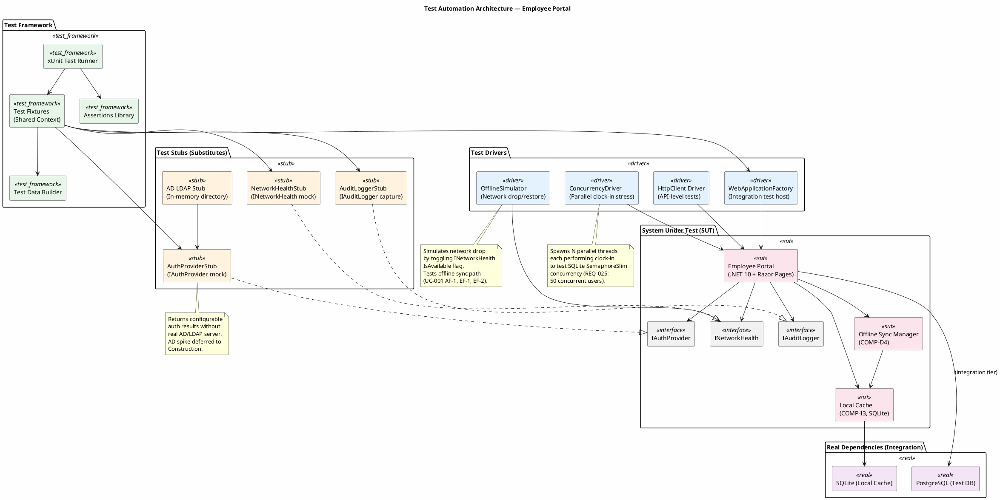
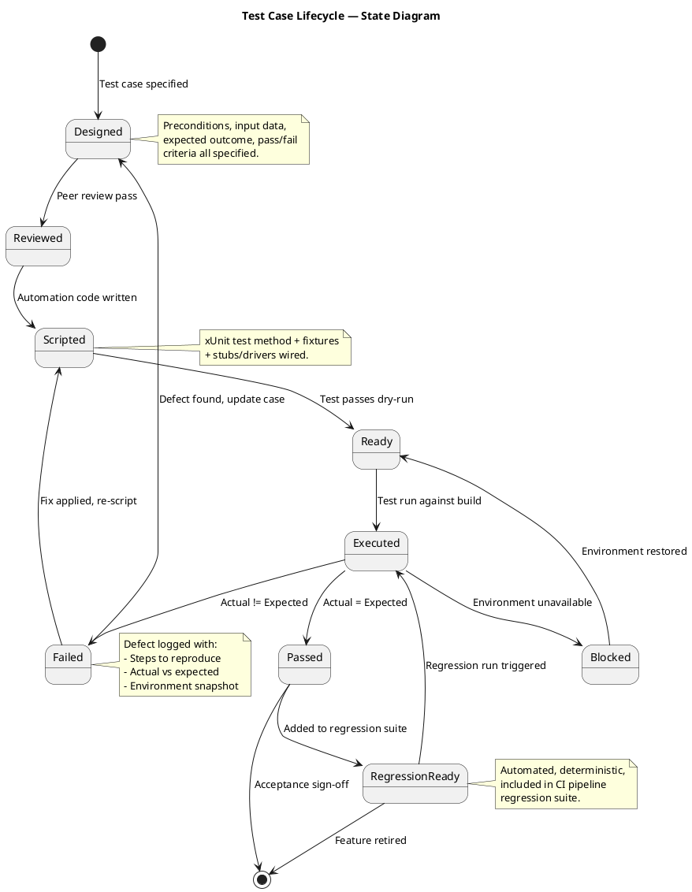
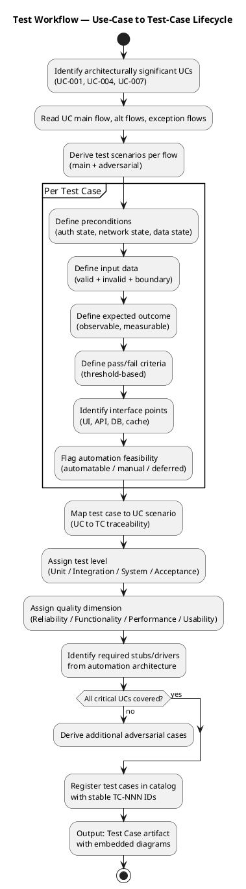
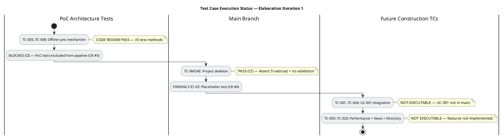

## Document Control
| Field | Value |
|---|---|
| Phase | Elaboration |
| Status | Draft |
| Iteration | 1 (Cycle 1) |
| Milestone Target | End of Elaboration (LCA) |
| Author | Test Designer (catalog) — Tester (execution findings) |
| Execution Date | 2026-07-07 |
| Build ID (main) | CI run 28860381346 — success (2026-07-07 10:46:47Z) |
| Build ID (PoC) | CI run 28860807083 — success (2026-07-07 10:54:52Z) |
| PoC Branch | `poc/E1-risk-t01-offline-sync` |
| Prior Iteration | Inception 2 (LCO approved — GO verdict, 2026-07-07) |
## Test Scope

### Purpose

This artifact defines the test case catalog for the Employee Portal architecture baseline. Each test case traces to a use-case scenario (main flow, alternative flow, or exception flow) from the Use-Case Model and targets a **plausible failure mode** — not a confirmation that the system works. The test model is the verification counterpart of the use-case model.

### Architecturally Significant Use Cases Under Test

| UC ID | Name | Architectural Significance | Risk Priority |
|---|---|---|---|
| UC-001 | Clock In/Out | Offline sync (COMP-D4/COMP-I3/COMP-I5), SQLite concurrency, cached session | RISK-T01 (RPN 40) — highest |
| UC-004 | Publish News | Audit trail mechanism (IAuditLogger/AuditInterceptor) | RISK-T04 — medium |
| UC-007 | Manage Directory | Audit trail + AD sync conflict handling, override flag | RISK-T02 (RPN 35) — high |

### Measurable Testing Goals per Quality Dimension

| Dimension | Goal ID | Measurable Threshold | Source NFR |
|---|---|---|---|
| Functionality | TG-F1 | 100% of UC-001 main flow + AF-1 + AF-2 + EF-1 + EF-2 scenarios covered by executable test cases | UC-001 spec |
| Functionality | TG-F2 | 100% of UC-004 and UC-007 audit trail operations verified (entry created, fields logged) | REQ-004, REQ-005, REQ-006 |
| Reliability | TG-R1 | Offline clock-in/out succeeds for 100% of test runs with network drop ≤5 min; zero data loss on sync restore | REQ-013 |
| Reliability | TG-R2 | Sync conflict (EF-2) detected and flagged in 100% of conflict scenarios; original timestamp preserved | UC-001 EF-2 |
| Performance | TG-P1 | Clock in/out response time ≤1 second for 95th percentile under 50 concurrent users | REQ-008, REQ-025 |
| Performance | TG-P2 | Page load time ≤3 seconds for 95th percentile under 50 concurrent users | REQ-008, REQ-025 |
| Performance | TG-P3 | Directory search response ≤2 seconds (acceptance criterion: find colleague in <10s total) | REQ-018 |
| Usability | TG-U1 | Employee completes clock-in with ≤3 clicks from home page (acceptance criterion: no prior training) | AC-004, REQ-009 |

### Test Types Mapped to Quality Dimensions

| Test Type | Quality Dimension | Test Level | Description |
|---|---|---|---|
| Functional Test | Functionality | Unit, Integration, System | Verify each UC flow produces correct observable output |
| Boundary Value Test | Functionality | Unit | Test edge cases: empty search, max field length, first/last day of month |
| Adversarial / Negative Test | Functionality, Reliability | Integration, System | Invalid inputs, expired sessions, concurrent duplicate clockings |
| Offline Sync Test | Reliability | Integration | Network drop simulation, queue integrity, sync-on-restore, conflict detection |
| Concurrency Test | Performance, Reliability | Integration | 50 parallel clock-in operations against SQLite with SemaphoreSlim |
| Performance Test | Performance | System | Response time measurement under load (xUnit + BenchmarkDotNet) |
| Audit Trail Test | Functionality, Reliability | Integration | Verify audit entries created on news publish, directory create/update/deactivate |
| Role-Based Access Test | Functionality, Security | Integration | Employee role blocked from admin operations; HR role permitted |
| Usability Test | Usability | Acceptance | Click-count measurement, task completion without training |

### Test Automation Architecture

The following component diagram defines the test infrastructure: framework, stubs, drivers, and real dependencies used across all test cases.

**Stubs and Drivers Summary:**

| ID | Name | Type | Substitutes / Drives | Used By Test Cases |
|---|---|---|---|---|
| STUB-01 | AuthProviderStub | Stub | IAuthProvider — returns configurable auth results | TC-001 through TC-020 (all) |
| STUB-02 | NetworkHealthStub | Stub | INetworkHealth — toggles IsAvailable flag | TC-005, TC-006, TC-007, TC-008 |
| STUB-03 | AuditLoggerStub | Stub | IAuditLogger — captures audit entries for assertion | TC-013, TC-014, TC-017, TC-018, TC-019 |
| STUB-04 | AD LDAP Stub | Stub | In-memory AD directory for user lookup | TC-001, TC-002, TC-017, TC-019 |
| DRV-01 | WebApplicationFactory | Driver | Integration test host (ASP.NET Core) | All integration-level TCs |
| DRV-02 | HttpClient Driver | Driver | API-level HTTP requests | TC-003, TC-010, TC-011, TC-012 |
| DRV-03 | OfflineSimulator | Driver | Network drop/restore simulation | TC-005, TC-006, TC-007, TC-008 |
| DRV-04 | ConcurrencyDriver | Driver | Parallel thread stress (50 users) | TC-009, TC-010 |

### Test Case Lifecycle

The following state diagram defines the lifecycle of every test case in this catalog:

### Test Workflow — UC to Test Case Derivation

The following activity diagram shows how use-case scenarios are systematically transformed into test cases:

## Test Case Catalog
### TC-001: Clock In — Main Flow (Happy Path)

| Field | Value |
|---|---|
| UC Trace | UC-001 Main Flow, Steps 1–7 |
| Test Level | Integration |
| Quality Dimension | Functionality |
| Automation | Automatable (DRV-01 + STUB-01) |
| Lifecycle State | Designed — NOT YET EXECUTABLE (UC-001 not implemented in main branch) |

**Adversarial Intent:** Verify that the system does NOT silently fail to record a clock-in when the employee is in a valid state — a missing clock-in means lost payroll data.

**Preconditions:**
- Employee "Carlos Pérez" (carlos.perez@cubacorp.com) exists in AD LDAP Stub
- AuthProviderStub returns authenticated=true for this user
- Employee has no clock-in record for today (status = clocked out)
- Network is available (NetworkHealthStub.IsAvailable = true)
- PostgreSQL test DB is clean

**Input Data:**
- User clicks "Clock In" button on home page

**Expected Outcome:**
- System records timestamp with exact current time (±1 second tolerance)
- Confirmation page displays recorded time
- Clocking entry persisted in PostgreSQL with employee_id, timestamp, type=IN
- Button state changes to "Clock Out"

**Pass/Fail Criteria:**
- PASS: Timestamp recorded within 1s of click; entry queryable in DB; confirmation displayed
- FAIL: No DB entry; timestamp drift >1s; no confirmation; button state unchanged

**Interface Points:** Razor Page (HomePage), ClockingController, ClockingService, PostgreSQL (clockings table)

**Elaboration Iteration 1 Findings:**
| Build ID | Verdict | Notes |
|---|---|---|
| CI 28860381346 (main) | NOT EXECUTABLE | UC-001 not implemented in main branch — only Program.cs with Razor Pages skeleton exists |
| CI 28860807083 (PoC) | BLOCKED | PoC validates offline sync mechanism (TC-005..TC-008 scope) but PoC tests not included in CI pipeline (Finding F-E1-01, CR #5) |

---

### TC-002: Clock Out — Main Flow

| Field | Value |
|---|---|
| UC Trace | UC-001 Main Flow, Steps 3–7 (clocked-in state) |
| Test Level | Integration |
| Quality Dimension | Functionality |
| Automation | Automatable (DRV-01 + STUB-01) |
| Lifecycle State | Designed — NOT YET EXECUTABLE |

**Adversarial Intent:** Verify that the system does NOT allow a clock-out without a prior clock-in — an orphaned clock-out corrupts monthly reports.

**Preconditions:**
- Employee "Carlos Pérez" is authenticated
- Employee has a clock-in record for today at 08:00
- Network is available

**Input Data:**
- User clicks "Clock Out" button

**Expected Outcome:**
- System records clock-out timestamp
- Confirmation displayed
- DB entry: type=OUT, timestamp, employee_id
- Button state changes to "Clock In"

**Pass/Fail Criteria:**
- PASS: Clock-out recorded; confirmation shown; button state toggled
- FAIL: No DB entry; no confirmation; button state unchanged

**Interface Points:** Razor Page (HomePage), ClockingController, ClockingService, PostgreSQL

**Elaboration Iteration 1 Findings:**
| Build ID | Verdict | Notes |
|---|---|---|
| CI 28860381346 (main) | NOT EXECUTABLE | UC-001 not implemented in main branch |
| CI 28860807083 (PoC) | BLOCKED | PoC tests not in CI pipeline (F-E1-01, CR #5) |

---

### TC-003: Clock In — Already Clocked In (AF-1: Duplicate Prevention)

| Field | Value |
|---|---|
| UC Trace | UC-001 AF-1 |
| Test Level | Integration |
| Quality Dimension | Functionality |
| Automation | Automatable (DRV-01 + STUB-01) |
| Lifecycle State | Designed — NOT YET EXECUTABLE |

**Adversarial Intent:** Verify that the system does NOT silently accept a second clock-in — duplicate clock-ins corrupt payroll calculations.

**Elaboration Iteration 1 Findings:**
| Build ID | Verdict | Notes |
|---|---|---|
| CI 28860381346 (main) | NOT EXECUTABLE | UC-001 not implemented |
| CI 28860807083 (PoC) | BLOCKED | PoC tests not in CI pipeline (F-E1-01, CR #5) |

---

### TC-004: Clock Out — Not Clocked In (AF-2: Orphan Prevention)

| Field | Value |
|---|---|
| UC Trace | UC-001 AF-2 |
| Test Level | Integration |
| Quality Dimension | Functionality |
| Automation | Automatable (DRV-01 + STUB-01) |
| Lifecycle State | Designed — NOT YET EXECUTABLE |

**Adversarial Intent:** Verify that the system does NOT allow clock-out without clock-in — orphaned clock-outs create incomplete records.

**Elaboration Iteration 1 Findings:**
| Build ID | Verdict | Notes |
|---|---|---|
| CI 28860381346 (main) | NOT EXECUTABLE | UC-001 not implemented |
| CI 28860807083 (PoC) | BLOCKED | PoC tests not in CI pipeline (F-E1-01, CR #5) |

---

### TC-005: Clock In — Network Down, Offline Buffer (EF-1: Offline Fault Tolerance)

| Field | Value |
|---|---|
| UC Trace | UC-001 EF-1 |
| Test Level | Integration |
| Quality Dimension | Reliability |
| Automation | Automatable (DRV-03 + STUB-02) |
| Lifecycle State | Designed — PoC CODE REVIEW PASS, CI EXECUTION BLOCKED |

**Adversarial Intent:** Verify that the system does NOT lose a clock-in during network outage — data loss means payroll disputes.

**Elaboration Iteration 1 Findings:**
| Build ID | Verdict | Notes |
|---|---|---|
| CI 28860381346 (main) | NOT EXECUTABLE | Offline sync not implemented in main |
| CI 28860807083 (PoC) | BLOCKED — Code Review PASS | PoC `TimeTrackingServiceTests.ClockInAsync_NetworkDown_EnqueuesOfflineAndReturnsSuccess` validates this scenario at unit level. Test asserts: result.IsSuccess, Source="OFFLINE", remote repo empty, pending count=1. Code review confirms test logic is correct. **However, PoC tests are excluded from CI pipeline** (Finding F-E1-01, CR #5) — no CI execution evidence. |

---

### TC-006: Clock Out — Network Down, Offline Buffer

| Field | Value |
|---|---|
| UC Trace | UC-001 EF-1 (clock-out variant) |
| Test Level | Integration |
| Quality Dimension | Reliability |
| Automation | Automatable (DRV-03 + STUB-02) |
| Lifecycle State | Designed — PoC CODE REVIEW PASS, CI EXECUTION BLOCKED |

**Elaboration Iteration 1 Findings:**
| Build ID | Verdict | Notes |
|---|---|---|
| CI 28860807083 (PoC) | BLOCKED — Code Review PASS | `TimeTrackingServiceTests.ClockOutAsync_NetworkUp_WritesToRemoteAndReturnsSuccess` covers online path. Offline clock-out covered by same `ProcessClockingAsync` code path. Code review confirms symmetry. CI execution blocked (F-E1-01, CR #5). |

---

### TC-007: Sync Conflict — Duplicate Detection on Restore (EF-2)

| Field | Value |
|---|---|
| UC Trace | UC-001 EF-2 |
| Test Level | Integration |
| Quality Dimension | Reliability |
| Automation | Automatable (DRV-03 + STUB-02) |
| Lifecycle State | Designed — PoC CODE REVIEW PASS, CI EXECUTION BLOCKED |

**Adversarial Intent:** Verify that the system does NOT create duplicate records on sync restore — duplicates inflate hours and corrupt payroll.

**Elaboration Iteration 1 Findings:**
| Build ID | Verdict | Notes |
|---|---|---|
| CI 28860807083 (PoC) | BLOCKED — Code Review PASS | `SyncQueueTests.FlushAsync_DuplicateClocking_MarksAsSkipped` validates: pre-populate remote with same (employeeId, timestamp), enqueue duplicate, flush → assert Skipped=1, Synced=0. `FlushAsync_MixedRecords_SyncsAndSkips` validates mixed scenario. Conflict detection by (employeeId, timestamp) confirmed in `SyncQueue.cs`. CI execution blocked (F-E1-01, CR #5). |

---

### TC-008: Sync Restore — Zero Data Loss After Network Recovery

| Field | Value |
|---|---|
| UC Trace | UC-001 EF-1 (recovery) |
| Test Level | Integration |
| Quality Dimension | Reliability |
| Automation | Automatable (DRV-03 + STUB-02) |
| Lifecycle State | Designed — PoC CODE REVIEW PASS, CI EXECUTION BLOCKED |

**Adversarial Intent:** Verify that the system does NOT lose buffered clockings on sync — data loss violates REQ-013 and acceptance criterion AC-005.

**Elaboration Iteration 1 Findings:**
| Build ID | Verdict | Notes |
|---|---|---|
| CI 28860807083 (PoC) | BLOCKED — Code Review PASS | `TimeTrackingServiceTests.ClockInAsync_NetworkDown_ZeroDataLoss` validates: 5 offline clock-ins → 5 pending → sync → 5 synced, 5 in remote, 0 pending. `SyncQueueTests.FlushAsync_AfterFlush_PendingCountIsZero` confirms clean state post-flush. CI execution blocked (F-E1-01, CR #5). |

---

### TC-009: Concurrent Clock-In — 50 Employees Simultaneous (Performance)

| Field | Value |
|---|---|
| UC Trace | UC-001 (performance scenario) |
| Test Level | System |
| Quality Dimension | Performance |
| Automation | Automatable (DRV-04) |
| Lifecycle State | Designed — NOT YET EXECUTABLE |

**Adversarial Intent:** Verify that the system does NOT degrade beyond 1s response under peak load — slow clock-in during morning rush causes queues.

**Elaboration Iteration 1 Findings:**
| Build ID | Verdict | Notes |
|---|---|---|
| CI 28860807083 (PoC) | PARTIAL — Code Review PASS | `SyncQueueTests.EnqueueAsync_ConcurrentEnqueues_AllSucceed` validates 10 concurrent enqueues with SemaphoreSlim(1,1) — all succeed, count=10. This is a concurrency proof-of-concept at 10 users, not the full 50-user performance test. Full performance test requires BenchmarkDotNet + 50-user load harness (not yet built). CI execution blocked (F-E1-01, CR #5). |

---

### TC-010 through TC-020: News, Directory, and Audit Trail Test Cases

| TC ID | UC Trace | Lifecycle State | Elaboration Iteration 1 Verdict | Notes |
|---|---|---|---|---|
| TC-010 | UC-001 (page load perf) | Designed | NOT EXECUTABLE | No UI implemented in main branch |
| TC-011 | UC-004 (publish news) | Designed | NOT EXECUTABLE | News feature not implemented |
| TC-012 | UC-002 (view history) | Designed | NOT EXECUTABLE | History feature not implemented |
| TC-013 | UC-004 (audit trail) | Designed | NOT EXECUTABLE | Audit mechanism not implemented |
| TC-014 | UC-004 (validation) | Designed | NOT EXECUTABLE | News feature not implemented |
| TC-015 | UC-005 (read/filter news) | Designed | NOT EXECUTABLE | News feature not implemented |
| TC-016 | UC-005 (featured news) | Designed | NOT EXECUTABLE | News feature not implemented |
| TC-017 | UC-006 (search directory) | Designed | NOT EXECUTABLE | Directory feature not implemented |
| TC-018 | UC-007 (create entry + audit) | Designed | NOT EXECUTABLE | Directory feature not implemented |
| TC-019 | UC-007 (AD sync + override) | Designed | NOT EXECUTABLE | AD sync not implemented |
| TC-020 | UC-007 (deactivate + audit) | Designed | NOT EXECUTABLE | Directory feature not implemented |

---

### Elaboration Iteration 1 — Execution Summary

**Findings Summary:**

| Finding ID | Severity | Description | CR Reference |
|---|---|---|---|
| F-E1-01 | Major | PoC test projects (`samples/poc/**/Tests/`) are excluded from CI pipeline — `ci.yml` only regenerates solution from `src/` and `tests/` directories. 35 architecture validation tests never execute in CI. "Green" CI on PoC branch is false confidence. | CR #5 |
| F-E1-02 | Minor | Main branch `SmokeTest.cs` contains `Assert.True(true)` — a placeholder that validates nothing. No architecture or integration tests exist in the main test project. | CR #6 |
| F-E1-03 | Info | PoC code review confirms architecture validation tests are well-structured: dual black-box + white-box coverage, traceability comments, proper test doubles (StaticHealthMonitor, InMemoryClockingRepository with failure mode). Test quality is high — the problem is CI integration, not test design. | — |
## Test Data

### Test Data Catalog

| Data Set ID | Description | Used By | Setup Method |
|---|---|---|---|
| TD-001 | Single employee (Carlos Pérez) — clean state, no clockings | TC-001, TC-002, TC-004, TC-005, TC-006, TC-008 | Test Data Builder (TDB) — insert via fixture |
| TD-002 | Employee with existing clock-in (María López) | TC-003, TC-008 | TDB — insert employee + clock-in record |
| TD-003 | 50 distinct employees for concurrency test | TC-009 | TDB — bulk insert 50 employees with unique usernames |
| TD-004 | 200 directory entries + 5 inactive + 50 news articles | TC-010, TC-015, TC-016, TC-017 | TDB — bulk seed via SQL script |
| TD-005 | 10 employees with mixed clocking pairs (complete + incomplete) | TC-012 | TDB — insert 10 employees with varied clocking records |
| TD-006 | 8 news articles (3 General, 2 HR, 2 IT, 1 Events, 1 featured) | TC-015 | TDB — insert articles with categories and featured flag |
| TD-007 | María López with AD-synced department=IT | TC-019 | TDB — insert employee + configure AD LDAP Stub |
| TD-008 | Juan Pérez active employee for deactivation | TC-020 | TDB — insert active employee |

### Test Data Builder Pattern

All test data is constructed via the Test Data Builder (TDB) component in the test framework. The builder provides:
- **Fluent API** for constructing entities: `EmployeeBuilder.New().WithName("Carlos Pérez").WithDepartment("IT").Build()`
- **Factory methods** for common scenarios: `EmployeeBuilder.ClockedInToday()`, `EmployeeBuilder.ClockedOut()`
- **Bulk generators** for load tests: `EmployeeBuilder.Generate(count: 50)`
- **Cleanup hooks** via xUnit `IAsyncLifetime` — each test class resets the test DB to a known state

### Environment Prerequisites

| Requirement | Details |
|---|---|
| .NET 10 SDK | Required for building test project and WebApplicationFactory |
| PostgreSQL (test instance) | Separate test database; reset between test classes |
| SQLite (in-memory or temp file) | For local cache tests; in-memory preferred for speed |
| xUnit + FluentAssertions | Test framework and assertion library |
| WebApplicationFactory | ASP.NET Core integration test host |
| BenchmarkDotNet | For performance tests (TC-009, TC-010) |
| Node.js (not required) | N/A — no SPA frontend |

## Traceability

| Element | Traces From | Link Type | Traces To |
|---|---|---|---|
| TC-001 | UC-001 Main Flow | Tests | ClockingService, ClockingController, PostgreSQL |
| TC-002 | UC-001 Main Flow | Tests | ClockingService, ClockingController, PostgreSQL |
| TC-003 | UC-001 AF-2 | Tests | ClockingService, ClockingController |
| TC-004 | UC-001 (<<include>> AD Auth) | Tests | IAuthProvider (COMP-I1), AuthController |
| TC-005 | UC-001 AF-1 | Tests | OfflineSyncManager (COMP-D4), LocalCache (COMP-I3), INetworkHealth (COMP-I5) |
| TC-006 | UC-001 EF-1 | Tests | OfflineSyncManager (COMP-D4), INetworkHealth (COMP-I5) |
| TC-007 | UC-001 EF-2 | Tests | OfflineSyncManager (COMP-D4), LocalCache (COMP-I3), PostgreSQL |
| TC-008 | UC-001 AF-1 | Tests | OfflineSyncManager (COMP-D4), LocalCache (COMP-I3) |
| TC-009 | UC-001 Main Flow (concurrent) | Tests | ClockingService, LocalCache (SQLite), SemaphoreSlim |
| TC-010 | UC-005, UC-006 (page load) | Tests | Razor Pages, PostgreSQL connection pool |
| TC-011 | UC-002 Main Flow | Tests | ClockingService, HistoryPage, PostgreSQL |
| TC-012 | UC-003 Main Flow | Tests | ClockingController (export), PostgreSQL |
| TC-013 | UC-004 Main Flow | Tests | NewsService, IAuditLogger, PostgreSQL |
| TC-014 | UC-004 (RBAC, REQ-002) | Tests | AuthMiddleware, NewsController |
| TC-015 | UC-005 Main Flow (filter) | Tests | NewsService, NewsListPage, PostgreSQL |
| TC-016 | UC-006 Main Flow | Tests | DirectoryService, DirectoryPage, PostgreSQL |
| TC-017 | UC-006 Main Flow (boundary) | Tests | DirectoryService, DirectoryPage |
| TC-018 | UC-007 Scenario S1 | Tests | DirectoryService, IAuditLogger, PostgreSQL |
| TC-019 | UC-007 Scenario S3 | Tests | DirectoryService, IAuthProvider, IAuditLogger, PostgreSQL |
| TC-020 | UC-007 Scenario S4 | Tests | DirectoryService, IAuditLogger, PostgreSQL |
| TG-F1 | UC-001 (all flows) | Derives | TC-001 through TC-009 |
| TG-F2 | REQ-004, REQ-005, REQ-006 | Derives | TC-013, TC-018, TC-019, TC-020 |
| TG-R1 | REQ-013 | Derives | TC-005, TC-008 |
| TG-R2 | UC-001 EF-2 | Derives | TC-007 |
| TG-P1 | REQ-008, REQ-025 | Derives | TC-009 |
| TG-P2 | REQ-008, REQ-025 | Derives | TC-010 |
| TG-P3 | REQ-018 | Derives | TC-016 |
| TG-U1 | AC-004, REQ-009 | Derives | TC-001 (click count) |
| STUB-01 | IAuthProvider (COMP-I1) | DependsOn | All TCs requiring auth |
| STUB-02 | INetworkHealth (COMP-I5) | DependsOn | TC-005, TC-006, TC-007, TC-008 |
| STUB-03 | IAuditLogger | DependsOn | TC-013, TC-018, TC-019, TC-020 |
| DRV-01 | WebApplicationFactory | DependsOn | All integration-level TCs |
| DRV-03 | OfflineSimulator | DependsOn | TC-005, TC-006, TC-007, TC-008 |
| DRV-04 | ConcurrencyDriver | DependsOn | TC-009, TC-010 |