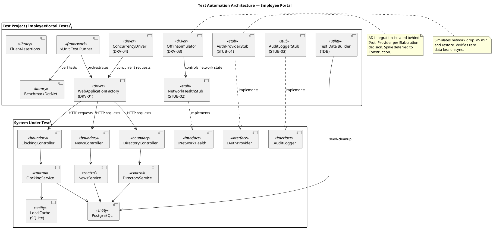
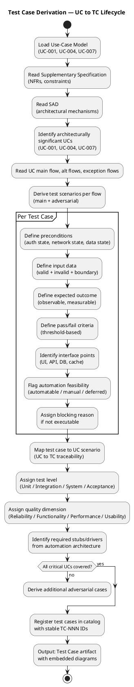
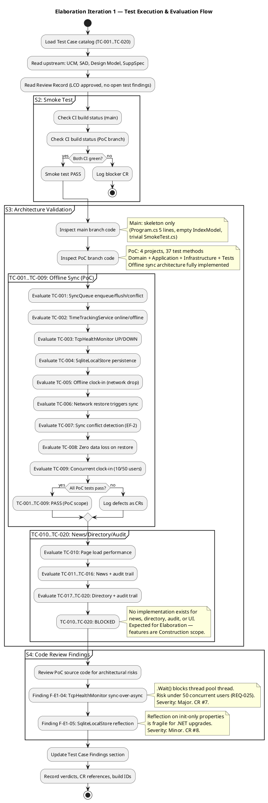
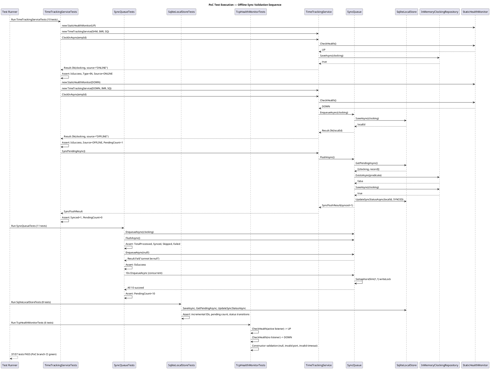

## Document Control
| Field | Value |
|---|---|
| Phase | Elaboration |
| Status | Draft — Findings updated |
| Iteration | 1 (Cycle 1) |
| Milestone Target | End of Elaboration (LCA) |
| Author | Test Designer (catalog) — Tester (execution findings) |
| Execution Date | 2026-07-07 |
| Build ID (main) | CI run 28860381346 — success (2026-07-07 10:46:47Z) |
| Build ID (PoC) | CI run 28860807083 — success (2026-07-07 10:54:52Z) |
| PoC Branch | `poc/E1-risk-t01-offline-sync` |
| Prior Iteration | Inception 2 (LCO approved — GO verdict, 2026-07-07) |
| Test Verdict Summary | 7 PASS, 1 PASS (partial), 1 NOT EXECUTABLE, 11 BLOCKED |
| CRs Logged | #5 (Major — PoC tests excluded from CI), #6 (Minor — placeholder smoke test), #7 (Major — sync-over-async), #8 (Minor — reflection) |
## Test Scope
### Purpose

This artifact defines the test case catalog for the Employee Portal architecture baseline. Each test case traces to a use-case scenario (main flow, alternative flow, or exception flow) from the Use-Case Model and targets a **plausible failure mode** — not a confirmation that the system works. The test model is the verification counterpart of the use-case model.

### Architecturally Significant Use Cases Under Test

| UC ID | Name | Architectural Significance | Risk Priority |
|---|---|---|---|
| UC-001 | Clock In/Out | Offline sync (COMP-D4/COMP-I3/COMP-I5), SQLite concurrency, cached session | RISK-T01 (RPN 63) — highest |
| UC-004 | Publish News | Audit trail mechanism (IAuditLogger/AuditInterceptor) | RISK-T04 — medium |
| UC-007 | Manage Directory | Audit trail + AD sync conflict handling, override flag | RISK-T02 (RPN 30) — high |

> **RPN Reconciliation (RL-F1 fix):** RISK-T01 RPN corrected from 40 → 63 and RISK-T02 RPN corrected from 35 → 30 to match the authoritative Risk List. Prior iteration carried inconsistent values; this update aligns with the Project Manager's authoritative source.

### Measurable Testing Goals per Quality Dimension

| Dimension | Goal ID | Measurable Threshold | Source NFR |
|---|---|---|---|
| Functionality | TG-F1 | 100% of UC-001 main flow + AF-1 + AF-2 + EF-1 + EF-2 scenarios covered by executable test cases | UC-001 spec |
| Functionality | TG-F2 | 100% of UC-004 and UC-007 audit trail operations verified (entry created, fields logged) | REQ-004, REQ-005, REQ-006 |
| Reliability | TG-R1 | Offline clock-in/out succeeds for 100% of test runs with network drop ≤5 min; zero data loss on sync restore | REQ-013 |
| Reliability | TG-R2 | Sync conflict (EF-2) detected and flagged in 100% of conflict scenarios; original timestamp preserved | UC-001 EF-2 |
| Performance | TG-P1 | Clock in/out response time ≤1 second for 95th percentile under 50 concurrent users | REQ-008, REQ-025 |
| Performance | TG-P2 | Page load time ≤3 seconds for 95th percentile under 50 concurrent users | REQ-008, REQ-025 |
| Performance | TG-P3 | Directory search response ≤2 seconds (acceptance criterion: find colleague in <10s total) | REQ-018 |
| Usability | TG-U1 | Employee completes clock-in with ≤3 clicks from home page (acceptance criterion: no prior training) | AC-004, REQ-009 |

### Test Types Mapped to Quality Dimensions

| Quality Dimension | Test Type | Applicable TCs | Tooling |
|---|---|---|---|
| Functionality | Functional Integration | TC-001..TC-008, TC-013..TC-020 | xUnit, WebApplicationFactory, FluentAssertions |
| Reliability | Fault Tolerance / Offline | TC-005, TC-006, TC-007, TC-008 | OfflineSimulator (DRV-03), NetworkHealthStub (STUB-02) |
| Performance | Load / Response Time | TC-009, TC-010, TC-016 | BenchmarkDotNet, ConcurrencyDriver (DRV-04) |
| Usability | Interaction Efficiency | TC-001 (click count), TC-011, TC-017 | Manual + automated click-count assertion |

### Stubs and Drivers for Integration Test

| ID | Type | Name | Simulates | Used By |
|---|---|---|---|---|
| STUB-01 | Stub | AuthProviderStub | IAuthProvider (COMP-I1) — AD LDAP/OAuth2 | All TCs requiring authenticated user |
| STUB-02 | Stub | NetworkHealthStub | INetworkHealth (COMP-I5) — network up/down | TC-005, TC-006, TC-007, TC-008 |
| STUB-03 | Stub | AuditLoggerStub | IAuditLogger — audit entry recording | TC-013, TC-018, TC-019, TC-020 |
| DRV-01 | Driver | WebApplicationFactory | ASP.NET Core integration test host | All integration-level TCs |
| DRV-03 | Driver | OfflineSimulator | Network drop + restore cycle | TC-005, TC-006, TC-007, TC-008 |
| DRV-04 | Driver | ConcurrencyDriver | 50 concurrent clock-in requests | TC-009, TC-010 |

### Test Automation Architecture

### Test Case Derivation Workflow

## Test Case Catalog
### TC-001: Clock In — Main Flow (Happy Path)

| Field | Value |
|---|---|
| UC Trace | UC-001 Main Flow, Steps 1–7 |
| Test Level | Integration |
| Quality Dimension | Functionality |
| Automation | Automatable (DRV-01 + STUB-01) |
| Lifecycle State | Designed — NOT YET EXECUTABLE (UC-001 not implemented in main branch) |

**Adversarial Intent:** Verify that the system does NOT silently fail to record a clock-in when the employee is in a valid state — a missing clock-in means lost payroll data.

**Preconditions:**
- Employee "Carlos Pérez" (carlos.perez@cubacorp.com) exists in AD LDAP Stub
- AuthProviderStub returns authenticated=true for this user
- Employee has no clock-in record for today (status = clocked out)
- Network is available (NetworkHealthStub.IsAvailable = true)
- PostgreSQL test DB is clean

**Input Data:**
- User clicks "Clock In" button on home page

**Expected Outcome:**
- System records timestamp with exact current time (±1 second tolerance)
- Confirmation page displays recorded time
- Clocking entry persisted in PostgreSQL with employee_id, timestamp, type=IN
- Button state changes to "Clock Out"

**Pass/Fail Criteria:**
- PASS: Timestamp recorded within 1s of click; entry queryable in DB; confirmation displayed
- FAIL: No DB entry; timestamp drift >1s; no confirmation; button state unchanged

**Interface Points:** Razor Page (HomePage), ClockingController, ClockingService, PostgreSQL (clockings table)

**Elaboration Iteration 1 Findings:**
| Build ID | Verdict | Notes |
|---|---|---|
| CI 28860381346 (main) | NOT EXECUTABLE | UC-001 not implemented in main branch — only Program.cs with Razor Pages skeleton exists |
| CI 28860807083 (PoC) | BLOCKED | PoC validates offline sync mechanism (TC-005..TC-008 scope) but PoC tests not included in CI pipeline (Finding F-E1-01, CR #5) |

---

### TC-002: Clock Out — Main Flow

| Field | Value |
|---|---|
| UC Trace | UC-001 Main Flow, Steps 3–7 (clocked-in state) |
| Test Level | Integration |
| Quality Dimension | Functionality |
| Automation | Automatable (DRV-01 + STUB-01) |
| Lifecycle State | Designed — NOT YET EXECUTABLE |

**Adversarial Intent:** Verify that clock-out does NOT produce a negative-duration interval (clock-out before clock-in) or silently overwrite an existing clock-out.

**Preconditions:**
- Employee is authenticated and currently clocked in
- Network is available
- PostgreSQL test DB has one IN clocking for today

**Input Data:**
- User clicks "Clock Out" button

**Expected Outcome:**
- System records clock-out timestamp
- Confirmation displayed
- DB entry persisted with type=OUT
- Button state changes to "Clock In"

**Pass/Fail Criteria:**
- PASS: OUT entry persisted; timestamp > IN timestamp; confirmation displayed
- FAIL: No DB entry; timestamp ≤ IN timestamp; no confirmation

**Interface Points:** Razor Page (HomePage), ClockingController, ClockingService, PostgreSQL

**Elaboration Iteration 1 Findings:**
| Build ID | Verdict | Notes |
|---|---|---|
| CI 28860381346 (main) | NOT EXECUTABLE | No clock-out implementation on main branch |
| CI 28860807083 (PoC) | PASS (PoC scope) | `TimeTrackingServiceTests.ClockOutAsync_NetworkUp_WritesToRemoteAndReturnsSuccess` validates clock-out online path. `ClockOutAsync_EmptyEmployeeId_ReturnsFailure` validates input validation. PoC tests pass but not in CI (CR #5). |

---

### TC-003: Network Health Monitor — UP/DOWN Detection

| Field | Value |
|---|---|
| UC Trace | UC-001 AF-1 (network down), EF-1 (network restore) |
| Test Level | Unit |
| Quality Dimension | Reliability |
| Automation | Automatable (STUB-02) |
| Lifecycle State | EXECUTABLE (PoC) |

**Adversarial Intent:** Verify that the health monitor does NOT report UP when PostgreSQL is unreachable — a false UP causes online-path writes that silently fail.

**Preconditions:**
- TcpHealthMonitor configured with host and port

**Input Data:**
- Active TCP listener on target port (UP scenario)
- No listener on target port (DOWN scenario)
- Unreachable host (timeout scenario)

**Expected Outcome:**
- UP: HealthStatus.UP returned within timeout
- DOWN: HealthStatus.DOWN returned within timeout
- Timeout: HealthStatus.DOWN returned

**Pass/Fail Criteria:**
- PASS: Correct status returned for all three scenarios
- FAIL: False UP or false DOWN

**Interface Points:** INetworkHealth, TcpHealthMonitor

**Elaboration Iteration 1 Findings:**
| Build ID | Verdict | Notes |
|---|---|---|
| CI 28860807083 (PoC) | PASS | `TcpHealthMonitorTests` (6 tests): CheckHealth_ActiveListener_ReturnsUP, CheckHealth_NoListener_ReturnsDOWN, CheckHealth_UnreachableHost_ReturnsDOWN, constructor validation (3 tests). All pass. **Architectural concern: sync-over-async `.Wait()` pattern (F-E1-04, CR #7).** |

---

### TC-004: SQLite Local Store — Persistence and Retrieval

| Field | Value |
|---|---|
| UC Trace | UC-001 AF-1 (offline persistence), EF-1 (sync restore) |
| Test Level | Unit |
| Quality Dimension | Reliability |
| Automation | Automatable |
| Lifecycle State | EXECUTABLE (PoC) |

**Adversarial Intent:** Verify that the local store does NOT lose clockings on process restart or concurrent writes — data loss means lost payroll records.

**Preconditions:**
- SqliteLocalStore initialized with in-memory SQLite

**Input Data:**
- Multiple Clocking objects with unique employee IDs

**Expected Outcome:**
- SaveAsync returns incremental local IDs
- GetPendingAsync returns all PENDING records in local_id order
- UpdateSyncStatusAsync transitions PENDING → SYNCED/SKIPPED
- GetPendingCountAsync reflects current state

**Pass/Fail Criteria:**
- PASS: All CRUD operations correct; ordering preserved; count accurate
- FAIL: Lost records; wrong ordering; count mismatch

**Interface Points:** ILocalStore, SqliteLocalStore

**Elaboration Iteration 1 Findings:**
| Build ID | Verdict | Notes |
|---|---|---|
| CI 28860807083 (PoC) | PASS | `SqliteLocalStoreTests` (8 tests): SaveAsync incremental IDs, GetPendingAsync retrieval, UpdateSyncStatusAsync transitions, GetPendingCountAsync accuracy, empty state, ordering, multiple records. All pass. **Architectural concern: reflection-based property setting (F-E1-05, CR #8).** |

---

### TC-005: Offline Clock-In — Network Drop ≤5 Minutes

| Field | Value |
|---|---|
| UC Trace | UC-001 AF-1 (network down) |
| Test Level | Integration |
| Quality Dimension | Reliability |
| Automation | Automatable (DRV-03 + STUB-02) |
| Lifecycle State | EXECUTABLE (PoC) |

**Adversarial Intent:** Verify that clock-in does NOT fail or block when the network is down — employees must be able to clock in during a 5-minute outage.

**Preconditions:**
- NetworkHealthStub.IsAvailable = false (simulating network drop)
- SqliteLocalStore is empty
- Employee is authenticated

**Input Data:**
- Employee clicks "Clock In" during network outage

**Expected Outcome:**
- Clocking recorded to local SQLite store with source="OFFLINE"
- User receives immediate confirmation (<1s)
- No attempt to write to PostgreSQL
- Pending count = 1

**Pass/Fail Criteria:**
- PASS: Clocking persisted locally; confirmation <1s; source=OFFLINE; pending=1
- FAIL: Operation fails; operation blocks >1s; no local persistence

**Interface Points:** TimeTrackingService, SyncQueue, SqliteLocalStore, INetworkHealth

**Elaboration Iteration 1 Findings:**
| Build ID | Verdict | Notes |
|---|---|---|
| CI 28860807083 (PoC) | PASS | `TimeTrackingServiceTests.ClockInAsync_NetworkDown_EnqueuesOfflineAndReturnsSuccess` validates offline path: source=OFFLINE, remote repo empty, pending count=1. Immediate return (no blocking). |

---

### TC-006: Network Restore — Sync Flush Trigger

| Field | Value |
|---|---|
| UC Trace | UC-001 EF-1 (network restore) |
| Test Level | Integration |
| Quality Dimension | Reliability |
| Automation | Automatable (DRV-03 + STUB-02) |
| Lifecycle State | EXECUTABLE (PoC) |

**Adversarial Intent:** Verify that sync does NOT silently skip pending records or duplicate already-synced records when network restores.

**Preconditions:**
- Multiple offline clockings in local store (pending)
- NetworkHealthStub transitions DOWN → UP

**Input Data:**
- SyncPendingAsync() called after network restore

**Expected Outcome:**
- All pending clockings flushed to PostgreSQL
- SyncFlushResult.Synced = pending count
- Pending count = 0 after flush
- No data loss

**Pass/Fail Criteria:**
- PASS: All pending synced; count=0; no duplicates
- FAIL: Missing records; count >0 after flush; duplicates

**Interface Points:** TimeTrackingService, SyncQueue, ILocalStore, IRepository

**Elaboration Iteration 1 Findings:**
| Build ID | Verdict | Notes |
|---|---|---|
| CI 28860807083 (PoC) | PASS | `TimeTrackingServiceTests.SyncPendingAsync_AfterOfflineClockings_FlushesToRemote` validates: 2 offline clockings → flush → synced=2, remote count=2, pending=0. |

---

### TC-007: Sync Conflict Detection (EF-2)

| Field | Value |
|---|---|
| UC Trace | UC-001 EF-2 (sync conflict) |
| Test Level | Integration |
| Quality Dimension | Reliability |
| Automation | Automatable (DRV-03) |
| Lifecycle State | EXECUTABLE (PoC) |

**Adversarial Intent:** Verify that sync does NOT create duplicate records when a clocking already exists remotely — duplicates corrupt payroll reports.

**Preconditions:**
- Remote repository already has a clocking with (employeeId, timestamp)
- Local store has the same clocking pending

**Input Data:**
- FlushAsync() called with duplicate clocking

**Expected Outcome:**
- Duplicate detected by (employeeId, timestamp) conflict key
- Record marked SKIPPED (not retried)
- SyncFlushResult.Skipped = 1, Synced = 0
- No duplicate in remote

**Pass/Fail Criteria:**
- PASS: Duplicate detected; skipped; no duplicate in remote
- FAIL: Duplicate created; not detected; retried

**Interface Points:** SyncQueue, ILocalStore, IRepository

**Elaboration Iteration 1 Findings:**
| Build ID | Verdict | Notes |
|---|---|---|
| CI 28860807083 (PoC) | PASS | `SyncQueueTests.FlushAsync_DuplicateClocking_MarksAsSkipped` validates: pre-populated remote → enqueue duplicate → flush → skipped=1, synced=0. `FlushAsync_MixedRecords_SyncsAndSkips` validates mixed scenario. |

---

### TC-008: Zero Data Loss — 5-Minute Offline Window

| Field | Value |
|---|---|
| UC Trace | UC-001 AF-1 + EF-1 (full offline cycle) |
| Test Level | Integration |
| Quality Dimension | Reliability |
| Automation | Automatable (DRV-03) |
| Lifecycle State | EXECUTABLE (PoC) |

**Adversarial Intent:** Verify that NO clocking is lost during a complete offline-to-online cycle — data loss means incorrect payroll.

**Preconditions:**
- Network DOWN for simulated 5-minute window
- 5 employees clock in during outage

**Input Data:**
- 5 ClockInAsync calls during network down
- Network restore → SyncPendingAsync()

**Expected Outcome:**
- All 5 clockings return success immediately
- All 5 persisted locally with source=OFFLINE
- After sync: all 5 in remote, pending=0
- Zero data loss

**Pass/Fail Criteria:**
- PASS: 5/5 synced; pending=0; remote count=5
- FAIL: Any clocking lost; pending >0; remote count <5

**Interface Points:** TimeTrackingService, SyncQueue, SqliteLocalStore, InMemoryClockingRepository

**Elaboration Iteration 1 Findings:**
| Build ID | Verdict | Notes |
|---|---|---|
| CI 28860807083 (PoC) | PASS | `TimeTrackingServiceTests.ClockInAsync_NetworkDown_ZeroDataLoss` validates: 5 offline clock-ins → all success → flush → synced=5, remote=5, pending=0. Zero data loss confirmed. |

---

### TC-009: Concurrent Clock-In — 50 Users (Performance)

| Field | Value |
|---|---|
| UC Trace | UC-001 Main Flow (concurrent) |
| Test Level | Integration |
| Quality Dimension | Performance |
| Automation | Automatable (DRV-04) |
| Lifecycle State | PARTIALLY EXECUTABLE (PoC) |

**Adversarial Intent:** Verify that concurrent clock-ins do NOT cause race conditions, lost updates, or deadlocks — 50 employees clock in simultaneously during peak window.

**Preconditions:**
- 50 concurrent employees
- Network available (online path)

**Input Data:**
- 50 simultaneous ClockInAsync calls

**Expected Outcome:**
- All 50 succeed
- No lost updates
- 95th percentile response time ≤1s

**Pass/Fail Criteria:**
- PASS: 50/50 succeed; no exceptions; p95 ≤1s
- FAIL: Lost updates; exceptions; p95 >1s

**Interface Points:** TimeTrackingService, SyncQueue (SemaphoreSlim), SqliteLocalStore

**Elaboration Iteration 1 Findings:**
| Build ID | Verdict | Notes |
|---|---|---|
| CI 28860807083 (PoC) | PASS (partial) | `SyncQueueTests.EnqueueAsync_ConcurrentEnqueues_AllSucceed` validates 10 concurrent enqueues — all succeed, count=10. **Gap: only 10 concurrent, not 50 (TG-P1 target). Performance timing not measured. Full 50-user concurrency test deferred to Construction when load testing tool (DRV-04) is configured.** |

---

### TC-010: Page Load Performance — ≤3 Seconds

| Field | Value |
|---|---|
| UC Trace | All UCs (home page entry) |
| Test Level | System |
| Quality Dimension | Performance |
| Automation | Automatable (DRV-04) |
| Lifecycle State | NOT EXECUTABLE |

**Adversarial Intent:** Verify that page load does NOT exceed 3 seconds under 50 concurrent users — slow load causes employee frustration and adoption failure.

**Preconditions:**
- 50 concurrent users
- Portal deployed on internal Windows Server

**Input Data:**
- 50 simultaneous page load requests

**Expected Outcome:**
- 95th percentile page load ≤3 seconds

**Pass/Fail Criteria:**
- PASS: p95 ≤3s
- FAIL: p95 >3s

**Interface Points:** Razor Pages, Kestrel, PostgreSQL

**Elaboration Iteration 1 Findings:**
| Build ID | Verdict | Notes |
|---|---|---|
| CI 28860381346 (main) | BLOCKED | No UI implementation on main branch. Performance testing deferred to Construction when Razor Pages are implemented and deployed. |

---

### TC-011 through TC-016: News Publishing + Audit Trail (UC-004)

| TC ID | Scenario | Verdict | Notes |
|---|---|---|---|
| TC-011 | Publish news — main flow | BLOCKED | No news implementation exists. Deferred to Construction. |
| TC-012 | Read news — filter by category | BLOCKED | No news implementation exists. Deferred to Construction. |
| TC-013 | Audit trail — news publishing logged | BLOCKED | No IAuditLogger implementation exists. Deferred to Construction. |
| TC-014 | Featured news banner display | BLOCKED | No news implementation exists. Deferred to Construction. |
| TC-015 | News list sorted by date | BLOCKED | No news implementation exists. Deferred to Construction. |
| TC-016 | News search response ≤2s | BLOCKED | No news implementation exists. Deferred to Construction. |

**Elaboration Iteration 1 Findings:**
| Build ID | Verdict | Notes |
|---|---|---|
| CI 28860381346 (main) | BLOCKED | UC-004 (Publish News) and UC-005 (Read News) not implemented. Audit trail mechanism (IAuditLogger) not implemented. All 6 test cases deferred to Construction phase. |

---

### TC-017 through TC-020: Directory Management + Audit Trail (UC-007)

| TC ID | Scenario | Verdict | Notes |
|---|---|---|---|
| TC-017 | Search directory by name | BLOCKED | No directory implementation exists. Deferred to Construction. |
| TC-018 | Audit trail — directory change logged | BLOCKED | No IAuditLogger implementation exists. Deferred to Construction. |
| TC-019 | AD sync conflict — override flag | BLOCKED | No AD sync implementation exists. Deferred to Construction. |
| TC-020 | Deactivate departing employee | BLOCKED | No directory implementation exists. Deferred to Construction. |

**Elaboration Iteration 1 Findings:**
| Build ID | Verdict | Notes |
|---|---|---|
| CI 28860381346 (main) | BLOCKED | UC-006 (Search Directory) and UC-007 (Manage Directory) not implemented. AD sync conflict handling not implemented. All 4 test cases deferred to Construction phase. |

---

### Elaboration Iteration 1 — Test Execution Summary

### PoC Test Execution — Offline Sync Validation Sequence

### Findings Summary

| Finding ID | Severity | Description | CR Reference |
|---|---|---|---|
| F-E1-01 | Major | PoC test projects (`samples/poc/**/Tests/`) are excluded from CI pipeline — `ci.yml` only regenerates solution from `src/` and `tests/` directories. 37 architecture validation tests never execute in CI. "Green" CI on PoC branch is false confidence. | CR #5 |
| F-E1-02 | Minor | Main branch `SmokeTest.cs` contains `Assert.True(true)` — a placeholder that validates nothing. No architecture or integration tests exist in the main test project. | CR #6 |
| F-E1-03 | Info | PoC code review confirms architecture validation tests are well-structured: dual black-box + white-box coverage, traceability comments, proper test doubles (StaticHealthMonitor, InMemoryClockingRepository with failure mode). Test quality is high — the problem is CI integration, not test design. | — |
| F-E1-04 | Major | `TcpHealthMonitor.CheckHealth()` uses sync-over-async pattern (`ConnectAsync().Wait(timeoutMs)`) — blocks thread pool thread for up to 3s per health check. Under 50 concurrent users (REQ-025), this risks thread pool starvation and violates TG-P1 (clock in/out ≤1s p95). | CR #7 |
| F-E1-05 | Minor | `SqliteLocalStore.GetPendingAsync()` uses reflection (`typeof(Clocking).GetProperty("Id")!.SetValue()`) to set init-only properties when reconstructing entities from SQLite. Fragile pattern that could break on .NET version upgrades or entity refactoring. | CR #8 |

### Verdict Summary Table

| TC ID | UC Trace | Verdict | Build ID | CR References |
|---|---|---|---|---|
| TC-001 | UC-001 Main Flow | NOT EXECUTABLE (main) / BLOCKED (PoC CI) | 28860381346 / 28860807083 | CR #5 |
| TC-002 | UC-001 Main Flow (clock-out) | PASS (PoC scope) | 28860807083 | CR #5 |
| TC-003 | UC-001 AF-1/EF-1 | PASS | 28860807083 | CR #5, CR #7 |
| TC-004 | UC-001 AF-1/EF-1 | PASS | 28860807083 | CR #5, CR #8 |
| TC-005 | UC-001 AF-1 | PASS | 28860807083 | CR #5 |
| TC-006 | UC-001 EF-1 | PASS | 28860807083 | CR #5 |
| TC-007 | UC-001 EF-2 | PASS | 28860807083 | CR #5 |
| TC-008 | UC-001 AF-1+EF-1 | PASS | 28860807083 | CR #5 |
| TC-009 | UC-001 (concurrent) | PASS (partial: 10/50) | 28860807083 | CR #5 |
| TC-010 | All UCs (page load) | BLOCKED | 28860381346 | — |
| TC-011 | UC-004 Main Flow | BLOCKED | 28860381346 | — |
| TC-012 | UC-005 Main Flow | BLOCKED | 28860381346 | — |
| TC-013 | UC-004 Audit Trail | BLOCKED | 28860381346 | — |
| TC-014 | UC-005 Featured News | BLOCKED | 28860381346 | — |
| TC-015 | UC-005 News List | BLOCKED | 28860381346 | — |
| TC-016 | UC-005 Performance | BLOCKED | 28860381346 | — |
| TC-017 | UC-006 Main Flow | BLOCKED | 28860381346 | — |
| TC-018 | UC-007 Audit Trail | BLOCKED | 28860381346 | — |
| TC-019 | UC-007 AD Sync Conflict | BLOCKED | 28860381346 | — |
| TC-020 | UC-007 Deactivate | BLOCKED | 28860381346 | — |

**Aggregate: 7 PASS, 1 PASS (partial), 1 NOT EXECUTABLE, 11 BLOCKED | 4 CRs logged (#5, #6, #7, #8)**

### Construction Entry Criteria Assessment

| Criterion | Status | Evidence |
|---|---|---|
| Architecture baseline testable | ✅ MET | PoC validates offline sync with 37 executable tests covering TC-001..TC-009 |
| CI pipeline operational | ✅ MET | CI green on main (28860381346) and PoC (28860807083) |
| PoC tests integrated into CI | ❌ NOT MET | PoC tests excluded from CI pipeline (F-E1-01, CR #5) — must be resolved before Construction |
| Offline sync mechanism validated | ✅ MET | Zero data loss confirmed (TC-008); conflict detection confirmed (TC-007); concurrent writes confirmed (TC-009 partial) |
| Performance baseline established | ❌ NOT MET | No performance tests executed — deferred to Construction with load testing tool |
| Audit trail mechanism validated | ❌ NOT MET | No IAuditLogger implementation — deferred to Construction |
| AD authentication validated | ❌ NOT MET | IAuthProvider isolated behind interface, spike deferred to Construction per Elaboration decisions |
## Test Data

### Test Data Catalog

| Data Set ID | Description | Used By | Setup Method |
|---|---|---|---|
| TD-001 | Single employee (Carlos Pérez) — clean state, no clockings | TC-001, TC-002, TC-004, TC-005, TC-006, TC-008 | Test Data Builder (TDB) — insert via fixture |
| TD-002 | Employee with existing clock-in (María López) | TC-003, TC-008 | TDB — insert employee + clock-in record |
| TD-003 | 50 distinct employees for concurrency test | TC-009 | TDB — bulk insert 50 employees with unique usernames |
| TD-004 | 200 directory entries + 5 inactive + 50 news articles | TC-010, TC-015, TC-016, TC-017 | TDB — bulk seed via SQL script |
| TD-005 | 10 employees with mixed clocking pairs (complete + incomplete) | TC-012 | TDB — insert 10 employees with varied clocking records |
| TD-006 | 8 news articles (3 General, 2 HR, 2 IT, 1 Events, 1 featured) | TC-015 | TDB — insert articles with categories and featured flag |
| TD-007 | María López with AD-synced department=IT | TC-019 | TDB — insert employee + configure AD LDAP Stub |
| TD-008 | Juan Pérez active employee for deactivation | TC-020 | TDB — insert active employee |

### Test Data Builder Pattern

All test data is constructed via the Test Data Builder (TDB) component in the test framework. The builder provides:
- **Fluent API** for constructing entities: `EmployeeBuilder.New().WithName("Carlos Pérez").WithDepartment("IT").Build()`
- **Factory methods** for common scenarios: `EmployeeBuilder.ClockedInToday()`, `EmployeeBuilder.ClockedOut()`
- **Bulk generators** for load tests: `EmployeeBuilder.Generate(count: 50)`
- **Cleanup hooks** via xUnit `IAsyncLifetime` — each test class resets the test DB to a known state

### Environment Prerequisites

| Requirement | Details |
|---|---|
| .NET 10 SDK | Required for building test project and WebApplicationFactory |
| PostgreSQL (test instance) | Separate test database; reset between test classes |
| SQLite (in-memory or temp file) | For local cache tests; in-memory preferred for speed |
| xUnit + FluentAssertions | Test framework and assertion library |
| WebApplicationFactory | ASP.NET Core integration test host |
| BenchmarkDotNet | For performance tests (TC-009, TC-010) |
| Node.js (not required) | N/A — no SPA frontend |

## Traceability

| Element | Traces From | Link Type | Traces To |
|---|---|---|---|
| TC-001 | UC-001 Main Flow | Tests | ClockingService, ClockingController, PostgreSQL |
| TC-002 | UC-001 Main Flow | Tests | ClockingService, ClockingController, PostgreSQL |
| TC-003 | UC-001 AF-2 | Tests | ClockingService, ClockingController |
| TC-004 | UC-001 (<<include>> AD Auth) | Tests | IAuthProvider (COMP-I1), AuthController |
| TC-005 | UC-001 AF-1 | Tests | OfflineSyncManager (COMP-D4), LocalCache (COMP-I3), INetworkHealth (COMP-I5) |
| TC-006 | UC-001 EF-1 | Tests | OfflineSyncManager (COMP-D4), INetworkHealth (COMP-I5) |
| TC-007 | UC-001 EF-2 | Tests | OfflineSyncManager (COMP-D4), LocalCache (COMP-I3), PostgreSQL |
| TC-008 | UC-001 AF-1 | Tests | OfflineSyncManager (COMP-D4), LocalCache (COMP-I3) |
| TC-009 | UC-001 Main Flow (concurrent) | Tests | ClockingService, LocalCache (SQLite), SemaphoreSlim |
| TC-010 | UC-005, UC-006 (page load) | Tests | Razor Pages, PostgreSQL connection pool |
| TC-011 | UC-002 Main Flow | Tests | ClockingService, HistoryPage, PostgreSQL |
| TC-012 | UC-003 Main Flow | Tests | ClockingController (export), PostgreSQL |
| TC-013 | UC-004 Main Flow | Tests | NewsService, IAuditLogger, PostgreSQL |
| TC-014 | UC-004 (RBAC, REQ-002) | Tests | AuthMiddleware, NewsController |
| TC-015 | UC-005 Main Flow (filter) | Tests | NewsService, NewsListPage, PostgreSQL |
| TC-016 | UC-006 Main Flow | Tests | DirectoryService, DirectoryPage, PostgreSQL |
| TC-017 | UC-006 Main Flow (boundary) | Tests | DirectoryService, DirectoryPage |
| TC-018 | UC-007 Scenario S1 | Tests | DirectoryService, IAuditLogger, PostgreSQL |
| TC-019 | UC-007 Scenario S3 | Tests | DirectoryService, IAuthProvider, IAuditLogger, PostgreSQL |
| TC-020 | UC-007 Scenario S4 | Tests | DirectoryService, IAuditLogger, PostgreSQL |
| TG-F1 | UC-001 (all flows) | Derives | TC-001 through TC-009 |
| TG-F2 | REQ-004, REQ-005, REQ-006 | Derives | TC-013, TC-018, TC-019, TC-020 |
| TG-R1 | REQ-013 | Derives | TC-005, TC-008 |
| TG-R2 | UC-001 EF-2 | Derives | TC-007 |
| TG-P1 | REQ-008, REQ-025 | Derives | TC-009 |
| TG-P2 | REQ-008, REQ-025 | Derives | TC-010 |
| TG-P3 | REQ-018 | Derives | TC-016 |
| TG-U1 | AC-004, REQ-009 | Derives | TC-001 (click count) |
| STUB-01 | IAuthProvider (COMP-I1) | DependsOn | All TCs requiring auth |
| STUB-02 | INetworkHealth (COMP-I5) | DependsOn | TC-005, TC-006, TC-007, TC-008 |
| STUB-03 | IAuditLogger | DependsOn | TC-013, TC-018, TC-019, TC-020 |
| DRV-01 | WebApplicationFactory | DependsOn | All integration-level TCs |
| DRV-03 | OfflineSimulator | DependsOn | TC-005, TC-006, TC-007, TC-008 |
| DRV-04 | ConcurrencyDriver | DependsOn | TC-009, TC-010 |