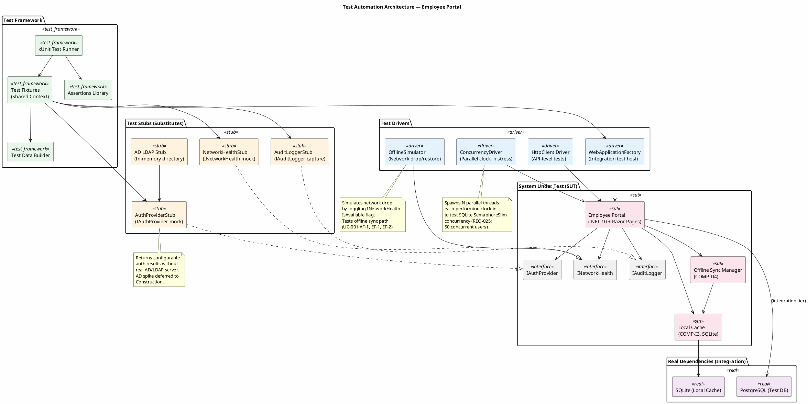
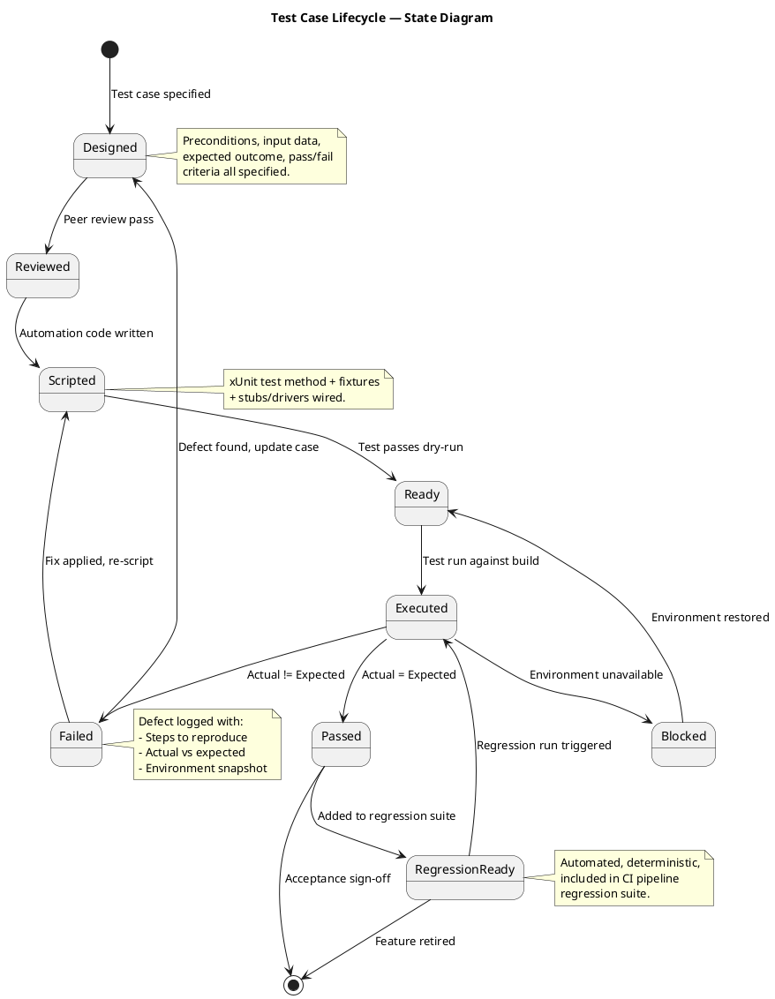
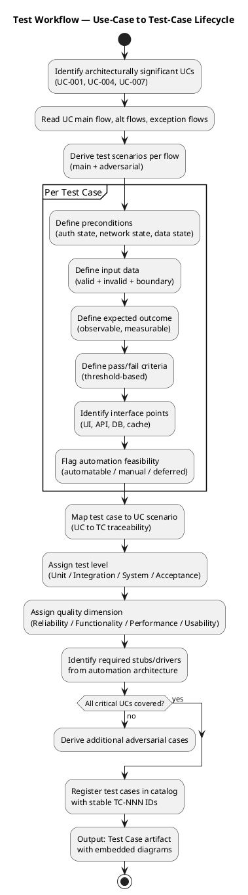

## Document Control

| Field | Value |
|---|---|
| Phase | Elaboration |
| Status | Draft |
| Iteration | 1 (Cycle 1) |
| Milestone Target | End of Elaboration (LCA) |
| Author | Test Designer |

## Test Scope

### Purpose

This artifact defines the test case catalog for the Employee Portal architecture baseline. Each test case traces to a use-case scenario (main flow, alternative flow, or exception flow) from the Use-Case Model and targets a **plausible failure mode** — not a confirmation that the system works. The test model is the verification counterpart of the use-case model.

### Architecturally Significant Use Cases Under Test

| UC ID | Name | Architectural Significance | Risk Priority |
|---|---|---|---|
| UC-001 | Clock In/Out | Offline sync (COMP-D4/COMP-I3/COMP-I5), SQLite concurrency, cached session | RISK-T01 (RPN 40) — highest |
| UC-004 | Publish News | Audit trail mechanism (IAuditLogger/AuditInterceptor) | RISK-T04 — medium |
| UC-007 | Manage Directory | Audit trail + AD sync conflict handling, override flag | RISK-T02 (RPN 35) — high |

### Measurable Testing Goals per Quality Dimension

| Dimension | Goal ID | Measurable Threshold | Source NFR |
|---|---|---|---|
| Functionality | TG-F1 | 100% of UC-001 main flow + AF-1 + AF-2 + EF-1 + EF-2 scenarios covered by executable test cases | UC-001 spec |
| Functionality | TG-F2 | 100% of UC-004 and UC-007 audit trail operations verified (entry created, fields logged) | REQ-004, REQ-005, REQ-006 |
| Reliability | TG-R1 | Offline clock-in/out succeeds for 100% of test runs with network drop ≤5 min; zero data loss on sync restore | REQ-013 |
| Reliability | TG-R2 | Sync conflict (EF-2) detected and flagged in 100% of conflict scenarios; original timestamp preserved | UC-001 EF-2 |
| Performance | TG-P1 | Clock in/out response time ≤1 second for 95th percentile under 50 concurrent users | REQ-008, REQ-025 |
| Performance | TG-P2 | Page load time ≤3 seconds for 95th percentile under 50 concurrent users | REQ-008, REQ-025 |
| Performance | TG-P3 | Directory search response ≤2 seconds (acceptance criterion: find colleague in <10s total) | REQ-018 |
| Usability | TG-U1 | Employee completes clock-in with ≤3 clicks from home page (acceptance criterion: no prior training) | AC-004, REQ-009 |

### Test Types Mapped to Quality Dimensions

| Test Type | Quality Dimension | Test Level | Description |
|---|---|---|---|
| Functional Test | Functionality | Unit, Integration, System | Verify each UC flow produces correct observable output |
| Boundary Value Test | Functionality | Unit | Test edge cases: empty search, max field length, first/last day of month |
| Adversarial / Negative Test | Functionality, Reliability | Integration, System | Invalid inputs, expired sessions, concurrent duplicate clockings |
| Offline Sync Test | Reliability | Integration | Network drop simulation, queue integrity, sync-on-restore, conflict detection |
| Concurrency Test | Performance, Reliability | Integration | 50 parallel clock-in operations against SQLite with SemaphoreSlim |
| Performance Test | Performance | System | Response time measurement under load (xUnit + BenchmarkDotNet) |
| Audit Trail Test | Functionality, Reliability | Integration | Verify audit entries created on news publish, directory create/update/deactivate |
| Role-Based Access Test | Functionality, Security | Integration | Employee role blocked from admin operations; HR role permitted |
| Usability Test | Usability | Acceptance | Click-count measurement, task completion without training |

### Test Automation Architecture

The following component diagram defines the test infrastructure: framework, stubs, drivers, and real dependencies used across all test cases.

**Stubs and Drivers Summary:**

| ID | Name | Type | Substitutes / Drives | Used By Test Cases |
|---|---|---|---|---|
| STUB-01 | AuthProviderStub | Stub | IAuthProvider — returns configurable auth results | TC-001 through TC-020 (all) |
| STUB-02 | NetworkHealthStub | Stub | INetworkHealth — toggles IsAvailable flag | TC-005, TC-006, TC-007, TC-008 |
| STUB-03 | AuditLoggerStub | Stub | IAuditLogger — captures audit entries for assertion | TC-013, TC-014, TC-017, TC-018, TC-019 |
| STUB-04 | AD LDAP Stub | Stub | In-memory AD directory for user lookup | TC-001, TC-002, TC-017, TC-019 |
| DRV-01 | WebApplicationFactory | Driver | Integration test host (ASP.NET Core) | All integration-level TCs |
| DRV-02 | HttpClient Driver | Driver | API-level HTTP requests | TC-003, TC-010, TC-011, TC-012 |
| DRV-03 | OfflineSimulator | Driver | Network drop/restore simulation | TC-005, TC-006, TC-007, TC-008 |
| DRV-04 | ConcurrencyDriver | Driver | Parallel thread stress (50 users) | TC-009, TC-010 |

### Test Case Lifecycle

The following state diagram defines the lifecycle of every test case in this catalog:

### Test Workflow — UC to Test Case Derivation

The following activity diagram shows how use-case scenarios are systematically transformed into test cases:

## Test Case Catalog

### TC-001: Clock In — Main Flow (Happy Path)

| Field | Value |
|---|---|
| UC Trace | UC-001 Main Flow, Steps 1–7 |
| Test Level | Integration |
| Quality Dimension | Functionality |
| Automation | Automatable (DRV-01 + STUB-01) |
| Lifecycle State | Designed |

**Adversarial Intent:** Verify that the system does NOT silently fail to record a clock-in when the employee is in a valid state — a missing clock-in means lost payroll data.

**Preconditions:**
- Employee "Carlos Pérez" (carlos.perez@cubacorp.com) exists in AD LDAP Stub
- AuthProviderStub returns authenticated=true for this user
- Employee has no clock-in record for today (status = clocked out)
- Network is available (NetworkHealthStub.IsAvailable = true)
- PostgreSQL test DB is clean

**Input Data:**
- User clicks "Clock In" button on home page

**Expected Outcome:**
- System records timestamp with exact current time (±1 second tolerance)
- Confirmation page displays recorded time
- Clocking entry persisted in PostgreSQL with employee_id, timestamp, type=IN
- Button state changes to "Clock Out"

**Pass/Fail Criteria:**
- PASS: Timestamp recorded within 1s of click; entry queryable in DB; confirmation displayed
- FAIL: No DB entry; timestamp drift >1s; no confirmation; button state unchanged

**Interface Points:** Razor Page (HomePage), ClockingController, ClockingService, PostgreSQL (clockings table)

---

### TC-002: Clock Out — Main Flow

| Field | Value |
|---|---|
| UC Trace | UC-001 Main Flow, Steps 3–7 (clocked-in state) |
| Test Level | Integration |
| Quality Dimension | Functionality |
| Automation | Automatable (DRV-01 + STUB-01) |
| Lifecycle State | Designed |

**Adversarial Intent:** Verify that the system does NOT allow a clock-out without a prior clock-in — an orphaned clock-out corrupts monthly reports.

**Preconditions:**
- Employee "Carlos Pérez" is authenticated
- Employee has a clock-in record for today at 08:00
- Network is available

**Input Data:**
- User clicks "Clock Out" button

**Expected Outcome:**
- System records clock-out timestamp
- Confirmation displayed with clock-out time
- DB entry: type=OUT, timestamp recorded
- Button state changes to "Clock In"

**Pass/Fail Criteria:**
- PASS: Clock-out recorded; paired with existing clock-in; confirmation shown
- FAIL: Clock-out recorded without prior clock-in; no confirmation; button unchanged

**Interface Points:** HomePage, ClockingController, ClockingService, PostgreSQL

---

### TC-003: Duplicate Clock In — Alternative Flow AF-2

| Field | Value |
|---|---|
| UC Trace | UC-001 AF-2 (Already clocked in/out) |
| Test Level | Integration |
| Quality Dimension | Functionality, Reliability |
| Automation | Automatable (DRV-01 + STUB-01) |
| Lifecycle State | Designed |

**Adversarial Intent:** Verify that the system does NOT create a duplicate clock-in entry when the employee is already clocked in — duplicates corrupt payroll calculations.

**Preconditions:**
- Employee "María López" is authenticated
- Employee already has a clock-in record for today at 07:45
- Network is available

**Input Data:**
- Employee navigates to home page (should see "Clock Out" button, not "Clock In")
- Employee attempts to force a clock-in via direct API POST to /api/clocking/clockin

**Expected Outcome:**
- Home page displays "Clock Out" button (not "Clock In")
- API returns HTTP 409 Conflict with message "Already clocked in"
- No duplicate entry created in DB

**Pass/Fail Criteria:**
- PASS: No duplicate entry; 409 response; correct button displayed
- FAIL: Duplicate entry created; 200 response; or button shows "Clock In" incorrectly

**Interface Points:** HomePage, ClockingController (API endpoint), ClockingService, PostgreSQL

---

### TC-004: Clock In — Invalid Credentials (AD Auth Failure)

| Field | Value |
|---|---|
| UC Trace | UC-001 (<<include>> AD Authentication) |
| Test Level | Integration |
| Quality Dimension | Functionality, Security |
| Automation | Automatable (DRV-01 + STUB-01) |
| Lifecycle State | Designed |

**Adversarial Intent:** Verify that the system does NOT allow access with invalid credentials — authentication bypass is a critical security failure.

**Preconditions:**
- AuthProviderStub configured to return authenticated=false for "unknown.user@cubacorp.com"
- Network is available

**Input Data:**
- Username: unknown.user@cubacorp.com
- Password: wrongpassword

**Expected Outcome:**
- Login page displays "Invalid credentials" error
- No session created
- No clocking functionality accessible
- HTTP 401 returned on authentication attempt

**Pass/Fail Criteria:**
- PASS: Access denied; error message displayed; no session token
- FAIL: Any access granted; session created; or no error message

**Interface Points:** LoginPage, AuthController, IAuthProvider (stubbed)

---

### TC-005: Offline Clock In — Alternative Flow AF-1 (Network Drop ≤5 min)

| Field | Value |
|---|---|
| UC Trace | UC-001 AF-1 (Network drop, offline mode) |
| Test Level | Integration |
| Quality Dimension | Reliability |
| Automation | Automatable (DRV-01 + STUB-02 + DRV-03) |
| Lifecycle State | Designed |

**Adversarial Intent:** Verify that the system does NOT lose a clock-in timestamp when the network drops — data loss means incorrect payroll and violates REQ-013.

**Preconditions:**
- Employee "Carlos Pérez" has a valid cached session (authenticated within last 5 minutes)
- NetworkHealthStub.IsAvailable = true initially
- Employee is clocked out (no clock-in today)

**Input Data:**
1. DRV-03 (OfflineSimulator) sets NetworkHealthStub.IsAvailable = false (simulate network drop)
2. Employee clicks "Clock In" while offline
3. Wait 2 minutes (within 5-min window)
4. DRV-03 sets NetworkHealthStub.IsAvailable = true (network restored)

**Expected Outcome:**
- Clock-in succeeds while offline (no error to user)
- Timestamp recorded in local SQLite cache (COMP-I3)
- Confirmation displayed with recorded time
- On network restore: queued clocking synced to PostgreSQL
- Zero data loss: PostgreSQL entry matches local cache entry

**Pass/Fail Criteria:**
- PASS: Clock-in succeeds offline; sync completes on restore; DB entry matches cache; no data loss
- FAIL: Clock-in blocked while offline; sync fails; data loss; or timestamp mismatch between cache and DB

**Interface Points:** HomePage, OfflineSyncManager (COMP-D4), LocalCache (COMP-I3, SQLite), INetworkHealth (stubbed), PostgreSQL

---

### TC-006: Offline Session Expired — Exception Flow EF-1 (>5 min offline)

| Field | Value |
|---|---|
| UC Trace | UC-001 EF-1 (Cached session expired) |
| Test Level | Integration |
| Quality Dimension | Reliability, Security |
| Automation | Automatable (DRV-01 + STUB-02 + DRV-03) |
| Lifecycle State | Designed |

**Adversarial Intent:** Verify that the system does NOT allow clock-in after the 5-minute offline window expires — an expired session could allow unauthorized time manipulation.

**Preconditions:**
- Employee "Carlos Pérez" has a valid cached session
- NetworkHealthStub.IsAvailable = true initially

**Input Data:**
1. DRV-03 sets NetworkHealthStub.IsAvailable = false
2. Wait 6 minutes (exceeds 5-min window)
3. Employee attempts to click "Clock In"

**Expected Outcome:**
- System displays "Session expired — network connection required" message
- No timestamp recorded (neither local nor remote)
- Clock-in button disabled or hidden
- No SQLite cache entry created

**Pass/Fail Criteria:**
- PASS: Session expired message displayed; no timestamp recorded; no cache entry
- FAIL: Clock-in allowed after 5 min; timestamp recorded; or no expiration message

**Interface Points:** HomePage, OfflineSyncManager, INetworkHealth (stubbed), LocalCache

---

### TC-007: Sync Conflict on Restore — Exception Flow EF-2

| Field | Value |
|---|---|
| UC Trace | UC-001 EF-2 (Sync conflict on restore) |
| Test Level | Integration |
| Quality Dimension | Reliability |
| Automation | Automatable (DRV-01 + STUB-02 + DRV-03 + STUB-01) |
| Lifecycle State | Designed |

**Adversarial Intent:** Verify that the system does NOT silently overwrite a server-side clocking with a queued offline entry — silent overwrite loses HR's manual correction and violates data integrity.

**Preconditions:**
- Employee "Carlos Pérez" has a valid cached session
- Network drops; employee clocks in at 08:30 (queued locally)
- While offline, HR manually enters a clock-in for Carlos at 08:25 in PostgreSQL
- Network restores

**Input Data:**
1. DRV-03 sets network offline
2. Employee clocks in (timestamp T1 = 08:30, queued in SQLite)
3. Test setup: insert manual clocking in PostgreSQL at 08:25
4. DRV-03 sets network online (triggers sync)

**Expected Outcome:**
- Sync detects conflict (queued 08:30 vs server 08:25)
- Conflict flagged for HR resolution (not silently resolved)
- Employee's original timestamp (08:30) preserved in queue
- HR sees conflict notification in admin panel
- No automatic overwrite of either entry

**Pass/Fail Criteria:**
- PASS: Conflict detected; flagged for HR; both timestamps preserved; no silent overwrite
- FAIL: Silent overwrite of server entry; or queued entry discarded; or no conflict detection

**Interface Points:** OfflineSyncManager, LocalCache, PostgreSQL, AdminClockingsPage (conflict resolution UI)

---

### TC-008: Offline Clock-Out with Subsequent Sync

| Field | Value |
|---|---|
| UC Trace | UC-001 AF-1 (clock-out variant) |
| Test Level | Integration |
| Quality Dimension | Reliability |
| Automation | Automatable (DRV-01 + STUB-02 + DRV-03) |
| Lifecycle State | Designed |

**Adversarial Intent:** Verify that the system does NOT lose a clock-out timestamp during offline mode — a lost clock-out means the employee's hours cannot be calculated.

**Preconditions:**
- Employee "María López" clocked in at 08:00 (in PostgreSQL)
- Network drops at 17:00
- Employee has valid cached session

**Input Data:**
1. DRV-03 sets network offline
2. Employee clicks "Clock Out" (timestamp 17:02, queued locally)
3. DRV-03 sets network online

**Expected Outcome:**
- Clock-out succeeds offline
- On sync: clock-out entry paired with existing clock-in (08:00 → 17:02)
- PostgreSQL contains both entries; no data loss

**Pass/Fail Criteria:**
- PASS: Clock-out recorded offline; sync pairs with clock-in; both entries in PostgreSQL
- FAIL: Clock-out lost; sync fails; or pairing incorrect

**Interface Points:** HomePage, OfflineSyncManager, LocalCache, PostgreSQL

---

### TC-009: Concurrent Clock-In — 50 Parallel Users (Performance + Concurrency)

| Field | Value |
|---|---|
| UC Trace | UC-001 Main Flow (concurrent execution) |
| Test Level | Integration |
| Quality Dimension | Performance, Reliability |
| Automation | Automatable (DRV-04 + STUB-01) |
| Lifecycle State | Designed |

**Adversarial Intent:** Verify that the system does NOT corrupt data or deadlock when 50 employees clock in simultaneously at the start of a workday — SQLite SemaphoreSlim concurrency is the critical mechanism.

**Preconditions:**
- 50 distinct employees configured in AD LDAP Stub
- All 50 are authenticated with valid cached sessions
- Network is available
- PostgreSQL test DB clean

**Input Data:**
- DRV-04 (ConcurrencyDriver) spawns 50 parallel threads
- Each thread performs clock-in for a distinct employee

**Expected Outcome:**
- All 50 clock-in operations complete successfully
- 50 distinct entries in PostgreSQL (no duplicates, no missing)
- 95th percentile response time ≤1 second (REQ-008)
- No SQLite deadlocks or SemaphoreSlim timeouts
- No database constraint violations

**Pass/Fail Criteria:**
- PASS: 50/50 entries recorded; p95 ≤1s; no deadlocks; no errors
- FAIL: Any entry missing or duplicated; p95 >1s; deadlock; or constraint violation

**Interface Points:** ClockingController (API), ClockingService, LocalCache (SQLite), PostgreSQL

---

### TC-010: Page Load Performance Under Load

| Field | Value |
|---|---|
| UC Trace | UC-005 Main Flow (news page load), UC-006 Main Flow (directory page load) |
| Test Level | System |
| Quality Dimension | Performance |
| Automation | Automatable (DRV-02 + DRV-04) |
| Lifecycle State | Designed |

**Adversarial Intent:** Verify that the system does NOT exceed the 3-second page load threshold under concurrent load — slow pages violate REQ-008 and reduce employee adoption (OBJ-003).

**Preconditions:**
- PostgreSQL test DB seeded with 200 employees, 50 news articles, 200 directory entries
- 50 concurrent simulated users

**Input Data:**
- DRV-04 spawns 50 threads, each requesting:
  - GET / (home page)
  - GET /news (news list page)
  - GET /directory (directory search page)

**Expected Outcome:**
- 95th percentile page load time ≤3 seconds for all three pages
- No HTTP 500 errors
- No connection pool exhaustion

**Pass/Fail Criteria:**
- PASS: p95 ≤3s for all pages; zero 500 errors; zero connection failures
- FAIL: p95 >3s for any page; any 500 error; or connection pool exhausted

**Interface Points:** Razor Pages (HomePage, NewsListPage, DirectoryPage), HttpClient Driver, PostgreSQL

---

### TC-011: View Clocking History — Current Month (UC-002)

| Field | Value |
|---|---|
| UC Trace | UC-002 Main Flow |
| Test Level | Integration |
| Quality Dimension | Functionality |
| Automation | Automatable (DRV-01 + STUB-01) |
| Lifecycle State | Designed |

**Adversarial Intent:** Verify that the system does NOT show clockings from other months or other employees — a privacy breach or incorrect data display undermines trust.

**Preconditions:**
- Employee "Carlos Pérez" authenticated
- DB seeded with Carlos's clockings: 5 entries this month, 3 entries last month
- DB also contains clockings for "María López" this month

**Input Data:**
- Employee navigates to "My History" page

**Expected Outcome:**
- Page displays only Carlos's clockings from the current month (5 entries)
- Last month's entries NOT displayed
- María's entries NOT displayed
- Entries sorted by date descending

**Pass/Fail Criteria:**
- PASS: Exactly 5 entries shown; all belong to Carlos; all from current month; sorted descending
- FAIL: Wrong count; other employee's data visible; or wrong month displayed

**Interface Points:** HistoryPage, ClockingController, ClockingService, PostgreSQL

---

### TC-012: HR Export Clockings — CSV Report (UC-003)

| Field | Value |
|---|---|
| UC Trace | UC-003 Main Flow |
| Test Level | Integration |
| Quality Dimension | Functionality |
| Automation | Automatable (DRV-02 + STUB-01) |
| Lifecycle State | Designed |

**Adversarial Intent:** Verify that the CSV export does NOT omit employees or produce malformed CSV — a broken export means HR falls back to Excel, defeating OBJ-002.

**Preconditions:**
- HR Administrator "Laura Gómez" authenticated (role=HR)
- DB seeded with clockings for 10 employees across the current month
- Some employees have incomplete pairs (clock-in without clock-out)

**Input Data:**
- HR selects current month and clicks "Export CSV"

**Expected Outcome:**
- CSV file downloaded with correct headers: employee_name, date, clock_in, clock_out
- All 10 employees' clockings included
- Incomplete pairs represented with empty clock_out field (not omitted)
- CSV parses correctly (valid format, no encoding issues)
- File contains UTF-8 BOM for Excel compatibility

**Pass/Fail Criteria:**
- PASS: All 10 employees present; valid CSV; incomplete pairs shown; UTF-8 BOM present
- FAIL: Missing employees; malformed CSV; incomplete pairs omitted; or encoding errors

**Interface Points:** AdminClockingsPage, ClockingController (export endpoint), PostgreSQL

---

### TC-013: Publish News — Main Flow with Audit Trail (UC-004)

| Field | Value |
|---|---|
| UC Trace | UC-004 Main Flow |
| Test Level | Integration |
| Quality Dimension | Functionality, Reliability |
| Automation | Automatable (DRV-01 + STUB-01 + STUB-03) |
| Lifecycle State | Designed |

**Adversarial Intent:** Verify that the system does NOT allow news publication without creating an audit trail entry — missing audit violates REQ-004 and breaks traceability for corporate communications.

**Preconditions:**
- HR Administrator "Laura Gómez" authenticated (role=HR)
- AuditLoggerStub configured to capture audit entries
- No existing news articles

**Input Data:**
- Title: "New Parking Policy"
- Body: "Starting August 1, parking lot B will be reserved for visitors."
- Category: General
- Featured: true

**Expected Outcome:**
- News article created in PostgreSQL with all fields
- AuditLoggerStub captures one audit entry with:
  - action = "PUBLISH_NEWS"
  - actor = "laura.gomez@cubacorp.com"
  - entity_id = (new article ID)
  - timestamp recorded
- Article appears on news page with banner (featured=true)

**Pass/Fail Criteria:**
- PASS: Article created; audit entry captured with all required fields; article visible on news page
- FAIL: Article created but no audit entry; or audit entry missing required fields; or article not visible

**Interface Points:** AdminNewsPage, NewsController, NewsService, IAuditLogger (stubbed), PostgreSQL

---

### TC-014: Publish News — Employee Role Blocked (RBAC)

| Field | Value |
|---|---|
| UC Trace | UC-004 (role-based access control, REQ-002) |
| Test Level | Integration |
| Quality Dimension | Functionality, Security |
| Automation | Automatable (DRV-02 + STUB-01) |
| Lifecycle State | Designed |

**Adversarial Intent:** Verify that a regular employee does NOT have access to the news publishing interface — privilege escalation is a security failure.

**Preconditions:**
- Employee "Carlos Pérez" authenticated (role=Employee, NOT HR)
- No news articles exist

**Input Data:**
- Employee attempts to navigate to /admin/news (direct URL)
- Employee attempts POST /api/news (direct API call)

**Expected Outcome:**
- GET /admin/news returns HTTP 403 Forbidden
- POST /api/news returns HTTP 403 Forbidden
- No news article created in DB
- Employee sees "Access denied" or redirect to home page

**Pass/Fail Criteria:**
- PASS: 403 on both attempts; no article created; access denied message
- FAIL: Any access granted; article created; or 200 response

**Interface Points:** AdminNewsPage, NewsController, AuthMiddleware, PostgreSQL

---

### TC-015: Read News — Category Filter (UC-005)

| Field | Value |
|---|---|
| UC Trace | UC-005 Main Flow (category filter) |
| Test Level | Integration |
| Quality Dimension | Functionality |
| Automation | Automatable (DRV-01 + STUB-01) |
| Lifecycle State | Designed |

**Adversarial Intent:** Verify that the category filter does NOT show news from other categories — incorrect filtering means employees miss relevant announcements.

**Preconditions:**
- Employee "Carlos Pérez" authenticated
- DB seeded with 8 news articles: 3 General, 2 HR, 2 IT, 1 Events
- 1 General article is featured

**Input Data:**
- Employee clicks "HR" category filter

**Expected Outcome:**
- Only 2 HR-category articles displayed
- Featured banner NOT shown for non-featured filter results (or only if HR article is featured)
- Articles sorted by date descending
- General, IT, and Events articles NOT displayed

**Pass/Fail Criteria:**
- PASS: Exactly 2 HR articles shown; sorted by date; no other categories visible
- FAIL: Wrong count; other categories visible; or incorrect sort order

**Interface Points:** NewsListPage, NewsController, NewsService, PostgreSQL

---

### TC-016: Search Directory — By Name (UC-006)

| Field | Value |
|---|---|
| UC Trace | UC-006 Main Flow |
| Test Level | Integration |
| Quality Dimension | Functionality, Performance |
| Automation | Automatable (DRV-01 + STUB-01) |
| Lifecycle State | Designed |

**Adversarial Intent:** Verify that directory search does NOT return inactive employees or expose private data — showing deactivated employees or personal data violates REQ-003 and REQ-022.

**Preconditions:**
- Employee "Carlos Pérez" authenticated
- DB seeded with 200 directory entries (active) + 5 inactive (deactivated) employees
- One entry: "Pedro Ruiz", Accountant, Finance, Havana, pruiz@cubacorp.com, ext 2205

**Input Data:**
- Search query: "Pedro"

**Expected Outcome:**
- Results include "Pedro Ruiz" entry
- Results show ONLY: name, job title, department, office, email, extension phone
- No private/personal fields displayed (no home address, no personal phone)
- Inactive employees NOT in results
- Response time ≤2 seconds (REQ-018)

**Pass/Fail Criteria:**
- PASS: Pedro Ruiz found; only corporate fields shown; no inactive employees; response ≤2s
- FAIL: Pedro missing; private data shown; inactive employee visible; or response >2s

**Interface Points:** DirectoryPage, DirectoryController, DirectoryService, PostgreSQL

---

### TC-017: Search Directory — Empty Results (Boundary)

| Field | Value |
|---|---|
| UC Trace | UC-006 Main Flow (no results scenario) |
| Test Level | Integration |
| Quality Dimension | Functionality, Usability |
| Automation | Automatable (DRV-01 + STUB-01) |
| Lifecycle State | Designed |

**Adversarial Intent:** Verify that the system does NOT crash or show an unhandled error when no results match — a crash on empty results is a reliability failure.

**Preconditions:**
- Employee "Carlos Pérez" authenticated
- DB seeded with 200 entries, none matching "Zzzz"

**Input Data:**
- Search query: "Zzzz"

**Expected Outcome:**
- Page displays "No results found" message
- No exception thrown; HTTP 200 returned
- Search box retains query text
- UI remains responsive

**Pass/Fail Criteria:**
- PASS: "No results found" displayed; HTTP 200; no exception; UI responsive
- FAIL: HTTP 500; unhandled exception; blank page; or UI frozen

**Interface Points:** DirectoryPage, DirectoryController, DirectoryService

---

### TC-018: Manage Directory — Create Entry with Audit Trail (UC-007, Scenario S1)

| Field | Value |
|---|---|
| UC Trace | UC-007 Main Flow, Scenario S1 |
| Test Level | Integration |
| Quality Dimension | Functionality, Reliability |
| Automation | Automatable (DRV-01 + STUB-01 + STUB-03) |
| Lifecycle State | Designed |

**Adversarial Intent:** Verify that the system does NOT create a directory entry without an audit trail — missing audit for directory changes violates REQ-005 and breaks corporate data traceability.

**Preconditions:**
- HR Administrator "Laura Gómez" authenticated (role=HR)
- AuditLoggerStub configured to capture entries
- No entry exists for "Pedro Ruiz"

**Input Data:**
- Name: Pedro Ruiz
- Title: Accountant
- Department: Finance
- Office: Havana
- Email: pruiz@cubacorp.com
- Extension: 2205

**Expected Outcome:**
- Directory entry created in PostgreSQL with all fields
- AuditLoggerStub captures audit entry with:
  - action = "CREATE_DIRECTORY_ENTRY"
  - actor = "laura.gomez@cubacorp.com"
  - entity_id = (new entry ID)
  - changes = JSON with all field values
  - timestamp recorded
- Pedro Ruiz now appears in directory search

**Pass/Fail Criteria:**
- PASS: Entry created; audit entry with all fields; Pedro searchable
- FAIL: Entry created without audit; audit missing fields; or entry not searchable

**Interface Points:** AdminDirectoryPage, DirectoryController, DirectoryService, IAuditLogger (stubbed), PostgreSQL

---

### TC-019: Manage Directory — AD Sync Conflict with Override (UC-007, Scenario S3)

| Field | Value |
|---|---|
| UC Trace | UC-007 Main Flow, Scenario S3 (AD sync conflict) |
| Test Level | Integration |
| Quality Dimension | Reliability, Functionality |
| Automation | Automatable (DRV-01 + STUB-01 + STUB-03 + STUB-04) |
| Lifecycle State | Designed |

**Adversarial Intent:** Verify that the system does NOT silently overwrite an HR manual override when AD sync runs — losing an override means HR's correction is undone, violating data integrity.

**Preconditions:**
- HR Administrator "Laura Gómez" authenticated
- Employee "María López" exists in directory with department=IT (synced from AD)
- AD LDAP Stub configured with María's department=IT
- AuditLoggerStub active

**Input Data:**
1. HR changes María's department from IT to Operations
2. System flags AD conflict (department is AD-synced field)
3. HR chooses "Override" option
4. HR saves
5. AD sync triggered (STUB-04 returns department=IT)

**Expected Outcome:**
- Entry saved with department=Operations and manual_override_flag=true
- Audit entry logs the override action
- AD sync does NOT overwrite department back to IT (override flag respected)
- Audit trail shows: original value (IT), new value (Operations), override=true

**Pass/Fail Criteria:**
- PASS: Department stays Operations after sync; override flag set; audit logs override; AD sync respects flag
- FAIL: AD sync overwrites to IT; override flag not set; or audit missing override info

**Interface Points:** AdminDirectoryPage, DirectoryController, DirectoryService, IAuthProvider/AD (stubbed), IAuditLogger (stubbed), PostgreSQL

---

### TC-020: Manage Directory — Deactivate Employee (UC-007, Scenario S4)

| Field | Value |
|---|---|
| UC Trace | UC-007 Main Flow, Scenario S4 |
| Test Level | Integration |
| Quality Dimension | Functionality, Reliability |
| Automation | Automatable (DRV-01 + STUB-01 + STUB-03) |
| Lifecycle State | Designed |

**Adversarial Intent:** Verify that a deactivated employee does NOT appear in directory search results — showing departed employees misleads colleagues and violates data currency expectations.

**Preconditions:**
- HR Administrator "Laura Gómez" authenticated
- Employee "Juan Pérez" exists in directory, status=active
- AuditLoggerStub active

**Input Data:**
1. HR selects Juan Pérez
2. HR clicks "Deactivate"
3. HR confirms deactivation

**Expected Outcome:**
- Juan's entry marked inactive in PostgreSQL
- Audit entry created: action="DEACTIVATE_DIRECTORY_ENTRY", actor="laura.gomez"
- Juan does NOT appear in directory search results (TC-016 search for "Juan" returns 0 active results)
- Juan's data preserved in DB (not deleted — audit trail requires retention)

**Pass/Fail Criteria:**
- PASS: Entry inactive; audit created; not in search; data preserved
- FAIL: Entry deleted (not deactivated); no audit; still in search; or data lost

**Interface Points:** AdminDirectoryPage, DirectoryController, DirectoryService, IAuditLogger (stubbed), PostgreSQL

## Test Data

### Test Data Catalog

| Data Set ID | Description | Used By | Setup Method |
|---|---|---|---|
| TD-001 | Single employee (Carlos Pérez) — clean state, no clockings | TC-001, TC-002, TC-004, TC-005, TC-006, TC-008 | Test Data Builder (TDB) — insert via fixture |
| TD-002 | Employee with existing clock-in (María López) | TC-003, TC-008 | TDB — insert employee + clock-in record |
| TD-003 | 50 distinct employees for concurrency test | TC-009 | TDB — bulk insert 50 employees with unique usernames |
| TD-004 | 200 directory entries + 5 inactive + 50 news articles | TC-010, TC-015, TC-016, TC-017 | TDB — bulk seed via SQL script |
| TD-005 | 10 employees with mixed clocking pairs (complete + incomplete) | TC-012 | TDB — insert 10 employees with varied clocking records |
| TD-006 | 8 news articles (3 General, 2 HR, 2 IT, 1 Events, 1 featured) | TC-015 | TDB — insert articles with categories and featured flag |
| TD-007 | María López with AD-synced department=IT | TC-019 | TDB — insert employee + configure AD LDAP Stub |
| TD-008 | Juan Pérez active employee for deactivation | TC-020 | TDB — insert active employee |

### Test Data Builder Pattern

All test data is constructed via the Test Data Builder (TDB) component in the test framework. The builder provides:
- **Fluent API** for constructing entities: `EmployeeBuilder.New().WithName("Carlos Pérez").WithDepartment("IT").Build()`
- **Factory methods** for common scenarios: `EmployeeBuilder.ClockedInToday()`, `EmployeeBuilder.ClockedOut()`
- **Bulk generators** for load tests: `EmployeeBuilder.Generate(count: 50)`
- **Cleanup hooks** via xUnit `IAsyncLifetime` — each test class resets the test DB to a known state

### Environment Prerequisites

| Requirement | Details |
|---|---|
| .NET 10 SDK | Required for building test project and WebApplicationFactory |
| PostgreSQL (test instance) | Separate test database; reset between test classes |
| SQLite (in-memory or temp file) | For local cache tests; in-memory preferred for speed |
| xUnit + FluentAssertions | Test framework and assertion library |
| WebApplicationFactory | ASP.NET Core integration test host |
| BenchmarkDotNet | For performance tests (TC-009, TC-010) |
| Node.js (not required) | N/A — no SPA frontend |

## Traceability

| Element | Traces From | Link Type | Traces To |
|---|---|---|---|
| TC-001 | UC-001 Main Flow | Tests | ClockingService, ClockingController, PostgreSQL |
| TC-002 | UC-001 Main Flow | Tests | ClockingService, ClockingController, PostgreSQL |
| TC-003 | UC-001 AF-2 | Tests | ClockingService, ClockingController |
| TC-004 | UC-001 (<<include>> AD Auth) | Tests | IAuthProvider (COMP-I1), AuthController |
| TC-005 | UC-001 AF-1 | Tests | OfflineSyncManager (COMP-D4), LocalCache (COMP-I3), INetworkHealth (COMP-I5) |
| TC-006 | UC-001 EF-1 | Tests | OfflineSyncManager (COMP-D4), INetworkHealth (COMP-I5) |
| TC-007 | UC-001 EF-2 | Tests | OfflineSyncManager (COMP-D4), LocalCache (COMP-I3), PostgreSQL |
| TC-008 | UC-001 AF-1 | Tests | OfflineSyncManager (COMP-D4), LocalCache (COMP-I3) |
| TC-009 | UC-001 Main Flow (concurrent) | Tests | ClockingService, LocalCache (SQLite), SemaphoreSlim |
| TC-010 | UC-005, UC-006 (page load) | Tests | Razor Pages, PostgreSQL connection pool |
| TC-011 | UC-002 Main Flow | Tests | ClockingService, HistoryPage, PostgreSQL |
| TC-012 | UC-003 Main Flow | Tests | ClockingController (export), PostgreSQL |
| TC-013 | UC-004 Main Flow | Tests | NewsService, IAuditLogger, PostgreSQL |
| TC-014 | UC-004 (RBAC, REQ-002) | Tests | AuthMiddleware, NewsController |
| TC-015 | UC-005 Main Flow (filter) | Tests | NewsService, NewsListPage, PostgreSQL |
| TC-016 | UC-006 Main Flow | Tests | DirectoryService, DirectoryPage, PostgreSQL |
| TC-017 | UC-006 Main Flow (boundary) | Tests | DirectoryService, DirectoryPage |
| TC-018 | UC-007 Scenario S1 | Tests | DirectoryService, IAuditLogger, PostgreSQL |
| TC-019 | UC-007 Scenario S3 | Tests | DirectoryService, IAuthProvider, IAuditLogger, PostgreSQL |
| TC-020 | UC-007 Scenario S4 | Tests | DirectoryService, IAuditLogger, PostgreSQL |
| TG-F1 | UC-001 (all flows) | Derives | TC-001 through TC-009 |
| TG-F2 | REQ-004, REQ-005, REQ-006 | Derives | TC-013, TC-018, TC-019, TC-020 |
| TG-R1 | REQ-013 | Derives | TC-005, TC-008 |
| TG-R2 | UC-001 EF-2 | Derives | TC-007 |
| TG-P1 | REQ-008, REQ-025 | Derives | TC-009 |
| TG-P2 | REQ-008, REQ-025 | Derives | TC-010 |
| TG-P3 | REQ-018 | Derives | TC-016 |
| TG-U1 | AC-004, REQ-009 | Derives | TC-001 (click count) |
| STUB-01 | IAuthProvider (COMP-I1) | DependsOn | All TCs requiring auth |
| STUB-02 | INetworkHealth (COMP-I5) | DependsOn | TC-005, TC-006, TC-007, TC-008 |
| STUB-03 | IAuditLogger | DependsOn | TC-013, TC-018, TC-019, TC-020 |
| DRV-01 | WebApplicationFactory | DependsOn | All integration-level TCs |
| DRV-03 | OfflineSimulator | DependsOn | TC-005, TC-006, TC-007, TC-008 |
| DRV-04 | ConcurrencyDriver | DependsOn | TC-009, TC-010 |